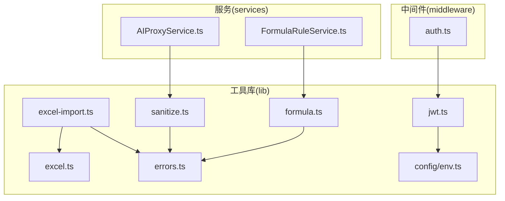
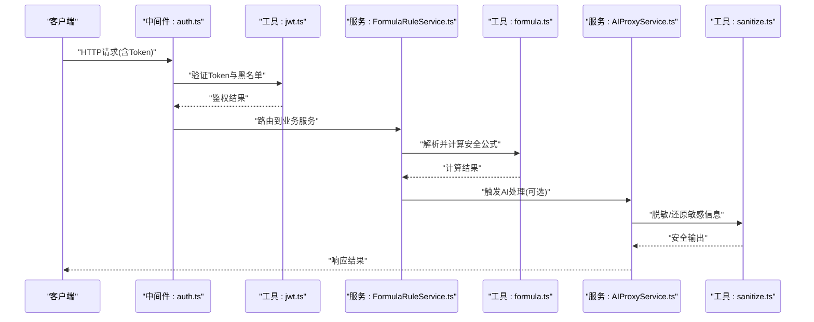
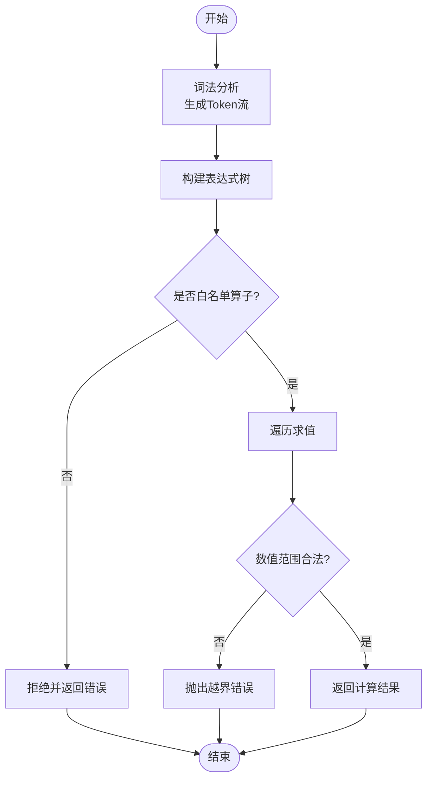
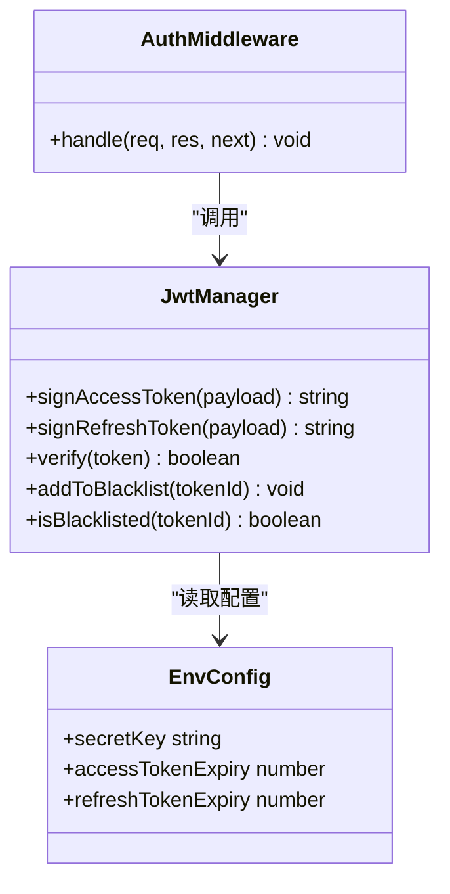
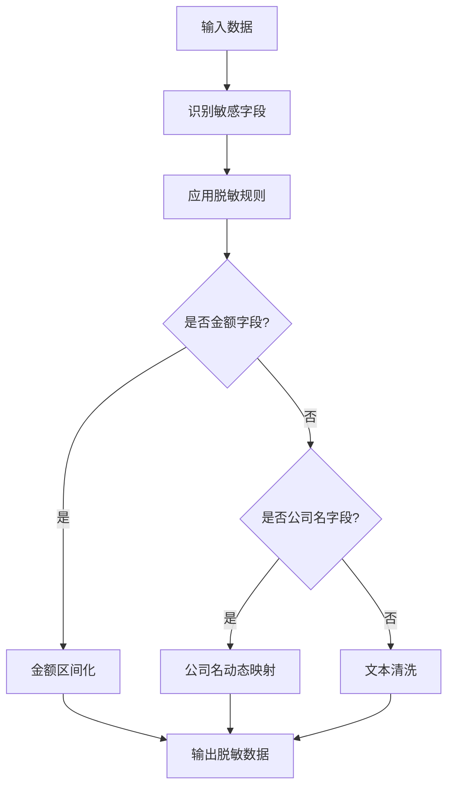
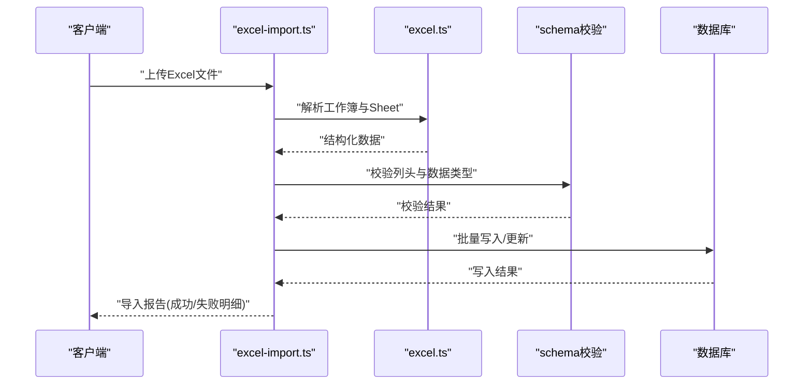
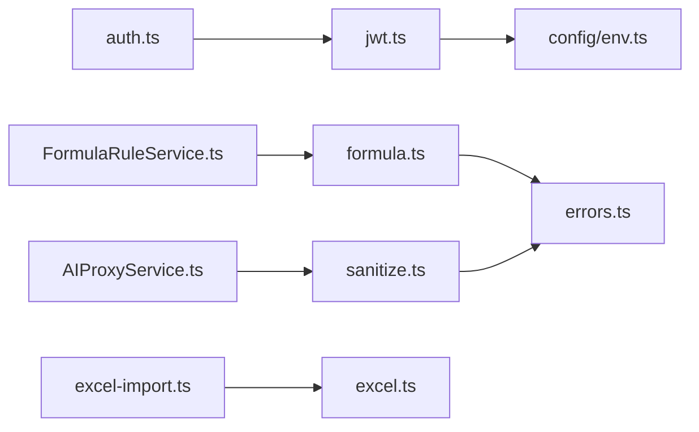

# 工具库开发

<cite>
**本文引用的文件**   
- [server/src/lib/formula.ts](file://server/src/lib/formula.ts)
- [server/src/lib/jwt.ts](file://server/src/lib/jwt.ts)
- [server/src/lib/sanitize.ts](file://server/src/lib/sanitize.ts)
- [server/src/lib/excel-import.ts](file://server/src/lib/excel-import.ts)
- [server/src/lib/excel.ts](file://server/src/lib/excel.ts)
- [server/src/lib/desensitize.test.ts](file://server/src/lib/desensitize.test.ts)
- [server/src/lib/formula.test.ts](file://server/src/lib/formula.test.ts)
- [server/src/lib/jwt.test.ts](file://server/src/lib/jwt.test.ts)
- [server/src/lib/excel-import.test.ts](file://server/src/lib/excel-import.test.ts)
- [server/src/middleware/auth.ts](file://server/src/middleware/auth.ts)
- [server/src/services/FormulaRuleService.ts](file://server/src/services/FormulaRuleService.ts)
- [server/src/services/AIProxyService.ts](file://server/src/services/AIProxyService.ts)
- [server/src/config/env.ts](file://server/src/config/env.ts)
- [server/src/lib/errors.ts](file://server/src/lib/errors.ts)
</cite>

## 目录
1. [简介](#简介)
2. [项目结构](#项目结构)
3. [核心组件](#核心组件)
4. [架构总览](#架构总览)
5. [详细组件分析](#详细组件分析)
6. [依赖关系分析](#依赖关系分析)
7. [性能考量](#性能考量)
8. [故障排查指南](#故障排查指南)
9. [结论](#结论)
10. [附录](#附录)

## 简介
本指南面向FY200工具库的开发与维护，聚焦通用工具函数的设计与组织方式，覆盖公式解析器、JWT处理、数据脱敏、Excel处理等核心能力。文档重点阐述安全公式解析器的实现原理（白名单算子与代码注入防护）、数据脱敏策略（金额区间化、公司名动态映射），并提供单元测试方法与边界条件处理建议，以及扩展点与自定义插件开发指南。

## 项目结构
FY200后端服务将通用工具函数集中在 server/src/lib 目录下，按功能域划分：
- 公式解析：formula.ts
- JWT处理：jwt.ts
- 数据脱敏：sanitize.ts
- Excel导入与导出：excel-import.ts、excel.ts
- 错误定义：errors.ts
- 配置与环境：config/env.ts

中间件与服务层通过统一接口调用这些工具，保证职责清晰、可测试性强。

图表来源
- [server/src/lib/formula.ts](file://server/src/lib/formula.ts)
- [server/src/lib/jwt.ts](file://server/src/lib/jwt.ts)
- [server/src/lib/sanitize.ts](file://server/src/lib/sanitize.ts)
- [server/src/lib/excel-import.ts](file://server/src/lib/excel-import.ts)
- [server/src/lib/excel.ts](file://server/src/lib/excel.ts)
- [server/src/lib/errors.ts](file://server/src/lib/errors.ts)
- [server/src/config/env.ts](file://server/src/config/env.ts)
- [server/src/middleware/auth.ts](file://server/src/middleware/auth.ts)
- [server/src/services/FormulaRuleService.ts](file://server/src/services/FormulaRuleService.ts)
- [server/src/services/AIProxyService.ts](file://server/src/services/AIProxyService.ts)

章节来源
- [server/src/lib/formula.ts](file://server/src/lib/formula.ts)
- [server/src/lib/jwt.ts](file://server/src/lib/jwt.ts)
- [server/src/lib/sanitize.ts](file://server/src/lib/sanitize.ts)
- [server/src/lib/excel-import.ts](file://server/src/lib/excel-import.ts)
- [server/src/lib/excel.ts](file://server/src/lib/excel.ts)
- [server/src/lib/errors.ts](file://server/src/lib/errors.ts)
- [server/src/config/env.ts](file://server/src/config/env.ts)
- [server/src/middleware/auth.ts](file://server/src/middleware/auth.ts)
- [server/src/services/FormulaRuleService.ts](file://server/src/services/FormulaRuleService.ts)
- [server/src/services/AIProxyService.ts](file://server/src/services/AIProxyService.ts)

## 核心组件
- 安全公式解析器：基于白名单算子的表达式求值，禁止任意代码执行，支持基础算术运算与括号组合，提供输入校验与错误诊断。
- JWT处理：封装访问令牌与刷新令牌的签发、校验、黑名单拦截与过期策略，配合中间件完成鉴权流程。
- 数据脱敏：对敏感字段进行规则化处理，包括金额区间化、公司名动态映射、文本清洗等，确保输出安全。
- Excel处理：统一的导入导出能力，包含模板校验、列映射、批量转换与异常回滚。

章节来源
- [server/src/lib/formula.ts](file://server/src/lib/formula.ts)
- [server/src/lib/jwt.ts](file://server/src/lib/jwt.ts)
- [server/src/lib/sanitize.ts](file://server/src/lib/sanitize.ts)
- [server/src/lib/excel-import.ts](file://server/src/lib/excel-import.ts)
- [server/src/lib/excel.ts](file://server/src/lib/excel.ts)

## 架构总览
工具库在整体系统中的位置与作用如下：
- 中间件 auth.ts 使用 jwt.ts 完成请求鉴权与黑名单检查。
- FormulaRuleService.ts 调用 formula.ts 进行公式解析与计算，保障计算口径一致与安全。
- AIProxyService.ts 在AI双管道中调用 sanitize.ts 进行脱敏与还原，保护隐私信息。
- Excel导入导出由 excel-import.ts 与 excel.ts 协同完成，为报表与看板提供数据源。

图表来源
- [server/src/middleware/auth.ts](file://server/src/middleware/auth.ts)
- [server/src/lib/jwt.ts](file://server/src/lib/jwt.ts)
- [server/src/services/FormulaRuleService.ts](file://server/src/services/FormulaRuleService.ts)
- [server/src/lib/formula.ts](file://server/src/lib/formula.ts)
- [server/src/services/AIProxyService.ts](file://server/src/services/AIProxyService.ts)
- [server/src/lib/sanitize.ts](file://server/src/lib/sanitize.ts)

## 详细组件分析

### 安全公式解析器
- 设计目标：在不允许 eval 的前提下，安全地解析与执行用户提供的公式，仅允许白名单算子（加减乘除与括号）。
- 关键机制：
  - 词法分析与语法树构建：将输入字符串转换为操作符与操作数序列，构建表达式树。
  - 白名单校验：仅允许预定义的操作符与函数，非法字符或函数直接拒绝。
  - 求值阶段：遍历表达式树执行计算，限制数值范围与精度，防止溢出与除零。
  - 错误诊断：返回清晰的错误信息与位置定位，便于前端提示与修复。
- 复杂度与性能：时间复杂度 O(n)，空间复杂度 O(n)，n为表达式长度；缓存常用子表达式以提升重复计算性能。
- 扩展点：新增算子需注册到白名单表或配置，并在解析器中增加对应节点类型与求值逻辑。

图表来源
- [server/src/lib/formula.ts](file://server/src/lib/formula.ts)

章节来源
- [server/src/lib/formula.ts](file://server/src/lib/formula.ts)
- [server/src/lib/formula.test.ts](file://server/src/lib/formula.test.ts)
- [server/src/services/FormulaRuleService.ts](file://server/src/services/FormulaRuleService.ts)

### JWT处理
- 功能要点：
  - 签发：access token短期有效（如15分钟），refresh token长期有效（如7天），支持轮转。
  - 校验：签名验证、过期检查、黑名单拦截（内存或数据库存储）。
  - 集成：中间件 auth.ts 在请求链路早期完成鉴权，失败则快速返回。
- 安全策略：
  - 最小权限原则：仅携带必要声明。
  - 黑名单机制：登出或强制下线时加入黑名单，后续请求被拒绝。
  - 环境隔离：不同环境使用独立密钥与域名策略。
- 扩展点：支持多租户、角色声明、审计日志记录。

图表来源
- [server/src/lib/jwt.ts](file://server/src/lib/jwt.ts)
- [server/src/middleware/auth.ts](file://server/src/middleware/auth.ts)
- [server/src/config/env.ts](file://server/src/config/env.ts)

章节来源
- [server/src/lib/jwt.ts](file://server/src/lib/jwt.ts)
- [server/src/middleware/auth.ts](file://server/src/middleware/auth.ts)
- [server/src/config/env.ts](file://server/src/config/env.ts)
- [server/src/lib/jwt.test.ts](file://server/src/lib/jwt.test.ts)

### 数据脱敏
- 脱敏策略：
  - 金额区间化：将绝对金额映射为区间标签（如“小于1万”、“1万-10万”等），避免泄露具体数值。
  - 公司名动态映射：根据上下文或规则将公司名替换为占位符或别名，支持多语言与本地化。
  - 文本清洗：去除HTML标签、特殊字符与潜在注入片段。
- 处理流程：
  - 识别敏感字段：通过Schema或规则表定位需要脱敏的键。
  - 应用规则：按优先级顺序执行区间化、映射与清洗。
  - 还原机制：在可信环境中按需还原原始值（如内部审计）。
- 扩展点：新增脱敏规则需注册到规则表或配置，并在处理器中增加对应策略。

图表来源
- [server/src/lib/sanitize.ts](file://server/src/lib/sanitize.ts)

章节来源
- [server/src/lib/sanitize.ts](file://server/src/lib/sanitize.ts)
- [server/src/lib/desensitize.test.ts](file://server/src/lib/desensitize.test.ts)
- [server/src/services/AIProxyService.ts](file://server/src/services/AIProxyService.ts)

### Excel处理
- 导入能力：
  - 模板校验：校验列头、数据类型与必填项。
  - 列映射：将Excel列映射到系统字段，支持别名与默认值。
  - 批量转换：数值格式化、日期解析、枚举映射。
  - 异常回滚：部分失败不影响其他行，提供详细错误报告。
- 导出能力：
  - 模板生成：根据数据结构生成标准模板。
  - 数据填充：支持分页与异步任务。
  - 格式控制：样式、合并单元格、冻结首行。
- 扩展点：新增列类型与转换器，需在映射表中注册。

图表来源
- [server/src/lib/excel-import.ts](file://server/src/lib/excel-import.ts)
- [server/src/lib/excel.ts](file://server/src/lib/excel.ts)

章节来源
- [server/src/lib/excel-import.ts](file://server/src/lib/excel-import.ts)
- [server/src/lib/excel.ts](file://server/src/lib/excel.ts)
- [server/src/lib/excel-import.test.ts](file://server/src/lib/excel-import.test.ts)

## 依赖关系分析
工具库之间的依赖关系如下：
- formula.ts 依赖 errors.ts 用于错误定义。
- jwt.ts 依赖 config/env.ts 获取密钥与过期配置。
- sanitize.ts 依赖 errors.ts 用于脱敏失败时的错误处理。
- excel-import.ts 与 excel.ts 相互协作，前者负责流程编排，后者负责底层读写。
- 中间件 auth.ts 依赖 jwt.ts 完成鉴权。
- 服务层 FormulaRuleService.ts 与 AIProxyService.ts 分别依赖 formula.ts 与 sanitize.ts。

图表来源
- [server/src/lib/formula.ts](file://server/src/lib/formula.ts)
- [server/src/lib/jwt.ts](file://server/src/lib/jwt.ts)
- [server/src/lib/sanitize.ts](file://server/src/lib/sanitize.ts)
- [server/src/lib/excel-import.ts](file://server/src/lib/excel-import.ts)
- [server/src/lib/excel.ts](file://server/src/lib/excel.ts)
- [server/src/middleware/auth.ts](file://server/src/middleware/auth.ts)
- [server/src/services/FormulaRuleService.ts](file://server/src/services/FormulaRuleService.ts)
- [server/src/services/AIProxyService.ts](file://server/src/services/AIProxyService.ts)
- [server/src/lib/errors.ts](file://server/src/lib/errors.ts)
- [server/src/config/env.ts](file://server/src/config/env.ts)

章节来源
- [server/src/lib/formula.ts](file://server/src/lib/formula.ts)
- [server/src/lib/jwt.ts](file://server/src/lib/jwt.ts)
- [server/src/lib/sanitize.ts](file://server/src/lib/sanitize.ts)
- [server/src/lib/excel-import.ts](file://server/src/lib/excel-import.ts)
- [server/src/lib/excel.ts](file://server/src/lib/excel.ts)
- [server/src/middleware/auth.ts](file://server/src/middleware/auth.ts)
- [server/src/services/FormulaRuleService.ts](file://server/src/services/FormulaRuleService.ts)
- [server/src/services/AIProxyService.ts](file://server/src/services/AIProxyService.ts)
- [server/src/lib/errors.ts](file://server/src/lib/errors.ts)
- [server/src/config/env.ts](file://server/src/config/env.ts)

## 性能考量
- 公式解析：避免递归过深，限制表达式长度与嵌套层级；对常量子表达式进行缓存。
- JWT校验：黑名单查询采用内存缓存+持久化备份，减少数据库压力。
- 数据脱敏：批量处理时使用流式API，避免一次性加载大对象。
- Excel处理：分片导入与异步任务队列，避免阻塞主线程；导出时启用压缩与分页。

## 故障排查指南
- 公式解析失败：检查白名单配置与输入合法性，查看错误定位信息。
- JWT鉴权失败：确认密钥一致、过期时间与黑名单状态。
- 脱敏异常：核对敏感字段映射与规则优先级，检查还原逻辑。
- Excel导入失败：查看列映射与数据类型转换日志，定位失败行号。

章节来源
- [server/src/lib/errors.ts](file://server/src/lib/errors.ts)
- [server/src/lib/formula.test.ts](file://server/src/lib/formula.test.ts)
- [server/src/lib/jwt.test.ts](file://server/src/lib/jwt.test.ts)
- [server/src/lib/desensitize.test.ts](file://server/src/lib/desensitize.test.ts)
- [server/src/lib/excel-import.test.ts](file://server/src/lib/excel-import.test.ts)

## 结论
FY200工具库以安全、可扩展与高性能为核心目标，通过白名单公式解析、JWT鉴权、数据脱敏与Excel处理等模块，构建了稳定可靠的通用能力。建议在扩展新算子、脱敏规则与Excel列类型时，遵循现有注册机制与测试规范，确保系统的一致性与可维护性。

## 附录
- 单元测试方法：
  - 公式解析：覆盖正常表达式、非法字符、越界数值、除零等场景。
  - JWT：覆盖签发、校验、黑名单、过期与轮转。
  - 脱敏：覆盖金额区间边界、公司名映射、文本清洗。
  - Excel：覆盖模板校验、列映射、批量转换与异常回滚。
- 边界条件处理：
  - 空输入与超长输入的处理策略。
  - 数值精度与舍入规则。
  - 并发与锁机制（如黑名单更新）。
- 自定义插件开发：
  - 新增算子：在公式解析器中注册新节点类型与求值逻辑。
  - 新增脱敏规则：在 sanitize.ts 中注册策略并配置优先级。
  - 新增Excel转换器：在 excel-import.ts 中注册列类型与转换函数。