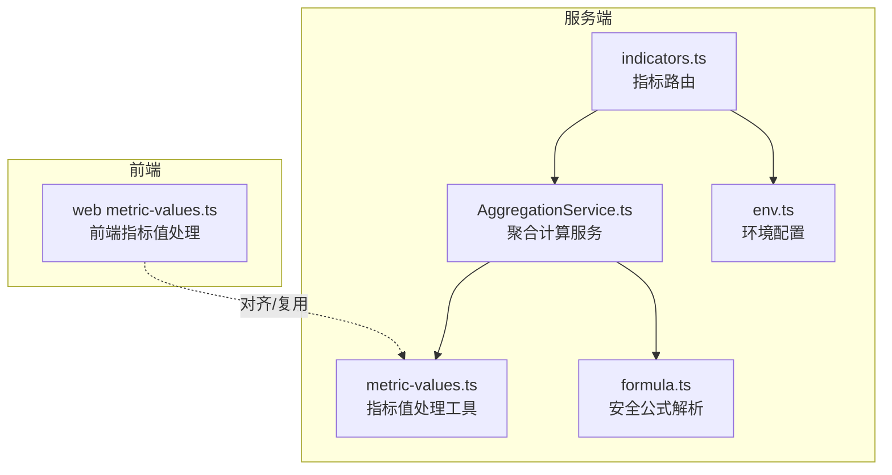
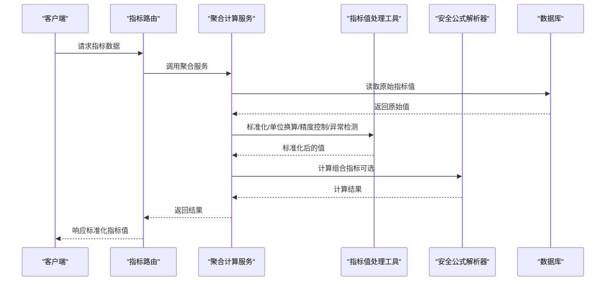
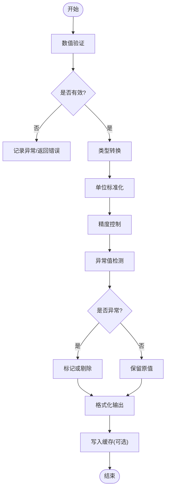
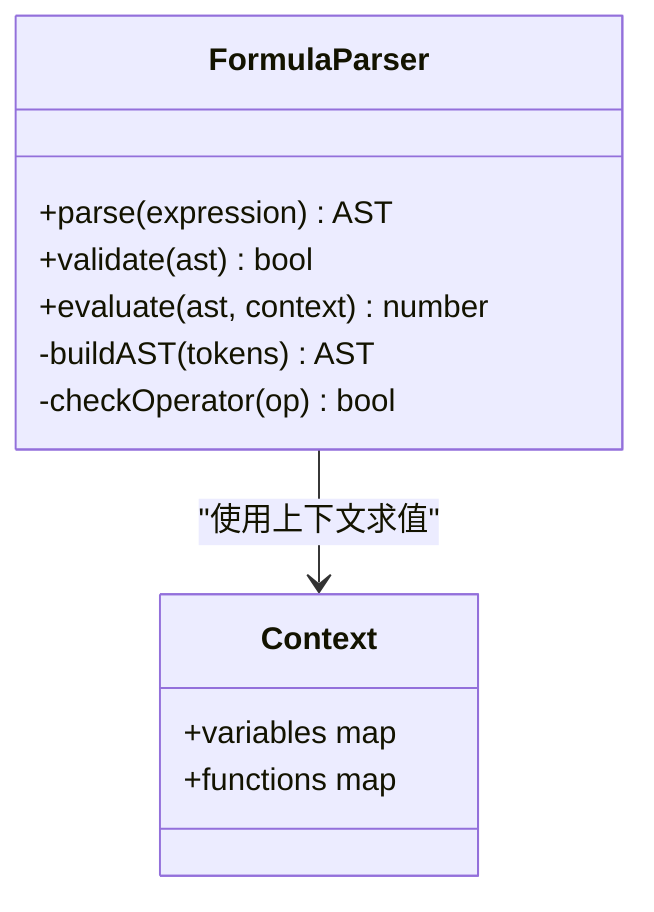
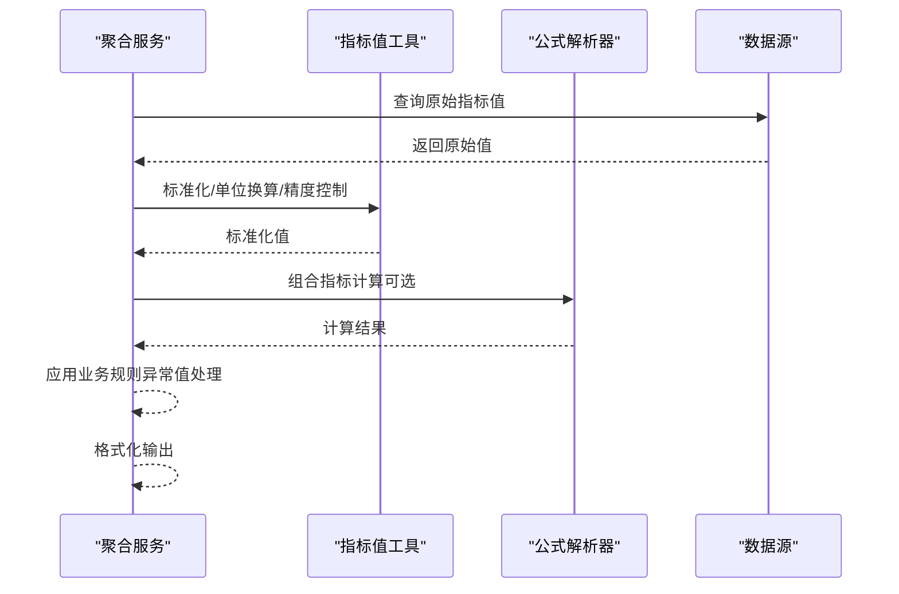
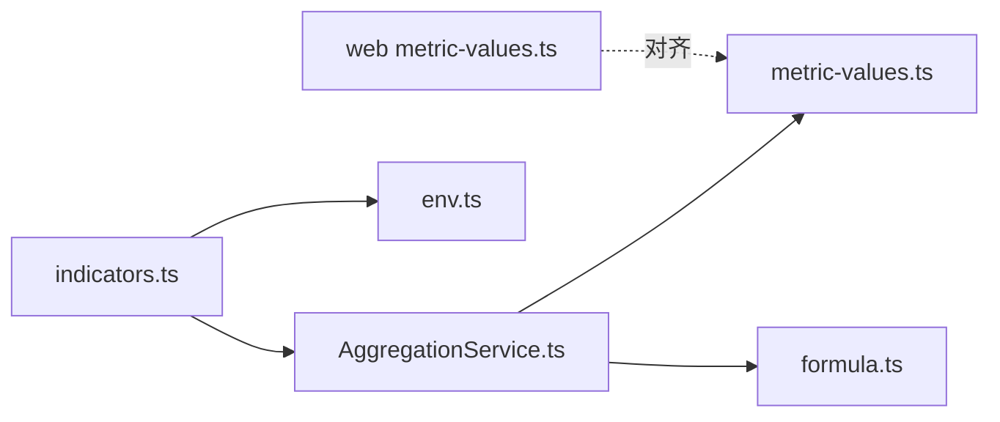

# 指标值处理

<cite>
**本文引用的文件**   
- [server/src/lib/metric-values.ts](file://server/src/lib/metric-values.ts)
- [server/src/lib/metric-values.test.ts](file://server/src/lib/metric-values.test.ts)
- [server/src/lib/formula.ts](file://server/src/lib/formula.ts)
- [server/src/lib/formula.test.ts](file://server/src/lib/formula.test.ts)
- [server/src/services/AggregationService.ts](file://server/src/services/AggregationService.ts)
- [server/src/services/AggregationService.calc.test.ts](file://server/src/services/AggregationService.calc.test.ts)
- [server/src/services/AggregationService.static.test.ts](file://server/src/services/AggregationService.static.test.ts)
- [server/src/services/AggregationService.ytd.test.ts](file://server/src/services/AggregationService.ytd.test.ts)
- [server/src/routes/indicators.ts](file://server/src/routes/indicators.ts)
- [server/src/config/env.ts](file://server/src/config/env.ts)
- [web/src/lib/metric-values.ts](file://web/src/lib/metric-values.ts)
</cite>

## 目录
1. [简介](#简介)
2. [项目结构](#项目结构)
3. [核心组件](#核心组件)
4. [架构总览](#架构总览)
5. [详细组件分析](#详细组件分析)
6. [依赖关系分析](#依赖关系分析)
7. [性能考量](#性能考量)
8. [故障排查指南](#故障排查指南)
9. [结论](#结论)
10. [附录](#附录)

## 简介
本文件面向FY200财年经营数据分析平台的“指标值处理工具库”，聚焦以下能力：
- 指标值标准化与单位转换（统一为万元/人民币）
- 精度控制与格式化输出
- 数值验证规则与异常值检测算法
- 批量指标处理、缓存策略与性能优化
- 指标计算最佳实践与常见问题解决方案

平台定位“Excel进、看板/报表出”，后端技术栈为Express + Prisma + PostgreSQL，计算类指标使用安全公式解析（白名单算子），同比/环比由后端实时计算不入库。

## 项目结构
围绕指标值处理的代码主要分布在服务端工具库与服务层：
- 工具库：指标值处理、公式解析等
- 服务层：聚合计算、YTD/静态指标计算、测试用例
- 路由层：对外暴露的指标相关接口
- 前端工具库：前端侧的指标值处理辅助

图表来源
- [server/src/lib/metric-values.ts](file://server/src/lib/metric-values.ts)
- [server/src/lib/formula.ts](file://server/src/lib/formula.ts)
- [server/src/services/AggregationService.ts](file://server/src/services/AggregationService.ts)
- [server/src/routes/indicators.ts](file://server/src/routes/indicators.ts)
- [server/src/config/env.ts](file://server/src/config/env.ts)
- [web/src/lib/metric-values.ts](file://web/src/lib/metric-values.ts)

章节来源
- [server/src/lib/metric-values.ts](file://server/src/lib/metric-values.ts)
- [server/src/lib/formula.ts](file://server/src/lib/formula.ts)
- [server/src/services/AggregationService.ts](file://server/src/services/AggregationService.ts)
- [server/src/routes/indicators.ts](file://server/src/routes/indicators.ts)
- [server/src/config/env.ts](file://server/src/config/env.ts)
- [web/src/lib/metric-values.ts](file://web/src/lib/metric-values.ts)

## 核心组件
- 指标值处理工具（metric-values）
  - 负责数值校验、类型转换、单位换算（元→万元）、精度控制、格式化输出、异常值检测与过滤、批量处理与缓存
- 安全公式解析器（formula）
  - 基于白名单算子的表达式求值，禁止eval，保障计算安全
- 聚合计算服务（AggregationService）
  - 提供静态指标、YTD、同比/环比等计算能力，调用指标值工具进行标准化与格式化
- 指标路由（indicators）
  - 暴露REST接口，串联鉴权、权限、范围、软删除、审计等中间件后进入服务层
- 前端指标值工具（web metric-values）
  - 与后端保持一致的数值处理逻辑，确保前后端展示一致

章节来源
- [server/src/lib/metric-values.ts](file://server/src/lib/metric-values.ts)
- [server/src/lib/metric-values.test.ts](file://server/src/lib/metric-values.test.ts)
- [server/src/lib/formula.ts](file://server/src/lib/formula.ts)
- [server/src/lib/formula.test.ts](file://server/src/lib/formula.test.ts)
- [server/src/services/AggregationService.ts](file://server/src/services/AggregationService.ts)
- [server/src/services/AggregationService.calc.test.ts](file://server/src/services/AggregationService.calc.test.ts)
- [server/src/services/AggregationService.static.test.ts](file://server/src/services/AggregationService.static.test.ts)
- [server/src/services/AggregationService.ytd.test.ts](file://server/src/services/AggregationService.ytd.test.ts)
- [server/src/routes/indicators.ts](file://server/src/routes/indicators.ts)
- [web/src/lib/metric-values.ts](file://web/src/lib/metric-values.ts)

## 架构总览
指标值从数据源到展示的完整链路如下：
- 输入：原始指标值（可能含不同单位、精度、异常值）
- 处理：数值验证 → 类型转换 → 单位换算 → 精度控制 → 异常值检测 → 批量处理与缓存
- 计算：安全公式解析（如需组合指标）
- 输出：标准化后的万元/人民币数值，按配置格式输出

图表来源
- [server/src/routes/indicators.ts](file://server/src/routes/indicators.ts)
- [server/src/services/AggregationService.ts](file://server/src/services/AggregationService.ts)
- [server/src/lib/metric-values.ts](file://server/src/lib/metric-values.ts)
- [server/src/lib/formula.ts](file://server/src/lib/formula.ts)

## 详细组件分析

### 指标值处理工具（metric-values）
职责与能力：
- 数值验证规则
  - 支持数字、字符串数字、空值、NaN、Infinity等边界情况
  - 严格模式与宽松模式切换
- 数据类型转换
  - 将各类输入转换为Number或Decimal（如需要）
  - 字符串清洗（去空白、货币符号、千分位分隔符）
- 单位转换
  - 默认单位：万元；支持元→万元、百分比→小数等
  - 可配置换算系数与目标单位
- 精度控制与格式化
  - 四舍五入、截断、保留小数位数
  - 本地化格式化（千分位、货币符号、正负号）
- 异常值检测与过滤
  - 基于阈值、统计分布（均值±N倍标准差）、业务规则
  - 标记异常值并可选择剔除或替换
- 批量处理与缓存
  - 数组级处理，避免重复计算
  - 键值缓存（按指标ID+时间粒度+单位+精度）

图表来源
- [server/src/lib/metric-values.ts](file://server/src/lib/metric-values.ts)
- [server/src/lib/metric-values.test.ts](file://server/src/lib/metric-values.test.ts)

章节来源
- [server/src/lib/metric-values.ts](file://server/src/lib/metric-values.ts)
- [server/src/lib/metric-values.test.ts](file://server/src/lib/metric-values.test.ts)

### 安全公式解析器（formula）
职责与能力：
- 白名单算子：仅允许加减乘除与括号
- 表达式语法检查与AST构建
- 安全求值：禁止函数调用、变量注入、外部访问
- 错误处理：语法错误、运行时异常捕获

图表来源
- [server/src/lib/formula.ts](file://server/src/lib/formula.ts)
- [server/src/lib/formula.test.ts](file://server/src/lib/formula.test.ts)

章节来源
- [server/src/lib/formula.ts](file://server/src/lib/formula.ts)
- [server/src/lib/formula.test.ts](file://server/src/lib/formula.test.ts)

### 聚合计算服务（AggregationService）
职责与能力：
- 静态指标计算：汇总、平均、计数、极值等
- YTD计算：年初至今累计
- 同比/环比：基于时间维度对比，实时计算不入库
- 调用指标值工具进行标准化与格式化

图表来源
- [server/src/services/AggregationService.ts](file://server/src/services/AggregationService.ts)
- [server/src/services/AggregationService.calc.test.ts](file://server/src/services/AggregationService.calc.test.ts)
- [server/src/services/AggregationService.static.test.ts](file://server/src/services/AggregationService.static.test.ts)
- [server/src/services/AggregationService.ytd.test.ts](file://server/src/services/AggregationService.ytd.test.ts)

章节来源
- [server/src/services/AggregationService.ts](file://server/src/services/AggregationService.ts)
- [server/src/services/AggregationService.calc.test.ts](file://server/src/services/AggregationService.calc.test.ts)
- [server/src/services/AggregationService.static.test.ts](file://server/src/services/AggregationService.static.test.ts)
- [server/src/services/AggregationService.ytd.test.ts](file://server/src/services/AggregationService.ytd.test.ts)

### 指标路由（indicators）
职责与能力：
- 暴露REST API：获取指标值、批量处理、计算组合指标
- 中间件链：helmet → cors → express.json → rate-limit → auth → permission → scope → softDelete → audit → Service → Prisma → PostgreSQL
- 参数校验与响应封装

章节来源
- [server/src/routes/indicators.ts](file://server/src/routes/indicators.ts)

### 前端指标值工具（web metric-values）
职责与能力：
- 与后端一致的数值处理逻辑，确保展示一致性
- 轻量级格式化与单位显示
- 可选缓存与防抖

章节来源
- [web/src/lib/metric-values.ts](file://web/src/lib/metric-values.ts)

## 依赖关系分析
- 模块耦合
  - 聚合服务依赖指标值工具与公式解析器
  - 路由依赖聚合服务与环境配置
  - 前端工具与后端工具保持逻辑对齐
- 外部依赖
  - Express中间件链
  - Prisma与PostgreSQL
  - JWT认证与权限控制

图表来源
- [server/src/routes/indicators.ts](file://server/src/routes/indicators.ts)
- [server/src/services/AggregationService.ts](file://server/src/services/AggregationService.ts)
- [server/src/lib/metric-values.ts](file://server/src/lib/metric-values.ts)
- [server/src/lib/formula.ts](file://server/src/lib/formula.ts)
- [server/src/config/env.ts](file://server/src/config/env.ts)
- [web/src/lib/metric-values.ts](file://web/src/lib/metric-values.ts)

章节来源
- [server/src/routes/indicators.ts](file://server/src/routes/indicators.ts)
- [server/src/services/AggregationService.ts](file://server/src/services/AggregationService.ts)
- [server/src/lib/metric-values.ts](file://server/src/lib/metric-values.ts)
- [server/src/lib/formula.ts](file://server/src/lib/formula.ts)
- [server/src/config/env.ts](file://server/src/config/env.ts)
- [web/src/lib/metric-values.ts](file://web/src/lib/metric-values.ts)

## 性能考量
- 批量处理
  - 对数组级指标值进行向量化处理，减少循环开销
  - 使用内存池或对象池避免频繁分配
- 缓存策略
  - 键设计：指标ID + 时间粒度 + 单位 + 精度
  - TTL与失效策略：按数据更新事件或定时清理
  - 多级缓存：内存缓存 + Redis（可选）
- 精度与格式化
  - 延迟格式化：仅在输出时格式化，计算过程保持高精度
  - 避免不必要的字符串转换
- 公式计算
  - AST缓存：相同表达式复用AST
  - 上下文隔离：避免全局状态污染
- I/O优化
  - 分页与限流：避免一次性加载大量数据
  - 连接池与查询优化：Prisma连接池与索引优化

[本节为通用指导，不直接分析具体文件]

## 故障排查指南
- 数值验证失败
  - 检查输入类型与格式，确认是否包含非法字符或NaN
  - 启用严格模式以快速定位问题
- 单位转换异常
  - 核对换算系数与目标单位配置
  - 检查原始数据的单位标注
- 精度丢失
  - 确认计算过程中未过早格式化
  - 使用高精度类型（如Decimal）进行中间计算
- 异常值误判
  - 调整阈值或统计方法（均值±N倍标准差）
  - 结合业务规则进行二次校验
- 公式解析错误
  - 检查表达式语法与白名单算子
  - 查看上下文变量是否正确注入
- 缓存不一致
  - 检查缓存键设计与失效策略
  - 监控缓存命中率与过期时间

章节来源
- [server/src/lib/metric-values.test.ts](file://server/src/lib/metric-values.test.ts)
- [server/src/lib/formula.test.ts](file://server/src/lib/formula.test.ts)
- [server/src/services/AggregationService.calc.test.ts](file://server/src/services/AggregationService.calc.test.ts)
- [server/src/services/AggregationService.static.test.ts](file://server/src/services/AggregationService.static.test.ts)
- [server/src/services/AggregationService.ytd.test.ts](file://server/src/services/AggregationService.ytd.test.ts)

## 结论
FY200指标值处理工具库通过标准化的数值处理流程、安全的公式解析与高效的聚合计算，确保了指标数据的准确性、一致性与高性能。建议在生产环境中：
- 启用严格的数值验证与异常值检测
- 合理配置缓存策略与TTL
- 保持前后端处理逻辑一致
- 持续监控性能指标与错误率

[本节为总结性内容，不直接分析具体文件]

## 附录
- 最佳实践
  - 始终在计算过程中保持高精度，仅在输出时格式化
  - 使用白名单算子进行公式解析，禁止动态执行
  - 批量处理时优先使用向量化操作
  - 缓存键应包含所有影响结果的维度
- 常见问题
  - 单位混淆：明确定义默认单位与换算规则
  - 精度丢失：避免过早字符串化
  - 异常值处理：结合业务规则与统计方法
  - 缓存失效：确保数据更新时及时清理缓存

[本节为补充信息，不直接分析具体文件]