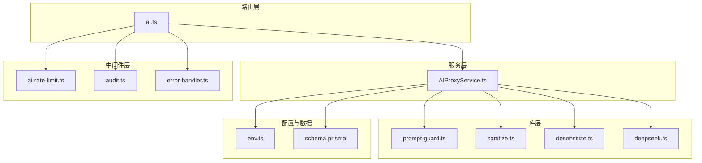
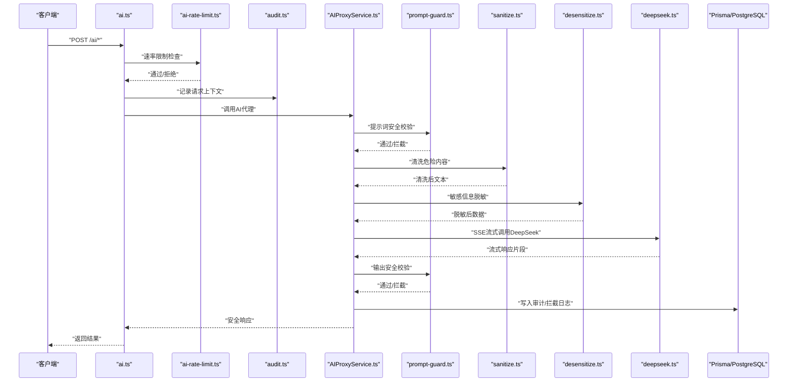
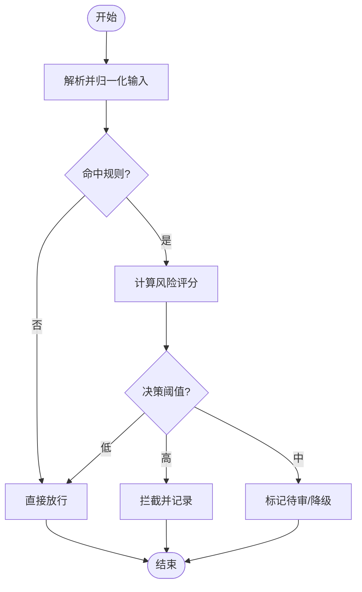
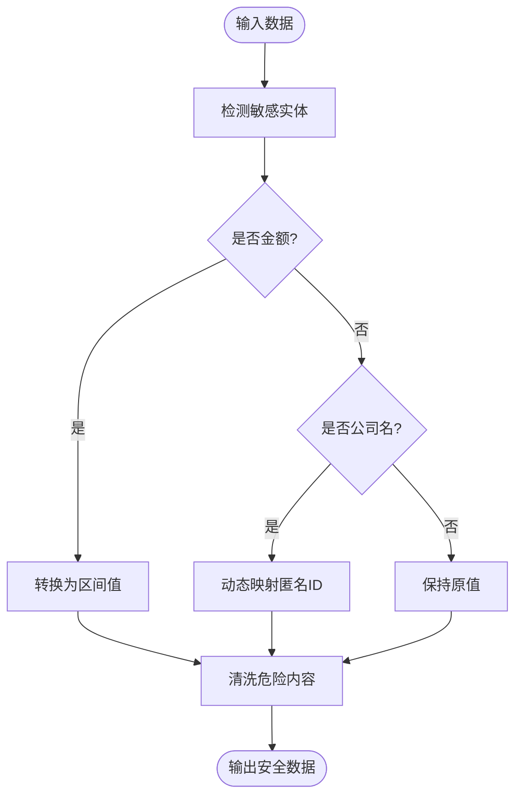
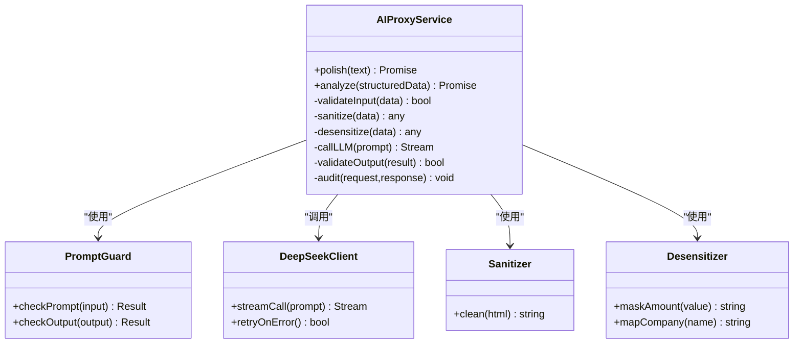
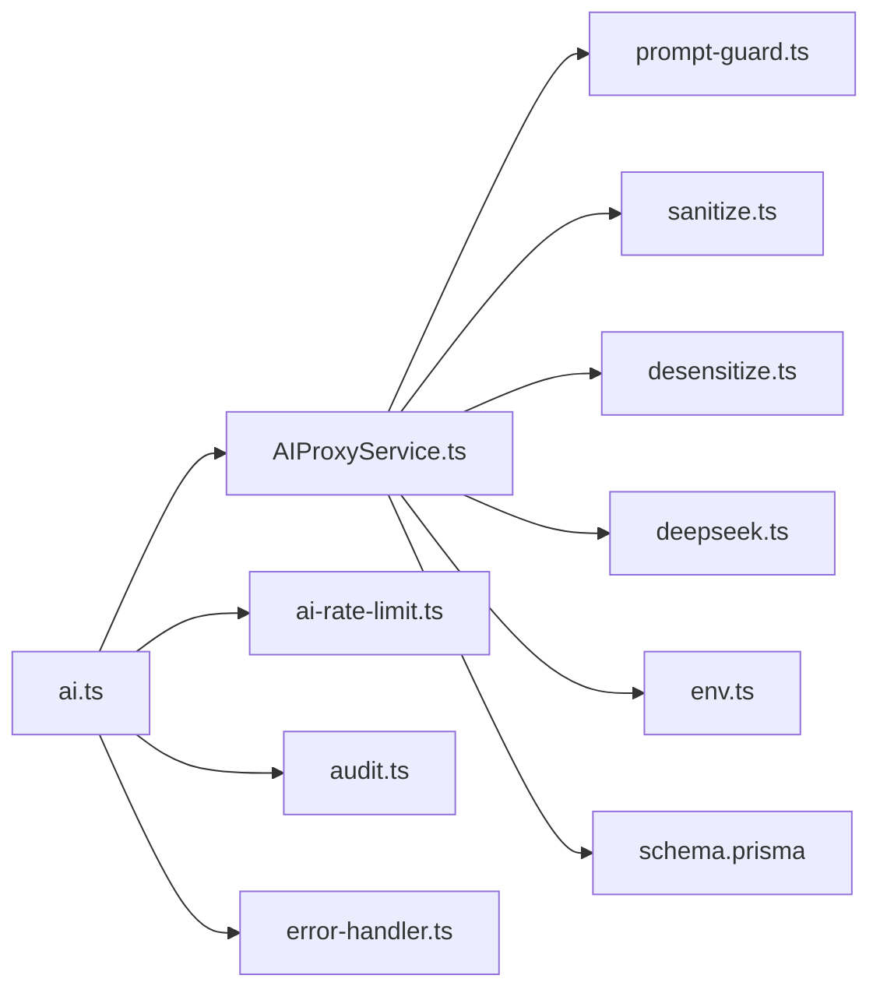

# 提示词防护

<cite>
**本文引用的文件**   
- [prompt-guard.ts](file://server/src/lib/prompt-guard.ts)
- [prompt-guard.test.ts](file://server/src/lib/prompt-guard.test.ts)
- [AIProxyService.ts](file://server/src/services/AIProxyService.ts)
- [AIProxyService.test.ts](file://server/src/services/AIProxyService.test.ts)
- [ai.ts](file://server/src/routes/ai.ts)
- [sanitize.ts](file://server/src/lib/sanitize.ts)
- [desensitize.ts](file://server/src/lib/desensitize.ts)
- [deepseek.ts](file://server/src/lib/deepseek.ts)
- [ai-rate-limit.ts](file://server/src/middleware/ai-rate-limit.ts)
- [audit.ts](file://server/src/middleware/audit.ts)
- [error-handler.ts](file://server/src/middleware/error-handler.ts)
- [env.ts](file://server/src/config/env.ts)
- [schema.prisma](file://server/prisma/schema.prisma)
</cite>

## 目录
1. [简介](#简介)
2. [项目结构](#项目结构)
3. [核心组件](#核心组件)
4. [架构总览](#架构总览)
5. [详细组件分析](#详细组件分析)
6. [依赖关系分析](#依赖关系分析)
7. [性能考虑](#性能考虑)
8. [故障排查指南](#故障排查指南)
9. [结论](#结论)
10. [附录](#附录)

## 简介
本文件面向FY200项目的“提示词防护工具库”，聚焦AI输入过滤、恶意内容检测与注入攻击防护，覆盖提示词安全规则、敏感词过滤、内容审核策略、AI请求安全验证、响应内容检查与异常行为监控。文档同时给出AI集成的安全防护最佳实践与常见威胁应对方案，帮助开发者在Polish与Analyze双管道中实现端到端的安全闭环。

## 项目结构
围绕提示词防护的关键代码位于后端服务层与中间件层：
- 提示词防护核心逻辑集中在lib层的提示词防护模块与脱敏/清洗模块
- AI代理与服务编排位于services层
- 路由入口位于routes层
- 速率限制、审计、错误处理等横切能力位于middleware层
- 配置与环境变量位于config层
- 数据模型与审计表定义位于prisma层

图表来源
- [ai.ts](file://server/src/routes/ai.ts)
- [AIProxyService.ts](file://server/src/services/AIProxyService.ts)
- [prompt-guard.ts](file://server/src/lib/prompt-guard.ts)
- [sanitize.ts](file://server/src/lib/sanitize.ts)
- [desensitize.ts](file://server/src/lib/desensitize.ts)
- [deepseek.ts](file://server/src/lib/deepseek.ts)
- [ai-rate-limit.ts](file://server/src/middleware/ai-rate-limit.ts)
- [audit.ts](file://server/src/middleware/audit.ts)
- [error-handler.ts](file://server/src/middleware/error-handler.ts)
- [env.ts](file://server/src/config/env.ts)
- [schema.prisma](file://server/prisma/schema.prisma)

章节来源
- [ai.ts](file://server/src/routes/ai.ts)
- [AIProxyService.ts](file://server/src/services/AIProxyService.ts)
- [prompt-guard.ts](file://server/src/lib/prompt-guard.ts)
- [sanitize.ts](file://server/src/lib/sanitize.ts)
- [desensitize.ts](file://server/src/lib/desensitize.ts)
- [deepseek.ts](file://server/src/lib/deepseek.ts)
- [ai-rate-limit.ts](file://server/src/middleware/ai-rate-limit.ts)
- [audit.ts](file://server/src/middleware/audit.ts)
- [error-handler.ts](file://server/src/middleware/error-handler.ts)
- [env.ts](file://server/src/config/env.ts)
- [schema.prisma](file://server/prisma/schema.prisma)

## 核心组件
- 提示词防护引擎（prompt-guard）：负责提示词安全规则校验、敏感词过滤、注入攻击检测与内容审核策略执行，提供可配置的白名单/黑名单与正则匹配能力。
- 脱敏与清洗（desensitize/sanitize）：对金额、公司名等敏感字段进行区间化与动态映射；对HTML/脚本等危险内容进行清洗。
- AI代理服务（AIProxyService）：编排Polish与Analyze双管道，串联输入校验、脱敏、LLM调用、输出校验与还原，统一错误与审计。
- DeepSeek客户端（deepseek）：封装SSE流式调用与重试、超时控制。
- 速率限制与审计（ai-rate-limit/audit）：限流防刷、请求审计记录。
- 错误处理（error-handler）：统一错误码、日志与告警。
- 配置（env）：集中管理AI开关、阈值、密钥与策略参数。
- 数据模型（schema.prisma）：定义审计日志、拦截记录等持久化结构。

章节来源
- [prompt-guard.ts](file://server/src/lib/prompt-guard.ts)
- [desensitize.ts](file://server/src/lib/desensitize.ts)
- [sanitize.ts](file://server/src/lib/sanitize.ts)
- [AIProxyService.ts](file://server/src/services/AIProxyService.ts)
- [deepseek.ts](file://server/src/lib/deepseek.ts)
- [ai-rate-limit.ts](file://server/src/middleware/ai-rate-limit.ts)
- [audit.ts](file://server/src/middleware/audit.ts)
- [error-handler.ts](file://server/src/middleware/error-handler.ts)
- [env.ts](file://server/src/config/env.ts)
- [schema.prisma](file://server/prisma/schema.prisma)

## 架构总览
下图展示从HTTP请求到LLM响应的完整安全链路，包括输入防护、脱敏、LLM调用、输出校验与审计。

图表来源
- [ai.ts](file://server/src/routes/ai.ts)
- [ai-rate-limit.ts](file://server/src/middleware/ai-rate-limit.ts)
- [audit.ts](file://server/src/middleware/audit.ts)
- [AIProxyService.ts](file://server/src/services/AIProxyService.ts)
- [prompt-guard.ts](file://server/src/lib/prompt-guard.ts)
- [sanitize.ts](file://server/src/lib/sanitize.ts)
- [desensitize.ts](file://server/src/lib/desensitize.ts)
- [deepseek.ts](file://server/src/lib/deepseek.ts)
- [schema.prisma](file://server/prisma/schema.prisma)

## 详细组件分析

### 提示词防护引擎（prompt-guard）
职责
- 提示词安全规则：基于白名单算子与禁止模式，防止SQL注入、命令注入、XSS等。
- 敏感词过滤：维护敏感词库与正则表达式集合，支持分级拦截与告警。
- 内容审核策略：结合上下文判断是否允许进入LLM或需人工复核。
- 可扩展性：支持动态加载规则、热更新与灰度策略。

关键流程
- 输入解析与归一化
- 规则匹配（白名单/黑名单/正则）
- 风险评分与决策（放行/降级/拦截）
- 审计与指标上报

图表来源
- [prompt-guard.ts](file://server/src/lib/prompt-guard.ts)
- [prompt-guard.test.ts](file://server/src/lib/prompt-guard.test.ts)

章节来源
- [prompt-guard.ts](file://server/src/lib/prompt-guard.ts)
- [prompt-guard.test.ts](file://server/src/lib/prompt-guard.test.ts)

### 脱敏与清洗（desensitize/sanitize）
职责
- 脱敏：将绝对金额替换为区间值，公司名动态映射为匿名标识，避免泄露业务细节。
- 清洗：移除或转义HTML标签、脚本、事件处理器等危险内容，确保下游安全。

关键点
- 金额区间化策略：按量级分段，保证统计可用性与隐私保护平衡。
- 公司名映射：基于租户/组织维度生成稳定匿名ID，便于关联但不暴露真实名称。
- 清洗规则：严格白名单HTML标签，禁用内联脚本与外部资源引用。

图表来源
- [desensitize.ts](file://server/src/lib/desensitize.ts)
- [sanitize.ts](file://server/src/lib/sanitize.ts)

章节来源
- [desensitize.ts](file://server/src/lib/desensitize.ts)
- [sanitize.ts](file://server/src/lib/sanitize.ts)

### AI代理服务（AIProxyService）
职责
- 编排Polish与Analyze双管道：
  - Polish：文本→脱敏→LLM→还原
  - Analyze：结构化→计算→脱敏→LLM→生成
- 统一输入校验、输出校验、错误处理与审计。
- 管理LLM会话、重试、超时与熔断。

关键流程
- 路由分发至对应管道
- 前置校验（权限、配额、提示词安全）
- 管道执行（脱敏、计算、LLM调用）
- 后置校验（输出安全、合规）
- 审计与指标上报

图表来源
- [AIProxyService.ts](file://server/src/services/AIProxyService.ts)
- [prompt-guard.ts](file://server/src/lib/prompt-guard.ts)
- [deepseek.ts](file://server/src/lib/deepseek.ts)
- [sanitize.ts](file://server/src/lib/sanitize.ts)
- [desensitize.ts](file://server/src/lib/desensitize.ts)

章节来源
- [AIProxyService.ts](file://server/src/services/AIProxyService.ts)
- [AIProxyService.test.ts](file://server/src/services/AIProxyService.test.ts)

### 路由与中间件（ai.ts, ai-rate-limit.ts, audit.ts, error-handler.ts）
职责
- ai.ts：定义AI相关API路由，挂载中间件链，转发至服务层。
- ai-rate-limit.ts：针对AI接口实施独立限流策略，防止滥用。
- audit.ts：记录请求上下文、用户身份、操作类型与结果。
- error-handler.ts：统一错误码、日志级别与告警触发。

要点
- 中间件顺序：helmet → cors → express.json → rate-limit → auth → permission → scope → softDelete → audit → Service → Prisma → PostgreSQL
- AI专用限流：区分用户/租户维度，支持突发与持续速率控制。
- 审计字段：traceId、userId、action、inputHash、outputHash、status、latency、riskScore。

章节来源
- [ai.ts](file://server/src/routes/ai.ts)
- [ai-rate-limit.ts](file://server/src/middleware/ai-rate-limit.ts)
- [audit.ts](file://server/src/middleware/audit.ts)
- [error-handler.ts](file://server/src/middleware/error-handler.ts)

### 配置与环境（env.ts）
职责
- 集中管理AI功能开关、阈值、密钥、策略参数。
- 支持多环境配置（开发/测试/生产），敏感信息通过环境变量注入。

关键项
- AI开关与模型选择
- 提示词防护阈值与黑白名单路径
- 脱敏策略参数（金额区间、公司映射表）
- DeepSeek连接参数与重试策略

章节来源
- [env.ts](file://server/src/config/env.ts)

### 数据模型（schema.prisma）
职责
- 定义审计日志、拦截记录、用户会话等数据结构。
- 支持索引与约束，保障查询性能与数据一致性。

关键字段
- 审计日志：traceId、userId、action、payloadHash、result、createdAt
- 拦截记录：ruleId、reason、score、contextHash、createdAt

章节来源
- [schema.prisma](file://server/prisma/schema.prisma)

## 依赖关系分析
- 松耦合设计：提示词防护、脱敏、清洗、LLM客户端相互独立，通过服务层编排。
- 明确边界：路由仅做调度与中间件挂载，业务逻辑下沉至服务层。
- 可观测性：审计与错误处理贯穿全链路，便于问题定位与性能优化。

图表来源
- [ai.ts](file://server/src/routes/ai.ts)
- [AIProxyService.ts](file://server/src/services/AIProxyService.ts)
- [prompt-guard.ts](file://server/src/lib/prompt-guard.ts)
- [sanitize.ts](file://server/src/lib/sanitize.ts)
- [desensitize.ts](file://server/src/lib/desensitize.ts)
- [deepseek.ts](file://server/src/lib/deepseek.ts)
- [ai-rate-limit.ts](file://server/src/middleware/ai-rate-limit.ts)
- [audit.ts](file://server/src/middleware/audit.ts)
- [error-handler.ts](file://server/src/middleware/error-handler.ts)
- [env.ts](file://server/src/config/env.ts)
- [schema.prisma](file://server/prisma/schema.prisma)

章节来源
- [ai.ts](file://server/src/routes/ai.ts)
- [AIProxyService.ts](file://server/src/services/AIProxyService.ts)
- [prompt-guard.ts](file://server/src/lib/prompt-guard.ts)
- [sanitize.ts](file://server/src/lib/sanitize.ts)
- [desensitize.ts](file://server/src/lib/desensitize.ts)
- [deepseek.ts](file://server/src/lib/deepseek.ts)
- [ai-rate-limit.ts](file://server/src/middleware/ai-rate-limit.ts)
- [audit.ts](file://server/src/middleware/audit.ts)
- [error-handler.ts](file://server/src/middleware/error-handler.ts)
- [env.ts](file://server/src/config/env.ts)
- [schema.prisma](file://server/prisma/schema.prisma)

## 性能考虑
- 提示词防护规则缓存：热点规则与正则预编译，减少匹配开销。
- 脱敏与清洗批量化：批量处理时复用上下文与映射表。
- LLM调用优化：连接池、超时控制、重试退避与熔断。
- 审计异步化：非阻塞写入，必要时落盘缓冲。
- 内存与GC：避免大对象常驻，及时释放流式数据。

[本节为通用指导，不直接分析具体文件]

## 故障排查指南
常见问题与定位步骤
- 提示词被误拦截：检查规则命中率与阈值，查看审计日志中的riskScore与ruleId。
- 脱敏过度或不足：核对脱敏策略参数与映射表，确认输入格式是否符合预期。
- LLM调用失败：检查网络、密钥、超时与重试策略，查看错误码与堆栈。
- 性能抖动：关注限流触发、数据库慢查询与GC停顿。

建议的排查工具
- 启用调试日志与TraceID追踪
- 导出审计与拦截记录进行离线分析
- 使用压测脚本模拟高并发场景

章节来源
- [error-handler.ts](file://server/src/middleware/error-handler.ts)
- [audit.ts](file://server/src/middleware/audit.ts)
- [AIProxyService.ts](file://server/src/services/AIProxyService.ts)
- [prompt-guard.ts](file://server/src/lib/prompt-guard.ts)

## 结论
FY200提示词防护工具库以“规则驱动+管道编排”为核心，构建了从输入到输出的全链路安全防护体系。通过提示词防护引擎、脱敏清洗、AI代理与中间件的协同，有效抵御注入攻击、敏感信息泄露与恶意内容传播。建议在持续演进中强化规则热更新、自适应阈值与可视化审计面板，进一步提升安全性与可运维性。

[本节为总结性内容，不直接分析具体文件]

## 附录
- 安全最佳实践
  - 最小权限原则：仅授予必要的AI访问与数据读取权限。
  - 输入即污染：所有外部输入必须经过校验与清洗。
  - 输出即信任：对LLM输出进行二次校验与脱敏。
  - 审计先行：关键操作必须记录上下文与结果。
  - 灰度发布：新规则与策略先在小流量验证。
- 常见威胁与应对
  - SQL/命令注入：白名单算子与正则黑名单双重防护。
  - XSS/脚本注入：严格HTML白名单与脚本阻断。
  - 敏感信息泄露：金额区间化与公司名匿名映射。
  - 提示词注入：上下文隔离与指令优先级控制。
  - 滥用与刷量：独立限流与配额管理。

[本节为通用指导，不直接分析具体文件]