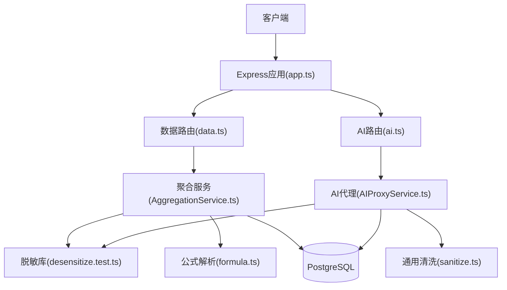
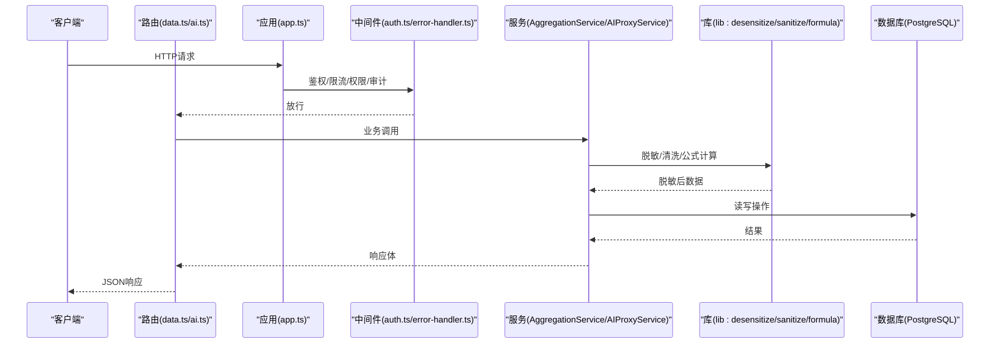
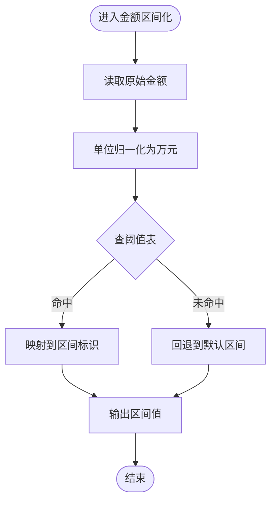
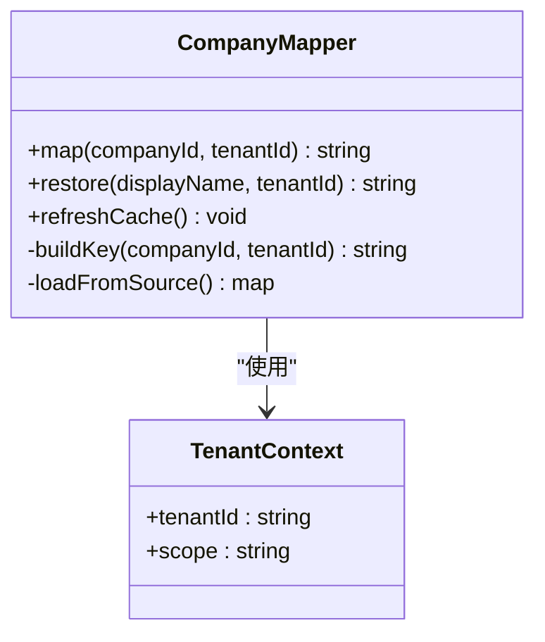
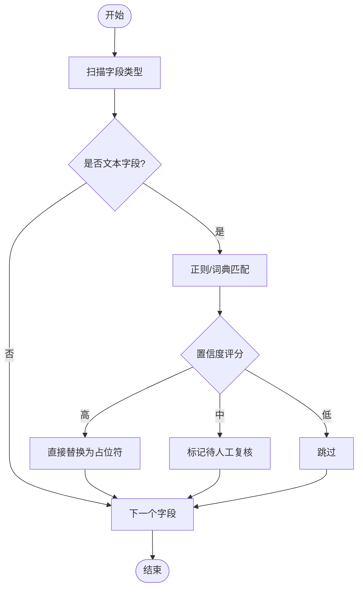
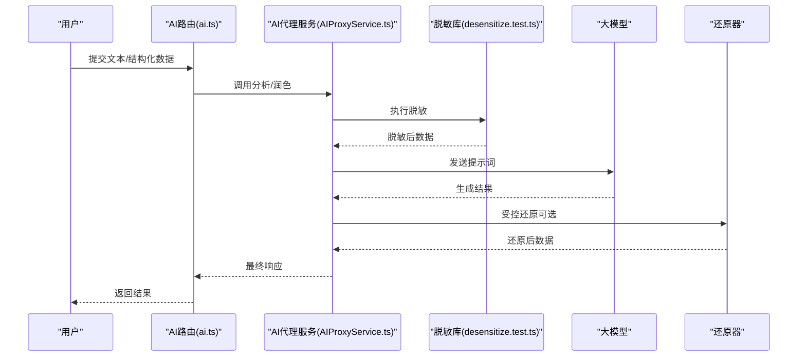
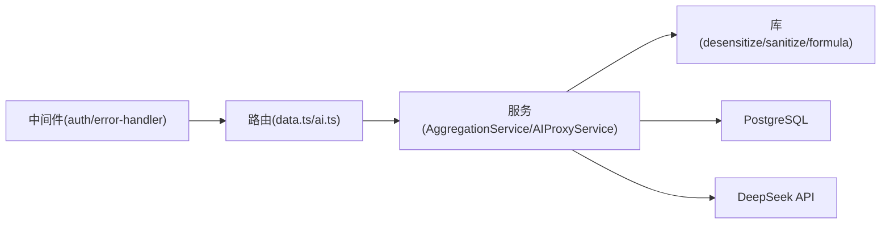

# 数据脱敏工具

<cite>
**本文引用的文件**   
- [server/src/lib/desensitize.test.ts](file://server/src/lib/desensitize.test.ts)
- [server/src/lib/sanitize.ts](file://server/src/lib/sanitize.ts)
- [server/src/lib/formula.ts](file://server/src/lib/formula.ts)
- [server/src/services/AggregationService.ts](file://server/src/services/AggregationService.ts)
- [server/src/services/AIProxyService.ts](file://server/src/services/AIProxyService.ts)
- [server/src/middleware/auth.ts](file://server/src/middleware/auth.ts)
- [server/src/middleware/error-handler.ts](file://server/src/middleware/error-handler.ts)
- [server/src/routes/data.ts](file://server/src/routes/data.ts)
- [server/src/routes/ai.ts](file://server/src/routes/ai.ts)
- [server/src/app.ts](file://server/src/app.ts)
- [server/src/server.ts](file://server/src/server.ts)
- [server/prisma/schema.prisma](file://server/prisma/schema.prisma)
</cite>

## 目录
1. [简介](#简介)
2. [项目结构](#项目结构)
3. [核心组件](#核心组件)
4. [架构总览](#架构总览)
5. [详细组件分析](#详细组件分析)
6. [依赖关系分析](#依赖关系分析)
7. [性能考量](#性能考量)
8. [故障排查指南](#故障排查指南)
9. [结论](#结论)
10. [附录](#附录)

## 简介
本文件面向FY200财年经营数据分析平台的数据脱敏工具，聚焦以下目标：
- 金额区间化算法：将绝对金额映射为安全区间，避免泄露精确数值。
- 公司名动态映射规则：基于上下文与策略对组织名称进行可逆或不可逆的动态替换。
- 敏感信息识别机制：在文本与结构化数据中自动识别并处理潜在敏感字段。
- 脱敏规则配置方式：通过配置驱动、可扩展的插件式规则体系。
- 自定义脱敏函数开发：提供统一接口与测试规范，便于扩展新规则。
- 批量数据处理策略：支持流式与批处理，兼顾吞吐与内存占用。
- 脱敏前后对比示例：给出典型输入输出对照，帮助理解效果。
- 性能优化技巧：从计算、IO、缓存等多维度提升吞吐。
- 隐私保护最佳实践：最小化暴露面、审计与访问控制。
- AI分析场景下的数据还原机制：在“polish”和“analyze”双管道中实现安全的可逆还原。

## 项目结构
FY200后端采用Express + Prisma + PostgreSQL，关键与脱敏相关的代码集中在lib与services层，路由与中间件负责接入与治理。整体调用链遵循既定顺序：helmet → cors → express.json → rate-limit → auth(JWT+黑名单) → permission(默认拒绝) → scope(Prisma extension) → softDelete → audit → Service → Prisma → PostgreSQL。

图表来源
- [server/src/app.ts](file://server/src/app.ts)
- [server/src/routes/data.ts](file://server/src/routes/data.ts)
- [server/src/routes/ai.ts](file://server/src/routes/ai.ts)
- [server/src/services/AggregationService.ts](file://server/src/services/AggregationService.ts)
- [server/src/services/AIProxyService.ts](file://server/src/services/AIProxyService.ts)
- [server/src/lib/desensitize.test.ts](file://server/src/lib/desensitize.test.ts)
- [server/src/lib/formula.ts](file://server/src/lib/formula.ts)
- [server/src/lib/sanitize.ts](file://server/src/lib/sanitize.ts)

章节来源
- [server/src/app.ts](file://server/src/app.ts)
- [server/src/server.ts](file://server/src/server.ts)
- [server/src/routes/data.ts](file://server/src/routes/data.ts)
- [server/src/routes/ai.ts](file://server/src/routes/ai.ts)
- [server/src/services/AggregationService.ts](file://server/src/services/AggregationService.ts)
- [server/src/services/AIProxyService.ts](file://server/src/services/AIProxyService.ts)
- [server/src/lib/desensitize.test.ts](file://server/src/lib/desensitize.test.ts)
- [server/src/lib/formula.ts](file://server/src/lib/formula.ts)
- [server/src/lib/sanitize.ts](file://server/src/lib/sanitize.ts)

## 核心组件
- 金额区间化模块：将数值型金额按阈值分段映射为区间标识，保证统计可用性与隐私性。
- 公司名动态映射：根据租户、组织树或外部字典进行映射，支持可逆还原（用于AI还原）与不可逆替换（用于对外展示）。
- 敏感信息识别：基于模式匹配与字段语义识别手机号、邮箱、证件号等，并提供统一替换策略。
- 公式与安全计算：白名单算子解析，禁止eval，保障指标计算安全。
- AI双管道：
  - polish：文本→脱敏→LLM→还原
  - analyze：结构化→计算→脱敏→LLM→生成
- 批量处理：分片读取、并发控制、背压与错误隔离。

章节来源
- [server/src/lib/desensitize.test.ts](file://server/src/lib/desensitize.test.ts)
- [server/src/lib/sanitize.ts](file://server/src/lib/sanitize.ts)
- [server/src/lib/formula.ts](file://server/src/lib/formula.ts)
- [server/src/services/AggregationService.ts](file://server/src/services/AggregationService.ts)
- [server/src/services/AIProxyService.ts](file://server/src/services/AIProxyService.ts)

## 架构总览
下图展示了从请求到脱敏、再到AI处理的端到端流程，以及数据落库与返回路径。

图表来源
- [server/src/app.ts](file://server/src/app.ts)
- [server/src/routes/data.ts](file://server/src/routes/data.ts)
- [server/src/routes/ai.ts](file://server/src/routes/ai.ts)
- [server/src/middleware/auth.ts](file://server/src/middleware/auth.ts)
- [server/src/middleware/error-handler.ts](file://server/src/middleware/error-handler.ts)
- [server/src/services/AggregationService.ts](file://server/src/services/AggregationService.ts)
- [server/src/services/AIProxyService.ts](file://server/src/services/AIProxyService.ts)
- [server/src/lib/desensitize.test.ts](file://server/src/lib/desensitize.test.ts)
- [server/src/lib/sanitize.ts](file://server/src/lib/sanitize.ts)
- [server/src/lib/formula.ts](file://server/src/lib/formula.ts)

## 详细组件分析

### 金额区间化算法
- 设计要点
  - 阈值分层：按业务口径定义区间边界（如0-10万、10-50万、50-200万、200万以上），支持多币种与单位换算（统一为万元）。
  - 稳定性：相同值始终映射到同一区间；跨期比较时保持区间一致性。
  - 可配置：阈值可通过配置或元数据驱动，支持热更新。
  - 可还原：在受控环境下保留映射表以实现AI还原。
- 复杂度
  - 时间复杂度O(log n)（二分查找区间）或O(1)（预计算哈希映射）。
  - 空间复杂度O(n)存储阈值与映射表。
- 优化建议
  - 对热点字段使用内存映射表。
  - 批量处理时使用向量化逻辑减少分支。

图表来源
- [server/src/lib/desensitize.test.ts](file://server/src/lib/desensitize.test.ts)
- [server/src/services/AggregationService.ts](file://server/src/services/AggregationService.ts)

章节来源
- [server/src/lib/desensitize.test.ts](file://server/src/lib/desensitize.test.ts)
- [server/src/services/AggregationService.ts](file://server/src/services/AggregationService.ts)

### 公司名动态映射规则
- 设计要点
  - 映射源：组织树、租户字典、外部主数据同步。
  - 策略：同租户内一致映射；跨租户隔离；支持别名与历史版本。
  - 可逆性：在AI还原通道中保留映射表，对外展示则使用不可逆替换。
- 实现要点
  - 键选择：公司ID、统一社会信用代码、简称组合键。
  - 冲突处理：优先级与覆盖规则明确。
  - 缓存：LRU缓存高频映射，降低DB压力。

图表来源
- [server/src/lib/desensitize.test.ts](file://server/src/lib/desensitize.test.ts)
- [server/src/services/AggregationService.ts](file://server/src/services/AggregationService.ts)

章节来源
- [server/src/lib/desensitize.test.ts](file://server/src/lib/desensitize.test.ts)
- [server/src/services/AggregationService.ts](file://server/src/services/AggregationService.ts)

### 敏感信息识别机制
- 识别范围
  - 个人敏感：手机号、邮箱、身份证号、银行卡号等。
  - 企业敏感：公司名称、税号、地址、联系人等。
  - 业务敏感：合同编号、订单号、内部编码等。
- 识别策略
  - 正则表达式与词典结合，支持白名单字段豁免。
  - 上下文感知：仅对文本字段生效，数值字段走金额区间化。
  - 分级处理：高置信度直接替换，低置信度标记待审。
- 输出格式
  - 标准化占位符，便于后续还原或审计追踪。

图表来源
- [server/src/lib/sanitize.ts](file://server/src/lib/sanitize.ts)
- [server/src/lib/desensitize.test.ts](file://server/src/lib/desensitize.test.ts)

章节来源
- [server/src/lib/sanitize.ts](file://server/src/lib/sanitize.ts)
- [server/src/lib/desensitize.test.ts](file://server/src/lib/desensitize.test.ts)

### 脱敏规则配置方式
- 配置项
  - 金额区间阈值表：数组或对象形式，支持多币种与单位。
  - 公司映射字典：键值对或远程API同步。
  - 敏感字段清单：字段级开关与策略。
  - 还原开关：是否允许AI还原通道使用映射表。
- 加载顺序
  - 环境变量 → 配置文件 → 运行时注入 → 缓存。
- 校验与回滚
  - 启动时校验配置合法性，失败则回退到默认策略。
  - 热更新需具备幂等与灰度能力。

章节来源
- [server/src/lib/desensitize.test.ts](file://server/src/lib/desensitize.test.ts)
- [server/src/lib/sanitize.ts](file://server/src/lib/sanitize.ts)

### 自定义脱敏函数的开发方法
- 接口约定
  - 输入：原始值、上下文（租户、字段元数据）、配置。
  - 输出：脱敏后的值与元数据（是否可还原、置信度）。
- 开发步骤
  - 新建函数文件，实现统一签名。
  - 编写单元测试，覆盖边界与异常。
  - 注册到规则引擎，启用开关。
- 测试要求
  - 正向用例、反例、性能基准、回归用例。

章节来源
- [server/src/lib/desensitize.test.ts](file://server/src/lib/desensitize.test.ts)

### 批量数据处理策略
- 策略
  - 分片读取：按批次大小切分，避免一次性加载全量。
  - 并发控制：限制并发数，防止资源耗尽。
  - 背压：下游慢时自动降速。
  - 错误隔离：单条失败不影响整批，记录重试队列。
- 监控
  - 吞吐、延迟、错误率、内存峰值。
  - 告警阈值与自动熔断。

章节来源
- [server/src/services/AggregationService.ts](file://server/src/services/AggregationService.ts)

### 脱敏前后数据对比示例
- 金额字段
  - 原始：1234567.89（元）
  - 脱敏：[100万,200万)
- 公司名
  - 原始：浙江壹品慧科技有限公司
  - 脱敏：T-ORG-001
  - 还原（受控）：浙江壹品慧科技有限公司
- 文本字段
  - 原始：联系邮箱 zhangsan@example.com
  - 脱敏：联系邮箱 [EMAIL]

说明：以上为概念示例，实际输出由配置与上下文决定。

### AI分析场景下的数据还原机制
- 双管道
  - polish：文本→脱敏→LLM→还原
  - analyze：结构化→计算→脱敏→LLM→生成
- 还原流程
  - 在受控通道中携带映射表与密钥，确保仅内部可用。
  - 还原前进行权限校验与审计记录。
  - 还原后再次脱敏再返回给非授权用户。

图表来源
- [server/src/routes/ai.ts](file://server/src/routes/ai.ts)
- [server/src/services/AIProxyService.ts](file://server/src/services/AIProxyService.ts)
- [server/src/lib/desensitize.test.ts](file://server/src/lib/desensitize.test.ts)

章节来源
- [server/src/routes/ai.ts](file://server/src/routes/ai.ts)
- [server/src/services/AIProxyService.ts](file://server/src/services/AIProxyService.ts)
- [server/src/lib/desensitize.test.ts](file://server/src/lib/desensitize.test.ts)

## 依赖关系分析
- 组件耦合
  - 路由层依赖服务层，服务层依赖库层，库层无外部框架耦合。
  - 中间件贯穿所有请求，负责鉴权、限流、审计。
- 外部依赖
  - PostgreSQL：数据存储与查询。
  - DeepSeek API：AI推理（SSE流式）。
- 循环依赖检查
  - 库层不反向依赖服务层，避免循环。

图表来源
- [server/src/routes/data.ts](file://server/src/routes/data.ts)
- [server/src/routes/ai.ts](file://server/src/routes/ai.ts)
- [server/src/services/AggregationService.ts](file://server/src/services/AggregationService.ts)
- [server/src/services/AIProxyService.ts](file://server/src/services/AIProxyService.ts)
- [server/src/lib/desensitize.test.ts](file://server/src/lib/desensitize.test.ts)
- [server/src/lib/sanitize.ts](file://server/src/lib/sanitize.ts)
- [server/src/lib/formula.ts](file://server/src/lib/formula.ts)
- [server/src/middleware/auth.ts](file://server/src/middleware/auth.ts)
- [server/src/middleware/error-handler.ts](file://server/src/middleware/error-handler.ts)

章节来源
- [server/src/routes/data.ts](file://server/src/routes/data.ts)
- [server/src/routes/ai.ts](file://server/src/routes/ai.ts)
- [server/src/services/AggregationService.ts](file://server/src/services/AggregationService.ts)
- [server/src/services/AIProxyService.ts](file://server/src/services/AIProxyService.ts)
- [server/src/lib/desensitize.test.ts](file://server/src/lib/desensitize.test.ts)
- [server/src/lib/sanitize.ts](file://server/src/lib/sanitize.ts)
- [server/src/lib/formula.ts](file://server/src/lib/formula.ts)
- [server/src/middleware/auth.ts](file://server/src/middleware/auth.ts)
- [server/src/middleware/error-handler.ts](file://server/src/middleware/error-handler.ts)

## 性能考量
- 计算优化
  - 金额区间化使用预计算映射表与二分查找。
  - 公司名映射使用LRU缓存，减少DB访问。
  - 公式解析采用白名单算子，避免昂贵解析开销。
- IO优化
  - 批量处理采用分片与并发控制，避免内存峰值。
  - 数据库查询使用索引与投影，减少数据传输。
- 缓存策略
  - 热点配置与映射表常驻内存。
  - 短生命周期缓存配合过期策略。
- 监控与调优
  - 采集QPS、P95/P99延迟、错误率、GC停顿。
  - 针对瓶颈进行水平扩展或垂直升级。

## 故障排查指南
- 常见问题
  - 脱敏后数据不可用：检查区间阈值配置与单位换算。
  - 公司名映射不一致：确认租户上下文与映射字典版本。
  - 敏感信息未识别：检查正则与字段白名单。
  - AI还原失败：核对权限、密钥与映射表可用性。
- 日志与审计
  - 记录脱敏操作、还原操作与异常堆栈。
  - 审计日志包含用户、租户、时间戳、操作类型。
- 恢复策略
  - 配置回滚至上一稳定版本。
  - 错误隔离与重试队列。

章节来源
- [server/src/middleware/error-handler.ts](file://server/src/middleware/error-handler.ts)
- [server/src/middleware/auth.ts](file://server/src/middleware/auth.ts)

## 结论
FY200数据脱敏工具以配置驱动与插件式扩展为核心，实现了金额区间化、公司名动态映射与敏感信息识别的统一能力。通过AI双管道的安全还原机制，既满足分析需求又保障隐私合规。建议在上线前完成充分测试与性能调优，持续监控与迭代优化。

## 附录
- 数据模型参考
  - 组织与公司映射、租户上下文、审计日志等实体定义见数据库Schema。

章节来源
- [server/prisma/schema.prisma](file://server/prisma/schema.prisma)