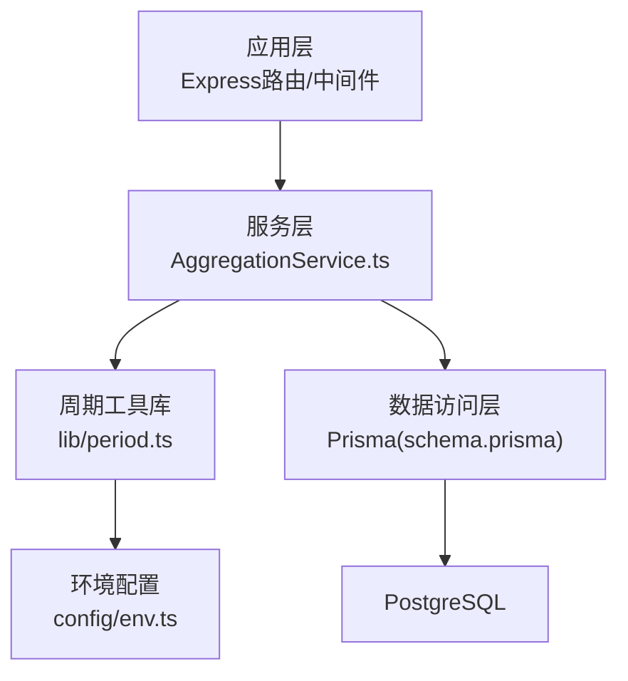
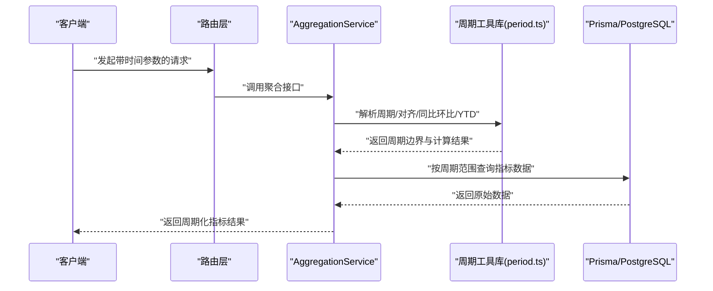
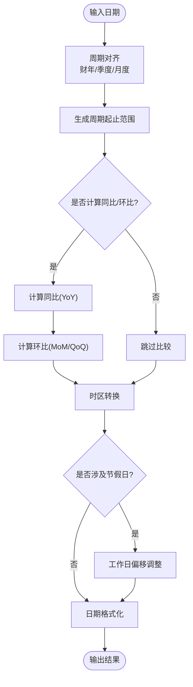
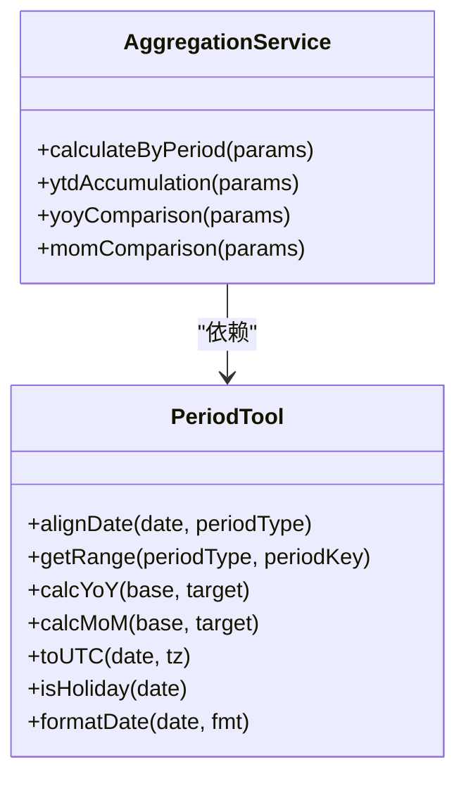
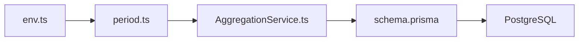

# 时间周期计算

<cite>
**本文引用的文件**
- [period.ts](file://server/src/lib/period.ts)
- [period.test.ts](file://server/src/lib/period.test.ts)
- [AggregationService.ts](file://server/src/services/AggregationService.ts)
- [AggregationService.ytd.test.ts](file://server/src/services/AggregationService.ytd.test.ts)
- [env.ts](file://server/src/config/env.ts)
- [schema.prisma](file://server/prisma/schema.prisma)
</cite>

## 目录
1. [简介](#简介)
2. [项目结构](#项目结构)
3. [核心组件](#核心组件)
4. [架构总览](#架构总览)
5. [详细组件分析](#详细组件分析)
6. [依赖关系分析](#依赖关系分析)
7. [性能考量](#性能考量)
8. [故障排查指南](#故障排查指南)
9. [结论](#结论)
10. [附录](#附录)

## 简介
本文件面向“FY200时间周期计算工具库”，围绕财年（FY）与会计年度（AOY）的周期计算、同比/环比方法、日期范围查询与时区处理进行系统化说明。文档同时覆盖周期对齐算法、节假日处理、财务年度特殊规则，以及日期格式化、周期比较与批量日期计算的性能优化建议，并给出财务分析场景下的最佳实践。

## 项目结构
本项目后端位于 server 目录，时间周期计算的核心实现集中在 lib/period.ts，测试用例在 period.test.ts；聚合服务 AggregationService 使用周期能力进行指标计算与YTD等口径处理；环境配置 env.ts 提供时区与业务参数；数据库模型 schema.prisma 定义相关字段类型与约束。

图表来源
- [AggregationService.ts](file://server/src/services/AggregationService.ts)
- [period.ts](file://server/src/lib/period.ts)
- [env.ts](file://server/src/config/env.ts)
- [schema.prisma](file://server/prisma/schema.prisma)

章节来源
- [period.ts](file://server/src/lib/period.ts)
- [period.test.ts](file://server/src/lib/period.test.ts)
- [AggregationService.ts](file://server/src/services/AggregationService.ts)
- [env.ts](file://server/src/config/env.ts)
- [schema.prisma](file://server/prisma/schema.prisma)

## 核心组件
- 周期工具库（lib/period.ts）：提供财年/会计年度起止、周期对齐、同比/环比、日期范围生成、时区转换、节假日判断与偏移等基础能力。
- 聚合服务（services/AggregationService.ts）：基于周期工具库进行指标聚合、YTD累计、同比/环比计算，并在查询阶段按周期维度组织数据。
- 环境配置（config/env.ts）：集中管理时区、财年起始月、工作日定义、节假日表等运行时参数。
- 数据模型（prisma/schema.prisma）：定义时间相关字段的类型与索引策略，支撑高效的时间范围查询。

章节来源
- [period.ts](file://server/src/lib/period.ts)
- [AggregationService.ts](file://server/src/services/AggregationService.ts)
- [env.ts](file://server/src/config/env.ts)
- [schema.prisma](file://server/prisma/schema.prisma)

## 架构总览
下图展示从请求到周期计算的调用链：路由进入后由服务层调用周期工具库完成时间计算，再通过 Prisma 查询数据库并按周期维度返回结果。

图表来源
- [AggregationService.ts](file://server/src/services/AggregationService.ts)
- [period.ts](file://server/src/lib/period.ts)
- [schema.prisma](file://server/prisma/schema.prisma)

## 详细组件分析

### 周期工具库（lib/period.ts）
- 功能要点
  - 财年/会计年度起止计算：支持自定义财年起始月与结束日，兼容自然年与非自然年。
  - 周期对齐：将任意日期映射到所属财年/季度/月度区间，确保跨系统口径一致。
  - 同比/环比：基于对齐后的周期边界计算同比（YoY）与环比（MoM/QoQ）。
  - 日期范围查询：生成指定周期的起止时间戳或字符串，便于SQL过滤。
  - 时区处理：统一转换为UTC或目标时区，避免夏令时与跨时区偏差。
  - 节假日处理：识别法定假日与工作日内偏移，保证财务统计口径稳定。
  - 日期格式化：输出标准格式（如ISO 8601），满足前后端一致性。
- 复杂度与优化
  - 周期对齐为O(1)常数时间操作，通过预计算边界表或哈希映射提升批量性能。
  - 同比/环比计算避免重复解析日期，采用缓存与批量化策略降低CPU开销。
  - 节假日判断可结合本地缓存与增量更新，减少外部依赖调用。

图表来源
- [period.ts](file://server/src/lib/period.ts)

章节来源
- [period.ts](file://server/src/lib/period.ts)
- [period.test.ts](file://server/src/lib/period.test.ts)

### 聚合服务（services/AggregationService.ts）
- 功能要点
  - 基于周期工具库生成查询条件，按财年/季度/月度维度聚合指标。
  - 支持YTD（年初至今）累计计算，结合周期边界与累计逻辑。
  - 实时计算同比/环比，不持久化中间结果，保证口径一致性与可追溯性。
- 与周期工具的协作
  - 传入周期参数（如FY200 Q3），服务层调用周期工具获取起止时间与对齐结果。
  - 根据周期类型选择不同聚合策略（月度求和、季度平均、财年累计等）。

图表来源
- [AggregationService.ts](file://server/src/services/AggregationService.ts)
- [period.ts](file://server/src/lib/period.ts)

章节来源
- [AggregationService.ts](file://server/src/services/AggregationService.ts)
- [AggregationService.ytd.test.ts](file://server/src/services/AggregationService.ytd.test.ts)

### 环境配置（config/env.ts）
- 关键参数
  - 时区：默认UTC或业务时区（如Asia/Shanghai），影响所有日期计算与显示。
  - 财年起始月：支持非自然年（如4月1日至次年3月31日）。
  - 工作日定义与节假日表：用于工作日偏移与节假日识别。
- 作用范围
  - 周期工具库读取配置以统一行为，确保跨模块一致。

章节来源
- [env.ts](file://server/src/config/env.ts)

### 数据模型（prisma/schema.prisma）
- 时间字段
  - 使用TIMESTAMP/TIMESTAMPTZ存储时间，配合索引优化范围查询。
  - 明确时区语义，避免前端与后端时间不一致。
- 索引策略
  - 对常用周期维度（如财年、季度、月份）建立复合索引，加速聚合查询。

章节来源
- [schema.prisma](file://server/prisma/schema.prisma)

## 依赖关系分析
- 组件耦合
  - AggregationService 强依赖 PeriodTool，但通过清晰接口解耦，便于替换或扩展。
  - PeriodTool 依赖 env 配置，保持无副作用与可测试性。
- 外部依赖
  - Prisma/PostgreSQL 负责数据存储与范围查询。
  - 可选的外部节假日服务可通过适配器注入，便于切换实现。

图表来源
- [env.ts](file://server/src/config/env.ts)
- [period.ts](file://server/src/lib/period.ts)
- [AggregationService.ts](file://server/src/services/AggregationService.ts)
- [schema.prisma](file://server/prisma/schema.prisma)

章节来源
- [env.ts](file://server/src/config/env.ts)
- [period.ts](file://server/src/lib/period.ts)
- [AggregationService.ts](file://server/src/services/AggregationService.ts)
- [schema.prisma](file://server/prisma/schema.prisma)

## 性能考量
- 批量日期计算
  - 使用向量化或批处理API，减少函数调用开销。
  - 预计算周期边界表，避免重复计算。
- 同比/环比计算
  - 缓存最近周期的基准值，避免重复查询。
  - 增量更新而非全量重算，降低CPU与IO压力。
- 节假日处理
  - 本地缓存节假日表，定期同步更新。
  - 工作日偏移采用查表法，避免复杂逻辑分支。
- 时区处理
  - 统一在入口处进行时区转换，避免多次转换带来的误差与开销。
- 查询优化
  - 利用数据库分区与索引，按财年/季度/月份划分数据，提升范围查询效率。

[本节为通用性能指导，不直接分析具体文件]

## 故障排查指南
- 常见问题
  - 周期对齐错误：检查财年起始月与对齐算法是否匹配业务口径。
  - 时区偏差：确认服务器时区与数据库时区设置一致，必要时显式转换。
  - 节假日异常：核对节假日表更新状态与工作日定义。
  - 同比/环比异常：验证基准周期是否存在数据，避免除零或空值。
- 调试建议
  - 启用日志记录周期边界与计算中间结果。
  - 使用单元测试覆盖边界情况（闰年、月末、跨年等）。
  - 对比前后端时间显示，确保格式与时区一致。

章节来源
- [period.test.ts](file://server/src/lib/period.test.ts)
- [AggregationService.ytd.test.ts](file://server/src/services/AggregationService.ytd.test.ts)

## 结论
FY200时间周期计算工具库通过清晰的周期对齐、严谨的同比/环比计算、完善的时区与节假日处理，为财务分析提供了可靠的时间处理能力。结合聚合服务的YTD累计与多维度聚合，能够满足复杂的财务指标计算需求。建议在批量计算与节假日处理上进一步优化性能，并通过严格的测试保障口径一致性。

[本节为总结性内容，不直接分析具体文件]

## 附录
- 财务分析场景最佳实践
  - 统一口径：明确财年起始月、工作日定义与节假日表，确保跨系统一致。
  - 时区规范：服务端统一使用UTC存储，展示层按需转换。
  - 数据质量：对缺失与异常数据进行校验与告警，避免污染指标。
  - 可追溯性：保留计算中间结果与版本信息，便于审计与回溯。
  - 性能优先：批量计算与缓存策略并重，避免热点路径瓶颈。

[本节为概念性内容，不直接分析具体文件]