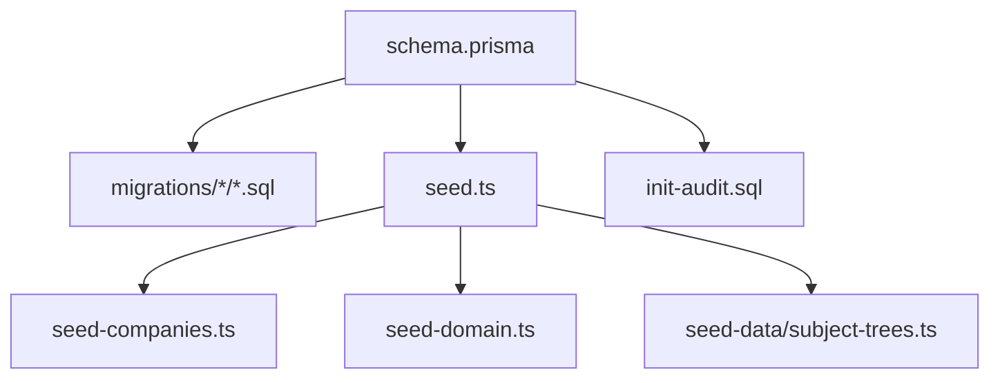
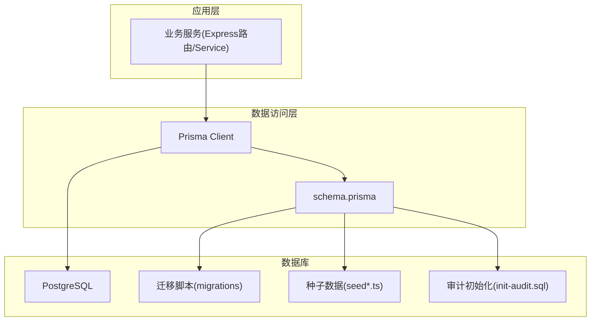
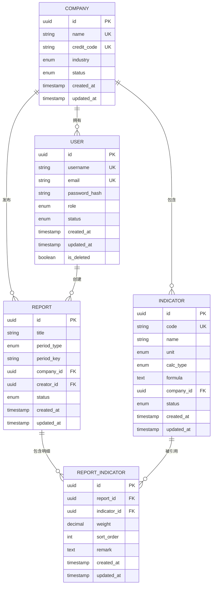

# Prisma模型定义

<cite>
**本文引用的文件**   
- [schema.prisma](file://server/prisma/schema.prisma)
- [20260722121714_init/migration.sql](file://server/prisma/migrations/20260722121714_init/migration.sql)
- [20260722142144_add_formula_rule/migration.sql](file://server/prisma/migrations/20260722142144_add_formula_rule/migration.sql)
- [20260723120000_add_subject_analysis/migration.sql](file://server/prisma/migrations/20260723120000_add_subject_analysis/migration.sql)
- [20260724120000_remove_business_unit_org_scope/migration.sql](file://server/prisma/migrations/20260724120000_remove_business_unit_org_scope/migration.sql)
- [seed.ts](file://server/prisma/seed.ts)
- [seed-companies.ts](file://server/prisma/seed-companies.ts)
- [seed-domain.ts](file://server/prisma/seed-domain.ts)
- [subject-trees.ts](file://server/prisma/seed-data/subject-trees.ts)
- [init-audit.sql](file://server/prisma/init-audit.sql)
</cite>

## 目录
1. [简介](#简介)
2. [项目结构](#项目结构)
3. [核心组件](#核心组件)
4. [架构总览](#架构总览)
5. [详细组件分析](#详细组件分析)
6. [依赖关系分析](#依赖关系分析)
7. [性能考量](#性能考量)
8. [故障排查指南](#故障排查指南)
9. [结论](#结论)
10. [附录](#附录)

## 简介
本文件围绕Prisma数据模型定义，系统化阐述用户、公司、指标、报表等核心实体的字段设计、数据类型与约束；解释一对一、一对多、多对多关系的建模方式；说明数据验证规则、默认值与唯一性约束；提供模型继承与扩展的最佳实践；并给出种子数据的生成与管理方法，包括初始数据与测试数据的准备策略。文档同时结合迁移脚本与审计初始化脚本，帮助读者理解从Schema到数据库的落地过程。

## 项目结构
Prisma相关代码集中在 server/prisma 目录下：
- schema.prisma：统一的数据模型定义入口
- migrations：按时间戳划分的数据库迁移SQL
- seed*.ts / seed-data：种子数据脚本与领域树形数据模板
- init-audit.sql：审计表或触发器初始化脚本（如存在）

图表来源
- [schema.prisma](file://server/prisma/schema.prisma)
- [20260722121714_init/migration.sql](file://server/prisma/migrations/20260722121714_init/migration.sql)
- [seed.ts](file://server/prisma/seed.ts)
- [seed-companies.ts](file://server/prisma/seed-companies.ts)
- [seed-domain.ts](file://server/prisma/seed-domain.ts)
- [subject-trees.ts](file://server/prisma/seed-data/subject-trees.ts)
- [init-audit.sql](file://server/prisma/init-audit.sql)

章节来源
- [schema.prisma](file://server/prisma/schema.prisma)

## 核心组件
本节聚焦Prisma Schema中的核心实体与关系，涵盖用户、公司、指标、报表等关键模型的设计要点与约束。

- 用户模型
  - 典型字段：主键、用户名、邮箱、密码哈希、角色、状态、创建/更新时间戳、软删除标记等
  - 约束建议：邮箱唯一、用户名非空、角色枚举化、时间戳默认当前时间
  - 关系：与公司的一对多（一个公司多个用户）、与报表的多对一（一个报表归属一个用户）

- 公司模型
  - 典型字段：主键、公司名称、统一社会信用代码、行业分类、状态、创建/更新时间戳
  - 约束建议：公司名称唯一、信用代码唯一、状态枚举化
  - 关系：与用户的一对多、与指标/报表的一对多

- 指标模型
  - 典型字段：主键、指标编码、指标名称、单位、计算类型（原始/公式/聚合）、公式表达式（可选）、所属公司、状态、创建/更新时间戳
  - 约束建议：指标编码唯一、公式白名单校验（后端实现）、单位枚举化
  - 关系：与公司的一对多、与报表的多对一（通过报表明细关联）

- 报表模型
  - 典型字段：主键、报表名称、周期类型（月/季/年）、期间标识、所属公司、创建人、状态、创建/更新时间戳
  - 约束建议：期间组合唯一（公司+周期+期间）、状态枚举化
  - 关系：与公司的多对一、与指标的多对多（通过报表-指标明细）

- 报表-指标明细（中间表）
  - 典型字段：主键、报表ID、指标ID、权重、排序、备注、创建/更新时间戳
  - 约束建议：复合唯一（报表ID+指标ID）、外键约束

以上为通用建模范式，具体字段名、枚举值与约束以实际 schema.prisma 为准。

章节来源
- [schema.prisma](file://server/prisma/schema.prisma)

## 架构总览
下图展示Prisma模型在系统中的位置与交互：应用服务层通过Prisma Client访问PostgreSQL，迁移脚本确保数据库结构与Schema一致，种子脚本用于初始化基础数据与测试数据。

图表来源
- [schema.prisma](file://server/prisma/schema.prisma)
- [20260722121714_init/migration.sql](file://server/prisma/migrations/20260722121714_init/migration.sql)
- [seed.ts](file://server/prisma/seed.ts)
- [init-audit.sql](file://server/prisma/init-audit.sql)

## 详细组件分析

### 用户模型
- 字段与类型
  - 主键：自增或UUID
  - 身份类：用户名、邮箱、密码哈希
  - 权限类：角色、状态
  - 审计类：创建时间、更新时间、软删除标记
- 约束与验证
  - 唯一性：邮箱、用户名
  - 非空：用户名、邮箱、密码哈希
  - 默认值：时间戳、状态
- 关系映射
  - 与公司：多对一（用户属于公司）
  - 与报表：一对多（用户创建多个报表）
- 最佳实践
  - 使用枚举限定角色与状态
  - 软删除字段配合中间件实现逻辑删除
  - 密码哈希由后端安全库处理，不在Schema中体现算法细节

章节来源
- [schema.prisma](file://server/prisma/schema.prisma)

### 公司模型
- 字段与类型
  - 主键、公司名称、统一社会信用代码、行业分类、状态、时间戳
- 约束与验证
  - 唯一性：公司名称、信用代码
  - 枚举：行业分类、状态
- 关系映射
  - 与用户：一对多
  - 与指标/报表：一对多

章节来源
- [schema.prisma](file://server/prisma/schema.prisma)

### 指标模型
- 字段与类型
  - 主键、指标编码、指标名称、单位、计算类型、公式表达式（可选）、所属公司、状态、时间戳
- 约束与验证
  - 唯一性：指标编码
  - 公式白名单：后端解析与校验（禁止eval）
  - 枚举：单位、计算类型、状态
- 关系映射
  - 与公司：多对一
  - 与报表：通过明细表建立多对多

章节来源
- [schema.prisma](file://server/prisma/schema.prisma)

### 报表模型
- 字段与类型
  - 主键、报表名称、周期类型、期间标识、所属公司、创建人、状态、时间戳
- 约束与验证
  - 唯一性：公司+周期+期间组合
  - 枚举：周期类型、状态
- 关系映射
  - 与公司：多对一
  - 与指标：多对多（通过明细表）

章节来源
- [schema.prisma](file://server/prisma/schema.prisma)

### 报表-指标明细（中间表）
- 字段与类型
  - 主键、报表ID、指标ID、权重、排序、备注、时间戳
- 约束与验证
  - 唯一性：报表ID+指标ID
  - 外键：报表ID、指标ID
- 关系映射
  - 与报表：多对一
  - 与指标：多对一

章节来源
- [schema.prisma](file://server/prisma/schema.prisma)

### 关系映射模式
- 一对一：适用于强绑定且单侧唯一的关系（如用户档案与扩展信息），通过唯一外键实现
- 一对多：最常见，如公司与用户、公司与指标、公司与报表
- 多对多：通过中间表实现，如报表与指标，支持附加属性（权重、排序、备注）

章节来源
- [schema.prisma](file://server/prisma/schema.prisma)

### 数据验证规则与约束
- 字段级验证
  - 非空、长度限制、正则匹配（如邮箱格式）
  - 枚举值限定（角色、状态、单位、周期类型等）
- 表级约束
  - 唯一索引（邮箱、用户名、指标编码、公司+周期+期间）
  - 外键约束（报表-指标明细）
- 默认值
  - 时间戳默认当前时间
  - 状态默认启用
- 软删除
  - 增加 isDeleted 字段，配合中间件实现逻辑删除

章节来源
- [schema.prisma](file://server/prisma/schema.prisma)

### 模型继承与扩展最佳实践
- 公共字段抽取
  - 将 id、createdAt、updatedAt、isDeleted 等公共字段抽象为基类或约定规范，减少重复
- 命名规范
  - 统一前缀与后缀（如 _id、_at、_ed），提升可读性与一致性
- 扩展点预留
  - 为未来新增字段预留扩展空间，避免频繁迁移
- 版本控制
  - 通过迁移脚本管理变更，保持Schema与数据库同步

章节来源
- [schema.prisma](file://server/prisma/schema.prisma)

### 种子数据生成与管理
- 种子脚本组织
  - seed.ts：主入口，协调各子脚本执行顺序
  - seed-companies.ts：初始化公司基础数据
  - seed-domain.ts：初始化领域维度数据（如行业分类、周期类型字典）
  - subject-trees.ts：科目树/指标树模板数据
- 数据准备策略
  - 初始数据：系统运行必需的基础配置与字典
  - 测试数据：覆盖常见场景与边界条件，便于自动化测试
- 执行流程
  - 先执行领域字典，再初始化公司，最后构建科目树与示例指标/报表
- 回滚与重建
  - 结合迁移脚本进行环境重置，确保可重复性

章节来源
- [seed.ts](file://server/prisma/seed.ts)
- [seed-companies.ts](file://server/prisma/seed-companies.ts)
- [seed-domain.ts](file://server/prisma/seed-domain.ts)
- [subject-trees.ts](file://server/prisma/seed-data/subject-trees.ts)

### 迁移与审计初始化
- 迁移脚本
  - 20260722121714_init：初始建表与基础约束
  - 20260722142144_add_formula_rule：公式规则相关字段或表
  - 20260723120000_add_subject_analysis：科目分析相关结构
  - 20260724120000_remove_business_unit_org_scope：移除业务单元/组织范围相关字段
- 审计初始化
  - init-audit.sql：审计表或触发器初始化（如操作日志、软删除审计）

章节来源
- [20260722121714_init/migration.sql](file://server/prisma/migrations/20260722121714_init/migration.sql)
- [20260722142144_add_formula_rule/migration.sql](file://server/prisma/migrations/20260722142144_add_formula_rule/migration.sql)
- [20260723120000_add_subject_analysis/migration.sql](file://server/prisma/migrations/20260723120000_add_subject_analysis/migration.sql)
- [20260724120000_remove_business_unit_org_scope/migration.sql](file://server/prisma/migrations/20260724120000_remove_business_unit_org_scope/migration.sql)
- [init-audit.sql](file://server/prisma/init-audit.sql)

## 依赖关系分析
Prisma模型之间的依赖主要体现在外键与唯一性约束上，以下图展示核心实体间的关系：

图表来源
- [schema.prisma](file://server/prisma/schema.prisma)

章节来源
- [schema.prisma](file://server/prisma/schema.prisma)

## 性能考量
- 索引策略
  - 对外键字段（company_id、report_id、indicator_id）建立索引，提升关联查询性能
  - 对高频查询字段（如状态、周期类型）建立复合索引
- 唯一性约束
  - 合理设置唯一索引，避免重复插入导致的冲突
- 软删除
  - 查询时过滤 is_deleted，避免全表扫描；必要时为 is_deleted + 其他条件建立复合索引
- 公式计算
  - 公式解析在后端进行，避免存储复杂表达式导致查询性能下降
- 分页与批量
  - 大数据量查询采用分页与批量写入，减少内存占用

[本节为通用指导，不直接分析具体文件]

## 故障排查指南
- 迁移失败
  - 检查迁移脚本是否完整，确认外键与唯一性约束无冲突
  - 参考迁移历史，定位最近一次变更
- 种子数据异常
  - 检查依赖顺序（字典→公司→指标/报表）
  - 核对唯一性约束（如公司名称、指标编码）
- 审计缺失
  - 确认 init-audit.sql 已执行，审计表或触发器正常
- 常见问题
  - 外键约束错误：检查关联ID是否存在
  - 唯一性冲突：清理重复数据或调整输入

章节来源
- [20260722121714_init/migration.sql](file://server/prisma/migrations/20260722121714_init/migration.sql)
- [20260722142144_add_formula_rule/migration.sql](file://server/prisma/migrations/20260722142144_add_formula_rule/migration.sql)
- [20260723120000_add_subject_analysis/migration.sql](file://server/prisma/migrations/20260723120000_add_subject_analysis/migration.sql)
- [20260724120000_remove_business_unit_org_scope/migration.sql](file://server/prisma/migrations/20260724120000_remove_business_unit_org_scope/migration.sql)
- [init-audit.sql](file://server/prisma/init-audit.sql)

## 结论
通过对Prisma模型定义的深入分析，我们明确了用户、公司、指标、报表等核心实体的字段设计与约束，阐述了关系映射的实现方式，并提供了模型继承与扩展的最佳实践。结合迁移与种子数据脚本，确保了数据结构的稳定性与可维护性。建议在后续迭代中持续优化索引策略与查询路径，以提升系统整体性能。

[本节为总结性内容，不直接分析具体文件]

## 附录
- 术语表
  - 指标：用于衡量经营表现的量化维度
  - 报表：基于指标与周期生成的结构化输出
  - 公式：指标计算表达式，需经白名单校验
- 参考文件
  - schema.prisma：模型定义入口
  - migrations：数据库结构演进记录
  - seed*.ts：种子数据脚本集合
  - init-audit.sql：审计初始化脚本

[本节为补充信息，不直接分析具体文件]