# 事务处理与一致性

<cite>
**本文引用的文件**   
- [server/src/lib/prisma.ts](file://server/src/lib/prisma.ts)
- [server/src/middleware/audit.ts](file://server/src/middleware/audit.ts)
- [server/src/services/DataService.ts](file://server/src/services/DataService.ts)
- [server/src/services/ImportService.ts](file://server/src/services/ImportService.ts)
- [server/src/services/AggregationService.ts](file://server/src/services/AggregationService.ts)
- [server/src/services/FormulaRuleService.ts](file://server/src/services/FormulaRuleService.ts)
- [server/src/services/SubjectAnalysisService.ts](file://server/src/services/SubjectAnalysisService.ts)
- [server/src/routes/data.ts](file://server/src/routes/data.ts)
- [server/src/routes/reports.ts](file://server/src/routes/reports.ts)
- [server/src/middleware/error-handler.ts](file://server/src/middleware/error-handler.ts)
- [server/src/lib/errors.ts](file://server/src/lib/errors.ts)
- [server/prisma/schema.prisma](file://server/prisma/schema.prisma)
</cite>

## 目录
1. [引言](#引言)
2. [项目结构](#项目结构)
3. [核心组件](#核心组件)
4. [架构总览](#架构总览)
5. [详细组件分析](#详细组件分析)
6. [依赖关系分析](#依赖关系分析)
7. [性能考量](#性能考量)
8. [故障排查指南](#故障排查指南)
9. [结论](#结论)
10. [附录](#附录)

## 引言
本指南聚焦于基于 Prisma + PostgreSQL 的事务处理与数据一致性实践，覆盖单事务与多事务（嵌套/并行）的编写模式、隔离级别与并发控制策略、异常处理方案、分布式事务模式与最佳实践，以及死锁预防与解决。文档结合本项目后端代码中的服务层与中间件实现，给出可操作的指导与图示。

## 项目结构
后端采用 Express + Prisma + PostgreSQL 的典型分层：路由 → 中间件链 → 服务层 → Prisma Client → 数据库。事务边界通常在服务层内划定，通过 Prisma 客户端实例在请求级复用连接，确保同一请求内的多次操作共享同一事务上下文。

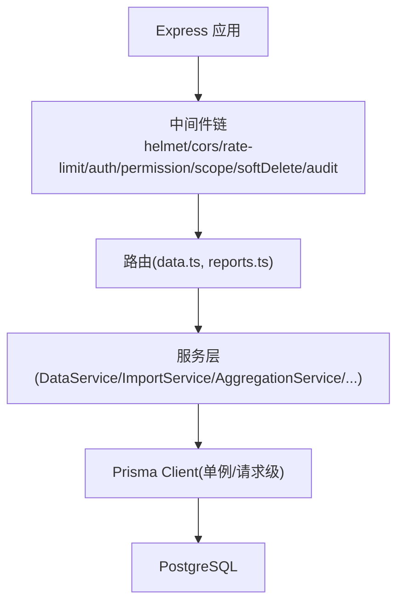

**图表来源** 
- [server/src/app.ts](file://server/src/app.ts)
- [server/src/server.ts](file://server/src/server.ts)
- [server/src/lib/prisma.ts](file://server/src/lib/prisma.ts)

**章节来源**
- [server/src/lib/prisma.ts](file://server/src/lib/prisma.ts)
- [server/src/middleware/audit.ts](file://server/src/middleware/audit.ts)

## 核心组件
- Prisma 客户端初始化与连接管理：提供单例或请求级实例，支持扩展（如权限范围、软删除）。
- 审计中间件：记录关键写操作，便于追踪事务影响面。
- 服务层：封装业务逻辑，组织多个 Prisma 调用为原子性事务。
- 错误处理中间件：统一捕获并返回标准化错误，避免泄露内部细节。

**章节来源**
- [server/src/lib/prisma.ts](file://server/src/lib/prisma.ts)
- [server/src/middleware/audit.ts](file://server/src/middleware/audit.ts)
- [server/src/middleware/error-handler.ts](file://server/src/middleware/error-handler.ts)
- [server/src/lib/errors.ts](file://server/src/lib/errors.ts)

## 架构总览
下图展示一次典型写请求从路由到数据库的调用链，强调事务边界与服务层职责。

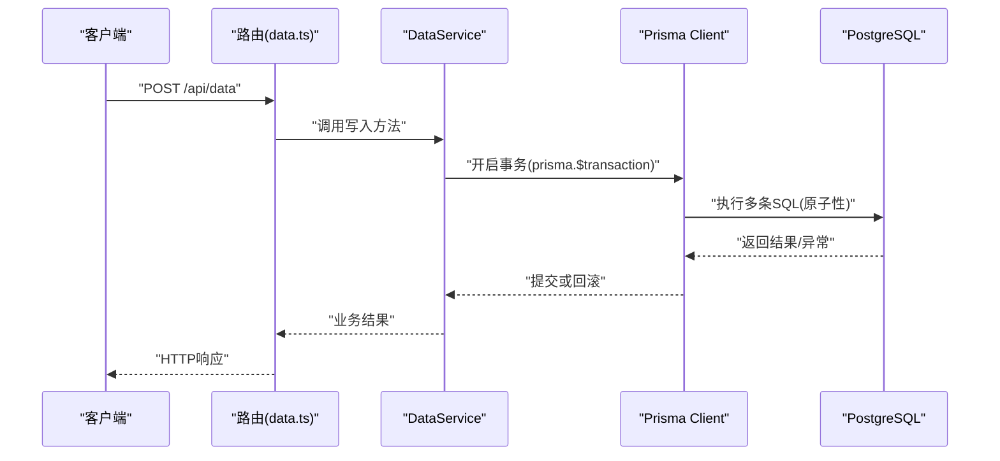

**图表来源** 
- [server/src/routes/data.ts](file://server/src/routes/data.ts)
- [server/src/services/DataService.ts](file://server/src/services/DataService.ts)
- [server/src/lib/prisma.ts](file://server/src/lib/prisma.ts)

## 详细组件分析

### Prisma 客户端与事务基础
- 单例/请求级实例：确保同一请求内复用连接，减少握手开销，有利于事务复用。
- 扩展机制：通过 Prisma Extension 注入权限范围、软删除等能力，保证跨查询的一致性约束。
- 事务 API：$transaction 支持单函数式与数组式批量；支持隔离级别与超时配置。

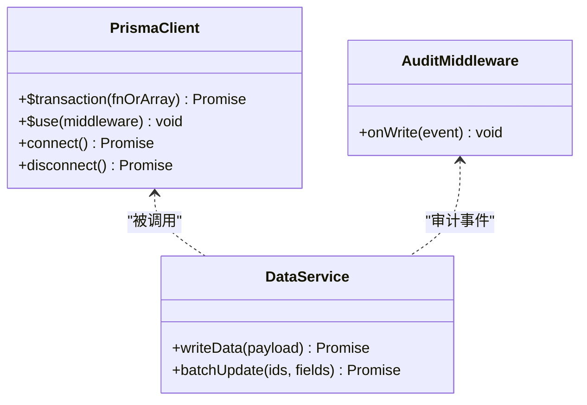

**图表来源** 
- [server/src/lib/prisma.ts](file://server/src/lib/prisma.ts)
- [server/src/services/DataService.ts](file://server/src/services/DataService.ts)
- [server/src/middleware/audit.ts](file://server/src/middleware/audit.ts)

**章节来源**
- [server/src/lib/prisma.ts](file://server/src/lib/prisma.ts)

### 单事务模式（函数式）
适用场景：一个请求内需要按顺序执行多条读写操作，且必须全部成功或全部失败。

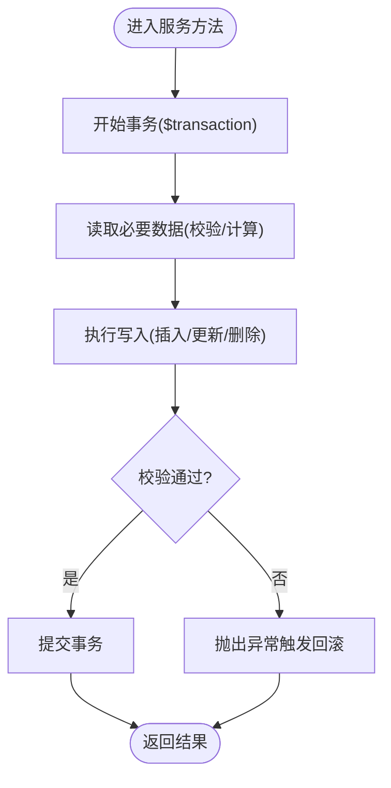

**图表来源** 
- [server/src/services/DataService.ts](file://server/src/services/DataService.ts)

**章节来源**
- [server/src/services/DataService.ts](file://server/src/services/DataService.ts)

### 多事务模式（数组式批量）
适用场景：多条独立写入无需相互依赖，可并行执行以提升吞吐。

```mermaid
sequenceDiagram
participant S as "服务层"
participant P as "Prisma $transaction"
participant DB as "PostgreSQL"
S->>P : "$transaction([op1, op2, op3])"
P->>DB : "并行执行各操作"
DB-->>P : "各自结果/异常"
P-->>S : "全部成功则返回结果集;任一失败则整体回滚"
```

**图表来源** 
- [server/src/services/ImportService.ts](file://server/src/services/ImportService.ts)
- [server/src/services/AggregationService.ts](file://server/src/services/AggregationService.ts)

**章节来源**
- [server/src/services/ImportService.ts](file://server/src/services/ImportService.ts)
- [server/src/services/AggregationService.ts](file://server/src/services/AggregationService.ts)

### 嵌套事务与事务传播
- PostgreSQL 不支持真正的嵌套事务，Prisma 会以保存点模拟嵌套行为。
- 建议：将“子事务”作为外部事务的一部分，避免不必要的保存点开销。
- 最佳实践：在顶层服务方法开启事务，内部方法直接复用该事务上下文。

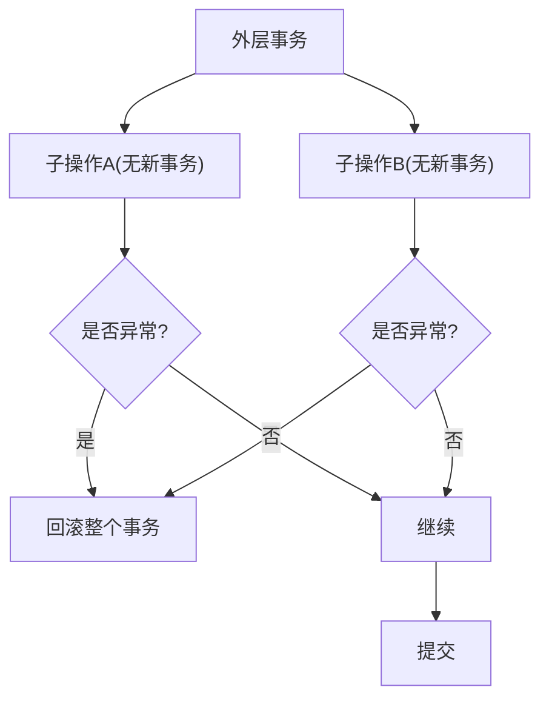

**图表来源** 
- [server/src/services/FormulaRuleService.ts](file://server/src/services/FormulaRuleService.ts)
- [server/src/services/SubjectAnalysisService.ts](file://server/src/services/SubjectAnalysisService.ts)

**章节来源**
- [server/src/services/FormulaRuleService.ts](file://server/src/services/FormulaRuleService.ts)
- [server/src/services/SubjectAnalysisService.ts](file://server/src/services/SubjectAnalysisService.ts)

### 事务隔离级别与并发控制
- 默认隔离级别：Read Committed（PostgreSQL 默认），适合大多数 OLTP 场景。
- 可选级别：Repeatable Read、Serializable（谨慎使用，可能引发更多冲突）。
- 并发控制策略：
  - 乐观锁：利用版本号字段或时间戳，冲突时重试。
  - 悲观锁：SELECT ... FOR UPDATE/SHARE，适用于强一致读后写的场景。
  - 幂等键：对外部写入接口增加唯一约束，防止重复提交。

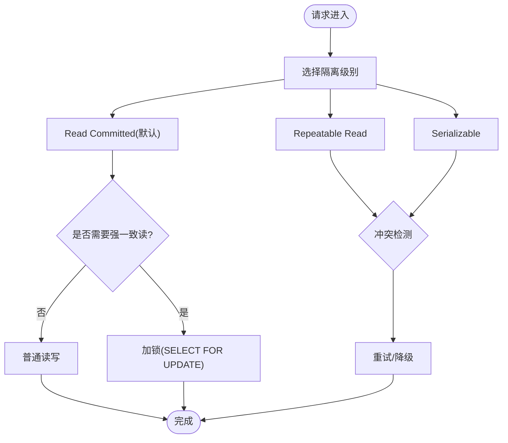

**图表来源** 
- [server/src/lib/prisma.ts](file://server/src/lib/prisma.ts)
- [server/prisma/schema.prisma](file://server/prisma/schema.prisma)

**章节来源**
- [server/src/lib/prisma.ts](file://server/src/lib/prisma.ts)
- [server/prisma/schema.prisma](file://server/prisma/schema.prisma)

### 数据一致性保证机制
- 原子性：$transaction 包裹的所有操作要么全部提交，要么全部回滚。
- 一致性：通过约束（主键、外键、唯一索引）、业务校验与幂等设计保障。
- 隔离性：选择合适的隔离级别与锁策略，避免脏读、不可重复读、幻读。
- 持久性：PostgreSQL WAL 与 fsync 保证崩溃恢复。

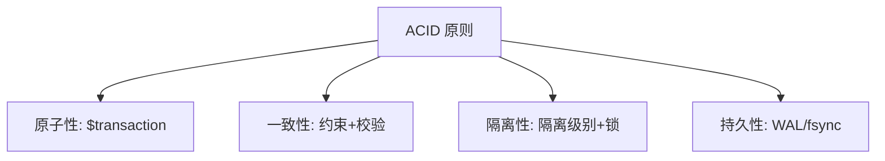

[本图为概念图，不映射具体源码]

### 异常处理方案
- 服务层：对业务异常进行明确分类，抛出结构化错误对象。
- 中间件：统一捕获并转换为 HTTP 状态码与标准响应体。
- 事务：任何未捕获异常都会导致回滚，避免部分提交。

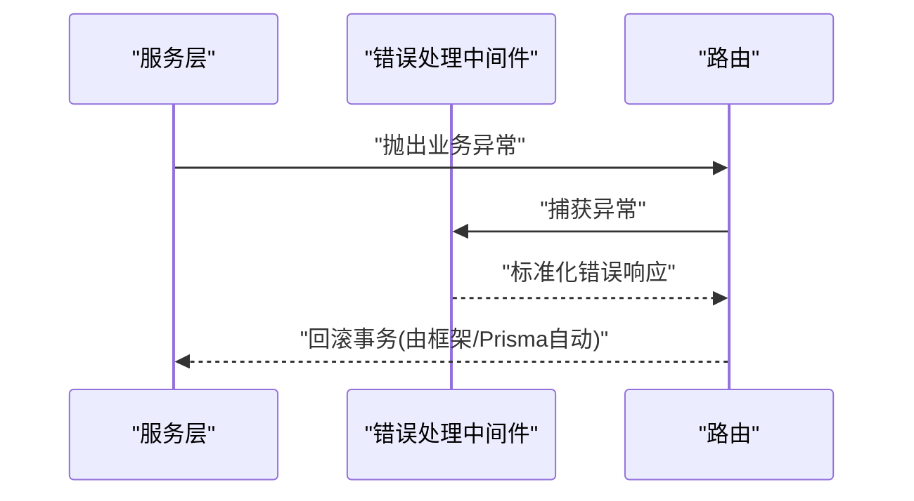

**图表来源** 
- [server/src/middleware/error-handler.ts](file://server/src/middleware/error-handler.ts)
- [server/src/lib/errors.ts](file://server/src/lib/errors.ts)

**章节来源**
- [server/src/middleware/error-handler.ts](file://server/src/middleware/error-handler.ts)
- [server/src/lib/errors.ts](file://server/src/lib/errors.ts)

### 分布式事务处理模式与最佳实践
- 本地事务优先：尽量将一致性边界落在单个数据库事务内。
- Saga 模式：长流程拆分为多个本地事务，配合补偿动作。
- TCC：Try-Confirm-Cancel，适用于高并发与强一致场景。
- 最终一致性：消息队列 + 幂等消费，允许短暂不一致。

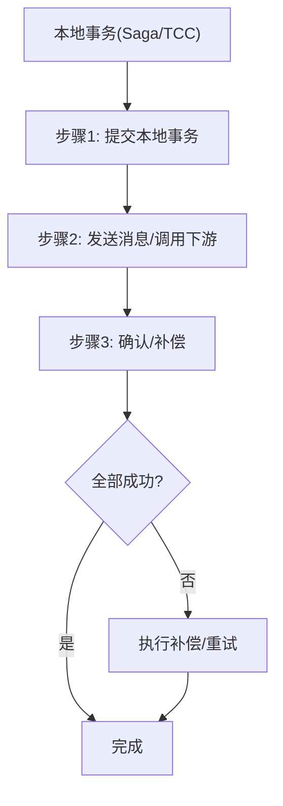

[本图为概念图，不映射具体源码]

### 死锁预防与解决
- 预防：
  - 固定访问顺序：所有事务以相同顺序访问表/行。
  - 缩短事务：减少持有锁的时间。
  - 合理索引：避免全表扫描导致的锁升级。
  - 避免循环依赖：拆分复杂逻辑，降低锁竞争。
- 解决：
  - 监控 pg_locks、pg_stat_activity。
  - 捕获死锁错误，实施指数退避重试。
  - 调整 lock_timeout、statement_timeout。

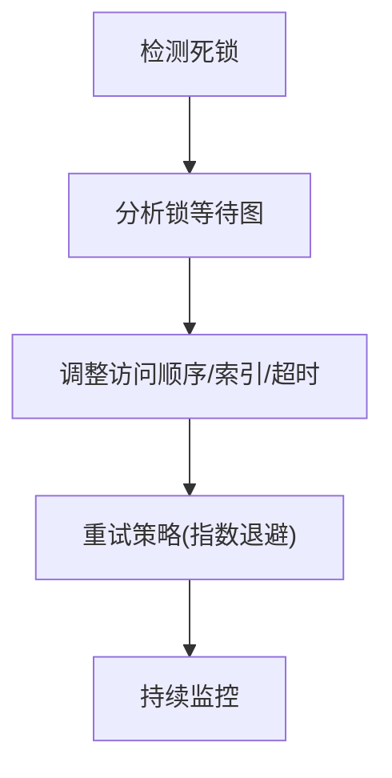

[本图为概念图，不映射具体源码]

## 依赖关系分析
服务层与 Prisma、中间件的依赖关系如下：

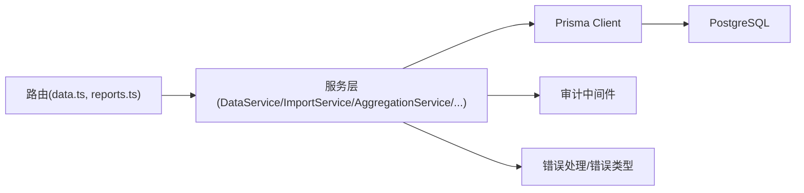

**图表来源** 
- [server/src/routes/data.ts](file://server/src/routes/data.ts)
- [server/src/routes/reports.ts](file://server/src/routes/reports.ts)
- [server/src/services/DataService.ts](file://server/src/services/DataService.ts)
- [server/src/services/ImportService.ts](file://server/src/services/ImportService.ts)
- [server/src/services/AggregationService.ts](file://server/src/services/AggregationService.ts)
- [server/src/middleware/audit.ts](file://server/src/middleware/audit.ts)
- [server/src/lib/prisma.ts](file://server/src/lib/prisma.ts)

**章节来源**
- [server/src/routes/data.ts](file://server/src/routes/data.ts)
- [server/src/routes/reports.ts](file://server/src/routes/reports.ts)
- [server/src/services/DataService.ts](file://server/src/services/DataService.ts)
- [server/src/services/ImportService.ts](file://server/src/services/ImportService.ts)
- [server/src/services/AggregationService.ts](file://server/src/services/AggregationService.ts)
- [server/src/middleware/audit.ts](file://server/src/middleware/audit.ts)
- [server/src/lib/prisma.ts](file://server/src/lib/prisma.ts)

## 性能考量
- 事务粒度：尽量缩小事务范围，减少锁持有时间。
- 批量操作：使用数组式 $transaction 提升吞吐。
- 索引优化：为高频查询与锁定位添加合适索引。
- 超时设置：合理配置 statement_timeout 与 lock_timeout，避免长事务阻塞。
- 连接池：复用 Prisma 实例，避免频繁创建连接。

[本节为通用指导，不引用具体源码]

## 故障排查指南
- 常见问题：
  - 事务未提交：检查是否抛出未捕获异常或遗漏 return。
  - 死锁：查看 pg_locks 与日志，调整访问顺序与索引。
  - 隔离级别不当：根据一致性需求调整隔离级别与锁策略。
- 排查步骤：
  - 启用审计日志，定位受影响的数据行。
  - 使用 EXPLAIN ANALYZE 分析慢查询。
  - 通过错误中间件输出标准化错误信息。

**章节来源**
- [server/src/middleware/error-handler.ts](file://server/src/middleware/error-handler.ts)
- [server/src/lib/errors.ts](file://server/src/lib/errors.ts)
- [server/src/middleware/audit.ts](file://server/src/middleware/audit.ts)

## 结论
在本项目中，事务边界应清晰定义在服务层，使用 Prisma 的 $transaction 保证原子性与一致性。通过合理的隔离级别、锁策略与幂等设计，可在高并发下维持数据正确性。分布式场景优先考虑 Saga/TCC 与最终一致性。死锁问题需通过访问顺序、索引与超时策略综合治理。

[本节为总结，不引用具体源码]

## 附录
- 参考模型与约束：见 schema.prisma 中的表结构与约束定义。
- 审计与权限：通过中间件与 Prisma Extension 实现细粒度控制。

**章节来源**
- [server/prisma/schema.prisma](file://server/prisma/schema.prisma)
- [server/src/middleware/audit.ts](file://server/src/middleware/audit.ts)