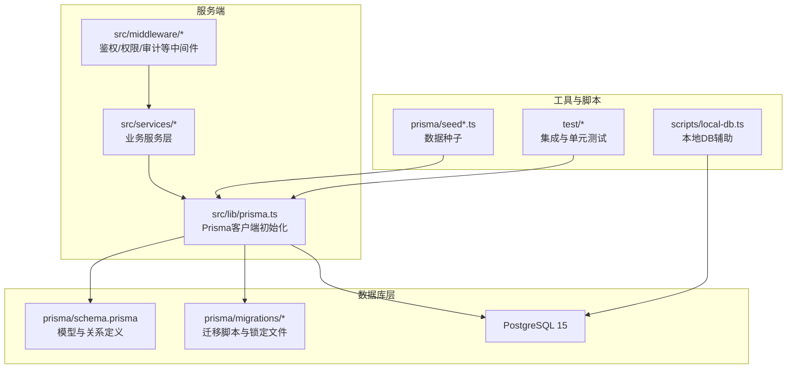
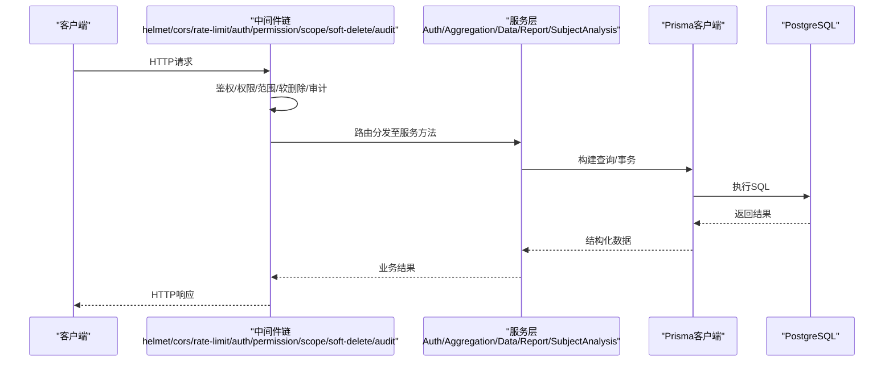
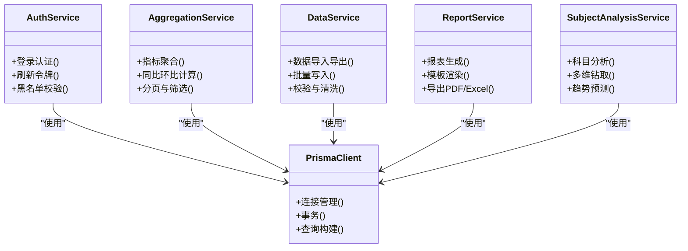

# 数据库操作

<cite>
**本文引用的文件**   
- [schema.prisma](file://server/prisma/schema.prisma)
- [prisma.ts](file://server/src/lib/prisma.ts)
- [env.ts](file://server/src/config/env.ts)
- [20260722121714_init/migration.sql](file://server/prisma/migrations/20260722121714_init/migration.sql)
- [20260722142144_add_formula_rule/migration.sql](file://server/prisma/migrations/20260722142144_add_formula_rule/migration.sql)
- [20260723120000_add_subject_analysis/migration.sql](file://server/prisma/migrations/20260723120000_add_subject_analysis/migration.sql)
- [20260724120000_remove_business_unit_org_scope/migration.sql](file://server/prisma/migrations/20260724120000_remove_business_unit_org_scope/migration.sql)
- [migration_lock.toml](file://server/prisma/migrations/migration_lock.toml)
- [seed.ts](file://server/prisma/seed.ts)
- [seed-companies.ts](file://server/prisma/seed-companies.ts)
- [seed-domain.ts](file://server/prisma/seed-domain.ts)
- [subject-trees.ts](file://server/prisma/seed-data/subject-trees.ts)
- [init-audit.sql](file://server/prisma/init-audit.sql)
- [AuthService.ts](file://server/src/services/AuthService.ts)
- [AggregationService.ts](file://server/src/services/AggregationService.ts)
- [DataService.ts](file://server/src/services/DataService.ts)
- [ReportService.ts](file://server/src/services/ReportService.ts)
- [SubjectAnalysisService.ts](file://server/src/services/SubjectAnalysisService.ts)
- [formula-validation.test.ts](file://server/src/services/formula-validation.test.ts)
- [integration.test.ts](file://server/src/test/integration.test.ts)
- [setup.ts](file://server/src/test/setup.ts)
- [local-db.ts](file://server/scripts/local-db.ts)
</cite>

## 目录
1. [简介](#简介)
2. [项目结构](#项目结构)
3. [核心组件](#核心组件)
4. [架构总览](#架构总览)
5. [详细组件分析](#详细组件分析)
6. [依赖关系分析](#依赖关系分析)
7. [性能考量](#性能考量)
8. [故障排查指南](#故障排查指南)
9. [结论](#结论)
10. [附录](#附录)

## 简介
本指南面向FY200项目的数据库操作，聚焦Prisma ORM在PostgreSQL上的配置与使用模式。内容涵盖模型定义、关系映射、查询构建、迁移管理（创建、版本控制、回滚）、复杂查询优化（关联、聚合、索引）、事务最佳实践与一致性保证、数据种子与测试数据生成，以及性能监控与问题排查方法。读者无需深入底层SQL即可高效完成日常开发与排障。

## 项目结构
后端服务位于 server 目录，数据库相关代码集中在 prisma 与 src/lib/prisma.ts，服务层通过 Prisma Client 访问数据库；迁移脚本位于 prisma/migrations；种子脚本位于 prisma 根目录与 seed-data 子目录；测试与本地数据库脚本位于 scripts 与 test 目录。

图表来源
- [prisma.ts](file://server/src/lib/prisma.ts)
- [schema.prisma](file://server/prisma/schema.prisma)
- [migration_lock.toml](file://server/prisma/migrations/migration_lock.toml)
- [seed.ts](file://server/prisma/seed.ts)
- [local-db.ts](file://server/scripts/local-db.ts)

章节来源
- [prisma.ts](file://server/src/lib/prisma.ts)
- [schema.prisma](file://server/prisma/schema.prisma)
- [migration_lock.toml](file://server/prisma/migrations/migration_lock.toml)
- [seed.ts](file://server/prisma/seed.ts)
- [local-db.ts](file://server/scripts/local-db.ts)

## 核心组件
- Prisma客户端与连接池：集中初始化，统一暴露给服务层，确保连接复用与优雅关闭。
- 模型与关系：通过 schema.prisma 声明实体、字段类型、约束与关联，自动生成类型安全的Client API。
- 迁移系统：以时间戳命名的迁移目录管理DDL变更，配合锁定文件保障多环境一致性。
- 服务层封装：将Prisma查询封装为领域语义清晰的函数，便于事务、权限与审计的横切处理。
- 种子与测试：提供企业、主题树、域等初始数据脚本，结合测试套件验证数据一致性。

章节来源
- [prisma.ts](file://server/src/lib/prisma.ts)
- [schema.prisma](file://server/prisma/schema.prisma)
- [migration_lock.toml](file://server/prisma/migrations/migration_lock.toml)
- [seed.ts](file://server/prisma/seed.ts)
- [AuthService.ts](file://server/src/services/AuthService.ts)
- [AggregationService.ts](file://server/src/services/AggregationService.ts)
- [DataService.ts](file://server/src/services/DataService.ts)
- [ReportService.ts](file://server/src/services/ReportService.ts)
- [SubjectAnalysisService.ts](file://server/src/services/SubjectAnalysisService.ts)

## 架构总览
下图展示了从请求到数据库的关键路径，体现中间件链与Prisma调用顺序，以及事务与审计的介入点。

图表来源
- [prisma.ts](file://server/src/lib/prisma.ts)
- [AuthService.ts](file://server/src/services/AuthService.ts)
- [AggregationService.ts](file://server/src/services/AggregationService.ts)
- [DataService.ts](file://server/src/services/DataService.ts)
- [ReportService.ts](file://server/src/services/ReportService.ts)
- [SubjectAnalysisService.ts](file://server/src/services/SubjectAnalysisService.ts)

## 详细组件分析

### Prisma客户端与连接管理
- 单例初始化：在服务启动时创建并缓存Prisma实例，避免重复连接开销。
- 连接池参数：根据并发与负载调整最大连接数、超时与空闲回收策略。
- 优雅关闭：在进程退出时断开连接，释放资源，避免僵尸连接。

章节来源
- [prisma.ts](file://server/src/lib/prisma.ts)

### 模型定义与关系映射
- 实体建模：在 schema.prisma 中定义表、字段、默认值、唯一性、外键与索引。
- 关系映射：使用 one-to-one / one-to-many / many-to-many 表达业务关系，保持引用完整性。
- 扩展能力：通过 Prisma Extension 注入权限、范围过滤与审计字段，实现横切逻辑。

章节来源
- [schema.prisma](file://server/prisma/schema.prisma)

### 迁移管理与版本控制
- 迁移文件命名：采用时间戳前缀，确保可排序与可追溯。
- 锁定机制：migration_lock.toml 记录已应用迁移的哈希，防止不一致部署。
- 回滚策略：优先设计可逆迁移；不可逆变更需准备补偿脚本与数据修复流程。

章节来源
- [20260722121714_init/migration.sql](file://server/prisma/migrations/20260722121714_init/migration.sql)
- [20260722142144_add_formula_rule/migration.sql](file://server/prisma/migrations/20260722142144_add_formula_rule/migration.sql)
- [20260723120000_add_subject_analysis/migration.sql](file://server/prisma/migrations/20260723120000_add_subject_analysis/migration.sql)
- [20260724120000_remove_business_unit_org_scope/migration.sql](file://server/prisma/migrations/20260724120000_remove_business_unit_org_scope/migration.sql)
- [migration_lock.toml](file://server/prisma/migrations/migration_lock.toml)

### 复杂查询优化
- 关联查询：按需加载关联数据，避免N+1；使用 include/select 精确投影。
- 聚合查询：利用 Prisma 聚合API或原生SQL片段进行分组统计，减少内存压力。
- 索引优化：对高频过滤与排序字段建立合适索引，关注复合索引顺序与选择性。

章节来源
- [AggregationService.ts](file://server/src/services/AggregationService.ts)
- [DataService.ts](file://server/src/services/DataService.ts)
- [ReportService.ts](file://server/src/services/ReportService.ts)
- [SubjectAnalysisService.ts](file://server/src/services/SubjectAnalysisService.ts)

### 事务处理与一致性
- 原子性：将写操作包裹在事务中，失败自动回滚，保证状态一致。
- 隔离级别：按场景选择读已提交或可重复读，避免脏读与幻读。
- 重试策略：对死锁与短暂冲突实施指数退避重试，提升鲁棒性。

章节来源
- [AuthService.ts](file://server/src/services/AuthService.ts)
- [AggregationService.ts](file://server/src/services/AggregationService.ts)
- [DataService.ts](file://server/src/services/DataService.ts)
- [ReportService.ts](file://server/src/services/ReportService.ts)
- [SubjectAnalysisService.ts](file://server/src/services/SubjectAnalysisService.ts)

### 数据种子与测试数据
- 种子脚本：按模块拆分（公司、主题树、域），支持幂等插入与更新。
- 测试数据：结合测试套件初始化隔离环境，确保用例稳定可重复。
- 审计初始化：通过 init-audit.sql 预置审计所需对象与权限。

章节来源
- [seed.ts](file://server/prisma/seed.ts)
- [seed-companies.ts](file://server/prisma/seed-companies.ts)
- [seed-domain.ts](file://server/prisma/seed-domain.ts)
- [subject-trees.ts](file://server/prisma/seed-data/subject-trees.ts)
- [init-audit.sql](file://server/prisma/init-audit.sql)
- [integration.test.ts](file://server/src/test/integration.test.ts)
- [setup.ts](file://server/src/test/setup.ts)

### 公式解析与安全计算
- 白名单算子：仅允许 +-*/() 等安全运算符，禁止任意代码执行。
- 实时计算：同比/环比由后端计算，不持久化，降低存储与一致性风险。

章节来源
- [formula-validation.test.ts](file://server/src/services/formula-validation.test.ts)

### 本地数据库与开发工作流
- 本地DB脚本：快速拉起PostgreSQL实例，便于联调与演示。
- 环境变量：集中管理数据库URL、连接池与日志级别。

章节来源
- [local-db.ts](file://server/scripts/local-db.ts)
- [env.ts](file://server/src/config/env.ts)

## 依赖关系分析
服务层与Prisma客户端的依赖关系如下，体现职责分离与内聚性。

图表来源
- [AuthService.ts](file://server/src/services/AuthService.ts)
- [AggregationService.ts](file://server/src/services/AggregationService.ts)
- [DataService.ts](file://server/src/services/DataService.ts)
- [ReportService.ts](file://server/src/services/ReportService.ts)
- [SubjectAnalysisService.ts](file://server/src/services/SubjectAnalysisService.ts)
- [prisma.ts](file://server/src/lib/prisma.ts)

章节来源
- [AuthService.ts](file://server/src/services/AuthService.ts)
- [AggregationService.ts](file://server/src/services/AggregationService.ts)
- [DataService.ts](file://server/src/services/DataService.ts)
- [ReportService.ts](file://server/src/services/ReportService.ts)
- [SubjectAnalysisService.ts](file://server/src/services/SubjectAnalysisService.ts)
- [prisma.ts](file://server/src/lib/prisma.ts)

## 性能考量
- 连接池调优：根据CPU核数与I/O吞吐设置合理最大连接数，避免过度竞争。
- 查询投影：仅选取必要字段，减少网络传输与序列化开销。
- 索引策略：针对高频WHERE、JOIN与ORDER BY列建立索引，定期分析慢查询。
- 分页与游标：大数据集采用分页或基于游标的迭代，避免一次性加载。
- 缓存热点：对只读且变化低频的数据引入缓存层，减轻数据库压力。
- 事务粒度：缩小事务范围，减少锁持有时间，提高并发度。

[本节为通用指导，不直接分析具体文件]

## 故障排查指南
- 连接异常：检查数据库URL、端口、用户名密码与防火墙规则；确认连接池耗尽与超时设置。
- 迁移失败：核对 migration_lock 与实际迁移哈希；查看迁移脚本错误日志与回滚策略。
- 慢查询定位：启用慢查询日志，结合EXPLAIN ANALYZE分析执行计划，补充缺失索引。
- 事务冲突：捕获死锁与唯一约束冲突，实施重试与补偿逻辑。
- 权限与范围：确认中间件scope与权限策略是否正确注入，避免越权或数据泄露。
- 审计追踪：检查审计表与事件日志，定位异常写入与删除行为。

章节来源
- [prisma.ts](file://server/src/lib/prisma.ts)
- [migration_lock.toml](file://server/prisma/migrations/migration_lock.toml)
- [AuthService.ts](file://server/src/services/AuthService.ts)
- [AggregationService.ts](file://server/src/services/AggregationService.ts)
- [DataService.ts](file://server/src/services/DataService.ts)
- [ReportService.ts](file://server/src/services/ReportService.ts)
- [SubjectAnalysisService.ts](file://server/src/services/SubjectAnalysisService.ts)

## 结论
通过规范的Prisma模型定义、严谨的迁移管理与优化的查询策略，FY200项目在数据一致性、可维护性与性能方面具备良好基础。建议持续完善索引与监控体系，强化事务与审计实践，确保在高并发与复杂业务场景下的稳定性与可观测性。

[本节为总结性内容，不直接分析具体文件]

## 附录
- 常用命令参考：
  - 生成Prisma客户端：npm run generate
  - 执行迁移：npm run db:migrate
  - 回滚迁移：npm run db:rollback
  - 运行种子：npm run db:seed
  - 本地数据库：npm run local-db
- 关键文件路径：
  - 模型定义：server/prisma/schema.prisma
  - 客户端初始化：server/src/lib/prisma.ts
  - 环境变量：server/src/config/env.ts
  - 迁移目录：server/prisma/migrations/*
  - 种子脚本：server/prisma/seed*.ts, server/prisma/seed-data/*
  - 审计初始化：server/prisma/init-audit.sql
  - 服务层：server/src/services/*
  - 测试与脚本：server/src/test/*, server/scripts/*

[本节为参考信息，不直接分析具体文件]