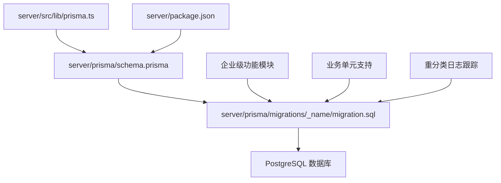
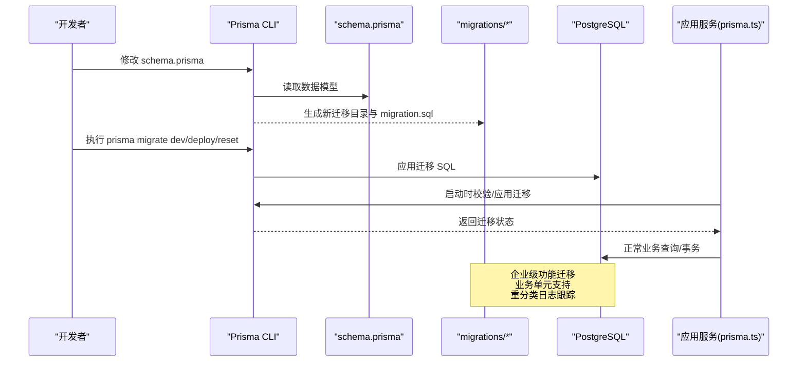
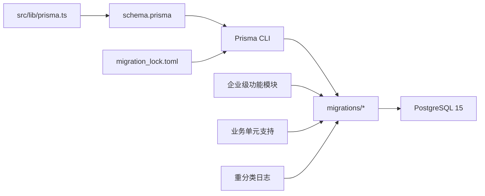

# 数据库迁移管理

<cite>
**本文引用的文件**   
- [schema.prisma](file://server/prisma/schema.prisma)
- [migration_lock.toml](file://server/prisma/migrations/migration_lock.toml)
- [20260722121714_init/migration.sql](file://server/prisma/migrations/20260722121714_init/migration.sql)
- [20260722142144_add_formula_rule/migration.sql](file://server/prisma/migrations/20260722142144_add_formula_rule/migration.sql)
- [20260723120000_add_subject_analysis/migration.sql](file://server/prisma/migrations/20260723120000_add_subject_analysis/migration.sql)
- [20260724120000_remove_business_unit_org_scope/migration.sql](file://server/prisma/migrations/20260724120000_remove_business_unit_org_scope/migration.sql)
- [20260724165901_add_org_scope_bu_and_business_unit/migration.sql](file://server/prisma/migrations/20260724165901_add_org_scope_bu_and_business_unit/migration.sql)
- [20260725120000_enhance_transaction_detail/migration.sql](file://server/prisma/migrations/20260725120000_enhance_transaction_detail/migration.sql)
- [20260725130000_add_company_short_name/migration.sql](file://server/prisma/migrations/20260725130000_add_company_short_name/migration.sql)
- [20260725140000_re_add_business_unit_org_scope/migration.sql](file://server/prisma/migrations/20260725140000_re_add_business_unit_org_scope/migration.sql)
- [20260725150503_add_enterprise_info/migration.sql](file://server/prisma/migrations/20260725150503_add_enterprise_info/migration.sql)
- [20260726120000_add_import_batch_detail_count/migration.sql](file://server/prisma/migrations/20260726120000_add_import_batch明细计数/migration.sql)
- [20260726130000_add_reclassification_log/migration.sql](file://server/prisma/migrations/20260726130000_add_reclassification_log/migration.sql)
- [prisma.ts](file://server/src/lib/prisma.ts)
- [package.json](file://server/package.json)
</cite>

## 更新摘要
**所做更改**
- 更新了迁移文件创建与命名规范部分，包含最新的企业信息、业务单元支持和重分类日志跟踪功能
- 新增了组织范围增强和业务单元支持的详细说明
- 更新了交易详情字段增强的相关内容
- 完善了生产环境迁移最佳实践，包含新的企业级功能考虑
- 增强了故障排查指南，涵盖新迁移类型的常见问题

## 目录
1. [简介](#简介)
2. [项目结构](#项目结构)
3. [核心组件](#核心组件)
4. [架构总览](#架构总览)
5. [详细组件分析](#详细组件分析)
6. [依赖分析](#依赖分析)
7. [性能考虑](#性能考虑)
8. [故障排查指南](#故障排查指南)
9. [结论](#结论)
10. [附录](#附录)

## 简介
本指南面向使用 Prisma 进行数据库迁移的团队与个人，结合本项目实际的后端技术栈（Express + Prisma 5 + PostgreSQL 15），系统化说明迁移文件的创建、命名规范、版本控制策略，以及常用命令 prisma migrate dev、prisma migrate deploy、prisma migrate reset 的使用方式。文档还涵盖回滚策略、冲突解决机制、生产环境最佳实践与安全注意事项，并提供常见问题的排查与恢复方案。

**最新更新**：本指南已根据最新的数据库迁移变更进行了更新，包括组织范围增强、业务单元支持、交易详情字段扩展、企业信息模式以及重分类日志跟踪功能的实现。

## 项目结构
Prisma 迁移相关文件集中在 server/prisma 目录下：
- schema.prisma：数据模型与连接配置的核心定义
- migrations：按时间戳命名的迁移目录，每个目录包含一个 migration.sql
- migration_lock.toml：锁定迁移工具与数据库引擎版本，保证一致性
- seed-data 与 seed*.ts：用于初始化或填充测试数据的脚本（与迁移流程配合）

**图示来源** 
- [schema.prisma](file://server/prisma/schema.prisma)
- [20260725150503_add_enterprise_info/migration.sql](file://server/prisma/migrations/20260725150503_add_enterprise_info/migration.sql)
- [20260724165901_add_org_scope_bu_and_business_unit/migration.sql](file://server/prisma/migrations/20260724165901_add_org_scope_bu_and_business_unit/migration.sql)
- [20260726130000_add_reclassification_log/migration.sql](file://server/prisma/migrations/20260726130000_add_reclassification_log/migration.sql)
- [prisma.ts](file://server/src/lib/prisma.ts)
- [package.json](file://server/package.json)

**章节来源**
- [schema.prisma](file://server/prisma/schema.prisma)
- [migration_lock.toml](file://server/prisma/migrations/migration_lock.toml)
- [prisma.ts](file://server/src/lib/prisma.ts)
- [package.json](file://server/package.json)

## 核心组件
- Prisma Schema（schema.prisma）：声明式数据模型、关系、索引、约束等，是生成迁移的源头
- 迁移目录（migrations/*）：每个迁移对应一次数据库变更，包含不可变 SQL 文件
- 迁移锁（migration_lock.toml）：锁定 Prisma CLI 与数据库驱动版本，确保跨环境一致
- Prisma 客户端（src/lib/prisma.ts）：应用启动时加载 Prisma 客户端，执行查询与事务
- 包脚本（package.json）：封装常用命令，便于团队统一执行

**最新更新**：新增的企业信息模块、业务单元支持和重分类日志跟踪功能已集成到核心组件中，提供了更强大的企业级数据管理能力。

**章节来源**
- [schema.prisma](file://server/prisma/schema.prisma)
- [migration_lock.toml](file://server/prisma/migrations/migration_lock.toml)
- [prisma.ts](file://server/src/lib/prisma.ts)
- [package.json](file://server/package.json)

## 架构总览
下图展示了从 Schema 到数据库的迁移路径，以及应用如何加载 Prisma 客户端并执行迁移。

**图示来源** 
- [schema.prisma](file://server/prisma/schema.prisma)
- [20260725150503_add_enterprise_info/migration.sql](file://server/prisma/migrations/20260725150503_add_enterprise_info/migration.sql)
- [20260726130000_add_reclassification_log/migration.sql](file://server/prisma/migrations/20260726130000_add_reclassification_log/migration.sql)
- [prisma.ts](file://server/src/lib/prisma.ts)

## 详细组件分析

### 迁移文件创建与命名规范
- 命名规则：目录名采用"时间戳_描述"形式，例如 20260722121714_init、20260722142144_add_formula_rule。时间戳保证顺序唯一，描述词需简洁明确表达变更意图。
- 内容要求：每个迁移目录内仅包含一个 migration.sql，记录该次变更的全部 SQL 语句；保持幂等性建议（避免重复执行报错）。
- 版本控制：将 migrations 目录纳入 Git 版本控制，禁止直接在生产数据库手动执行 SQL。

**最新更新**：最近的迁移文件包含了以下重要功能：
- 组织范围增强和业务单元支持（20260724165901_add_org_scope_bu_and_business_unit）
- 交易详情字段扩展（20260725120000_enhance_transaction_detail）
- 企业名称简称支持（20260725130000_add_company_short_name）
- 企业信息模式（20260725150503_add_enterprise_info）
- 导入批次明细计数（20260726120000_add_import_batch_detail_count）
- 重分类日志跟踪（20260726130000_add_reclassification_log）

示例迁移目录（来自仓库）：
- [20260722121714_init/migration.sql](file://server/prisma/migrations/20260722121714_init/migration.sql)
- [20260722142144_add_formula_rule/migration.sql](file://server/prisma/migrations/20260722142144_add_formula_rule/migration.sql)
- [20260723120000_add_subject_analysis/migration.sql](file://server/prisma/migrations/20260723120000_add_subject_analysis/migration.sql)
- [20260724120000_remove_business_unit_org_scope/migration.sql](file://server/prisma/migrations/20260724120000_remove_business_unit_org_scope/migration.sql)
- [20260724165901_add_org_scope_bu_and_business_unit/migration.sql](file://server/prisma/migrations/20260724165901_add_org_scope_bu_and_business_unit/migration.sql)
- [20260725120000_enhance_transaction_detail/migration.sql](file://server/prisma/migrations/20260725120000_enhance_transaction_detail/migration.sql)
- [20260725130000_add_company_short_name/migration.sql](file://server/prisma/migrations/20260725130000_add_company_short_name/migration.sql)
- [20260725140000_re_add_business_unit_org_scope/migration.sql](file://server/prisma/migrations/20260725140000_re_add_business_unit_org_scope/migration.sql)
- [20260725150503_add_enterprise_info/migration.sql](file://server/prisma/migrations/20260725150503_add_enterprise_info/migration.sql)
- [20260726120000_add_import_batch_detail_count/migration.sql](file://server/prisma/migrations/20260726120000_add_import_batch_detail_count/migration.sql)
- [20260726130000_add_reclassification_log/migration.sql](file://server/prisma/migrations/20260726130000_add_reclassification_log/migration.sql)

**章节来源**
- [20260722121714_init/migration.sql](file://server/prisma/migrations/20260722121714_init/migration.sql)
- [20260724165901_add_org_scope_bu_and_business_unit/migration.sql](file://server/prisma/migrations/20260724165901_add_org_scope_bu_and_business_unit/migration.sql)
- [20260725120000_enhance_transaction_detail/migration.sql](file://server/prisma/migrations/20260725120000_enhance_transaction_detail/migration.sql)
- [20260725150503_add_enterprise_info/migration.sql](file://server/prisma/migrations/20260725150503_add_enterprise_info/migration.sql)
- [20260726130000_add_reclassification_log/migration.sql](file://server/prisma/migrations/20260726130000_add_reclassification_log/migration.sql)

### 常用迁移命令与使用场景
- prisma migrate dev
  - 用途：在开发环境中根据 schema.prisma 生成并应用迁移，同时同步本地数据库状态
  - 典型流程：修改 schema → 生成迁移 → 应用到本地库 → 验证功能
- prisma migrate deploy
  - 用途：在预发/生产环境中仅应用已存在的迁移文件，不生成新迁移
  - 典型流程：CI/CD 拉取代码 → 安装依赖 → 执行部署脚本 → 调用 migrate deploy 应用迁移
- prisma migrate reset
  - 用途：重置数据库到最新迁移状态（会清空数据），适用于开发阶段快速重建
  - 注意：生产环境严禁使用 reset

建议在 package.json 中封装命令，统一参数与环境变量，减少误操作风险。

**章节来源**
- [package.json](file://server/package.json)

### 版本控制策略
- 以 Git 为单一事实源，所有迁移文件必须提交至仓库
- 分支策略：feature 分支上频繁生成迁移，合并到主干前完成评审与验证
- 标签与发布：每次生产发布打 tag，保留可追溯的迁移快照
- 锁定版本：通过 migration_lock.toml 固定 Prisma CLI 与数据库驱动版本，避免环境差异导致迁移不一致

**最新更新**：随着企业级功能的增加，版本控制策略需要特别关注以下方面：
- 企业信息的独立迁移管理
- 业务单元相关变更的隔离处理
- 重分类日志的审计追踪要求

**章节来源**
- [migration_lock.toml](file://server/prisma/migrations/migration_lock.toml)

### 回滚策略与冲突解决
- 回滚原则
  - 优先通过新增正向迁移修复问题，而非删除历史迁移
  - 若确需回滚，应在受控窗口内执行，并确保有完整备份
- 冲突识别
  - 多人并行修改 schema 时可能产生冲突，应先在本地合并 schema，再统一生成迁移
  - 使用 prisma migrate dev 的交互提示解决冲突，必要时先回退到稳定基线
- 冲突处理步骤
  - 暂停其他分支的迁移提交
  - 在主干上合并 schema 变更，重新生成迁移
  - 验证迁移幂等性与兼容性
  - 重新提交并触发 CI/CD 流水线

**最新更新**：针对新的企业级功能，回滚策略需要考虑：
- 企业信息数据的完整性保护
- 业务单元关联数据的级联处理
- 重分类日志的审计连续性

[本节为通用策略说明，不直接分析具体文件]

### 生产环境迁移最佳实践与安全考虑
- 前置检查
  - 确认数据库备份可用且可恢复
  - 评估迁移对在线业务的影响（锁表、长事务、大表变更）
- 执行策略
  - 使用 prisma migrate deploy，禁止在生产执行 reset
  - 分阶段灰度发布，观察错误率与延迟指标
- 权限与审计
  - 最小权限原则：部署账号仅具备迁移所需权限
  - 开启数据库审计日志，记录迁移执行轨迹
- 回滚预案
  - 准备反向迁移脚本与一键回滚流程
  - 演练回滚流程，确保 RTO/RPO 达标

**最新更新**：针对企业级功能的特殊考虑：
- 企业信息迁移需要额外的安全验证
- 业务单元变更需要进行权限影响评估
- 重分类日志迁移需要确保审计合规性
- 大规模数据迁移需要在低峰时段执行

[本节为通用最佳实践说明，不直接分析具体文件]

### 应用集成与客户端加载
- Prisma 客户端初始化位于 src/lib/prisma.ts，应用启动时加载配置并建立连接
- 建议在启动流程中加入迁移状态校验，确保运行环境与 schema 一致
- 环境变量与连接信息应从安全渠道注入，避免硬编码

**最新更新**：企业级功能的集成需要考虑：
- 企业信息服务的独立初始化
- 业务单元权限系统的加载顺序
- 重分类日志服务的配置管理

**章节来源**
- [prisma.ts](file://server/src/lib/prisma.ts)

## 依赖分析
- 外部依赖
  - Prisma CLI：负责生成与应用迁移
  - PostgreSQL 15：目标数据库引擎
- 内部依赖
  - schema.prisma 是所有迁移的权威来源
  - migrations/* 是不可变的变更记录
  - migration_lock.toml 锁定工具链版本
  - src/lib/prisma.ts 提供运行时客户端

**图示来源** 
- [schema.prisma](file://server/prisma/schema.prisma)
- [migration_lock.toml](file://server/prisma/migrations/migration_lock.toml)
- [prisma.ts](file://server/src/lib/prisma.ts)
- [20260725150503_add_enterprise_info/migration.sql](file://server/prisma/migrations/20260725150503_add_enterprise_info/migration.sql)
- [20260724165901_add_org_scope_bu_and_business_unit/migration.sql](file://server/prisma/migrations/20260724165901_add_org_scope_bu_and_business_unit/migration.sql)
- [20260726130000_add_reclassification_log/migration.sql](file://server/prisma/migrations/20260726130000_add_reclassification_log/migration.sql)

**章节来源**
- [schema.prisma](file://server/prisma/schema.prisma)
- [migration_lock.toml](file://server/prisma/migrations/migration_lock.toml)
- [prisma.ts](file://server/src/lib/prisma.ts)

## 性能考虑
- 大表变更
  - 避免在高峰时段执行需要锁表的 DDL
  - 分批添加索引或列，降低锁等待时间
- 迁移批大小
  - 将相关变更合并在同一迁移中，减少事务开销
- 监控与告警
  - 监控迁移期间的慢查询与锁竞争
  - 设置超时与重试策略，避免长时间阻塞

**最新更新**：针对企业级功能的性能优化：
- 企业信息表的索引优化策略
- 业务单元关联查询的性能调优
- 重分类日志的分区和归档策略
- 大规模数据导入的性能监控

[本节为通用性能指导，不直接分析具体文件]

## 故障排查指南
- 常见问题定位
  - 迁移失败：检查 migration.sql 语法与约束冲突
  - 版本不一致：核对 migration_lock.toml 与本地/CI 环境版本
  - 权限不足：确认数据库用户具备 DDL 权限
- 恢复步骤
  - 回滚到上一个稳定迁移点
  - 清理损坏的迁移状态（谨慎操作）
  - 重新执行迁移并验证
- 诊断工具
  - 查看数据库日志与 Prisma 输出
  - 启用详细日志级别，捕获错误上下文

**最新更新**：针对新功能的故障排查：
- 企业信息相关的连接池配置问题
- 业务单元权限验证失败的调试方法
- 重分类日志写入异常的排查步骤
- 大数据量迁移的内存和磁盘空间监控

[本节为通用故障排查指导，不直接分析具体文件]

## 结论
通过规范的迁移流程、严格的版本控制与完善的回滚预案，可以显著降低数据库变更的风险。结合 Prisma 的声明式 Schema 与迁移能力，配合 CI/CD 自动化，能够在保障数据安全的前提下高效迭代。

**最新更新**：随着企业级功能的引入，数据库迁移管理变得更加复杂但也更加强大。通过合理的架构设计和严格的流程控制，可以有效支撑企业的数字化转型需求。

[本节为总结性内容，不直接分析具体文件]

## 附录
- 参考命令清单
  - 开发：prisma migrate dev
  - 部署：prisma migrate deploy
  - 重置：prisma migrate reset（仅限开发）
- 关键文件位置
  - 数据模型：server/prisma/schema.prisma
  - 迁移记录：server/prisma/migrations/*
  - 版本锁定：server/prisma/migrations/migration_lock.toml
  - 客户端初始化：server/src/lib/prisma.ts
  - 包脚本：server/package.json

**最新更新**：新增的企业级功能相关文件：
- 企业信息服务：server/src/services/EnterpriseInfoService.ts
- 重分类服务：server/src/services/ReclassificationService.ts
- 业务单元相关迁移：20260724165901_add_org_scope_bu_and_business_unit

[本节为补充信息，不直接分析具体文件]