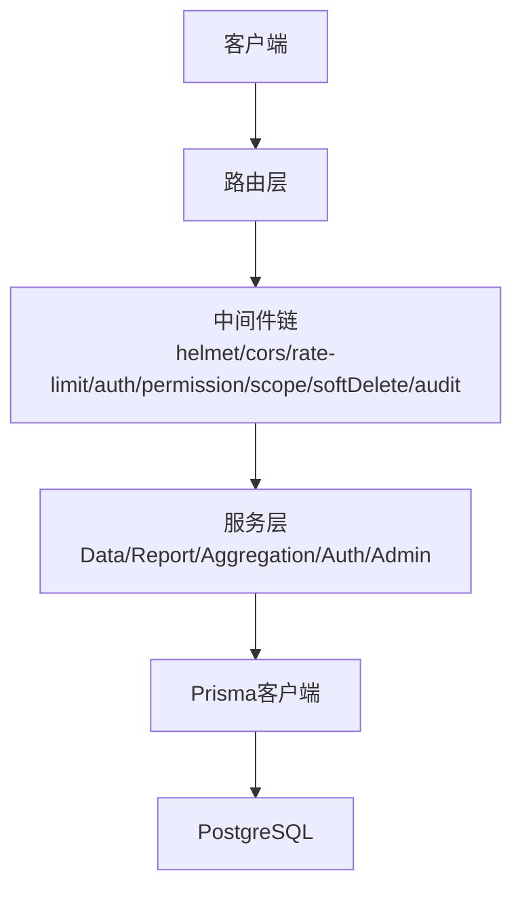
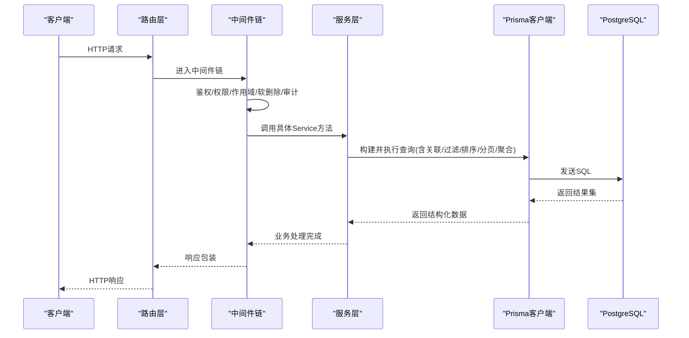
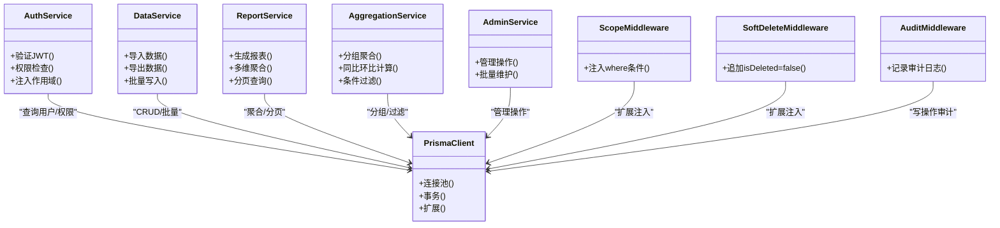

# 查询优化与性能

<cite>
**本文引用的文件**   
- [schema.prisma](file://server/prisma/schema.prisma)
- [prisma.ts](file://server/src/lib/prisma.ts)
- [AggregationService.ts](file://server/src/services/AggregationService.ts)
- [DataService.ts](file://server/src/services/DataService.ts)
- [ReportService.ts](file://server/src/services/ReportService.ts)
- [AuthService.ts](file://server/src/services/AuthService.ts)
- [AdminService.ts](file://server/src/services/AdminService.ts)
- [scope.ts](file://server/src/middleware/scope.ts)
- [soft-delete.ts](file://server/src/middleware/soft-delete.ts)
- [audit.ts](file://server/src/middleware/audit.ts)
- [error-handler.ts](file://server/src/middleware/error-handler.ts)
- [logger.ts](file://server/src/lib/logger.ts)
- [metrics-values.ts](file://server/src/lib/metric-values.ts)
- [period.ts](file://server/src/lib/period.ts)
- [formula.ts](file://server/src/lib/formula.ts)
- [env.ts](file://server/src/config/env.ts)
- [20260722121714_init/migration.sql](file://server/prisma/migrations/20260722121714_init/migration.sql)
- [20260722142144_add_formula_rule/migration.sql](file://server/prisma/migrations/20260722142144_add_formula_rule/migration.sql)
- [20260723120000_add_subject_analysis/migration.sql](file://server/prisma/migrations/20260723120000_add_subject_analysis/migration.sql)
- [20260724120000_remove_business_unit_org_scope/migration.sql](file://server/prisma/migrations/20260724120000_remove_business_unit_org_scope/migration.sql)
</cite>

## 目录
1. [简介](#简介)
2. [项目结构](#项目结构)
3. [核心组件](#核心组件)
4. [架构总览](#架构总览)
5. [详细组件分析](#详细组件分析)
6. [依赖关系分析](#依赖关系分析)
7. [性能考量](#性能考量)
8. [故障排查指南](#故障排查指南)
9. [结论](#结论)
10. [附录](#附录)

## 简介
本文件聚焦数据库查询优化与Prisma使用技巧，结合项目的Express + Prisma + PostgreSQL技术栈，系统阐述关联查询、条件过滤、排序分页、聚合查询的实现与优化策略；深入讲解索引设计与选择原则（复合索引、函数索引）；提供慢查询分析与性能监控方法；给出N+1问题的解决方案与批量操作最佳实践。文档面向后端开发者与数据工程师，兼顾可执行性与可观测性。

## 项目结构
本项目采用分层架构：路由层 → 中间件链（鉴权、权限、作用域、软删除、审计）→ 服务层（业务逻辑与查询编排）→ Prisma客户端 → 数据库。Prisma Schema定义数据模型与关系，迁移脚本驱动DDL变更。关键路径如下：
- Prisma客户端初始化与连接池配置
- 中间件对查询的作用域注入与软删除过滤
- 服务层封装复杂查询、聚合计算与批处理
- 日志与指标采集用于性能监控

**图表来源** 
- [prisma.ts](file://server/src/lib/prisma.ts)
- [scope.ts](file://server/src/middleware/scope.ts)
- [soft-delete.ts](file://server/src/middleware/soft-delete.ts)
- [audit.ts](file://server/src/middleware/audit.ts)
- [AuthService.ts](file://server/src/services/AuthService.ts)
- [DataService.ts](file://server/src/services/DataService.ts)
- [ReportService.ts](file://server/src/services/ReportService.ts)
- [AggregationService.ts](file://server/src/services/AggregationService.ts)
- [AdminService.ts](file://server/src/services/AdminService.ts)

**章节来源**
- [prisma.ts](file://server/src/lib/prisma.ts)
- [schema.prisma](file://server/prisma/schema.prisma)

## 核心组件
- Prisma客户端：统一连接池、事务、扩展与中间件集成点
- 作用域中间件：通过Prisma扩展注入租户/组织范围过滤
- 软删除中间件：全局追加isDeleted=false条件
- 审计中间件：记录写操作上下文
- 服务层：聚合计算、报表生成、数据导入导出、指标计算等
- 工具库：周期计算、公式解析、脱敏、指标值转换

**章节来源**
- [prisma.ts](file://server/src/lib/prisma.ts)
- [scope.ts](file://server/src/middleware/scope.ts)
- [soft-delete.ts](file://server/src/middleware/soft-delete.ts)
- [audit.ts](file://server/src/middleware/audit.ts)
- [AggregationService.ts](file://server/src/services/AggregationService.ts)
- [DataService.ts](file://server/src/services/DataService.ts)
- [ReportService.ts](file://server/src/services/ReportService.ts)
- [AuthService.ts](file://server/src/services/AuthService.ts)
- [AdminService.ts](file://server/src/services/AdminService.ts)
- [metric-values.ts](file://server/src/lib/metric-values.ts)
- [period.ts](file://server/src/lib/period.ts)
- [formula.ts](file://server/src/lib/formula.ts)

## 架构总览
下图展示一次典型查询从请求到数据库的调用链，以及中间件如何影响查询行为。

**图表来源** 
- [scope.ts](file://server/src/middleware/scope.ts)
- [soft-delete.ts](file://server/src/middleware/soft-delete.ts)
- [audit.ts](file://server/src/middleware/audit.ts)
- [prisma.ts](file://server/src/lib/prisma.ts)
- [AuthService.ts](file://server/src/services/AuthService.ts)
- [DataService.ts](file://server/src/services/DataService.ts)
- [ReportService.ts](file://server/src/services/ReportService.ts)
- [AggregationService.ts](file://server/src/services/AggregationService.ts)

## 详细组件分析

### Prisma客户端与连接池
- 连接池参数：最大连接数、超时、空闲回收策略
- 扩展点：在客户端级别注入通用where条件（如租户ID、组织范围、软删除）
- 事务管理：跨多个表写入或一致性读取时使用事务
- 日志与慢查询：开启SQL日志便于诊断

优化要点
- 合理设置连接池大小，避免过多并发导致锁竞争
- 使用Prisma扩展集中注入作用域与软删除条件，减少重复代码
- 对高频只读接口启用只读副本或缓存（可选）

**章节来源**
- [prisma.ts](file://server/src/lib/prisma.ts)

### 作用域与软删除中间件
- 作用域：基于用户/组织维度动态注入where条件，确保数据隔离
- 软删除：全局追加isDeleted=false，避免物理删除带来的风险
- 审计：记录写操作的主体、时间、IP、变更摘要

优化要点
- 将公共where条件下沉至Prisma扩展，减少服务层重复
- 对大表查询务必带上作用域字段索引，避免全表扫描

**章节来源**
- [scope.ts](file://server/src/middleware/scope.ts)
- [soft-delete.ts](file://server/src/middleware/soft-delete.ts)
- [audit.ts](file://server/src/middleware/audit.ts)

### 聚合服务（AggregationService）
职责
- 按维度分组聚合（如公司、科目、期间）
- 同比/环比实时计算（不存库），保证口径一致
- 支持多条件过滤、排序、分页

实现建议
- 优先使用数据库侧聚合（SUM/COUNT/GROUP BY），减少内存压力
- 对常用过滤字段建立复合索引
- 分页采用游标或键集分页，避免OFFSET在大表上的退化

**章节来源**
- [AggregationService.ts](file://server/src/services/AggregationService.ts)
- [period.ts](file://server/src/lib/period.ts)
- [metric-values.ts](file://server/src/lib/metric-values.ts)

### 数据服务（DataService）
职责
- 数据导入导出（Excel）、校验、脱敏
- 指标值标准化与单位换算（万元）
- 批量写入与错误回滚

优化建议
- 使用Prisma的批量创建/更新API，减少往返次数
- 导入时分批提交事务，控制单事务大小
- 对导入关键字段建立唯一约束与索引

**章节来源**
- [DataService.ts](file://server/src/services/DataService.ts)
- [formula.ts](file://server/src/lib/formula.ts)

### 报表服务（ReportService）
职责
- 组合多维度聚合结果生成报表
- 支持复杂过滤与排序
- 导出为Excel/PDF

优化建议
- 预聚合视图或物化视图（视数据量与刷新频率而定）
- 对报表常用查询建立覆盖索引
- 分页与懒加载结合，避免一次性拉取大量数据

**章节来源**
- [ReportService.ts](file://server/src/services/ReportService.ts)

### 认证与授权（AuthService）
职责
- JWT签发与校验，黑名单机制
- 权限校验与角色映射
- 作用域信息注入到后续中间件与服务

优化建议
- 将用户作用域信息缓存于请求上下文，避免重复查询
- 对高频鉴权路径做短TTL缓存

**章节来源**
- [AuthService.ts](file://server/src/services/AuthService.ts)

### 管理服务（AdminService）
职责
- 管理员操作（字典、配置、审计日志）
- 批量维护任务

优化建议
- 敏感操作加审计与二次确认
- 大批量清理任务分片执行，避免长事务

**章节来源**
- [AdminService.ts](file://server/src/services/AdminService.ts)

## 依赖关系分析
服务层与中间件、Prisma客户端之间的依赖关系如下：

**图表来源** 
- [AuthService.ts](file://server/src/services/AuthService.ts)
- [DataService.ts](file://server/src/services/DataService.ts)
- [ReportService.ts](file://server/src/services/ReportService.ts)
- [AggregationService.ts](file://server/src/services/AggregationService.ts)
- [AdminService.ts](file://server/src/services/AdminService.ts)
- [prisma.ts](file://server/src/lib/prisma.ts)
- [scope.ts](file://server/src/middleware/scope.ts)
- [soft-delete.ts](file://server/src/middleware/soft-delete.ts)
- [audit.ts](file://server/src/middleware/audit.ts)

## 性能考量

### Prisma查询构建器技巧
- 关联查询
  - 使用include按需加载关联数据，避免过度抓取
  - 对频繁关联的字段建立外键索引
  - 复杂关联考虑拆分查询或使用原生SQL
- 条件过滤
  - 将高选择性条件前置，利用索引快速定位
  - 避免在where中对列进行函数包裹（除非使用函数索引）
- 排序与分页
  - 优先使用有序索引排序，避免文件排序
  - 大数据集使用键集分页替代OFFSET
- 聚合查询
  - 尽量在数据库侧完成GROUP BY与聚合函数
  - 对聚合维度建立复合索引
  - 对热点指标可引入物化视图或定时预计算

### 索引设计与选择原则
- 单列索引：适用于高选择性且查询条件单一的场景
- 复合索引：遵循最左前缀原则，按查询条件顺序设计
- 函数索引：对where中使用函数的列建立函数索引（如lower、date_trunc）
- 覆盖索引：包含查询所需全部列，避免回表
- 唯一索引：用于业务唯一性约束与加速去重

常见场景
- 按公司+期间+科目查询：(company_id, period, subject_id)
- 按日期范围+公司：(company_id, date BETWEEN ...)
- 模糊搜索：使用前缀匹配或全文索引

**章节来源**
- [schema.prisma](file://server/prisma/schema.prisma)
- [20260722121714_init/migration.sql](file://server/prisma/migrations/20260722121714_init/migration.sql)
- [20260722142144_add_formula_rule/migration.sql](file://server/prisma/migrations/20260722142144_add_formula_rule/migration.sql)
- [20260723120000_add_subject_analysis/migration.sql](file://server/prisma/migrations/20260723120000_add_subject_analysis/migration.sql)
- [20260724120000_remove_business_unit_org_scope/migration.sql](file://server/prisma/migrations/20260724120000_remove_business_unit_org_scope/migration.sql)

### N+1查询问题与解决方案
- 识别N+1：在循环中逐条查询关联数据
- 解决策略
  - 使用Prisma include一次性加载关联
  - 拆分查询后内存合并（适合一对多且数据量大）
  - 使用原始SQL或存储过程优化复杂关联
- 监控手段：开启SQL日志，统计查询数量与耗时

**章节来源**
- [prisma.ts](file://server/src/lib/prisma.ts)
- [AggregationService.ts](file://server/src/services/AggregationService.ts)
- [ReportService.ts](file://server/src/services/ReportService.ts)

### 批量操作最佳实践
- 使用Prisma的批量API（createMany/updateMany/deleteMany）
- 控制事务大小，避免长事务导致锁等待
- 导入数据时分批提交，失败重试与幂等设计
- 对批量写入目标表建立合适索引，避免插入抖动

**章节来源**
- [DataService.ts](file://server/src/services/DataService.ts)
- [AdminService.ts](file://server/src/services/AdminService.ts)

### 慢查询分析与性能监控
- 启用PostgreSQL慢查询日志（log_min_duration_statement）
- 使用EXPLAIN/EXPLAIN ANALYZE分析执行计划
- 监控Prisma客户端连接池利用率与SQL耗时
- 在服务层埋点关键查询耗时与命中率

**章节来源**
- [logger.ts](file://server/src/lib/logger.ts)
- [env.ts](file://server/src/config/env.ts)

## 故障排查指南
- 常见问题
  - 连接池耗尽：检查未释放连接与长事务
  - 慢查询：查看执行计划，补充缺失索引
  - N+1：定位循环查询，改用include或拆分
  - 死锁：缩短事务，统一锁顺序
- 排查步骤
  - 开启SQL日志与慢查询阈值
  - 使用EXPLAIN分析热点SQL
  - 检查索引命中与统计信息是否过期
  - 评估连接池与并发参数

**章节来源**
- [error-handler.ts](file://server/src/middleware/error-handler.ts)
- [logger.ts](file://server/src/lib/logger.ts)
- [env.ts](file://server/src/config/env.ts)

## 结论
通过合理的Prisma查询构建、索引设计与中间件治理，可显著提升查询性能与系统稳定性。建议以数据模型为中心规划索引，以中间件为抓手统一作用域与软删除，以服务层为核心封装聚合与批处理，并以日志与监控闭环持续优化。

## 附录
- 相关规范与参考
  - 数据模型规范
  - 安全与权限规范
  - 性能参考文档

[本节为概念性内容，不直接分析具体文件]