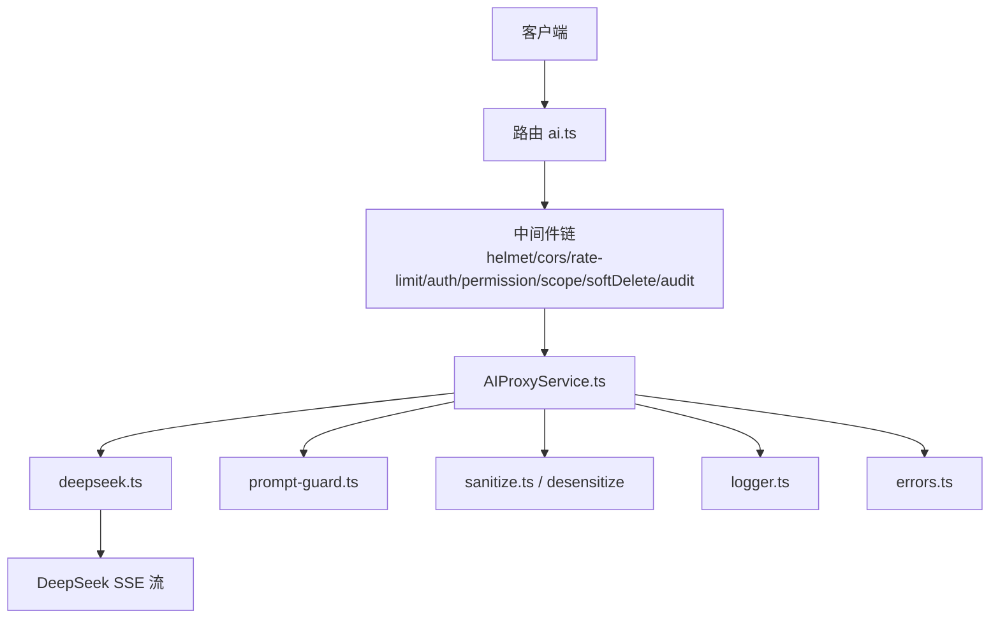
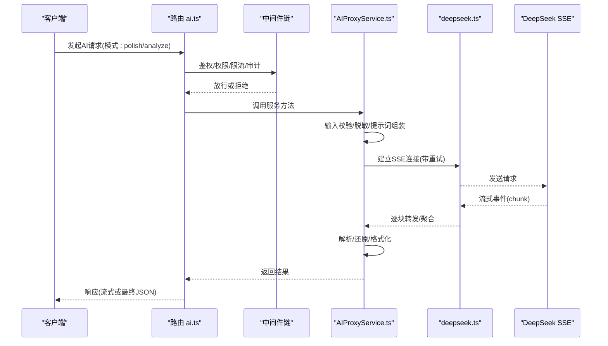
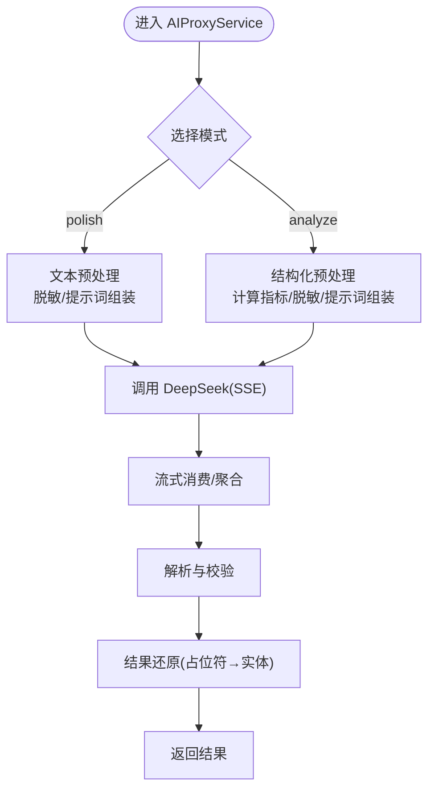
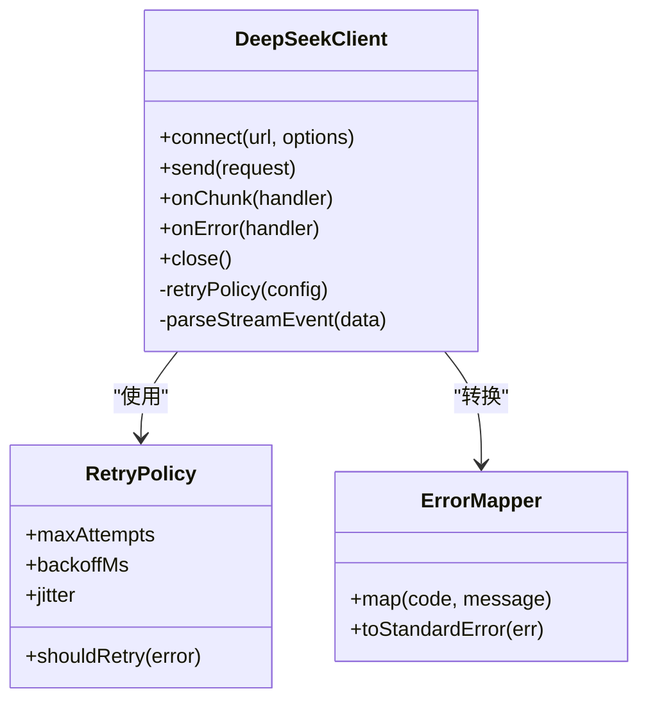
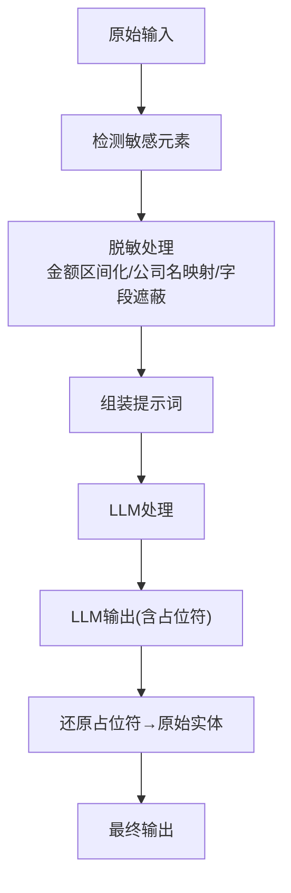
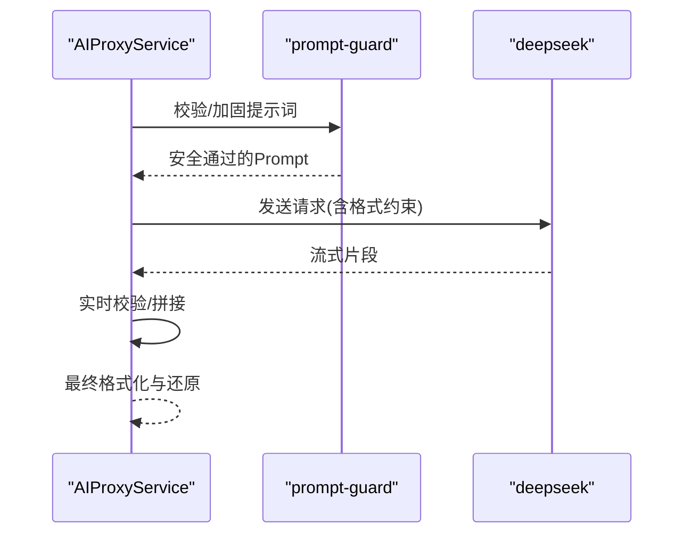
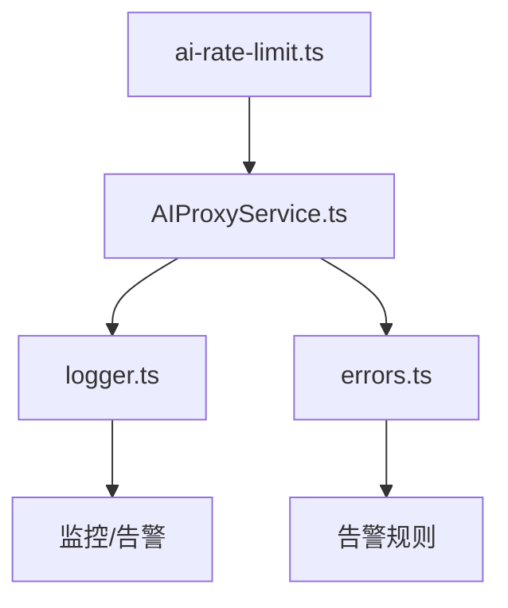
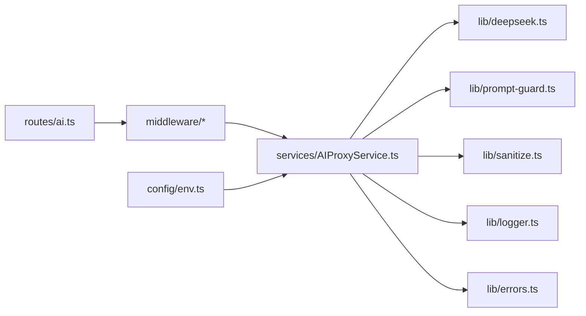

# AI代理服务

<cite>
**本文引用的文件**   
- [AIProxyService.ts](file://server/src/services/AIProxyService.ts)
- [deepseek.ts](file://server/src/lib/deepseek.ts)
- [ai-rate-limit.ts](file://server/src/middleware/ai-rate-limit.ts)
- [env.ts](file://server/src/config/env.ts)
- [logger.ts](file://server/src/lib/logger.ts)
- [errors.ts](file://server/src/lib/errors.ts)
- [prompt-guard.ts](file://server/src/lib/prompt-guard.ts)
- [sanitize.ts](file://server/src/lib/sanitize.ts)
- [desensitize.test.ts](file://server/src/lib/desensitize.test.ts)
- [ai.ts](file://server/src/routes/ai.ts)
- [app.ts](file://server/src/app.ts)
- [server.ts](file://server/src/server.ts)
</cite>

## 目录
1. [简介](#简介)
2. [项目结构](#项目结构)
3. [核心组件](#核心组件)
4. [架构总览](#架构总览)
5. [详细组件分析](#详细组件分析)
6. [依赖关系分析](#依赖关系分析)
7. [性能与成本](#性能与成本)
8. [故障排查指南](#故障排查指南)
9. [结论](#结论)
10. [附录](#附录)

## 简介
本文件面向FY200 AI代理服务，聚焦双管道架构（polish文本润色、analyze结构化分析）、DeepSeek API集成（SSE流式、重试与错误处理）、数据脱敏（金额区间化、公司名映射、敏感信息保护）、提示词工程与响应格式化、以及API限流、成本控制与监控告警配置。文档以代码为依据，提供架构图、流程图与调用序列图，帮助读者快速理解并安全使用服务。

## 项目结构
后端采用Express路由+中间件链，AI能力由服务层封装，外部依赖通过lib模块接入。关键路径：
- 路由入口：routes/ai.ts
- 应用装配：app.ts、server.ts
- 服务实现：services/AIProxyService.ts
- DeepSeek客户端：lib/deepseek.ts
- 限流与鉴权：middleware/ai-rate-limit.ts
- 配置与环境：config/env.ts
- 日志与错误：lib/logger.ts、lib/errors.ts
- 提示词防护与脱敏：lib/prompt-guard.ts、lib/sanitize.ts、lib/desensitize.test.ts

**图示来源** 
- [ai.ts](file://server/src/routes/ai.ts)
- [app.ts](file://server/src/app.ts)
- [server.ts](file://server/src/server.ts)
- [AIProxyService.ts](file://server/src/services/AIProxyService.ts)
- [deepseek.ts](file://server/src/lib/deepseek.ts)
- [prompt-guard.ts](file://server/src/lib/prompt-guard.ts)
- [sanitize.ts](file://server/src/lib/sanitize.ts)
- [logger.ts](file://server/src/lib/logger.ts)
- [errors.ts](file://server/src/lib/errors.ts)

**章节来源**
- [ai.ts](file://server/src/routes/ai.ts)
- [app.ts](file://server/src/app.ts)
- [server.ts](file://server/src/server.ts)

## 核心组件
- AIProxyService：统一编排AI请求的双管道流程（polish/analyze），负责输入校验、脱敏、提示词组装、LLM调用、流式消费、结果还原与输出。
- deepseek：封装DeepSeek HTTP/SSE客户端，支持流式读取、超时控制、指数退避重试与错误分类。
- ai-rate-limit：针对AI接口的独立限流策略，结合令牌桶或滑动窗口限制并发与QPS。
- prompt-guard：提示词注入防护与白名单校验，确保Prompt安全合规。
- sanitize/desensitize：通用清洗与业务脱敏（金额区间化、公司名映射、敏感字段遮蔽）。
- logger/errors：结构化日志与标准化错误模型，便于追踪与告警。

**章节来源**
- [AIProxyService.ts](file://server/src/services/AIProxyService.ts)
- [deepseek.ts](file://server/src/lib/deepseek.ts)
- [ai-rate-limit.ts](file://server/src/middleware/ai-rate-limit.ts)
- [prompt-guard.ts](file://server/src/lib/prompt-guard.ts)
- [sanitize.ts](file://server/src/lib/sanitize.ts)
- [desensitize.test.ts](file://server/src/lib/desensitize.test.ts)
- [logger.ts](file://server/src/lib/logger.ts)
- [errors.ts](file://server/src/lib/errors.ts)

## 架构总览
AI代理服务的整体调用链路如下：

**图示来源** 
- [ai.ts](file://server/src/routes/ai.ts)
- [AIProxyService.ts](file://server/src/services/AIProxyService.ts)
- [deepseek.ts](file://server/src/lib/deepseek.ts)

## 详细组件分析

### AIProxyService 双管道架构
- 模式一：polish（文本润色）
  - 输入为自然语言文本，先进行脱敏（金额区间化、公司名映射、敏感信息遮蔽），再拼装提示词，调用LLM生成润色后的文本，最后进行结果还原（将占位符替换回原始实体）。
- 模式二：analyze（结构化分析）
  - 输入为结构化数据（如指标、维度、时间范围），后端先计算必要指标（同比/环比等），再进行脱敏与提示词组装，调用LLM生成结构化分析报告，随后对输出进行格式校验与字段还原。

**图示来源** 
- [AIProxyService.ts](file://server/src/services/AIProxyService.ts)

**章节来源**
- [AIProxyService.ts](file://server/src/services/AIProxyService.ts)

### DeepSeek API 集成（SSE、重试与错误处理）
- SSE流式响应：客户端建立SSE连接后，服务端逐块接收事件，边收边处理，降低首字节延迟。
- 请求重试：对网络抖动、临时失败实施指数退避重试，避免瞬时异常导致失败。
- 错误分类：区分网络错误、超时、HTTP状态码异常、解析失败等，统一抛出标准错误对象，便于上层捕获与告警。
- 超时与熔断：设置合理超时阈值，必要时触发熔断或降级策略。

**图示来源** 
- [deepseek.ts](file://server/src/lib/deepseek.ts)

**章节来源**
- [deepseek.ts](file://server/src/lib/deepseek.ts)

### 数据脱敏机制
- 金额区间化：将绝对金额转换为区间（如“小于1万”“1-5万”“5-10万”等），避免泄露精确数值。
- 公司名映射：将真实公司名映射为匿名标识（如“公司A/B/C”），支持动态映射表与缓存。
- 敏感信息保护：对手机号、邮箱、身份证等敏感字段进行遮蔽或哈希化处理。
- 还原技术：在输出前将占位符替换回原始实体，保证可读性与准确性。

**图示来源** 
- [sanitize.ts](file://server/src/lib/sanitize.ts)
- [desensitize.test.ts](file://server/src/lib/desensitize.test.ts)

**章节来源**
- [sanitize.ts](file://server/src/lib/sanitize.ts)
- [desensitize.test.ts](file://server/src/lib/desensitize.test.ts)

### 提示词工程与响应格式化
- 提示词工程：基于模板与上下文变量动态生成Prompt，包含角色设定、任务描述、约束条件、输出格式要求等。
- 响应格式化：对LLM输出进行结构化校验（JSON Schema/正则），缺失字段补全或修正，确保下游稳定消费。
- 结果还原：将占位符替换为真实实体，保持语义一致性与可读性。

**图示来源** 
- [prompt-guard.ts](file://server/src/lib/prompt-guard.ts)
- [AIProxyService.ts](file://server/src/services/AIProxyService.ts)
- [deepseek.ts](file://server/src/lib/deepseek.ts)

**章节来源**
- [prompt-guard.ts](file://server/src/lib/prompt-guard.ts)
- [AIProxyService.ts](file://server/src/services/AIProxyService.ts)

### API 限流、成本控制与监控告警
- 限流策略：按用户/IP/接口维度设置QPS与并发上限，防止滥用与雪崩。
- 成本控制：统计Token用量、请求次数、失败率，结合预算阈值触发告警或自动降级。
- 监控告警：记录关键指标（延迟、吞吐、错误率、成本），对接日志与告警系统，支持阈值与趋势分析。

**图示来源** 
- [ai-rate-limit.ts](file://server/src/middleware/ai-rate-limit.ts)
- [logger.ts](file://server/src/lib/logger.ts)
- [errors.ts](file://server/src/lib/errors.ts)

**章节来源**
- [ai-rate-limit.ts](file://server/src/middleware/ai-rate-limit.ts)
- [logger.ts](file://server/src/lib/logger.ts)
- [errors.ts](file://server/src/lib/errors.ts)

## 依赖关系分析
- 路由层依赖中间件链完成鉴权、权限、限流、审计等横切关注点。
- 服务层依赖lib模块完成LLM通信、提示词防护、脱敏与日志错误处理。
- 配置中心集中管理环境变量（如API密钥、超时、重试参数、限流阈值）。

**图示来源** 
- [ai.ts](file://server/src/routes/ai.ts)
- [AIProxyService.ts](file://server/src/services/AIProxyService.ts)
- [deepseek.ts](file://server/src/lib/deepseek.ts)
- [prompt-guard.ts](file://server/src/lib/prompt-guard.ts)
- [sanitize.ts](file://server/src/lib/sanitize.ts)
- [logger.ts](file://server/src/lib/logger.ts)
- [errors.ts](file://server/src/lib/errors.ts)
- [env.ts](file://server/src/config/env.ts)

**章节来源**
- [ai.ts](file://server/src/routes/ai.ts)
- [AIProxyService.ts](file://server/src/services/AIProxyService.ts)
- [env.ts](file://server/src/config/env.ts)

## 性能与成本
- 流式处理：SSE逐块传输，显著降低首字节延迟，提升用户体验。
- 重试策略：指数退避+抖动，提高稳定性；需设置最大重试次数与超时，避免放大负载。
- 资源控制：限流与熔断保护后端与上游API；合理拆分请求，减少大Payload。
- 成本优化：压缩提示词长度、复用上下文、批量处理；监控Token消耗与失败率，动态调整策略。

[本节为通用指导，不直接分析具体文件]

## 故障排查指南
- 常见问题
  - SSE连接中断：检查网络与超时配置，确认重试策略是否生效。
  - 提示词被拦截：查看prompt-guard日志，确认白名单与注入检测规则。
  - 脱敏还原异常：核对占位符映射表与还原逻辑，检查测试用例覆盖。
  - 限流触发：检查ai-rate-limit配置与配额，评估是否需要扩容或调优。
- 定位手段
  - 启用结构化日志，记录请求ID、耗时、错误堆栈与上游响应摘要。
  - 使用错误分类与告警规则，快速识别网络、超时、解析与业务错误。
  - 通过监控面板观察QPS、延迟、错误率与成本曲线，定位瓶颈。

**章节来源**
- [logger.ts](file://server/src/lib/logger.ts)
- [errors.ts](file://server/src/lib/errors.ts)
- [prompt-guard.ts](file://server/src/lib/prompt-guard.ts)
- [ai-rate-limit.ts](file://server/src/middleware/ai-rate-limit.ts)

## 结论
FY200 AI代理服务通过双管道架构实现了灵活的文本润色与结构化分析能力，结合DeepSeek的SSE流式响应、稳健的重试与错误处理、完善的脱敏与还原机制，以及严格的限流与监控告警，为财年经营数据分析提供了安全、高效、可控的AI能力支撑。建议在生产环境持续优化提示词模板、监控指标与成本策略，确保服务质量与成本平衡。

[本节为总结性内容，不直接分析具体文件]

## 附录
- 配置项建议
  - DeepSeek连接：超时、重试次数、退避策略、SSE缓冲大小。
  - 限流策略：QPS、并发、窗口大小、配额分配。
  - 脱敏规则：金额区间划分、公司名映射表、敏感字段清单。
  - 监控告警：延迟分位、错误率、Token用量、成本阈值。

[本节为补充说明，不直接分析具体文件]