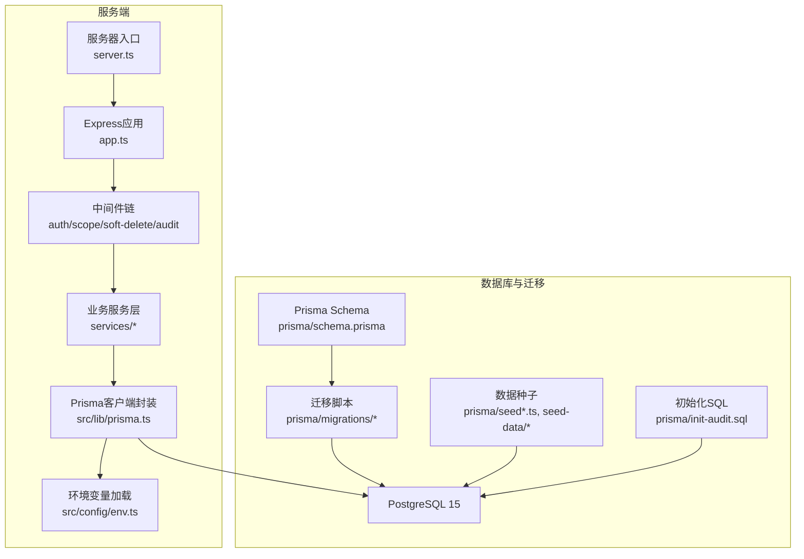
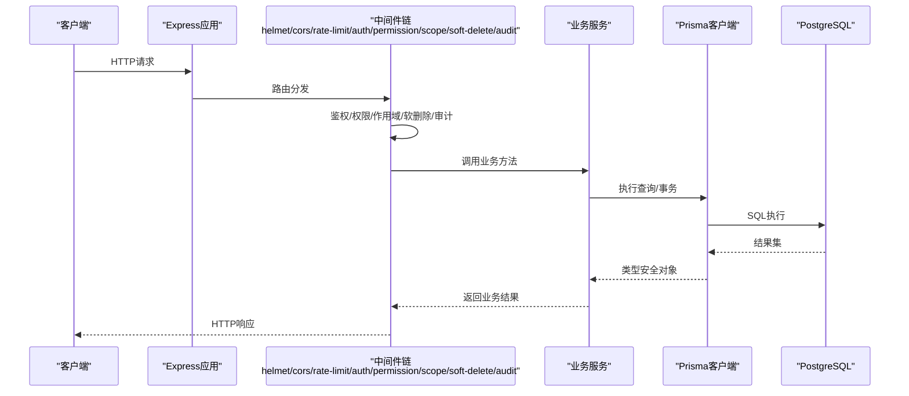
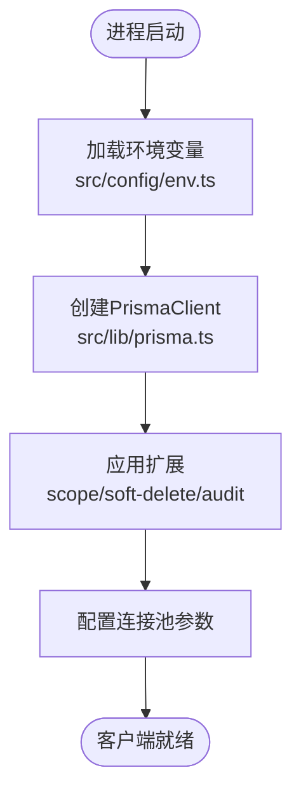
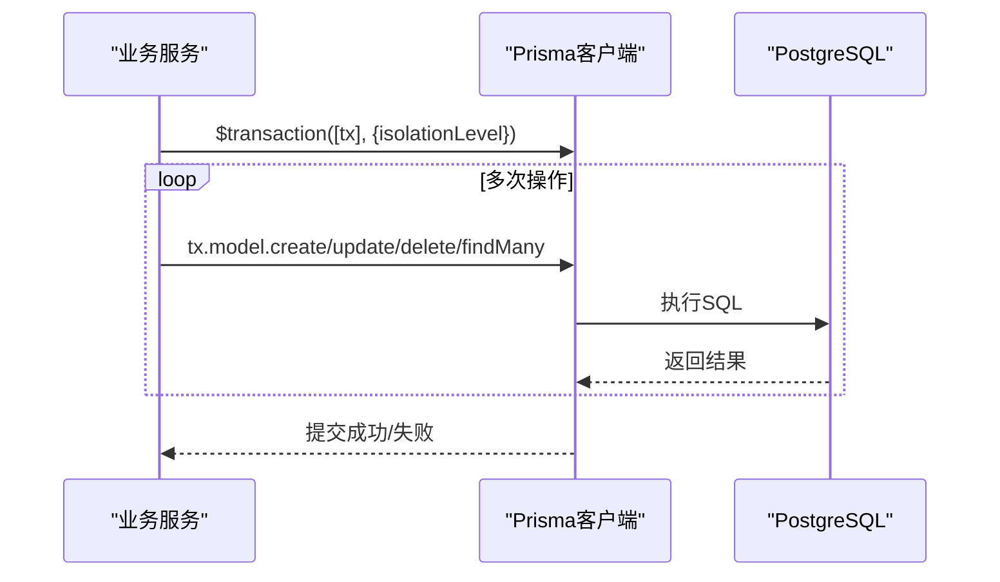
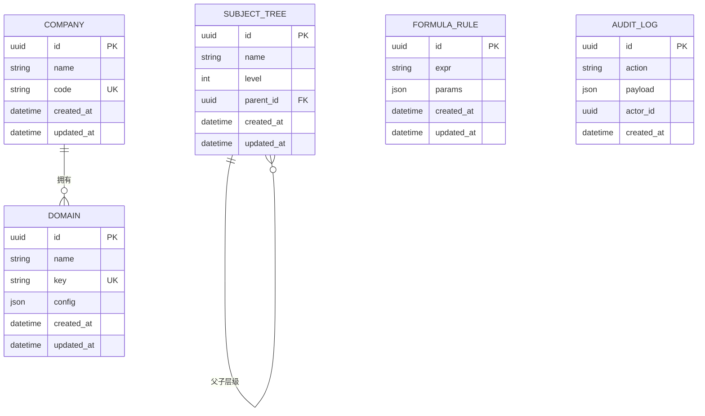
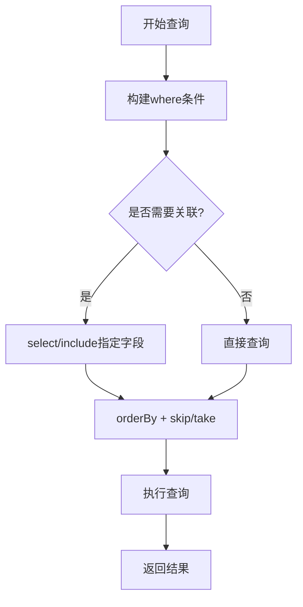
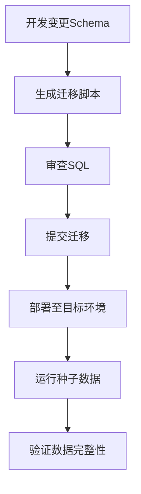
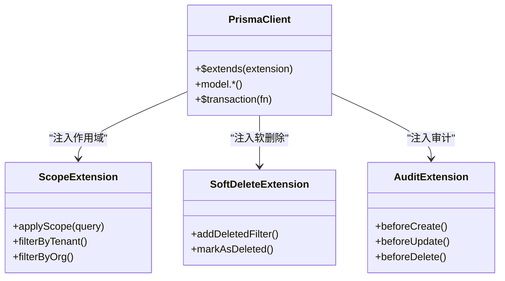
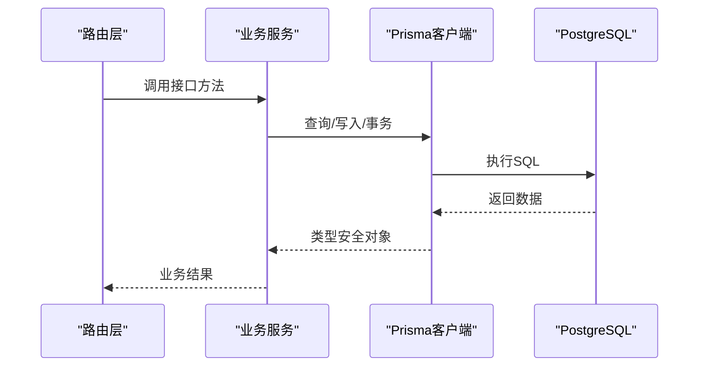
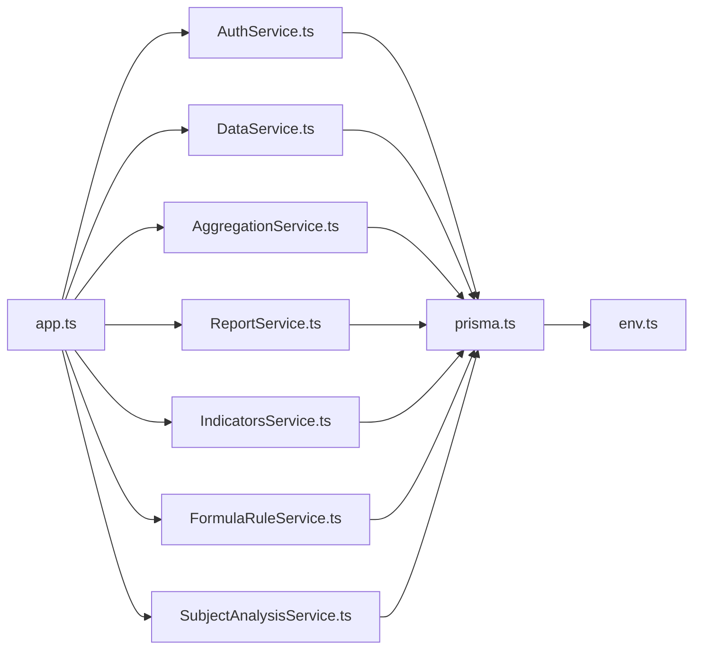

# Prisma ORM使用模式

<cite>
**本文引用的文件**   
- [schema.prisma](file://server/prisma/schema.prisma)
- [prisma.ts](file://server/src/lib/prisma.ts)
- [env.ts](file://server/src/config/env.ts)
- [seed.ts](file://server/prisma/seed.ts)
- [seed-companies.ts](file://server/prisma/seed-companies.ts)
- [seed-domain.ts](file://server/prisma/seed-domain.ts)
- [subject-trees.ts](file://server/prisma/seed-data/subject-trees.ts)
- [init-audit.sql](file://server/prisma/init-audit.sql)
- [20260722121714_init/migration.sql](file://server/prisma/migrations/20260722121714_init/migration.sql)
- [20260722142144_add_formula_rule/migration.sql](file://server/prisma/migrations/20260722142144_add_formula_rule/migration.sql)
- [20260723120000_add_subject_analysis/migration.sql](file://server/prisma/migrations/20260723120000_add_subject_analysis/migration.sql)
- [20260724120000_remove_business_unit_org_scope/migration.sql](file://server/prisma/migrations/20260724120000_remove_business_unit_org_scope/migration.sql)
- [migration_lock.toml](file://server/prisma/migrations/migration_lock.toml)
- [scope.ts](file://server/src/middleware/scope.ts)
- [soft-delete.ts](file://server/src/middleware/soft-delete.ts)
- [audit.ts](file://server/src/middleware/audit.ts)
- [errors.ts](file://server/src/lib/errors.ts)
- [logger.ts](file://server/src/lib/logger.ts)
- [AuthService.ts](file://server/src/services/AuthService.ts)
- [DataService.ts](file://server/src/services/DataService.ts)
- [AggregationService.ts](file://server/src/services/AggregationService.ts)
- [ReportService.ts](file://server/src/services/ReportService.ts)
- [IndicatorsService.ts](file://server/src/services/IndicatorsService.ts)
- [FormulaRuleService.ts](file://server/src/services/FormulaRuleService.ts)
- [SubjectAnalysisService.ts](file://server/src/services/SubjectAnalysisService.ts)
- [app.ts](file://server/src/app.ts)
- [server.ts](file://server/src/server.ts)
</cite>

## 目录
1. [简介](#简介)
2. [项目结构](#项目结构)
3. [核心组件](#核心组件)
4. [架构总览](#架构总览)
5. [详细组件分析](#详细组件分析)
6. [依赖关系分析](#依赖关系分析)
7. [性能考量](#性能考量)
8. [故障排查指南](#故障排查指南)
9. [结论](#结论)
10. [附录](#附录)

## 简介
本指南聚焦 FY200 项目的 Prisma ORM 使用模式，覆盖客户端配置、连接池与事务、模型定义规范、查询构建最佳实践、迁移与数据种子、回滚策略、性能优化以及错误处理与调试。读者可据此快速上手并高效维护基于 Prisma + PostgreSQL 的后端服务。

## 项目结构
后端采用 Express 4 + Prisma 5 + PostgreSQL 15 的技术栈。Prisma 相关代码集中在 server/prisma 与 server/src/lib/prisma.ts，中间件通过扩展将权限、软删除、审计等能力注入到 Prisma 客户端。

图表来源
- [app.ts](file://server/src/app.ts)
- [server.ts](file://server/src/server.ts)
- [prisma.ts](file://server/src/lib/prisma.ts)
- [env.ts](file://server/src/config/env.ts)
- [schema.prisma](file://server/prisma/schema.prisma)
- [migration_lock.toml](file://server/prisma/migrations/migration_lock.toml)

章节来源
- [app.ts](file://server/src/app.ts)
- [server.ts](file://server/src/server.ts)
- [prisma.ts](file://server/src/lib/prisma.ts)
- [env.ts](file://server/src/config/env.ts)

## 核心组件
- Prisma 客户端封装：统一创建实例、连接池参数、日志与扩展注入。
- 环境变量：数据库连接串、连接池大小、超时、日志级别等。
- 中间件扩展：权限作用域（scope）、软删除、审计写入等以 Prisma extension 形式注入。
- 服务层：各业务 Service 通过 Prisma 客户端进行 CRUD 与复杂查询。
- 迁移与种子：Schema 驱动迁移、增量迁移、锁定文件、种子脚本与初始化 SQL。

章节来源
- [prisma.ts](file://server/src/lib/prisma.ts)
- [env.ts](file://server/src/config/env.ts)
- [scope.ts](file://server/src/middleware/scope.ts)
- [soft-delete.ts](file://server/src/middleware/soft-delete.ts)
- [audit.ts](file://server/src/middleware/audit.ts)

## 架构总览
下图展示从请求进入 Express 到 Prisma 访问 PostgreSQL 的完整链路，以及中间件对 Prisma 的扩展点。

图表来源
- [app.ts](file://server/src/app.ts)
- [scope.ts](file://server/src/middleware/scope.ts)
- [soft-delete.ts](file://server/src/middleware/soft-delete.ts)
- [audit.ts](file://server/src/middleware/audit.ts)
- [prisma.ts](file://server/src/lib/prisma.ts)

## 详细组件分析

### Prisma 客户端配置与连接池管理
- 客户端实例化：在 lib/prisma.ts 中创建 PrismaClient，读取 env.ts 中的数据库连接串与连接池参数。
- 连接池参数：根据环境设置最大连接数、最小空闲连接、超时时间、健康检查间隔等。
- 日志与调试：按环境开启 SQL 日志或慢查询告警，便于定位性能问题。
- 扩展注入：通过 $extends 注入 scope、软删除、审计等逻辑，确保所有查询自动带上作用域与审计字段。

图表来源
- [prisma.ts](file://server/src/lib/prisma.ts)
- [env.ts](file://server/src/config/env.ts)

章节来源
- [prisma.ts](file://server/src/lib/prisma.ts)
- [env.ts](file://server/src/config/env.ts)

### 事务处理模式
- 单事务多操作：在 Service 中使用 prisma.$transaction 包裹多个读写操作，保证原子性。
- 隔离级别：根据场景选择 READ COMMITTED / REPEATABLE READ / SERIALIZABLE。
- 重试策略：对死锁与短暂冲突进行指数退避重试。
- 长事务规避：避免在事务中进行外部 IO（如网络请求），减少锁持有时间。

图表来源
- [prisma.ts](file://server/src/lib/prisma.ts)

章节来源
- [prisma.ts](file://server/src/lib/prisma.ts)

### 模型定义规范
- 字段类型：使用 Prisma 内置类型（String、Int、Float、Boolean、DateTime、Json 等），金额统一为 Decimal 或 Int（单位万元）。
- 关系映射：一对多、多对一、一对一、多对多使用 relation 字段声明，保持外键一致性。
- 约束设置：唯一索引、非空、默认值、校验规则（@unique、@default、@map）等。
- 命名约定：表名复数、字段小写下划线、关联字段遵循 _id 后缀。

图表来源
- [schema.prisma](file://server/prisma/schema.prisma)

章节来源
- [schema.prisma](file://server/prisma/schema.prisma)

### 查询构建最佳实践
- 关联查询：使用 include/select 精确获取所需字段，避免 N+1；必要时拆分查询并在内存组装。
- 条件过滤：优先使用 where 子句与索引字段；复杂表达式考虑生成列或物化视图。
- 排序分页：使用 orderBy 与 skip/take；大偏移分页改用游标分页。
- 聚合计算：利用 Prisma 的 groupBy 与 count/sum/avg/min/max 减少往返。

图表来源
- [DataService.ts](file://server/src/services/DataService.ts)
- [AggregationService.ts](file://server/src/services/AggregationService.ts)

章节来源
- [DataService.ts](file://server/src/services/DataService.ts)
- [AggregationService.ts](file://server/src/services/AggregationService.ts)

### 迁移管理与数据种子
- 迁移流程：修改 schema.prisma → prisma migrate dev 生成迁移 → 审查 migration.sql → 提交。
- 锁定机制：migration_lock.toml 确保跨环境一致。
- 数据种子：seed.ts 与 seed-companies.ts、seed-domain.ts、seed-data/subject-trees.ts 提供基础数据。
- 初始化脚本：init-audit.sql 用于一次性初始化触发器或函数。
- 回滚策略：生产环境谨慎回滚，优先新增迁移修复；必要时准备反向迁移脚本。

图表来源
- [schema.prisma](file://server/prisma/schema.prisma)
- [migration_lock.toml](file://server/prisma/migrations/migration_lock.toml)
- [seed.ts](file://server/prisma/seed.ts)
- [seed-companies.ts](file://server/prisma/seed-companies.ts)
- [seed-domain.ts](file://server/prisma/seed-domain.ts)
- [subject-trees.ts](file://server/prisma/seed-data/subject-trees.ts)
- [init-audit.sql](file://server/prisma/init-audit.sql)

章节来源
- [schema.prisma](file://server/prisma/schema.prisma)
- [migration_lock.toml](file://server/prisma/migrations/migration_lock.toml)
- [seed.ts](file://server/prisma/seed.ts)
- [seed-companies.ts](file://server/prisma/seed-companies.ts)
- [seed-domain.ts](file://server/prisma/seed-domain.ts)
- [subject-trees.ts](file://server/prisma/seed-data/subject-trees.ts)
- [init-audit.sql](file://server/prisma/init-audit.sql)

### 中间件与扩展集成
- 权限作用域：scope 中间件通过 Prisma extension 注入 tenantId/orgId 等过滤条件。
- 软删除：soft-delete 扩展在查询时自动追加 is_deleted=false，更新时标记而非物理删除。
- 审计：audit 中间件记录关键操作的 actor、action、payload，便于追踪与合规。

图表来源
- [scope.ts](file://server/src/middleware/scope.ts)
- [soft-delete.ts](file://server/src/middleware/soft-delete.ts)
- [audit.ts](file://server/src/middleware/audit.ts)
- [prisma.ts](file://server/src/lib/prisma.ts)

章节来源
- [scope.ts](file://server/src/middleware/scope.ts)
- [soft-delete.ts](file://server/src/middleware/soft-delete.ts)
- [audit.ts](file://server/src/middleware/audit.ts)
- [prisma.ts](file://server/src/lib/prisma.ts)

### 服务层与 Prisma 交互
- AuthService：用户认证、令牌签发与黑名单校验，结合 JWT 与审计。
- DataService：通用数据 CRUD、导入导出、批量操作与事务。
- AggregationService：指标聚合、同比环比计算、缓存策略。
- ReportService：报表生成、模板渲染、导出格式。
- IndicatorsService：指标定义、公式解析、校验与计算。
- FormulaRuleService：公式规则维护、白名单算子校验。
- SubjectAnalysisService：科目树分析与指标钻取。

图表来源
- [AuthService.ts](file://server/src/services/AuthService.ts)
- [DataService.ts](file://server/src/services/DataService.ts)
- [AggregationService.ts](file://server/src/services/AggregationService.ts)
- [ReportService.ts](file://server/src/services/ReportService.ts)
- [IndicatorsService.ts](file://server/src/services/IndicatorsService.ts)
- [FormulaRuleService.ts](file://server/src/services/FormulaRuleService.ts)
- [SubjectAnalysisService.ts](file://server/src/services/SubjectAnalysisService.ts)

章节来源
- [AuthService.ts](file://server/src/services/AuthService.ts)
- [DataService.ts](file://server/src/services/DataService.ts)
- [AggregationService.ts](file://server/src/services/AggregationService.ts)
- [ReportService.ts](file://server/src/services/ReportService.ts)
- [IndicatorsService.ts](file://server/src/services/IndicatorsService.ts)
- [FormulaRuleService.ts](file://server/src/services/FormulaRuleService.ts)
- [SubjectAnalysisService.ts](file://server/src/services/SubjectAnalysisService.ts)

## 依赖关系分析
- 模块耦合：服务层依赖 Prisma 客户端，中间件通过扩展注入行为，降低侵入性。
- 外部依赖：PostgreSQL 驱动、JWT 库、DeepSeek API（SSE 流式）。
- 循环依赖：避免在服务与中间件之间直接相互引用，通过扩展与事件解耦。

图表来源
- [app.ts](file://server/src/app.ts)
- [prisma.ts](file://server/src/lib/prisma.ts)
- [env.ts](file://server/src/config/env.ts)

章节来源
- [app.ts](file://server/src/app.ts)
- [prisma.ts](file://server/src/lib/prisma.ts)
- [env.ts](file://server/src/config/env.ts)

## 性能考量
- 查询优化
  - 使用 select/include 精确字段，避免全表扫描与冗余数据传输。
  - 合理使用索引：高频过滤字段建立 B-tree，JSON 字段使用 GIN。
  - 避免 N+1：批量查询或在内存中组装，必要时拆分请求。
- 连接池与超时
  - 根据并发与数据库容量调整 maxConnections、idleTimeout、acquireTimeout。
  - 监控连接泄漏与长时间未释放的连接。
- 缓存策略
  - 热点数据使用 Redis 缓存，设置合理 TTL 与失效策略。
  - 聚合结果可物化为视图或汇总表，定时刷新。
- 事务与锁
  - 缩短事务范围，避免在事务内做外部 IO。
  - 使用合适的隔离级别与行级锁，减少死锁概率。

[本节为通用指导，不直接分析具体文件]

## 故障排查指南
- 常见错误
  - 连接失败：检查 DATABASE_URL、网络连通性与防火墙。
  - 迁移冲突：核对 migration_lock.toml 与目标环境迁移状态。
  - 权限不足：确认角色与表权限、扩展是否生效。
- 调试方法
  - 启用 SQL 日志与慢查询告警，定位耗时语句。
  - 使用结构化日志记录关键路径与异常堆栈。
  - 单元测试与集成测试覆盖关键查询与事务。
- 工具与技巧
  - psql 与 EXPLAIN ANALYZE 分析执行计划。
  - 使用 pg_stat_statements 统计热点查询。
  - 监控连接池指标与数据库负载。

章节来源
- [errors.ts](file://server/src/lib/errors.ts)
- [logger.ts](file://server/src/lib/logger.ts)

## 结论
FY200 项目通过 Prisma 客户端封装与中间件扩展，实现了类型安全、可观测且易维护的数据访问层。遵循本指南的模型规范、查询最佳实践与迁移策略，可在保障数据一致性的同时提升系统性能与可运维性。建议持续完善索引设计、缓存策略与监控告警，以应对增长的业务需求。

## 附录
- 环境变量清单：DATABASE_URL、NODE_ENV、LOG_LEVEL、POOL_* 等。
- 迁移命令参考：migrate dev、migrate deploy、migrate reset、db seed。
- 常用查询模式：分页、聚合、关联查询、事务包裹。

[本节为补充信息，不直接分析具体文件]