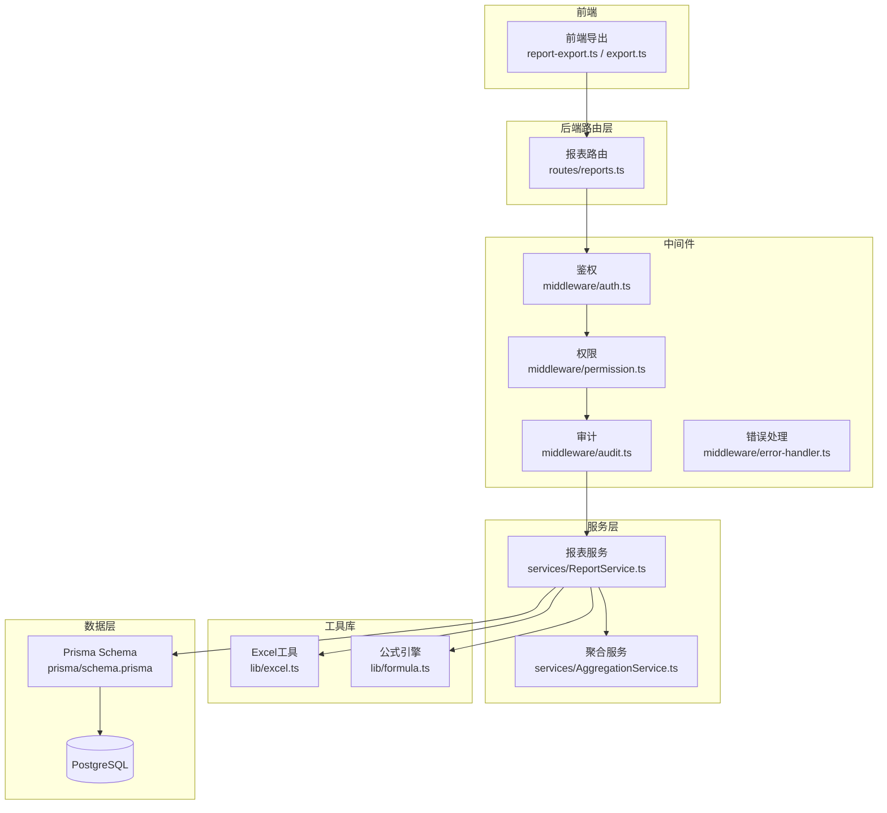
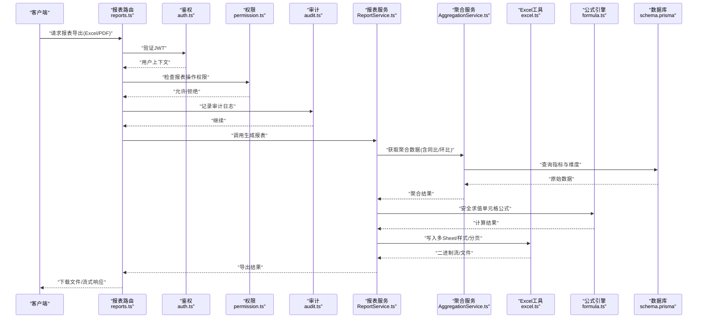
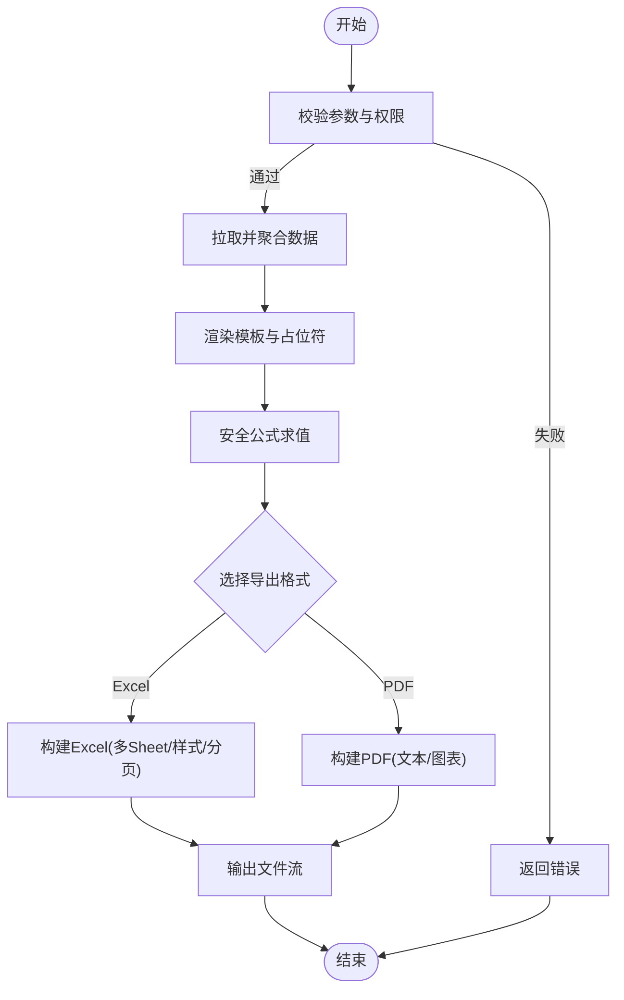
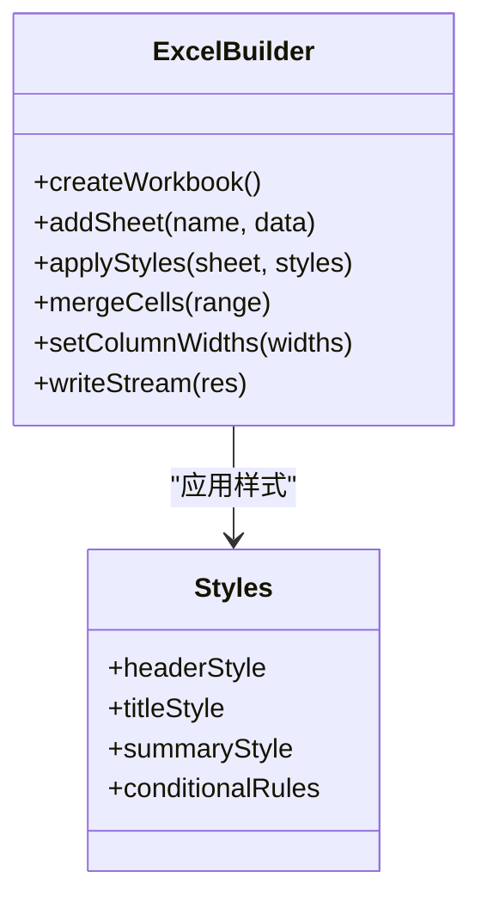
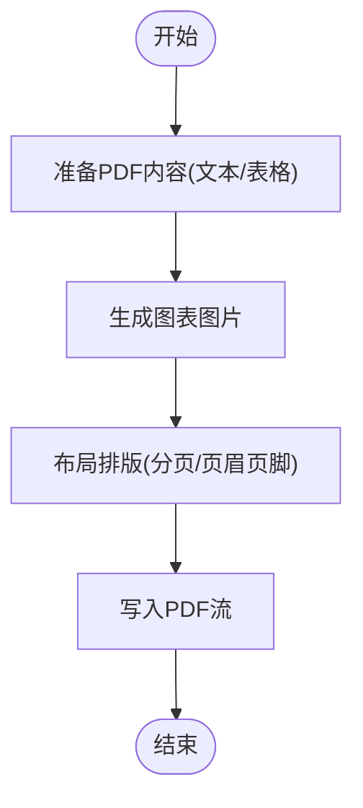
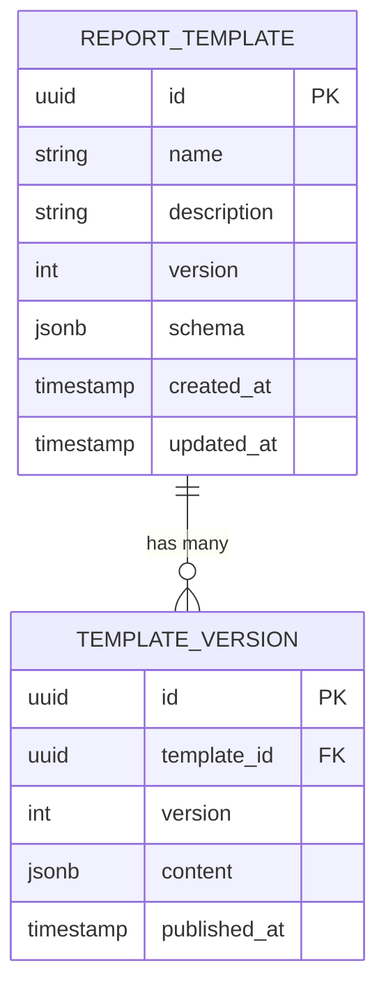
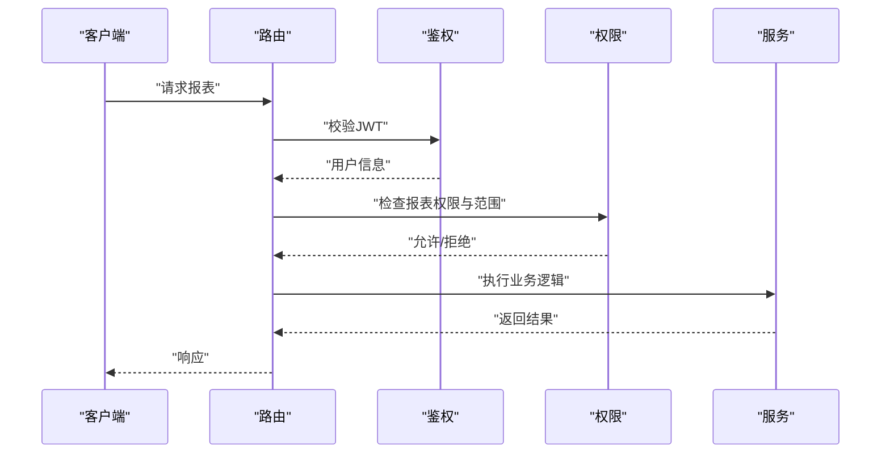
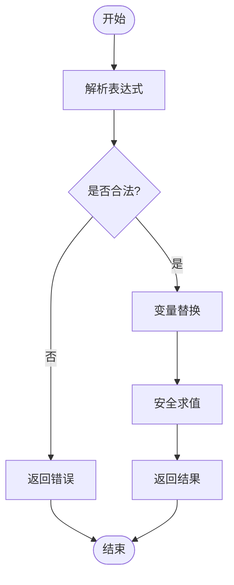
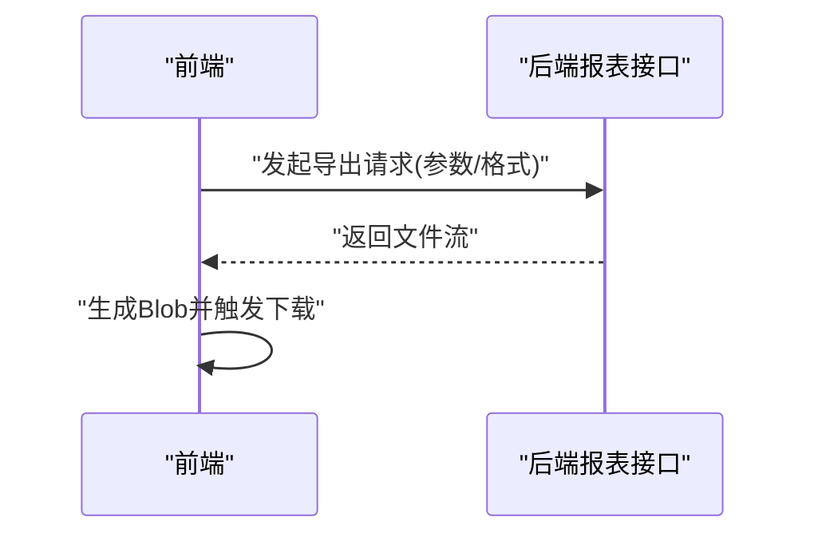
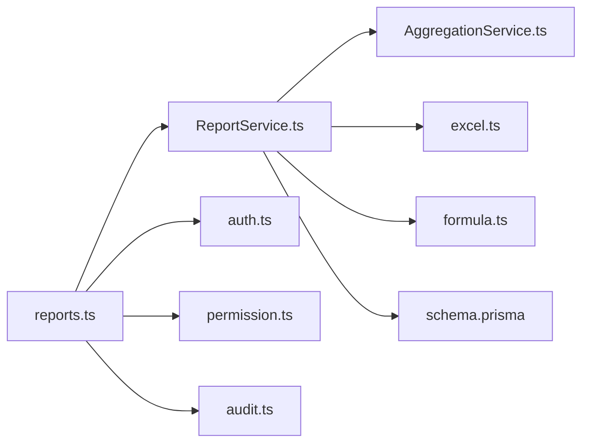

# 报表服务

<cite>
**本文引用的文件**   
- [ReportService.ts](file://server/src/services/ReportService.ts)
- [reports.ts](file://server/src/routes/reports.ts)
- [excel.ts](file://server/src/lib/excel.ts)
- [formula.ts](file://server/src/lib/formula.ts)
- [AggregationService.ts](file://server/src/services/AggregationService.ts)
- [schema.prisma](file://server/prisma/schema.prisma)
- [permission.ts](file://server/src/middleware/permission.ts)
- [auth.ts](file://server/src/middleware/auth.ts)
- [audit.ts](file://server/src/middleware/audit.ts)
- [error-handler.ts](file://server/src/middleware/error-handler.ts)
- [response.ts](file://server/src/lib/response.ts)
- [report-export.ts](file://web/src/lib/report-export.ts)
- [export.ts](file://web/src/lib/export.ts)
</cite>

## 目录
1. [简介](#简介)
2. [项目结构](#项目结构)
3. [核心组件](#核心组件)
4. [架构总览](#架构总览)
5. [详细组件分析](#详细组件分析)
6. [依赖关系分析](#依赖关系分析)
7. [性能考虑](#性能考虑)
8. [故障排查指南](#故障排查指南)
9. [结论](#结论)
10. [附录](#附录)

## 简介
本文件面向FY200财年经营数据分析平台的“报表服务”，聚焦后端 ReportService 的报表生成能力，涵盖模板渲染、数据填充与格式导出（Excel/PDF），并说明多Sheet支持、样式定制、大数据量处理、图表嵌入与批量导出。同时覆盖报表模板管理、版本控制与权限控制，并提供自定义报表开发指南与性能优化建议。

平台定位：Excel进、看板/报表出，单位统一为万元/人民币；计算类指标使用安全公式解析（白名单算子），同比/环比由后端实时计算不入库。

## 项目结构
围绕报表服务的代码主要分布在服务端 services、routes、lib 以及前端导出库中：
- 服务端
  - routes/reports.ts：报表相关HTTP路由与请求校验
  - services/ReportService.ts：报表核心服务（模板渲染、数据聚合、导出）
  - services/AggregationService.ts：指标聚合与同比/环比计算
  - lib/excel.ts：Excel读写与样式、多Sheet、分页流式写入
  - lib/formula.ts：安全公式解析引擎（白名单算子）
  - middleware/*：鉴权、权限、审计等中间件链
  - prisma/schema.prisma：数据库模型与迁移
- 前端
  - web/src/lib/report-export.ts：前端报表导出编排
  - web/src/lib/export.ts：通用导出工具

**图示来源** 
- [reports.ts](file://server/src/routes/reports.ts)
- [ReportService.ts](file://server/src/services/ReportService.ts)
- [AggregationService.ts](file://server/src/services/AggregationService.ts)
- [excel.ts](file://server/src/lib/excel.ts)
- [formula.ts](file://server/src/lib/formula.ts)
- [auth.ts](file://server/src/middleware/auth.ts)
- [permission.ts](file://server/src/middleware/permission.ts)
- [audit.ts](file://server/src/middleware/audit.ts)
- [error-handler.ts](file://server/src/middleware/error-handler.ts)
- [schema.prisma](file://server/prisma/schema.prisma)

**章节来源**
- [reports.ts](file://server/src/routes/reports.ts)
- [ReportService.ts](file://server/src/services/ReportService.ts)
- [AggregationService.ts](file://server/src/services/AggregationService.ts)
- [excel.ts](file://server/src/lib/excel.ts)
- [formula.ts](file://server/src/lib/formula.ts)
- [auth.ts](file://server/src/middleware/auth.ts)
- [permission.ts](file://server/src/middleware/permission.ts)
- [audit.ts](file://server/src/middleware/audit.ts)
- [error-handler.ts](file://server/src/middleware/error-handler.ts)
- [schema.prisma](file://server/prisma/schema.prisma)

## 核心组件
- 报表服务 ReportService
  - 负责报表模板加载与渲染、数据准备与填充、导出格式编排（Excel/PDF）、批量导出任务编排
  - 与 AggregationService 协作完成指标聚合与同比/环比计算
  - 通过 Excel 工具进行多Sheet、样式、分页写入
  - 通过公式引擎对单元格表达式进行安全求值
- 路由层 reports.ts
  - 暴露报表查询、预览、导出、批量导出等接口
  - 串联鉴权、权限、审计中间件
- Excel 工具 excel.ts
  - 提供工作簿与工作表创建、样式设置、合并单元格、列宽自适应、分页写入
- 公式引擎 formula.ts
  - 基于白名单算子的安全表达式求值，避免任意代码执行风险
- 聚合服务 AggregationService.ts
  - 按维度聚合指标，计算同比/环比，返回结构化数据供报表填充

**章节来源**
- [ReportService.ts](file://server/src/services/ReportService.ts)
- [reports.ts](file://server/src/routes/reports.ts)
- [excel.ts](file://server/src/lib/excel.ts)
- [formula.ts](file://server/src/lib/formula.ts)
- [AggregationService.ts](file://server/src/services/AggregationService.ts)

## 架构总览
报表服务采用分层架构：路由层接收请求并应用中间件链，服务层编排业务逻辑，工具库提供Excel与公式能力，数据层通过 Prisma 访问 PostgreSQL。

**图示来源** 
- [reports.ts](file://server/src/routes/reports.ts)
- [auth.ts](file://server/src/middleware/auth.ts)
- [permission.ts](file://server/src/middleware/permission.ts)
- [audit.ts](file://server/src/middleware/audit.ts)
- [ReportService.ts](file://server/src/services/ReportService.ts)
- [AggregationService.ts](file://server/src/services/AggregationService.ts)
- [excel.ts](file://server/src/lib/excel.ts)
- [formula.ts](file://server/src/lib/formula.ts)
- [schema.prisma](file://server/prisma/schema.prisma)

## 详细组件分析

### 报表服务 ReportService
- 职责
  - 模板渲染：根据模板标识加载模板元数据与样式定义，结合数据源生成渲染上下文
  - 数据填充：将聚合后的指标数据映射到模板占位符或表格区域
  - 公式计算：对包含表达式的单元格进行安全求值
  - 导出编排：生成Excel（多Sheet、样式、分页）或PDF（文本+图表）
  - 批量导出：队列化任务，支持并发与进度回调
- 关键流程
  - 输入参数校验（报表ID、时间范围、维度筛选、导出格式）
  - 权限与范围校验（组织/公司维度）
  - 数据聚合与同比/环比计算
  - 模板渲染与公式求值
  - 导出格式转换与流式输出

**图示来源** 
- [ReportService.ts](file://server/src/services/ReportService.ts)
- [AggregationService.ts](file://server/src/services/AggregationService.ts)
- [excel.ts](file://server/src/lib/excel.ts)
- [formula.ts](file://server/src/lib/formula.ts)

**章节来源**
- [ReportService.ts](file://server/src/services/ReportService.ts)
- [AggregationService.ts](file://server/src/services/AggregationService.ts)
- [excel.ts](file://server/src/lib/excel.ts)
- [formula.ts](file://server/src/lib/formula.ts)

### Excel 导出功能
- 多Sheet支持
  - 按维度或报表页签拆分数据，动态创建工作表
  - 命名规范与顺序可控
- 样式定制
  - 标题行、表头、汇总行样式配置
  - 列宽自适应、冻结窗格、条件高亮
- 大数据量处理
  - 分页写入与流式输出，降低内存峰值
  - 分批聚合与增量渲染
- 图表嵌入
  - 在Excel中插入图表对象，绑定数据区域

**图示来源** 
- [excel.ts](file://server/src/lib/excel.ts)

**章节来源**
- [excel.ts](file://server/src/lib/excel.ts)

### PDF 生成与图表嵌入
- 文本渲染：将报表标题、摘要、表格转为PDF文本块
- 图表嵌入：将图表序列化为图片后嵌入PDF页面
- 分页与页眉页脚：自动分页、页码、水印

**图示来源** 
- [ReportService.ts](file://server/src/services/ReportService.ts)

**章节来源**
- [ReportService.ts](file://server/src/services/ReportService.ts)

### 模板管理与版本控制
- 模板元数据：模板ID、名称、描述、版本、创建/更新时间
- 版本策略：新增版本时保留历史版本，默认使用最新可用版本
- 变更追踪：模板字段变更与数据源映射变更需记录审计日志

**图示来源** 
- [schema.prisma](file://server/prisma/schema.prisma)

**章节来源**
- [schema.prisma](file://server/prisma/schema.prisma)

### 权限控制与范围限制
- 鉴权：JWT access token 短期有效，refresh token 轮转
- 权限：默认拒绝，显式授权报表查看/导出/编辑
- 范围：按组织/公司维度限制数据可见性（Prisma扩展）

**图示来源** 
- [auth.ts](file://server/src/middleware/auth.ts)
- [permission.ts](file://server/src/middleware/permission.ts)
- [reports.ts](file://server/src/routes/reports.ts)

**章节来源**
- [auth.ts](file://server/src/middleware/auth.ts)
- [permission.ts](file://server/src/middleware/permission.ts)
- [reports.ts](file://server/src/routes/reports.ts)

### 公式引擎与安全求值
- 白名单算子：仅允许 +-*/() 等基础运算
- 变量替换：将占位符替换为数值或聚合结果
- 错误处理：非法表达式或除零等异常捕获并返回友好错误

**图示来源** 
- [formula.ts](file://server/src/lib/formula.ts)

**章节来源**
- [formula.ts](file://server/src/lib/formula.ts)

### 前端导出编排
- report-export.ts：封装导出API调用、参数组装、下载处理
- export.ts：通用导出工具（文件名生成、MIME类型、Blob处理）

**图示来源** 
- [report-export.ts](file://web/src/lib/report-export.ts)
- [export.ts](file://web/src/lib/export.ts)

**章节来源**
- [report-export.ts](file://web/src/lib/report-export.ts)
- [export.ts](file://web/src/lib/export.ts)

## 依赖关系分析
- 路由依赖中间件链：helmet → cors → express.json → rate-limit → auth → permission → scope → softDelete → audit → Service → Prisma → PostgreSQL
- 报表服务依赖：
  - AggregationService：指标聚合与同比/环比
  - Excel工具：多Sheet、样式、分页写入
  - 公式引擎：安全表达式求值
  - Prisma/Schema：数据模型与查询

**图示来源** 
- [reports.ts](file://server/src/routes/reports.ts)
- [ReportService.ts](file://server/src/services/ReportService.ts)
- [AggregationService.ts](file://server/src/services/AggregationService.ts)
- [excel.ts](file://server/src/lib/excel.ts)
- [formula.ts](file://server/src/lib/formula.ts)
- [schema.prisma](file://server/prisma/schema.prisma)
- [auth.ts](file://server/src/middleware/auth.ts)
- [permission.ts](file://server/src/middleware/permission.ts)
- [audit.ts](file://server/src/middleware/audit.ts)

**章节来源**
- [reports.ts](file://server/src/routes/reports.ts)
- [ReportService.ts](file://server/src/services/ReportService.ts)
- [AggregationService.ts](file://server/src/services/AggregationService.ts)
- [excel.ts](file://server/src/lib/excel.ts)
- [formula.ts](file://server/src/lib/formula.ts)
- [schema.prisma](file://server/prisma/schema.prisma)
- [auth.ts](file://server/src/middleware/auth.ts)
- [permission.ts](file://server/src/middleware/permission.ts)
- [audit.ts](file://server/src/middleware/audit.ts)

## 性能考虑
- 数据聚合优化
  - 按需维度投影，减少不必要字段
  - 分页与增量聚合，避免一次性加载全量数据
- 导出性能
  - Excel流式写入，降低内存占用
  - 图表异步生成，避免阻塞主线程
- 缓存策略
  - 对热点报表结果做短时缓存（带失效策略）
  - 公式求值结果缓存（相同表达式与参数）
- 并发与限流
  - 导出任务队列化，限制并发度
  - 接口级速率限制，防止滥用

[本节为通用指导，无需特定文件引用]

## 故障排查指南
- 常见错误
  - 权限不足：检查JWT与权限配置
  - 模板不存在或版本无效：确认模板ID与版本
  - 公式解析失败：检查表达式合法性与变量替换
  - 导出失败：检查Excel/PDF生成库与内存限制
- 调试步骤
  - 启用审计日志，定位请求链路
  - 打印聚合SQL，验证数据范围
  - 分步渲染（先文本后图表），隔离问题
- 错误处理中间件
  - error-handler.ts：统一错误响应与堆栈脱敏

**章节来源**
- [error-handler.ts](file://server/src/middleware/error-handler.ts)
- [audit.ts](file://server/src/middleware/audit.ts)

## 结论
FY200报表服务以ReportService为核心，结合AggregationService、Excel工具与公式引擎，实现了模板渲染、数据填充与多格式导出（Excel/PDF）。通过严格的中间件链实现鉴权、权限与审计，保障数据安全与可追溯。针对大数据量场景，采用流式写入与分页聚合提升性能。建议在生产环境引入缓存与任务队列，进一步优化导出体验与系统稳定性。

[本节为总结，无需特定文件引用]

## 附录
- 自定义报表开发指南
  - 定义模板元数据与Schema（字段、占位符、样式）
  - 编写数据聚合逻辑（维度、指标、同比/环比）
  - 集成公式引擎，确保表达式安全
  - 实现Excel/PDF导出适配
  - 增加权限与范围控制
- 最佳实践
  - 模板版本化管理与灰度发布
  - 导出任务异步化与进度反馈
  - 监控与告警（导出耗时、失败率、内存峰值）

[本节为概念性内容，无需特定文件引用]