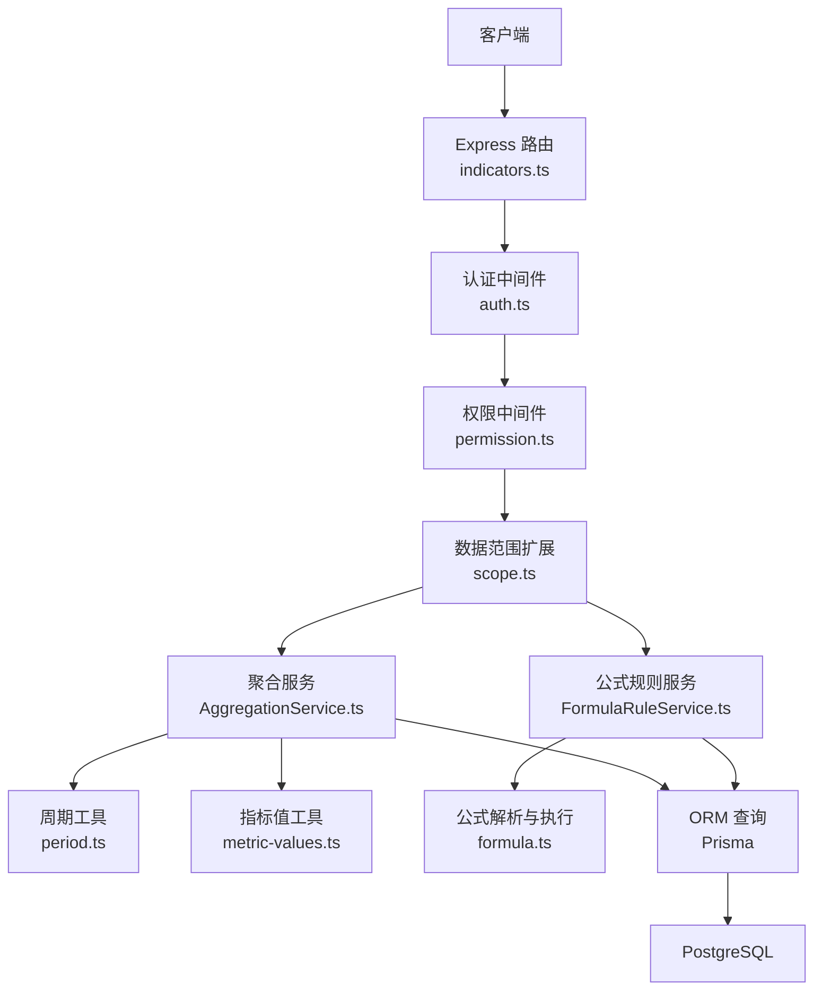
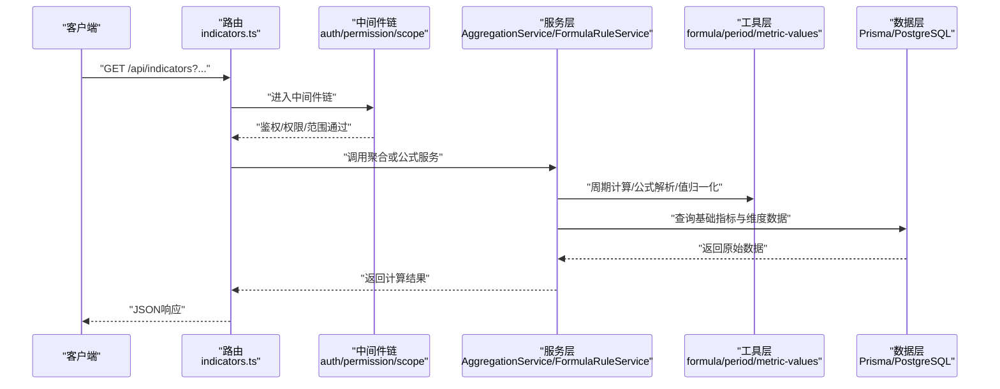
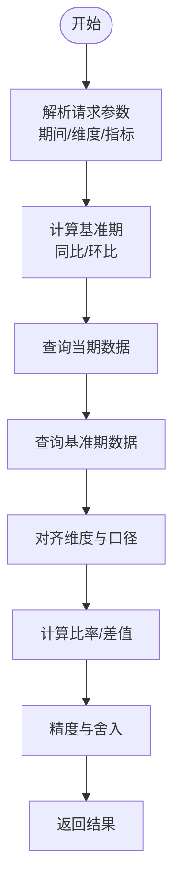
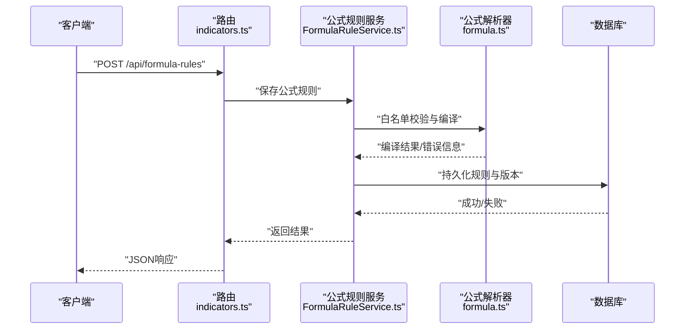
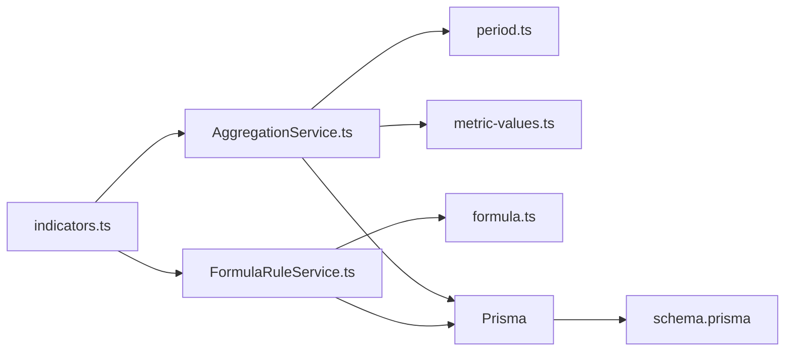

# 指标计算服务

<cite>
**本文引用的文件**   
- [AggregationService.ts](file://server/src/services/AggregationService.ts)
- [AggregationService.calc.test.ts](file://server/src/services/AggregationService.calc.test.ts)
- [AggregationService.static.test.ts](file://server/src/services/AggregationService.static.test.ts)
- [AggregationService.ytd.test.ts](file://server/src/services/AggregationService.ytd.test.ts)
- [FormulaRuleService.ts](file://server/src/services/FormulaRuleService.ts)
- [FormulaRuleService.test.ts](file://server/src/services/FormulaRuleService.test.ts)
- [formula-validation.test.ts](file://server/src/services/formula-validation.test.ts)
- [formula.ts](file://server/src/lib/formula.ts)
- [metric-values.ts](file://server/src/lib/metric-values.ts)
- [period.ts](file://server/src/lib/period.ts)
- [indicators.ts](file://server/src/routes/indicators.ts)
- [schema.prisma](file://server/prisma/schema.prisma)
- [20260722142144_add_formula_rule/migration.sql](file://server/prisma/migrations/20260722142144_add_formula_rule/migration.sql)
- [env.ts](file://server/src/config/env.ts)
- [auth.ts](file://server/src/middleware/auth.ts)
- [permission.ts](file://server/src/middleware/permission.ts)
- [scope.ts](file://server/src/middleware/scope.ts)
- [error-handler.ts](file://server/src/middleware/error-handler.ts)
- [logger.ts](file://server/src/lib/logger.ts)
</cite>

## 目录
1. [简介](#简介)
2. [项目结构](#项目结构)
3. [核心组件](#核心组件)
4. [架构总览](#架构总览)
5. [详细组件分析](#详细组件分析)
6. [依赖关系分析](#依赖关系分析)
7. [性能考量](#性能考量)
8. [故障排查指南](#故障排查指南)
9. [结论](#结论)
10. [附录](#附录)

## 简介
本文件面向FY200指标计算服务的后端实现，聚焦以下目标：
- 实时计算引擎：同比、环比、多维度聚合与YTD（年初至今）计算。
- 公式规则管理：白名单算子校验、表达式编译与安全执行沙箱。
- 性能优化：缓存策略、增量计算与并发处理。
- SQL优化与索引设计：复杂查询的优化技巧与数据库索引建议。
- 自定义公式开发指南与测试方法。

本项目为内部管理口径财务数据平台，单位统一为万元/人民币；计算类指标使用安全公式解析（白名单算子），同比/环比由后端实时计算不存库。

## 项目结构
围绕指标计算的核心代码主要位于 server/src/services、server/src/lib、server/src/routes 以及 Prisma 模型与迁移中。关键路径如下：
- 服务层：AggregationService（聚合与同比/环比/YTD）、FormulaRuleService（公式规则管理）。
- 工具层：formula（公式解析与执行）、metric-values（指标值归一化与精度控制）、period（时间维度与周期计算）。
- 路由层：indicators（对外API入口，承载指标查询与计算请求）。
- 数据层：Prisma schema 与迁移定义指标与公式相关表结构。
- 中间件链：auth → permission → scope → softDelete → audit → Service → Prisma → PostgreSQL。

图表来源
- [indicators.ts](file://server/src/routes/indicators.ts)
- [auth.ts](file://server/src/middleware/auth.ts)
- [permission.ts](file://server/src/middleware/permission.ts)
- [scope.ts](file://server/src/middleware/scope.ts)
- [AggregationService.ts](file://server/src/services/AggregationService.ts)
- [FormulaRuleService.ts](file://server/src/services/FormulaRuleService.ts)
- [period.ts](file://server/src/lib/period.ts)
- [metric-values.ts](file://server/src/lib/metric-values.ts)
- [formula.ts](file://server/src/lib/formula.ts)
- [schema.prisma](file://server/prisma/schema.prisma)

章节来源
- [indicators.ts](file://server/src/routes/indicators.ts)
- [schema.prisma](file://server/prisma/schema.prisma)

## 核心组件
- AggregationService：提供多维度聚合、同比/环比、YTD等实时计算能力，结合 period 与 metric-values 完成时间窗口切分与数值精度控制。
- FormulaRuleService：负责公式规则的CRUD、白名单算子校验、表达式编译与安全执行沙箱，确保公式不可越权、不可执行任意代码。
- formula.ts：实现安全公式解析器与执行器，仅允许白名单算子（如加减乘除与括号），禁止 eval 等危险操作。
- metric-values.ts：对指标值进行归一化、空值处理、精度与舍入策略控制。
- period.ts：提供年/季度/月/日等周期边界计算与同比/环比基准期推导。

章节来源
- [AggregationService.ts](file://server/src/services/AggregationService.ts)
- [FormulaRuleService.ts](file://server/src/services/FormulaRuleService.ts)
- [formula.ts](file://server/src/lib/formula.ts)
- [metric-values.ts](file://server/src/lib/metric-values.ts)
- [period.ts](file://server/src/lib/period.ts)

## 架构总览
指标计算的整体流程从HTTP请求进入，经中间件链鉴权与权限控制后，路由调用服务层完成计算或规则管理，最终通过ORM访问数据库。

图表来源
- [indicators.ts](file://server/src/routes/indicators.ts)
- [auth.ts](file://server/src/middleware/auth.ts)
- [permission.ts](file://server/src/middleware/permission.ts)
- [scope.ts](file://server/src/middleware/scope.ts)
- [AggregationService.ts](file://server/src/services/AggregationService.ts)
- [FormulaRuleService.ts](file://server/src/services/FormulaRuleService.ts)
- [formula.ts](file://server/src/lib/formula.ts)
- [period.ts](file://server/src/lib/period.ts)
- [metric-values.ts](file://server/src/lib/metric-values.ts)
- [schema.prisma](file://server/prisma/schema.prisma)

## 详细组件分析

### AggregationService 实时计算引擎
职责与能力：
- 多维度聚合：按公司、科目、期间等维度分组聚合，支持SUM/AVG/COUNT/MIN/MAX等常用聚合函数。
- 同比/环比：基于 period 工具计算基准期，对同口径数据进行对比，输出增长率或差值。
- YTD（年初至今）：按年度累计计算，支持滚动窗口与截止期控制。
- 安全与精度：通过 metric-values 控制数值精度与舍入，避免浮点误差累积。

关键流程（以同比为例）：

图表来源
- [AggregationService.ts](file://server/src/services/AggregationService.ts)
- [period.ts](file://server/src/lib/period.ts)
- [metric-values.ts](file://server/src/lib/metric-values.ts)

章节来源
- [AggregationService.ts](file://server/src/services/AggregationService.ts)
- [AggregationService.calc.test.ts](file://server/src/services/AggregationService.calc.test.ts)
- [AggregationService.static.test.ts](file://server/src/services/AggregationService.static.test.ts)
- [AggregationService.ytd.test.ts](file://server/src/services/AggregationService.ytd.test.ts)
- [period.ts](file://server/src/lib/period.ts)
- [metric-values.ts](file://server/src/lib/metric-values.ts)

### FormulaRuleService 公式规则管理
职责与能力：
- 公式规则CRUD：创建、更新、删除、查询公式规则，维护版本与生效状态。
- 白名单算子验证：仅允许加减乘除与括号等安全算子，拒绝危险函数与外部调用。
- 表达式编译与执行沙箱：将字符串表达式编译为可执行单元，在受限环境中运行，防止越权与注入。

典型调用序列（保存并验证公式）：

图表来源
- [FormulaRuleService.ts](file://server/src/services/FormulaRuleService.ts)
- [formula.ts](file://server/src/lib/formula.ts)
- [indicators.ts](file://server/src/routes/indicators.ts)
- [schema.prisma](file://server/prisma/schema.prisma)

章节来源
- [FormulaRuleService.ts](file://server/src/services/FormulaRuleService.ts)
- [FormulaRuleService.test.ts](file://server/src/services/FormulaRuleService.test.ts)
- [formula-validation.test.ts](file://server/src/services/formula-validation.test.ts)
- [formula.ts](file://server/src/lib/formula.ts)

### 公式解析与执行（formula.ts）
- 白名单机制：仅允许加减乘除与括号，其他符号或函数直接拒绝。
- 语法树构建：将表达式解析为AST，便于静态检查与优化。
- 安全执行：在沙箱中执行，限制变量访问与副作用。
- 错误处理：对非法表达式、除零、类型不匹配等进行明确报错。

章节来源
- [formula.ts](file://server/src/lib/formula.ts)
- [formula-validation.test.ts](file://server/src/services/formula-validation.test.ts)

### 指标值处理（metric-values.ts）
- 空值与缺失：统一处理null/undefined，默认值策略可配置。
- 精度控制：固定小数位、四舍五入、银行家舍入等策略。
- 单位换算：统一为万元/人民币，避免跨单位混用。

章节来源
- [metric-values.ts](file://server/src/lib/metric-values.ts)

### 周期计算（period.ts）
- 周期边界：年/季/月/日的起止日期计算。
- 同比/环比基准期：根据当前期自动推导基准期。
- 滚动窗口：支持N期滚动聚合。

章节来源
- [period.ts](file://server/src/lib/period.ts)

## 依赖关系分析
- 路由层依赖中间件链进行鉴权与权限控制，再调用服务层。
- 服务层依赖工具层完成周期计算、公式解析与数值处理。
- 数据层通过Prisma ORM访问PostgreSQL，遵循schema定义。

图表来源
- [indicators.ts](file://server/src/routes/indicators.ts)
- [AggregationService.ts](file://server/src/services/AggregationService.ts)
- [FormulaRuleService.ts](file://server/src/services/FormulaRuleService.ts)
- [period.ts](file://server/src/lib/period.ts)
- [metric-values.ts](file://server/src/lib/metric-values.ts)
- [formula.ts](file://server/src/lib/formula.ts)
- [schema.prisma](file://server/prisma/schema.prisma)

章节来源
- [schema.prisma](file://server/prisma/schema.prisma)
- [20260722142144_add_formula_rule/migration.sql](file://server/prisma/migrations/20260722142144_add_formula_rule/migration.sql)

## 性能考量
- 缓存策略
  - 热点指标结果缓存：对频繁查询的聚合结果进行短期缓存，降低数据库压力。
  - 公式编译缓存：公式表达式编译后的AST缓存，避免重复解析。
  - 维度枚举缓存：公司、科目等维度字典缓存，减少重复查询。
- 增量计算
  - 分区与物化视图：按期间分区存储，增量更新最新分区。
  - 变更追踪：记录指标值变更事件，触发局部重算而非全量重算。
- 并发处理
  - 请求级限流：通过 rate-limit 中间件保护服务。
  - 任务队列：对耗时计算任务异步化处理，避免阻塞主线程。
  - 连接池：合理配置Prisma连接池大小，避免数据库连接耗尽。
- SQL优化与索引设计
  - 复合索引：针对常见过滤条件（公司、科目、期间）建立复合索引。
  - 覆盖索引：对高频查询字段建立覆盖索引，减少回表。
  - 分区表：按期间分区，提升大表查询性能。
  - 查询重写：避免SELECT *，只取必要字段；使用EXPLAIN分析慢查询。

[本节为通用指导，不直接分析具体文件]

## 故障排查指南
- 常见问题
  - 公式解析失败：检查白名单算子是否被误用，确认表达式语法正确。
  - 同比/环比异常：核对基准期推导逻辑与数据口径一致性。
  - 精度问题：检查舍入策略与单位换算是否正确。
  - 权限不足：确认用户角色与数据范围（scope）设置。
- 日志与监控
  - 使用 logger 记录关键步骤与错误堆栈。
  - 启用错误处理器 error-handler 统一捕获与格式化错误。
- 调试建议
  - 单元测试：利用 calc.test、static.test、ytd.test 与 formula-validation.test 定位问题。
  - 集成测试：通过 setup.ts 初始化测试环境，模拟真实数据与权限场景。

章节来源
- [error-handler.ts](file://server/src/middleware/error-handler.ts)
- [logger.ts](file://server/src/lib/logger.ts)
- [AggregationService.calc.test.ts](file://server/src/services/AggregationService.calc.test.ts)
- [AggregationService.static.test.ts](file://server/src/services/AggregationService.static.test.ts)
- [AggregationService.ytd.test.ts](file://server/src/services/AggregationService.ytd.test.ts)
- [formula-validation.test.ts](file://server/src/services/formula-validation.test.ts)

## 结论
FY200指标计算服务通过AggregationService与FormulaRuleService实现了安全、高效、可扩展的指标计算与公式管理能力。借助工具层的周期计算、公式解析与数值处理，配合合理的缓存、增量与并发策略，以及SQL优化与索引设计，能够满足复杂业务场景下的实时计算需求。建议在后续迭代中持续完善监控与告警，强化测试覆盖率，确保稳定性与可维护性。

[本节为总结，不直接分析具体文件]

## 附录
- 自定义公式开发指南
  - 新增白名单算子：在 formula.ts 中扩展允许的运算符集合，并进行严格类型校验。
  - 公式模板：提供常用公式模板，降低前端输入错误率。
  - 版本管理：在 FormulaRuleService 中维护公式版本，支持灰度发布与回滚。
- 测试方法
  - 单元测试：覆盖公式解析、聚合计算、周期推导等核心逻辑。
  - 集成测试：模拟完整请求链路，验证中间件与服务协作。
  - 性能测试：使用压测工具评估高并发下的响应时间与资源占用。

[本节为补充说明，不直接分析具体文件]