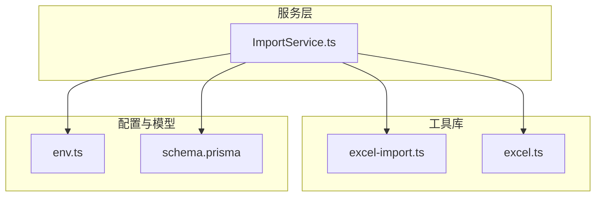
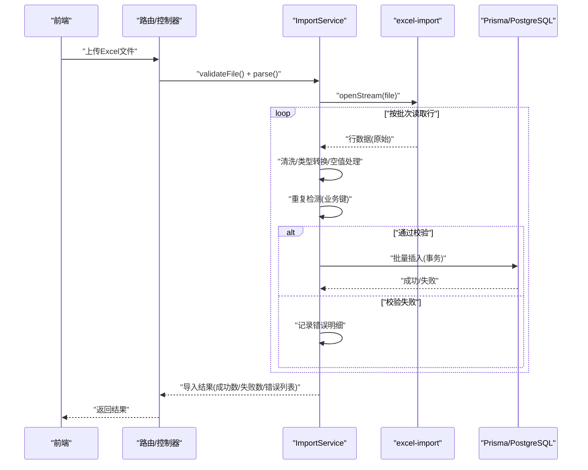
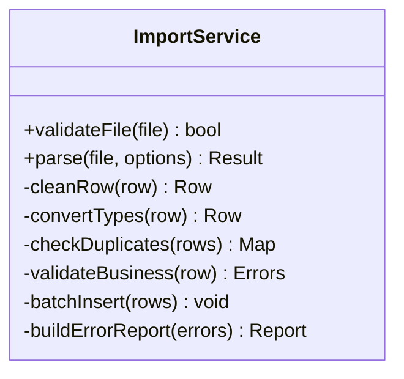
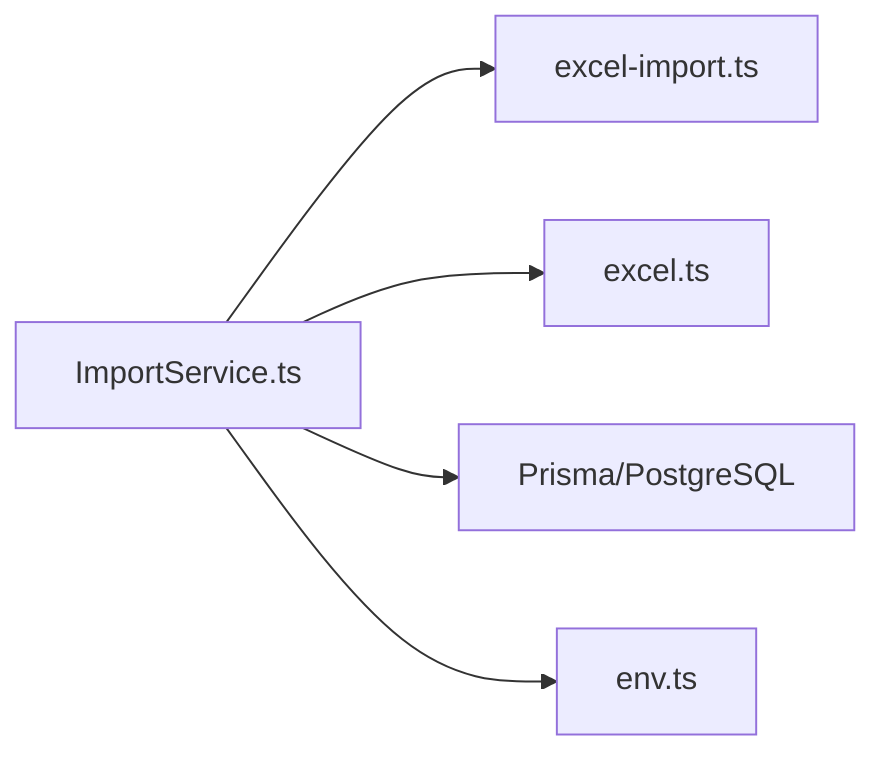

# Excel导入处理

<cite>
**本文引用的文件**   
- [ImportService.ts](file://server/src/services/ImportService.ts)
- [excel-import.ts](file://server/src/lib/excel-import.ts)
- [excel.ts](file://server/src/lib/excel.ts)
- [ImportService.test.ts](file://server/src/services/ImportService.test.ts)
- [excel-import.test.ts](file://server/src/lib/excel-import.test.ts)
- [schema.prisma](file://server/prisma/schema.prisma)
- [env.ts](file://server/src/config/env.ts)
</cite>

## 目录
1. [简介](#简介)
2. [项目结构](#项目结构)
3. [核心组件](#核心组件)
4. [架构总览](#架构总览)
5. [详细组件分析](#详细组件分析)
6. [依赖关系分析](#依赖关系分析)
7. [性能考虑](#性能考虑)
8. [故障排查指南](#故障排查指南)
9. [结论](#结论)
10. [附录](#附录)

## 简介
本文件面向Excel数据导入场景，围绕后端ImportService类与Excel解析库实现，系统性说明文件格式校验、数据清洗、重复检测、错误处理机制；详述Excel解析流程（单元格格式识别、数据类型转换、空值处理、异常捕获）；阐述批量导入的性能优化策略（流式处理、内存管理、事务控制）；并给出数据验证规则、业务逻辑检查与错误报告生成方法。同时提供常见Excel格式问题的解决方案与性能调优建议，帮助读者快速定位问题并提升导入吞吐与稳定性。

## 项目结构
本项目采用分层组织：服务层（services）、工具库（lib）、配置（config）、数据库模型（prisma）。Excel导入相关代码主要位于：
- 服务层：ImportService.ts（导入编排、校验、去重、事务、错误聚合）
- 工具库：excel-import.ts（Excel读取与行级解析）、excel.ts（通用Excel辅助能力）
- 测试：ImportService.test.ts、excel-import.test.ts（覆盖边界与异常路径）
- 配置：env.ts（环境变量，如批大小、超时等）
- 数据模型：schema.prisma（目标表结构与约束）

图表来源 
- [ImportService.ts](file://server/src/services/ImportService.ts)
- [excel-import.ts](file://server/src/lib/excel-import.ts)
- [excel.ts](file://server/src/lib/excel.ts)
- [env.ts](file://server/src/config/env.ts)
- [schema.prisma](file://server/prisma/schema.prisma)

章节来源
- [ImportService.ts](file://server/src/services/ImportService.ts)
- [excel-import.ts](file://server/src/lib/excel-import.ts)
- [excel.ts](file://server/src/lib/excel.ts)
- [env.ts](file://server/src/config/env.ts)
- [schema.prisma](file://server/prisma/schema.prisma)

## 核心组件
- ImportService：导入入口与编排器，负责文件接收、格式校验、分块解析、数据清洗、重复检测、业务校验、批量写入与错误汇总。
- excel-import：Excel文件读取与行级解析，支持多Sheet、列映射、类型推断与空值处理。
- excel：通用Excel辅助函数，如列名标准化、日期/数值/布尔解析、单位换算等。
- env：导入相关的环境变量（批大小、并发、超时、重试等）。
- schema.prisma：目标表结构与唯一索引/约束，用于重复检测与一致性保障。

章节来源
- [ImportService.ts](file://server/src/services/ImportService.ts)
- [excel-import.ts](file://server/src/lib/excel-import.ts)
- [excel.ts](file://server/src/lib/excel.ts)
- [env.ts](file://server/src/config/env.ts)
- [schema.prisma](file://server/prisma/schema.prisma)

## 架构总览
Excel导入的整体流程如下：
- 前端上传Excel文件至服务端
- ImportService进行文件类型与大小校验
- 调用excel-import流式读取Excel，逐行解析为结构化对象
- 对每条记录执行数据清洗、类型转换、空值处理
- 基于业务键进行重复检测（内存集合或数据库唯一约束）
- 通过Prisma批量写入（事务包裹），失败回滚并收集错误
- 返回导入结果摘要与错误明细

图表来源 
- [ImportService.ts](file://server/src/services/ImportService.ts)
- [excel-import.ts](file://server/src/lib/excel-import.ts)
- [schema.prisma](file://server/prisma/schema.prisma)

## 详细组件分析

### ImportService 类分析
职责与关键点：
- 文件校验：扩展名校验、大小限制、MIME类型检查、基础内容可读性检查
- 解析编排：分块读取、进度跟踪、错误隔离
- 数据清洗：去除首尾空白、统一编码、单位换算（万元/元）、日期标准化
- 类型转换：字符串→数字/日期/布尔，非法值标记错误
- 空值处理：必填字段为空报错，可选字段置默认值或跳过
- 重复检测：基于业务键（如公司+期间+科目+指标）在内存中构建Set，或在数据库层面利用唯一索引
- 业务校验：范围校验、关联存在性校验、公式/计算指标合法性
- 批量写入：使用Prisma事务，按批提交，失败回滚并记录错误
- 错误报告：汇总每行错误原因、位置、建议修正方式

图表来源 
- [ImportService.ts](file://server/src/services/ImportService.ts)

章节来源
- [ImportService.ts](file://server/src/services/ImportService.ts)
- [ImportService.test.ts](file://server/src/services/ImportService.test.ts)

### Excel解析流程（excel-import.ts）
关键能力：
- 流式读取：避免一次性加载整个工作簿到内存，降低峰值内存占用
- 多Sheet支持：可指定Sheet名称或索引，忽略隐藏Sheet
- 列映射：根据模板或约定将原始列名映射为标准字段
- 单元格格式识别：区分文本、数值、日期、布尔、公式结果
- 数据类型转换：自动推断并转换，失败时保留原始值并记录错误
- 空值处理：空串、空格、占位符统一处理为null或默认值
- 异常捕获：IO异常、格式异常、解码异常均被捕获并上报

图表来源 
- [excel-import.ts](file://server/src/lib/excel-import.ts)

章节来源
- [excel-import.ts](file://server/src/lib/excel-import.ts)
- [excel-import.test.ts](file://server/src/lib/excel-import.test.ts)

### 通用Excel辅助（excel.ts）
功能要点：
- 列名标准化：去除特殊字符、统一大小写、驼峰/下划线转换
- 日期解析：兼容多种Excel日期格式（序列号、ISO、本地化）
- 数值解析：千分位、货币符号、百分比、科学计数法
- 布尔解析：True/False、是/否、Y/N等映射
- 单位换算：元转万元、保留小数位数、四舍五入策略
- 安全过滤：防止注入与恶意输入

章节来源
- [excel.ts](file://server/src/lib/excel.ts)

### 数据验证规则与业务逻辑检查
- 数据验证规则：
  - 必填字段非空
  - 数值范围限制（如金额≥0、比例∈[0,1]）
  - 枚举值白名单（如期间、币种、科目类别）
  - 格式规范（日期YYYY-MM-DD、手机号、邮箱）
- 业务逻辑检查：
  - 关联实体存在性（公司、部门、科目、期间）
  - 指标计算合法性（公式白名单、无循环依赖）
  - 跨行一致性（合计=分项之和）
- 错误报告生成：
  - 行号、字段名、期望类型、实际值、错误码、修复建议
  - 汇总统计（成功数、失败数、失败率、Top错误类型）

章节来源
- [ImportService.ts](file://server/src/services/ImportService.ts)
- [excel.ts](file://server/src/lib/excel.ts)

### 重复检测机制
- 内存级去重：在单批次内基于业务键构建Set，快速判断重复
- 数据库级去重：利用Prisma唯一索引/约束，确保最终一致性
- 冲突处理：优先保留最新导入、合并策略或拒绝并提示用户

章节来源
- [ImportService.ts](file://server/src/services/ImportService.ts)
- [schema.prisma](file://server/prisma/schema.prisma)

### 事务控制与批量写入
- 事务边界：每个批次一个事务，失败整体回滚，保证原子性
- 批大小控制：根据内存与数据库负载动态调整
- 失败重试：针对网络抖动或临时锁等待的幂等重试
- 进度反馈：实时返回已处理行数、成功/失败计数

章节来源
- [ImportService.ts](file://server/src/services/ImportService.ts)
- [env.ts](file://server/src/config/env.ts)

## 依赖关系分析
ImportService依赖excel-import与excel完成解析与清洗，依赖Prisma与PostgreSQL完成持久化，依赖env获取运行时参数。

图表来源 
- [ImportService.ts](file://server/src/services/ImportService.ts)
- [excel-import.ts](file://server/src/lib/excel-import.ts)
- [excel.ts](file://server/src/lib/excel.ts)
- [env.ts](file://server/src/config/env.ts)
- [schema.prisma](file://server/prisma/schema.prisma)

章节来源
- [ImportService.ts](file://server/src/services/ImportService.ts)
- [excel-import.ts](file://server/src/lib/excel-import.ts)
- [excel.ts](file://server/src/lib/excel.ts)
- [env.ts](file://server/src/config/env.ts)
- [schema.prisma](file://server/prisma/schema.prisma)

## 性能考虑
- 流式处理：
  - 使用流式读取Excel，避免全量加载导致OOM
  - 逐行解析与清洗，减少中间对象创建
- 内存管理：
  - 控制批大小，避免单次处理过多行
  - 及时释放临时引用，避免内存泄漏
- 事务控制：
  - 合理设置事务大小与超时，避免长事务阻塞
  - 失败快速回滚，缩短锁持有时间
- 并发与I/O：
  - 限制并发解析任务数量，避免CPU与I/O争用
  - 使用连接池与预编译语句提升数据库写入效率
- 缓存与去重：
  - 内存Set做轻量去重，减少数据库查询
  - 热点字典（如科目映射）缓存提升解析速度
- 监控与可观测性：
  - 记录导入耗时、吞吐、错误率
  - 采样日志与告警阈值

[本节为通用指导，不直接分析具体文件]

## 故障排查指南
常见问题与解决思路：
- 文件格式不支持或损坏：
  - 检查扩展名与MIME类型，尝试重新导出为xlsx
  - 查看IO异常日志，确认文件完整性
- 列名不匹配或模板变更：
  - 核对模板列名与系统映射，必要时更新映射规则
  - 增加列名模糊匹配与容错提示
- 数据类型转换失败：
  - 检查单元格格式（文本/数值/日期），统一格式后重试
  - 查看错误报告中的“期望类型/实际值”字段
- 空值与必填校验失败：
  - 补充缺失字段或使用默认值策略
  - 对可选字段放宽校验或提供占位符
- 重复数据冲突：
  - 检查业务键定义与唯一索引
  - 选择保留策略（最新/最早/合并）
- 性能瓶颈：
  - 调整批大小与并发度
  - 监控数据库锁与慢查询，优化索引

章节来源
- [ImportService.test.ts](file://server/src/services/ImportService.test.ts)
- [excel-import.test.ts](file://server/src/lib/excel-import.test.ts)

## 结论
ImportService结合excel-import与excel实现了稳健高效的Excel导入能力。通过流式解析、严格的数据清洗与类型转换、完善的重复检测与事务控制，以及详尽的错误报告机制，能够应对复杂多变的Excel数据源。在生产环境中，建议结合监控与压测持续优化批大小、并发与数据库配置，确保高吞吐与高可用。

[本节为总结性内容，不直接分析具体文件]

## 附录
- 环境变量建议：
  - BATCH_SIZE：每批处理行数（默认建议500~2000）
  - MAX_CONCURRENT：最大并发解析任务数
  - TIMEOUT_MS：导入超时时间
  - RETRY_COUNT：失败重试次数
- 模板规范：
  - 固定列名与顺序，提供下载模板
  - 明确数据类型与格式要求
- 错误报告字段：
  - 行号、字段名、期望类型、实际值、错误码、修复建议、示例

[本节为补充信息，不直接分析具体文件]