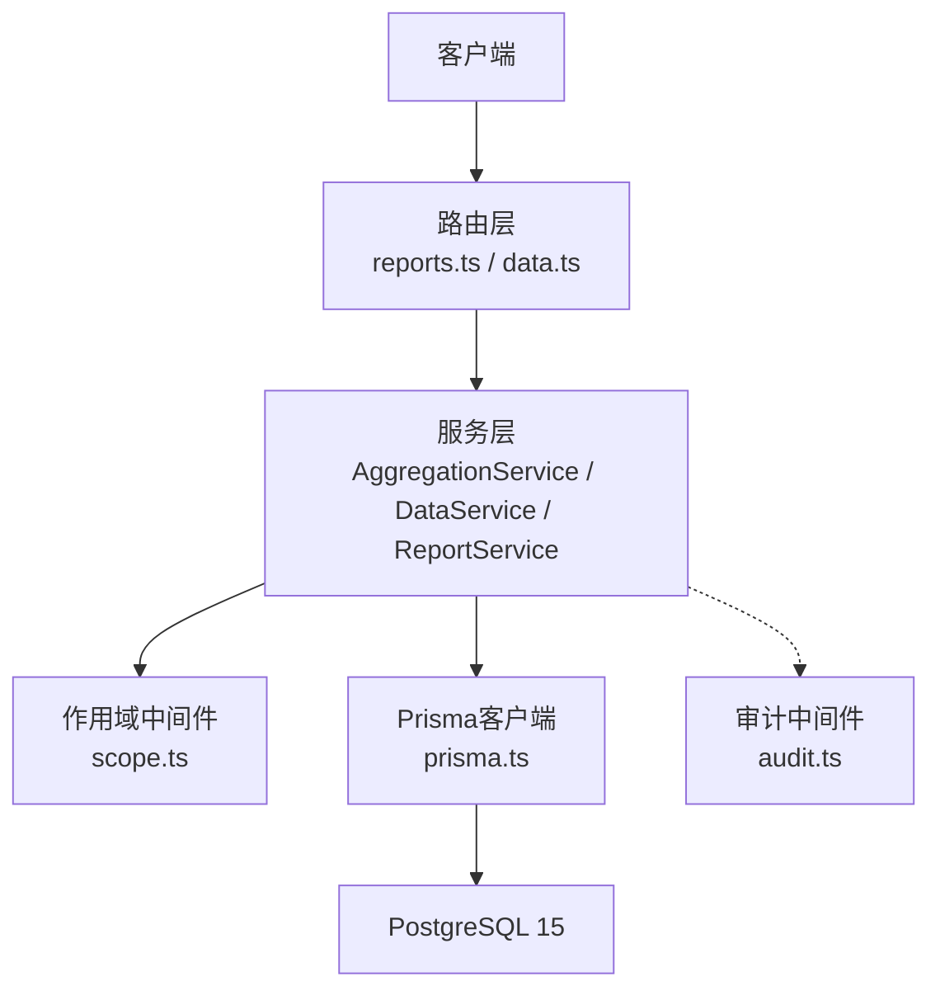
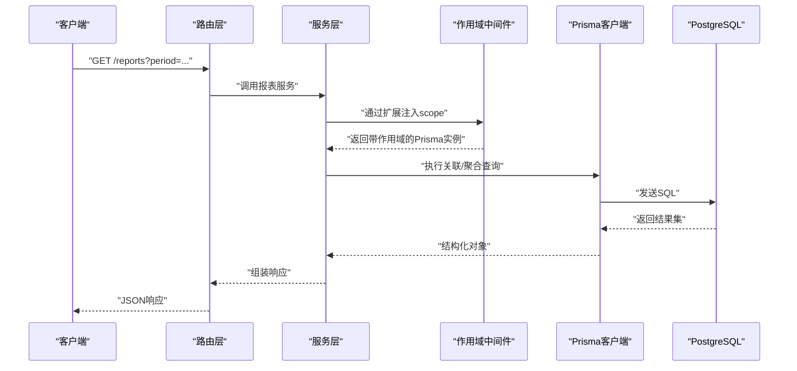
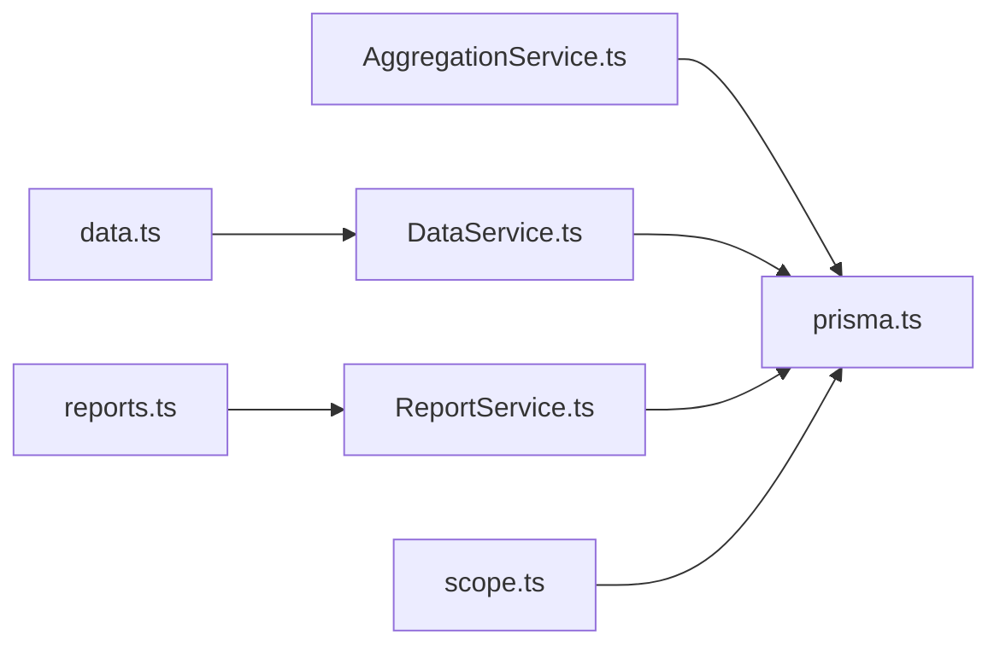
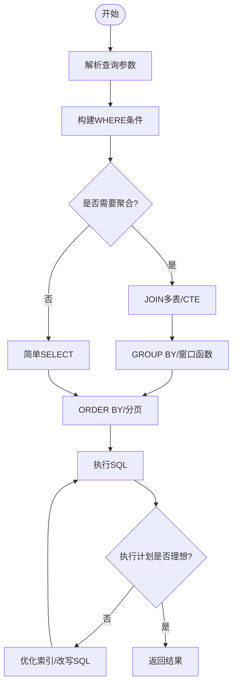
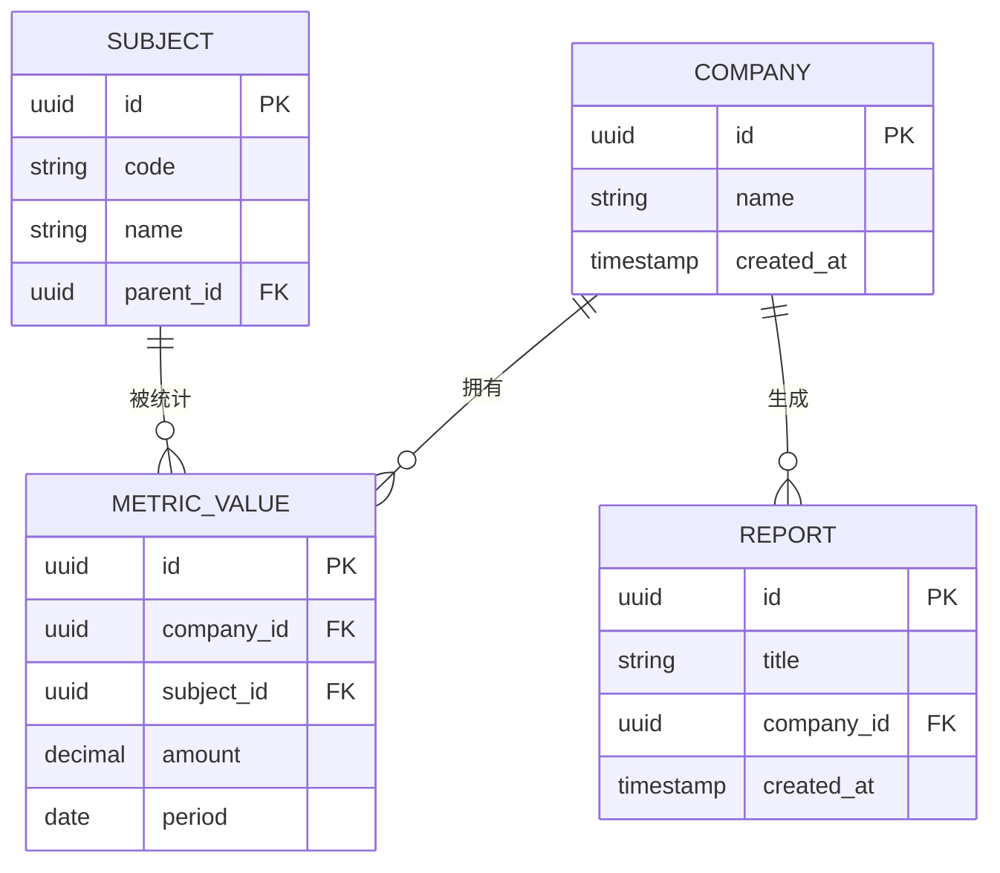

# ORM操作与查询优化

<cite>
**本文引用的文件**   
- [server/prisma/schema.prisma](file://server/prisma/schema.prisma)
- [server/src/lib/prisma.ts](file://server/src/lib/prisma.ts)
- [server/src/middleware/scope.ts](file://server/src/middleware/scope.ts)
- [server/src/services/AggregationService.ts](file://server/src/services/AggregationService.ts)
- [server/src/services/DataService.ts](file://server/src/services/DataService.ts)
- [server/src/services/ReportService.ts](file://server/src/services/ReportService.ts)
- [server/src/routes/reports.ts](file://server/src/routes/reports.ts)
- [server/src/routes/data.ts](file://server/src/routes/data.ts)
- [server/src/middleware/error-handler.ts](file://server/src/middleware/error-handler.ts)
- [server/src/middleware/audit.ts](file://server/src/middleware/audit.ts)
- [server/prisma/migrations/20260722121714_init/migration.sql](file://server/prisma/migrations/20260722121714_init/migration.sql)
- [server/prisma/migrations/20260722142144_add_formula_rule/migration.sql](file://server/prisma/migrations/20260722142144_add_formula_rule/migration.sql)
- [server/prisma/migrations/20260723120000_add_subject_analysis/migration.sql](file://server/prisma/migrations/20260723120000_add_subject_analysis/migration.sql)
- [server/prisma/migrations/20260724120000_remove_business_unit_org_scope/migration.sql](file://server/prisma/migrations/20260724120000_remove_business_unit_org_scope/migration.sql)
</cite>

## 目录
1. [简介](#简介)
2. [项目结构](#项目结构)
3. [核心组件](#核心组件)
4. [架构总览](#架构总览)
5. [详细组件分析](#详细组件分析)
6. [依赖关系分析](#依赖关系分析)
7. [性能考量](#性能考量)
8. [故障排查指南](#故障排查指南)
9. [结论](#结论)
10. [附录](#附录)

## 简介
本文件面向“浙江壹品慧财年经营数据分析平台”的后端数据层，聚焦Prisma ORM的高级用法与查询优化。内容覆盖关联查询、分页处理、事务管理、连接池配置；复杂查询构建（条件筛选、排序分组、聚合计算、子查询优化）；数据库索引策略与慢查询分析；数据迁移管理与版本控制回滚；N+1问题治理与批量操作最佳实践。读者无需深入底层即可掌握高效、可维护的ORM使用范式。

## 项目结构
后端采用Express + Prisma + PostgreSQL。Prisma负责数据模型定义、迁移与类型生成；服务层封装业务逻辑；中间件链完成鉴权、权限、作用域、审计等横切关注点。关键路径：路由 → 服务 → Prisma客户端 → PostgreSQL。

图表来源 
- [server/src/routes/reports.ts](file://server/src/routes/reports.ts)
- [server/src/routes/data.ts](file://server/src/routes/data.ts)
- [server/src/services/AggregationService.ts](file://server/src/services/AggregationService.ts)
- [server/src/services/DataService.ts](file://server/src/services/DataService.ts)
- [server/src/services/ReportService.ts](file://server/src/services/ReportService.ts)
- [server/src/middleware/scope.ts](file://server/src/middleware/scope.ts)
- [server/src/middleware/audit.ts](file://server/src/middleware/audit.ts)
- [server/src/lib/prisma.ts](file://server/src/lib/prisma.ts)

章节来源
- [server/src/lib/prisma.ts](file://server/src/lib/prisma.ts)
- [server/src/middleware/scope.ts](file://server/src/middleware/scope.ts)
- [server/src/services/AggregationService.ts](file://server/src/services/AggregationService.ts)
- [server/src/services/DataService.ts](file://server/src/services/DataService.ts)
- [server/src/services/ReportService.ts](file://server/src/services/ReportService.ts)
- [server/src/routes/reports.ts](file://server/src/routes/reports.ts)
- [server/src/routes/data.ts](file://server/src/routes/data.ts)

## 核心组件
- Prisma客户端与连接池：集中式单例客户端，统一连接池参数、日志与错误处理。
- 作用域中间件：基于Prisma扩展注入租户/组织范围过滤，避免N+1与越权访问。
- 聚合服务：封装复杂指标计算、同比环比、窗口函数与聚合查询。
- 数据服务：通用CRUD、分页、排序、过滤、批量写入。
- 报表服务：组合多表关联与聚合，支撑看板与导出。

章节来源
- [server/src/lib/prisma.ts](file://server/src/lib/prisma.ts)
- [server/src/middleware/scope.ts](file://server/src/middleware/scope.ts)
- [server/src/services/AggregationService.ts](file://server/src/services/AggregationService.ts)
- [server/src/services/DataService.ts](file://server/src/services/DataService.ts)
- [server/src/services/ReportService.ts](file://server/src/services/ReportService.ts)

## 架构总览
下图展示一次报表查询从HTTP到数据库的完整链路，体现中间件、服务与Prisma的协作。

图表来源 
- [server/src/routes/reports.ts](file://server/src/routes/reports.ts)
- [server/src/services/ReportService.ts](file://server/src/services/ReportService.ts)
- [server/src/middleware/scope.ts](file://server/src/middleware/scope.ts)
- [server/src/lib/prisma.ts](file://server/src/lib/prisma.ts)

## 详细组件分析

### Prisma客户端与连接池配置
- 单例模式：确保进程内共享连接池，减少握手开销。
- 连接池参数：最小/最大连接数、空闲超时、连接超时、查询超时等，按负载调优。
- 日志与追踪：开启慢查询日志、请求级traceId透传，便于定位慢SQL。
- 错误处理：统一捕获并转换为业务异常，避免泄露敏感信息。

章节来源
- [server/src/lib/prisma.ts](file://server/src/lib/prisma.ts)

### 作用域中间件与N+1治理
- 基于Prisma扩展在查询前注入where条件（如公司、组织、单位），实现行级安全。
- 配合include/select精准选择字段，避免过度加载。
- 对列表接口强制分页，限制每页大小上限，防止大结果集拖垮内存。

章节来源
- [server/src/middleware/scope.ts](file://server/src/middleware/scope.ts)

### 聚合服务：复杂查询与性能优化
- 条件筛选：动态拼接where，优先走索引列（时间、公司、科目）。
- 排序分组：order by + group by，必要时使用物化视图或预聚合表。
- 聚合计算：SUM/COUNT/AVG、窗口函数（同比/环比）、CASE WHEN分支。
- 子查询优化：尽量用JOIN替代相关子查询，必要时使用CTE提升可读性。
- 缓存策略：热点指标短期缓存（Redis/内存），降低DB压力。

章节来源
- [server/src/services/AggregationService.ts](file://server/src/services/AggregationService.ts)

### 数据服务：分页、排序与批量操作
- 分页：offset/limit或游标分页，大数据集推荐游标。
- 排序：支持多字段排序，避免无索引排序导致临时表。
- 批量写入：使用Prisma的批量API，结合事务保证一致性。
- 软删除：逻辑删除字段配合作用域过滤，避免物理删除风险。

章节来源
- [server/src/services/DataService.ts](file://server/src/services/DataService.ts)

### 报表服务：关联查询与导出
- 多表关联：合理设计join顺序，利用外键与索引加速。
- 聚合输出：汇总维度（公司、科目、期间）与指标值。
- 导出优化：流式写入、分批读取，避免OOM。

章节来源
- [server/src/services/ReportService.ts](file://server/src/services/ReportService.ts)
- [server/src/routes/reports.ts](file://server/src/routes/reports.ts)

### 路由层与中间件链
- 路由：解析查询参数、校验输入、调用服务。
- 中间件链：helmet → cors → json → rate-limit → auth → permission → scope → softDelete → audit → service → prisma → db。
- 审计：记录关键操作上下文，便于追溯与合规。

章节来源
- [server/src/routes/reports.ts](file://server/src/routes/reports.ts)
- [server/src/routes/data.ts](file://server/src/routes/data.ts)
- [server/src/middleware/audit.ts](file://server/src/middleware/audit.ts)

### 数据模型与迁移
- 模型定义：实体、关系、约束、默认值、索引声明。
- 迁移管理：增量迁移、命名规范、幂等脚本、回滚策略。
- 种子数据：初始化基础数据，便于本地开发测试。

章节来源
- [server/prisma/schema.prisma](file://server/prisma/schema.prisma)
- [server/prisma/migrations/20260722121714_init/migration.sql](file://server/prisma/migrations/20260722121714_init/migration.sql)
- [server/prisma/migrations/20260722142144_add_formula_rule/migration.sql](file://server/prisma/migrations/20260722142144_add_formula_rule/migration.sql)
- [server/prisma/migrations/20260723120000_add_subject_analysis/migration.sql](file://server/prisma/migrations/20260723120000_add_subject_analysis/migration.sql)
- [server/prisma/migrations/20260724120000_remove_business_unit_org_scope/migration.sql](file://server/prisma/migrations/20260724120000_remove_business_unit_org_scope/migration.sql)

## 依赖关系分析
服务层依赖Prisma客户端与作用域中间件；路由层依赖服务层；中间件链贯穿请求生命周期。

图表来源 
- [server/src/routes/reports.ts](file://server/src/routes/reports.ts)
- [server/src/routes/data.ts](file://server/src/routes/data.ts)
- [server/src/services/ReportService.ts](file://server/src/services/ReportService.ts)
- [server/src/services/DataService.ts](file://server/src/services/DataService.ts)
- [server/src/services/AggregationService.ts](file://server/src/services/AggregationService.ts)
- [server/src/middleware/scope.ts](file://server/src/middleware/scope.ts)
- [server/src/lib/prisma.ts](file://server/src/lib/prisma.ts)

章节来源
- [server/src/routes/reports.ts](file://server/src/routes/reports.ts)
- [server/src/routes/data.ts](file://server/src/routes/data.ts)
- [server/src/services/AggregationService.ts](file://server/src/services/AggregationService.ts)
- [server/src/services/DataService.ts](file://server/src/services/DataService.ts)
- [server/src/services/ReportService.ts](file://server/src/services/ReportService.ts)
- [server/src/middleware/scope.ts](file://server/src/middleware/scope.ts)
- [server/src/lib/prisma.ts](file://server/src/lib/prisma.ts)

## 性能考量
- 索引策略
  - 高频过滤列建B-tree索引（时间、公司、科目、状态）。
  - 复合索引覆盖常见查询组合（如公司+期间+科目）。
  - 避免过度索引，关注写放大与空间占用。
- 查询优化
  - 使用EXPLAIN ANALYZE分析执行计划，识别全表扫描、临时表、文件排序。
  - 将相关子查询改写为JOIN或CTE，减少重复计算。
  - 合理使用select/include，仅取必要字段。
- 连接池与并发
  - 根据CPU核数与连接上限调整maxConnections。
  - 设置合理的queryTimeout，避免长事务阻塞。
- 缓存与预聚合
  - 热点指标短期缓存，降低DB压力。
  - 对复杂报表使用物化视图或定时预计算。

[本节为通用指导，不直接分析具体文件]

## 故障排查指南
- 慢查询定位
  - 开启Prisma慢查询日志，结合traceId串联请求链路。
  - 使用数据库慢查询日志与EXPLAIN ANALYZE定位瓶颈。
- 常见问题
  - N+1查询：检查是否循环内发起查询，改用批量或关联查询。
  - 锁等待：缩短事务粒度，避免长事务持有锁。
  - 内存溢出：分页拉取、流式处理、限制单次返回量。
- 错误处理
  - 统一错误中间件捕获并返回标准化错误码与消息。
  - 记录上下文（用户、租户、参数、SQL片段脱敏）。

章节来源
- [server/src/middleware/error-handler.ts](file://server/src/middleware/error-handler.ts)
- [server/src/middleware/audit.ts](file://server/src/middleware/audit.ts)

## 结论
通过规范的Prisma使用、严谨的作用域控制、合理的索引与查询改写、以及完善的迁移与错误处理机制，可在保障数据安全与一致性的前提下，显著提升查询性能与系统稳定性。建议持续监控慢查询与资源使用，迭代优化数据模型与查询策略。

[本节为总结性内容，不直接分析具体文件]

## 附录

### 复杂查询流程图（示例）

[本图为概念流程，不映射具体源码文件]

### 数据模型关系图（概念）

[本图为概念模型，不映射具体源码文件]