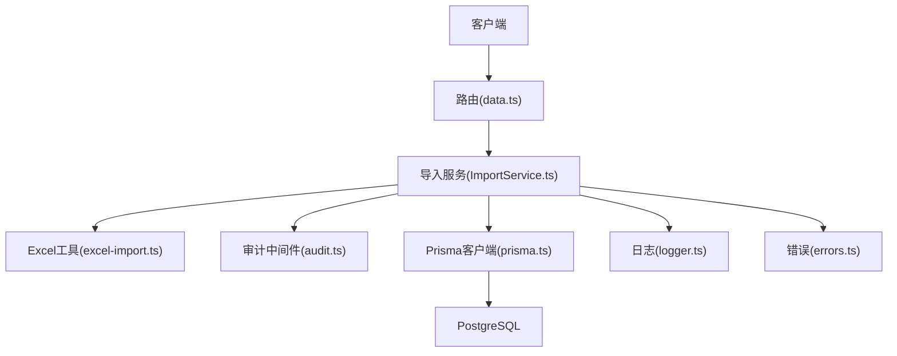
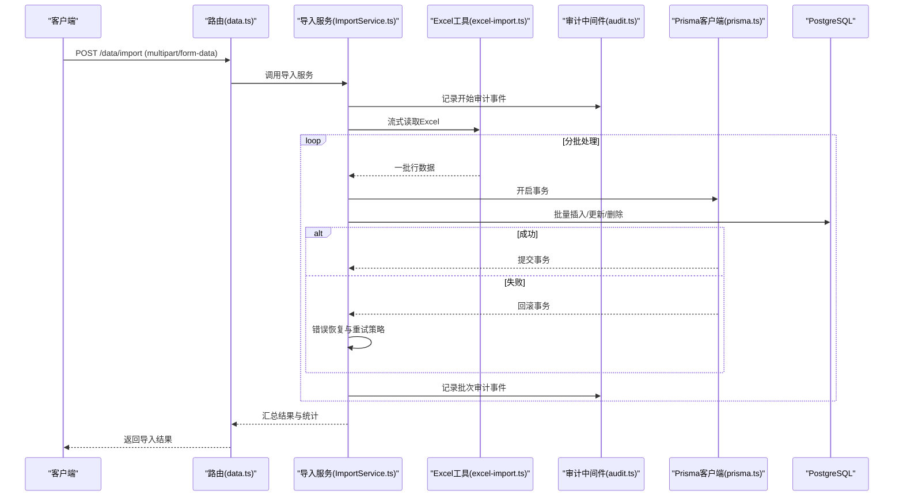
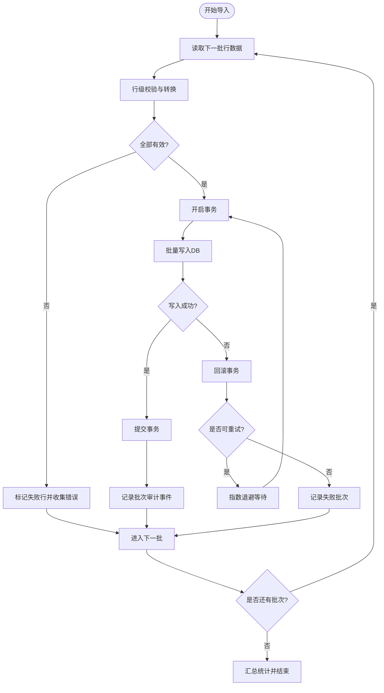
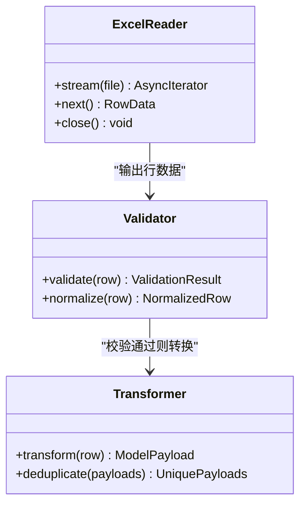
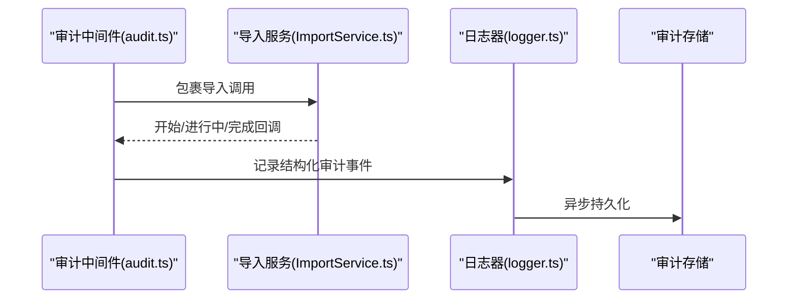
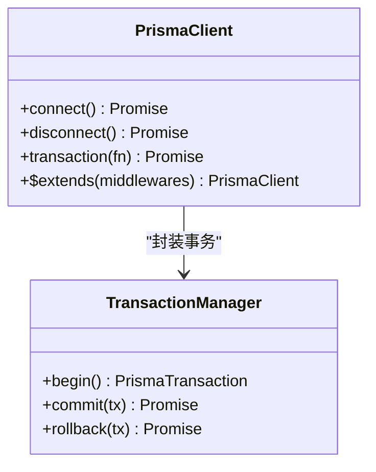
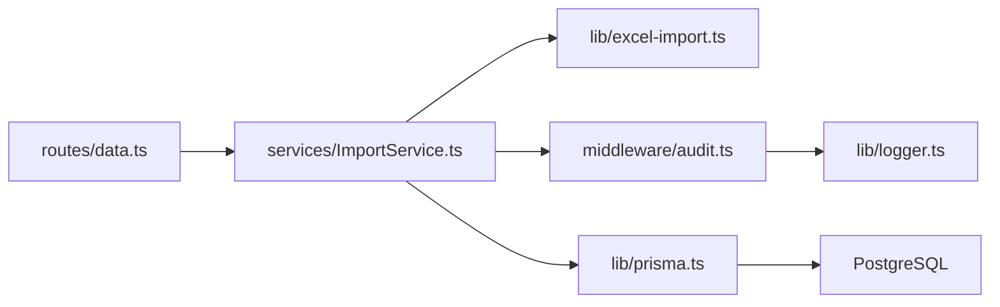

# 批量操作与事务管理

<cite>
**本文引用的文件**   
- [server/src/services/ImportService.ts](file://server/src/services/ImportService.ts)
- [server/src/lib/excel-import.ts](file://server/src/lib/excel-import.ts)
- [server/src/middleware/audit.ts](file://server/src/middleware/audit.ts)
- [server/src/lib/prisma.ts](file://server/src/lib/prisma.ts)
- [server/src/lib/errors.ts](file://server/src/lib/errors.ts)
- [server/src/lib/logger.ts](file://server/src/lib/logger.ts)
- [server/src/routes/data.ts](file://server/src/routes/data.ts)
- [server/src/app.ts](file://server/src/app.ts)
- [server/prisma/schema.prisma](file://server/prisma/schema.prisma)
</cite>

## 目录
1. [简介](#简介)
2. [项目结构](#项目结构)
3. [核心组件](#核心组件)
4. [架构总览](#架构总览)
5. [详细组件分析](#详细组件分析)
6. [依赖关系分析](#依赖关系分析)
7. [性能考量](#性能考量)
8. [故障排查指南](#故障排查指南)
9. [结论](#结论)
10. [附录](#附录)

## 简介
本文件围绕“批量操作与事务管理”展开，结合项目的 Express + Prisma + PostgreSQL 技术栈，系统阐述：
- 批量插入、更新、删除的实现方案（分批处理、内存优化、错误恢复）
- 事务边界定义、并发控制与数据一致性保证
- 审计日志记录机制（操作追踪、变更历史、合规性）
- 批量操作的性能监控、进度跟踪与失败重试策略
- 大数据量处理的内存管理与分布式事务思路

本项目定位为“Excel进、看板/报表出”的内部财务数据分析平台，单位统一为万元/人民币。中间件执行链顺序为：helmet → cors → express.json → rate-limit → auth(JWT+黑名单) → permission(默认拒绝) → scope(Prisma extension) → softDelete → audit → Service → Prisma → PostgreSQL。计算类指标使用安全公式解析，同比/环比由后端实时计算不存库。AI 双管道架构用于文本与结构化数据的脱敏与生成。

## 项目结构
与批量操作和事务相关的核心代码集中在服务端：
- 导入服务层：负责 Excel 解析、校验、分批入库与事务控制
- Excel 工具层：提供流式读取、行级转换与校验
- 审计中间件：记录操作上下文与关键事件
- Prisma 客户端：封装数据库连接与事务 API
- 错误与日志：统一异常与可观测性输出
- 路由层：暴露批量导入接口并协调服务调用

**图示来源** 
- [server/src/routes/data.ts](file://server/src/routes/data.ts)
- [server/src/services/ImportService.ts](file://server/src/services/ImportService.ts)
- [server/src/lib/excel-import.ts](file://server/src/lib/excel-import.ts)
- [server/src/middleware/audit.ts](file://server/src/middleware/audit.ts)
- [server/src/lib/prisma.ts](file://server/src/lib/prisma.ts)
- [server/src/lib/logger.ts](file://server/src/lib/logger.ts)
- [server/src/lib/errors.ts](file://server/src/lib/errors.ts)

**章节来源**
- [server/src/app.ts](file://server/src/app.ts)
- [server/src/routes/data.ts](file://server/src/routes/data.ts)
- [server/src/services/ImportService.ts](file://server/src/services/ImportService.ts)
- [server/src/lib/excel-import.ts](file://server/src/lib/excel-import.ts)
- [server/src/middleware/audit.ts](file://server/src/middleware/audit.ts)
- [server/src/lib/prisma.ts](file://server/src/lib/prisma.ts)
- [server/src/lib/logger.ts](file://server/src/lib/logger.ts)
- [server/src/lib/errors.ts](file://server/src/lib/errors.ts)

## 核心组件
- 导入服务（ImportService）
  - 职责：接收 Excel 文件流，驱动解析、校验、分批写入、事务提交与回滚、审计记录、进度上报与重试编排
  - 关键点：分批大小、内存水位控制、幂等键、错误隔离、事务粒度
- Excel 工具（excel-import）
  - 职责：流式读取工作表、逐行映射字段、类型与业务规则校验、空值与重复检测
  - 关键点：流式处理避免一次性加载、增量转换、错误定位到行号
- 审计中间件（audit）
  - 职责：在请求链路中捕获关键操作、记录操作者、资源、动作、时间戳、结果码与耗时
  - 关键点：异步落盘、敏感信息脱敏、审计事件模型
- Prisma 客户端（prisma）
  - 职责：数据库连接池配置、事务 API 封装、扩展（scope/soft-delete）
  - 关键点：连接池参数、事务超时、隔离级别选择
- 错误与日志（errors, logger）
  - 职责：统一错误码、堆栈与上下文；结构化日志输出
  - 关键点：错误分类（输入校验、业务规则、数据库）、日志分级与采样

**章节来源**
- [server/src/services/ImportService.ts](file://server/src/services/ImportService.ts)
- [server/src/lib/excel-import.ts](file://server/src/lib/excel-import.ts)
- [server/src/middleware/audit.ts](file://server/src/middleware/audit.ts)
- [server/src/lib/prisma.ts](file://server/src/lib/prisma.ts)
- [server/src/lib/errors.ts](file://server/src/lib/errors.ts)
- [server/src/lib/logger.ts](file://server/src/lib/logger.ts)

## 架构总览
下图展示从 HTTP 请求到数据库写入的完整流程，突出事务边界与审计点。

**图示来源** 
- [server/src/routes/data.ts](file://server/src/routes/data.ts)
- [server/src/services/ImportService.ts](file://server/src/services/ImportService.ts)
- [server/src/lib/excel-import.ts](file://server/src/lib/excel-import.ts)
- [server/src/middleware/audit.ts](file://server/src/middleware/audit.ts)
- [server/src/lib/prisma.ts](file://server/src/lib/prisma.ts)

## 详细组件分析

### 导入服务（ImportService）
- 设计要点
  - 分批处理：按固定批次大小切分行数据，降低单次事务负载与内存占用
  - 内存优化：流式读取、惰性转换、及时释放引用，避免大对象驻留
  - 错误恢复：行级校验失败不影响整批；批次内事务失败则整体回滚，支持重试
  - 幂等性：基于唯一键或去重策略防止重复导入
  - 审计与监控：每批次记录审计事件，累计成功/失败计数与耗时
- 事务策略
  - 事务边界：每个批次一个事务，确保原子性与一致性
  - 隔离级别：根据数据一致性需求选择 READ COMMITTED 或更高
  - 超时与锁：设置合理的事务超时，避免长事务阻塞
  - 并发控制：限制并发导入任务数，避免热点表竞争
- 重试与补偿
  - 重试策略：对瞬时错误（如死锁、网络抖动）进行指数退避重试
  - 补偿机制：失败批次记录至失败队列，支持人工干预后重放

**图示来源** 
- [server/src/services/ImportService.ts](file://server/src/services/ImportService.ts)
- [server/src/lib/excel-import.ts](file://server/src/lib/excel-import.ts)
- [server/src/lib/prisma.ts](file://server/src/lib/prisma.ts)

**章节来源**
- [server/src/services/ImportService.ts](file://server/src/services/ImportService.ts)
- [server/src/lib/excel-import.ts](file://server/src/lib/excel-import.ts)
- [server/src/lib/prisma.ts](file://server/src/lib/prisma.ts)

### Excel 工具（excel-import）
- 设计要点
  - 流式读取：避免一次性加载整个文件，减少峰值内存
  - 行级转换：将原始单元格转换为目标模型字段，应用类型与范围校验
  - 错误定位：记录失败行号与原因，便于用户修正
  - 去重策略：基于业务主键或哈希去重，避免重复导入
- 性能优化
  - 缓冲策略：合理设置读取缓冲大小，平衡吞吐与内存
  - 并行转换：在 CPU 允许范围内对行转换做有限并行，注意线程安全
  - 惰性求值：仅在需要时计算衍生字段

**图示来源** 
- [server/src/lib/excel-import.ts](file://server/src/lib/excel-import.ts)

**章节来源**
- [server/src/lib/excel-import.ts](file://server/src/lib/excel-import.ts)

### 审计中间件（audit）
- 设计要点
  - 事件模型：包含请求ID、用户、动作、资源、状态、耗时、错误摘要
  - 脱敏策略：金额区间化、公司名动态映射，避免泄露敏感信息
  - 异步落盘：非阻塞写入审计存储，保障主流程性能
  - 合规要求：保留必要审计轨迹以满足内控与外部审计
- 集成方式
  - 作为中间件挂载于路由之前，自动捕获请求生命周期事件
  - 与导入服务协作，记录批次级与全局导入审计事件

**图示来源** 
- [server/src/middleware/audit.ts](file://server/src/middleware/audit.ts)
- [server/src/lib/logger.ts](file://server/src/lib/logger.ts)

**章节来源**
- [server/src/middleware/audit.ts](file://server/src/middleware/audit.ts)
- [server/src/lib/logger.ts](file://server/src/lib/logger.ts)

### Prisma 客户端（prisma）
- 设计要点
  - 连接池：合理配置最大连接数、空闲超时与获取超时
  - 事务 API：封装 beginTransaction、commit、rollback，提供统一的错误处理
  - 扩展：scope 权限与软删除在查询层透明生效
- 事务最佳实践
  - 短事务：尽量缩短事务持有时间，减少锁竞争
  - 隔离级别：根据一致性需求选择合适级别
  - 超时保护：设置事务超时，避免长时间占用连接

**图示来源** 
- [server/src/lib/prisma.ts](file://server/src/lib/prisma.ts)

**章节来源**
- [server/src/lib/prisma.ts](file://server/src/lib/prisma.ts)

### 错误与日志（errors, logger）
- 错误分类
  - 输入校验错误：字段缺失、类型不符、范围越界
  - 业务规则错误：重复导入、权限不足、数据不一致
  - 系统错误：数据库连接失败、事务超时、外部依赖异常
- 日志规范
  - 结构化字段：时间、级别、模块、请求ID、用户、动作、结果、耗时
  - 脱敏与采样：敏感信息脱敏，高流量场景下采样降低开销

**章节来源**
- [server/src/lib/errors.ts](file://server/src/lib/errors.ts)
- [server/src/lib/logger.ts](file://server/src/lib/logger.ts)

## 依赖关系分析
- 路由层依赖导入服务，导入服务依赖 Excel 工具、审计中间件、Prisma 客户端
- 审计中间件依赖日志器，日志器异步写入审计存储
- Prisma 客户端依赖数据库连接池与事务管理器

**图示来源** 
- [server/src/routes/data.ts](file://server/src/routes/data.ts)
- [server/src/services/ImportService.ts](file://server/src/services/ImportService.ts)
- [server/src/lib/excel-import.ts](file://server/src/lib/excel-import.ts)
- [server/src/middleware/audit.ts](file://server/src/middleware/audit.ts)
- [server/src/lib/prisma.ts](file://server/src/lib/prisma.ts)
- [server/src/lib/logger.ts](file://server/src/lib/logger.ts)

**章节来源**
- [server/src/routes/data.ts](file://server/src/routes/data.ts)
- [server/src/services/ImportService.ts](file://server/src/services/ImportService.ts)
- [server/src/lib/excel-import.ts](file://server/src/lib/excel-import.ts)
- [server/src/middleware/audit.ts](file://server/src/middleware/audit.ts)
- [server/src/lib/prisma.ts](file://server/src/lib/prisma.ts)
- [server/src/lib/logger.ts](file://server/src/lib/logger.ts)

## 性能考量
- 分批大小调优
  - 根据表结构与索引情况调整批次大小，避免单条事务过大导致锁竞争与内存压力
  - 建议以千级行为起步，结合压测逐步上调
- 内存管理技巧
  - 流式读取与惰性转换，及时释放引用，避免大对象驻留
  - 使用对象池或复用缓冲区减少 GC 压力
- 并发控制
  - 限制并发导入任务数，避免热点表竞争
  - 使用信号量或队列控制并发度
- 事务优化
  - 短事务、合理隔离级别、设置超时
  - 批量写入优先使用 Prisma 的批量 API
- 监控与可观测性
  - 记录批次耗时、成功率、失败率、内存峰值
  - 使用指标面板与告警阈值及时发现瓶颈

[本节为通用指导，不直接分析具体文件]

## 故障排查指南
- 常见问题定位
  - 导入失败：检查 Excel 格式、必填字段、数据类型与范围
  - 事务超时：查看数据库锁等待与慢查询，适当缩小批次或优化索引
  - 内存溢出：降低批次大小、启用流式处理、检查对象泄漏
  - 审计缺失：确认中间件挂载顺序与日志写入权限
- 调试步骤
  - 开启详细日志，关注错误堆栈与上下文
  - 使用请求ID追踪跨组件调用链
  - 回放失败批次，复现问题并修复
- 恢复策略
  - 失败批次入队，人工修正后重放
  - 幂等键避免重复导入造成数据污染

**章节来源**
- [server/src/lib/errors.ts](file://server/src/lib/errors.ts)
- [server/src/lib/logger.ts](file://server/src/lib/logger.ts)
- [server/src/middleware/audit.ts](file://server/src/middleware/audit.ts)

## 结论
通过分层设计与严格的事务边界，系统在批量导入场景中实现了高吞吐、低内存占用与强一致性。审计中间件保障了操作可追溯与合规性。配合合理的分批策略、并发控制与监控告警，可在大数据量场景下稳定运行。未来可进一步引入分布式事务与更细粒度的重试补偿机制，提升系统的弹性与容错能力。

[本节为总结性内容，不直接分析具体文件]

## 附录
- 数据模型参考：schema.prisma 定义了实体与关系，影响批量操作的字段约束与索引策略
- 中间件顺序：确保审计在 Service 之前，以便捕获完整的操作上下文

**章节来源**
- [server/prisma/schema.prisma](file://server/prisma/schema.prisma)