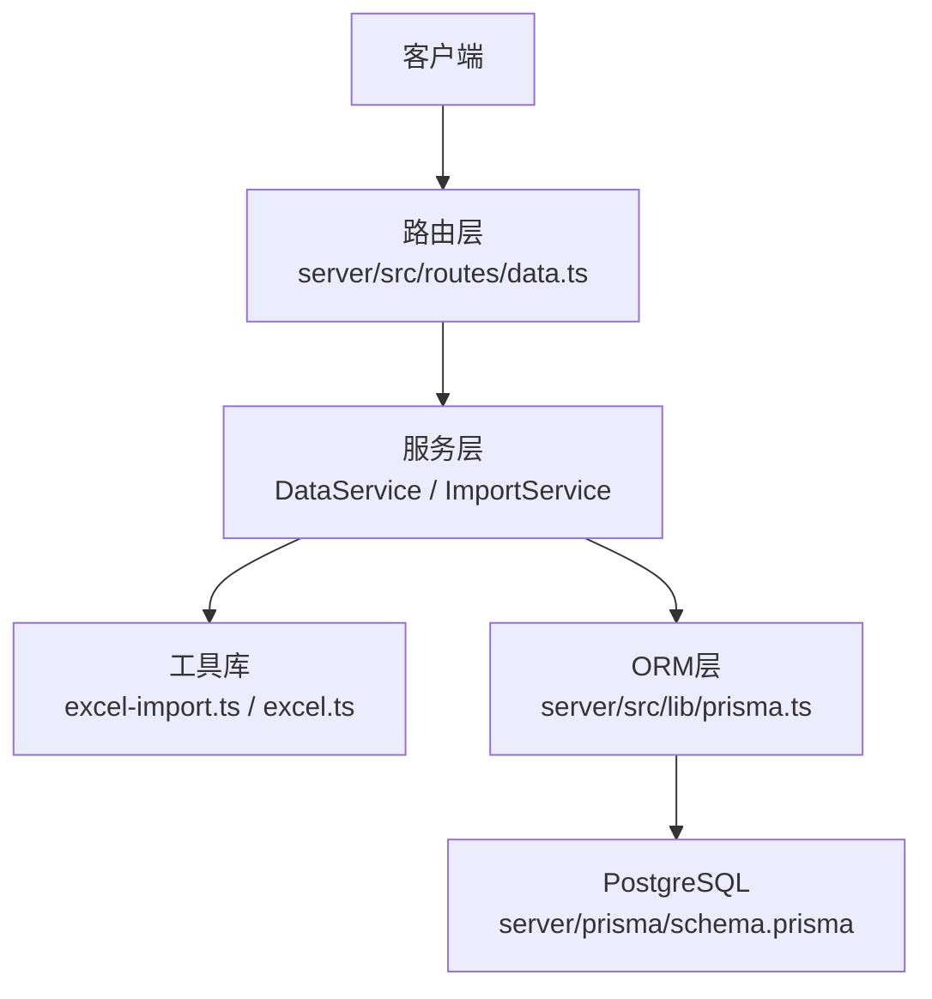
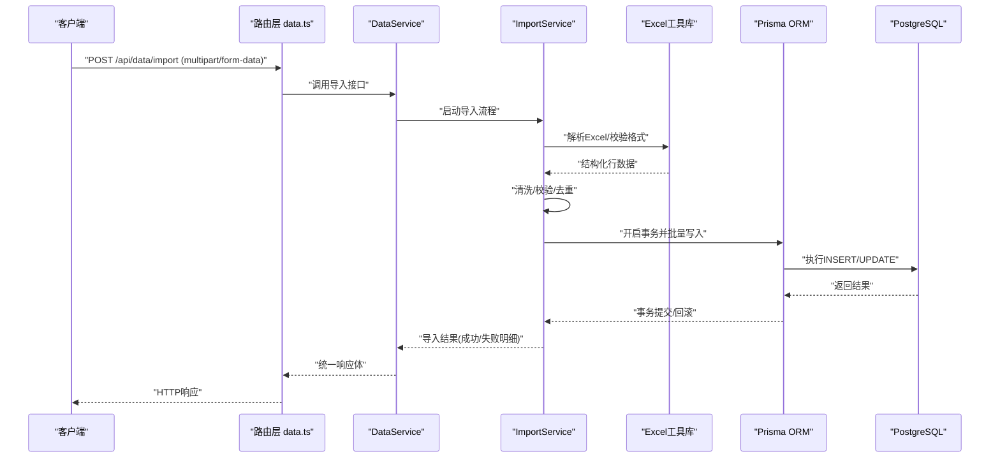
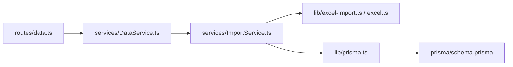

# 数据服务

<cite>
**本文引用的文件**   
- [DataService.ts](file://server/src/services/DataService.ts)
- [ImportService.ts](file://server/src/services/ImportService.ts)
- [excel-import.ts](file://server/src/lib/excel-import.ts)
- [excel.ts](file://server/src/lib/excel.ts)
- [schema.prisma](file://server/prisma/schema.prisma)
- [prisma.ts](file://server/src/lib/prisma.ts)
- [errors.ts](file://server/src/lib/errors.ts)
- [response.ts](file://server/src/lib/response.ts)
- [data.ts](file://server/src/routes/data.ts)
- [env.ts](file://server/src/config/env.ts)
</cite>

## 目录
1. [简介](#简介)
2. [项目结构](#项目结构)
3. [核心组件](#核心组件)
4. [架构总览](#架构总览)
5. [详细组件分析](#详细组件分析)
6. [依赖关系分析](#依赖关系分析)
7. [性能考量](#性能考量)
8. [故障排查指南](#故障排查指南)
9. [结论](#结论)
10. [附录](#附录)

## 简介
本文件面向FY200财年经营数据分析平台的数据服务层，聚焦于Excel导入、数据校验与转换、批量操作以及Prisma ORM的查询优化。文档围绕以下目标展开：
- 深入说明DataService类的核心能力：Excel导入处理、数据验证、格式转换与批量写入。
- 详解ImportService的数据导入流程：文件格式校验、数据清洗、重复检测与错误处理。
- 阐述Prisma ORM在关联查询、分页与事务中的优化技巧。
- 明确数据完整性约束、业务规则验证与异常处理策略。
- 提供大数据量处理的性能优化方案与缓存策略建议。

## 项目结构
后端采用Express + Prisma + PostgreSQL架构，数据服务相关代码主要位于server/src/services与server/src/lib目录，路由入口在server/src/routes/data.ts，数据库模型定义在server/prisma/schema.prisma。

图表来源
- [data.ts](file://server/src/routes/data.ts)
- [DataService.ts](file://server/src/services/DataService.ts)
- [ImportService.ts](file://server/src/services/ImportService.ts)
- [excel-import.ts](file://server/src/lib/excel-import.ts)
- [excel.ts](file://server/src/lib/excel.ts)
- [prisma.ts](file://server/src/lib/prisma.ts)
- [schema.prisma](file://server/prisma/schema.prisma)

章节来源
- [data.ts](file://server/src/routes/data.ts)
- [DataService.ts](file://server/src/services/DataService.ts)
- [ImportService.ts](file://server/src/services/ImportService.ts)
- [excel-import.ts](file://server/src/lib/excel-import.ts)
- [excel.ts](file://server/src/lib/excel.ts)
- [prisma.ts](file://server/src/lib/prisma.ts)
- [schema.prisma](file://server/prisma/schema.prisma)

## 核心组件
- DataService：对外暴露数据读写与批量操作的统一接口，封装Excel导入、数据校验、格式转换与批量写入逻辑，协调ImportService完成具体导入流程。
- ImportService：专注数据导入生命周期管理，包括文件格式校验、行级清洗、字段映射、重复检测、错误收集与回滚策略。
- Excel工具库（excel-import.ts、excel.ts）：负责Excel解析、列头识别、类型推断、数值格式化与空值处理。
- Prisma ORM（prisma.ts、schema.prisma）：提供数据库连接、事务、关联查询与分页能力。

章节来源
- [DataService.ts](file://server/src/services/DataService.ts)
- [ImportService.ts](file://server/src/services/ImportService.ts)
- [excel-import.ts](file://server/src/lib/excel-import.ts)
- [excel.ts](file://server/src/lib/excel.ts)
- [prisma.ts](file://server/src/lib/prisma.ts)
- [schema.prisma](file://server/prisma/schema.prisma)

## 架构总览
数据服务整体调用链从路由到服务再到ORM与数据库，中间件链路遵循安全与权限控制顺序。

图表来源
- [data.ts](file://server/src/routes/data.ts)
- [DataService.ts](file://server/src/services/DataService.ts)
- [ImportService.ts](file://server/src/services/ImportService.ts)
- [excel-import.ts](file://server/src/lib/excel-import.ts)
- [excel.ts](file://server/src/lib/excel.ts)
- [prisma.ts](file://server/src/lib/prisma.ts)
- [schema.prisma](file://server/prisma/schema.prisma)

## 详细组件分析

### DataService类分析
- 职责边界
  - 统一入口：接收请求参数与文件流，委派给ImportService执行导入。
  - 数据校验：对输入参数进行基础校验（如单位、时间范围、指标维度）。
  - 格式转换：将Excel原始值转换为标准数据结构（日期、数值、枚举等）。
  - 批量操作：按批次写入数据库，支持事务与部分失败的回滚策略。
- 关键流程
  - 文件上传校验与临时存储。
  - 调用ImportService进行导入。
  - 汇总导入结果，生成统一响应。
- 错误处理
  - 捕获导入过程中的异常，记录错误上下文，返回标准化错误信息。
- 性能考虑
  - 分批写入避免单次事务过大。
  - 预计算索引键以减少重复判断开销。

章节来源
- [DataService.ts](file://server/src/services/DataService.ts)

### ImportService数据导入流程
- 导入阶段划分
  - 文件校验：扩展名、MIME类型、大小限制。
  - 解析与清洗：读取工作表、识别列头、空值处理、类型转换、单位换算。
  - 重复检测：基于业务主键或组合键判定重复，支持覆盖或跳过策略。
  - 数据验证：业务规则校验（必填、取值范围、关联存在性）。
  - 批量写入：分批次插入/更新，事务包裹，失败行记录与汇总。
- 错误处理策略
  - 行级错误收集，不中断整体导入。
  - 区分系统错误与业务错误，分别记录日志与返回提示。
  - 支持部分提交与回滚策略配置。
- 性能优化
  - 流式解析大文件，降低内存占用。
  - 使用Prisma的批量写入API减少往返次数。
  - 预构建去重集合与索引键。

章节来源
- [ImportService.ts](file://server/src/services/ImportService.ts)
- [excel-import.ts](file://server/src/lib/excel-import.ts)
- [excel.ts](file://server/src/lib/excel.ts)

### Excel工具库（excel-import.ts、excel.ts）
- 功能要点
  - 工作表选择与列头映射。
  - 数据类型推断与强制转换（字符串、数字、日期、布尔）。
  - 空值与非法字符清理。
  - 公式单元格处理与值提取。
- 复杂度与优化
  - 行级处理时间复杂度O(n)，n为行数。
  - 通过惰性解析与批处理降低峰值内存。
  - 列头标准化与缓存提升重复导入效率。

章节来源
- [excel-import.ts](file://server/src/lib/excel-import.ts)
- [excel.ts](file://server/src/lib/excel.ts)

### Prisma ORM查询优化
- 关联查询
  - 使用include/select精准加载所需字段，避免N+1问题。
  - 合理设计外键与索引，提升JOIN性能。
- 分页处理
  - 基于游标或偏移的分页实现，结合排序键保证稳定性。
  - 对高频查询字段建立复合索引。
- 事务管理
  - 使用事务包裹批量写入，确保一致性。
  - 细粒度事务控制，缩短锁持有时间。

章节来源
- [prisma.ts](file://server/src/lib/prisma.ts)
- [schema.prisma](file://server/prisma/schema.prisma)

### 数据完整性与业务规则
- 完整性约束
  - 主键唯一、非空约束、外键引用完整性。
  - 检查约束用于数值范围与枚举值限定。
- 业务规则验证
  - 指标口径校验（单位、时间周期、维度一致性）。
  - 同比/环比计算前置条件检查。
- 异常处理策略
  - 统一错误码与消息模板。
  - 分层捕获与转译，便于前端展示与日志追踪。

章节来源
- [schema.prisma](file://server/prisma/schema.prisma)
- [errors.ts](file://server/src/lib/errors.ts)
- [response.ts](file://server/src/lib/response.ts)

### 流程图：ImportService导入算法

图表来源
- [ImportService.ts](file://server/src/services/ImportService.ts)
- [excel-import.ts](file://server/src/lib/excel-import.ts)
- [excel.ts](file://server/src/lib/excel.ts)

## 依赖关系分析
- 模块耦合
  - DataService依赖ImportService与Excel工具库，低耦合高内聚。
  - ImportService依赖Excel工具库与Prisma ORM。
- 外部依赖
  - Express路由层提供HTTP入口。
  - Prisma作为ORM抽象数据库访问。
  - PostgreSQL提供持久化与事务保障。

图表来源
- [data.ts](file://server/src/routes/data.ts)
- [DataService.ts](file://server/src/services/DataService.ts)
- [ImportService.ts](file://server/src/services/ImportService.ts)
- [excel-import.ts](file://server/src/lib/excel-import.ts)
- [excel.ts](file://server/src/lib/excel.ts)
- [prisma.ts](file://server/src/lib/prisma.ts)
- [schema.prisma](file://server/prisma/schema.prisma)

章节来源
- [data.ts](file://server/src/routes/data.ts)
- [DataService.ts](file://server/src/services/DataService.ts)
- [ImportService.ts](file://server/src/services/ImportService.ts)
- [excel-import.ts](file://server/src/lib/excel-import.ts)
- [excel.ts](file://server/src/lib/excel.ts)
- [prisma.ts](file://server/src/lib/prisma.ts)
- [schema.prisma](file://server/prisma/schema.prisma)

## 性能考量
- 大数据量导入
  - 流式解析Excel，避免一次性加载全部数据。
  - 分批次写入数据库，每批大小可配置（如500-2000行）。
  - 使用Prisma的批量写入API减少网络往返。
- 缓存策略
  - 对字典表与枚举值进行内存缓存，减少重复查询。
  - 对热点查询结果设置短期缓存（TTL），注意失效策略。
- 索引与查询优化
  - 针对过滤与排序字段建立合适索引。
  - 避免SELECT *，仅选取必要字段。
- 事务与锁
  - 缩小事务范围，减少锁竞争。
  - 使用乐观锁或版本号控制冲突。

[本节为通用指导，无需特定文件来源]

## 故障排查指南
- 常见错误
  - 文件格式不支持或损坏：检查扩展名与MIME类型。
  - 列头缺失或映射失败：核对模板列头与映射规则。
  - 数据类型转换失败：检查数值、日期格式与空值。
  - 业务规则校验失败：核对必填项、取值范围与关联存在性。
  - 重复数据冲突：确认去重键与处理策略（覆盖/跳过）。
- 定位方法
  - 查看导入错误明细与行号。
  - 检查事务日志与数据库约束违反信息。
  - 启用调试日志输出关键步骤。
- 恢复策略
  - 修正数据后重新导入，支持增量导入。
  - 对于部分失败，保留错误行供人工复核。

章节来源
- [errors.ts](file://server/src/lib/errors.ts)
- [response.ts](file://server/src/lib/response.ts)
- [ImportService.ts](file://server/src/services/ImportService.ts)

## 结论
FY200数据服务以DataService与ImportService为核心，结合Excel工具库与Prisma ORM，构建了稳健的Excel导入与批量数据处理能力。通过严格的校验、清晰的错误处理与事务保障，确保了数据的完整性与一致性。在大数据量场景下，通过流式解析、分批写入与缓存策略，实现了良好的性能表现。后续可进一步优化索引设计与查询计划，持续提升导入效率与系统稳定性。

[本节为总结性内容，无需特定文件来源]

## 附录
- 环境变量与配置
  - 数据库连接、JWT密钥、第三方API配置等。
- 数据模型规范
  - 实体关系、字段命名约定与约束说明。
- 开发运维参考
  - 本地环境搭建、迁移脚本与种子数据。

章节来源
- [env.ts](file://server/src/config/env.ts)
- [schema.prisma](file://server/prisma/schema.prisma)