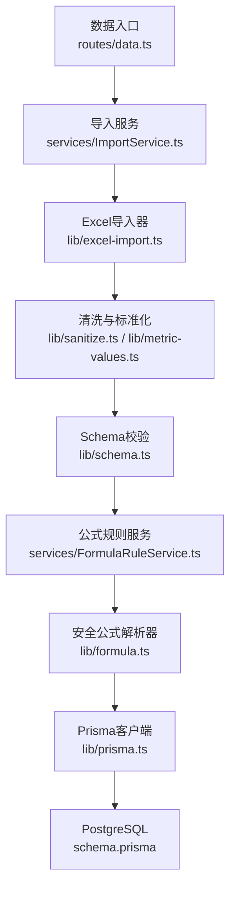
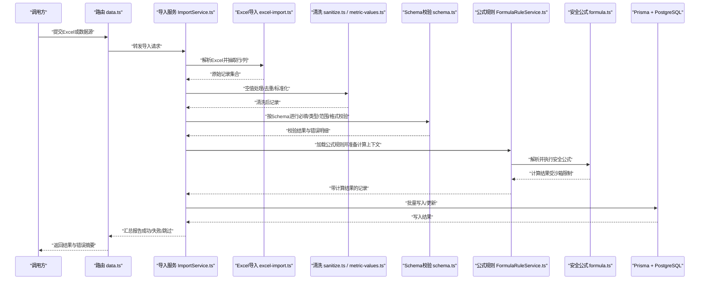
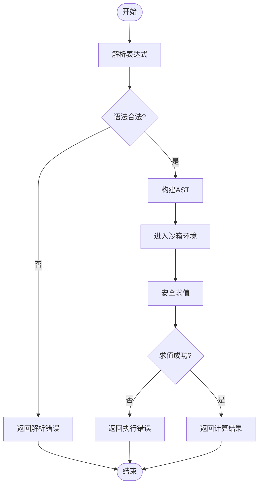
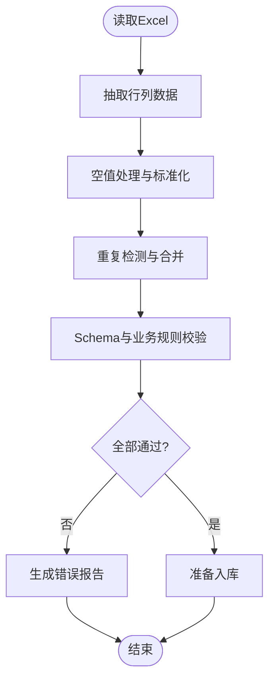
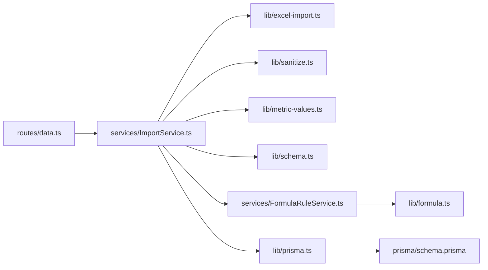

# 数据验证与清洗

<cite>
**本文引用的文件**   
- [server/src/lib/formula.ts](file://server/src/lib/formula.ts)
- [server/src/lib/formula.test.ts](file://server/src/lib/formula.test.ts)
- [server/src/services/FormulaRuleService.ts](file://server/src/services/FormulaRuleService.ts)
- [server/src/services/formula-validation.test.ts](file://server/src/services/formula-validation.test.ts)
- [server/src/lib/excel-import.ts](file://server/src/lib/excel-import.ts)
- [server/src/lib/excel-import.test.ts](file://server/src/lib/excel-import.test.ts)
- [server/src/lib/sanitize.ts](file://server/src/lib/sanitize.ts)
- [server/src/lib/sanitize.test.ts](file://server/src/lib/sanitize.test.ts)
- [server/src/lib/metric-values.ts](file://server/src/lib/metric-values.ts)
- [server/src/lib/metric-values.test.ts](file://server/src/lib/metric-values.test.ts)
- [server/src/lib/schema.ts](file://server/src/lib/schema.ts)
- [server/src/lib/errors.ts](file://server/src/lib/errors.ts)
- [server/src/middleware/error-handler.ts](file://server/src/middleware/error-handler.ts)
- [server/src/routes/data.ts](file://server/src/routes/data.ts)
- [server/src/services/DataService.ts](file://server/src/services/DataService.ts)
- [server/src/services/ImportService.ts](file://server/src/services/ImportService.ts)
- [server/src/lib/prisma.ts](file://server/src/lib/prisma.ts)
- [server/prisma/schema.prisma](file://server/prisma/schema.prisma)
</cite>

## 目录
1. [引言](#引言)
2. [项目结构](#项目结构)
3. [核心组件](#核心组件)
4. [架构总览](#架构总览)
5. [详细组件分析](#详细组件分析)
6. [依赖关系分析](#依赖关系分析)
7. [性能考虑](#性能考虑)
8. [故障排查指南](#故障排查指南)
9. [结论](#结论)
10. [附录](#附录)

## 引言
本文件围绕“数据验证与清洗”主题，系统性梳理本项目在数据完整性检查、安全公式解析、数据清洗流程、自定义规则扩展以及大数据量验证的性能优化与缓存策略等方面的设计与实现。项目定位为“Excel进、看板/报表出”的财年经营数据分析平台，单位统一为万元/人民币；计算类指标采用安全公式解析（白名单算子），同比/环比由后端实时计算不入库。

## 项目结构
与数据验证与清洗相关的代码主要分布在以下模块：
- 公式与安全解析：lib/formula.ts、services/FormulaRuleService.ts、services/formula-validation.test.ts
- Excel导入与清洗：lib/excel-import.ts、lib/excel-import.test.ts
- 通用校验与脱敏：lib/sanitize.ts、lib/sanitize.test.ts、lib/metric-values.ts、lib/metric-values.test.ts、lib/schema.ts
- 错误处理与中间件：lib/errors.ts、middleware/error-handler.ts
- 数据服务与路由：routes/data.ts、services/DataService.ts、services/ImportService.ts
- 数据库模型：prisma/schema.prisma

**图表来源**
- [server/src/routes/data.ts](file://server/src/routes/data.ts)
- [server/src/services/ImportService.ts](file://server/src/services/ImportService.ts)
- [server/src/lib/excel-import.ts](file://server/src/lib/excel-import.ts)
- [server/src/lib/sanitize.ts](file://server/src/lib/sanitize.ts)
- [server/src/lib/metric-values.ts](file://server/src/lib/metric-values.ts)
- [server/src/lib/schema.ts](file://server/src/lib/schema.ts)
- [server/src/services/FormulaRuleService.ts](file://server/src/services/FormulaRuleService.ts)
- [server/src/lib/formula.ts](file://server/src/lib/formula.ts)
- [server/src/lib/prisma.ts](file://server/src/lib/prisma.ts)
- [server/prisma/schema.prisma](file://server/prisma/schema.prisma)

**章节来源**
- [server/src/routes/data.ts](file://server/src/routes/data.ts)
- [server/src/services/ImportService.ts](file://server/src/services/ImportService.ts)
- [server/src/lib/excel-import.ts](file://server/src/lib/excel-import.ts)
- [server/src/lib/sanitize.ts](file://server/src/lib/sanitize.ts)
- [server/src/lib/metric-values.ts](file://server/src/lib/metric-values.ts)
- [server/src/lib/schema.ts](file://server/src/lib/schema.ts)
- [server/src/services/FormulaRuleService.ts](file://server/src/services/FormulaRuleService.ts)
- [server/src/lib/formula.ts](file://server/src/lib/formula.ts)
- [server/src/lib/prisma.ts](file://server/src/lib/prisma.ts)
- [server/prisma/schema.prisma](file://server/prisma/schema.prisma)

## 核心组件
- 安全公式解析器：基于白名单算子的表达式解析与执行沙箱，禁止任意代码执行，支持 +-*/() 等基础运算，用于计算类指标的实时推导。
- Excel导入与清洗：读取Excel、空值处理、重复检测、格式标准化、业务规则校验，产出结构化数据供后续使用。
- Schema与类型校验：集中式字段定义与约束，确保入库数据满足必填、类型、范围、格式等要求。
- 指标值处理：数值归一化、单位换算（万元）、异常值处理、精度控制。
- 错误与响应：统一的错误分类、消息定制、中间件级错误捕获与返回。

**章节来源**
- [server/src/lib/formula.ts](file://server/src/lib/formula.ts)
- [server/src/lib/excel-import.ts](file://server/src/lib/excel-import.ts)
- [server/src/lib/sanitize.ts](file://server/src/lib/sanitize.ts)
- [server/src/lib/metric-values.ts](file://server/src/lib/metric-values.ts)
- [server/src/lib/schema.ts](file://server/src/lib/schema.ts)
- [server/src/lib/errors.ts](file://server/src/lib/errors.ts)
- [server/src/middleware/error-handler.ts](file://server/src/middleware/error-handler.ts)

## 架构总览
下图展示从数据导入到验证、清洗、公式计算与落库的整体流程，强调安全解析与校验环节。

**图表来源**
- [server/src/routes/data.ts](file://server/src/routes/data.ts)
- [server/src/services/ImportService.ts](file://server/src/services/ImportService.ts)
- [server/src/lib/excel-import.ts](file://server/src/excel-import.ts)
- [server/src/lib/sanitize.ts](file://server/src/lib/sanitize.ts)
- [server/src/lib/metric-values.ts](file://server/src/lib/metric-values.ts)
- [server/src/lib/schema.ts](file://server/src/lib/schema.ts)
- [server/src/services/FormulaRuleService.ts](file://server/src/services/FormulaRuleService.ts)
- [server/src/lib/formula.ts](file://server/src/lib/formula.ts)
- [server/src/lib/prisma.ts](file://server/src/lib/prisma.ts)
- [server/prisma/schema.prisma](file://server/prisma/schema.prisma)

## 详细组件分析

### 安全公式解析器（白名单算子与执行沙箱）
- 设计要点
  - 白名单算子：仅允许 +-*/() 等基础数学运算，禁止函数调用与任意代码执行。
  - 语法分析：将表达式解析为抽象语法树（AST），再进行求值，避免直接 eval。
  - 执行沙箱：限制变量访问与作用域，仅暴露必要上下文（如字段值、常量）。
  - 错误隔离：解析与执行阶段均捕获异常，返回明确的错误信息。
- 典型流程
  - 输入表达式 → 词法分析 → 语法分析 → AST构建 → 安全求值 → 输出结果
- 适用场景
  - 计算类指标的实时推导（如比率、加权平均、区间阈值判定）
  - 规则引擎中的条件判断与派生字段生成

**图表来源**
- [server/src/lib/formula.ts](file://server/src/lib/formula.ts)
- [server/src/lib/formula.test.ts](file://server/src/lib/formula.test.ts)
- [server/src/services/FormulaRuleService.ts](file://server/src/services/FormulaRuleService.ts)
- [server/src/services/formula-validation.test.ts](file://server/src/services/formula-validation.test.ts)

**章节来源**
- [server/src/lib/formula.ts](file://server/src/lib/formula.ts)
- [server/src/lib/formula.test.ts](file://server/src/lib/formula.test.ts)
- [server/src/services/FormulaRuleService.ts](file://server/src/services/FormulaRuleService.ts)
- [server/src/services/formula-validation.test.ts](file://server/src/services/formula-validation.test.ts)

### Excel导入与数据清洗
- 空值处理
  - 识别空字符串、空白字符、null/undefined，提供默认值或标记缺失。
- 重复数据检测
  - 基于关键字段组合（如公司+科目+期间）进行去重或冲突提示。
- 格式标准化
  - 日期、金额、百分比等字段的统一格式化与单位转换（万元）。
- 业务规则验证
  - 范围检查（如金额非负、比例在[0,1]）、枚举值校验、跨字段一致性检查。
- 输出
  - 结构化记录集，附带校验状态与错误明细，便于前端展示与用户修正。

**图表来源**
- [server/src/lib/excel-import.ts](file://server/src/lib/excel-import.ts)
- [server/src/lib/excel-import.test.ts](file://server/src/lib/excel-import.test.ts)
- [server/src/lib/sanitize.ts](file://server/src/lib/sanitize.ts)
- [server/src/lib/sanitize.test.ts](file://server/src/lib/sanitize.test.ts)
- [server/src/lib/metric-values.ts](file://server/src/lib/metric-values.ts)
- [server/src/lib/metric-values.test.ts](file://server/src/lib/metric-values.test.ts)
- [server/src/lib/schema.ts](file://server/src/lib/schema.ts)

**章节来源**
- [server/src/lib/excel-import.ts](file://server/src/lib/excel-import.ts)
- [server/src/lib/excel-import.test.ts](file://server/src/lib/excel-import.test.ts)
- [server/src/lib/sanitize.ts](file://server/src/lib/sanitize.ts)
- [server/src/lib/sanitize.test.ts](file://server/src/lib/sanitize.test.ts)
- [server/src/lib/metric-values.ts](file://server/src/lib/metric-values.ts)
- [server/src/lib/metric-values.test.ts](file://server/src/lib/metric-values.test.ts)
- [server/src/lib/schema.ts](file://server/src/lib/schema.ts)

### Schema与类型校验（必填、类型、范围、格式）
- 必填字段验证：对关键字段进行存在性与非空检查。
- 数据类型校验：字符串、数字、布尔、日期等类型的严格匹配。
- 范围检查：数值上下界、枚举值、长度限制。
- 格式验证：邮箱、手机号、URL、正则表达式模式等。
- 集成点：在导入流程中作为最后一道防线，拦截非法数据并生成错误明细。

**章节来源**
- [server/src/lib/schema.ts](file://server/src/lib/schema.ts)

### 指标值处理与单位统一
- 数值归一化：去除千分位、处理科学计数法、小数位数控制。
- 单位换算：统一为万元，避免混用导致的计算偏差。
- 异常值处理：识别极端值并进行告警或截断策略。
- 精度控制：浮点数运算误差补偿，保证财务数据的严谨性。

**章节来源**
- [server/src/lib/metric-values.ts](file://server/src/lib/metric-values.ts)
- [server/src/lib/metric-values.test.ts](file://server/src/lib/metric-values.test.ts)

### 错误处理与消息定制
- 错误分类：解析错误、校验错误、执行错误、系统错误等。
- 消息定制：面向用户的友好提示与面向开发者的调试信息分离。
- 中间件捕获：统一错误处理中间件，确保API层一致的错误响应格式。

**章节来源**
- [server/src/lib/errors.ts](file://server/src/lib/errors.ts)
- [server/src/middleware/error-handler.ts](file://server/src/middleware/error-handler.ts)

## 依赖关系分析
- 路由层（data.ts）负责接收请求并委派给导入服务（ImportService.ts）。
- 导入服务协调Excel导入器（excel-import.ts）、清洗模块（sanitize.ts、metric-values.ts）、Schema校验（schema.ts）。
- 公式规则服务（FormulaRuleService.ts）依赖安全公式解析器（formula.ts）进行计算。
- 所有持久化操作通过Prisma客户端（prisma.ts）访问PostgreSQL（schema.prisma）。

**图表来源**
- [server/src/routes/data.ts](file://server/src/routes/data.ts)
- [server/src/services/ImportService.ts](file://server/src/services/ImportService.ts)
- [server/src/lib/excel-import.ts](file://server/src/lib/excel-import.ts)
- [server/src/lib/sanitize.ts](file://server/src/lib/sanitize.ts)
- [server/src/lib/metric-values.ts](file://server/src/lib/metric-values.ts)
- [server/src/lib/schema.ts](file://server/src/lib/schema.ts)
- [server/src/services/FormulaRuleService.ts](file://server/src/services/FormulaRuleService.ts)
- [server/src/lib/formula.ts](file://server/src/lib/formula.ts)
- [server/src/lib/prisma.ts](file://server/src/lib/prisma.ts)
- [server/prisma/schema.prisma](file://server/prisma/schema.prisma)

**章节来源**
- [server/src/routes/data.ts](file://server/src/routes/data.ts)
- [server/src/services/ImportService.ts](file://server/src/services/ImportService.ts)
- [server/src/lib/excel-import.ts](file://server/src/lib/excel-import.ts)
- [server/src/lib/sanitize.ts](file://server/src/lib/sanitize.ts)
- [server/src/lib/metric-values.ts](file://server/src/lib/metric-values.ts)
- [server/src/lib/schema.ts](file://server/src/lib/schema.ts)
- [server/src/services/FormulaRuleService.ts](file://server/src/services/FormulaRuleService.ts)
- [server/src/lib/formula.ts](file://server/src/lib/formula.ts)
- [server/src/lib/prisma.ts](file://server/src/lib/prisma.ts)
- [server/prisma/schema.prisma](file://server/prisma/schema.prisma)

## 性能考虑
- 批处理与流式处理
  - 大文件Excel导入建议分批读取与写入，降低内存峰值。
  - 使用流式解析减少一次性加载开销。
- 索引与查询优化
  - 针对去重与校验的关键字段建立索引，提升重复检测与查询效率。
- 缓存策略
  - 公式规则与字典表可缓存（如Redis），减少频繁读取。
  - 热点指标的计算结果可按维度缓存，缩短响应时间。
- 并发控制
  - 限制并发导入任务数量，避免资源争用。
  - 使用队列机制（如BullMQ）对导入任务进行削峰填谷。
- 计算优化
  - 公式解析结果缓存（相同表达式与上下文复用AST与求值结果）。
  - 预编译常用公式模板，减少运行时解析成本。

[本节为通用性能指导，不直接分析具体文件]

## 故障排查指南
- 常见错误类型
  - 解析错误：表达式语法不合法、非法字符。
  - 校验错误：必填缺失、类型不符、范围越界、格式不正确。
  - 执行错误：沙箱内权限不足、除零、溢出。
  - 系统错误：数据库连接失败、磁盘空间不足。
- 定位方法
  - 查看错误分类与消息，结合日志定位问题阶段（解析/校验/执行/存储）。
  - 使用测试用例复现问题，缩小影响范围。
- 修复建议
  - 修正输入数据格式与内容。
  - 调整Schema约束与业务规则。
  - 优化公式表达式与上下文参数。
  - 检查数据库配置与资源可用性。

**章节来源**
- [server/src/lib/errors.ts](file://server/src/lib/errors.ts)
- [server/src/middleware/error-handler.ts](file://server/src/middleware/error-handler.ts)

## 结论
本项目在数据验证与清洗方面形成了完整的闭环：从Excel导入、空值处理、去重、标准化到Schema校验与业务规则验证，再到安全公式解析与计算，最终落库。通过白名单算子与执行沙箱保障安全性，通过Schema与错误处理保障数据质量与可观测性。针对大数据量场景，提供了批处理、缓存、并发控制等性能优化方案，确保系统在规模增长时仍保持高可用与高性能。

[本节为总结性内容，不直接分析具体文件]

## 附录
- 自定义验证规则扩展方法
  - 在Schema中新增字段约束与校验逻辑，支持正则、函数校验与跨字段校验。
  - 在清洗流程中插入自定义处理器，处理特定业务场景的数据转换与验证。
  - 在公式规则服务中注册新的算子或上下文变量，扩展计算能力。
- 错误消息定制
  - 通过错误分类与消息模板，统一面向用户与开发者的提示信息。
  - 在中间件层捕获并格式化错误，确保API响应一致性。

[本节为补充说明，不直接分析具体文件]