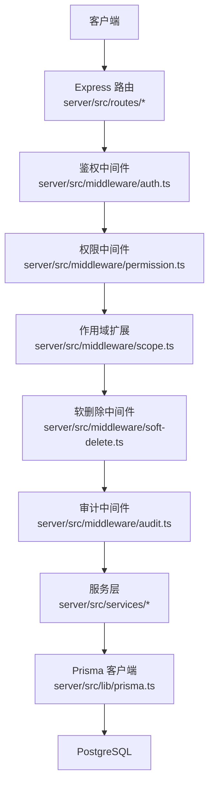
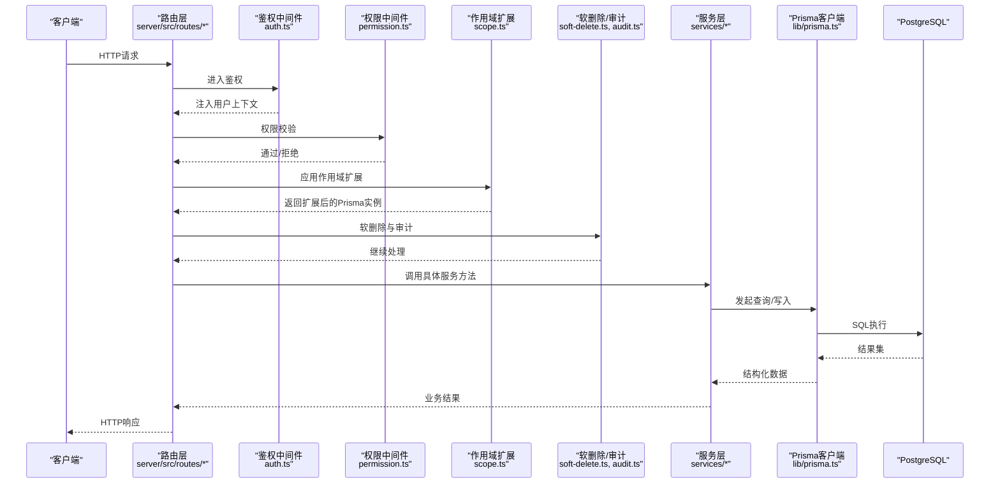
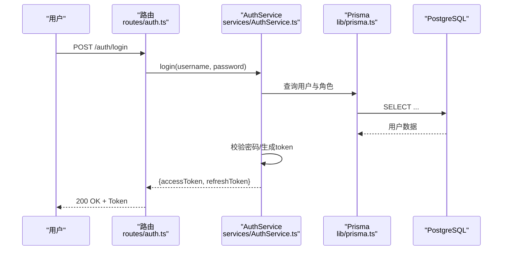
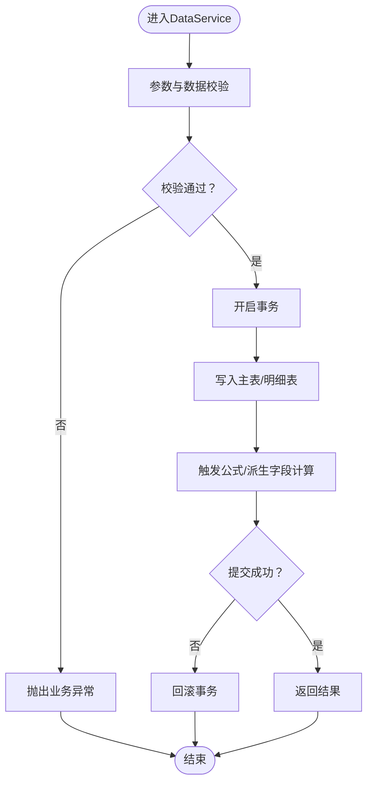
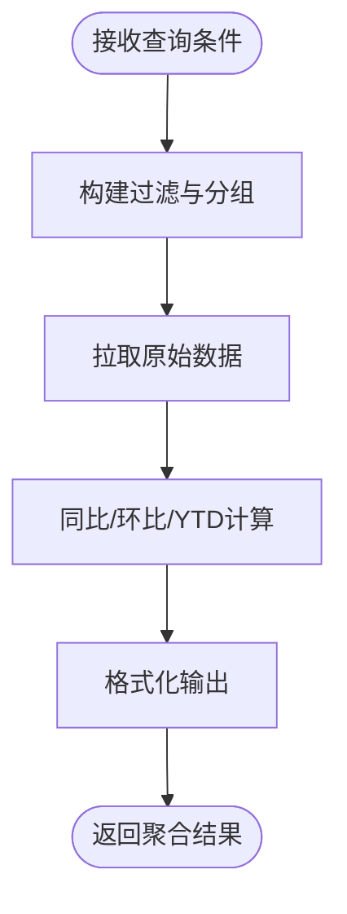
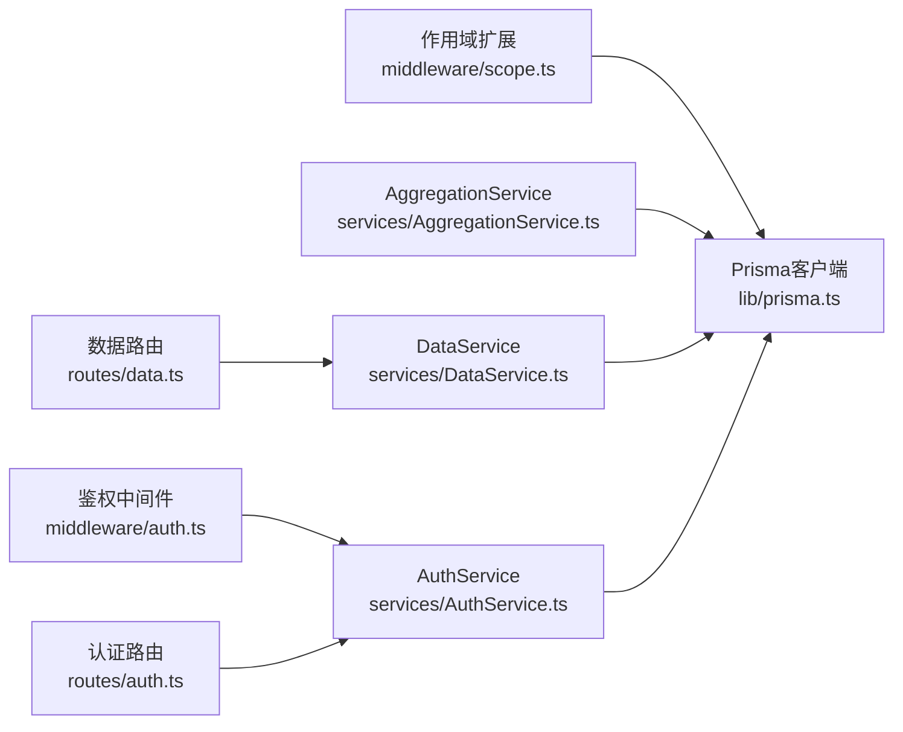

# 服务层开发

<cite>
**本文引用的文件**   
- [server/src/services/AuthService.ts](file://server/src/services/AuthService.ts)
- [server/src/services/DataService.ts](file://server/src/services/DataService.ts)
- [server/src/services/AggregationService.ts](file://server/src/services/AggregationService.ts)
- [server/src/lib/prisma.ts](file://server/src/lib/prisma.ts)
- [server/prisma/schema.prisma](file://server/prisma/schema.prisma)
- [server/src/middleware/auth.ts](file://server/src/middleware/auth.ts)
- [server/src/middleware/scope.ts](file://server/src/middleware/scope.ts)
- [server/src/middleware/error-handler.ts](file://server/src/middleware/error-handler.ts)
- [server/src/lib/errors.ts](file://server/src/lib/errors.ts)
- [server/src/routes/auth.ts](file://server/src/routes/auth.ts)
- [server/src/routes/data.ts](file://server/src/routes/data.ts)
- [server/src/app.ts](file://server/src/app.ts)
</cite>

## 目录
1. [简介](#简介)
2. [项目结构](#项目结构)
3. [核心组件](#核心组件)
4. [架构总览](#架构总览)
5. [详细组件分析](#详细组件分析)
6. [依赖关系分析](#依赖关系分析)
7. [性能考虑](#性能考虑)
8. [故障排查指南](#故障排查指南)
9. [结论](#结论)
10. [附录](#附录)

## 简介
本指南面向FY200财年经营数据分析平台的服务层开发，聚焦业务逻辑封装与Prisma ORM使用模式。内容覆盖AuthService、DataService、AggregationService的职责分离；数据验证、业务规则校验与异常处理策略；复杂查询优化与缓存策略；以及单元测试编写与Mock数据生成方法。结合中间件执行链（helmet → cors → express.json → rate-limit → auth → permission → scope → softDelete → audit → Service → Prisma → PostgreSQL），帮助读者构建高内聚、低耦合、可测试的服务层。

## 项目结构
服务层位于 server/src/services，配合路由层（routes）、中间件（middleware）、工具库（lib）与Prisma模型（prisma/schema.prisma）共同构成后端核心。典型调用路径为：客户端请求 → Express路由 → 鉴权与权限中间件 → 作用域扩展 → 软删除审计 → 业务服务 → Prisma → 数据库。

图表来源
- [server/src/app.ts](file://server/src/app.ts)
- [server/src/middleware/auth.ts](file://server/src/middleware/auth.ts)
- [server/src/middleware/scope.ts](file://server/src/middleware/scope.ts)
- [server/src/lib/prisma.ts](file://server/src/lib/prisma.ts)

章节来源
- [server/src/app.ts](file://server/src/app.ts)
- [server/src/middleware/auth.ts](file://server/src/middleware/auth.ts)
- [server/src/middleware/scope.ts](file://server/src/middleware/scope.ts)
- [server/src/lib/prisma.ts](file://server/src/lib/prisma.ts)

## 核心组件
- AuthService：负责用户认证、令牌签发与刷新、黑名单校验、会话上下文注入。对外暴露登录、登出、刷新、获取当前用户等能力。
- DataService：负责指标数据的CRUD、导入导出、公式计算输入的数据准备与校验。屏蔽底层表结构细节，向上提供领域语义接口。
- AggregationService：负责同比/环比、YTD、聚合统计等计算型指标的计算与结果组装，确保不直接落库，避免状态不一致。

职责边界
- 路由仅做参数解析与响应包装，不包含业务逻辑。
- 服务层承载全部业务规则、数据访问编排与事务控制。
- Prisma作为唯一数据访问入口，通过扩展注入作用域与审计字段。

章节来源
- [server/src/services/AuthService.ts](file://server/src/services/AuthService.ts)
- [server/src/services/DataService.ts](file://server/src/services/DataService.ts)
- [server/src/services/AggregationService.ts](file://server/src/services/AggregationService.ts)

## 架构总览
下图展示从HTTP请求到数据库的完整链路，并标注关键中间件与服务类。

图表来源
- [server/src/routes/auth.ts](file://server/src/routes/auth.ts)
- [server/src/routes/data.ts](file://server/src/routes/data.ts)
- [server/src/middleware/auth.ts](file://server/src/middleware/auth.ts)
- [server/src/middleware/scope.ts](file://server/src/middleware/scope.ts)
- [server/src/lib/prisma.ts](file://server/src/lib/prisma.ts)

## 详细组件分析

### AuthService 分析
职责
- 登录：校验用户名/密码，签发access与refresh token，记录黑名单策略（如登出）。
- 刷新：基于refresh token换取新access token，支持轮转。
- 鉴权上下文：将用户信息注入请求上下文，供后续权限与作用域使用。
- 安全：密码哈希校验、token签名与过期管理、黑名单检查。

交互流程

图表来源
- [server/src/routes/auth.ts](file://server/src/routes/auth.ts)
- [server/src/services/AuthService.ts](file://server/src/services/AuthService.ts)
- [server/src/lib/prisma.ts](file://server/src/lib/prisma.ts)

章节来源
- [server/src/services/AuthService.ts](file://server/src/services/AuthService.ts)
- [server/src/middleware/auth.ts](file://server/src/middleware/auth.ts)
- [server/src/lib/errors.ts](file://server/src/lib/errors.ts)

### DataService 分析
职责
- 指标数据CRUD：创建、更新、删除、分页查询、批量导入。
- 数据校验：字段类型、范围、必填、关联完整性。
- 公式输入准备：为安全公式解析提供标准化输入，避免eval风险。
- 事务编排：多表写入时保证一致性。

典型操作流

图表来源
- [server/src/services/DataService.ts](file://server/src/services/DataService.ts)
- [server/src/lib/errors.ts](file://server/src/lib/errors.ts)

章节来源
- [server/src/services/DataService.ts](file://server/src/services/DataService.ts)
- [server/src/lib/errors.ts](file://server/src/lib/errors.ts)

### AggregationService 分析
职责
- 计算型指标：同比、环比、YTD、累计、占比等。
- 数据聚合：按公司、科目、期间维度进行分组汇总。
- 实时计算：不持久化计算结果，避免冗余与不一致。

计算流程

图表来源
- [server/src/services/AggregationService.ts](file://server/src/services/AggregationService.ts)

章节来源
- [server/src/services/AggregationService.ts](file://server/src/services/AggregationService.ts)

### Prisma ORM 使用模式
- 模型定义：在 schema.prisma 中声明实体、字段、关系与索引。
- 查询构建：使用 prisma.$extends 注入作用域与审计字段，统一数据可见性。
- 事务处理：对多步写入使用 $transaction，失败自动回滚。
- 性能优化：选择必要字段、合理使用 include/relations、分页与游标、避免N+1。

章节来源
- [server/prisma/schema.prisma](file://server/prisma/schema.prisma)
- [server/src/lib/prisma.ts](file://server/src/lib/prisma.ts)

### 服务间依赖管理与调用模式
- 依赖注入：路由层构造服务实例，或通过容器统一管理生命周期。
- 调用约定：服务方法以领域语义命名，返回DTO而非ORM实体。
- 错误传播：统一抛出自定义异常，由全局错误处理器捕获并转换为HTTP响应。
- 幂等与重试：写操作需具备幂等键或去重逻辑，外部调用增加重试与熔断。

章节来源
- [server/src/app.ts](file://server/src/app.ts)
- [server/src/lib/errors.ts](file://server/src/lib/errors.ts)

## 依赖关系分析
服务层与中间件、路由、Prisma之间的依赖如下：

图表来源
- [server/src/middleware/auth.ts](file://server/src/middleware/auth.ts)
- [server/src/middleware/scope.ts](file://server/src/middleware/scope.ts)
- [server/src/routes/auth.ts](file://server/src/routes/auth.ts)
- [server/src/routes/data.ts](file://server/src/routes/data.ts)
- [server/src/services/AuthService.ts](file://server/src/services/AuthService.ts)
- [server/src/services/DataService.ts](file://server/src/services/DataService.ts)
- [server/src/services/AggregationService.ts](file://server/src/services/AggregationService.ts)
- [server/src/lib/prisma.ts](file://server/src/lib/prisma.ts)

章节来源
- [server/src/middleware/auth.ts](file://server/src/middleware/auth.ts)
- [server/src/middleware/scope.ts](file://server/src/middleware/scope.ts)
- [server/src/routes/auth.ts](file://server/src/routes/auth.ts)
- [server/src/routes/data.ts](file://server/src/routes/data.ts)
- [server/src/services/AuthService.ts](file://server/src/services/AuthService.ts)
- [server/src/services/DataService.ts](file://server/src/services/DataService.ts)
- [server/src/services/AggregationService.ts](file://server/src/services/AggregationService.ts)
- [server/src/lib/prisma.ts](file://server/src/lib/prisma.ts)

## 性能考虑
- 查询优化
  - 只选择必要字段，减少网络传输与内存占用。
  - 使用 include/relations 替代多次查询，避免N+1问题。
  - 对高频过滤字段建立索引，合理设计复合索引。
  - 分页采用游标或基于ID的分页，避免深分页。
- 事务与锁
  - 将相关写入放入同一事务，缩短持有时间。
  - 必要时使用行级锁防止并发冲突。
- 计算与缓存
  - 计算型指标实时计算，不落地；热点数据可加短期缓存（如Redis）。
  - 对只读聚合结果设置合理的TTL与失效策略。
- 连接池与超时
  - 配置Prisma连接池大小与超时，避免连接耗尽。
  - 对慢查询设置超时与告警。

[本节为通用指导，无需代码来源]

## 故障排查指南
- 常见错误分类
  - 参数校验失败：返回400，提示具体字段错误。
  - 业务规则违反：返回422或自定义状态码，附带错误码与消息。
  - 权限不足：返回403，说明原因。
  - 未找到资源：返回404。
  - 系统异常：返回500，包含追踪ID便于定位。
- 错误处理策略
  - 在服务层抛出统一异常类型，携带错误码与上下文。
  - 全局错误处理器捕获异常，转换为标准JSON响应。
  - 记录结构化日志，包含请求ID、用户ID、耗时与堆栈。
- 调试建议
  - 启用Prisma查询日志，观察SQL与耗时。
  - 使用中间件trace-id贯穿全链路。
  - 针对慢查询添加索引或改写SQL。

章节来源
- [server/src/middleware/error-handler.ts](file://server/src/middleware/error-handler.ts)
- [server/src/lib/errors.ts](file://server/src/lib/errors.ts)

## 结论
通过清晰的服务分层与Prisma ORM规范，FY200服务层实现了高内聚、低耦合与强一致性的数据处理。AuthService专注认证与安全，DataService负责数据与规则，AggregationService承担计算与聚合。配合中间件链与统一错误处理，系统在可维护性、可扩展性与性能方面达到良好平衡。建议在后续迭代中持续完善索引、缓存与监控，提升整体稳定性与用户体验。

[本节为总结，无需代码来源]

## 附录

### 数据验证与业务规则校验
- 输入校验：使用校验库对请求体进行类型、长度、格式校验。
- 业务规则：在Service层实现领域约束，如金额非负、期间连续性、公式合法性。
- 异常映射：将校验失败映射为统一的业务异常，便于前端提示。

章节来源
- [server/src/lib/errors.ts](file://server/src/lib/errors.ts)

### 复杂查询优化技巧
- 分步查询：先筛选再关联，减少中间结果集。
- 物化视图/汇总表：对极高频聚合场景考虑预计算。
- 读写分离：读多写少场景下引入只读副本。

[本节为通用指导，无需代码来源]

### 缓存策略
- 热点数据：短TTL缓存（秒级），带版本号或时间戳失效。
- 聚合结果：长TTL缓存（分钟级），配合异步刷新。
- 缓存穿透：布隆过滤器或空值缓存。
- 缓存雪崩：随机过期时间、限流降级。

[本节为通用指导，无需代码来源]

### 单元测试编写指南与Mock数据生成
- 测试目标
  - 服务方法：覆盖正常路径、边界条件与异常分支。
  - 中间件：鉴权、权限、作用域、软删除与审计。
- Mock策略
  - Mock Prisma客户端：返回期望的结构化数据，模拟异常。
  - Mock外部依赖：如AI代理、第三方API。
- 数据生成
  - 使用工厂函数生成稳定、可复用的测试数据。
  - 清理策略：每个用例前后清理或事务回滚。
- 断言要点
  - 返回值结构、错误码、副作用（如写入、事件发布）。

章节来源
- [server/src/services/AuthService.ts](file://server/src/services/AuthService.ts)
- [server/src/services/DataService.ts](file://server/src/services/DataService.ts)
- [server/src/services/AggregationService.ts](file://server/src/services/AggregationService.ts)