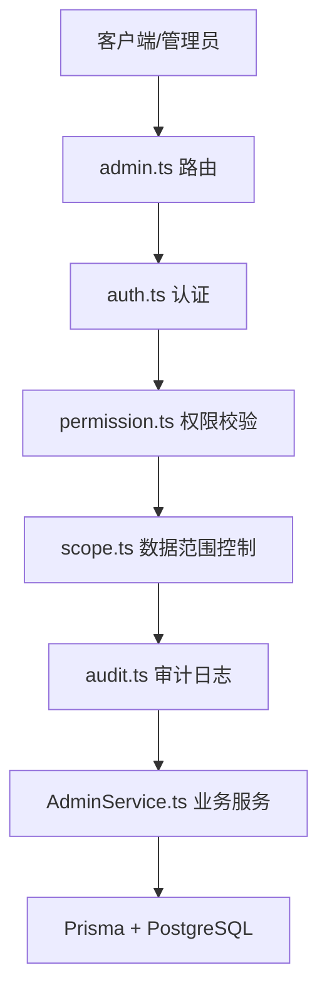
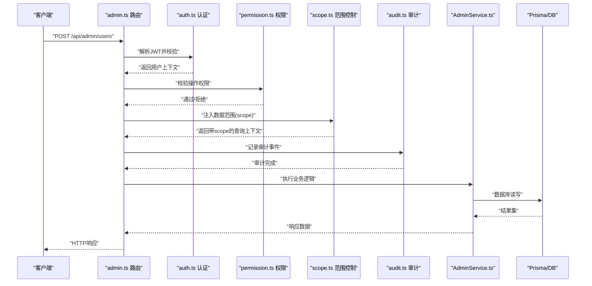
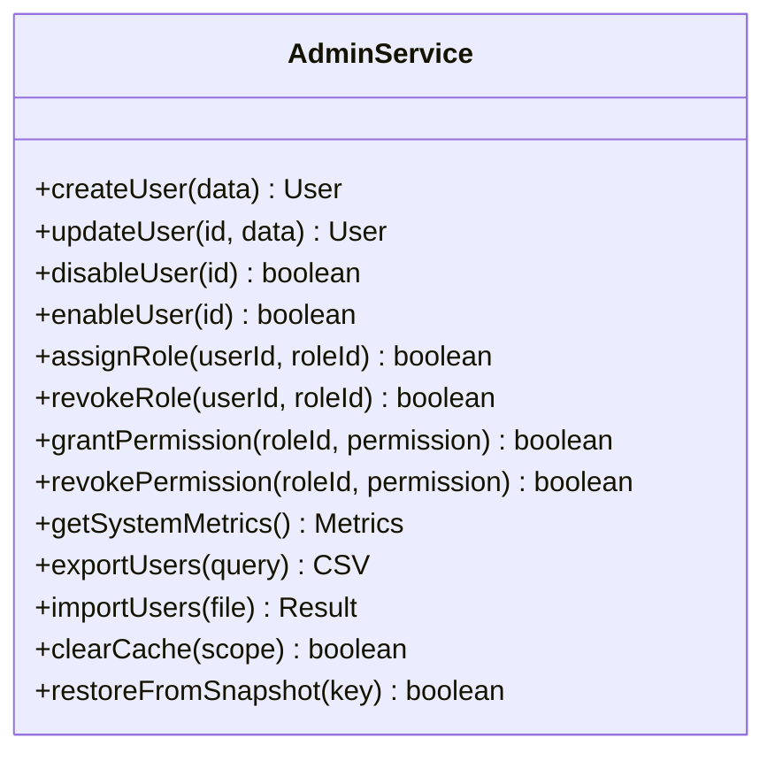
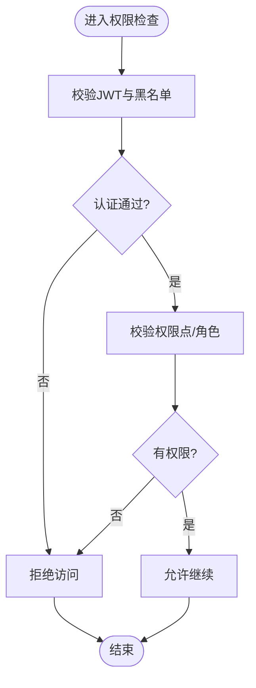
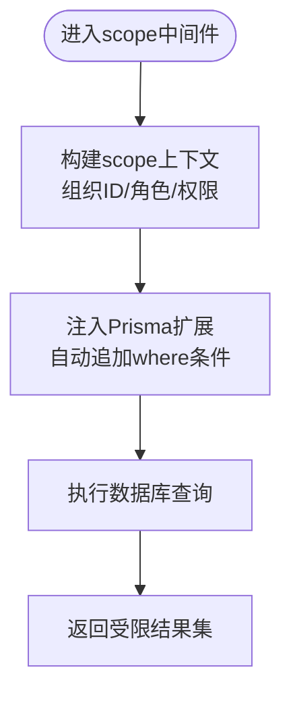
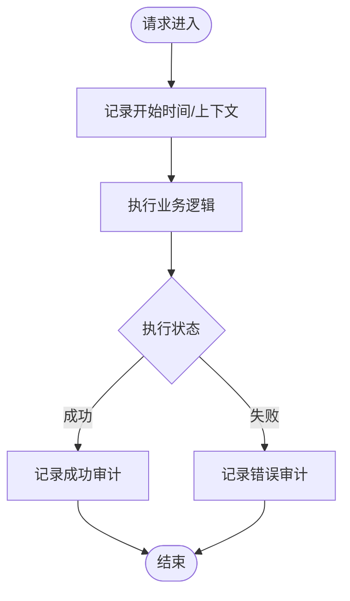

# 管理服务

<cite>
**本文引用的文件**   
- [server/src/services/AdminService.ts](file://server/src/services/AdminService.ts)
- [server/src/routes/admin.ts](file://server/src/routes/admin.ts)
- [server/src/middleware/auth.ts](file://server/src/middleware/auth.ts)
- [server/src/middleware/permission.ts](file://server/src/middleware/permission.ts)
- [server/src/middleware/scope.ts](file://server/src/middleware/scope.ts)
- [server/src/middleware/audit.ts](file://server/src/middleware/audit.ts)
- [server/src/lib/jwt.ts](file://server/src/lib/jwt.ts)
- [server/src/lib/logger.ts](file://server/src/lib/logger.ts)
- [server/src/lib/errors.ts](file://server/src/lib/errors.ts)
- [server/src/lib/prisma.ts](file://server/src/lib/prisma.ts)
- [server/prisma/schema.prisma](file://server/prisma/schema.prisma)
- [server/prisma/init-audit.sql](file://server/prisma/init-audit.sql)
- [server/src/middleware/error-handler.ts](file://server/src/middleware/error-handler.ts)
- [server/src/app.ts](file://server/src/app.ts)
</cite>

## 目录
1. [简介](#简介)
2. [项目结构](#项目结构)
3. [核心组件](#核心组件)
4. [架构总览](#架构总览)
5. [详细组件分析](#详细组件分析)
6. [依赖关系分析](#依赖关系分析)
7. [性能考虑](#性能考虑)
8. [故障排查指南](#故障排查指南)
9. [结论](#结论)
10. [附录](#附录)

## 简介
本文件面向FY200管理服务的后端实现，聚焦AdminService的系统管理能力：用户管理、角色分配、权限配置与系统监控；审计日志（操作追踪、安全事件、性能监控）；数据范围控制（scope）机制（组织隔离、数据过滤、权限继承）；以及系统配置管理、缓存清理与故障恢复。文档同时提供管理员操作最佳实践与安全建议，帮助运维与管理人员在保障安全的前提下高效使用平台。

## 项目结构
服务端采用Express路由层+中间件链+服务层的分层架构。关键路径如下：
- 路由层：admin.ts暴露管理端API
- 中间件链：helmet → cors → express.json → rate-limit → auth(JWT+黑名单) → permission(默认拒绝) → scope(Prisma扩展) → softDelete → audit → Service → Prisma → PostgreSQL
- 服务层：AdminService封装用户、角色、权限、监控等核心业务逻辑
- 数据访问：Prisma ORM + PostgreSQL
- 审计与日志：audit中间件记录操作与安全事件，logger统一输出

图表来源
- [server/src/routes/admin.ts](file://server/src/routes/admin.ts)
- [server/src/middleware/auth.ts](file://server/src/middleware/auth.ts)
- [server/src/middleware/permission.ts](file://server/src/middleware/permission.ts)
- [server/src/middleware/scope.ts](file://server/src/middleware/scope.ts)
- [server/src/middleware/audit.ts](file://server/src/middleware/audit.ts)
- [server/src/services/AdminService.ts](file://server/src/services/AdminService.ts)
- [server/src/lib/prisma.ts](file://server/src/lib/prisma.ts)

章节来源
- [server/src/app.ts](file://server/src/app.ts)
- [server/src/routes/admin.ts](file://server/src/routes/admin.ts)

## 核心组件
- AdminService：集中实现用户CRUD、角色与权限分配、系统指标采集与导出、缓存清理与恢复策略等能力
- 中间件链：确保请求从认证、授权到数据范围控制的完整安全链路
- 审计模块：对关键操作进行持久化记录，支持安全事件与性能指标收集
- 数据范围控制：基于Prisma扩展的scope注入，实现组织隔离与权限继承

章节来源
- [server/src/services/AdminService.ts](file://server/src/services/AdminService.ts)
- [server/src/middleware/auth.ts](file://server/src/middleware/auth.ts)
- [server/src/middleware/permission.ts](file://server/src/middleware/permission.ts)
- [server/src/middleware/scope.ts](file://server/src/middleware/scope.ts)
- [server/src/middleware/audit.ts](file://server/src/middleware/audit.ts)

## 架构总览
下图展示一次管理端请求的典型调用序列，涵盖认证、权限、范围控制、审计与服务处理。

图表来源
- [server/src/routes/admin.ts](file://server/src/routes/admin.ts)
- [server/src/middleware/auth.ts](file://server/src/middleware/auth.ts)
- [server/src/middleware/permission.ts](file://server/src/middleware/permission.ts)
- [server/src/middleware/scope.ts](file://server/src/middleware/scope.ts)
- [server/src/middleware/audit.ts](file://server/src/middleware/audit.ts)
- [server/src/services/AdminService.ts](file://server/src/services/AdminService.ts)
- [server/src/lib/prisma.ts](file://server/src/lib/prisma.ts)

## 详细组件分析

### AdminService 系统管理能力
- 用户管理：创建、更新、禁用/启用、批量导入/导出、密码重置、多组织成员管理
- 角色与权限：角色定义、权限点映射、角色分配与撤销、权限继承规则
- 系统监控：在线用户统计、登录失败次数、接口耗时与错误率、资源使用概览
- 配置管理：系统开关、阈值参数、黑白名单、缓存策略
- 缓存清理与恢复：按维度清理缓存、全量重建、回滚快照

图表来源
- [server/src/services/AdminService.ts](file://server/src/services/AdminService.ts)

章节来源
- [server/src/services/AdminService.ts](file://server/src/services/AdminService.ts)

### 认证与授权（auth + permission）
- JWT鉴权：access token短期有效，refresh token长期轮转；支持黑名单拦截
- 权限模型：默认拒绝（deny-by-default），显式授予权限点；支持角色继承与组织级权限
- 中间件顺序：先认证再权限校验，确保上下文完整

图表来源
- [server/src/middleware/auth.ts](file://server/src/middleware/auth.ts)
- [server/src/middleware/permission.ts](file://server/src/middleware/permission.ts)
- [server/src/lib/jwt.ts](file://server/src/lib/jwt.ts)

章节来源
- [server/src/middleware/auth.ts](file://server/src/middleware/auth.ts)
- [server/src/middleware/permission.ts](file://server/src/middleware/permission.ts)
- [server/src/lib/jwt.ts](file://server/src/lib/jwt.ts)

### 数据范围控制（scope）
- 组织隔离：基于用户所属组织/公司维度自动注入过滤条件
- 数据过滤：通过Prisma扩展在查询时动态追加where条件
- 权限继承：子组织可继承父组织可见范围，避免越权访问

图表来源
- [server/src/middleware/scope.ts](file://server/src/middleware/scope.ts)
- [server/src/lib/prisma.ts](file://server/src/lib/prisma.ts)

章节来源
- [server/src/middleware/scope.ts](file://server/src/middleware/scope.ts)
- [server/src/lib/prisma.ts](file://server/src/lib/prisma.ts)

### 审计日志（audit）
- 操作追踪：记录增删改查、权限变更、配置修改等关键操作
- 安全事件：登录失败、越权尝试、异常中断等事件
- 性能监控：接口耗时、慢查询告警、错误率统计

图表来源
- [server/src/middleware/audit.ts](file://server/src/middleware/audit.ts)
- [server/src/lib/logger.ts](file://server/src/lib/logger.ts)
- [server/prisma/init-audit.sql](file://server/prisma/init-audit.sql)

章节来源
- [server/src/middleware/audit.ts](file://server/src/middleware/audit.ts)
- [server/src/lib/logger.ts](file://server/src/lib/logger.ts)
- [server/prisma/init-audit.sql](file://server/prisma/init-audit.sql)

### 系统监控与配置管理
- 监控指标：在线用户数、登录失败计数、接口延迟分布、错误率、缓存命中率
- 配置项：功能开关、阈值、缓存策略、限流参数、审计级别
- 导出与告警：指标导出CSV/JSON，异常阈值触发告警

章节来源
- [server/src/services/AdminService.ts](file://server/src/services/AdminService.ts)
- [server/src/lib/logger.ts](file://server/src/lib/logger.ts)

### 缓存清理与故障恢复
- 缓存清理：按组织/角色/接口维度清理，支持增量与全量
- 故障恢复：快照备份与恢复、幂等重试、降级策略
- 一致性保障：事务边界明确，异常回滚，审计留痕

章节来源
- [server/src/services/AdminService.ts](file://server/src/services/AdminService.ts)
- [server/src/middleware/error-handler.ts](file://server/src/middleware/error-handler.ts)

## 依赖关系分析
- 路由依赖中间件链，中间件依赖服务层，服务层依赖Prisma与数据库
- 审计与日志贯穿全链路，权限与范围控制前置保障数据安全
- 外部依赖：PostgreSQL、JWT库、可选AI代理（非管理核心）

图表来源
- [server/src/routes/admin.ts](file://server/src/routes/admin.ts)
- [server/src/middleware/auth.ts](file://server/src/middleware/auth.ts)
- [server/src/middleware/permission.ts](file://server/src/middleware/permission.ts)
- [server/src/middleware/scope.ts](file://server/src/middleware/scope.ts)
- [server/src/middleware/audit.ts](file://server/src/middleware/audit.ts)
- [server/src/services/AdminService.ts](file://server/src/services/AdminService.ts)
- [server/src/lib/prisma.ts](file://server/src/lib/prisma.ts)

章节来源
- [server/src/app.ts](file://server/src/app.ts)
- [server/src/routes/admin.ts](file://server/src/routes/admin.ts)

## 性能考虑
- 查询优化：scope注入的where条件应利用索引，避免全表扫描
- 批处理：用户导入/导出使用分批写入与流式读取
- 缓存策略：热点数据缓存，合理设置TTL与失效策略
- 监控与告警：慢查询与错误率阈值告警，及时定位瓶颈

[本节为通用指导，不直接分析具体文件]

## 故障排查指南
- 认证失败：检查JWT签名、过期时间、黑名单命中情况
- 权限拒绝：确认权限点与角色分配是否正确，组织范围是否匹配
- 数据不可见：核查scope注入条件与组织归属
- 审计缺失：确认audit中间件是否生效，日志存储是否正常
- 缓存不一致：清理对应维度缓存并重建，检查事务一致性

章节来源
- [server/src/middleware/auth.ts](file://server/src/middleware/auth.ts)
- [server/src/middleware/permission.ts](file://server/src/middleware/permission.ts)
- [server/src/middleware/scope.ts](file://server/src/middleware/scope.ts)
- [server/src/middleware/audit.ts](file://server/src/middleware/audit.ts)
- [server/src/lib/errors.ts](file://server/src/lib/errors.ts)
- [server/src/middleware/error-handler.ts](file://server/src/middleware/error-handler.ts)

## 结论
FY200管理服务以严格的中间件链与清晰的职责划分，实现了安全的用户与权限管理、可靠的数据范围控制与完善的审计体系。通过AdminService提供的系统监控、配置管理与缓存清理能力，管理员可在保障安全与合规的前提下高效维护平台运行。建议遵循最小权限原则、定期审计与演练恢复流程，持续提升系统稳定性与安全性。

[本节为总结性内容，不直接分析具体文件]

## 附录

### 管理员操作最佳实践与安全建议
- 最小权限：仅授予必要权限点，定期审查角色与权限分配
- 强口令与轮转：强制复杂口令，定期轮换refresh token
- 审计常态化：开启高敏感操作审计，定期导出与分析
- 组织隔离：严格维护组织层级与成员归属，避免跨组织越权
- 缓存治理：谨慎清理策略，避免误删导致雪崩
- 故障演练：定期演练快照恢复与降级策略，验证RTO/RPO

[本节为通用指导，不直接分析具体文件]