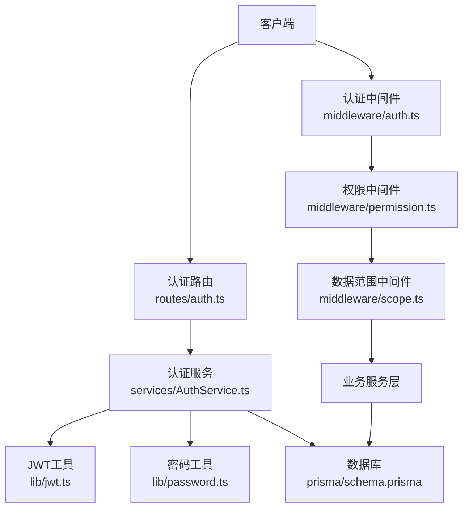
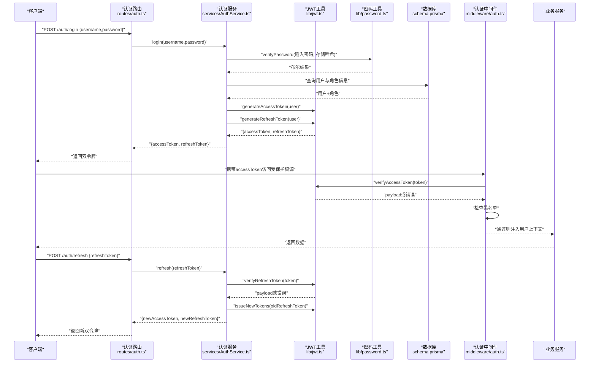
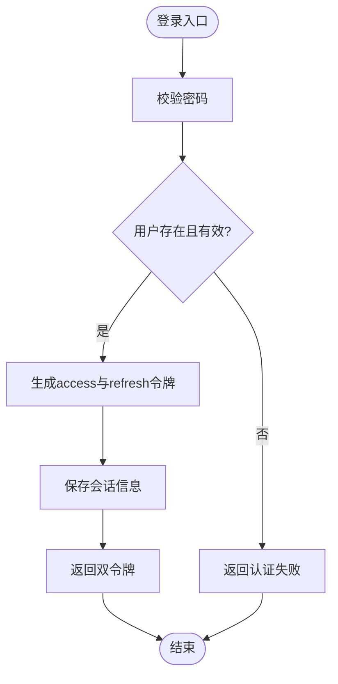
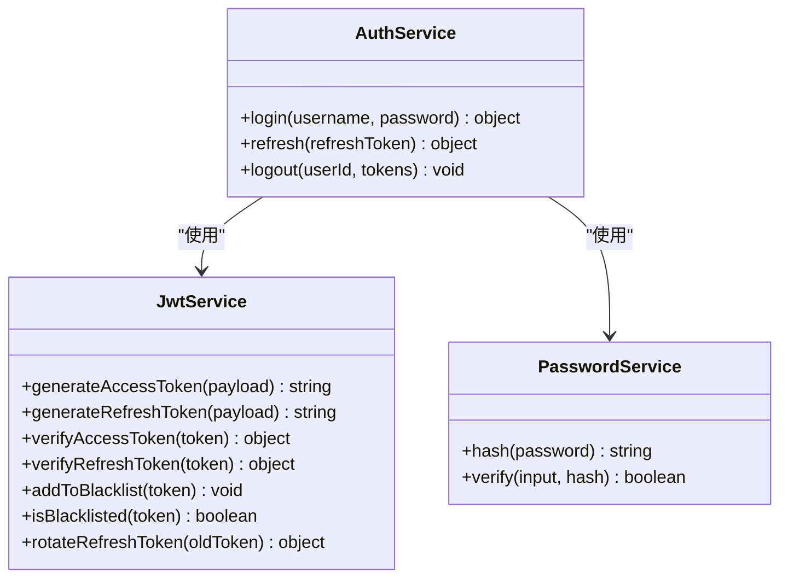
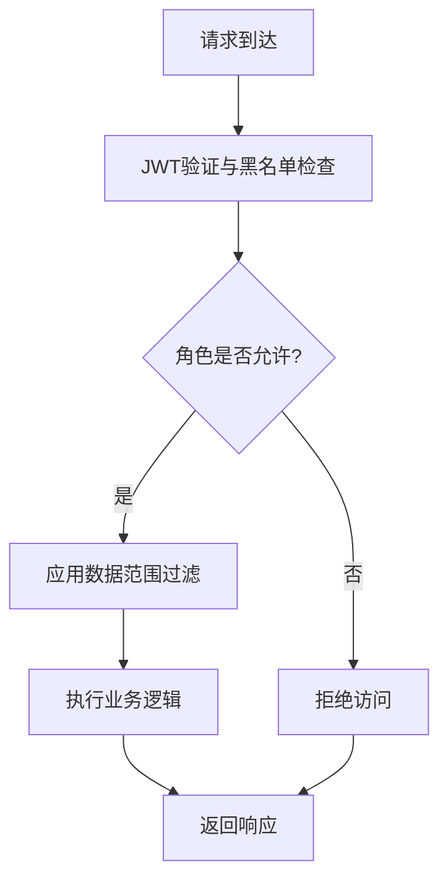
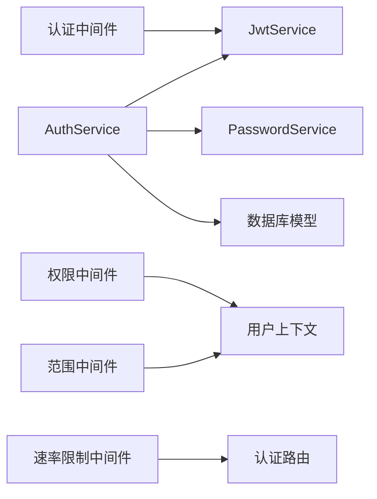

# 认证服务

<cite>
**本文引用的文件**   
- [server/src/services/AuthService.ts](file://server/src/services/AuthService.ts)
- [server/src/middleware/auth.ts](file://server/src/middleware/auth.ts)
- [server/src/lib/jwt.ts](file://server/src/lib/jwt.ts)
- [server/src/lib/password.ts](file://server/src/lib/password.ts)
- [server/src/routes/auth.ts](file://server/src/routes/auth.ts)
- [server/src/middleware/permission.ts](file://server/src/middleware/permission.ts)
- [server/src/middleware/scope.ts](file://server/src/middleware/scope.ts)
- [server/src/middleware/rate-limit.ts](file://server/src/middleware/rate-limit.ts)
- [server/src/config/env.ts](file://server/src/config/env.ts)
- [server/src/lib/errors.ts](file://server/src/lib/errors.ts)
- [server/src/lib/response.ts](file://server/src/lib/response.ts)
- [server/prisma/schema.prisma](file://server/prisma/schema.prisma)
</cite>

## 目录
1. [简介](#简介)
2. [项目结构](#项目结构)
3. [核心组件](#核心组件)
4. [架构总览](#架构总览)
5. [详细组件分析](#详细组件分析)
6. [依赖关系分析](#依赖关系分析)
7. [性能考虑](#性能考虑)
8. [故障排查指南](#故障排查指南)
9. [结论](#结论)
10. [附录](#附录)

## 简介
本文件面向FY200认证服务的实现与使用，聚焦AuthService类、JWT双令牌机制（access token 15分钟 + refresh token 7天轮转）、密码加密存储与会话管理。文档同时覆盖权限校验流程、角色管理与数据范围控制，提供认证中间件的配置与使用示例，并总结安全最佳实践（密码策略、令牌安全、防暴力破解等）。

## 项目结构
后端采用Express 4 + Prisma 5 + PostgreSQL 15，认证相关代码主要分布在services、middleware、lib、routes与config目录：
- services/AuthService.ts：认证业务逻辑（登录、签发令牌、刷新令牌、黑名单管理）
- middleware/auth.ts：请求级认证中间件（解析JWT、黑名单检查、注入用户上下文）
- lib/jwt.ts：JWT生成、验证、刷新与黑名单工具
- lib/password.ts：密码哈希与校验
- routes/auth.ts：认证路由（登录、刷新、登出）
- middleware/permission.ts：基于角色的权限校验
- middleware/scope.ts：基于Prisma扩展的数据范围控制
- middleware/rate-limit.ts：速率限制（防暴力破解）
- config/env.ts：环境变量（JWT密钥、过期时间、限流阈值等）
- prisma/schema.prisma：用户、角色、会话等数据模型定义

图表来源
- [server/src/routes/auth.ts](file://server/src/routes/auth.ts)
- [server/src/services/AuthService.ts](file://server/src/services/AuthService.ts)
- [server/src/lib/jwt.ts](file://server/src/lib/jwt.ts)
- [server/src/lib/password.ts](file://server/src/lib/password.ts)
- [server/src/middleware/auth.ts](file://server/src/middleware/auth.ts)
- [server/src/middleware/permission.ts](file://server/src/middleware/permission.ts)
- [server/src/middleware/scope.ts](file://server/src/middleware/scope.ts)
- [server/prisma/schema.prisma](file://server/prisma/schema.prisma)

章节来源
- [server/src/services/AuthService.ts](file://server/src/services/AuthService.ts)
- [server/src/middleware/auth.ts](file://server/src/middleware/auth.ts)
- [server/src/lib/jwt.ts](file://server/src/lib/jwt.ts)
- [server/src/lib/password.ts](file://server/src/lib/password.ts)
- [server/src/routes/auth.ts](file://server/src/routes/auth.ts)
- [server/src/middleware/permission.ts](file://server/src/middleware/permission.ts)
- [server/src/middleware/scope.ts](file://server/src/middleware/scope.ts)
- [server/src/middleware/rate-limit.ts](file://server/src/middleware/rate-limit.ts)
- [server/src/config/env.ts](file://server/src/config/env.ts)
- [server/prisma/schema.prisma](file://server/prisma/schema.prisma)

## 核心组件
- AuthService：封装登录、签发双令牌、刷新令牌、登出（加入黑名单）、会话管理等核心能力。
- JWT工具：负责access token与refresh token的生成、验证、续期与黑名单判断。
- 密码工具：基于强哈希算法进行密码加密存储与校验。
- 认证中间件：在请求进入业务前完成JWT解析、黑名单检查、用户上下文注入。
- 权限与范围中间件：按角色授权与数据范围过滤，确保最小权限原则。
- 速率限制：对登录与刷新接口实施限流，防止暴力破解。

章节来源
- [server/src/services/AuthService.ts](file://server/src/services/AuthService.ts)
- [server/src/lib/jwt.ts](file://server/src/lib/jwt.ts)
- [server/src/lib/password.ts](file://server/src/lib/password.ts)
- [server/src/middleware/auth.ts](file://server/src/middleware/auth.ts)
- [server/src/middleware/permission.ts](file://server/src/middleware/permission.ts)
- [server/src/middleware/scope.ts](file://server/src/middleware/scope.ts)
- [server/src/middleware/rate-limit.ts](file://server/src/middleware/rate-limit.ts)

## 架构总览
认证链路遵循“先鉴权后授权”的原则，结合双令牌与黑名单机制保障安全性与可用性。

图表来源
- [server/src/routes/auth.ts](file://server/src/routes/auth.ts)
- [server/src/services/AuthService.ts](file://server/src/services/AuthService.ts)
- [server/src/lib/jwt.ts](file://server/src/lib/jwt.ts)
- [server/src/lib/password.ts](file://server/src/lib/password.ts)
- [server/src/middleware/auth.ts](file://server/src/middleware/auth.ts)
- [server/prisma/schema.prisma](file://server/prisma/schema.prisma)

## 详细组件分析

### AuthService类
职责：
- 用户登录验证：校验用户名与密码，查询用户与角色信息。
- 签发双令牌：生成短生命周期access token（15分钟）与长生命周期refresh token（7天）。
- 刷新令牌：验证旧refresh token，签发新的access与refresh token，支持轮转。
- 黑名单管理：登出时将token加入黑名单，阻止后续使用。
- 会话管理：维护用户会话状态（如最近登录时间、设备信息等），便于审计与风控。

关键流程：
- 登录：密码校验 → 用户与角色查询 → 签发双令牌 → 记录会话。
- 刷新：验证refresh token → 生成新双令牌 → 更新会话。
- 登出：将当前access token与refresh token加入黑名单 → 清理会话。

图表来源
- [server/src/services/AuthService.ts](file://server/src/services/AuthService.ts)
- [server/src/lib/password.ts](file://server/src/lib/password.ts)
- [server/src/lib/jwt.ts](file://server/src/lib/jwt.ts)

章节来源
- [server/src/services/AuthService.ts](file://server/src/services/AuthService.ts)
- [server/src/lib/password.ts](file://server/src/lib/password.ts)
- [server/src/lib/jwt.ts](file://server/src/lib/jwt.ts)

### JWT双令牌机制（access 15min + refresh 7day 轮转）
- access token：短期有效（15分钟），用于API调用鉴权，无状态或轻量状态。
- refresh token：长期有效（7天），用于换取新的access token；每次刷新可轮转，提升安全性。
- 黑名单：登出或异常时，将token加入黑名单，服务端拒绝后续请求。
- 验证流程：
  - access token：解析签名、校验过期、检查黑名单。
  - refresh token：解析签名、校验过期、检查黑名单、执行轮转策略。

图表来源
- [server/src/lib/jwt.ts](file://server/src/lib/jwt.ts)
- [server/src/services/AuthService.ts](file://server/src/services/AuthService.ts)
- [server/src/lib/password.ts](file://server/src/lib/password.ts)

章节来源
- [server/src/lib/jwt.ts](file://server/src/lib/jwt.ts)
- [server/src/services/AuthService.ts](file://server/src/services/AuthService.ts)

### 密码加密存储与会话管理
- 密码策略：
  - 使用强哈希算法（如bcrypt/scrypt）进行存储。
  - 禁止明文存储与弱哈希。
  - 建议前端二次加盐或传输层TLS保护。
- 会话管理：
  - 记录用户最近登录时间、设备指纹、IP地址等。
  - 支持会话失效策略（如长时间不活跃自动登出）。
  - 与黑名单联动，登出即失效。

章节来源
- [server/src/lib/password.ts](file://server/src/lib/password.ts)
- [server/src/services/AuthService.ts](file://server/src/services/AuthService.ts)

### 权限校验流程、角色管理与数据范围控制
- 权限校验：
  - 默认拒绝策略：未显式授权的接口拒绝访问。
  - 基于角色的访问控制（RBAC）：用户角色决定可访问的资源与操作。
- 数据范围控制：
  - 通过Prisma扩展在查询层注入数据范围（如公司、部门、项目维度）。
  - 确保用户只能访问其范围内的数据。

图表来源
- [server/src/middleware/auth.ts](file://server/src/middleware/auth.ts)
- [server/src/middleware/permission.ts](file://server/src/middleware/permission.ts)
- [server/src/middleware/scope.ts](file://server/src/middleware/scope.ts)

章节来源
- [server/src/middleware/permission.ts](file://server/src/middleware/permission.ts)
- [server/src/middleware/scope.ts](file://server/src/middleware/scope.ts)

### 认证中间件的配置与使用
- 中间件链顺序：helmet → cors → express.json → rate-limit → auth → permission → scope → softDelete → audit → Service → Prisma → PostgreSQL。
- 配置要点：
  - 启用rate-limit对登录与刷新接口限流。
  - 在受保护路由前挂载auth中间件。
  - 根据接口需求挂载permission与scope中间件。
- 使用示例：
  - 登录路由无需鉴权。
  - 数据查询路由需鉴权与权限校验。
  - 敏感操作需额外范围控制。

章节来源
- [server/src/middleware/auth.ts](file://server/src/middleware/auth.ts)
- [server/src/middleware/rate-limit.ts](file://server/src/middleware/rate-limit.ts)
- [server/src/middleware/permission.ts](file://server/src/middleware/permission.ts)
- [server/src/middleware/scope.ts](file://server/src/middleware/scope.ts)

## 依赖关系分析
- AuthService依赖JwtService与PasswordService，间接依赖数据库模型。
- 认证中间件依赖JwtService进行令牌验证与黑名单检查。
- 权限与范围中间件依赖用户上下文（由认证中间件注入）。
- 速率限制中间件独立于认证，但影响认证接口可用性。

图表来源
- [server/src/services/AuthService.ts](file://server/src/services/AuthService.ts)
- [server/src/lib/jwt.ts](file://server/src/lib/jwt.ts)
- [server/src/lib/password.ts](file://server/src/lib/password.ts)
- [server/src/middleware/auth.ts](file://server/src/middleware/auth.ts)
- [server/src/middleware/permission.ts](file://server/src/middleware/permission.ts)
- [server/src/middleware/scope.ts](file://server/src/middleware/scope.ts)
- [server/src/middleware/rate-limit.ts](file://server/src/middleware/rate-limit.ts)
- [server/prisma/schema.prisma](file://server/prisma/schema.prisma)

章节来源
- [server/src/services/AuthService.ts](file://server/src/services/AuthService.ts)
- [server/src/lib/jwt.ts](file://server/src/lib/jwt.ts)
- [server/src/lib/password.ts](file://server/src/lib/password.ts)
- [server/src/middleware/auth.ts](file://server/src/middleware/auth.ts)
- [server/src/middleware/permission.ts](file://server/src/middleware/permission.ts)
- [server/src/middleware/scope.ts](file://server/src/middleware/scope.ts)
- [server/src/middleware/rate-limit.ts](file://server/src/middleware/rate-limit.ts)
- [server/prisma/schema.prisma](file://server/prisma/schema.prisma)

## 性能考虑
- JWT验证为无状态操作，避免频繁数据库查询。
- 黑名单存储建议使用高性能键值存储（如Redis）以提升查询效率。
- 密码哈希计算开销较大，应合理设置工作因子，平衡安全与性能。
- 会话信息缓存化，减少数据库压力。
- 限流策略应避免误伤正常用户，动态调整阈值。

[本节为通用指导，不直接分析具体文件]

## 故障排查指南
常见问题与处理：
- 登录失败：检查密码哈希是否正确、用户是否存在、账户是否被禁用。
- 令牌无效：检查签名、过期时间、黑名单状态。
- 刷新失败：确认refresh token未被吊销、未过期。
- 权限拒绝：检查用户角色与接口权限配置。
- 数据范围不符：确认用户上下文中的范围参数是否正确注入。

调试建议：
- 启用详细日志记录认证流程。
- 使用测试用例覆盖边界场景（如空令牌、恶意载荷）。
- 监控黑名单大小与增长趋势，定期清理。

章节来源
- [server/src/lib/errors.ts](file://server/src/lib/errors.ts)
- [server/src/lib/response.ts](file://server/src/lib/response.ts)
- [server/src/services/AuthService.ts](file://server/src/services/AuthService.ts)
- [server/src/lib/jwt.ts](file://server/src/lib/jwt.ts)

## 结论
FY200认证服务通过AuthService与JWT双令牌机制实现了安全、可扩展的认证体系。结合密码加密、会话管理、权限校验与数据范围控制，满足内部管理系统的安全需求。建议持续优化黑名单存储、限流策略与监控告警，进一步提升系统健壮性与用户体验。

[本节为总结性内容，不直接分析具体文件]

## 附录
- 环境变量参考：
  - JWT_SECRET：JWT签名密钥
  - ACCESS_TOKEN_EXPIRES：access token过期时间（分钟）
  - REFRESH_TOKEN_EXPIRES：refresh token过期时间（天）
  - RATE_LIMIT_WINDOW：限流窗口（秒）
  - RATE_LIMIT_MAX：最大请求数
- 安全最佳实践：
  - 强制HTTPS传输。
  - 定期轮换JWT密钥。
  - 实施密码复杂度策略与历史密码检查。
  - 对登录与刷新接口实施严格限流与验证码。
  - 最小权限原则与定期权限审计。

[本节为补充信息，不直接分析具体文件]