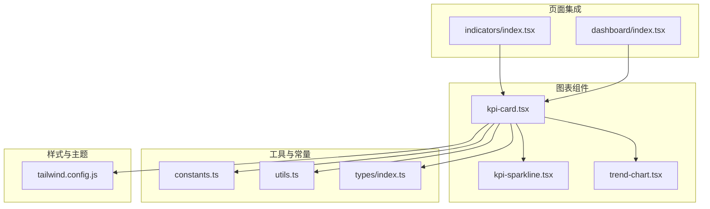
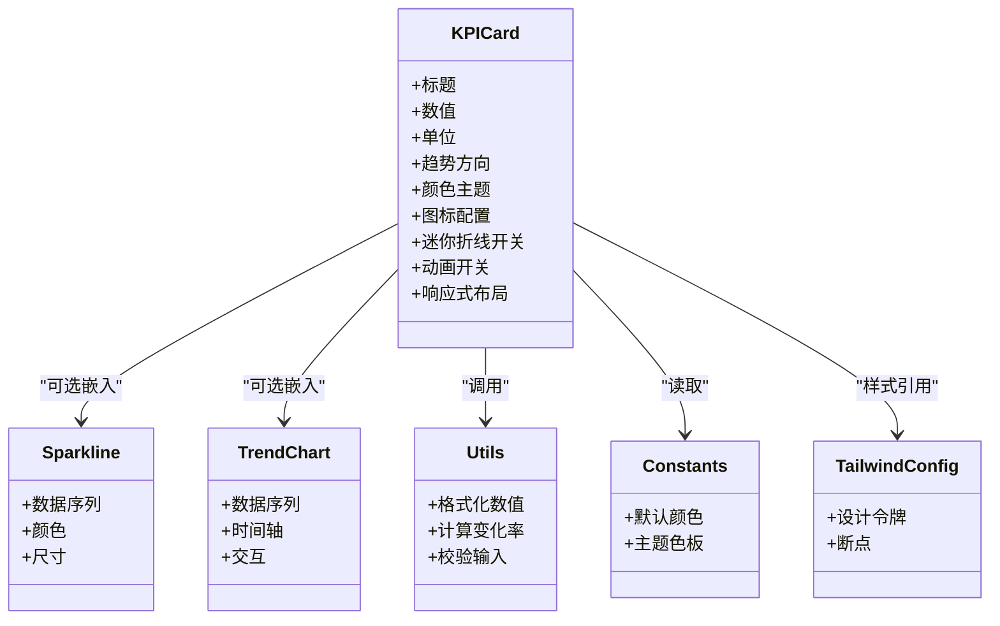
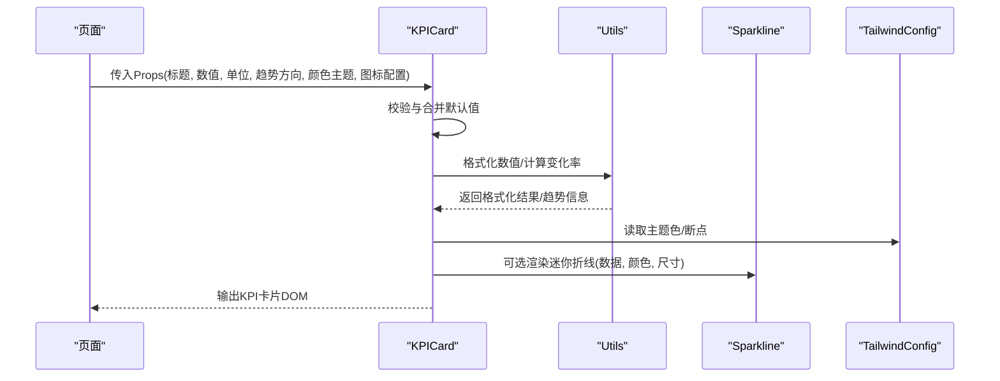
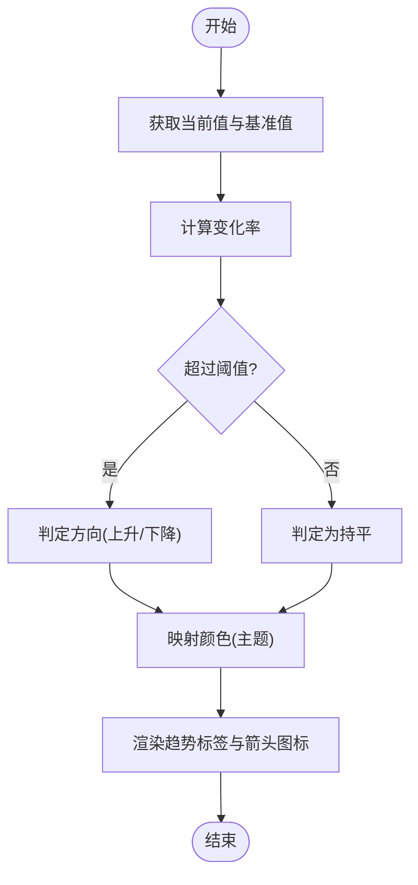
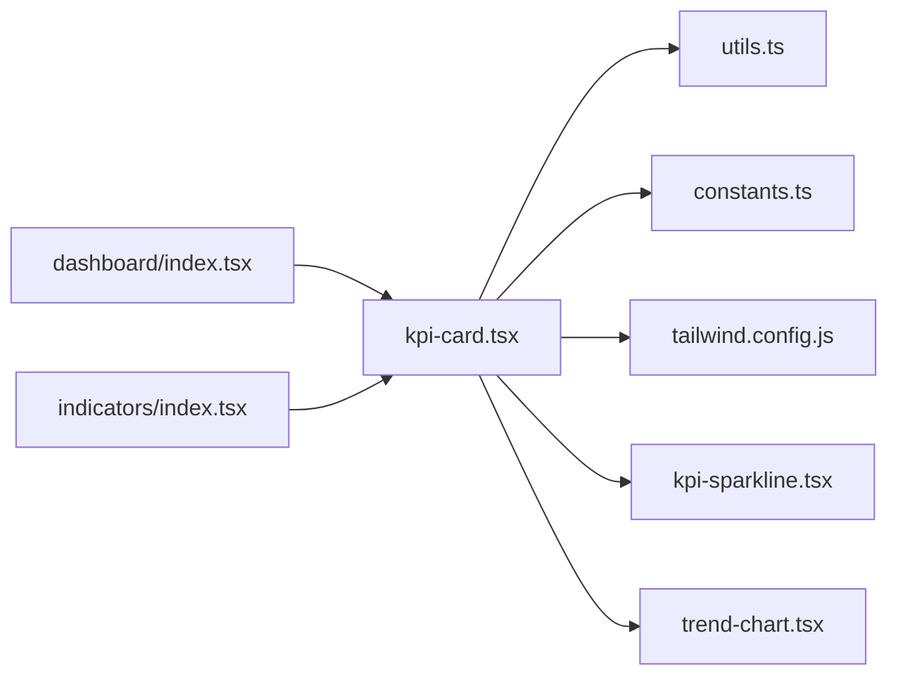

# KPI指标卡片组件

<cite>
**本文引用的文件**   
- [kpi-card.tsx](file://web/src/components/charts/kpi-card.tsx)
- [kpi-sparkline.tsx](file://web/src/components/charts/kpi-sparkline.tsx)
- [trend-chart.tsx](file://web/src/components/charts/trend-chart.tsx)
- [dashboard/index.tsx](file://web/src/pages/dashboard/index.tsx)
- [indicators/index.tsx](file://web/src/pages/indicators/index.tsx)
- [constants.ts](file://web/src/lib/constants.ts)
- [utils.ts](file://web/src/lib/utils.ts)
- [tailwind.config.js](file://web/tailwind.config.js)
- [index.ts](file://web/src/types/index.ts)
- [kpi-card.test.tsx](file://web/src/components/charts/__tests__/kpi-card.test.tsx)
</cite>

## 更新摘要
**变更内容**   
- **达成率阈值调整**：从原来的95/85调整为75/60，提供更合理的性能级别反馈
- **视觉表示优化**：使用箭头方向（ArrowUpRight、ArrowDownRight、Minus）替代数字前缀，提供更清晰的趋势指示
- **颜色编码系统改进**：三档红绿灯体系（≥75绿/60-75黄/<60红），增强视觉辨识度
- **数值展示逻辑完善**：同比变化不再显示"+"前缀，通过箭头图标表达方向

## 目录
1. [简介](#简介)
2. [项目结构](#项目结构)
3. [核心组件](#核心组件)
4. [架构总览](#架构总览)
5. [详细组件分析](#详细组件分析)
6. [依赖关系分析](#依赖关系分析)
7. [性能考虑](#性能考虑)
8. [故障排查指南](#故障排查指南)
9. [结论](#结论)
10. [附录](#附录)

## 简介
本文件面向KPI指标卡片组件，系统性阐述其实现架构与使用方式。内容覆盖数值展示逻辑、趋势指示器、颜色编码系统、图标配置、Props接口定义、响应式适配与动画效果、主题定制与样式覆盖、以及性能优化建议与最佳实践。文档同时提供不同场景（增长、下降、中性）的示例说明，帮助读者快速掌握组件能力并落地到业务页面中。

**更新** 本次更新重点反映了达成率阈值的重大调整和视觉表示方式的优化，使KPI卡片的性能反馈更加直观和准确。

## 项目结构
KPI指标卡片位于图表组件目录下，并与页面层进行集成：
- 图表组件
  - kpi-card.tsx：KPI卡片主组件，负责数值、单位、标题、趋势方向、颜色主题、图标等渲染与交互
  - kpi-sparkline.tsx：迷你折线（火花图），用于展示短期趋势
  - trend-chart.tsx：趋势图表，用于更丰富的趋势可视化
- 页面集成
  - dashboard/index.tsx：仪表盘页面，演示KPI卡片的组合使用
  - indicators/index.tsx：指标页面，展示不同类型指标的卡片布局
- 工具与常量
  - constants.ts：全局常量（如默认颜色、主题色板等）
  - utils.ts：通用工具函数（格式化、计算等）
- 样式与主题
  - tailwind.config.js：Tailwind配置，包含主题色与扩展变量

**图示来源**
- [kpi-card.tsx](file://web/src/components/charts/kpi-card.tsx)
- [kpi-sparkline.tsx](file://web/src/components/charts/kpi-sparkline.tsx)
- [trend-chart.tsx](file://web/src/components/charts/trend-chart.tsx)
- [dashboard/index.tsx](file://web/src/pages/dashboard/index.tsx)
- [indicators/index.tsx](file://web/src/pages/indicators/index.tsx)
- [constants.ts](file://web/src/lib/constants.ts)
- [utils.ts](file://web/src/lib/utils.ts)
- [index.ts](file://web/src/types/index.ts)
- [tailwind.config.js](file://web/tailwind.config.js)

## 核心组件
本节聚焦KPI指标卡片的核心能力与职责边界：
- 数值展示逻辑
  - 支持整数、小数、百分比、货币等格式；通过工具函数统一处理千分位、精度控制与单位拼接
  - 空值与异常值的降级显示策略（占位符或提示文案）
- 趋势指示器
  - 基于当前值与基准值（或上期值）计算变化率，自动判定上升/下降/持平
  - **更新** 使用箭头图标（ArrowUpRight、ArrowDownRight、Minus）替代数字前缀，提供更直观的视觉反馈
  - 可选迷你折线（sparkline）以增强趋势感知
- 颜色编码系统
  - **更新** 采用三档红绿灯体系：≥75%达标绿（持续关注）、60-75%预警黄（需改善计划）、<60%未达标红（须根因分析+专项整改）
  - 根据趋势方向映射语义化颜色（如上涨为正向色、下跌为负向色、持平为中性色）
  - 支持自定义主题色覆盖，兼容暗色模式
- 图标配置
  - 可配置图标类型（如箭头、涨跌符号、业务图标），支持大小与对齐调整
  - **更新** 趋势指示使用专业箭头图标，提升可读性
- 响应式与动画
  - 基于Tailwind的断点与弹性布局，适配多尺寸屏幕
  - 数值变化时的入场动画与过渡效果，提升可读性与体验

**章节来源**
- [kpi-card.tsx](file://web/src/components/charts/kpi-card.tsx)
- [kpi-sparkline.tsx](file://web/src/components/charts/kpi-sparkline.tsx)
- [trend-chart.tsx](file://web/src/components/charts/trend-chart.tsx)
- [utils.ts](file://web/src/lib/utils.ts)
- [index.ts](file://web/src/types/index.ts)
- [tailwind.config.js](file://web/tailwind.config.js)

## 架构总览
KPI卡片采用"展示层 + 工具层 + 主题层"的分层设计：
- 展示层：kpi-card.tsx负责UI结构与交互，聚合子组件（sparkline、trend-chart）
- 工具层：utils.ts提供格式化、计算、校验等能力；constants.ts提供默认常量
- 主题层：tailwind.config.js集中管理颜色、间距、圆角等设计令牌，供组件复用

**图示来源**
- [kpi-card.tsx](file://web/src/components/charts/kpi-card.tsx)
- [kpi-sparkline.tsx](file://web/src/components/charts/kpi-sparkline.tsx)
- [trend-chart.tsx](file://web/src/components/charts/trend-chart.tsx)
- [utils.ts](file://web/src/lib/utils.ts)
- [constants.ts](file://web/src/lib/constants.ts)
- [tailwind.config.js](file://web/tailwind.config.js)

## 详细组件分析

### KPI卡片主组件（kpi-card.tsx）
- 职责
  - 接收并校验Props，渲染标题、数值、单位、趋势标签、图标与可选迷你折线
  - 根据趋势方向与主题选择颜色，驱动动画与过渡
  - 将格式化后的数值与趋势信息传递给子组件
- 关键流程
  - 输入校验与默认值合并
  - 数值格式化与单位拼接
  - **更新** 趋势计算与颜色映射（基于新的75/60阈值）
  - 条件渲染迷你折线与趋势图表
  - 应用响应式类名与动画状态
- **重要更新** 达成率阈值从95/85调整为75/60，提供更合理的性能分级

**图示来源**
- [kpi-card.tsx](file://web/src/components/charts/kpi-card.tsx)
- [kpi-sparkline.tsx](file://web/src/components/charts/kpi-sparkline.tsx)
- [utils.ts](file://web/src/lib/utils.ts)
- [tailwind.config.js](file://web/tailwind.config.js)

**章节来源**
- [kpi-card.tsx](file://web/src/components/charts/kpi-card.tsx)
- [utils.ts](file://web/src/lib/utils.ts)
- [tailwind.config.js](file://web/tailwind.config.js)

### 迷你折线（kpi-sparkline.tsx）
- 职责
  - 在有限空间内展示短期趋势，强调方向与波动
  - 根据主题色动态设置线条与填充颜色
- 关键点
  - 数据序列长度与采样策略
  - 坐标缩放与自适应高度
  - 无障碍标签与键盘可达性

**章节来源**
- [kpi-sparkline.tsx](file://web/src/components/charts/kpi-sparkline.tsx)

### 趋势图表（trend-chart.tsx）
- 职责
  - 提供更丰富的趋势可视化（时间轴、交互、对比）
  - 作为KPI卡片的可选扩展模块
- 关键点
  - 数据聚合与时间粒度
  - 交互事件（悬停、点击）
  - 与主题系统的联动

**章节来源**
- [trend-chart.tsx](file://web/src/components/charts/trend-chart.tsx)

### 页面集成示例
- 仪表盘（dashboard/index.tsx）
  - 展示一组KPI卡片，体现网格布局与响应式适配
  - 演示增长、下降、中性三类指标的组合呈现
- 指标页（indicators/index.tsx）
  - 针对特定业务指标，细化单位、阈值与颜色语义

**章节来源**
- [dashboard/index.tsx](file://web/src/pages/dashboard/index.tsx)
- [indicators/index.tsx](file://web/src/pages/indicators/index.tsx)

### Props接口定义
以下为KPI卡片的主要配置项说明（字段名称与行为以实际实现为准）：
- 标题：字符串，卡片顶部展示的指标名称
- 数值：数字或字符串，支持多种格式输入
- 单位：字符串，附加在数值之后的单位文本（如%、元、次）
- 趋势方向：枚举或字符串，表示上升/下降/持平
- 颜色主题：字符串或对象，指定主题色或从主题系统获取
- 图标配置：对象，包含图标类型、大小、对齐等
- 迷你折线开关：布尔值，是否启用sparkline
- 动画开关：布尔值，是否启用数值变化动画
- 响应式布局：布尔值或配置对象，控制在不同断点下的布局行为
- 其他扩展：如阈值、目标值、辅助信息等

**章节来源**
- [kpi-card.tsx](file://web/src/components/charts/kpi-card.tsx)
- [index.ts](file://web/src/types/index.ts)

### 数值展示逻辑
- 输入校验
  - 非数字或空值时回退到占位符或提示信息
- 格式化规则
  - 千分位分隔、小数位数控制、百分比转换、货币符号
- 单位拼接
  - 按语言与区域设置拼接单位，避免重复或歧义
- 异常处理
  - 对NaN、Infinity、超大数等进行安全处理

**章节来源**
- [kpi-card.tsx](file://web/src/components/charts/kpi-card.tsx)
- [utils.ts](file://web/src/lib/utils.ts)

### 趋势指示器
- 计算逻辑
  - 基于当前值与基准值计算变化率，设定阈值区分显著变化与微小波动
- 方向判定
  - 正值为上升，负值为下降，接近零为持平
- **更新** 可视化方式
  - 使用专业箭头图标（ArrowUpRight、ArrowDownRight、Minus）替代数字前缀
  - 红色表示上涨（finance-red），绿色表示下跌（finance-green），灰色表示持平
  - 数值不再显示"+"前缀，通过箭头方向表达趋势
- 颜色映射
  - 基于新的75/60阈值体系，提供更准确的性能反馈

**图示来源**
- [kpi-card.tsx](file://web/src/components/charts/kpi-card.tsx)
- [utils.ts](file://web/src/lib/utils.ts)

**章节来源**
- [kpi-card.tsx](file://web/src/components/charts/kpi-card.tsx)
- [utils.ts](file://web/src/lib/utils.ts)

### 颜色编码系统
- **更新** 三档红绿灯体系
  - ≥75%：达标绿（text-success-strong）- 持续关注
  - 60-75%：预警黄（text-warning-strong）- 需改善计划  
  - <60%：未达标红（text-destructive）- 须根因分析+专项整改
  - null：无预算灰（text-muted-foreground）
- 语义化颜色
  - 上升：正向色（finance-red，符合A股习惯）
  - 下降：负向色（finance-green）
  - 持平：中性色（muted-foreground）
- 主题覆盖
  - 通过主题配置或props覆盖默认色板
  - 支持暗色模式下的对比度与可读性保障

**章节来源**
- [kpi-card.tsx](file://web/src/components/charts/kpi-card.tsx)
- [utils.ts](file://web/src/lib/utils.ts)
- [tailwind.config.js](file://web/tailwind.config.js)

### 图标配置
- **更新** 图标类型
  - 趋势指示：ArrowUpRight（上涨）、ArrowDownRight（下跌）、Minus（持平）
  - 业务图标：TrendingUp、DollarSign、Wallet、Banknote等
- 尺寸与对齐
  - 支持大小调节与相对对齐（左/右/居中）
- 无障碍
  - 提供aria-label与键盘可达性

**章节来源**
- [kpi-card.tsx](file://web/src/components/charts/kpi-card.tsx)

### 响应式设计适配
- 断点与布局
  - 基于Tailwind断点，在小屏下堆叠、在大屏下网格排列
- 字号与间距
  - 随屏幕尺寸动态调整，保证可读性与视觉层次
- 容器自适应
  - 卡片宽度与高度按比例缩放，保持比例与留白

**章节来源**
- [kpi-card.tsx](file://web/src/components/charts/kpi-card.tsx)
- [tailwind.config.js](file://web/tailwind.config.js)

### 动画效果实现
- 入场动画
  - 数值加载时的淡入与位移
- 变化动画
  - 数值更新时的过渡效果，避免突兀跳变
- 性能优化
  - 使用CSS过渡与GPU加速，减少重排与重绘

**章节来源**
- [kpi-card.tsx](file://web/src/components/charts/kpi-card.tsx)

### 使用示例（增长、下降、中性）
- **更新** 增长指标
  - 趋势方向为正，颜色映射为finance-red，图标为ArrowUpRight
  - 数值显示不带"+"前缀，通过箭头表达上涨趋势
- 下降指标
  - 趋势方向为负，颜色映射为finance-green，图标为ArrowDownRight
- 中性指标
  - 趋势方向为持平，颜色映射为muted-foreground，图标为Minus

**章节来源**
- [dashboard/index.tsx](file://web/src/pages/dashboard/index.tsx)
- [indicators/index.tsx](file://web/src/pages/indicators/index.tsx)
- [kpi-card.test.tsx](file://web/src/components/charts/__tests__/kpi-card.test.tsx)

### 自定义样式覆盖与主题定制
- 覆盖策略
  - 通过Tailwind配置扩展设计令牌（颜色、圆角、阴影）
  - 在组件外部注入CSS变量或类名，覆盖默认样式
- 主题切换
  - 基于主题对象或CSS变量实现亮/暗模式切换
- 最佳实践
  - 保持语义化命名，避免过度耦合具体样式

**章节来源**
- [tailwind.config.js](file://web/tailwind.config.js)
- [kpi-card.tsx](file://web/src/components/charts/kpi-card.tsx)

## 依赖关系分析
KPI卡片与其依赖的关系如下：
- 直接依赖
  - utils.ts：格式化与计算
  - constants.ts：默认常量与色板
  - tailwind.config.js：主题与断点
- 间接依赖
  - sparkline与trend-chart：可选子组件
  - 页面层：dashboard与indicators

**图示来源**
- [kpi-card.tsx](file://web/src/components/charts/kpi-card.tsx)
- [kpi-sparkline.tsx](file://web/src/components/charts/kpi-sparkline.tsx)
- [trend-chart.tsx](file://web/src/components/charts/trend-chart.tsx)
- [utils.ts](file://web/src/lib/utils.ts)
- [constants.ts](file://web/src/lib/constants.ts)
- [tailwind.config.js](file://web/tailwind.config.js)
- [dashboard/index.tsx](file://web/src/pages/dashboard/index.tsx)
- [indicators/index.tsx](file://web/src/pages/indicators/index.tsx)

## 性能考虑
- 数值计算与格式化
  - 缓存计算结果，避免频繁重算
  - 批量更新时使用防抖/节流
- 渲染优化
  - 条件渲染sparkline与trend-chart，按需加载
  - 使用CSS过渡而非JS动画，降低主线程压力
- 内存与体积
  - 避免在组件内创建大对象或闭包
  - 图片与图标资源懒加载与压缩

## 故障排查指南
- 数值显示异常
  - 检查输入是否为有效数字或字符串，确认格式化函数返回值
  - 查看空值与异常值的降级逻辑
- 趋势方向错误
  - 核对基准值与当前值的来源与一致性
  - **更新** 检查新的75/60阈值设置与方向判定逻辑
- 颜色主题未生效
  - 确认主题配置是否正确引入
  - 检查props覆盖优先级与Tailwind类名冲突
- 动画卡顿
  - 评估动画复杂度与触发频率
  - 优先使用CSS过渡与硬件加速

**章节来源**
- [kpi-card.tsx](file://web/src/components/charts/kpi-card.tsx)
- [utils.ts](file://web/src/lib/utils.ts)
- [tailwind.config.js](file://web/tailwind.config.js)

## 结论
KPI指标卡片通过清晰的职责划分与模块化设计，实现了数值展示、趋势指示、颜色编码与图标配置的完整能力。**更新** 本次变更重点优化了达成率阈值体系（从95/85调整为75/60）和视觉表示方式（使用箭头图标替代数字前缀），使性能反馈更加直观准确。借助工具层与主题层的支撑，组件具备良好的可扩展性与可定制性。在实际使用中，应关注输入校验、性能优化与无障碍体验，确保在不同设备与主题下的一致表现。

## 附录
- 术语表
  - 趋势方向：描述指标变化的方向（上升/下降/持平）
  - 颜色编码：将趋势方向映射为语义化颜色的机制
  - 迷你折线：在有限空间内展示短期趋势的轻量图表
  - **更新** 三档红绿灯：≥75%达标绿、60-75%预警黄、<60%未达标红的绩效分级体系
- 参考路径
  - 组件入口：kpi-card.tsx
  - 子组件：kpi-sparkline.tsx、trend-chart.tsx
  - 工具与常量：utils.ts、constants.ts
  - 主题配置：tailwind.config.js
  - 页面示例：dashboard/index.tsx、indicators/index.tsx
  - **新增** 类型定义：types/index.ts中的KpiData接口
  - **新增** 测试用例：kpi-card.test.tsx中的阈值验证

**章节来源**
- [kpi-card.tsx](file://web/src/components/charts/kpi-card.tsx)
- [kpi-sparkline.tsx](file://web/src/components/charts/kpi-sparkline.tsx)
- [trend-chart.tsx](file://web/src/components/charts/trend-chart.tsx)
- [utils.ts](file://web/src/lib/utils.ts)
- [constants.ts](file://web/src/lib/constants.ts)
- [tailwind.config.js](file://web/tailwind.config.js)
- [dashboard/index.tsx](file://web/src/pages/dashboard/index.tsx)
- [indicators/index.tsx](file://web/src/pages/indicators/index.tsx)
- [index.ts](file://web/src/types/index.ts)
- [kpi-card.test.tsx](file://web/src/components/charts/__tests__/kpi-card.test.tsx)