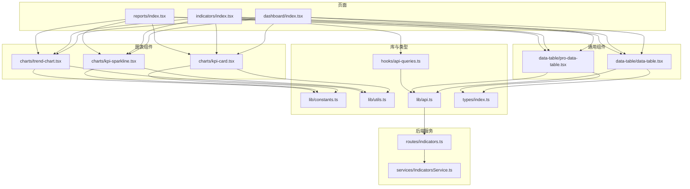
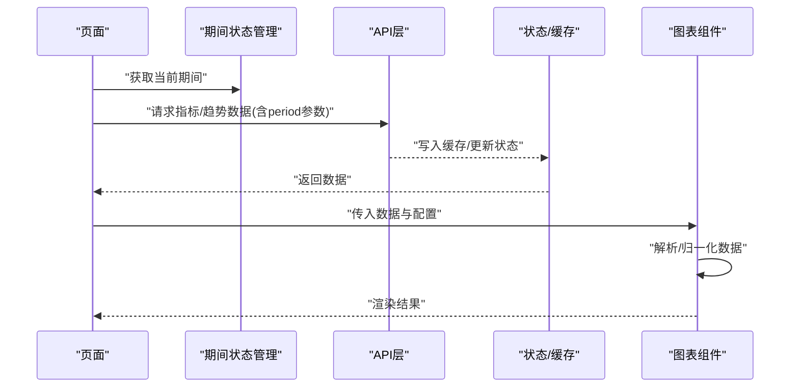
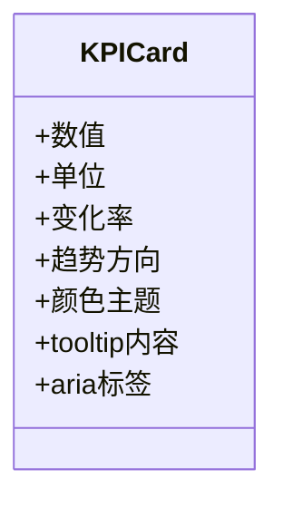
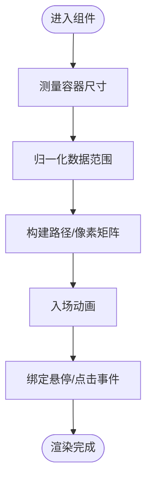
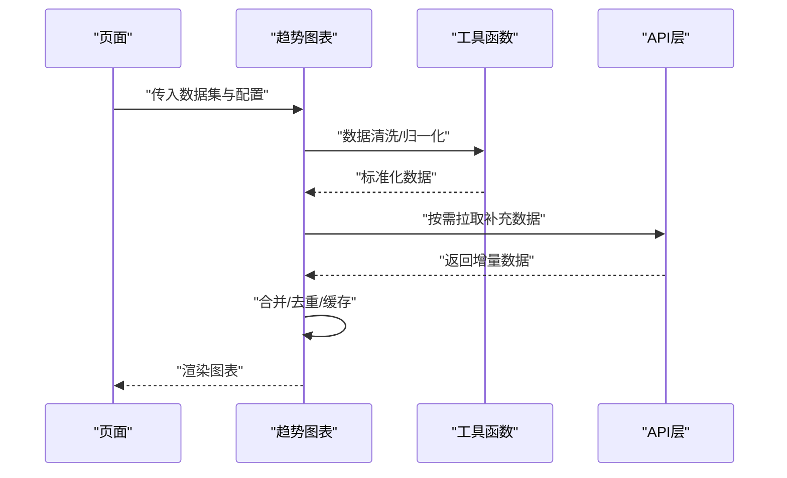
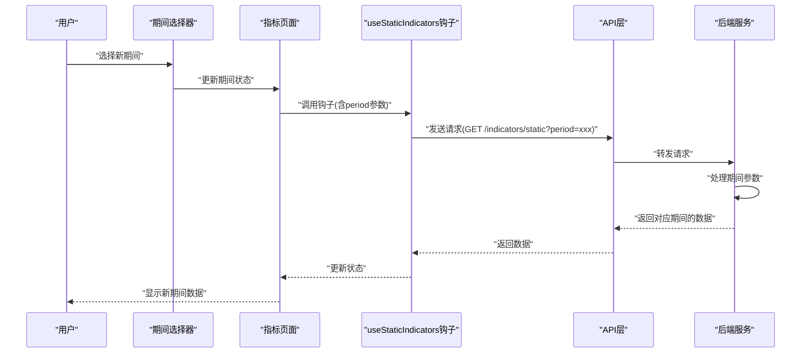
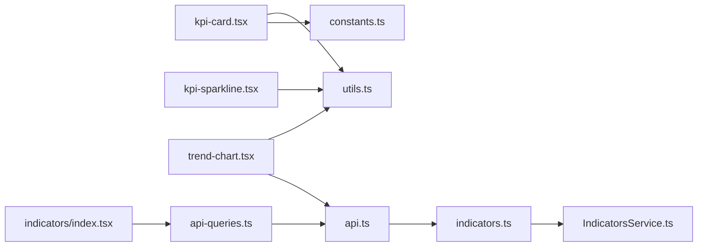

# 图表可视化

<cite>
**本文引用的文件**   
- [kpi-card.tsx](file://web/src/components/charts/kpi-card.tsx)
- [kpi-sparkline.tsx](file://web/src/components/charts/kpi-sparkline.tsx)
- [trend-chart.tsx](file://web/src/components/charts/trend-chart.tsx)
- [dashboard/index.tsx](file://web/src/pages/dashboard/index.tsx)
- [indicators/index.tsx](file://web/src/pages/indicators/index.tsx)
- [reports/index.tsx](file://web/src/pages/reports/index.tsx)
- [data-table.tsx](file://web/src/components/data-table/data-table.tsx)
- [pro-data-table.tsx](file://web/src/components/data-table/pro-data-table.tsx)
- [constants.ts](file://web/src/lib/constants.ts)
- [utils.ts](file://web/src/lib/utils.ts)
- [api.ts](file://web/src/lib/api.ts)
- [index.ts](file://web/src/types/index.ts)
- [api-queries.ts](file://web/src/hooks/api-queries.ts)
- [indicators.ts](file://server/src/routes/indicators.ts)
- [IndicatorsService.ts](file://server/src/services/IndicatorsService.ts)
</cite>

## 更新摘要
**所做更改**   
- 新增静态指标与全局期间选择器联动的详细说明
- 更新 useStaticIndicators 钩子的参数说明，包含 period 查询参数支持
- 更新 GET /indicators/static 端点的 API 文档，说明 period 参数处理逻辑
- 完善静态指标的期间选择机制和数据获取流程
- 增强图表组件的期间联动架构说明

## 目录
1. [简介](#简介)
2. [项目结构](#项目结构)
3. [核心组件](#核心组件)
4. [架构总览](#架构总览)
5. [详细组件分析](#详细组件分析)
6. [依赖关系分析](#依赖关系分析)
7. [性能考虑](#性能考虑)
8. [故障排查指南](#故障排查指南)
9. [结论](#结论)
10. [附录](#附录)

## 简介
本文件面向pj3项目的图表可视化模块，聚焦以下目标：
- KPI指标卡片的实现与视觉设计（数值展示、趋势指示、颜色编码）
- 趋势图表的架构（数据绑定、动画效果、交互响应）
- 迷你图表的设计模式（在有限空间内传达关键信息）
- 图表组件的配置系统（主题定制、响应式适配、性能优化）
- 常见图表类型的使用示例（折线图、柱状图、饼图等）
- **实时更新机制与缓存策略**
- **可访问性与国际化配置指南**
- **静态指标与全局期间选择器的联动机制**

## 项目结构
图表相关代码位于 web/src/components/charts 目录下，包含KPI卡片、迷你趋势线、趋势图表三个核心组件。页面层通过 dashboard、indicators、reports 等页面组合使用这些组件；数据与工具能力由 lib 与 types 提供支撑。**特别地，静态指标现在支持与全局期间选择器的期间联动，实现了前后端完整的期间参数传递和处理机制。**



**图示来源**
- [dashboard/index.tsx](file://web/src/pages/dashboard/index.tsx)
- [indicators/index.tsx](file://web/src/pages/indicators/index.tsx)
- [reports/index.tsx](file://web/src/pages/reports/index.tsx)
- [kpi-card.tsx](file://web/src/components/charts/kpi-card.tsx)
- [kpi-sparkline.tsx](file://web/src/components/charts/kpi-sparkline.tsx)
- [trend-chart.tsx](file://web/src/components/charts/trend-chart.tsx)
- [data-table.tsx](file://web/src/components/data-table/data-table.tsx)
- [pro-data-table.tsx](file://web/src/components/data-table/pro-data-table.tsx)
- [constants.ts](file://web/src/lib/constants.ts)
- [utils.ts](file://web/src/lib/utils.ts)
- [api.ts](file://web/src/lib/api.ts)
- [index.ts](file://web/src/types/index.ts)
- [api-queries.ts](file://web/src/hooks/api-queries.ts)
- [indicators.ts](file://server/src/routes/indicators.ts)
- [IndicatorsService.ts](file://server/src/services/IndicatorsService.ts)

## 核心组件
本节概述三大图表组件的职责与协作方式：
- KPI指标卡片：承载单一关键指标的数值、单位、同比/环比变化、趋势方向与颜色语义
- 迷你趋势线：在极小尺寸内呈现短期走势，强调方向与波动幅度
- 趋势图表：承载时间序列数据的完整视图，支持多系列、交互与动画

**新增** 静态指标组件现已支持期间联动，可与全局期间选择器无缝集成，提供一致的用户体验。

## 架构总览
图表模块采用"页面组合 + 组件化 + 数据驱动"的架构：
- 页面负责编排布局与数据获取
- 图表组件以props接收数据与配置，内部完成渲染与交互
- 公共常量与工具函数统一提供主题色、格式化、计算逻辑
- API层封装数据请求，供表格与图表复用
- **期间选择器与静态指标的深度集成，确保数据的一致性和实时性**



**图示来源**
- [api.ts](file://web/src/lib/api.ts)
- [kpi-card.tsx](file://web/src/components/charts/kpi-card.tsx)
- [kpi-sparkline.tsx](file://web/src/components/charts/kpi-sparkline.tsx)
- [trend-chart.tsx](file://web/src/components/charts/trend-chart.tsx)
- [api-queries.ts](file://web/src/hooks/api-queries.ts)

## 详细组件分析

### KPI指标卡片
- 数值展示
  - 主数值、单位、小数位控制
  - 大数字可读性优化（千分位、缩放）
- 趋势指示
  - 基于前后周期差值或百分比变化计算方向
  - 箭头/图标表示上升/下降/持平
- 颜色编码
  - 正向/负向/中性三态配色
  - 与全局主题色联动
- 交互与可访问性
  - 悬停提示显示详情（如构成项、口径说明）
  - aria-label、role、键盘可达



**图示来源**
- [kpi-card.tsx](file://web/src/components/charts/kpi-card.tsx)
- [constants.ts](file://web/src/lib/constants.ts)
- [utils.ts](file://web/src/lib/utils.ts)

### 迷你趋势线（Sparkline）
- 设计模式
  - 极简路径绘制，省略坐标轴与网格
  - 使用面积/线条混合表达趋势与体量
- 数据绑定
  - 将数组映射为SVG路径或Canvas像素
  - 自动裁剪到容器尺寸
- 动画与交互
  - 入场渐显、hover高亮
  - 点击跳转至趋势详情



**图示来源**
- [kpi-sparkline.tsx](file://web/src/components/charts/kpi-sparkline.tsx)
- [utils.ts](file://web/src/lib/utils.ts)

### 趋势图表
- 数据绑定机制
  - 时间轴对齐、缺失值插补、多系列聚合
  - 数据校验与异常点处理
- 动画效果
  - 过渡动效（淡入、滑入、缩放）
  - 增量更新时的局部重绘
- 交互响应
  - 十字准星、区域选择、缩放平移
  - 图例筛选、排序、导出
- 配置系统
  - 主题定制（颜色、字体、间距）
  - 响应式适配（断点、自适应字号）
  - 性能开关（降采样、懒加载、虚拟滚动）



**图示来源**
- [trend-chart.tsx](file://web/src/components/charts/trend-chart.tsx)
- [utils.ts](file://web/src/lib/utils.ts)
- [api.ts](file://web/src/lib/api.ts)

### 静态指标期间联动机制
**新增功能** 静态指标现已完全支持与全局期间选择器的联动：

- **useStaticIndicators 钩子增强**
  - 支持 `period` 查询参数传递
  - 与 `companyCode`、`excludeReclassify` 参数协同工作
  - 自动处理期间参数的序列化与反序列化

- **GET /indicators/static 端点升级**
  - 接受 `period` 查询参数
  - 当未指定期间时，自动回退到最新静态期间
  - 支持动态期间切换和缓存失效

- **期间选择器集成**
  - 全局期间状态管理与静态指标数据同步
  - 期间变化时自动触发数据重新获取
  - 保持用户体验的一致性和流畅性



**图示来源**
- [api-queries.ts](file://web/src/hooks/api-queries.ts)
- [indicators.ts](file://server/src/routes/indicators.ts)
- [IndicatorsService.ts](file://server/src/services/IndicatorsService.ts)

### 页面集成示例
- 仪表盘（Dashboard）
  - 顶部KPI卡片矩阵，底部趋势图表
  - 响应式栅格布局，移动端单列
- 指标页（Indicators）
  - 多维度指标对比，迷你趋势线辅助判断
  - **静态指标与期间选择器的深度集成**
- 报表页（Reports）
  - 复杂筛选条件，图表与表格联动

## 依赖关系分析
- 组件耦合
  - 图表组件仅依赖 utils 与 constants，保持低耦合
  - 页面层组合多个图表组件，形成松耦合编排
- 外部依赖
  - API层统一数据源，便于缓存与重试
  - 类型定义集中管理，保证数据结构一致性
- **期间联动依赖**
  - 期间状态管理与图表数据获取的解耦设计
  - React Query的状态管理和缓存策略



**图示来源**
- [kpi-card.tsx](file://web/src/components/charts/kpi-card.tsx)
- [kpi-sparkline.tsx](file://web/src/components/charts/kpi-sparkline.tsx)
- [trend-chart.tsx](file://web/src/components/charts/trend-chart.tsx)
- [utils.ts](file://web/src/lib/utils.ts)
- [constants.ts](file://web/src/lib/constants.ts)
- [api.ts](file://web/src/lib/api.ts)
- [dashboard/index.tsx](file://web/src/pages/dashboard/index.tsx)
- [api-queries.ts](file://web/src/hooks/api-queries.ts)
- [indicators.ts](file://server/src/routes/indicators.ts)
- [IndicatorsService.ts](file://server/src/services/IndicatorsService.ts)

## 性能考虑
- 数据层面
  - 对大数据集进行降采样与聚合，减少渲染压力
  - 增量更新避免全量重绘
  - **期间切换时的智能缓存和请求去抖**
- 渲染层面
  - 使用requestAnimationFrame批处理动画帧
  - 按需启用/禁用动画以提升首屏速度
- 内存层面
  - 及时释放事件监听与定时器
  - 大型图表组件卸载时清理资源
- 网络层面
  - 请求级缓存与失效策略
  - 失败重试与降级展示骨架屏
  - **期间参数变化的智能缓存键管理**

## 故障排查指南
- 数据为空或格式异常
  - 检查API返回结构与类型定义是否一致
  - 增加空值与越界值的容错分支
- 渲染错位或尺寸异常
  - 确认容器尺寸测量时机，必要时使用ResizeObserver
  - 检查响应式断点与样式覆盖
- 动画卡顿
  - 降低动画复杂度或关闭非关键动效
  - 拆分长列表与大数据集的渲染批次
- 交互无响应
  - 核对事件冒泡与阻止行为
  - 确保DOM挂载后再绑定交互
- **期间联动问题**
  - 检查期间参数是否正确传递到API请求
  - 验证React Query的缓存键生成逻辑
  - 确认期间状态更新的响应式依赖

## 结论
本模块通过清晰的组件边界与数据驱动模型，实现了KPI卡片、迷你趋势线与趋势图表的可复用与可扩展。**新增的静态指标期间联动功能进一步增强了系统的灵活性和用户体验**。配合统一的常量与工具函数，保证了主题一致性与维护效率。后续可在可访问性、国际化与更丰富的交互上持续增强。

## 附录

### 配置系统要点
- 主题定制
  - 通过常量集中管理色彩、字体、间距
  - 组件按主题键读取样式，支持动态切换
- 响应式适配
  - 基于容器宽度调整字号、边距、图例布局
  - 移动端优先的紧凑排版
- 性能优化
  - 提供开关控制动画、降采样、懒加载
  - 大数据场景下启用虚拟滚动与分页加载

### 常见图表类型使用示例
- 折线图
  - 适用场景：时间序列、多系列对比
  - 关键点：平滑曲线、交叉点标注、图例筛选
- 柱状图
  - 适用场景：分类对比、排名展示
  - 关键点：分组/堆叠、阈值线、排序
- 饼图/环形图
  - 适用场景：占比分析、构成拆解
  - 关键点：扇区标签、中心汇总、交互展开

### 实时更新与缓存策略
- 实时更新
  - 轮询/WebSocket推送触发增量更新
  - 组件内部合并新旧数据并局部重绘
- 缓存策略
  - 内存缓存+过期时间
  - 请求去抖与幂等键
  - 离线降级与骨架占位
  - **期间参数变化的智能缓存键管理**

### 可访问性与国际化
- 可访问性
  - 为图表元素添加语义化标签与描述
  - 支持键盘导航与屏幕阅读器朗读
  - 颜色对比度符合无障碍标准
- 国际化
  - 文本文案、单位、日期格式通过i18n键值管理
  - 图表标题、轴标签、提示信息本地化

### 静态指标期间联动API文档
**新增API规范**

- **useStaticIndicators 钩子参数**
  ```typescript
  interface StaticIndicatorsParams {
    companyCode?: string;      // 公司编码
    period?: string;           // 期间参数（新增）
    excludeReclassify?: boolean; // 是否排除重分类影响
  }
  ```

- **GET /indicators/static 端点**
  - 路径：`/api/v1/indicators/static`
  - 方法：GET
  - 查询参数：
    - `companyCode`: 公司编码（可选）
    - `period`: 期间参数（可选，格式：YYYY-MM）
    - `excludeReclassify`: 是否排除重分类影响（可选）
  - 响应：静态指标数据，包含期间信息和指标明细

- **期间处理逻辑**
  - 当 `period` 参数未提供时，自动使用最新的静态期间
  - 期间参数通过React Query的缓存键进行管理
  - 期间变化时自动触发数据刷新和缓存失效

**章节来源**
- [api-queries.ts](file://web/src/hooks/api-queries.ts)
- [indicators.ts](file://server/src/routes/indicators.ts)
- [IndicatorsService.ts](file://server/src/services/IndicatorsService.ts)
- [indicators/index.tsx](file://web/src/pages/indicators/index.tsx)