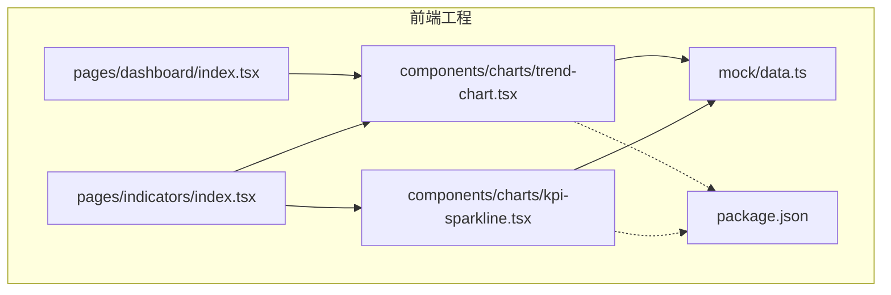
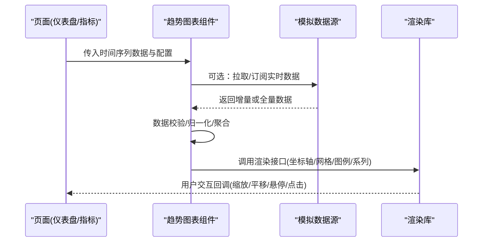
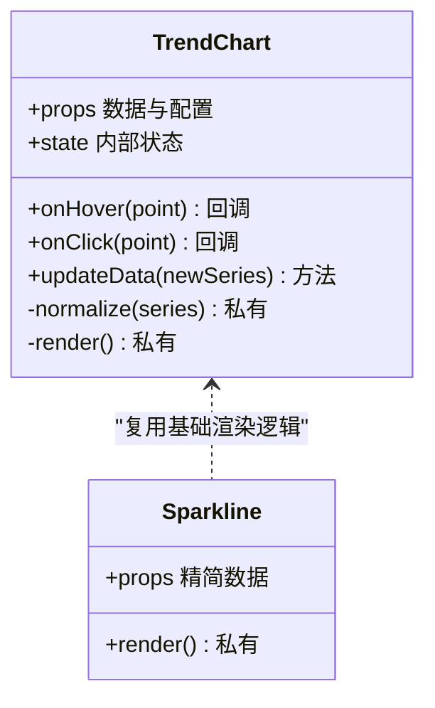
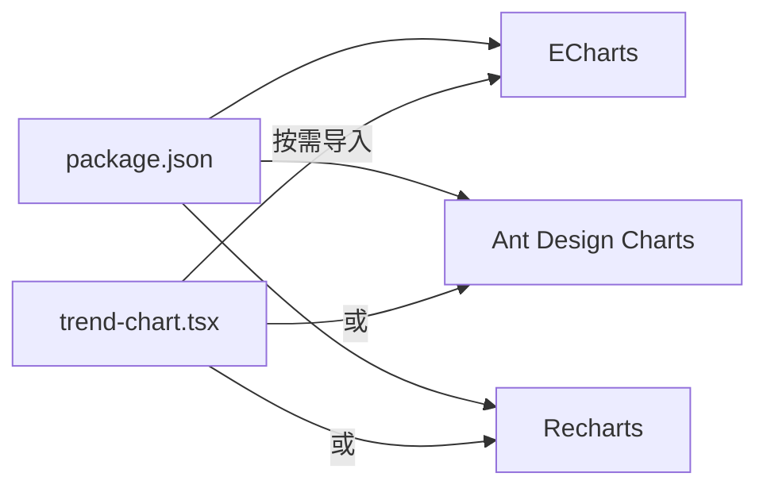

# 趋势图表组件

<cite>
**本文引用的文件**   
- [trend-chart.tsx](file://web/src/components/charts/trend-chart.tsx)
- [kpi-sparkline.tsx](file://web/src/components/charts/kpi-sparkline.tsx)
- [dashboard/index.tsx](file://web/src/pages/dashboard/index.tsx)
- [indicators/index.tsx](file://web/src/pages/indicators/index.tsx)
- [mock/data.ts](file://web/src/mock/data.ts)
- [package.json](file://web/package.json)
</cite>

## 目录
1. [简介](#简介)
2. [项目结构](#项目结构)
3. [核心组件](#核心组件)
4. [架构总览](#架构总览)
5. [详细组件分析](#详细组件分析)
6. [依赖分析](#依赖分析)
7. [性能考虑](#性能考虑)
8. [故障排查指南](#故障排查指南)
9. [结论](#结论)
10. [附录](#附录)

## 简介
本文件面向“趋势图表组件”的专业文档，聚焦以下目标：
- 数据绑定机制：时间序列数据处理、数据格式要求、实时更新支持
- 渲染引擎与视觉配置：坐标轴、网格线、图例等
- 交互能力：缩放、平移、悬停提示、点击事件
- 多图表类型：折线图、面积图、柱状图等
- 动画效果：配置与优化策略
- 响应式适配与多设备兼容

## 项目结构
仓库中与趋势图表相关的代码位于 web 前端工程内，核心实现集中在 components/charts 目录，页面级使用在 pages 下。

图示来源
- [trend-chart.tsx](file://web/src/components/charts/trend-chart.tsx)
- [kpi-sparkline.tsx](file://web/src/components/charts/kpi-sparkline.tsx)
- [dashboard/index.tsx](file://web/src/pages/dashboard/index.tsx)
- [indicators/index.tsx](file://web/src/pages/indicators/index.tsx)
- [mock/data.ts](file://web/src/mock/data.ts)
- [package.json](file://web/package.json)

章节来源
- [trend-chart.tsx](file://web/src/components/charts/trend-chart.tsx)
- [kpi-sparkline.tsx](file://web/src/components/charts/kpi-sparkline.tsx)
- [dashboard/index.tsx](file://web/src/pages/dashboard/index.tsx)
- [indicators/index.tsx](file://web/src/pages/indicators/index.tsx)
- [mock/data.ts](file://web/src/mock/data.ts)
- [package.json](file://web/package.json)

## 核心组件
- 趋势图表主组件：负责时间序列数据的接收、格式化、渲染与交互（缩放、平移、悬停、点击）
- KPI 迷你趋势组件：用于指标卡片的轻量趋势展示，侧重简洁与高性能

章节来源
- [trend-chart.tsx](file://web/src/components/charts/trend-chart.tsx)
- [kpi-sparkline.tsx](file://web/src/components/charts/kpi-sparkline.tsx)

## 架构总览
整体采用“页面容器 -> 图表组件 -> 渲染库”的分层模式。页面通过 props 或状态管理注入时间序列数据；图表组件完成数据清洗与映射；底层渲染库负责绘制与交互。

图示来源
- [dashboard/index.tsx](file://web/src/pages/dashboard/index.tsx)
- [indicators/index.tsx](file://web/src/pages/indicators/index.tsx)
- [trend-chart.tsx](file://web/src/components/charts/trend-chart.tsx)
- [kpi-sparkline.tsx](file://web/src/components/charts/kpi-sparkline.tsx)
- [mock/data.ts](file://web/src/mock/data.ts)

## 详细组件分析

### 趋势图表组件（折线/面积/柱状）
职责
- 接收并校验时间序列数据
- 将数据映射为渲染库所需的系列结构
- 配置坐标轴、网格线、图例、提示框、缩放与平移
- 处理悬停与点击事件回调
- 支持增量更新与动画过渡

数据绑定与格式
- 输入数据结构建议包含时间戳与数值字段，支持单系列或多系列
- 对缺失值进行插补或过滤策略
- 支持按时间窗口聚合（如分钟/小时/天）以控制点数规模

渲染与视觉
- 坐标轴：时间轴自动格式化，数值轴自适应范围
- 网格线：主/次网格可配置显示与样式
- 图例：多系列时启用，支持点击切换可见性
- 主题：明暗主题与品牌色定制

交互
- 缩放：鼠标滚轮或触控双指缩放
- 平移：拖拽平移时间窗口
- 悬停：十字准线与工具提示
- 点击：选中数据点触发回调

动画
- 首次渲染入场动画
- 增量更新平滑过渡
- 大数据集降级策略（减少帧率或关闭部分动画）

图示来源
- [trend-chart.tsx](file://web/src/components/charts/trend-chart.tsx)
- [kpi-sparkline.tsx](file://web/src/components/charts/kpi-sparkline.tsx)

章节来源
- [trend-chart.tsx](file://web/src/components/charts/trend-chart.tsx)

### KPI 迷你趋势组件
职责
- 在有限空间内展示关键指标的短期趋势
- 提供轻量级的悬停提示
- 针对小尺寸容器优化渲染性能

适用场景
- 指标卡片、概览面板、列表行内趋势

章节来源
- [kpi-sparkline.tsx](file://web/src/components/charts/kpi-sparkline.tsx)

### 页面集成示例
- 仪表盘页面：引入趋势图表组件，绑定业务时间序列数据，配置标题、图例、缩放与提示
- 指标页面：同时使用趋势图表与迷你趋势组件，展示宏观与微观视角

章节来源
- [dashboard/index.tsx](file://web/src/pages/dashboard/index.tsx)
- [indicators/index.tsx](file://web/src/pages/indicators/index.tsx)

### 数据源与模拟数据
- 生产环境通常对接后端 API 或 WebSocket 推送
- 开发阶段可使用本地模拟数据快速验证

章节来源
- [mock/data.ts](file://web/src/mock/data.ts)

## 依赖分析
趋势图表组件依赖第三方可视化库，具体版本与特性以包定义为准。

图示来源
- [package.json](file://web/package.json)
- [trend-chart.tsx](file://web/src/components/charts/trend-chart.tsx)

章节来源
- [package.json](file://web/package.json)

## 性能考虑
- 数据量控制：对长历史数据进行降采样或分片加载
- 增量更新：仅更新变化区间，避免整表重绘
- 动画降级：大数据集时关闭复杂动画或降低帧率
- 内存管理：及时销毁实例与解绑事件监听
- 渲染优化：开启硬件加速、合并批次更新

[本节为通用指导，不直接分析具体文件]

## 故障排查指南
常见问题与定位思路
- 数据为空或格式不符：检查时间戳与数值字段是否齐全，确认单位一致
- 坐标轴异常：核对时间格式与区域设置，必要时显式指定时间轴类型
- 交互无响应：确认容器尺寸非零且未被隐藏，检查事件冒泡与覆盖层
- 性能卡顿：观察数据点数量与动画开关，尝试降采样与关闭动画
- 主题不一致：检查全局主题变量与组件主题配置优先级

章节来源
- [trend-chart.tsx](file://web/src/components/charts/trend-chart.tsx)
- [kpi-sparkline.tsx](file://web/src/components/charts/kpi-sparkline.tsx)

## 结论
趋势图表组件围绕“数据—渲染—交互”的主线构建，具备灵活的数据绑定、丰富的视觉配置与完善的交互能力。结合合理的性能策略与响应式适配，可在多种设备与场景下稳定呈现高质量的趋势可视化体验。

[本节为总结性内容，不直接分析具体文件]

## 附录

### 数据格式规范（建议）
- 单系列
  - 字段：时间戳、数值
  - 时间戳：统一为毫秒时间戳或 ISO 字符串
  - 数值：数字类型，允许空值（需定义插补策略）
- 多系列
  - 字段：时间戳、多个数值键（每个键对应一个系列）
- 聚合粒度
  - 分钟/小时/天/周/月，由上层决定并在组件中应用

章节来源
- [mock/data.ts](file://web/src/mock/data.ts)

### 常见图表类型配置要点
- 折线图：启用平滑曲线、数据点标记、悬停提示
- 面积图：填充透明度、堆叠模式、基线设置
- 柱状图：分组/堆叠、颜色映射、标签显示

章节来源
- [trend-chart.tsx](file://web/src/components/charts/trend-chart.tsx)

### 动画与响应式
- 动画
  - 入场动画：缓动函数与时长可调
  - 增量更新：跨帧插值，保持视觉连贯
  - 大数据集：自动降级或手动关闭
- 响应式
  - 基于容器尺寸自适应布局
  - 移动端手势：双指缩放、长按提示
  - 高 DPI 屏幕：矢量渲染与像素密度适配

章节来源
- [trend-chart.tsx](file://web/src/components/charts/trend-chart.tsx)
- [kpi-sparkline.tsx](file://web/src/components/charts/kpi-sparkline.tsx)