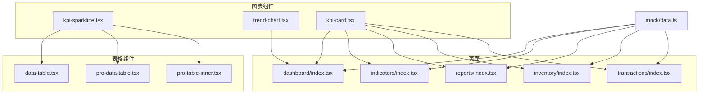
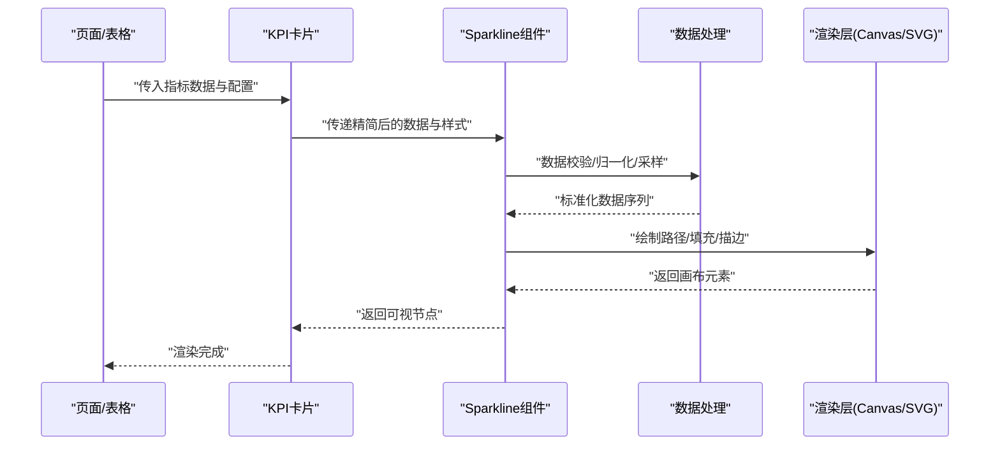
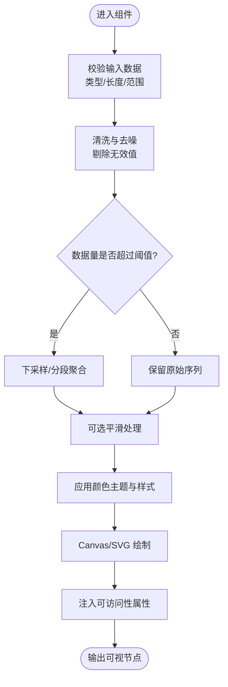
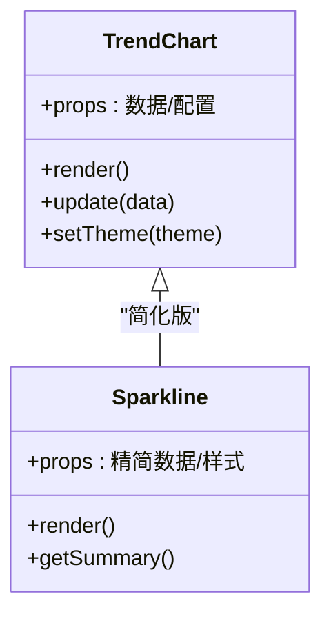
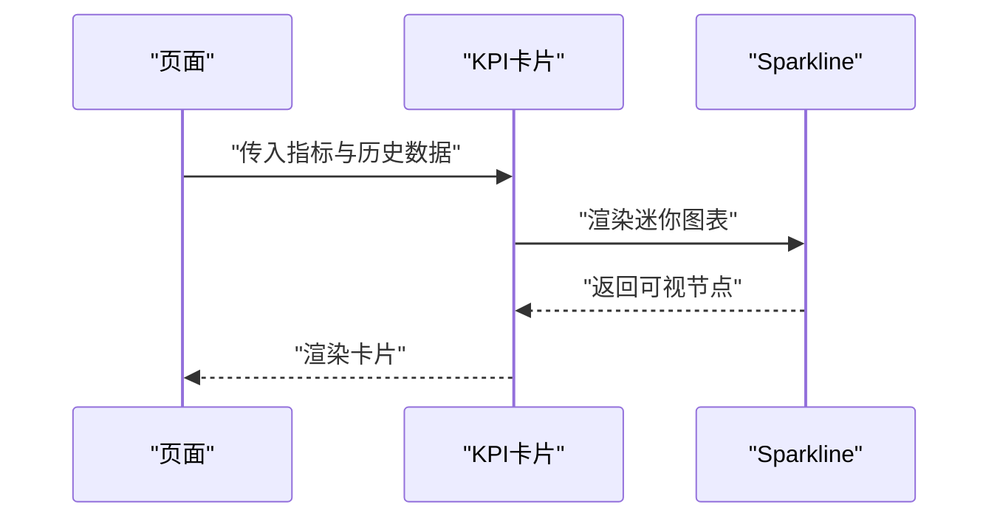
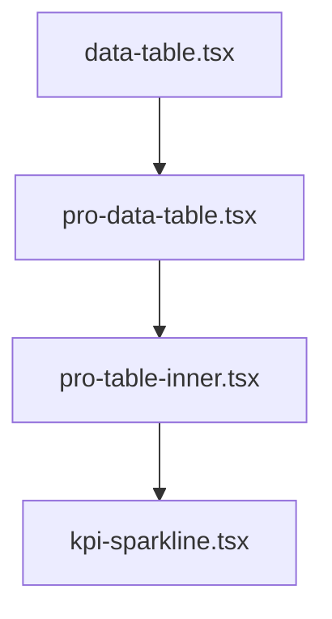
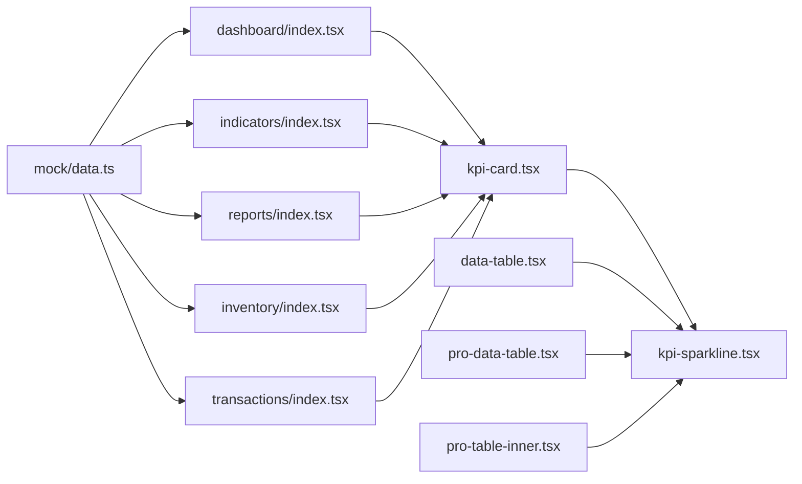

# 迷你图表组件

<cite>
**本文引用的文件**   
- [kpi-sparkline.tsx](file://web/src/components/charts/kpi-sparkline.tsx)
- [trend-chart.tsx](file://web/src/components/charts/trend-chart.tsx)
- [kpi-card.tsx](file://web/src/components/charts/kpi-card.tsx)
- [data-table.tsx](file://web/src/components/data-table/data-table.tsx)
- [pro-data-table.tsx](file://web/src/components/data-table/pro-data-table.tsx)
- [pro-table-inner.tsx](file://web/src/components/data-table/pro-table-inner.tsx)
- [index.tsx](file://web/src/pages/dashboard/index.tsx)
- [index.tsx](file://web/src/pages/indicators/index.tsx)
- [index.tsx](file://web/src/pages/reports/index.tsx)
- [index.tsx](file://web/src/pages/inventory/index.tsx)
- [index.tsx](file://web/src/pages/transactions/index.tsx)
- [mock data.ts](file://web/src/mock/data.ts)
</cite>

## 目录
1. [简介](#简介)
2. [项目结构](#项目结构)
3. [核心组件](#核心组件)
4. [架构总览](#架构总览)
5. [详细组件分析](#详细组件分析)
6. [依赖关系分析](#依赖关系分析)
7. [性能考虑](#性能考虑)
8. [故障排查指南](#故障排查指南)
9. [结论](#结论)
10. [附录](#附录)

## 简介
本文件面向“迷你图表（Sparkline）”组件，聚焦其在极小空间内高效传达数据趋势的设计理念与实现要点。文档覆盖：
- 设计理念：如何在有限像素中表达趋势、方向与波动
- 配置项：线条样式、填充区域、颜色主题、尺寸适配等视觉定制参数
- 数据格式与预处理：数据点数量限制、平滑算法、异常值处理
- 使用场景：表格内嵌图表、状态指示器、进度展示等
- 性能优化：Canvas渲染、内存管理、大数据集处理
- 可访问性与键盘导航：ARIA语义、焦点管理、屏幕阅读器支持

## 项目结构
仓库中与迷你图表相关的代码位于 web/src/components/charts 目录，并在多个页面与表格组件中被集成使用。整体组织采用“按功能域划分”的组件化结构，图表组件独立于业务页面，便于复用与测试。

图示来源
- [kpi-sparkline.tsx](file://web/src/components/charts/kpi-sparkline.tsx)
- [trend-chart.tsx](file://web/src/components/charts/trend-chart.tsx)
- [kpi-card.tsx](file://web/src/components/charts/kpi-card.tsx)
- [data-table.tsx](file://web/src/components/data-table/data-table.tsx)
- [pro-data-table.tsx](file://web/src/components/data-table/pro-data-table.tsx)
- [pro-table-inner.tsx](file://web/src/components/data-table/pro-table-inner.tsx)
- [index.tsx](file://web/src/pages/dashboard/index.tsx)
- [index.tsx](file://web/src/pages/indicators/index.tsx)
- [index.tsx](file://web/src/pages/reports/index.tsx)
- [index.tsx](file://web/src/pages/inventory/index.tsx)
- [index.tsx](file://web/src/pages/transactions/index.tsx)
- [mock data.ts](file://web/src/mock/data.ts)

章节来源
- [kpi-sparkline.tsx](file://web/src/components/charts/kpi-sparkline.tsx)
- [trend-chart.tsx](file://web/src/components/charts/trend-chart.tsx)
- [kpi-card.tsx](file://web/src/components/charts/kpi-card.tsx)
- [data-table.tsx](file://web/src/components/data-table/data-table.tsx)
- [pro-data-table.tsx](file://web/src/components/data-table/pro-data-table.tsx)
- [pro-table-inner.tsx](file://web/src/components/data-table/pro-table-inner.tsx)
- [index.tsx](file://web/src/pages/dashboard/index.tsx)
- [index.tsx](file://web/src/pages/indicators/index.tsx)
- [index.tsx](file://web/src/pages/reports/index.tsx)
- [index.tsx](file://web/src/pages/inventory/index.tsx)
- [index.tsx](file://web/src/pages/transactions/index.tsx)
- [mock data.ts](file://web/src/mock/data.ts)

## 核心组件
- kpi-sparkline.tsx：提供轻量级 Sparkline 渲染能力，适合在单元格或卡片中嵌入，强调趋势与方向性信息。
- trend-chart.tsx：提供更丰富的折线趋势图能力，用于需要更完整坐标轴、交互或对比的场景。
- kpi-card.tsx：将关键指标与迷你图表组合为卡片式展示，常用于仪表盘与报表页。

章节来源
- [kpi-sparkline.tsx](file://web/src/components/charts/kpi-sparkline.tsx)
- [trend-chart.tsx](file://web/src/components/charts/trend-chart.tsx)
- [kpi-card.tsx](file://web/src/components/charts/kpi-card.tsx)

## 架构总览
从调用方到渲染层的典型流程如下：页面或表格组件传入数据与配置，图表组件进行数据校验与预处理，随后基于 Canvas/SVG 进行绘制，最终返回可复用的可视化节点。

图示来源
- [kpi-sparkline.tsx](file://web/src/components/charts/kpi-sparkline.tsx)
- [kpi-card.tsx](file://web/src/components/charts/kpi-card.tsx)
- [data-table.tsx](file://web/src/components/data-table/data-table.tsx)
- [pro-data-table.tsx](file://web/src/components/data-table/pro-data-table.tsx)
- [pro-table-inner.tsx](file://web/src/components/data-table/pro-table-inner.tsx)

## 详细组件分析

### KPI 迷你图表（kpi-sparkline.tsx）
- 设计目标：在极小区域内呈现趋势方向与波动幅度，避免过度装饰，突出可读性。
- 输入数据：数值数组或键值对象数组；支持可选时间戳字段以辅助排序与采样。
- 配置项（示例维度）：
  - 线条样式：线宽、端点形状、虚线模式
  - 填充区域：是否启用、渐变或纯色、透明度
  - 颜色主题：主色、涨跌色、中性色
  - 尺寸适配：固定宽高、响应式容器、最小显示阈值
  - 行为选项：是否显示数据点、是否启用 Tooltip、是否允许缩放
- 数据预处理：
  - 数据清洗：过滤空值、NaN、负数（若业务不允许）
  - 采样降维：当数据点过多时，采用分段聚合或下采样策略
  - 平滑算法：可选线性插值或曲线平滑，平衡细节与清晰度
  - 异常值处理：截断或缩尾（Winsorize）、分位数裁剪
- 渲染策略：优先 Canvas 以提升大量数据点的绘制性能；必要时回退至 SVG 保证矢量清晰。
- 可访问性：
  - 提供 aria-label 描述趋势方向与变化幅度
  - 支持键盘焦点与 Tab 导航
  - 提供屏幕阅读器友好的文本摘要（如“过去7天呈上升趋势”）

图示来源
- [kpi-sparkline.tsx](file://web/src/components/charts/kpi-sparkline.tsx)

章节来源
- [kpi-sparkline.tsx](file://web/src/components/charts/kpi-sparkline.tsx)

### 趋势图表（trend-chart.tsx）
- 适用场景：需要更完整的坐标轴、网格、多系列对比、交互（悬停、缩放）的趋势展示。
- 与 Sparkline 的关系：Sparkline 是其简化版，去掉坐标轴与复杂交互，专注于趋势信号。
- 扩展能力：
  - 多系列叠加与对比
  - 动态更新与增量渲染
  - 工具提示与十字光标
  - 主题切换与暗色模式

图示来源
- [trend-chart.tsx](file://web/src/components/charts/trend-chart.tsx)
- [kpi-sparkline.tsx](file://web/src/components/charts/kpi-sparkline.tsx)

章节来源
- [trend-chart.tsx](file://web/src/components/charts/trend-chart.tsx)
- [kpi-sparkline.tsx](file://web/src/components/charts/kpi-sparkline.tsx)

### KPI 卡片（kpi-card.tsx）
- 组成：标题、当前值、变化率、迷你图表（Sparkline）。
- 布局：紧凑卡片，适合仪表盘与报表页的指标概览。
- 交互：点击可展开详情或跳转至趋势图。

图示来源
- [kpi-card.tsx](file://web/src/components/charts/kpi-card.tsx)
- [kpi-sparkline.tsx](file://web/src/components/charts/kpi-sparkline.tsx)

章节来源
- [kpi-card.tsx](file://web/src/components/charts/kpi-card.tsx)
- [kpi-sparkline.tsx](file://web/src/components/charts/kpi-sparkline.tsx)

### 表格内嵌迷你图表
- 集成位置：数据表格列中嵌入 Sparkline，用于快速识别行级趋势。
- 性能考量：每行一个实例，需控制数据点数量与渲染开销；建议使用虚拟滚动与按需渲染。
- 交互建议：悬停显示 Tooltip，点击跳转到详情页。

图示来源
- [data-table.tsx](file://web/src/components/data-table/data-table.tsx)
- [pro-data-table.tsx](file://web/src/components/data-table/pro-data-table.tsx)
- [pro-table-inner.tsx](file://web/src/components/data-table/pro-table-inner.tsx)
- [kpi-sparkline.tsx](file://web/src/components/charts/kpi-sparkline.tsx)

章节来源
- [data-table.tsx](file://web/src/components/data-table/data-table.tsx)
- [pro-data-table.tsx](file://web/src/components/data-table/pro-data-table.tsx)
- [pro-table-inner.tsx](file://web/src/components/data-table/pro-table-inner.tsx)
- [kpi-sparkline.tsx](file://web/src/components/charts/kpi-sparkline.tsx)

### 页面集成示例
- 仪表盘（dashboard/index.tsx）：使用 KPI 卡片与 Sparkline 展示关键指标趋势。
- 指标页（indicators/index.tsx）：集中展示各指标的迷你图表与简要说明。
- 报表页（reports/index.tsx）：结合表格与迷你图表，提供行级趋势洞察。
- 库存页（inventory/index.tsx）：在库存变动表中嵌入 Sparkline，直观反映库存波动。
- 交易页（transactions/index.tsx）：在交易流水中展示短期趋势，辅助判断异常。

章节来源
- [index.tsx](file://web/src/pages/dashboard/index.tsx)
- [index.tsx](file://web/src/pages/indicators/index.tsx)
- [index.tsx](file://web/src/pages/reports/index.tsx)
- [index.tsx](file://web/src/pages/inventory/index.tsx)
- [index.tsx](file://web/src/pages/transactions/index.tsx)

## 依赖关系分析
- 组件耦合：
  - 表格组件依赖 Sparkline 作为列渲染器
  - 页面组件依赖 KPI 卡片与 Sparkline 进行指标展示
- 外部依赖：
  - 渲染层可能依赖 Canvas/SVG 库或原生 API
  - 数据源来自 mock 或后端接口

图示来源
- [mock data.ts](file://web/src/mock/data.ts)
- [index.tsx](file://web/src/pages/dashboard/index.tsx)
- [index.tsx](file://web/src/pages/indicators/index.tsx)
- [index.tsx](file://web/src/pages/reports/index.tsx)
- [index.tsx](file://web/src/pages/inventory/index.tsx)
- [index.tsx](file://web/src/pages/transactions/index.tsx)
- [kpi-card.tsx](file://web/src/components/charts/kpi-card.tsx)
- [kpi-sparkline.tsx](file://web/src/components/charts/kpi-sparkline.tsx)
- [data-table.tsx](file://web/src/components/data-table/data-table.tsx)
- [pro-data-table.tsx](file://web/src/components/data-table/pro-data-table.tsx)
- [pro-table-inner.tsx](file://web/src/components/data-table/pro-table-inner.tsx)

章节来源
- [mock data.ts](file://web/src/mock/data.ts)
- [index.tsx](file://web/src/pages/dashboard/index.tsx)
- [index.tsx](file://web/src/pages/indicators/index.tsx)
- [index.tsx](file://web/src/pages/reports/index.tsx)
- [index.tsx](file://web/src/pages/inventory/index.tsx)
- [index.tsx](file://web/src/pages/transactions/index.tsx)
- [kpi-card.tsx](file://web/src/components/charts/kpi-card.tsx)
- [kpi-sparkline.tsx](file://web/src/components/charts/kpi-sparkline.tsx)
- [data-table.tsx](file://web/src/components/data-table/data-table.tsx)
- [pro-data-table.tsx](file://web/src/components/data-table/pro-data-table.tsx)
- [pro-table-inner.tsx](file://web/src/components/data-table/pro-table-inner.tsx)

## 性能考虑
- 渲染选择：
  - 大数据集优先 Canvas，减少 DOM 节点数量，提升绘制速度
  - 小数据集可使用 SVG，保持矢量清晰度与缩放无损
- 数据采样：
  - 对长序列进行分段聚合或下采样，控制可见点数
  - 使用滑动窗口展示最近 N 个时间点
- 内存管理：
  - 及时释放离屏 Canvas 上下文与缓存
  - 避免在高频更新中创建新对象，复用缓冲区
- 增量更新：
  - 仅重绘变更区域，避免整图重绘
- 虚拟化与懒加载：
  - 表格中使用虚拟滚动，仅渲染可视区域的迷你图表
  - 延迟初始化不可见图表，降低首屏开销

[本节为通用性能指导，不直接分析具体文件]

## 故障排查指南
- 常见问题：
  - 数据为空或包含 NaN：确保预处理阶段过滤无效值
  - 图形失真或拉伸：检查容器尺寸与比例设置
  - 性能卡顿：确认是否启用了不必要的动画或过高的数据点密度
  - 主题不一致：核对颜色主题配置与 CSS 变量
- 调试建议：
  - 打印数据序列长度与统计信息（均值、方差、最大值、最小值）
  - 临时关闭平滑与填充，定位渲染瓶颈
  - 使用浏览器性能面板分析绘制耗时

[本节为通用排障指导，不直接分析具体文件]

## 结论
迷你图表通过精简的数据表达与高效的渲染策略，在极小空间内有效传达趋势信息。配合合理的配置项、数据预处理与性能优化，可在表格、卡片、仪表盘等多种场景中稳定复用。同时，完善的可访问性与键盘导航保障不同用户群体的使用体验。

[本节为总结性内容，不直接分析具体文件]

## 附录
- 数据格式建议：
  - 基础：数值数组 [v1, v2, ...]
  - 增强：对象数组 [{value, timestamp}, ...]，便于排序与时间对齐
- 配置项清单（示例）：
  - 线条：线宽、端点、虚线
  - 填充：启用、渐变、透明度
  - 颜色：主色、涨跌色、中性色
  - 尺寸：宽度、高度、最小显示阈值
  - 行为：Tooltip、数据点标记、缩放
- 使用场景示例：
  - 表格内嵌：在数据表列中展示行级趋势
  - 状态指示器：用颜色与方向表示健康度
  - 进度展示：以迷你图展示阶段性进展

[本节为概念性附录，不直接分析具体文件]