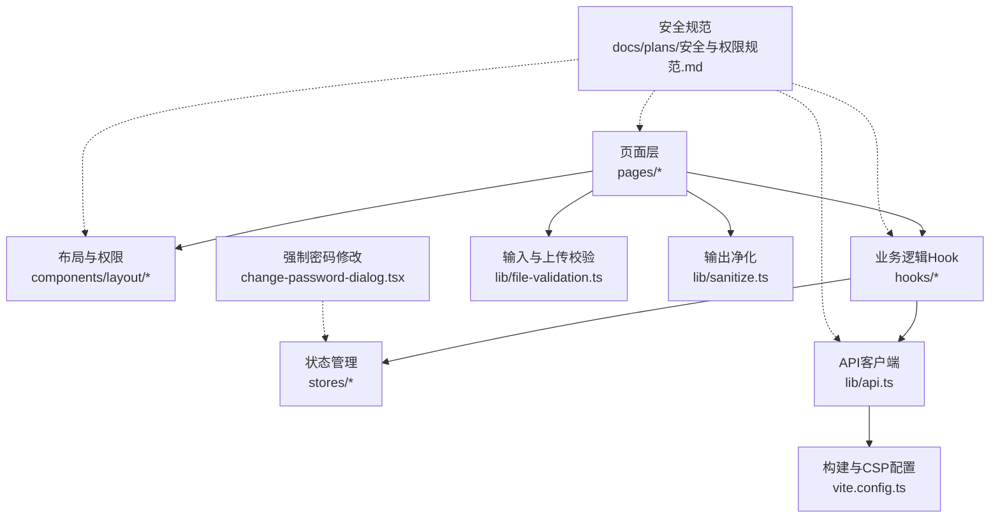
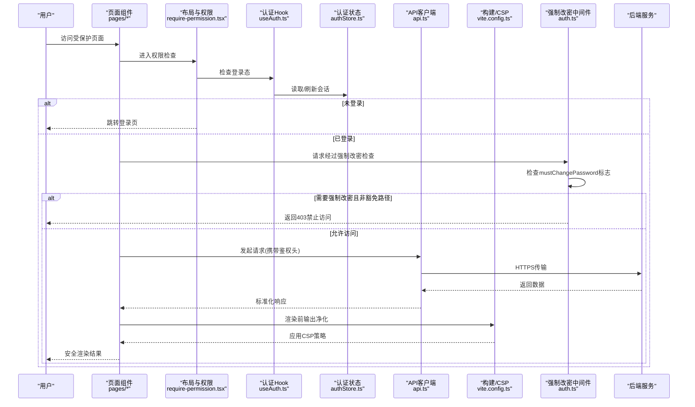
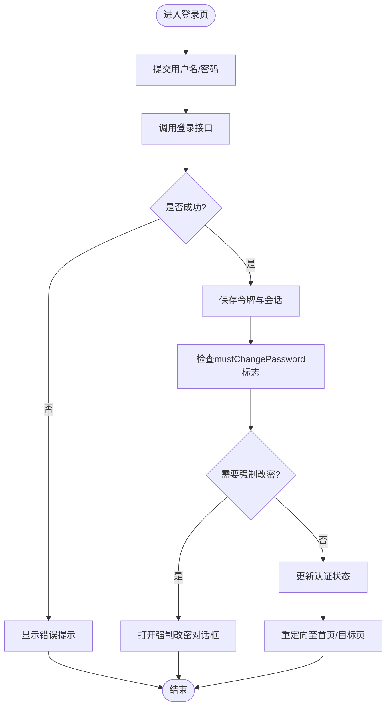
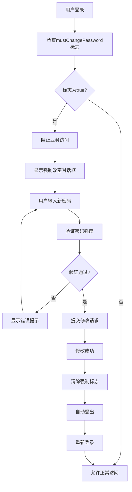
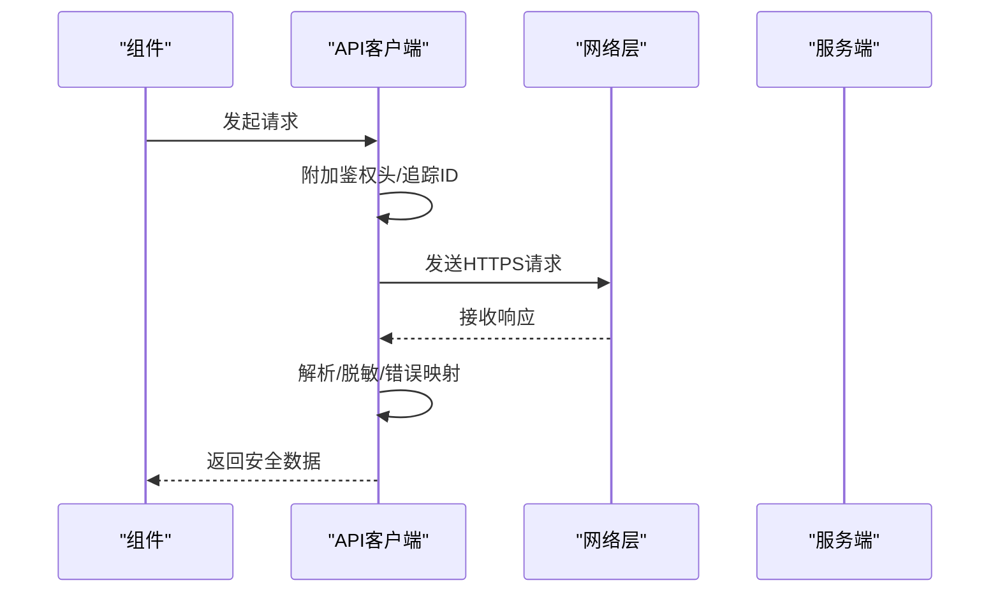
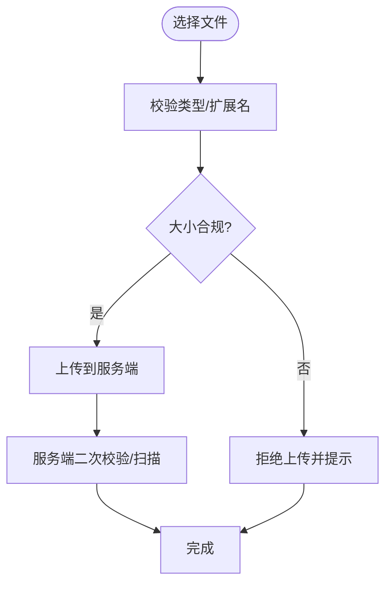
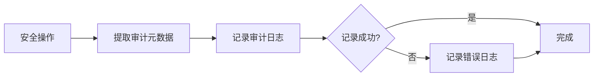
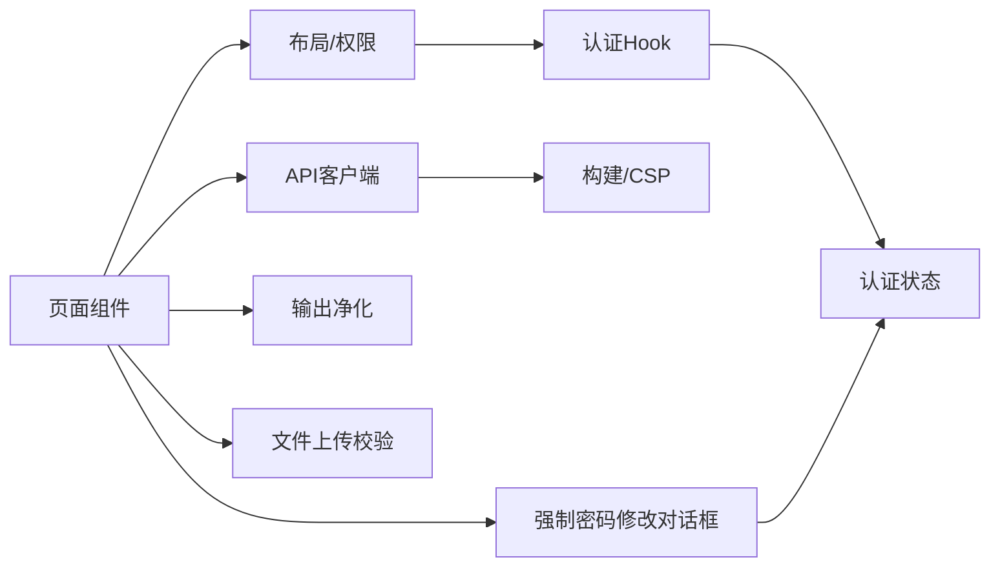

# 安全指南

<cite>
**本文引用的文件**   
- [web/src/lib/sanitize.ts](file://web/src/lib/sanitize.ts)
- [web/src/hooks/useAuth.ts](file://web/src/hooks/useAuth.ts)
- [web/src/stores/authStore.ts](file://web/src/stores/authStore.ts)
- [web/src/hooks/usePermission.ts](file://web/src/hooks/usePermission.ts)
- [web/src/components/layout/require-permission.tsx](file://web/src/components/layout/require-permission.tsx)
- [web/src/pages/login/index.tsx](file://web/src/pages/login/index.tsx)
- [web/src/lib/api.ts](file://web/src/lib/api.ts)
- [web/src/lib/file-validation.ts](file://web/src/lib/file-validation.ts)
- [web/src/lib/constants.ts](file://web/src/lib/constants.ts)
- [web/vite.config.ts](file://web/vite.config.ts)
- [web/package.json](file://web/package.json)
- [docs/plans/安全与权限规范.md](file://docs/plans/安全与权限规范.md)
- [server/src/middleware/auth.ts](file://server/src/middleware/auth.ts)
- [web/src/components/layout/change-password-dialog.tsx](file://web/src/components/layout/change-password-dialog.tsx)
- [server/src/services/AuthService.ts](file://server/src/services/AuthService.ts)
- [server/src/routes/auth.ts](file://server/src/routes/auth.ts)
- [server/src/middleware/audit.ts](file://server/src/middleware/audit.ts)
- [server/prisma/migrations/20260803000000_add_must_change_password/migration.sql](file://server/prisma/migrations/20260803000000_add_must_change_password/migration.sql)
</cite>

## 更新摘要
**变更内容**   
- 新增强制密码修改安全机制章节，详细说明首次登录用户密码强制更改功能
- 更新认证中间件分析，包含强制改密豁免路径和403拦截逻辑
- 增强审计日志部分，说明密码修改操作的完整审计追踪
- 更新前端密码修改对话框组件，支持强制模式不可关闭
- 完善数据库迁移和安全策略配置

## 目录
1. [简介](#简介)
2. [项目结构](#项目结构)
3. [核心组件](#核心组件)
4. [架构总览](#架构总览)
5. [详细组件分析](#详细组件分析)
6. [依赖分析](#依赖分析)
7. [性能考虑](#性能考虑)
8. [故障排查指南](#故障排查指南)
9. [结论](#结论)
10. [附录](#附录)

## 简介
本指南面向pj3前端工程，聚焦于安全开发实践。围绕XSS、CSRF、点击劫持等常见威胁，结合用户认证与授权、数据保护、输入验证与输出编码、漏洞检测与修复、应急响应等方面，给出可落地的策略与落地位置指引。文档中的实现建议均映射到仓库中现有模块或配置，便于快速对照与改进。

**最新更新**：新增了强制密码修改的安全机制，包括首次登录用户密码强制更改、中间件保护和审计日志增强，确保新用户初始密码的安全性。

## 项目结构
前端采用Vite + React + TypeScript技术栈，安全相关能力主要分布在以下位置：
- 内容安全与输出净化：lib/sanitize.ts
- 认证与会话：hooks/useAuth.ts、stores/authStore.ts、pages/login/index.tsx
- **强制密码修改**：components/layout/change-password-dialog.tsx、stores/authStore.ts
- 权限控制：hooks/usePermission.ts、components/layout/require-permission.tsx
- 网络请求与传输安全：lib/api.ts、vite.config.ts
- 输入校验与上传安全：lib/file-validation.ts
- 常量与策略：lib/constants.ts
- 安全规范文档：docs/plans/安全与权限规范.md



图表来源
- [web/src/lib/sanitize.ts](file://web/src/lib/sanitize.ts)
- [web/src/hooks/useAuth.ts](file://web/src/hooks/useAuth.ts)
- [web/src/stores/authStore.ts](file://web/src/stores/authStore.ts)
- [web/src/hooks/usePermission.ts](file://web/src/hooks/usePermission.ts)
- [web/src/components/layout/require-permission.tsx](file://web/src/components/layout/require-permission.tsx)
- [web/src/pages/login/index.tsx](file://web/src/pages/login/index.tsx)
- [web/src/lib/api.ts](file://web/src/lib/api.ts)
- [web/src/lib/file-validation.ts](file://web/src/lib/file-validation.ts)
- [web/vite.config.ts](file://web/vite.config.ts)
- [web/src/components/layout/change-password-dialog.tsx](file://web/src/components/layout/change-password-dialog.tsx)
- [docs/plans/安全与权限规范.md](file://docs/plans/安全与权限规范.md)

## 核心组件
- 输出净化（防XSS）：提供统一的文本/HTML净化函数，集中处理富文本渲染与动态内容注入风险。
- 认证与会话：封装登录流程、令牌获取与存储、会话过期处理；配合路由守卫实现未登录拦截。
- **强制密码修改**：首次登录强制更改密码机制，包含中间件保护、豁免路径控制和强制模式对话框。
- 权限控制：基于角色/资源的细粒度鉴权，提供高阶组件与Hook进行声明式权限控制。
- API客户端：统一请求拦截器，负责添加鉴权头、错误码处理、敏感信息脱敏与日志安全。
- 输入与上传校验：对表单字段类型、长度、格式进行校验；对文件上传进行类型、大小、白名单校验。
- CSP与安全响应头：通过构建配置注入Content-Security-Policy等头部，降低脚本执行面。

## 架构总览
下图展示从用户交互到后端通信的安全链路，包括认证、鉴权、输入校验、输出净化与传输加密。



图表来源
- [web/src/components/layout/require-permission.tsx](file://web/src/components/layout/require-permission.tsx)
- [web/src/hooks/useAuth.ts](file://web/src/hooks/useAuth.ts)
- [web/src/stores/authStore.ts](file://web/src/stores/authStore.ts)
- [web/src/lib/api.ts](file://web/src/lib/api.ts)
- [web/vite.config.ts](file://web/vite.config.ts)
- [server/src/middleware/auth.ts](file://server/src/middleware/auth.ts)

## 详细组件分析

### 认证与会话（登录、令牌、过期）
- 登录流程：在登录页提交凭证，调用API获取令牌并写入本地持久化存储；成功后更新全局认证状态并重定向。
- 会话管理：使用集中状态管理维护登录态、令牌有效期与刷新机制；在应用启动时校验会话有效性。
- 安全要点：
  - 令牌仅用于鉴权，不承载敏感业务数据。
  - 设置合理的过期时间与自动刷新策略。
  - 避免将敏感信息记录到控制台或埋点。



图表来源
- [web/src/pages/login/index.tsx](file://web/src/pages/login/index.tsx)
- [web/src/hooks/useAuth.ts](file://web/src/hooks/useAuth.ts)
- [web/src/stores/authStore.ts](file://web/src/stores/authStore.ts)

### 强制密码修改机制（新增）
**首次登录强制密码修改**是系统的重要安全特性，确保新用户必须修改初始密码后才能访问业务功能。

#### 后端实现
- **数据库字段**：`user.must_change_password`布尔字段，默认false
- **中间件保护**：authenticate中间件检查用户状态，未改密用户仅允许访问特定接口
- **豁免路径**：仅允许访问密码修改、登出、个人资料接口
- **业务拦截**：其他所有业务接口返回403禁止访问

#### 前端实现
- **强制对话框**：change-password-dialog.tsx支持force模式，不可关闭
- **状态管理**：authStore.ts管理passwordDialog状态和force标志
- **表单验证**：前后端双重密码强度验证
- **自动登出**：修改成功后自动登出，要求重新登录



图表来源
- [server/src/middleware/auth.ts](file://server/src/middleware/auth.ts)
- [web/src/components/layout/change-password-dialog.tsx](file://web/src/components/layout/change-password-dialog.tsx)
- [web/src/stores/authStore.ts](file://web/src/stores/authStore.ts)
- [server/src/services/AuthService.ts](file://server/src/services/AuthService.ts)

**章节来源**
- [server/src/middleware/auth.ts:8-20](file://server/src/middleware/auth.ts#L8-L20)
- [server/src/middleware/auth.ts:61-64](file://server/src/middleware/auth.ts#L61-L64)
- [web/src/components/layout/change-password-dialog.tsx:83-86](file://web/src/components/layout/change-password-dialog.tsx#L83-L86)
- [web/src/stores/authStore.ts:10-11](file://web/src/stores/authStore.ts#L10-L11)
- [server/src/services/AuthService.ts:29-30](file://server/src/services/AuthService.ts#L29-L30)
- [server/src/services/AuthService.ts:238-244](file://server/src/services/AuthService.ts#L238-L244)
- [server/prisma/migrations/20260803000000_add_must_change_password/migration.sql:1-2](file://server/prisma/migrations/20260803000000_add_must_change_password/migration.sql#L1-L2)

### 权限控制（资源级与路由级）
- 路由级：通过布局组件在进入页面时校验用户角色/资源权限，无权限则拒绝访问或降级展示。
- 资源级：在组件内通过Hook判断按钮/操作可见性，避免越权操作入口暴露。
- 最佳实践：
  - 前后端双重校验，前端仅做体验优化，不可作为唯一防线。
  - 权限模型清晰、最小权限原则。
  - 对敏感操作二次确认与审计日志。

```mermaid
classDiagram
class RequirePermission {
+requiredRoles : string[]
+requiredPermissions : string[]
+render(children) JSX.Element
}
class UsePermission {
+hasRole(role) : boolean
+hasPermission(permission) : boolean
}
class AuthStore {
+user : User
+roles : string[]
+permissions : string[]
+passwordDialog : {open : boolean, force : boolean}
}
RequirePermission --> UsePermission : "组合"
UsePermission --> AuthStore : "读取权限"
```

图表来源
- [web/src/components/layout/require-permission.tsx](file://web/src/components/layout/require-permission.tsx)
- [web/src/hooks/usePermission.ts](file://web/src/hooks/usePermission.ts)
- [web/src/stores/authStore.ts](file://web/src/stores/authStore.ts)

**章节来源**
- [web/src/components/layout/require-permission.tsx](file://web/src/components/layout/require-permission.tsx)
- [web/src/hooks/usePermission.ts](file://web/src/hooks/usePermission.ts)
- [web/src/stores/authStore.ts](file://web/src/stores/authStore.ts)

### 输出净化（XSS防护）
- 统一净化：所有动态内容渲染前经过净化函数过滤危险标签与事件属性。
- 富文本场景：优先使用安全的富文本库，并在入库/出库两端分别校验与净化。
- 注意事项：
  - 避免直接使用innerHTML等高风险API。
  - 对第三方嵌入内容使用沙箱iframe与严格CSP。

**章节来源**
- [web/src/lib/sanitize.ts](file://web/src/lib/sanitize.ts)

### API客户端与传输安全
- 请求拦截：统一附加鉴权头、追踪ID、超时与重试策略。
- 响应处理：统一错误码映射、敏感字段脱敏、异常上报。
- 传输加密：确保全站HTTPS，禁用明文HTTP；必要时启用HSTS。
- CSP策略：通过构建配置注入CSP，限制脚本来源与执行环境。



图表来源
- [web/src/lib/api.ts](file://web/src/lib/api.ts)
- [web/vite.config.ts](file://web/vite.config.ts)

**章节来源**
- [web/src/lib/api.ts](file://web/src/lib/api.ts)
- [web/vite.config.ts](file://web/vite.config.ts)

### 输入验证与文件上传安全
- 表单校验：对必填、类型、长度、正则表达式进行强校验，错误即时反馈。
- 文件上传：
  - 白名单校验MIME与扩展名。
  - 限制文件大小与数量。
  - 服务端二次校验与病毒扫描。
- 参数校验：API入参在服务端再次校验，防止绕过前端。



图表来源
- [web/src/lib/file-validation.ts](file://web/src/lib/file-validation.ts)

**章节来源**
- [web/src/lib/file-validation.ts](file://web/src/lib/file-validation.ts)

### 审计日志与监控（增强）
**审计日志系统**增强了密码修改操作的完整追踪能力：

- **审计元数据**：auditMeta()函数提取IP、User-Agent、traceId等上下文信息
- **密码修改审计**：AuthService.changePassword()记录详细的密码修改操作
- **失败审计**：登录失败、强制改密拦截等操作均有审计记录
- **安全限制**：User-Agent截断至512字符，防止超长输入导致写入失败



图表来源
- [server/src/middleware/audit.ts](file://server/src/middleware/audit.ts)
- [server/src/services/AuthService.ts](file://server/src/services/AuthService.ts)

**章节来源**
- [server/src/middleware/audit.ts:40-43](file://server/src/middleware/audit.ts#L40-L43)
- [server/src/middleware/audit.ts:45-63](file://server/src/middleware/audit.ts#L45-L63)
- [server/src/services/AuthService.ts:241-244](file://server/src/services/AuthService.ts#L241-L244)

### 常量与策略
- 安全常量：集中定义允许的域名、内容安全策略、超时时间、最大上传大小等。
- 策略一致性：通过常量保证多模块行为一致，便于统一调整与审计。

**章节来源**
- [web/src/lib/constants.ts](file://web/src/lib/constants.ts)

## 依赖分析
- 内部依赖：
  - 页面与布局依赖认证与权限模块。
  - API客户端被各业务模块复用，形成统一安全边界。
  - 净化与校验工具被多处引用，需保持向后兼容。
  - **强制密码修改**：change-password-dialog依赖authStore状态管理。
- 外部依赖：
  - 构建工具用于注入安全响应头与CSP。
  - 包管理器用于锁定版本与依赖审计。



图表来源
- [web/src/components/layout/require-permission.tsx](file://web/src/components/layout/require-permission.tsx)
- [web/src/hooks/useAuth.ts](file://web/src/hooks/useAuth.ts)
- [web/src/stores/authStore.ts](file://web/src/stores/authStore.ts)
- [web/src/lib/api.ts](file://web/src/lib/api.ts)
- [web/vite.config.ts](file://web/vite.config.ts)
- [web/src/lib/sanitize.ts](file://web/src/lib/sanitize.ts)
- [web/src/lib/file-validation.ts](file://web/src/lib/file-validation.ts)
- [web/src/components/layout/change-password-dialog.tsx](file://web/src/components/layout/change-password-dialog.tsx)

**章节来源**
- [web/package.json](file://web/package.json)
- [web/vite.config.ts](file://web/vite.config.ts)

## 性能考虑
- 认证与权限检查应轻量且可缓存，避免重复计算。
- 大文件上传采用分片与断点续传，减少失败重试成本。
- 净化与校验尽量在必要处触发，避免全量字符串处理带来的开销。
- 合理设置超时与重试，避免雪崩效应。
- **强制密码修改**：中间件检查应快速返回，避免影响正常用户访问。

## 故障排查指南
- 登录失败：
  - 检查令牌存储与过期时间。
  - 核对鉴权头是否正确附加。
  - 查看服务端错误码与日志。
- 权限不足：
  - 确认用户角色与资源权限映射。
  - 检查路由守卫与组件内权限判断逻辑。
- **强制密码修改问题**：
  - 检查user.must_change_password数据库字段状态。
  - 验证豁免路径配置是否正确。
  - 确认强制对话框的force模式状态。
- XSS告警：
  - 定位未净化的渲染点。
  - 复核富文本入库/出库净化策略。
- 上传失败：
  - 检查类型/大小白名单与服务端限制。
  - 查看跨域与CORS配置。
- **审计日志问题**：
  - 检查User-Agent长度限制。
  - 确认审计日志写入权限。
  - 验证traceId传递链。

**章节来源**
- [web/src/hooks/useAuth.ts](file://web/src/hooks/useAuth.ts)
- [web/src/stores/authStore.ts](file://web/src/stores/authStore.ts)
- [web/src/components/layout/require-permission.tsx](file://web/src/components/layout/require-permission.tsx)
- [web/src/lib/sanitize.ts](file://web/src/lib/sanitize.ts)
- [web/src/lib/file-validation.ts](file://web/src/lib/file-validation.ts)
- [web/src/lib/api.ts](file://web/src/lib/api.ts)
- [server/src/middleware/auth.ts](file://server/src/middleware/auth.ts)
- [server/src/middleware/audit.ts](file://server/src/middleware/audit.ts)

## 结论
通过将认证、鉴权、输入校验、输出净化与传输安全整合到统一的基础设施层，可在不侵入业务逻辑的前提下显著提升整体安全性。**新增的强制密码修改机制**进一步增强了账户安全，确保新用户必须修改初始密码才能访问业务功能。建议持续完善安全规范、自动化扫描与演练机制，形成闭环保障体系。

## 附录

### 常见威胁与防御清单
- XSS
  - 对所有动态内容进行净化与转义。
  - 使用CSP限制脚本来源与执行环境。
  - 富文本入库/出库双端净化。
- CSRF
  - 使用同源策略与SameSite Cookie。
  - 关键写操作增加一次性令牌校验。
  - 自定义Header要求与预检请求。
- 点击劫持
  - 设置X-Frame-Options或CSP frame-ancestors。
  - 敏感页面禁止被嵌套。
- 认证与会话
  - 令牌短时效+刷新机制。
  - 安全存储（HttpOnly Cookie或内存），避免localStorage存放敏感数据。
  - 登出后清理本地状态。
  - **强制密码修改**：新用户必须修改初始密码。
- 数据传输
  - 全站HTTPS，启用HSTS。
  - 敏感字段脱敏与最小化传输。
- 输入与上传
  - 严格的白名单校验与大小限制。
  - 服务端二次校验与病毒扫描。
- 权限控制
  - 路由级与资源级双重校验。
  - 最小权限与可审计。
- **审计与监控**
  - 完整的操作审计日志。
  - 安全事件的实时监控与告警。
  - User-Agent和IP地址的完整记录。

### 强制密码修改实施要点
- **数据库设计**：user表增加must_change_password字段
- **中间件保护**：authenticate中间件检查用户状态
- **豁免路径**：仅允许密码修改、登出、个人资料接口
- **前端对话框**：支持force模式的不可关闭对话框
- **审计追踪**：完整的密码修改操作审计记录
- **用户体验**：清晰的错误提示和操作引导

**章节来源**
- [docs/plans/安全与权限规范.md](file://docs/plans/安全与权限规范.md)
- [web/vite.config.ts](file://web/vite.config.ts)
- [web/src/lib/api.ts](file://web/src/lib/api.ts)
- [web/src/lib/sanitize.ts](file://web/src/lib/sanitize.ts)
- [web/src/lib/file-validation.ts](file://web/src/lib/file-validation.ts)
- [web/src/hooks/useAuth.ts](file://web/src/hooks/useAuth.ts)
- [web/src/stores/authStore.ts](file://web/src/stores/authStore.ts)
- [web/src/hooks/usePermission.ts](file://web/src/hooks/usePermission.ts)
- [web/src/components/layout/require-permission.tsx](file://web/src/components/layout/require-permission.tsx)
- [server/src/middleware/auth.ts](file://server/src/middleware/auth.ts)
- [web/src/components/layout/change-password-dialog.tsx](file://web/src/components/layout/change-password-dialog.tsx)
- [server/src/services/AuthService.ts](file://server/src/services/AuthService.ts)
- [server/src/middleware/audit.ts](file://server/src/middleware/audit.ts)