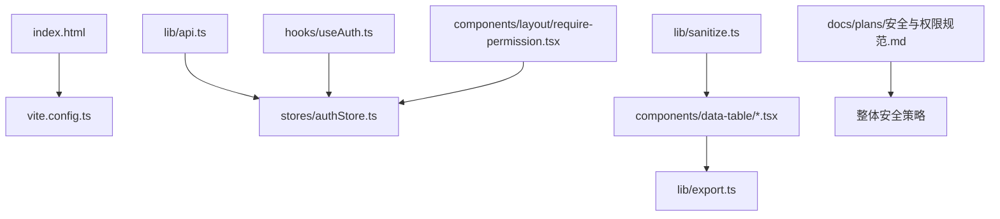
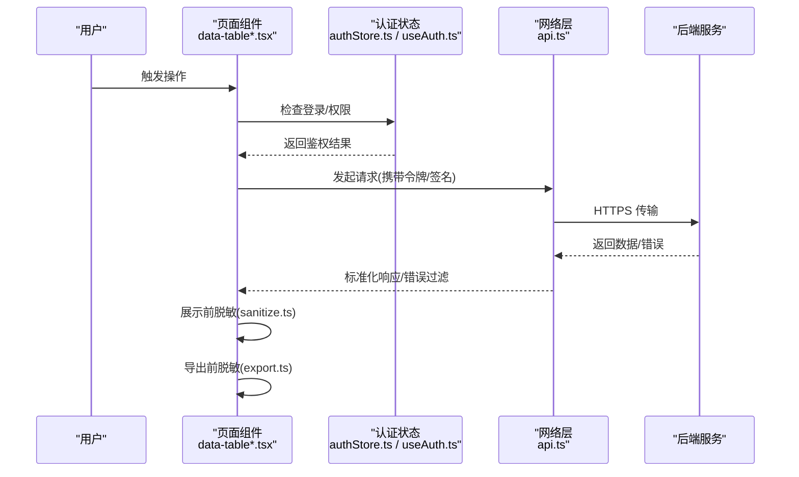
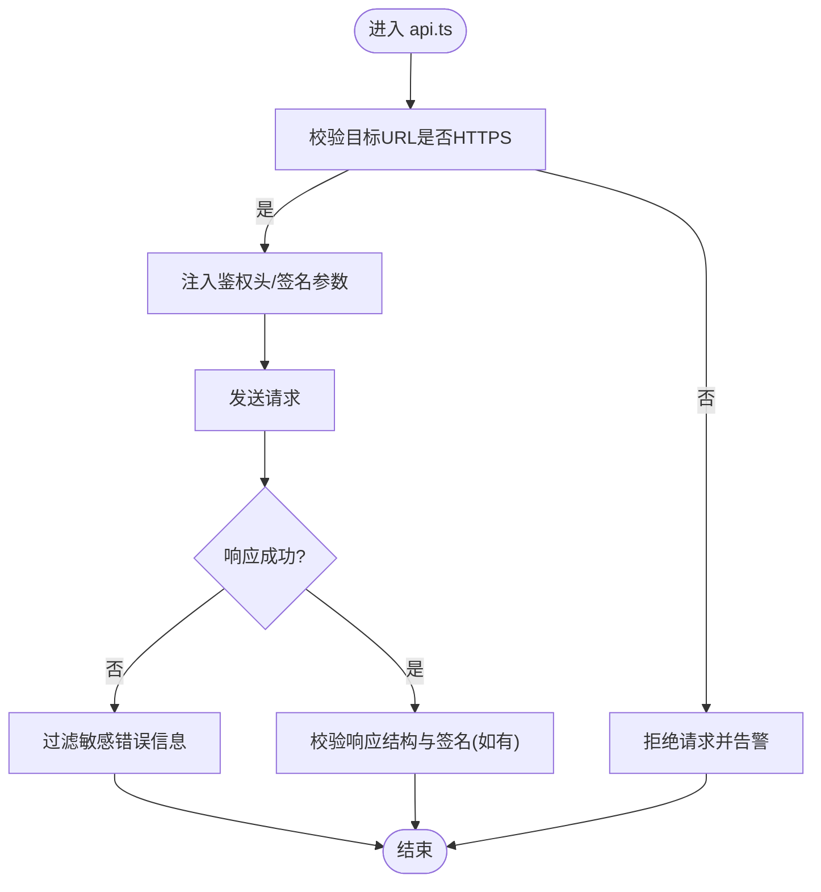
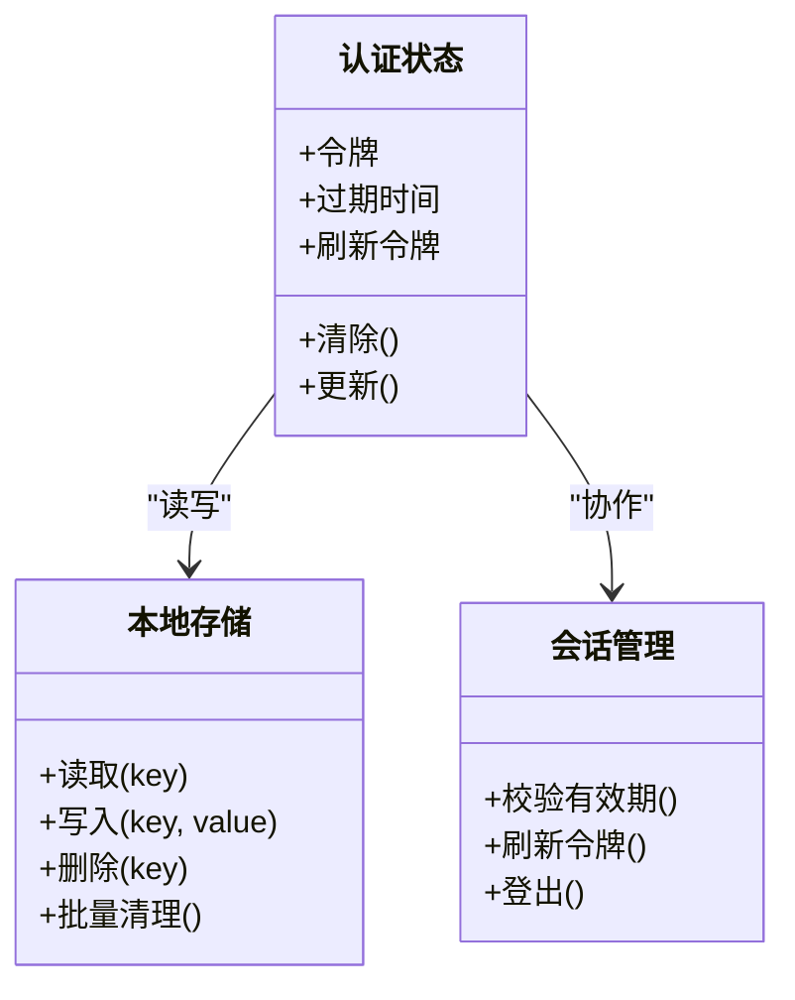
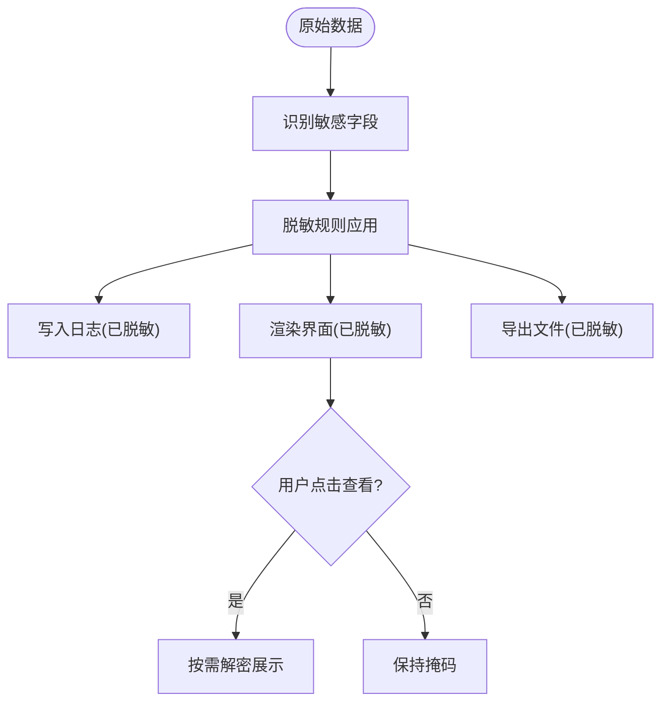
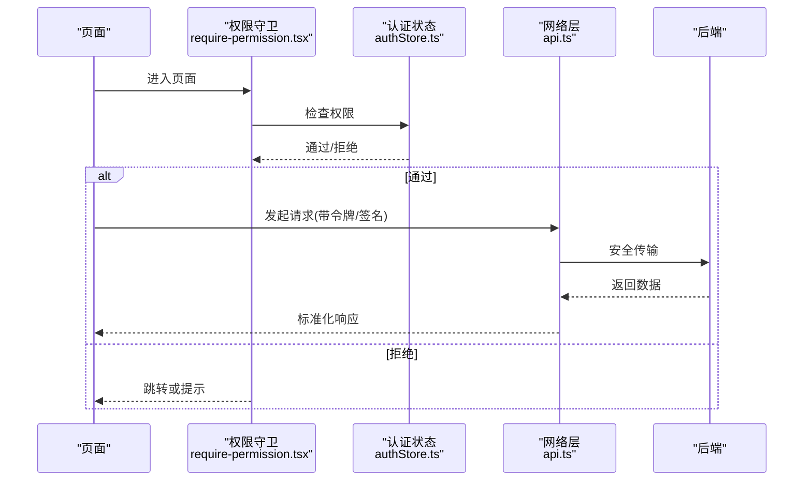
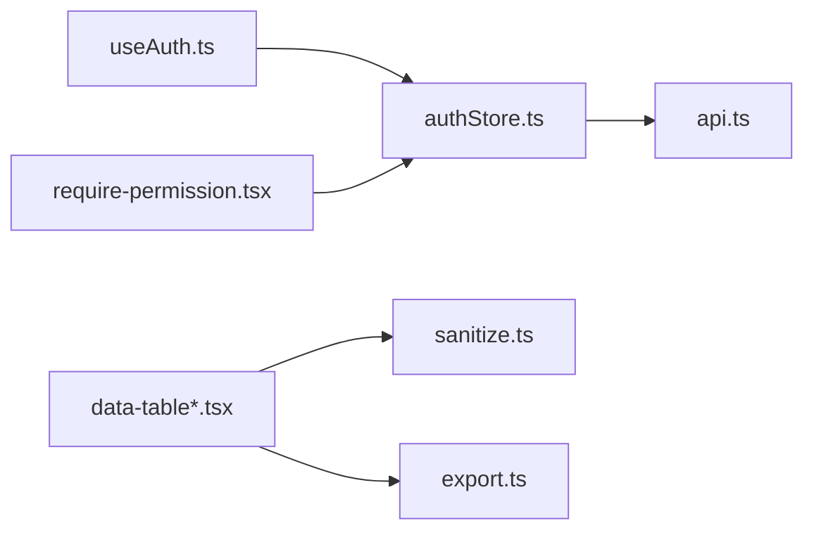

# 数据安全保护

<cite>
**本文引用的文件**   
- [安全与权限规范.md](file://docs/plans/安全与权限规范.md)
- [api.ts](file://web/src/lib/api.ts)
- [sanitize.ts](file://web/src/lib/sanitize.ts)
- [export.ts](file://web/src/lib/export.ts)
- [authStore.ts](file://web/src/stores/authStore.ts)
- [useAuth.ts](file://web/src/hooks/useAuth.ts)
- [require-permission.tsx](file://web/src/components/layout/require-permission.tsx)
- [data-table.tsx](file://web/src/components/data-table/data-table.tsx)
- [pro-data-table.tsx](file://web/src/components/data-table/pro-data-table.tsx)
- [index.html](file://web/index.html)
- [vite.config.ts](file://web/vite.config.ts)
</cite>

## 目录
1. [简介](#简介)
2. [项目结构](#项目结构)
3. [核心组件](#核心组件)
4. [架构总览](#架构总览)
5. [详细组件分析](#详细组件分析)
6. [依赖分析](#依赖分析)
7. [性能考虑](#性能考虑)
8. [故障排查指南](#故障排查指南)
9. [结论](#结论)
10. [附录](#附录)

## 简介
本指南面向 pj3 项目的数据安全保护，围绕敏感数据识别与分类、传输安全、存储安全、脱敏与匿名化、API 调用安全最佳实践以及泄露风险评估与应急响应展开。文档结合仓库中的前端实现与规范文档，给出可落地的策略与实践建议，帮助团队在开发、测试与生产环境中统一执行数据安全要求。

## 项目结构
pj3 为前端工程（Vite + React），与安全相关的关键位置包括：
- 规范与计划：docs/plans/安全与权限规范.md
- 网络请求与拦截：web/src/lib/api.ts
- 输入输出清洗与导出：web/src/lib/sanitize.ts、web/src/lib/export.ts
- 认证状态与权限控制：web/src/stores/authStore.ts、web/src/hooks/useAuth.ts、web/src/components/layout/require-permission.tsx
- 表格展示与分页：web/src/components/data-table/*.tsx
- 构建与运行配置：web/index.html、web/vite.config.ts

图表来源
- [index.html](file://web/index.html)
- [vite.config.ts](file://web/vite.config.ts)
- [api.ts](file://web/src/lib/api.ts)
- [authStore.ts](file://web/src/stores/authStore.ts)
- [useAuth.ts](file://web/src/hooks/useAuth.ts)
- [require-permission.tsx](file://web/src/components/layout/require-permission.tsx)
- [data-table.tsx](file://web/src/components/data-table/data-table.tsx)
- [pro-data-table.tsx](file://web/src/components/data-table/pro-data-table.tsx)
- [export.ts](file://web/src/lib/export.ts)
- [sanitize.ts](file://web/src/lib/sanitize.ts)
- [安全与权限规范.md](file://docs/plans/安全与权限规范.md)

章节来源
- [安全与权限规范.md](file://docs/plans/安全与权限规范.md)
- [api.ts](file://web/src/lib/api.ts)
- [sanitize.ts](file://web/src/lib/sanitize.ts)
- [export.ts](file://web/src/lib/export.ts)
- [authStore.ts](file://web/src/stores/authStore.ts)
- [useAuth.ts](file://web/src/hooks/useAuth.ts)
- [require-permission.tsx](file://web/src/components/layout/require-permission.tsx)
- [data-table.tsx](file://web/src/components/data-table/data-table.tsx)
- [pro-data-table.tsx](file://web/src/components/data-table/pro-data-table.tsx)
- [index.html](file://web/index.html)
- [vite.config.ts](file://web/vite.config.ts)

## 核心组件
- 网络层（api.ts）：集中管理 HTTP 请求，负责鉴权头注入、错误处理、日志记录等，是传输安全与审计的关键入口。
- 认证与权限（authStore.ts、useAuth.ts、require-permission.tsx）：维护会话与权限状态，提供页面级访问控制。
- 数据清洗与导出（sanitize.ts、export.ts）：对输入进行清洗、对输出进行脱敏与导出安全控制。
- 展示层（data-table*.tsx）：列表与分页渲染，涉及敏感字段展示与导出联动。
- 构建与运行（index.html、vite.config.ts）：浏览器安全头、CSP、Cookie 属性等运行时安全设置。

章节来源
- [api.ts](file://web/src/lib/api.ts)
- [authStore.ts](file://web/src/stores/authStore.ts)
- [useAuth.ts](file://web/src/hooks/useAuth.ts)
- [require-permission.tsx](file://web/src/components/layout/require-permission.tsx)
- [sanitize.ts](file://web/src/lib/sanitize.ts)
- [export.ts](file://web/src/lib/export.ts)
- [data-table.tsx](file://web/src/components/data-table/data-table.tsx)
- [pro-data-table.tsx](file://web/src/components/data-table/pro-data-table.tsx)
- [index.html](file://web/index.html)
- [vite.config.ts](file://web/vite.config.ts)

## 架构总览
下图展示了从用户交互到后端 API 的端到端数据流，标注了安全控制点：请求拦截、鉴权、响应校验、展示脱敏、导出管控。

图表来源
- [api.ts](file://web/src/lib/api.ts)
- [authStore.ts](file://web/src/stores/authStore.ts)
- [useAuth.ts](file://web/src/hooks/useAuth.ts)
- [require-permission.tsx](file://web/src/components/layout/require-permission.tsx)
- [data-table.tsx](file://web/src/components/data-table/data-table.tsx)
- [pro-data-table.tsx](file://web/src/components/data-table/pro-data-table.tsx)
- [sanitize.ts](file://web/src/lib/sanitize.ts)
- [export.ts](file://web/src/lib/export.ts)

## 详细组件分析

### 敏感数据识别与分类
- 用户隐私数据：账号、手机号、邮箱、身份证、银行卡、地址、生物特征等。
- 业务机密信息：交易金额、库存数量、成本价、合同条款、客户清单、报表明细等。
- 系统配置数据：密钥、证书、连接串、内部域名、白名单、功能开关等。
- 分类原则：按“可见范围”“留存时间”“外发风险”分级；默认最小可见、最短留存、最小外发。

章节来源
- [安全与权限规范.md](file://docs/plans/安全与权限规范.md)

### 数据传输安全
- HTTPS 强制：确保所有外部通信走 TLS，禁用明文协议。
- 请求头安全：统一注入鉴权令牌、防重放标识、内容类型与跨域策略。
- 接口签名验证：对关键接口采用时间戳+随机数+签名算法，服务端验签并拒绝过期或篡改请求。
- 错误信息过滤：对外仅返回必要错误码与提示，避免堆栈、路径、数据库信息等泄露。

图表来源
- [api.ts](file://web/src/lib/api.ts)

章节来源
- [api.ts](file://web/src/lib/api.ts)
- [安全与权限规范.md](file://docs/plans/安全与权限规范.md)

### 数据存储安全
- 本地存储加密：对持久化的敏感字段使用加密库进行落盘加密，密钥由受控环境提供。
- Cookie 安全设置：HttpOnly、Secure、SameSite、Path/Domain 精确限定，避免 XSS 与 CSRF 风险。
- 内存数据清理：离开页面或退出时主动清空临时变量、缓存对象与剪贴板残留。
- 会话管理：短生命周期 Token、自动刷新机制、多设备互踢策略。

图表来源
- [authStore.ts](file://web/src/stores/authStore.ts)
- [useAuth.ts](file://web/src/hooks/useAuth.ts)

章节来源
- [authStore.ts](file://web/src/stores/authStore.ts)
- [useAuth.ts](file://web/src/hooks/useAuth.ts)
- [安全与权限规范.md](file://docs/plans/安全与权限规范.md)

### 数据脱敏与匿名化
- 日志脱敏：统一日志拦截器，屏蔽身份证号、手机号、卡号、密码等关键字段。
- 界面隐藏：列表与详情中默认掩码显示，按需点击“查看”再解密展示。
- 导出安全：导出前二次脱敏，限制导出范围与频率，附加水印与审计标记。

图表来源
- [sanitize.ts](file://web/src/lib/sanitize.ts)
- [export.ts](file://web/src/lib/export.ts)
- [data-table.tsx](file://web/src/components/data-table/data-table.tsx)
- [pro-data-table.tsx](file://web/src/components/data-table/pro-data-table.tsx)

章节来源
- [sanitize.ts](file://web/src/lib/sanitize.ts)
- [export.ts](file://web/src/lib/export.ts)
- [data-table.tsx](file://web/src/components/data-table/data-table.tsx)
- [pro-data-table.tsx](file://web/src/components/data-table/pro-data-table.tsx)

### API 调用安全最佳实践
- 请求拦截器：统一注入令牌、签名、追踪 ID；失败重试与退避策略；超时与熔断。
- 错误信息过滤：将后端错误映射为通用错误码，不暴露内部细节。
- 敏感数据日志：禁止打印完整请求体/响应体，仅保留必要元数据与摘要。
- 权限前置校验：路由与页面级权限守卫，未授权直接跳转或提示。

图表来源
- [require-permission.tsx](file://web/src/components/layout/require-permission.tsx)
- [authStore.ts](file://web/src/stores/authStore.ts)
- [api.ts](file://web/src/lib/api.ts)

章节来源
- [require-permission.tsx](file://web/src/components/layout/require-permission.tsx)
- [authStore.ts](file://web/src/stores/authStore.ts)
- [api.ts](file://web/src/lib/api.ts)
- [安全与权限规范.md](file://docs/plans/安全与权限规范.md)

### 运行时与构建期安全
- 安全响应头：在 index.html 中配置 CSP、X-Frame-Options、X-Content-Type-Options 等。
- Cookie 属性：通过构建配置或运行时脚本设置 SameSite、Secure、HttpOnly。
- 环境变量：区分开发与生产，禁止在生产环境启用调试与详细日志。

章节来源
- [index.html](file://web/index.html)
- [vite.config.ts](file://web/vite.config.ts)
- [安全与权限规范.md](file://docs/plans/安全与权限规范.md)

## 依赖分析
- 模块耦合：
  - api.ts 依赖 authStore.ts 获取令牌与鉴权上下文。
  - data-table*.tsx 依赖 sanitize.ts 与 export.ts 完成展示与导出脱敏。
  - require-permission.tsx 依赖 authStore.ts 做权限判定。
- 潜在风险：
  - 若 api.ts 未严格校验 HTTPS 或未过滤错误信息，可能导致中间人攻击与信息泄露。
  - 若导出流程未复用 sanitize.ts 的规则，可能造成批量数据泄露。
  - 若权限守卫缺失或绕过，会导致越权访问。

图表来源
- [api.ts](file://web/src/lib/api.ts)
- [authStore.ts](file://web/src/stores/authStore.ts)
- [useAuth.ts](file://web/src/hooks/useAuth.ts)
- [require-permission.tsx](file://web/src/components/layout/require-permission.tsx)
- [data-table.tsx](file://web/src/components/data-table/data-table.tsx)
- [pro-data-table.tsx](file://web/src/components/data-table/pro-data-table.tsx)
- [sanitize.ts](file://web/src/lib/sanitize.ts)
- [export.ts](file://web/src/lib/export.ts)

章节来源
- [api.ts](file://web/src/lib/api.ts)
- [authStore.ts](file://web/src/stores/authStore.ts)
- [useAuth.ts](file://web/src/hooks/useAuth.ts)
- [require-permission.tsx](file://web/src/components/layout/require-permission.tsx)
- [data-table.tsx](file://web/src/components/data-table/data-table.tsx)
- [pro-data-table.tsx](file://web/src/components/data-table/pro-data-table.tsx)
- [sanitize.ts](file://web/src/lib/sanitize.ts)
- [export.ts](file://web/src/lib/export.ts)

## 性能考虑
- 减少不必要的敏感数据回传：后端按需返回字段，前端按需加载。
- 脱敏计算优化：对大数据集采用分片与懒渲染，避免主线程阻塞。
- 导出限流与异步：大导出任务异步化，避免长时间占用资源。
- 缓存策略：对非敏感数据启用合理缓存，降低重复请求。

[本节为通用指导，无需代码来源]

## 故障排查指南
- 常见问题定位：
  - 请求失败：检查 HTTPS 配置、令牌有效性、签名参数与时间戳。
  - 权限异常：确认权限守卫逻辑与角色映射是否正确。
  - 数据泄露：核查日志与导出链路是否统一走脱敏规则。
- 快速恢复：
  - 关闭非必要调试与详细日志。
  - 重置受影响会话与令牌。
  - 回滚最近变更并复测。

章节来源
- [api.ts](file://web/src/lib/api.ts)
- [require-permission.tsx](file://web/src/components/layout/require-permission.tsx)
- [sanitize.ts](file://web/src/lib/sanitize.ts)
- [export.ts](file://web/src/lib/export.ts)

## 结论
通过统一的网络层拦截、严格的权限控制、完善的脱敏与导出策略，以及构建与运行期的安全加固，pj3 可在传输、存储、展示与导出全链路落实数据安全保护。建议持续完善敏感数据清单、自动化扫描与渗透测试，建立事件上报与演练机制，形成闭环治理。

[本节为总结性内容，无需代码来源]

## 附录
- 合规参考：个人信息保护法、数据安全法、网络安全法等。
- 工具建议：静态扫描、依赖漏洞扫描、DAST/SAST、日志审计平台。
- 模板与清单：敏感字段字典、脱敏规则表、导出审批单、事件上报模板。

[本节为补充信息，无需代码来源]