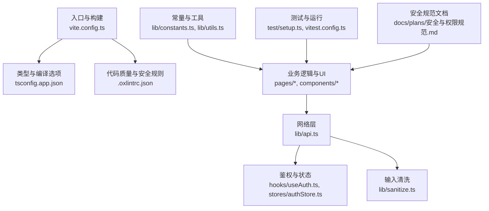
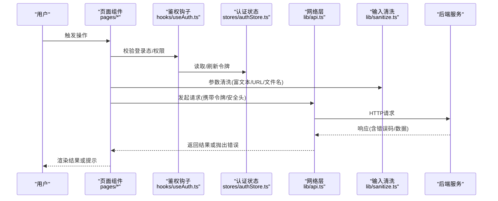
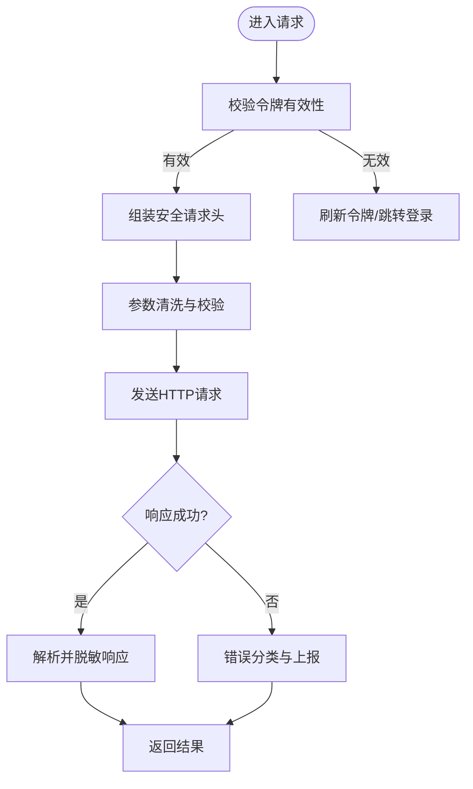
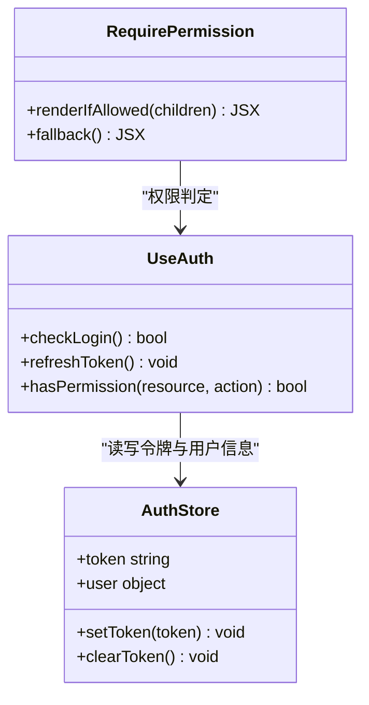
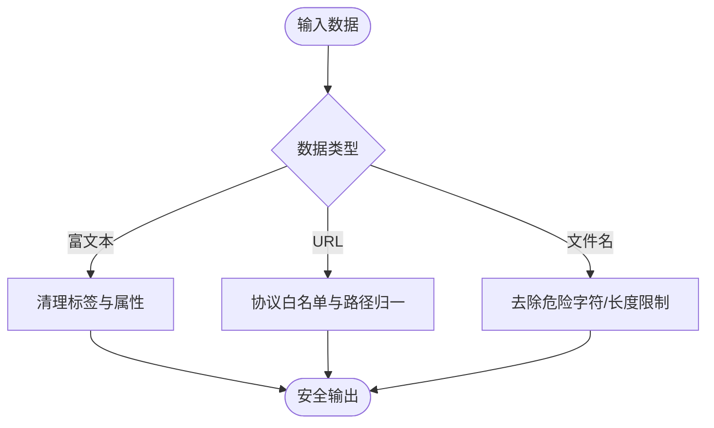
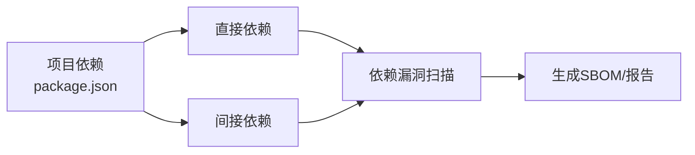

# 漏洞防护与检测

<cite>
**本文引用的文件**   
- [web/.oxlintrc.json](file://web/.oxlintrc.json)
- [web/package.json](file://web/package.json)
- [web/tsconfig.app.json](file://web/tsconfig.app.json)
- [web/vite.config.ts](file://web/vite.config.ts)
- [web/src/lib/api.ts](file://web/src/lib/api.ts)
- [web/src/lib/sanitize.ts](file://web/src/lib/sanitize.ts)
- [web/src/hooks/useAuth.ts](file://web/src/hooks/useAuth.ts)
- [web/src/stores/authStore.ts](file://web/src/stores/authStore.ts)
- [web/src/pages/login/index.tsx](file://web/src/pages/login/index.tsx)
- [web/src/components/layout/require-permission.tsx](file://web/src/components/layout/require-permission.tsx)
- [web/src/lib/constants.ts](file://web/src/lib/constants.ts)
- [web/src/lib/utils.ts](file://web/src/lib/utils.ts)
- [web/src/test/setup.ts](file://web/src/test/setup.ts)
- [web/vitest.config.ts](file://web/vitest.config.ts)
- [docs/plans/安全与权限规范.md](file://docs/plans/安全与权限规范.md)
</cite>

## 目录
1. [简介](#简介)
2. [项目结构](#项目结构)
3. [核心组件](#核心组件)
4. [架构总览](#架构总览)
5. [详细组件分析](#详细组件分析)
6. [依赖分析](#依赖分析)
7. [性能考虑](#性能考虑)
8. [故障排查指南](#故障排查指南)
9. [结论](#结论)
10. [附录](#附录)

## 简介
本指南面向pj3前端工程，围绕“漏洞防护与安全检测”提供从静态到动态、从开发到运维的全链路实践建议。内容覆盖：
- 常见前端威胁（CSRF、点击劫持、中间人攻击等）的识别与防护策略
- 静态代码分析与质量保障（Oxlint安全规则、ESLint安全插件、TypeScript严格模式）
- 动态安全扫描与运行时监控（依赖漏洞扫描、运行时异常采集、性能瓶颈定位）
- 渗透测试流程与工具（手动审计、自动化扫描、配置核查）
- 安全事件监测与响应（日志分析、异常行为检测、告警配置）
- 安全开发生命周期（SDL）落地与持续改进

## 项目结构
本项目为基于Vite的前端应用，关键安全相关位置如下：
- 构建与类型检查：vite.config.ts、tsconfig.app.json
- 代码质量与安全规则：web/.oxlintrc.json、package.json（脚本与依赖）
- 网络请求与鉴权：src/lib/api.ts、src/hooks/useAuth.ts、src/stores/authStore.ts
- 输入输出与数据清洗：src/lib/sanitize.ts
- 页面与权限控制：src/pages/login/index.tsx、src/components/layout/require-permission.tsx
- 常量与工具：src/lib/constants.ts、src/lib/utils.ts
- 测试与运行环境：src/test/setup.ts、vitest.config.ts
- 安全规范文档：docs/plans/安全与权限规范.md

**图示来源**
- [web/vite.config.ts](file://web/vite.config.ts)
- [web/tsconfig.app.json](file://web/tsconfig.app.json)
- [web/.oxlintrc.json](file://web/.oxlintrc.json)
- [web/src/lib/api.ts](file://web/src/lib/api.ts)
- [web/src/hooks/useAuth.ts](file://web/src/hooks/useAuth.ts)
- [web/src/stores/authStore.ts](file://web/src/stores/authStore.ts)
- [web/src/lib/sanitize.ts](file://web/src/lib/sanitize.ts)
- [web/src/pages/login/index.tsx](file://web/src/pages/login/index.tsx)
- [web/src/components/layout/require-permission.tsx](file://web/src/components/layout/require-permission.tsx)
- [web/src/lib/constants.ts](file://web/src/lib/constants.ts)
- [web/src/lib/utils.ts](file://web/src/lib/utils.ts)
- [web/src/test/setup.ts](file://web/src/test/setup.ts)
- [web/vitest.config.ts](file://web/vitest.config.ts)
- [docs/plans/安全与权限规范.md](file://docs/plans/安全与权限规范.md)

**章节来源**
- [web/vite.config.ts](file://web/vite.config.ts)
- [web/tsconfig.app.json](file://web/tsconfig.app.json)
- [web/.oxlintrc.json](file://web/.oxlintrc.json)
- [web/package.json](file://web/package.json)
- [docs/plans/安全与权限规范.md](file://docs/plans/安全与权限规范.md)

## 核心组件
- 网络请求封装（api.ts）：统一处理请求头、错误码、鉴权令牌注入与重试策略，是防范XSS、CSRF、MITM的关键接入点。
- 鉴权与权限（useAuth.ts、authStore.ts、require-permission.tsx）：集中管理登录态、角色与资源访问控制，避免越权与未授权访问。
- 输入清洗（sanitize.ts）：对富文本、URL、文件名等高风险输入进行净化，降低XSS与路径穿越风险。
- 常量与工具（constants.ts、utils.ts）：集中定义API基础地址、超时、白名单等安全相关常量与通用方法。
- 构建与类型（vite.config.ts、tsconfig.app.json）：通过严格类型与构建期检查减少潜在的安全缺陷。
- 代码质量（.oxlintrc.json、package.json）：集成Oxlint与ESLint安全规则，提升代码安全性与一致性。

**章节来源**
- [web/src/lib/api.ts](file://web/src/lib/api.ts)
- [web/src/hooks/useAuth.ts](file://web/src/hooks/useAuth.ts)
- [web/src/stores/authStore.ts](file://web/src/stores/authStore.ts)
- [web/src/components/layout/require-permission.tsx](file://web/src/components/layout/require-permission.tsx)
- [web/src/lib/sanitize.ts](file://web/src/lib/sanitize.ts)
- [web/src/lib/constants.ts](file://web/src/lib/constants.ts)
- [web/src/lib/utils.ts](file://web/src/lib/utils.ts)
- [web/vite.config.ts](file://web/vite.config.ts)
- [web/tsconfig.app.json](file://web/tsconfig.app.json)
- [web/.oxlintrc.json](file://web/.oxlintrc.json)
- [web/package.json](file://web/package.json)

## 架构总览
下图展示一次受保护的API调用在前后端的交互流程，体现鉴权、清洗、错误处理与监控的关键节点。

**图示来源**
- [web/src/pages/login/index.tsx](file://web/src/pages/login/index.tsx)
- [web/src/hooks/useAuth.ts](file://web/src/hooks/useAuth.ts)
- [web/src/stores/authStore.ts](file://web/src/stores/authStore.ts)
- [web/src/lib/api.ts](file://web/src/lib/api.ts)
- [web/src/lib/sanitize.ts](file://web/src/lib/sanitize.ts)

## 详细组件分析

### 网络层与请求安全（api.ts）
- 职责：统一封装HTTP请求、拦截器、错误处理、重试与鉴权头注入。
- 安全要点：
  - 强制HTTPS与证书校验（由构建与代理配置保证）。
  - 敏感头与Cookie策略（SameSite、Secure、HttpOnly）。
  - 请求参数与响应数据的白名单校验与脱敏。
  - 失败重试与幂等性保护（GET/只读可重试，写操作谨慎）。
  - 跨域与CORS最小化暴露。
- 建议增强：
  - 增加CSRF Token传递与校验（若使用表单提交）。
  - 统一错误上报与追踪ID。
  - 对大响应体启用流式处理与大小限制。

**图示来源**
- [web/src/lib/api.ts](file://web/src/lib/api.ts)
- [web/src/lib/sanitize.ts](file://web/src/lib/sanitize.ts)
- [web/src/hooks/useAuth.ts](file://web/src/hooks/useAuth.ts)
- [web/src/stores/authStore.ts](file://web/src/stores/authStore.ts)

**章节来源**
- [web/src/lib/api.ts](file://web/src/lib/api.ts)
- [web/src/lib/sanitize.ts](file://web/src/lib/sanitize.ts)
- [web/src/hooks/useAuth.ts](file://web/src/hooks/useAuth.ts)
- [web/src/stores/authStore.ts](file://web/src/stores/authStore.ts)

### 鉴权与权限控制（useAuth.ts、authStore.ts、require-permission.tsx）
- 职责：维护登录态、令牌生命周期、角色与资源级权限判断，并在路由与组件层做拦截。
- 安全要点：
  - 令牌存储安全（优先内存或HttpOnly Cookie；避免明文localStorage）。
  - 令牌刷新与过期处理（静默刷新、失败回退登录）。
  - 细粒度权限模型（RBAC/ABAC），服务端二次校验。
  - 敏感操作的二次确认与防重放。
- 建议增强：
  - 引入短期令牌+长期刷新令牌机制。
  - 记录鉴权失败与越权尝试日志。
  - 对高敏接口增加设备指纹或一次性验证码。

**图示来源**
- [web/src/hooks/useAuth.ts](file://web/src/hooks/useAuth.ts)
- [web/src/stores/authStore.ts](file://web/src/stores/authStore.ts)
- [web/src/components/layout/require-permission.tsx](file://web/src/components/layout/require-permission.tsx)

**章节来源**
- [web/src/hooks/useAuth.ts](file://web/src/hooks/useAuth.ts)
- [web/src/stores/authStore.ts](file://web/src/stores/authStore.ts)
- [web/src/components/layout/require-permission.tsx](file://web/src/components/layout/require-permission.tsx)

### 输入清洗与输出编码（sanitize.ts）
- 职责：对富文本、URL、文件名、HTML片段等进行净化与转义，防止XSS与注入。
- 安全要点：
  - 白名单过滤与标签/属性裁剪。
  - URL协议白名单与相对路径规范化。
  - 文件名去危险字符与长度限制。
- 建议增强：
  - 结合上下文选择合适编码策略（HTML/JS/CSS/URL）。
  - 对第三方库输出进行二次校验。
  - 建立统一的清洗API供全项目复用。

**图示来源**
- [web/src/lib/sanitize.ts](file://web/src/lib/sanitize.ts)

**章节来源**
- [web/src/lib/sanitize.ts](file://web/src/lib/sanitize.ts)

### 构建与类型安全（vite.config.ts、tsconfig.app.json）
- 职责：构建配置与TS严格模式，提升编译期发现问题的能力。
- 安全要点：
  - 开启严格类型检查，禁用any滥用。
  - 禁止不安全特性（如eval、with）。
  - 生产构建优化与SourceMap策略。
- 建议增强：
  - 引入环境变量隔离与密钥注入策略。
  - 对第三方包版本锁定与签名校验。

**章节来源**
- [web/vite.config.ts](file://web/vite.config.ts)
- [web/tsconfig.app.json](file://web/tsconfig.app.json)

### 代码质量与安全规则（.oxlintrc.json、package.json）
- 职责：集成Oxlint与ESLint安全规则，统一代码风格与安全基线。
- 安全要点：
  - 启用安全相关规则（如禁止内联脚本、限制dangerouslySetInnerHTML）。
  - 禁止不安全的字符串拼接与动态导入。
  - 统一错误处理与日志格式。
- 建议增强：
  - 将安全规则纳入CI门禁。
  - 定期更新规则集与依赖。

**章节来源**
- [web/.oxlintrc.json](file://web/.oxlintrc.json)
- [web/package.json](file://web/package.json)

### 测试与环境（setup.ts、vitest.config.ts）
- 职责：测试初始化与运行配置，确保测试环境与生产一致。
- 安全要点：
  - 模拟网络层与鉴权，验证错误分支。
  - 断言安全头与清洗逻辑生效。
- 建议增强：
  - 增加安全用例（XSS、越权、CSRF）。
  - 引入模糊测试与契约测试。

**章节来源**
- [web/src/test/setup.ts](file://web/src/test/setup.ts)
- [web/vitest.config.ts](file://web/vitest.config.ts)

## 依赖分析
- 直接依赖：Vite、React生态、类型与工具库。
- 间接依赖：第三方组件与工具链。
- 安全风险：
  - 已知CVE与许可证合规。
  - 供应链投毒与恶意包。
- 缓解措施：
  - 使用锁文件与固定版本。
  - 定期执行依赖漏洞扫描。
  - 引入软件物料清单（SBOM）与签名校验。

**图示来源**
- [web/package.json](file://web/package.json)

**章节来源**
- [web/package.json](file://web/package.json)

## 性能考虑
- 首屏与资源体积：按需加载、Tree Shaking、图片与字体压缩。
- 网络开销：缓存策略、CDN、请求合并与去抖节流。
- 运行时监控：错误率、慢请求、内存泄漏与FPS指标。
- 建议：
  - 对长列表与大数据量采用虚拟滚动与分页。
  - 关键路径预取与懒加载。
  - 性能预算与回归告警。

[本节为通用指导，无需特定文件引用]

## 故障排查指南
- 常见问题：
  - 鉴权失败与令牌过期：检查令牌刷新流程与存储策略。
  - XSS告警：审查富文本渲染与输出编码。
  - CORS报错：核对白名单与请求头。
  - CSRF误报：确认是否使用表单提交及Token传递。
- 排查步骤：
  - 复现路径与最小用例。
  - 查看浏览器控制台与网络面板。
  - 检查服务端日志与错误上报。
  - 回归测试与修复验证。

**章节来源**
- [web/src/lib/api.ts](file://web/src/lib/api.ts)
- [web/src/hooks/useAuth.ts](file://web/src/hooks/useAuth.ts)
- [web/src/lib/sanitize.ts](file://web/src/lib/sanitize.ts)

## 结论
通过在构建期、代码期、运行期与运维期的多阶段加固，pj3前端可在CSRF、点击劫持、MITM、XSS、越权等常见威胁上形成闭环防护。配合静态分析、依赖扫描、渗透测试与持续监控，可实现安全左移与持续改进。

[本节为总结性内容，无需特定文件引用]

## 附录

### 常见前端威胁与防护策略
- CSRF
  - 防护：SameSite Cookie、CSRF Token校验、Referer/SOrigin校验、仅允许可信源。
  - 适用场景：表单提交与非幂等操作。
- 点击劫持
  - 防护：X-Frame-Options、Content-Security-Policy frame-ancestors、禁止iframe嵌入。
- 中间人攻击（MITM）
  - 防护：强制HTTPS、HSTS、证书固定（移动端）、最小化CORS。
- XSS
  - 防护：输入清洗、输出编码、禁用危险API、CSP脚本白名单。
- 越权访问
  - 防护：服务端二次校验、最小权限原则、资源级鉴权。
- 敏感信息泄露
  - 防护：避免在日志与前端暴露密钥、脱敏输出、最小必要字段。

[本节为通用指导，无需特定文件引用]

### 静态代码分析与质量保障
- Oxlint安全规则
  - 启用安全相关规则，禁止危险用法，统一错误处理。
- ESLint安全插件
  - 集成security插件，扫描潜在漏洞模式。
- TypeScript严格模式
  - 开启strict、noImplicitAny、noUnusedLocals等，减少运行时风险。
- CI门禁
  - 将安全规则与扫描纳入流水线，阻断高危问题。

**章节来源**
- [web/.oxlintrc.json](file://web/.oxlintrc.json)
- [web/package.json](file://web/package.json)
- [web/tsconfig.app.json](file://web/tsconfig.app.json)

### 动态安全扫描与运行时监控
- 依赖漏洞扫描
  - 使用npm audit或专业工具，定期生成报告并修复。
- 运行时安全监控
  - 采集错误堆栈、网络异常、鉴权失败与越权尝试。
- 性能瓶颈检测
  - 监控慢请求、内存占用、渲染耗时，设置阈值告警。

**章节来源**
- [web/src/lib/api.ts](file://web/src/lib/api.ts)
- [web/src/test/setup.ts](file://web/src/test/setup.ts)
- [web/vitest.config.ts](file://web/vitest.config.ts)

### 渗透测试流程与工具
- 手动安全审计
  - 审查鉴权、输入输出、错误处理与日志。
- 自动化漏洞扫描
  - 使用DAST/SAST工具扫描前端与接口。
- 安全配置检查
  - 校验CSP、CORS、Cookie策略与HTTPS配置。

**章节来源**
- [docs/plans/安全与权限规范.md](file://docs/plans/安全与权限规范.md)

### 安全事件监测与响应
- 错误日志分析
  - 统一日志格式、关联追踪ID、分级上报。
- 异常行为检测
  - 识别高频失败、越权尝试、异常UA与地域。
- 安全告警配置
  - 设定阈值与通知渠道，联动工单与应急流程。

**章节来源**
- [web/src/lib/api.ts](file://web/src/lib/api.ts)
- [web/src/hooks/useAuth.ts](file://web/src/hooks/useAuth.ts)

### 安全开发生命周期（SDL）与持续改进
- 需求与设计
  - 威胁建模、安全需求、隐私影响评估。
- 开发与评审
  - 安全编码规范、代码评审、静态扫描。
- 测试与验收
  - 安全用例、渗透测试、回归验证。
- 发布与运维
  - 灰度发布、监控告警、应急响应。
- 持续改进
  - 复盘与度量、规则与依赖升级、培训与演练。

**章节来源**
- [docs/plans/安全与权限规范.md](file://docs/plans/安全与权限规范.md)