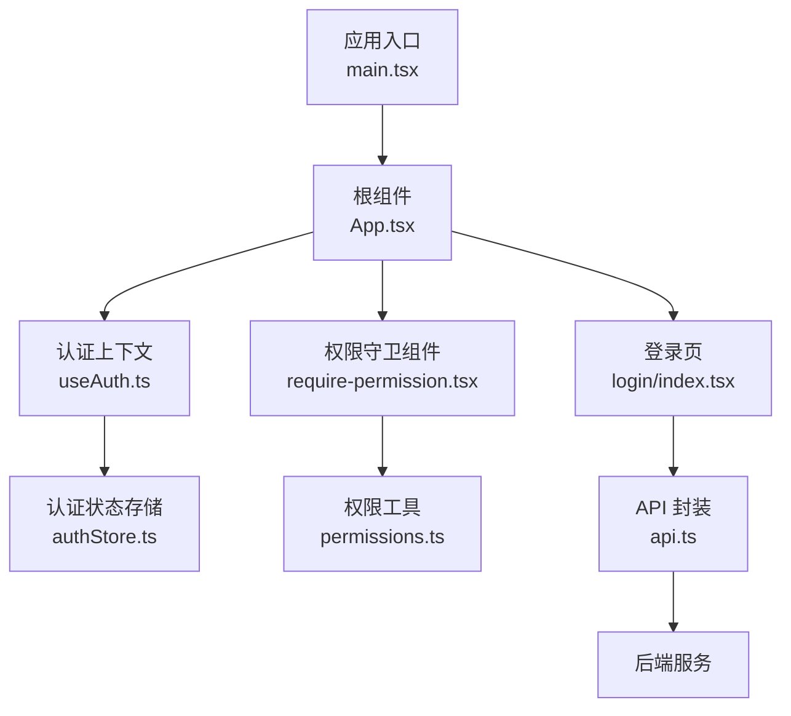
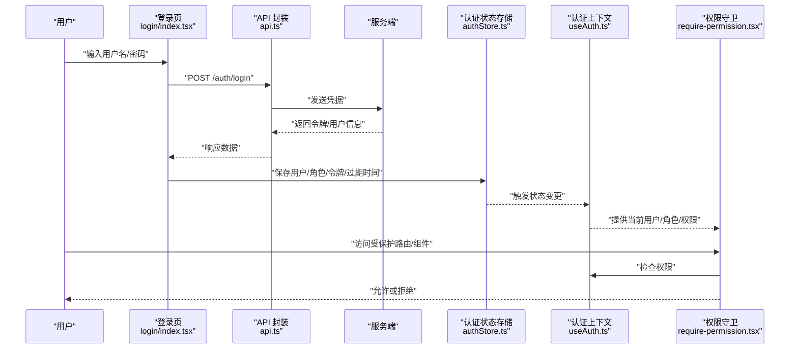
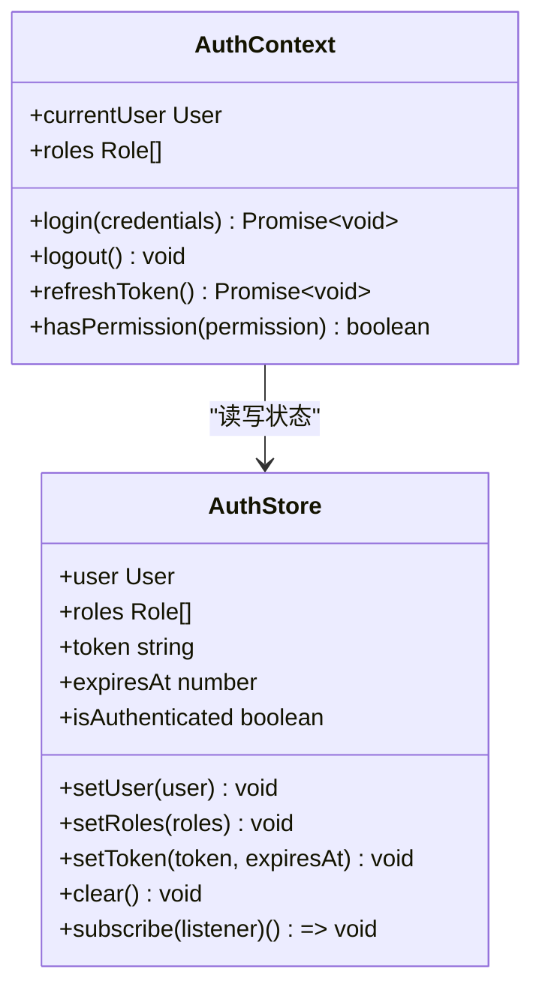
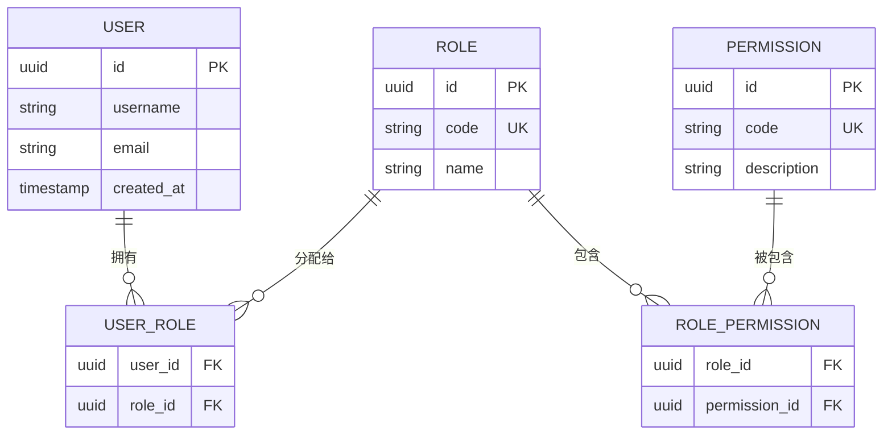
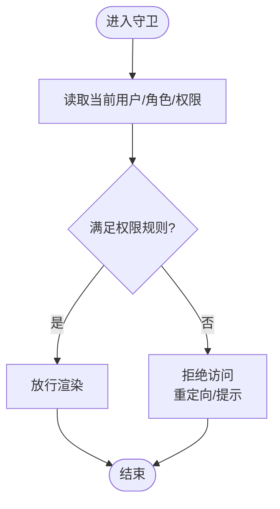
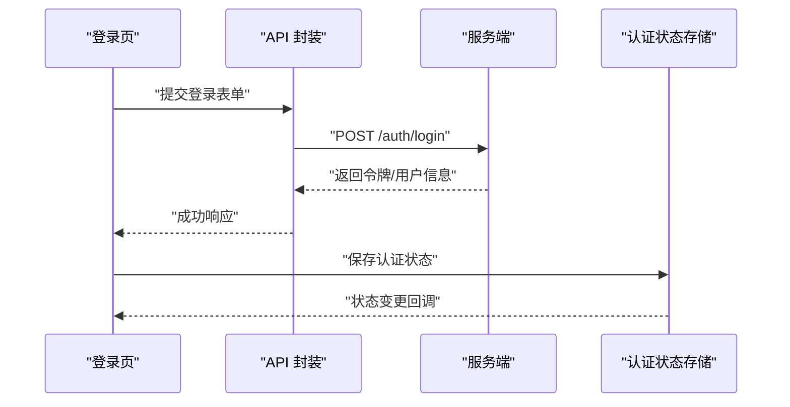
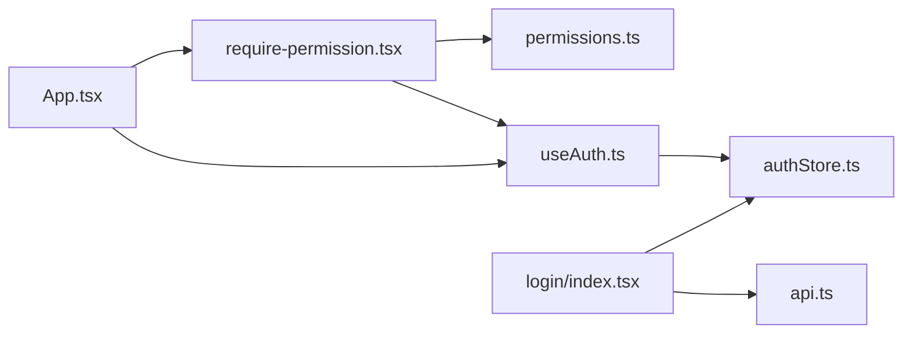

# 认证与授权安全

<cite>
**本文引用的文件**   
- [web/src/hooks/useAuth.ts](file://web/src/hooks/useAuth.ts)
- [web/src/stores/authStore.ts](file://web/src/stores/authStore.ts)
- [web/src/components/layout/require-permission.tsx](file://web/src/components/layout/require-permission.tsx)
- [web/src/lib/permissions.ts](file://web/src/lib/permissions.ts)
- [web/src/pages/login/index.tsx](file://web/src/pages/login/index.tsx)
- [web/src/lib/api.ts](file://web/src/lib/api.ts)
- [web/src/types/index.ts](file://web/src/types/index.ts)
- [web/src/App.tsx](file://web/src/App.tsx)
- [web/src/main.tsx](file://web/src/main.tsx)
- [web/vite.config.ts](file://web/vite.config.ts)
- [web/package.json](file://web/package.json)
</cite>

## 目录
1. [简介](#简介)
2. [项目结构](#项目结构)
3. [核心组件](#核心组件)
4. [架构总览](#架构总览)
5. [详细组件分析](#详细组件分析)
6. [依赖关系分析](#依赖关系分析)
7. [性能与安全考量](#性能与安全考量)
8. [故障排查指南](#故障排查指南)
9. [结论](#结论)
10. [附录](#附录)

## 简介
本文件聚焦 pj3 项目的认证与授权安全实现，围绕以下目标展开：
- 用户认证流程的安全实现：登录验证、密码加密存储（前端侧）、会话管理。
- 基于角色的访问控制（RBAC）：权限定义、角色分配、权限检查策略。
- useAuth 钩子与 authStore 状态管理的安全模式：防止未授权访问与权限提升。
- 权限守卫组件：路由级与组件级权限控制。
- JWT 令牌处理、会话超时管理、多设备登录控制等高级特性。
- 常见认证漏洞防护与最佳实践。

说明：
- 本文所有分析与建议均基于仓库中现有前端代码与文档；若后端实现存在差异，请以实际接口契约为准。
- 为便于理解，文中包含架构图、时序图、流程图与类图，并在“图示来源”中标注对应源码文件与行号范围。

## 项目结构
与认证与授权相关的前端关键位置如下：
- 认证状态与上下文：hooks/useAuth.ts、stores/authStore.ts
- 权限模型与工具：lib/permissions.ts、types/index.ts
- 权限守卫组件：components/layout/require-permission.tsx
- 登录页面：pages/login/index.tsx
- API 请求封装：lib/api.ts
- 应用入口与路由：App.tsx、main.tsx
- 构建配置与依赖：vite.config.ts、package.json

图示来源
- [web/src/main.tsx:1-50](file://web/src/main.tsx#L1-L50)
- [web/src/App.tsx:1-120](file://web/src/App.tsx#L1-L120)
- [web/src/hooks/useAuth.ts:1-200](file://web/src/hooks/useAuth.ts#L1-L200)
- [web/src/stores/authStore.ts:1-200](file://web/src/stores/authStore.ts#L1-L200)
- [web/src/components/layout/require-permission.tsx:1-200](file://web/src/components/layout/require-permission.tsx#L1-L200)
- [web/src/lib/permissions.ts:1-200](file://web/src/lib/permissions.ts#L1-L200)
- [web/src/pages/login/index.tsx:1-200](file://web/src/pages/login/index.tsx#L1-L200)
- [web/src/lib/api.ts:1-200](file://web/src/lib/api.ts#L1-L200)

章节来源
- [web/src/main.tsx:1-50](file://web/src/main.tsx#L1-L50)
- [web/src/App.tsx:1-120](file://web/src/App.tsx#L1-L120)
- [web/src/hooks/useAuth.ts:1-200](file://web/src/hooks/useAuth.ts#L1-L200)
- [web/src/stores/authStore.ts:1-200](file://web/src/stores/authStore.ts#L1-L200)
- [web/src/components/layout/require-permission.tsx:1-200](file://web/src/components/layout/require-permission.tsx#L1-L200)
- [web/src/lib/permissions.ts:1-200](file://web/src/lib/permissions.ts#L1-L200)
- [web/src/pages/login/index.tsx:1-200](file://web/src/pages/login/index.tsx#L1-L200)
- [web/src/lib/api.ts:1-200](file://web/src/lib/api.ts#L1-L200)

## 核心组件
本节概述认证与授权的关键模块及其职责：
- useAuth 钩子：提供登录、登出、刷新令牌、获取当前用户与角色、判断权限等能力，并负责与 authStore 交互。
- authStore：集中管理认证状态（用户信息、角色、令牌、过期时间、是否已认证），并提供持久化与事件订阅。
- require-permission 权限守卫：在路由或组件层级进行权限校验，拒绝未授权访问。
- permissions 工具：定义权限常量、角色集合、权限判定逻辑。
- login 页面：收集凭据、调用认证接口、更新认证状态。
- api 封装：统一拦截器处理令牌注入、错误码映射、会话失效跳转。

章节来源
- [web/src/hooks/useAuth.ts:1-200](file://web/src/hooks/useAuth.ts#L1-L200)
- [web/src/stores/authStore.ts:1-200](file://web/src/stores/authStore.ts#L1-L200)
- [web/src/components/layout/require-permission.tsx:1-200](file://web/src/components/layout/require-permission.tsx#L1-L200)
- [web/src/lib/permissions.ts:1-200](file://web/src/lib/permissions.ts#L1-L200)
- [web/src/pages/login/index.tsx:1-200](file://web/src/pages/login/index.tsx#L1-L200)
- [web/src/lib/api.ts:1-200](file://web/src/lib/api.ts#L1-L200)

## 架构总览
下图展示认证与授权的端到端流程：从登录到鉴权再到受保护资源访问。

图示来源
- [web/src/pages/login/index.tsx:1-200](file://web/src/pages/login/index.tsx#L1-L200)
- [web/src/lib/api.ts:1-200](file://web/src/lib/api.ts#L1-L200)
- [web/src/stores/authStore.ts:1-200](file://web/src/stores/authStore.ts#L1-L200)
- [web/src/hooks/useAuth.ts:1-200](file://web/src/hooks/useAuth.ts#L1-L200)
- [web/src/components/layout/require-permission.tsx:1-200](file://web/src/components/layout/require-permission.tsx#L1-L200)

## 详细组件分析

### 认证上下文与状态管理（useAuth 与 authStore）
- 职责划分
  - useAuth：暴露认证操作与查询方法，封装业务语义（如登录、登出、刷新令牌、判断权限）。
  - authStore：维护认证状态、持久化、订阅通知、清理与恢复。
- 安全要点
  - 最小化敏感数据暴露：仅存储必要字段（用户标识、角色、令牌、过期时间）。
  - 令牌生命周期管理：设置合理过期时间，支持刷新机制；过期后自动登出或静默刷新。
  - 防重放与会话劫持：避免将敏感信息写入可被外部脚本读取的位置；使用安全的存储策略。
  - 状态一致性：通过事件驱动确保跨组件一致性与幂等性。

图示来源
- [web/src/hooks/useAuth.ts:1-200](file://web/src/hooks/useAuth.ts#L1-L200)
- [web/src/stores/authStore.ts:1-200](file://web/src/stores/authStore.ts#L1-L200)

章节来源
- [web/src/hooks/useAuth.ts:1-200](file://web/src/hooks/useAuth.ts#L1-L200)
- [web/src/stores/authStore.ts:1-200](file://web/src/stores/authStore.ts#L1-L200)

### 权限模型与 RBAC（permissions 与类型定义）
- 设计要点
  - 权限与角色分离：角色作为权限的集合，便于扩展与维护。
  - 权限粒度：按资源+动作定义（如 resource:action），支持细粒度控制。
  - 默认拒绝：未明确授予的权限一律拒绝。
- 数据结构
  - 用户：包含唯一标识、基本信息、角色列表。
  - 角色：包含角色标识、名称、权限集合。
  - 权限：字符串或对象形式，用于快速判定。

图示来源
- [web/src/types/index.ts:1-200](file://web/src/types/index.ts#L1-L200)
- [web/src/lib/permissions.ts:1-200](file://web/src/lib/permissions.ts#L1-L200)

章节来源
- [web/src/types/index.ts:1-200](file://web/src/types/index.ts#L1-L200)
- [web/src/lib/permissions.ts:1-200](file://web/src/lib/permissions.ts#L1-L200)

### 权限守卫组件（require-permission）
- 功能
  - 路由级：在路由渲染前检查用户是否具备所需权限，否则重定向至未授权页面或登录页。
  - 组件级：包裹任意组件，按需显示或隐藏，避免越权 UI 暴露。
- 实现思路
  - 从认证上下文获取当前用户与角色。
  - 根据传入的权限规则进行判定（支持单权限、多权限组合、通配符等）。
  - 失败时执行降级策略（跳转、空白占位、提示消息）。

图示来源
- [web/src/components/layout/require-permission.tsx:1-200](file://web/src/components/layout/require-permission.tsx#L1-L200)
- [web/src/hooks/useAuth.ts:1-200](file://web/src/hooks/useAuth.ts#L1-L200)
- [web/src/lib/permissions.ts:1-200](file://web/src/lib/permissions.ts#L1-L200)

章节来源
- [web/src/components/layout/require-permission.tsx:1-200](file://web/src/components/layout/require-permission.tsx#L1-L200)
- [web/src/hooks/useAuth.ts:1-200](file://web/src/hooks/useAuth.ts#L1-L200)
- [web/src/lib/permissions.ts:1-200](file://web/src/lib/permissions.ts#L1-L200)

### 登录流程与 API 封装
- 登录流程
  - 收集凭据并进行基础校验。
  - 调用认证接口，接收令牌与用户信息。
  - 更新认证状态与持久化存储。
  - 跳转到目标页面或保留原路径。
- API 封装
  - 请求拦截：附加令牌头、重试策略、错误码映射。
  - 响应拦截：处理会话失效、令牌刷新、全局错误提示。

图示来源
- [web/src/pages/login/index.tsx:1-200](file://web/src/pages/login/index.tsx#L1-L200)
- [web/src/lib/api.ts:1-200](file://web/src/lib/api.ts#L1-L200)
- [web/src/stores/authStore.ts:1-200](file://web/src/stores/authStore.ts#L1-L200)

章节来源
- [web/src/pages/login/index.tsx:1-200](file://web/src/pages/login/index.tsx#L1-L200)
- [web/src/lib/api.ts:1-200](file://web/src/lib/api.ts#L1-L200)
- [web/src/stores/authStore.ts:1-200](file://web/src/stores/authStore.ts#L1-L200)

### 应用入口与路由集成
- 入口初始化：加载认证状态、恢复会话、注册全局错误处理器。
- 路由集成：在路由层挂载权限守卫，结合动态路由实现菜单与页面可见性控制。

章节来源
- [web/src/main.tsx:1-50](file://web/src/main.tsx#L1-L50)
- [web/src/App.tsx:1-120](file://web/src/App.tsx#L1-L120)

## 依赖关系分析
- 模块耦合
  - useAuth 强依赖 authStore，提供高层 API。
  - require-permission 依赖 useAuth 与 permissions 工具。
  - login 页面依赖 api 封装与 authStore。
- 外部依赖
  - 构建与运行时依赖由 package.json 与 vite.config.ts 管理。

图示来源
- [web/src/hooks/useAuth.ts:1-200](file://web/src/hooks/useAuth.ts#L1-L200)
- [web/src/stores/authStore.ts:1-200](file://web/src/stores/authStore.ts#L1-L200)
- [web/src/components/layout/require-permission.tsx:1-200](file://web/src/components/layout/require-permission.tsx#L1-L200)
- [web/src/lib/permissions.ts:1-200](file://web/src/lib/permissions.ts#L1-L200)
- [web/src/pages/login/index.tsx:1-200](file://web/src/pages/login/index.tsx#L1-L200)
- [web/src/lib/api.ts:1-200](file://web/src/lib/api.ts#L1-L200)
- [web/src/App.tsx:1-120](file://web/src/App.tsx#L1-L120)

章节来源
- [web/package.json:1-200](file://web/package.json#L1-L200)
- [web/vite.config.ts:1-200](file://web/vite.config.ts#L1-L200)

## 性能与安全考量
- 性能
  - 减少不必要的状态订阅与重渲染，按需拆分权限检查逻辑。
  - 对高频权限判定进行缓存与去抖。
- 安全
  - 令牌安全：设置合理的过期时间与刷新策略，避免长期有效令牌。
  - 存储安全：谨慎选择存储介质，避免 XSS 读取敏感信息。
  - 传输安全：强制 HTTPS，启用严格的安全头。
  - 最小权限原则：默认拒绝，显式授予。
  - 会话管理：支持多设备登录控制与并发会话限制。
  - 输入校验：前后端双重校验，防止注入与越权。

[本节为通用指导，不直接分析具体文件]

## 故障排查指南
- 常见问题
  - 登录后仍被重定向：检查认证状态是否正确持久化与恢复。
  - 权限不足：确认角色与权限映射是否正确，守卫规则是否匹配。
  - 令牌失效：检查过期时间、刷新逻辑与服务端会话状态。
  - 跨域问题：核对 CORS 配置与安全头。
- 定位步骤
  - 查看网络请求与响应，确认令牌携带与错误码。
  - 检查认证状态存储内容与订阅回调。
  - 在守卫处打印权限判定结果与原因。

章节来源
- [web/src/lib/api.ts:1-200](file://web/src/lib/api.ts#L1-L200)
- [web/src/stores/authStore.ts:1-200](file://web/src/stores/authStore.ts#L1-L200)
- [web/src/components/layout/require-permission.tsx:1-200](file://web/src/components/layout/require-permission.tsx#L1-L200)

## 结论
pj3 在前端实现了较为完整的认证与授权体系：通过 useAuth 与 authStore 统一管理认证状态，结合 require-permission 实现路由与组件级权限控制，配合 permissions 工具完成 RBAC 策略。建议在后续迭代中完善令牌刷新、多设备登录控制、更细粒度的权限模型与更严格的输入校验，以提升整体安全性与可维护性。

[本节为总结，不直接分析具体文件]

## 附录
- 术语
  - RBAC：基于角色的访问控制。
  - JWT：JSON Web Token，常用于无状态认证。
  - 会话：用户登录后的上下文状态。
- 参考规范
  - 安全与权限规范（文档）
  - 后端接口约定（文档）

[本节为概念性内容，不直接分析具体文件]