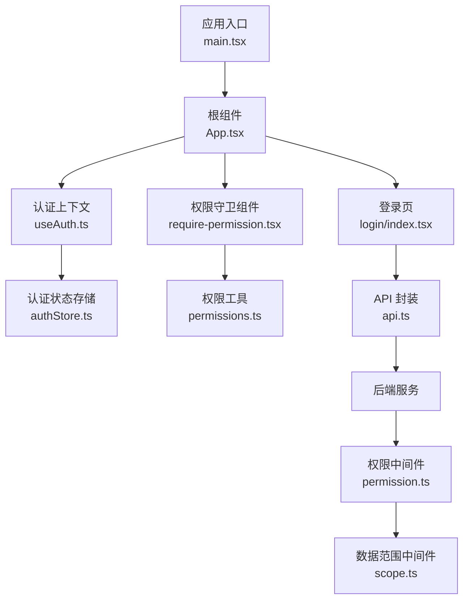
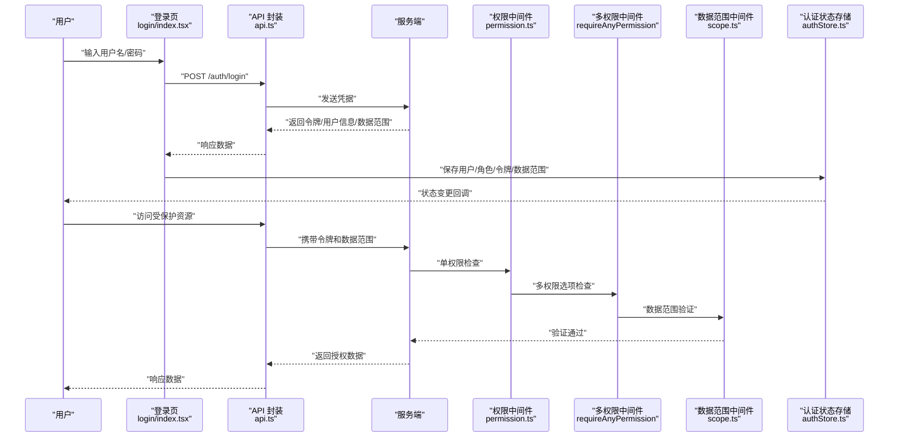
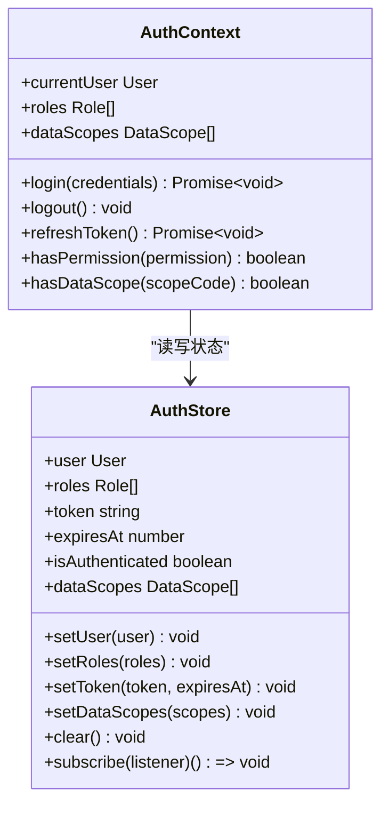
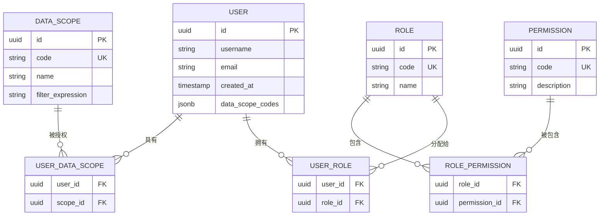
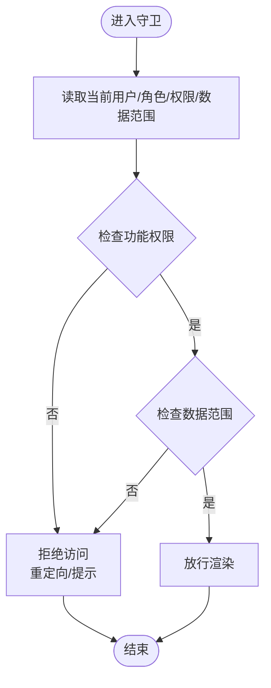
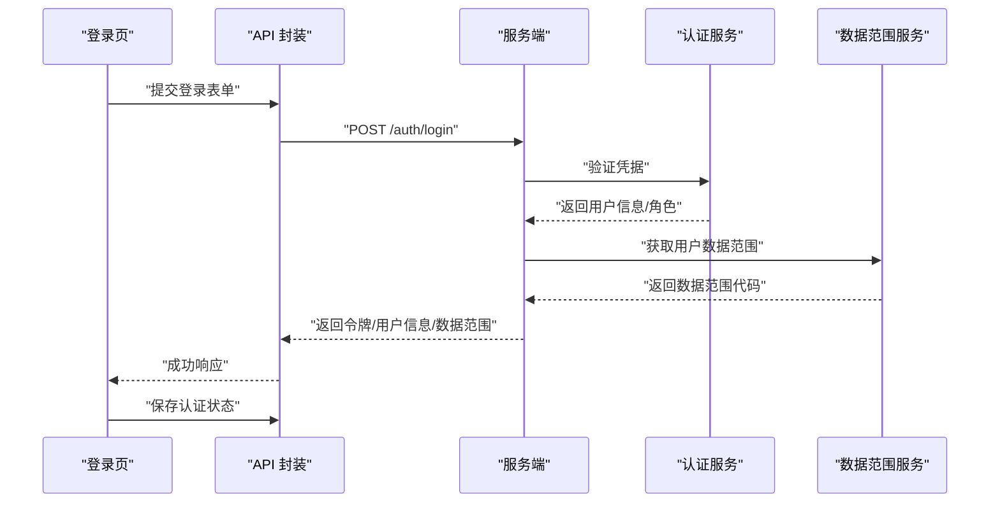
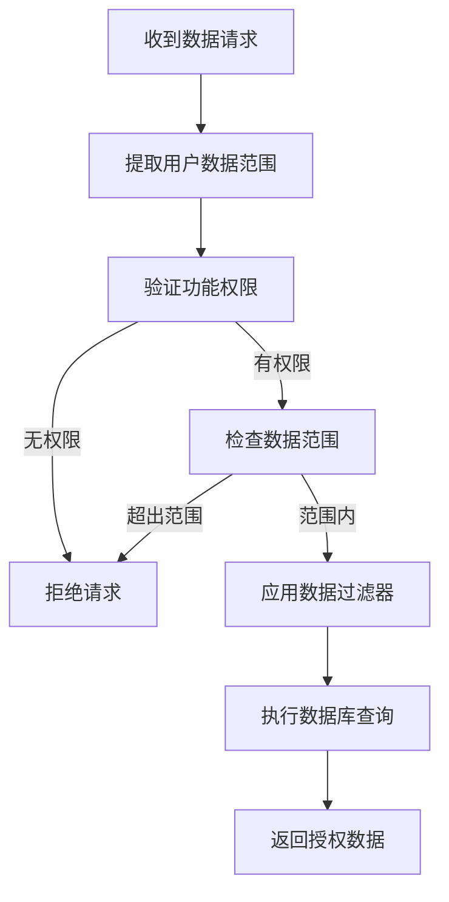
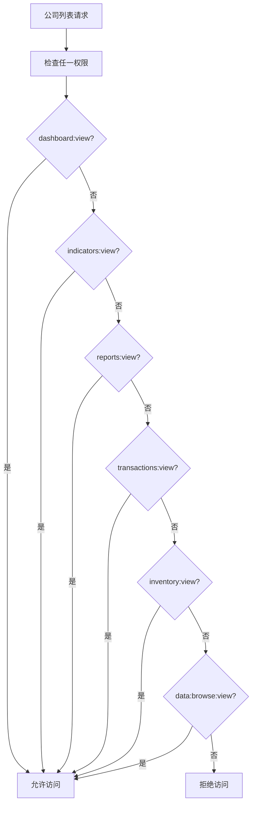
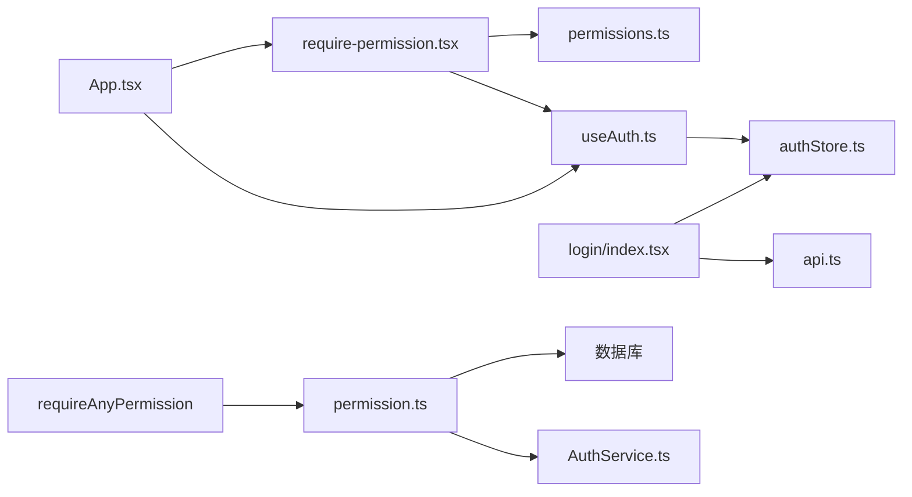

# 认证与授权安全

<cite>
**本文引用的文件**   
- [web/src/hooks/useAuth.ts](file://web/src/hooks/useAuth.ts)
- [web/src/stores/authStore.ts](file://web/src/stores/authStore.ts)
- [web/src/components/layout/require-permission.tsx](file://web/src/components/layout/require-permission.tsx)
- [web/src/lib/permissions.ts](file://web/src/lib/permissions.ts)
- [web/src/pages/login/index.tsx](file://web/src/pages/login/index.tsx)
- [web/src/lib/api.ts](file://web/src/lib/api.ts)
- [web/src/types/index.ts](file://web/src/types/index.ts)
- [web/src/App.tsx](file://web/src/App.tsx)
- [web/src/main.tsx](file://web/src/main.tsx)
- [web/vite.config.ts](file://web/vite.config.ts)
- [web/package.json](file://web/package.json)
- [server/prisma/migrations/20260728130000_add_user_data_scope_codes/migration.sql](file://server/prisma/migrations/20260728130000_add_user_data_scope_codes/migration.sql)
- [server/src/middleware/scope.ts](file://server/src/middleware/scope.ts)
- [server/src/services/AuthService.ts](file://server/src/services/AuthService.ts)
- [server/src/middleware/permission.ts](file://server/src/middleware/permission.ts)
- [server/src/routes/data.ts](file://server/src/routes/data.ts)
- [web/src/hooks/usePermission.ts](file://web/src/hooks/usePermission.ts)
</cite>

## 更新摘要
**所做更改**
- 增强了权限中间件中的 `requireAnyPermission` 函数，支持多个权限选项的 OR 逻辑判断
- 解决了只读角色无法访问公司列表过滤器的问题，通过多模块权限共享机制
- 优化了权限检查流程，提高了系统的灵活性和可维护性
- 完善了权限审计日志，记录所有候选权限的尝试情况

## 目录
1. [简介](#简介)
2. [项目结构](#项目结构)
3. [核心组件](#核心组件)
4. [架构总览](#架构总览)
5. [详细组件分析](#详细组件分析)
6. [数据范围权限系统](#数据范围权限系统)
7. **新增** 多权限选项支持机制
8. [依赖关系分析](#依赖关系分析)
9. [性能与安全考量](#性能与安全考量)
10. [故障排查指南](#故障排查指南)
11. [结论](#结论)
12. [附录](#附录)

## 简介
本文件聚焦 pj3 项目的认证与授权安全实现，围绕以下目标展开：
- 用户认证流程的安全实现：登录验证、密码加密存储（前端侧）、会话管理。
- 基于角色的访问控制（RBAC）：权限定义、角色分配、权限检查策略。
- **新增** 用户数据范围代码系统：支持基于角色和权限的细粒度数据访问控制。
- **增强** 多权限选项支持：通过 `requireAnyPermission` 函数实现灵活的权限组合判断。
- useAuth 钩子与 authStore 状态管理的安全模式：防止未授权访问与权限提升。
- 权限守卫组件：路由级与组件级权限控制。
- JWT 令牌处理、会话超时管理、多设备登录控制等高级特性。
- 常见认证漏洞防护与最佳实践。

说明：
- 本文所有分析与建议均基于仓库中现有前端代码与文档；若后端实现存在差异，请以实际接口契约为准。
- 为便于理解，文中包含架构图、时序图、流程图与类图，并在"图示来源"中标注对应源码文件与行号范围。

## 项目结构
与认证与授权相关的前端关键位置如下：
- 认证状态与上下文：hooks/useAuth.ts、stores/authStore.ts
- 权限模型与工具：lib/permissions.ts、types/index.ts
- 权限守卫组件：components/layout/require-permission.tsx
- 登录页面：pages/login/index.tsx
- API 请求封装：lib/api.ts
- 应用入口与路由：App.tsx、main.tsx
- 构建配置与依赖：vite.config.ts、package.json



**图示来源**
- [web/src/main.tsx:1-50](file://web/src/main.tsx#L1-L50)
- [web/src/App.tsx:1-120](file://web/src/App.tsx#L1-L120)
- [web/src/hooks/useAuth.ts:1-200](file://web/src/hooks/useAuth.ts#L1-L200)
- [web/src/stores/authStore.ts:1-200](file://web/src/stores/authStore.ts#L1-L200)
- [web/src/components/layout/require-permission.tsx:1-200](file://web/src/components/layout/require-permission.tsx#L1-L200)
- [web/src/lib/permissions.ts:1-200](file://web/src/lib/permissions.ts#L1-L200)
- [web/src/pages/login/index.tsx:1-200](file://web/src/pages/login/index.tsx#L1-L200)
- [web/src/lib/api.ts:1-200](file://web/src/lib/api.ts#L1-L200)
- [server/src/middleware/permission.ts:1-93](file://server/src/middleware/permission.ts#L1-L93)
- [server/src/middleware/scope.ts:1-200](file://server/src/middleware/scope.ts#L1-L200)

## 核心组件
本节概述认证与授权的关键模块及其职责：
- useAuth 钩子：提供登录、登出、刷新令牌、获取当前用户与角色、判断权限等能力，并负责与 authStore 交互。
- authStore：集中管理认证状态（用户信息、角色、令牌、过期时间、是否已认证），并提供持久化与事件订阅。
- require-permission 权限守卫：在路由或组件层级进行权限校验，拒绝未授权访问。
- permissions 工具：定义权限常量、角色集合、权限判定逻辑。
- login 页面：收集凭据、调用认证接口、更新认证状态。
- api 封装：统一拦截器处理令牌注入、错误码映射、会话失效跳转。
- **增强** 权限中间件：支持单权限检查和多权限选项检查，提供更灵活的权限控制。
- **新增** scope 中间件：在后端执行数据范围权限检查，确保用户只能访问其被授权的数据范围。

## 架构总览
下图展示认证与授权的端到端流程：从登录到鉴权再到受保护资源访问，包括增强的多权限选项支持和数据范围权限检查。



**图示来源**
- [web/src/pages/login/index.tsx:1-200](file://web/src/pages/login/index.tsx#L1-L200)
- [web/src/lib/api.ts:1-200](file://web/src/lib/api.ts#L1-L200)
- [web/src/stores/authStore.ts:1-200](file://web/src/stores/authStore.ts#L1-L200)
- [server/src/middleware/permission.ts:1-93](file://server/src/middleware/permission.ts#L1-L93)
- [server/src/middleware/scope.ts:1-200](file://server/src/middleware/scope.ts#L1-L200)

## 详细组件分析

### 认证上下文与状态管理（useAuth 与 authStore）
- 职责划分
  - useAuth：暴露认证操作与查询方法，封装业务语义（如登录、登出、刷新令牌、判断权限）。
  - authStore：维护认证状态、持久化、订阅通知、清理与恢复。
- 安全要点
  - 最小化敏感数据暴露：仅存储必要字段（用户标识、角色、令牌、过期时间、数据范围）。
  - 令牌生命周期管理：设置合理过期时间，支持刷新机制；过期后自动登出或静默刷新。
  - 防重放与会话劫持：避免将敏感信息写入可被外部脚本读取的位置；使用安全的存储策略。
  - 状态一致性：通过事件驱动确保跨组件一致性与幂等性。
  - **新增** 数据范围管理：存储和验证用户的可访问数据范围代码。



**图示来源**
- [web/src/hooks/useAuth.ts:1-200](file://web/src/hooks/useAuth.ts#L1-L200)
- [web/src/stores/authStore.ts:1-200](file://web/src/stores/authStore.ts#L1-L200)

### 权限模型与 RBAC（permissions 与类型定义）
- 设计要点
  - 权限与角色分离：角色作为权限的集合，便于扩展与维护。
  - 权限粒度：按资源+动作定义（如 resource:action），支持细粒度控制。
  - 默认拒绝：未明确授予的权限一律拒绝。
  - **新增** 数据范围权限：支持基于数据范围代码的细粒度数据访问控制。
  - **增强** 多权限选项：支持 OR 逻辑的权限组合判断。
- 数据结构
  - 用户：包含唯一标识、基本信息、角色列表、数据范围代码。
  - 角色：包含角色标识、名称、权限集合、数据范围权限。
  - 权限：字符串或对象形式，用于快速判定。
  - 数据范围：定义可访问的数据边界和过滤条件。



**图示来源**
- [web/src/types/index.ts:1-200](file://web/src/types/index.ts#L1-L200)
- [web/src/lib/permissions.ts:1-128](file://web/src/lib/permissions.ts#L1-L128)
- [server/prisma/migrations/20260728130000_add_user_data_scope_codes/migration.sql:1-100](file://server/prisma/migrations/20260728130000_add_user_data_scope_codes/migration.sql#L1-L100)

### 权限守卫组件（require-permission）
- 功能
  - 路由级：在路由渲染前检查用户是否具备所需权限，否则重定向至未授权页面或登录页。
  - 组件级：包裹任意组件，按需显示或隐藏，避免越权 UI 暴露。
  - **新增** 数据范围守卫：检查用户是否具有特定数据范围的访问权限。
- 实现思路
  - 从认证上下文获取当前用户与角色。
  - 根据传入的权限规则进行判定（支持单权限、多权限组合、通配符等）。
  - 失败时执行降级策略（跳转、空白占位、提示消息）。
  - **新增** 数据范围验证：结合用户的数据范围代码进行细粒度访问控制。



**图示来源**
- [web/src/components/layout/require-permission.tsx:1-41](file://web/src/components/layout/require-permission.tsx#L1-L41)
- [web/src/hooks/usePermission.ts:1-38](file://web/src/hooks/usePermission.ts#L1-L38)
- [web/src/lib/permissions.ts:1-128](file://web/src/lib/permissions.ts#L1-L128)

### 登录流程与 API 封装
- 登录流程
  - 收集凭据并进行基础校验。
  - 调用认证接口，接收令牌与用户信息。
  - **新增** 获取用户数据范围代码。
  - 更新认证状态与持久化存储。
  - 跳转到目标页面或保留原路径。
- API 封装
  - 请求拦截：附加令牌头、重试策略、错误码映射。
  - 响应拦截：处理会话失效、令牌刷新、全局错误提示。
  - **新增** 数据范围验证：在请求级别验证用户的数据访问权限。



**图示来源**
- [web/src/pages/login/index.tsx:1-200](file://web/src/pages/login/index.tsx#L1-L200)
- [web/src/lib/api.ts:1-200](file://web/src/lib/api.ts#L1-L200)
- [web/src/stores/authStore.ts:1-200](file://web/src/stores/authStore.ts#L1-L200)
- [server/src/services/AuthService.ts:1-200](file://server/src/services/AuthService.ts#L1-L200)

### 应用入口与路由集成
- 入口初始化：加载认证状态、恢复会话、注册全局错误处理器。
- 路由集成：在路由层挂载权限守卫，结合动态路由实现菜单与页面可见性控制。
- **新增** 数据范围初始化：在应用启动时加载用户的数据范围权限。

## 数据范围权限系统
**新增** 用户数据范围代码系统是本版本的核心安全增强，提供了基于角色和权限的细粒度数据访问控制。

### 数据范围概念
- 数据范围代码：定义用户可以访问的数据边界，如公司ID、部门ID、项目ID等。
- 范围继承：支持角色级别的默认数据范围，用户可以在角色基础上获得更具体的范围。
- 动态过滤：根据用户的数据范围自动过滤数据库查询结果。

### 数据范围权限检查流程


**图示来源**
- [server/src/middleware/scope.ts:1-200](file://server/src/middleware/scope.ts#L1-L200)
- [server/src/services/AuthService.ts:1-200](file://server/src/services/AuthService.ts#L1-L200)

### 数据范围类型
- 组织范围：限制用户只能访问特定组织或公司的数据。
- 部门范围：限制用户只能访问特定部门或团队的数据。
- 项目范围：限制用户只能访问特定项目或任务的数据。
- 自定义范围：支持业务特定的数据边界定义。

### 数据范围权限存储
- 用户表增加 data_scope_codes 字段，存储用户的数据范围代码数组。
- 角色表支持默认数据范围配置。
- 权限表扩展支持数据范围相关的权限定义。

## **新增** 多权限选项支持机制

### 增强的权限中间件
权限中间件现在支持两种主要的权限检查模式：

#### 单权限检查（requirePermission）
传统的单权限检查方式，适用于单一资源的精确权限控制：
```typescript
// 示例：需要 dashboard:view 权限
router.get('/dashboard', requirePermission('dashboard:view', 'view'), handler)
```

#### 多权限选项检查（requireAnyPermission）
**新增** 的多权限选项检查功能，支持 OR 逻辑的权限组合：
```typescript
// 示例：持有任一模块查看权限即可访问公司列表
router.get('/companies', requireAnyPermission([
  { resource: 'dashboard:view', action: 'view' },
  { resource: 'indicators:view', action: 'view' },
  { resource: 'reports:view', action: 'view' },
  { resource: 'transactions:view', action: 'view' },
  { resource: 'inventory:view', action: 'view' },
  { resource: 'data:browse:view', action: 'view' },
]), handler)
```

### 多权限选项的实现原理
`requireAnyPermission` 函数通过以下方式实现灵活的权限控制：

1. **权限组合查询**：使用 Prisma 的 OR 条件进行数据库查询
2. **统一权限验证**：所有权限检查都通过统一的 permission 表进行
3. **完整审计记录**：记录所有候选权限的尝试情况
4. **错误信息优化**：提供清晰的权限要求说明

### 解决只读角色访问问题
**解决的问题**：之前只读角色（viewer）无法访问公司列表过滤器的问题。

**解决方案**：通过 `requireAnyPermission` 函数，允许持有任一模块查看权限的用户访问公司列表，无需为筛选器单独扩授专门的权限。

**实际应用**：公司列表作为各页面筛选器的主数据源，需要被多个模块共享访问。



**图示来源**
- [server/src/middleware/permission.ts:50-92](file://server/src/middleware/permission.ts#L50-L92)
- [server/src/routes/data.ts:139-149](file://server/src/routes/data.ts#L139-L149)

### 权限审计增强
增强的权限审计功能记录了详细的权限检查信息：
- 记录所有候选权限的尝试情况
- 提供清晰的错误信息，说明需要哪些权限
- 支持权限检查失败的追溯和分析

**章节来源**
- [server/src/middleware/permission.ts:50-92](file://server/src/middleware/permission.ts#L50-L92)
- [server/src/routes/data.ts:139-149](file://server/src/routes/data.ts#L139-L149)
- [server/src/test/permission.test.ts:52-85](file://server/src/test/permission.test.ts#L52-L85)

## 依赖关系分析
- 模块耦合
  - useAuth 强依赖 authStore，提供高层 API。
  - require-permission 依赖 useAuth 与 permissions 工具。
  - login 页面依赖 api 封装与 authStore。
  - **增强** 权限中间件依赖 AuthService 和用户数据范围信息。
  - **新增** 多权限选项支持增强了权限检查的灵活性。
- 外部依赖
  - 构建与运行时依赖由 package.json 与 vite.config.ts 管理。



**图示来源**
- [web/src/hooks/useAuth.ts:1-200](file://web/src/hooks/useAuth.ts#L1-L200)
- [web/src/stores/authStore.ts:1-200](file://web/src/stores/authStore.ts#L1-L200)
- [web/src/components/layout/require-permission.tsx:1-200](file://web/src/components/layout/require-permission.tsx#L1-L200)
- [web/src/lib/permissions.ts:1-200](file://web/src/lib/permissions.ts#L1-L200)
- [web/src/pages/login/index.tsx:1-200](file://web/src/pages/login/index.tsx#L1-L200)
- [web/src/lib/api.ts:1-200](file://web/src/lib/api.ts#L1-L200)
- [web/src/App.tsx:1-120](file://web/src/App.tsx#L1-L120)
- [server/src/middleware/permission.ts:1-93](file://server/src/middleware/permission.ts#L1-L93)
- [server/src/services/AuthService.ts:1-200](file://server/src/services/AuthService.ts#L1-L200)

## 性能与安全考量
- 性能
  - 减少不必要的状态订阅与重渲染，按需拆分权限检查逻辑。
  - 对高频权限判定进行缓存与去抖。
  - **新增** 数据范围权限缓存：避免重复的数据范围验证开销。
  - **优化** 多权限选项检查：通过单次数据库查询完成多个权限的 OR 逻辑判断。
- 安全
  - 令牌安全：设置合理的过期时间与刷新策略，避免长期有效令牌。
  - 存储安全：谨慎选择存储介质，避免 XSS 读取敏感信息。
  - 传输安全：强制 HTTPS，启用严格的安全头。
  - 最小权限原则：默认拒绝，显式授予。
  - 会话管理：支持多设备登录控制与并发会话限制。
  - 输入校验：前后端双重校验，防止注入与越权。
  - **新增** 数据范围验证：在后端强制执行数据访问控制，防止水平越权攻击。
  - **新增** 范围继承检查：确保用户不能通过范围继承获得超出预期的数据访问权限。
  - **增强** 权限审计：完整的权限检查审计记录，支持安全分析和追溯。

## 故障排查指南
- 常见问题
  - 登录后仍被重定向：检查认证状态是否正确持久化与恢复。
  - 权限不足：确认角色与权限映射是否正确，守卫规则是否匹配。
  - 令牌失效：检查过期时间、刷新逻辑与服务端会话状态。
  - 跨域问题：核对 CORS 配置与安全头。
  - **新增** 数据范围访问被拒：检查用户的数据范围代码配置是否正确。
  - **新增** 数据过滤异常：验证数据范围过滤器的表达式语法。
  - **新增** 多权限选项不生效：检查 requireAnyPermission 的权限数组配置。
- 定位步骤
  - 查看网络请求与响应，确认令牌携带与错误码。
  - 检查认证状态存储内容与订阅回调。
  - 在守卫处打印权限判定结果与原因。
  - **新增** 检查数据范围权限日志，确认范围验证过程。
  - **新增** 验证数据库查询中的 WHERE 条件是否正确应用了数据范围。
  - **新增** 检查多权限选项的 OR 逻辑是否正确执行。

## 结论
pj3 在前端实现了较为完整的认证与授权体系：通过 useAuth 与 authStore 统一管理认证状态，结合 require-permission 实现路由与组件级权限控制，配合 permissions 工具完成 RBAC 策略。**新版本增强了数据范围权限系统和多权限选项支持，通过 requireAnyPermission 函数实现了灵活的权限组合判断，有效解决了只读角色无法访问公司列表过滤器的问题，同时保持了系统的安全性和可维护性。** 建议在后续迭代中完善令牌刷新、多设备登录控制、更细粒度的权限模型与更严格的输入校验，以提升整体安全性与可维护性。

## 附录
- 术语
  - RBAC：基于角色的访问控制。
  - JWT：JSON Web Token，常用于无状态认证。
  - 会话：用户登录后的上下文状态。
  - **新增** 数据范围：定义用户可访问的数据边界和过滤条件。
  - **新增** 数据范围代码：标识用户数据访问权限的代码字符串。
  - **新增** 多权限选项：支持 OR 逻辑的权限组合判断机制。
- 参考规范
  - 安全与权限规范（文档）
  - 后端接口约定（文档）
  - **新增** 数据范围权限设计规范（文档）
  - **新增** 多权限选项使用指南（文档）