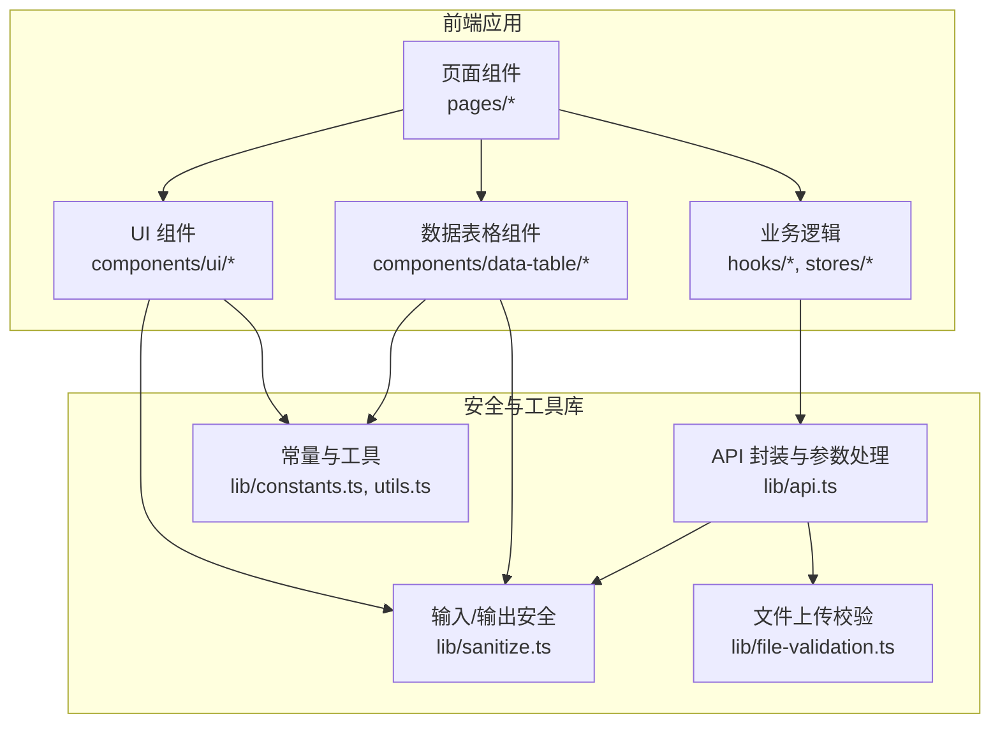
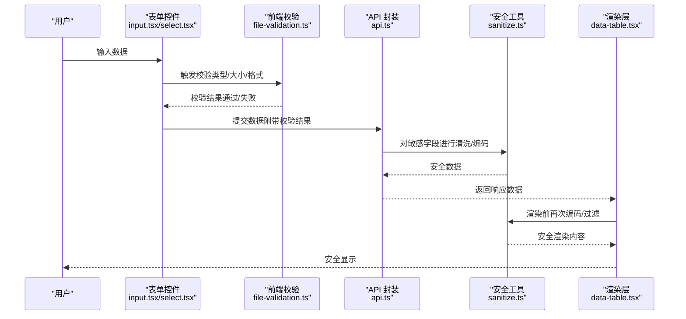
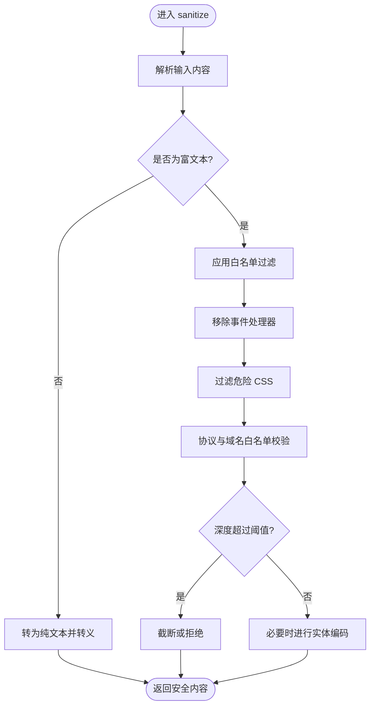
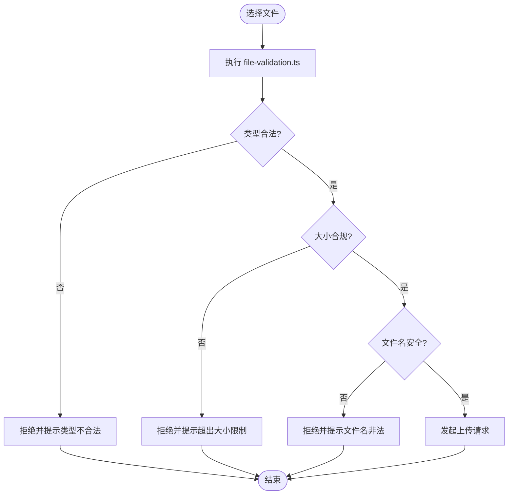
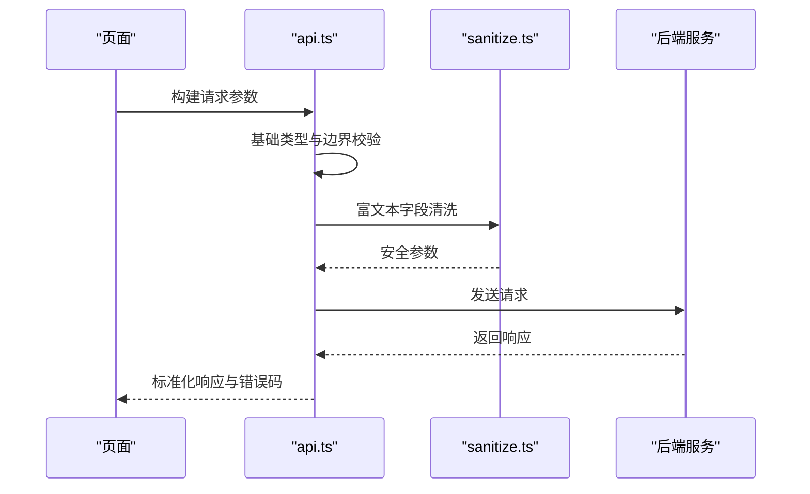
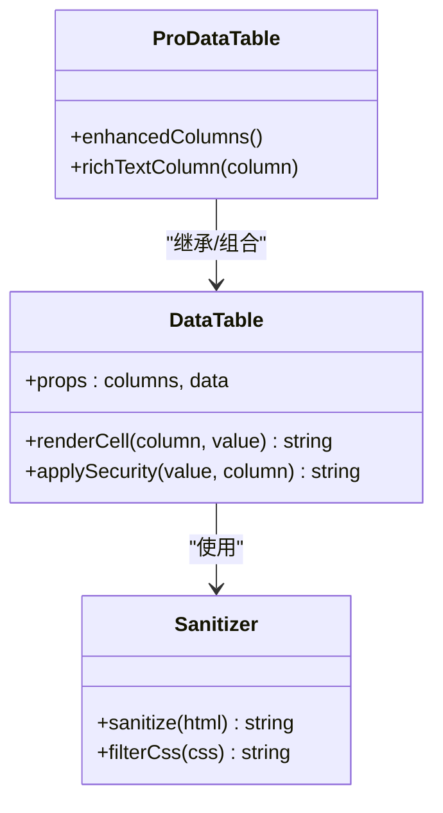
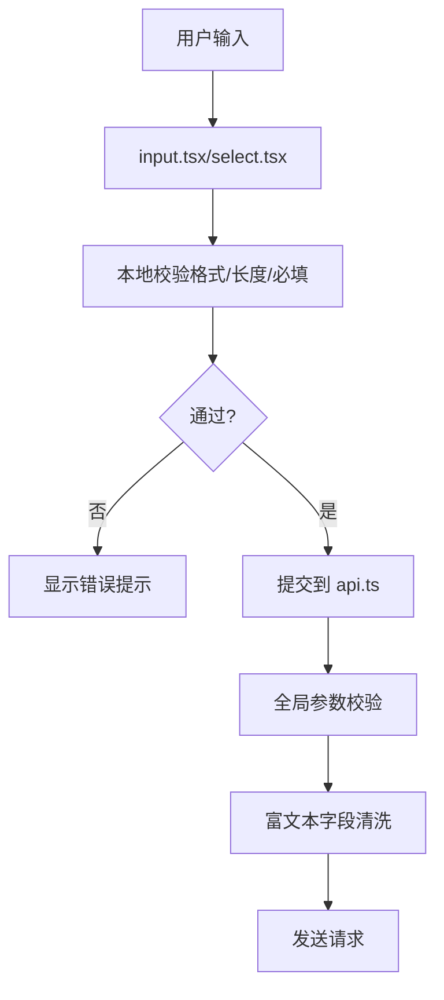
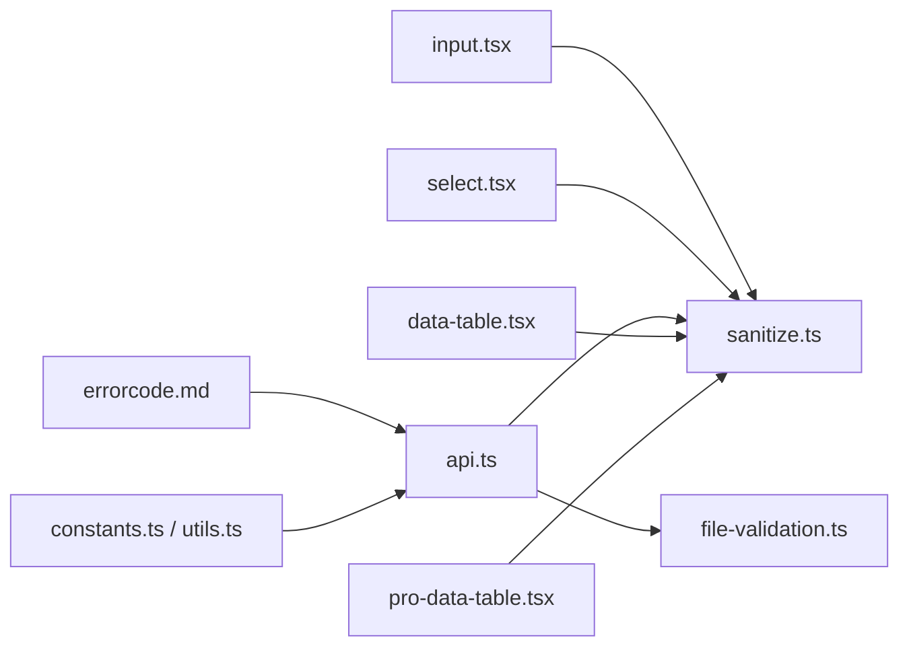

# 输入验证与输出编码

<cite>
**本文引用的文件**   
- [sanitize.ts](file://web/src/lib/sanitize.ts)
- [file-validation.ts](file://web/src/lib/file-validation.ts)
- [api.ts](file://web/src/lib/api.ts)
- [data-table.tsx](file://web/src/components/data-table/data-table.tsx)
- [pro-data-table.tsx](file://web/src/components/data-table/pro-data-table.tsx)
- [input.tsx](file://web/src/components/ui/input.tsx)
- [select.tsx](file://web/src/components/ui/select.tsx)
- [constants.ts](file://web/src/lib/constants.ts)
- [utils.ts](file://web/src/lib/utils.ts)
- [errorcode.md](file://docs/references/errorcode.md)
</cite>

## 目录
1. [简介](#简介)
2. [项目结构](#项目结构)
3. [核心组件](#核心组件)
4. [架构总览](#架构总览)
5. [详细组件分析](#详细组件分析)
6. [依赖分析](#依赖分析)
7. [性能考虑](#性能考虑)
8. [故障排查指南](#故障排查指南)
9. [结论](#结论)
10. [附录](#附录)

## 简介
本指南聚焦于 pj3 项目的输入验证与输出编码安全实践，覆盖以下关键主题：
- XSS 防护：HTML 实体编码、JavaScript 代码过滤、CSS 注入防护
- sanitize 工具函数使用与自定义过滤规则配置
- 富文本内容与用户输入数据处理策略
- 文件上传安全：类型校验、大小限制、恶意文件检测、存储路径安全
- 表单验证最佳实践：客户端与服务端双重保障
- API 参数校验：数据类型、边界值检查、SQL 注入防护（前端侧）
- 常见输入验证漏洞的检测方法与修复建议

## 项目结构
本项目为前端工程，安全相关能力主要集中在 lib 层与 UI 组件层：
- lib/sanitize.ts：通用内容清洗与输出编码工具
- lib/file-validation.ts：文件上传前的类型、大小等校验
- lib/api.ts：API 请求封装与基础参数处理
- components/data-table/*：数据展示组件，涉及渲染与转义策略
- components/ui/input.tsx、select.tsx：表单控件，承载输入约束与提示
- lib/constants.ts、lib/utils.ts：常量与通用工具
- docs/references/errorcode.md：错误码参考，便于统一错误处理

图表来源
- [sanitize.ts](file://web/src/lib/sanitize.ts)
- [file-validation.ts](file://web/src/lib/file-validation.ts)
- [api.ts](file://web/src/lib/api.ts)
- [data-table.tsx](file://web/src/components/data-table/data-table.tsx)
- [pro-data-table.tsx](file://web/src/components/data-table/pro-data-table.tsx)
- [input.tsx](file://web/src/components/ui/input.tsx)
- [select.tsx](file://web/src/components/ui/select.tsx)
- [constants.ts](file://web/src/lib/constants.ts)
- [utils.ts](file://web/src/lib/utils.ts)

章节来源
- [sanitize.ts](file://web/src/lib/sanitize.ts)
- [file-validation.ts](file://web/src/lib/file-validation.ts)
- [api.ts](file://web/src/lib/api.ts)
- [data-table.tsx](file://web/src/components/data-table/data-table.tsx)
- [pro-data-table.tsx](file://web/src/components/data-table/pro-data-table.tsx)
- [input.tsx](file://web/src/components/ui/input.tsx)
- [select.tsx](file://web/src/components/ui/select.tsx)
- [constants.ts](file://web/src/lib/constants.ts)
- [utils.ts](file://web/src/lib/utils.ts)

## 核心组件
本节概述与安全相关的核心模块职责与交互关系。

- 输入清洗与输出编码（sanitize.ts）
  - 负责将不可信输入转换为安全的 HTML 片段或纯文本
  - 提供白名单标签与属性控制、事件处理器移除、协议白名单校验
  - 支持 CSS 属性过滤与危险函数调用阻断
  - 可配置化：允许标签列表、允许属性列表、禁止协议、是否保留换行等

- 文件上传校验（file-validation.ts）
  - 在浏览器端进行 MIME 类型与扩展名双重校验
  - 文件大小上限检查与单位换算
  - 可选的简单签名/哈希校验入口预留
  - 返回结构化结果供上层统一处理

- API 封装（api.ts）
  - 统一请求拦截、响应拦截
  - 对查询参数与表单数据进行基础类型校验与清理
  - 错误码映射与用户友好提示

- 数据表格组件（data-table.tsx、pro-data-table.tsx）
  - 对列渲染进行转义或受控渲染
  - 对富文本字段采用安全渲染策略（如仅允许特定标签）

- UI 表单控件（input.tsx、select.tsx）
  - 提供输入模式（数字、邮箱、URL）、必填、长度限制等
  - 与校验库集成，实时反馈错误信息

章节来源
- [sanitize.ts](file://web/src/lib/sanitize.ts)
- [file-validation.ts](file://web/src/lib/file-validation.ts)
- [api.ts](file://web/src/lib/api.ts)
- [data-table.tsx](file://web/src/components/data-table/data-table.tsx)
- [pro-data-table.tsx](file://web/src/components/data-table/pro-data-table.tsx)
- [input.tsx](file://web/src/components/ui/input.tsx)
- [select.tsx](file://web/src/components/ui/select.tsx)

## 架构总览
下图展示了从用户输入到最终输出的安全链路，强调“早校验、晚输出”的原则。

图表来源
- [input.tsx](file://web/src/components/ui/input.tsx)
- [select.tsx](file://web/src/components/ui/select.tsx)
- [file-validation.ts](file://web/src/lib/file-validation.ts)
- [api.ts](file://web/src/lib/api.ts)
- [sanitize.ts](file://web/src/lib/sanitize.ts)
- [data-table.tsx](file://web/src/components/data-table/data-table.tsx)

## 详细组件分析

### 输入清洗与输出编码（sanitize.ts）
- 设计要点
  - 白名单机制：仅允许已知安全的标签与属性
  - 协议白名单：限制 href/src 等属性的协议（http/https）
  - 事件处理器剥离：移除 on* 事件与内联脚本
  - CSS 过滤：阻止 expression、url、import 等危险语法
  - 可配置规则：按场景切换严格/宽松模式
- 使用建议
  - 所有来自用户的富文本必须经 sanitize 后再渲染
  - 对 JSON 字符串或模板变量插入时，优先使用文本节点而非 innerHTML
  - 对图片链接、附件链接进行协议与域名白名单校验
- 风险点
  - 过度宽松的白名单可能导致绕过
  - 未对嵌套标签深度做限制可能引发性能问题

图表来源
- [sanitize.ts](file://web/src/lib/sanitize.ts)

章节来源
- [sanitize.ts](file://web/src/lib/sanitize.ts)

### 文件上传安全（file-validation.ts）
- 校验维度
  - 类型校验：MIME 类型与扩展名一致性检查
  - 大小限制：最大字节数与单位换算
  - 内容探测：可选的文件头签名校验（预留接口）
  - 文件名安全：去除路径分隔符、避免特殊字符
- 流程说明
  - 选择文件后先进行前端快速校验
  - 校验失败立即中断上传并给出明确提示
  - 校验通过后再发起网络上传
- 注意事项
  - 前端校验仅为用户体验优化，服务端仍需二次校验
  - 对图片类资源建议额外进行尺寸与像素密度限制

图表来源
- [file-validation.ts](file://web/src/lib/file-validation.ts)

章节来源
- [file-validation.ts](file://web/src/lib/file-validation.ts)

### API 参数校验（api.ts）
- 职责范围
  - 统一请求拦截：序列化、鉴权头、超时设置
  - 基础参数校验：非空、类型、长度、枚举值
  - 错误码映射：结合 errorcode.md 进行用户提示
- 与 sanitize 协作
  - 对 URL 查询参数与表单字段进行必要清理
  - 对富文本字段在入库前调用 sanitize
- 建议
  - 将校验规则集中管理，避免散落在各页面
  - 对分页、排序等参数进行白名单与范围限制

图表来源
- [api.ts](file://web/src/lib/api.ts)
- [sanitize.ts](file://web/src/lib/sanitize.ts)
- [errorcode.md](file://docs/references/errorcode.md)

章节来源
- [api.ts](file://web/src/lib/api.ts)
- [errorcode.md](file://docs/references/errorcode.md)

### 数据表格渲染安全（data-table.tsx、pro-data-table.tsx）
- 渲染策略
  - 默认以文本形式渲染，避免直接插入 HTML
  - 对需要富文本展示的列，使用 sanitize 后的内容进行受控渲染
  - 对链接列进行协议与域名白名单校验
- 性能考量
  - 大数据量下避免重复计算，缓存已清洗结果
  - 对超长文本进行截断与省略号展示

图表来源
- [data-table.tsx](file://web/src/components/data-table/data-table.tsx)
- [pro-data-table.tsx](file://web/src/components/data-table/pro-data-table.tsx)
- [sanitize.ts](file://web/src/lib/sanitize.ts)

章节来源
- [data-table.tsx](file://web/src/components/data-table/data-table.tsx)
- [pro-data-table.tsx](file://web/src/components/data-table/pro-data-table.tsx)
- [sanitize.ts](file://web/src/lib/sanitize.ts)

### 表单控件与输入约束（input.tsx、select.tsx）
- 输入约束
  - 模式：text、email、url、number、tel 等
  - 必填、最小/最大长度、正则表达式
  - 实时校验与错误提示
- 与全局校验联动
  - 与 api.ts 的基础校验保持一致的规则定义
  - 与 sanitize.ts 配合，确保富文本输入在提交前被清洗

图表来源
- [input.tsx](file://web/src/components/ui/input.tsx)
- [select.tsx](file://web/src/components/ui/select.tsx)
- [api.ts](file://web/src/lib/api.ts)
- [sanitize.ts](file://web/src/lib/sanitize.ts)

章节来源
- [input.tsx](file://web/src/components/ui/input.tsx)
- [select.tsx](file://web/src/components/ui/select.tsx)
- [api.ts](file://web/src/lib/api.ts)
- [sanitize.ts](file://web/src/lib/sanitize.ts)

## 依赖分析
- 组件耦合
  - UI 组件依赖 sanitize.ts 进行输出编码
  - API 封装依赖 sanitize.ts 与 file-validation.ts 进行输入预处理
  - 数据表格组件依赖 sanitize.ts 进行富文本安全渲染
- 外部依赖
  - 错误码文档 errorcode.md 用于统一错误处理
  - 常量与工具 constants.ts、utils.ts 提供公共配置与辅助方法

图表来源
- [input.tsx](file://web/src/components/ui/input.tsx)
- [select.tsx](file://web/src/components/ui/select.tsx)
- [api.ts](file://web/src/lib/api.ts)
- [file-validation.ts](file://web/src/lib/file-validation.ts)
- [data-table.tsx](file://web/src/components/data-table/data-table.tsx)
- [pro-data-table.tsx](file://web/src/components/data-table/pro-data-table.tsx)
- [sanitize.ts](file://web/src/lib/sanitize.ts)
- [errorcode.md](file://docs/references/errorcode.md)
- [constants.ts](file://web/src/lib/constants.ts)
- [utils.ts](file://web/src/lib/utils.ts)

章节来源
- [api.ts](file://web/src/lib/api.ts)
- [sanitize.ts](file://web/src/lib/sanitize.ts)
- [file-validation.ts](file://web/src/lib/file-validation.ts)
- [data-table.tsx](file://web/src/components/data-table/data-table.tsx)
- [pro-data-table.tsx](file://web/src/components/data-table/pro-data-table.tsx)
- [input.tsx](file://web/src/components/ui/input.tsx)
- [select.tsx](file://web/src/components/ui/select.tsx)
- [errorcode.md](file://docs/references/errorcode.md)
- [constants.ts](file://web/src/lib/constants.ts)
- [utils.ts](file://web/src/lib/utils.ts)

## 性能考虑
- 批量清洗缓存：对相同输入复用 sanitize 结果，减少重复计算
- 渲染优化：长文本截断与虚拟滚动，避免 DOM 过大
- 上传节流：大文件分片与进度反馈，提升用户体验
- 规则精简：白名单尽量精确，避免过度解析导致性能下降

## 故障排查指南
- 常见问题
  - 富文本渲染异常：确认是否经过 sanitize 且白名单配置正确
  - 上传失败：检查 MIME 与扩展名一致性、文件大小限制
  - 参数校验报错：核对 api.ts 中的类型与边界规则
  - 错误提示不明确：对照 errorcode.md 进行统一映射
- 定位步骤
  - 在 sanitize.ts 增加日志输出，观察输入与输出差异
  - 在 file-validation.ts 打印校验中间结果
  - 在 api.ts 的请求/响应拦截处记录关键参数与错误码
  - 在数据表格组件中临时关闭富文本渲染，验证是否为渲染问题

章节来源
- [sanitize.ts](file://web/src/lib/sanitize.ts)
- [file-validation.ts](file://web/src/lib/file-validation.ts)
- [api.ts](file://web/src/lib/api.ts)
- [errorcode.md](file://docs/references/errorcode.md)

## 结论
通过统一的 sanitize 工具、严格的文件上传校验、完善的 API 参数校验以及安全的渲染策略，pj3 项目在输入验证与输出编码方面形成了闭环。建议在后续迭代中持续完善白名单策略、增强恶意文件检测能力，并将校验规则集中化管理，以提升整体安全性与可维护性。

## 附录
- 最佳实践清单
  - 对所有用户输入进行服务端二次校验
  - 输出时遵循“晚输出、强编码”原则
  - 富文本采用白名单与深度限制
  - 文件上传前后端双重校验，启用内容探测
  - 统一错误码与用户提示，便于审计与排障
- 参考规范
  - 错误码参考：[errorcode.md](file://docs/references/errorcode.md)