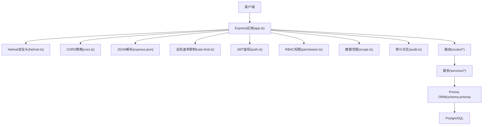
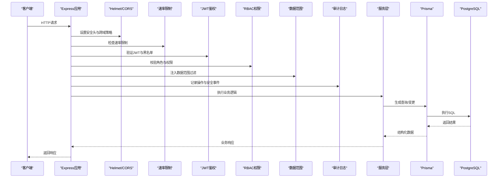
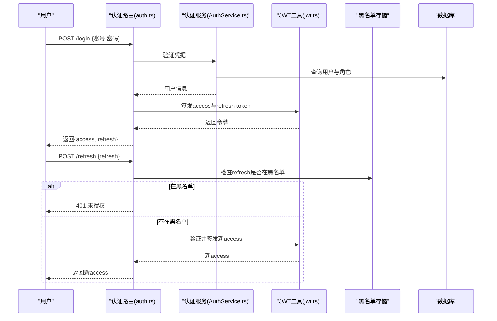
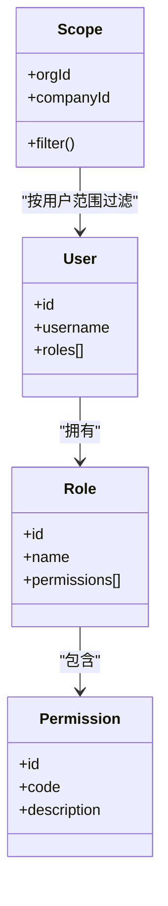
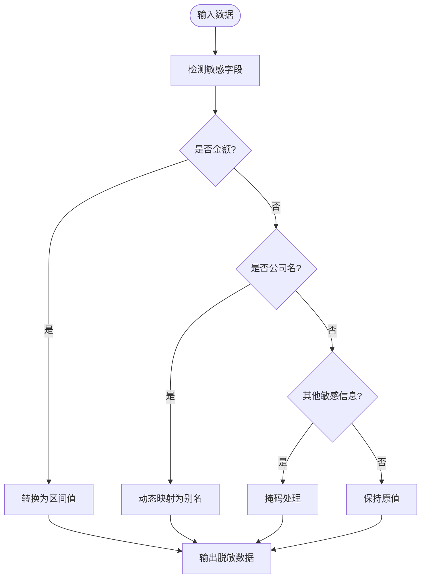
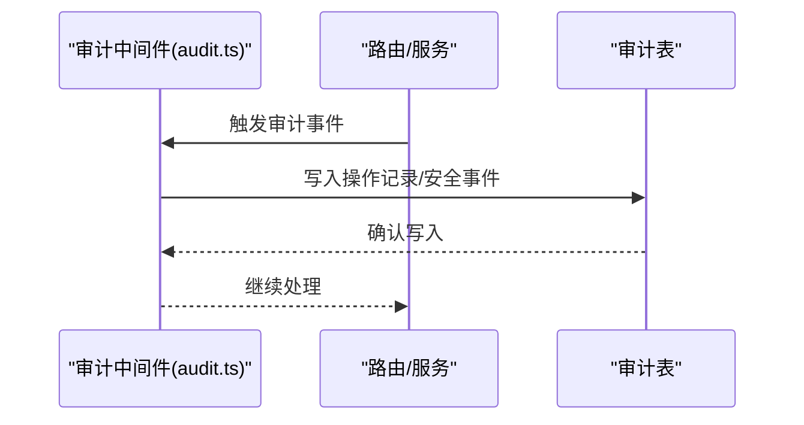
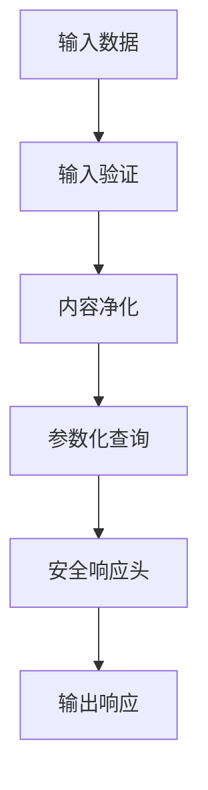
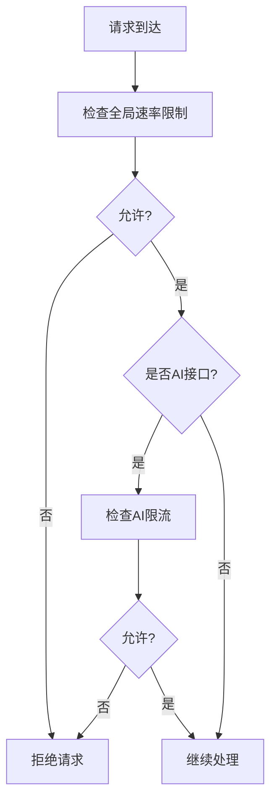
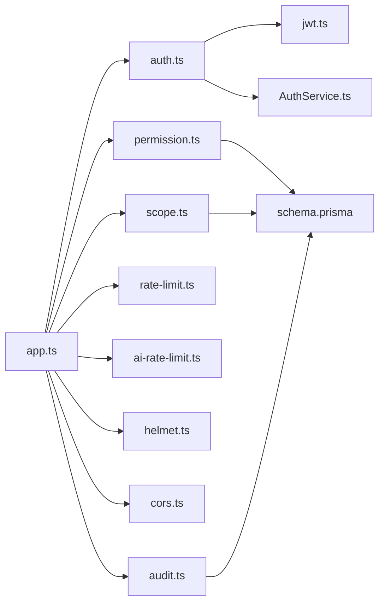

# 安全设计

<cite>
**本文引用的文件**   
- [server/src/middleware/auth.ts](file://server/src/middleware/auth.ts)
- [server/src/middleware/permission.ts](file://server/src/middleware/permission.ts)
- [server/src/middleware/scope.ts](file://server/src/middleware/scope.ts)
- [server/src/middleware/rate-limit.ts](file://server/src/middleware/rate-limit.ts)
- [server/src/middleware/helmet.ts](file://server/src/middleware/helmet.ts)
- [server/src/middleware/cors.ts](file://server/src/middleware/cors.ts)
- [server/src/middleware/audit.ts](file://server/src/middleware/audit.ts)
- [server/src/lib/jwt.ts](file://server/src/lib/jwt.ts)
- [server/src/lib/desensitize.test.ts](file://server/src/lib/desensitize.test.ts)
- [server/src/lib/sanitize.ts](file://server/src/lib/sanitize.ts)
- [server/src/lib/errors.ts](file://server/src/lib/errors.ts)
- [server/src/routes/auth.ts](file://server/src/routes/auth.ts)
- [server/src/services/AuthService.ts](file://server/src/services/AuthService.ts)
- [server/prisma/schema.prisma](file://server/prisma/schema.prisma)
- [server/src/app.ts](file://server/src/app.ts)
- [server/src/server.ts](file://server/src/server.ts)
- [server/src/config/env.ts](file://server/src/config/env.ts)
- [server/src/middleware/ai-rate-limit.ts](file://server/src/middleware/ai-rate-limit.ts)
- [server/src/middleware/error-handler.ts](file://server/src/middleware/error-handler.ts)
</cite>

## 目录
1. [简介](#简介)
2. [项目结构](#项目结构)
3. [核心组件](#核心组件)
4. [架构总览](#架构总览)
5. [详细组件分析](#详细组件分析)
6. [依赖关系分析](#依赖关系分析)
7. [性能考虑](#性能考虑)
8. [故障排查指南](#故障排查指南)
9. [结论](#结论)
10. [附录](#附录)

## 简介
本文件面向FY200财年经营数据分析平台的安全设计，聚焦以下关键主题：
- JWT双令牌认证机制（access与refresh轮转、黑名单管理）
- RBAC权限控制模型（角色、权限、数据范围）
- 数据脱敏策略（绝对金额区间化、公司名动态映射、敏感信息保护）
- 审计日志系统（操作记录、安全事件追踪、合规性要求）
- 安全防护措施（输入校验、SQL注入防护、XSS防护、CSRF防护）
- 速率限制、防暴力破解与会话管理
- 安全配置最佳实践与漏洞扫描指南

后端技术栈为Express 4 + Prisma 5 + PostgreSQL 15 + JWT（access短期+refresh长期轮转），中间件执行链顺序严格遵循：helmet → cors → express.json → rate-limit → auth(JWT+黑名单) → permission(默认拒绝) → scope(Prisma扩展) → softDelete → audit → Service → Prisma → PostgreSQL。

## 项目结构
安全相关代码主要分布在以下位置：
- 中间件层：auth、permission、scope、rate-limit、helmet、cors、audit等
- 业务服务层：AuthService负责认证流程
- 路由层：auth路由暴露登录、刷新等接口
- 工具库：jwt、desensitize、sanitize、errors等
- 数据层：Prisma schema定义用户、角色、权限、审计表等
- 应用入口：app.ts与server.ts注册中间件与路由

**图表来源**
- [server/src/app.ts](file://server/src/app.ts)
- [server/src/middleware/helmet.ts](file://server/src/middleware/helmet.ts)
- [server/src/middleware/cors.ts](file://server/src/middleware/cors.ts)
- [server/src/middleware/rate-limit.ts](file://server/src/middleware/rate-limit.ts)
- [server/src/middleware/auth.ts](file://server/src/middleware/auth.ts)
- [server/src/middleware/permission.ts](file://server/src/middleware/permission.ts)
- [server/src/middleware/scope.ts](file://server/src/middleware/scope.ts)
- [server/src/middleware/audit.ts](file://server/src/middleware/audit.ts)
- [server/src/routes/auth.ts](file://server/src/routes/auth.ts)
- [server/src/services/AuthService.ts](file://server/src/services/AuthService.ts)
- [server/prisma/schema.prisma](file://server/prisma/schema.prisma)

**章节来源**
- [server/src/app.ts](file://server/src/app.ts)
- [server/src/server.ts](file://server/src/server.ts)

## 核心组件
- JWT双令牌认证：access token短生命周期用于请求授权，refresh token长生命周期用于无感刷新；支持黑名单快速吊销。
- RBAC权限控制：基于角色的访问控制，默认拒绝，显式授权；结合数据范围实现行级隔离。
- 数据脱敏：对金额进行区间化处理，对公司名进行动态映射，避免敏感信息泄露。
- 审计日志：记录关键操作与安全事件，满足合规审计需求。
- 安全防护：通过Helmet、CORS、输入校验、SQL注入防护、XSS防护、CSRF防护等多层防御。
- 速率限制与会话管理：全局与AI专用限流，防暴力破解与资源滥用。

**章节来源**
- [server/src/lib/jwt.ts](file://server/src/lib/jwt.ts)
- [server/src/middleware/auth.ts](file://server/src/middleware/auth.ts)
- [server/src/middleware/permission.ts](file://server/src/middleware/permission.ts)
- [server/src/middleware/scope.ts](file://server/src/middleware/scope.ts)
- [server/src/lib/desensitize.test.ts](file://server/src/lib/desensitize.test.ts)
- [server/src/middleware/audit.ts](file://server/src/middleware/audit.ts)
- [server/src/middleware/rate-limit.ts](file://server/src/middleware/rate-limit.ts)
- [server/src/middleware/ai-rate-limit.ts](file://server/src/middleware/ai-rate-limit.ts)

## 架构总览
下图展示从客户端到数据库的完整调用链路及安全控制点。

**图表来源**
- [server/src/app.ts](file://server/src/app.ts)
- [server/src/middleware/auth.ts](file://server/src/middleware/auth.ts)
- [server/src/middleware/permission.ts](file://server/src/middleware/permission.ts)
- [server/src/middleware/scope.ts](file://server/src/middleware/scope.ts)
- [server/src/middleware/audit.ts](file://server/src/middleware/audit.ts)
- [server/src/services/AuthService.ts](file://server/src/services/AuthService.ts)
- [server/prisma/schema.prisma](file://server/prisma/schema.prisma)

## 详细组件分析

### JWT双令牌认证机制
- 令牌生成：登录成功后签发access token（短期）与refresh token（长期），并写入用户会话上下文。
- 令牌验证：每个受保护请求由auth中间件验证access token有效性，同时检查黑名单。
- 令牌刷新：提供刷新接口，使用refresh token换取新的access token，支持轮转与旧token失效。
- 黑名单管理：支持将已撤销或过期的refresh token加入黑名单，确保即时吊销。

**图表来源**
- [server/src/routes/auth.ts](file://server/src/routes/auth.ts)
- [server/src/services/AuthService.ts](file://server/src/services/AuthService.ts)
- [server/src/lib/jwt.ts](file://server/src/lib/jwt.ts)
- [server/src/middleware/auth.ts](file://server/src/middleware/auth.ts)

**章节来源**
- [server/src/lib/jwt.ts](file://server/src/lib/jwt.ts)
- [server/src/middleware/auth.ts](file://server/src/middleware/auth.ts)
- [server/src/routes/auth.ts](file://server/src/routes/auth.ts)
- [server/src/services/AuthService.ts](file://server/src/services/AuthService.ts)

### RBAC权限控制模型
- 角色定义：用户关联一个或多个角色，角色具备一组权限。
- 权限分配：路由或控制器级别声明所需权限，默认拒绝，需显式授权。
- 数据范围控制：通过scope中间件注入Prisma扩展，按用户组织/公司维度过滤数据。

**图表来源**
- [server/prisma/schema.prisma](file://server/prisma/schema.prisma)
- [server/src/middleware/permission.ts](file://server/src/middleware/permission.ts)
- [server/src/middleware/scope.ts](file://server/src/middleware/scope.ts)

**章节来源**
- [server/src/middleware/permission.ts](file://server/src/middleware/permission.ts)
- [server/src/middleware/scope.ts](file://server/src/middleware/scope.ts)
- [server/prisma/schema.prisma](file://server/prisma/schema.prisma)

### 数据脱敏策略
- 绝对金额区间化处理：将具体金额转换为区间值，避免精确数值泄露。
- 公司名动态映射：对外输出时使用映射后的名称，隐藏真实实体标识。
- 敏感信息保护：对手机号、邮箱、身份证号等字段进行掩码或移除。

**图表来源**
- [server/src/lib/desensitize.test.ts](file://server/src/lib/desensitize.test.ts)

**章节来源**
- [server/src/lib/desensitize.test.ts](file://server/src/lib/desensitize.test.ts)

### 审计日志系统
- 操作记录：记录用户关键操作（登录、修改、删除等）。
- 安全事件追踪：记录异常登录、权限拒绝、令牌黑名单命中等。
- 合规性要求：保留审计日志以满足内外部审计与合规检查。

**图表来源**
- [server/src/middleware/audit.ts](file://server/src/middleware/audit.ts)
- [server/prisma/schema.prisma](file://server/prisma/schema.prisma)

**章节来源**
- [server/src/middleware/audit.ts](file://server/src/middleware/audit.ts)
- [server/prisma/schema.prisma](file://server/prisma/schema.prisma)

### 安全防护措施
- 输入验证：对请求体、查询参数进行类型与格式校验。
- SQL注入防护：使用Prisma ORM参数化查询，禁止拼接SQL。
- XSS防护：通过Helmet设置安全响应头，前端渲染时进行内容净化。
- CSRF防护：针对状态变更接口启用同源校验与自定义头部校验。

**图表来源**
- [server/src/lib/sanitize.ts](file://server/src/lib/sanitize.ts)
- [server/src/middleware/helmet.ts](file://server/src/middleware/helmet.ts)
- [server/src/middleware/cors.ts](file://server/src/middleware/cors.ts)

**章节来源**
- [server/src/lib/sanitize.ts](file://server/src/lib/sanitize.ts)
- [server/src/middleware/helmet.ts](file://server/src/middleware/helmet.ts)
- [server/src/middleware/cors.ts](file://server/src/middleware/cors.ts)

### 速率限制、防暴力破解与会话管理
- 全局速率限制：限制单位时间内请求数，防止资源滥用。
- AI专用限流：针对AI接口实施更严格的限流策略。
- 防暴力破解：对登录接口实施指数退避与账户锁定。
- 会话管理：基于JWT的无状态会话，配合refresh token轮转。

**图表来源**
- [server/src/middleware/rate-limit.ts](file://server/src/middleware/rate-limit.ts)
- [server/src/middleware/ai-rate-limit.ts](file://server/src/middleware/ai-rate-limit.ts)

**章节来源**
- [server/src/middleware/rate-limit.ts](file://server/src/middleware/rate-limit.ts)
- [server/src/middleware/ai-rate-limit.ts](file://server/src/middleware/ai-rate-limit.ts)

## 依赖关系分析
各安全组件之间的依赖关系如下：

**图表来源**
- [server/src/app.ts](file://server/src/app.ts)
- [server/src/middleware/auth.ts](file://server/src/middleware/auth.ts)
- [server/src/middleware/permission.ts](file://server/src/middleware/permission.ts)
- [server/src/middleware/scope.ts](file://server/src/middleware/scope.ts)
- [server/src/middleware/rate-limit.ts](file://server/src/middleware/rate-limit.ts)
- [server/src/middleware/ai-rate-limit.ts](file://server/src/middleware/ai-rate-limit.ts)
- [server/src/middleware/helmet.ts](file://server/src/middleware/helmet.ts)
- [server/src/middleware/cors.ts](file://server/src/middleware/cors.ts)
- [server/src/middleware/audit.ts](file://server/src/middleware/audit.ts)
- [server/src/lib/jwt.ts](file://server/src/lib/jwt.ts)
- [server/src/services/AuthService.ts](file://server/src/services/AuthService.ts)
- [server/prisma/schema.prisma](file://server/prisma/schema.prisma)

**章节来源**
- [server/src/app.ts](file://server/src/app.ts)

## 性能考虑
- JWT验证开销低，建议缓存黑名单以提升性能。
- 数据脱敏应在输出层统一处理，避免重复计算。
- 审计日志异步写入，减少主流程延迟。
- 速率限制使用内存或Redis存储计数，保证高并发下的稳定性。

[本节为通用指导，无需特定文件引用]

## 故障排查指南
- 认证失败：检查JWT签名、过期时间、黑名单状态。
- 权限拒绝：确认用户角色与权限配置是否正确。
- 数据范围异常：检查scope注入的用户上下文。
- 审计缺失：确认审计中间件是否注册及事件触发。
- 限流触发：查看限流配置与当前计数。

**章节来源**
- [server/src/lib/errors.ts](file://server/src/lib/errors.ts)
- [server/src/middleware/error-handler.ts](file://server/src/middleware/error-handler.ts)

## 结论
FY200平台通过多层安全中间件与严谨的业务逻辑实现了全面的身份认证、权限控制、数据脱敏与审计能力。JWT双令牌机制保障了会话安全与用户体验，RBAC与数据范围控制确保了最小权限原则与数据隔离。建议持续监控安全事件，定期更新配置与依赖，以应对不断演变的威胁环境。

[本节为总结性内容，无需特定文件引用]

## 附录
- 安全配置最佳实践：
  - 使用强随机密钥与合理的过期时间
  - 启用HTTPS与严格CORS策略
  - 定期轮换令牌与密钥
  - 最小化权限与数据可见性
- 漏洞扫描指南：
  - 使用静态分析工具扫描代码
  - 依赖包漏洞扫描与更新
  - 渗透测试与红蓝对抗演练

[本节为通用指导，无需特定文件引用]