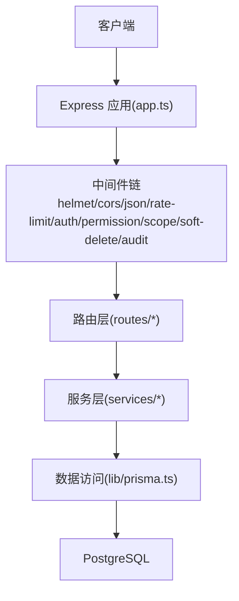
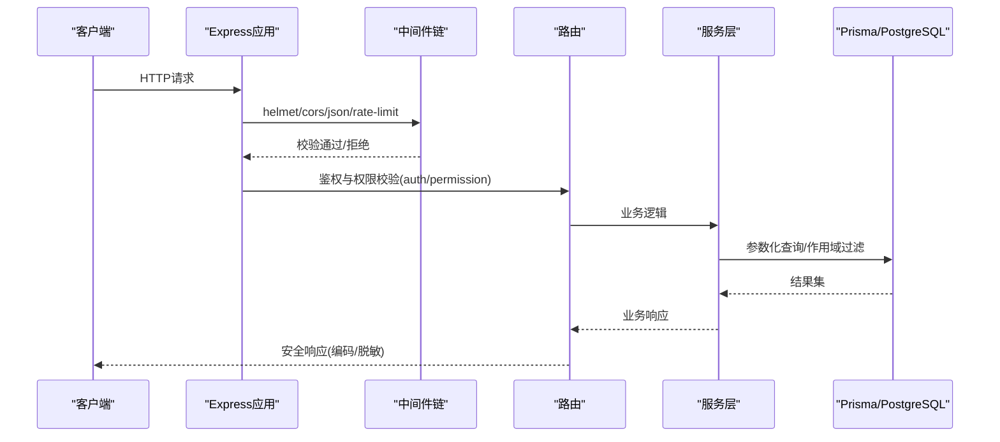
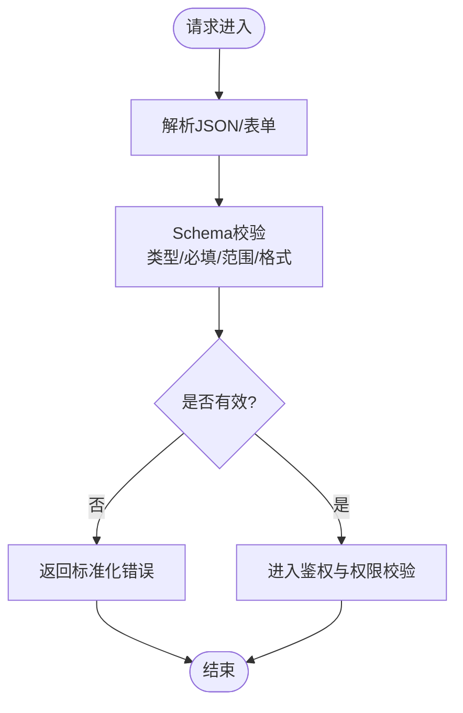
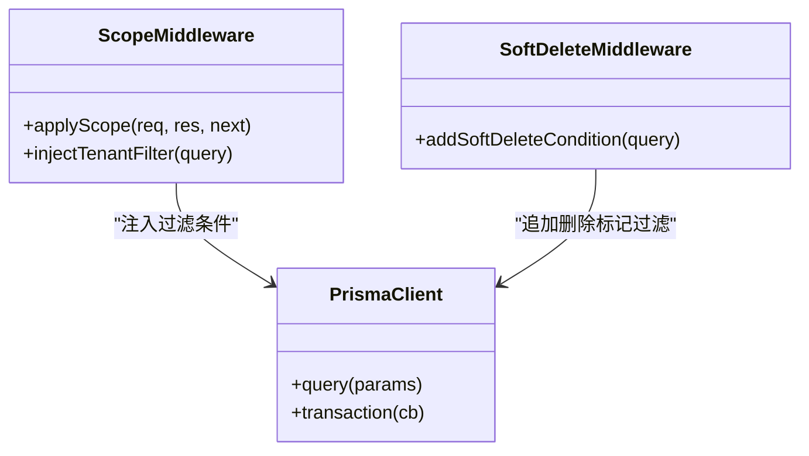
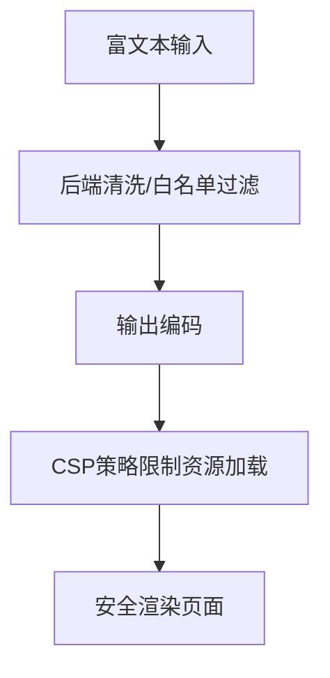
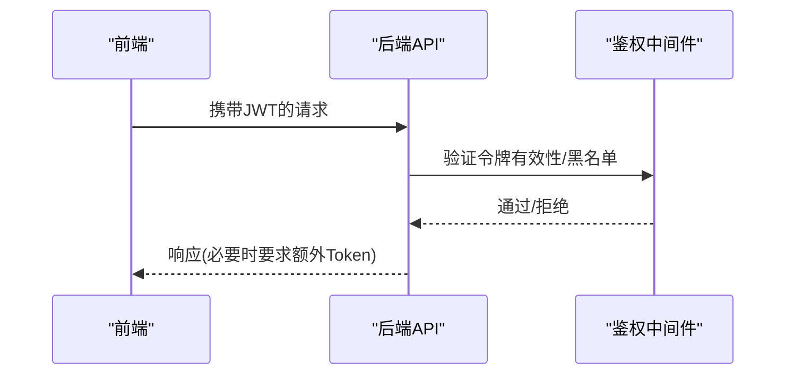
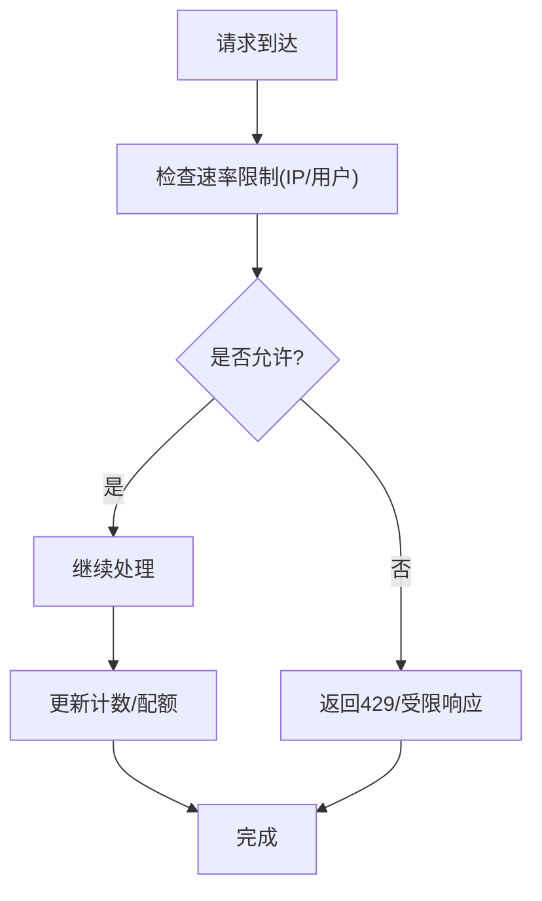
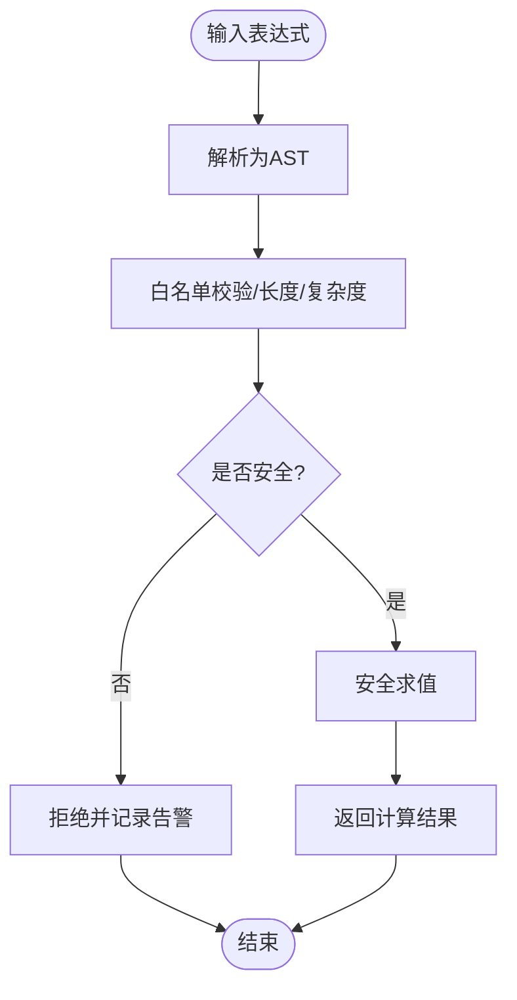
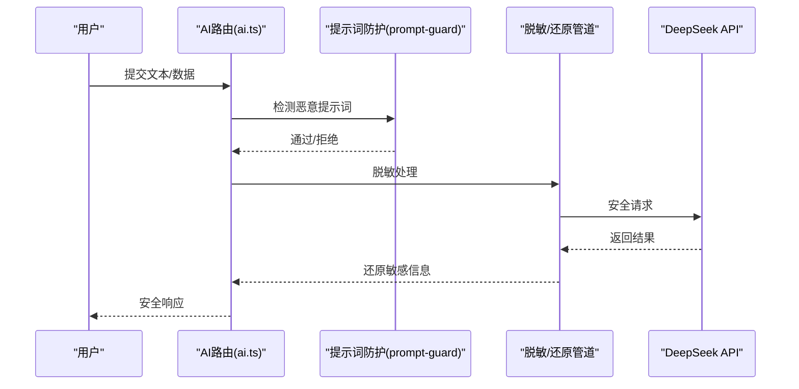
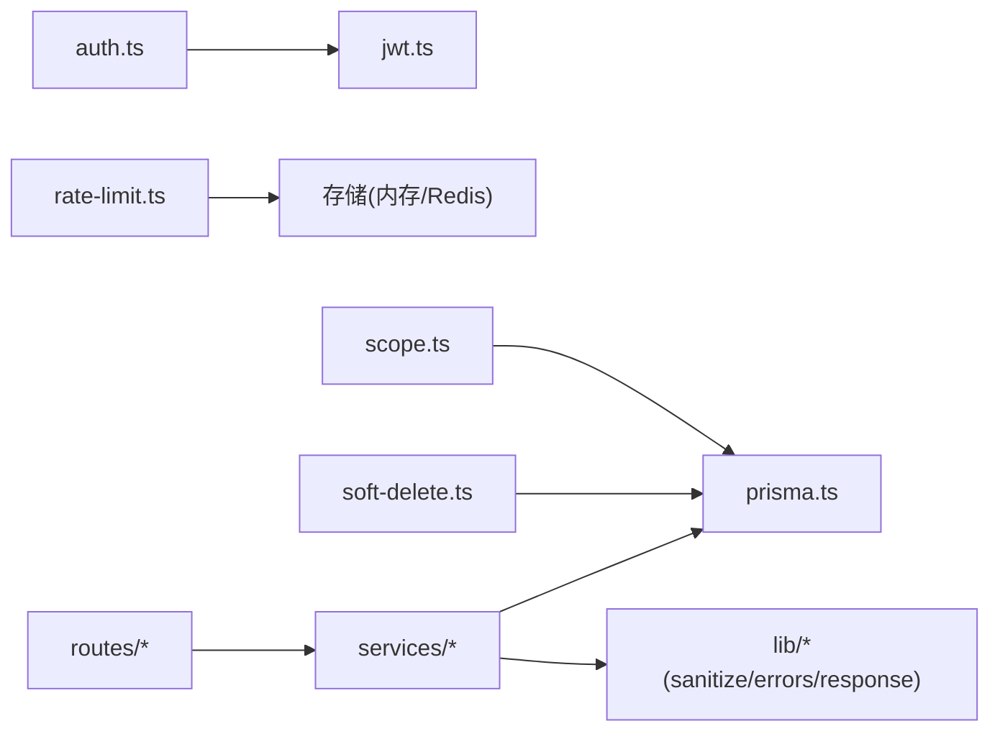

# 安全防护措施

<cite>
**本文引用的文件**   
- [server/src/app.ts](file://server/src/app.ts)
- [server/src/server.ts](file://server/src/server.ts)
- [server/src/middleware/helmet.ts](file://server/src/middleware/helmet.ts)
- [server/src/middleware/cors.ts](file://server/src/middleware/cors.ts)
- [server/src/middleware/rate-limit.ts](file://server/src/middleware/rate-limit.ts)
- [server/src/middleware/ai-rate-limit.ts](file://server/src/middleware/ai-rate-limit.ts)
- [server/src/middleware/auth.ts](file://server/src/middleware/auth.ts)
- [server/src/middleware/permission.ts](file://server/src/middleware/permission.ts)
- [server/src/middleware/scope.ts](file://server/src/middleware/scope.ts)
- [server/src/middleware/soft-delete.ts](file://server/src/middleware/soft-delete.ts)
- [server/src/middleware/audit.ts](file://server/src/middleware/audit.ts)
- [server/src/middleware/error-handler.ts](file://server/src/middleware/error-handler.ts)
- [server/src/lib/prisma.ts](file://server/src/lib/prisma.ts)
- [server/src/lib/formula.ts](file://server/src/lib/formula.ts)
- [server/src/lib/sanitize.ts](file://server/src/lib/sanitize.ts)
- [server/src/lib/prompt-guard.ts](file://server/src/lib/prompt-guard.ts)
- [server/src/lib/jwt.ts](file://server/src/lib/jwt.ts)
- [server/src/lib/errors.ts](file://server/src/lib/errors.ts)
- [server/src/lib/response.ts](file://server/src/lib/response.ts)
- [server/src/services/FormulaRuleService.ts](file://server/src/services/FormulaRuleService.ts)
- [server/src/routes/auth.ts](file://server/src/routes/auth.ts)
- [server/src/routes/data.ts](file://server/src/routes/data.ts)
- [server/src/routes/reports.ts](file://server/src/routes/reports.ts)
- [server/src/routes/admin.ts](file://server/src/routes/admin.ts)
- [server/src/routes/ai.ts](file://server/src/routes/ai.ts)
- [server/src/routes/dashboard.ts](file://server/src/routes/dashboard.ts)
- [server/src/routes/indicators.ts](file://server/src/routes/indicators.ts)
- [server/prisma/schema.prisma](file://server/prisma/schema.prisma)
- [server/scripts/cors-check.ts](file://server/scripts/cors-check.ts)
</cite>

## 目录
1. [简介](#简介)
2. [项目结构](#项目结构)
3. [核心组件](#核心组件)
4. [架构总览](#架构总览)
5. [详细组件分析](#详细组件分析)
6. [依赖关系分析](#依赖关系分析)
7. [性能考量](#性能考量)
8. [故障排查指南](#故障排查指南)
9. [结论](#结论)
10. [附录](#附录)

## 简介
本文件面向FY200财年经营数据分析平台的安全防护，围绕输入验证、SQL注入防护、XSS防护、CSRF防护、速率限制与配额管理、公式解析器安全设计、安全配置最佳实践与漏洞扫描指南进行系统化说明。后端采用Express + Prisma + PostgreSQL，中间件执行链顺序为：helmet → cors → express.json → rate-limit → auth(JWT+黑名单) → permission(默认拒绝) → scope(Prisma扩展) → softDelete → audit → Service → Prisma → PostgreSQL。计算类指标使用安全公式解析（白名单算子），AI双管道架构包含脱敏与还原流程。

## 项目结构
- 服务端入口与路由组织在 server/src 下，按 middleware、routes、services、lib 分层组织。
- 数据库模型与迁移位于 server/prisma，通过 schema.prisma 定义实体与关系。
- 前端位于 web/src，提供富文本编辑器与安全工具函数。

图表来源
- [server/src/app.ts](file://server/src/app.ts)
- [server/src/middleware/helmet.ts](file://server/src/middleware/helmet.ts)
- [server/src/middleware/cors.ts](file://server/src/middleware/cors.ts)
- [server/src/middleware/rate-limit.ts](file://server/src/middleware/rate-limit.ts)
- [server/src/middleware/auth.ts](file://server/src/middleware/auth.ts)
- [server/src/middleware/permission.ts](file://server/src/middleware/permission.ts)
- [server/src/middleware/scope.ts](file://server/src/middleware/scope.ts)
- [server/src/middleware/soft-delete.ts](file://server/src/middleware/soft-delete.ts)
- [server/src/middleware/audit.ts](file://server/src/middleware/audit.ts)
- [server/src/lib/prisma.ts](file://server/src/lib/prisma.ts)

章节来源
- [server/src/app.ts](file://server/src/app.ts)
- [server/src/server.ts](file://server/src/server.ts)

## 核心组件
- 请求输入校验与类型检查：统一通过中间件与Schema校验实现，确保参数类型、必填项、范围等约束。
- SQL注入防护：基于Prisma ORM的参数化查询与扩展作用域过滤，禁止拼接SQL。
- XSS防护：输出编码、CSP策略、富文本安全处理。
- CSRF防护：同源策略、跨域控制、Token校验（结合JWT）。
- 速率限制与配额：IP限流、用户限流、API配额管理。
- 公式解析器安全：白名单算子、沙箱执行、恶意表达式检测。
- 安全配置与审计：Helmet、CORS、错误处理、审计日志。

章节来源
- [server/src/middleware/helmet.ts](file://server/src/middleware/helmet.ts)
- [server/src/middleware/cors.ts](file://server/src/middleware/cors.ts)
- [server/src/middleware/rate-limit.ts](file://server/src/middleware/rate-limit.ts)
- [server/src/middleware/ai-rate-limit.ts](file://server/src/middleware/ai-rate-limit.ts)
- [server/src/middleware/auth.ts](file://server/src/middleware/auth.ts)
- [server/src/middleware/permission.ts](file://server/src/middleware/permission.ts)
- [server/src/middleware/scope.ts](file://server/src/middleware/scope.ts)
- [server/src/middleware/soft-delete.ts](file://server/src/middleware/soft-delete.ts)
- [server/src/middleware/audit.ts](file://server/src/middleware/audit.ts)
- [server/src/lib/prisma.ts](file://server/src/lib/prisma.ts)
- [server/src/lib/formula.ts](file://server/src/lib/formula.ts)
- [server/src/lib/sanitize.ts](file://server/src/lib/sanitize.ts)
- [server/src/lib/prompt-guard.ts](file://server/src/lib/prompt-guard.ts)
- [server/src/lib/jwt.ts](file://server/src/lib/jwt.ts)
- [server/src/lib/errors.ts](file://server/src/lib/errors.ts)
- [server/src/lib/response.ts](file://server/src/lib/response.ts)
- [server/src/services/FormulaRuleService.ts](file://server/src/services/FormulaRuleService.ts)

## 架构总览
整体安全架构以“最小权限+纵深防御”为原则，所有外部输入先经中间件校验与限流，再进入路由与服务层；数据访问通过Prisma与扩展作用域保证行级隔离；敏感输出经过脱敏与编码；AI调用走双管道并内置提示词防护。

图表来源
- [server/src/app.ts](file://server/src/app.ts)
- [server/src/middleware/auth.ts](file://server/src/middleware/auth.ts)
- [server/src/middleware/permission.ts](file://server/src/middleware/permission.ts)
- [server/src/lib/prisma.ts](file://server/src/lib/prisma.ts)

## 详细组件分析

### 输入验证机制（请求参数校验、数据类型检查、格式验证）
- 统一JSON解析与基础校验：express.json 作为中间件解析请求体，后续由Schema校验模块对字段类型、必填、枚举、范围等进行严格校验。
- 路由级校验：各路由在接收参数前进行二次校验，确保URL参数、查询参数、请求体均符合预期。
- 错误响应标准化：校验失败返回统一错误结构与状态码，避免泄露内部细节。

图表来源
- [server/src/middleware/cors.ts](file://server/src/middleware/cors.ts)
- [server/src/lib/errors.ts](file://server/src/lib/errors.ts)
- [server/src/lib/response.ts](file://server/src/lib/response.ts)

章节来源
- [server/src/middleware/error-handler.ts](file://server/src/middleware/error-handler.ts)
- [server/src/lib/errors.ts](file://server/src/lib/errors.ts)
- [server/src/lib/response.ts](file://server/src/lib/response.ts)

### SQL注入防护（Prisma ORM、参数化查询、危险字符过滤）
- 全量使用Prisma ORM构建查询，禁止字符串拼接SQL。
- 通过Prisma扩展（scope）注入租户/组织/部门等过滤条件，确保行级安全。
- 软删除中间件自动追加 isDeleted=false 条件，防止越权读取已删除数据。
- 对富文本或自由文本输入进行必要清洗，但核心查询仍依赖参数化。

图表来源
- [server/src/middleware/scope.ts](file://server/src/middleware/scope.ts)
- [server/src/middleware/soft-delete.ts](file://server/src/middleware/soft-delete.ts)
- [server/src/lib/prisma.ts](file://server/src/lib/prisma.ts)

章节来源
- [server/src/middleware/scope.ts](file://server/src/middleware/scope.ts)
- [server/src/middleware/soft-delete.ts](file://server/src/middleware/soft-delete.ts)
- [server/src/lib/prisma.ts](file://server/src/lib/prisma.ts)
- [server/prisma/schema.prisma](file://server/prisma/schema.prisma)

### XSS防护（输出编码、CSP配置、富文本安全处理）
- Helmet中间件设置安全HTTP头，包括Content-Security-Policy、X-Frame-Options、X-Content-Type-Options等。
- CORS中间件严格限定允许的源、方法与头部，减少跨站脚本攻击面。
- 富文本编辑器在前端渲染时启用安全模式，后端对富文本内容进行清洗与白名单过滤。
- 输出到页面的数据统一编码，避免注入脚本。

图表来源
- [server/src/middleware/helmet.ts](file://server/src/middleware/helmet.ts)
- [server/src/middleware/cors.ts](file://server/src/middleware/cors.ts)
- [server/src/lib/sanitize.ts](file://server/src/lib/sanitize.ts)

章节来源
- [server/src/middleware/helmet.ts](file://server/src/middleware/helmet.ts)
- [server/src/middleware/cors.ts](file://server/src/middleware/cors.ts)
- [server/src/lib/sanitize.ts](file://server/src/lib/sanitize.ts)

### CSRF防护（Token验证、同源策略、跨域请求控制）
- 基于JWT的访问令牌与刷新令牌轮转，短生命周期降低劫持风险。
- CORS严格限制允许的来源与方法，配合SameSite Cookie策略（如适用）增强防护。
- 关键写操作建议附加一次性Token校验（可在中间件或路由层实现）。

图表来源
- [server/src/middleware/auth.ts](file://server/src/middleware/auth.ts)
- [server/src/lib/jwt.ts](file://server/src/lib/jwt.ts)
- [server/src/middleware/cors.ts](file://server/src/middleware/cors.ts)

章节来源
- [server/src/middleware/auth.ts](file://server/src/middleware/auth.ts)
- [server/src/lib/jwt.ts](file://server/src/lib/jwt.ts)
- [server/src/middleware/cors.ts](file://server/src/middleware/cors.ts)

### 速率限制与配额管理（IP限流、用户限流、API配额）
- 通用速率限制中间件：基于IP与用户标识进行限流，支持滑动窗口与固定窗口策略。
- AI专用速率限制：针对AI接口独立限流，防止滥用与资源耗尽。
- 配额管理：按用户/租户维度统计调用次数与资源消耗，超限返回受限响应。

图表来源
- [server/src/middleware/rate-limit.ts](file://server/src/middleware/rate-limit.ts)
- [server/src/middleware/ai-rate-limit.ts](file://server/src/middleware/ai-rate-limit.ts)

章节来源
- [server/src/middleware/rate-limit.ts](file://server/src/middleware/rate-limit.ts)
- [server/src/middleware/ai-rate-limit.ts](file://server/src/middleware/ai-rate-limit.ts)

### 公式解析器安全设计（白名单算子、代码执行沙箱、恶意表达式检测）
- 白名单算子：仅允许 +-*/() 等基础数学运算，禁止 eval 与任意代码执行。
- 表达式语法树解析：将输入转换为AST后进行安全校验与求值。
- 恶意表达式检测：识别异常嵌套、超长表达式、非法变量名等特征并拦截。
- 规则服务：FormulaRuleService负责公式规则的存储、校验与版本管理。

图表来源
- [server/src/lib/formula.ts](file://server/src/lib/formula.ts)
- [server/src/services/FormulaRuleService.ts](file://server/src/services/FormulaRuleService.ts)

章节来源
- [server/src/lib/formula.ts](file://server/src/lib/formula.ts)
- [server/src/services/FormulaRuleService.ts](file://server/src/services/FormulaRuleService.ts)

### AI双管道安全（脱敏→LLM→还原）
- polish管道：文本输入先脱敏（金额区间化、公司名动态映射），再送入LLM，最后还原。
- analyze管道：结构化数据计算后脱敏，再交由LLM生成报告，确保敏感信息不泄露。
- 提示词防护：prompt-guard对输入进行恶意提示词检测与过滤。

图表来源
- [server/src/routes/ai.ts](file://server/src/routes/ai.ts)
- [server/src/lib/prompt-guard.ts](file://server/src/lib/prompt-guard.ts)

章节来源
- [server/src/routes/ai.ts](file://server/src/routes/ai.ts)
- [server/src/lib/prompt-guard.ts](file://server/src/lib/prompt-guard.ts)

## 依赖关系分析
- 中间件依赖：auth依赖jwt库，rate-limit依赖内存或Redis存储（根据部署环境），scope与soft-delete依赖Prisma扩展。
- 路由依赖：各路由依赖对应服务层，服务层依赖Prisma与工具库（sanitize、errors、response）。
- 外部依赖：PostgreSQL、DeepSeek API。

图表来源
- [server/src/middleware/auth.ts](file://server/src/middleware/auth.ts)
- [server/src/lib/jwt.ts](file://server/src/lib/jwt.ts)
- [server/src/middleware/rate-limit.ts](file://server/src/middleware/rate-limit.ts)
- [server/src/middleware/scope.ts](file://server/src/middleware/scope.ts)
- [server/src/middleware/soft-delete.ts](file://server/src/middleware/soft-delete.ts)
- [server/src/lib/prisma.ts](file://server/src/lib/prisma.ts)
- [server/src/lib/sanitize.ts](file://server/src/lib/sanitize.ts)
- [server/src/lib/errors.ts](file://server/src/lib/errors.ts)
- [server/src/lib/response.ts](file://server/src/lib/response.ts)

章节来源
- [server/src/middleware/auth.ts](file://server/src/middleware/auth.ts)
- [server/src/middleware/rate-limit.ts](file://server/src/middleware/rate-limit.ts)
- [server/src/middleware/scope.ts](file://server/src/middleware/scope.ts)
- [server/src/middleware/soft-delete.ts](file://server/src/middleware/soft-delete.ts)
- [server/src/lib/prisma.ts](file://server/src/lib/prisma.ts)

## 性能考量
- 速率限制使用高效数据结构（如滑动窗口计数器），避免阻塞主线程。
- Prisma查询优化：合理使用include/select，避免N+1问题；利用索引与分页。
- 缓存策略：热点数据可引入缓存层（如Redis）减轻数据库压力。
- AI接口异步处理：SSE流式返回，提升用户体验并降低超时风险。

[本节为通用指导，无需引用具体文件]

## 故障排查指南
- 常见错误分类：输入校验失败、鉴权失败、权限不足、速率限制触发、数据库连接异常、AI调用失败。
- 错误处理中间件：统一捕获并返回标准化错误结构，便于前端处理与日志追踪。
- 审计日志：记录关键操作与异常，辅助定位问题。
- CORS调试：使用cors-check脚本验证跨域配置是否正确。

章节来源
- [server/src/middleware/error-handler.ts](file://server/src/middleware/error-handler.ts)
- [server/src/middleware/audit.ts](file://server/src/middleware/audit.ts)
- [server/scripts/cors-check.ts](file://server/scripts/cors-check.ts)

## 结论
FY200平台通过多层中间件与ORM抽象构建了完整的安全体系：从输入校验、SQL注入防护、XSS/CSRF防护到速率限制与AI安全管道，形成纵深防御。建议持续完善Schema校验、加强CSP策略、定期漏洞扫描与渗透测试，确保安全基线持续提升。

[本节为总结性内容，无需引用具体文件]

## 附录
- 安全配置最佳实践：
  - 启用Helmet所有安全头，严格CORS白名单。
  - JWT短生命周期+刷新令牌轮转，服务端维护黑名单。
  - 所有数据库查询使用Prisma参数化，禁止拼接。
  - 富文本输入白名单过滤，输出统一编码。
  - 速率限制覆盖IP与用户维度，AI接口独立限流。
  - 公式解析器仅允许白名单算子，禁用eval。
- 漏洞扫描指南：
  - 静态扫描：ESLint安全规则、Dependabot依赖更新。
  - 动态扫描：OWASP ZAP/Burp Suite对API与前端进行扫描。
  - 渗透测试：定期模拟攻击场景，验证防护有效性。
  - 监控告警：集中日志与异常告警，快速响应安全事件。

[本节为通用指导，无需引用具体文件]