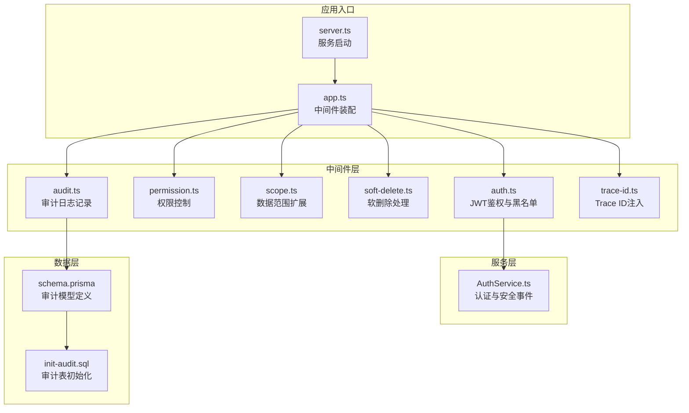
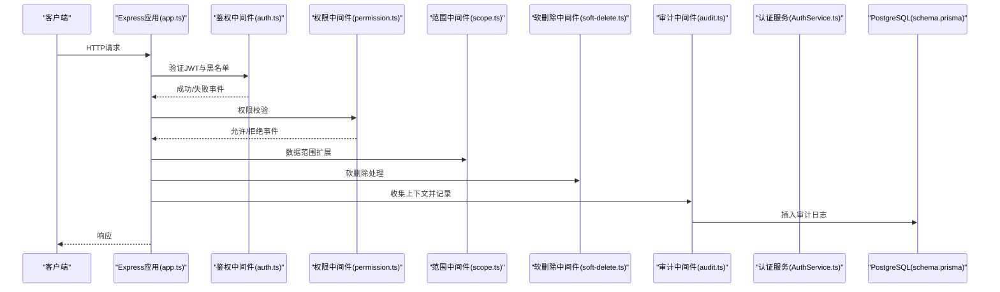
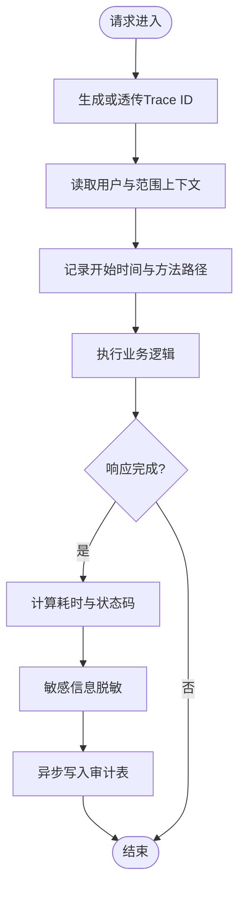
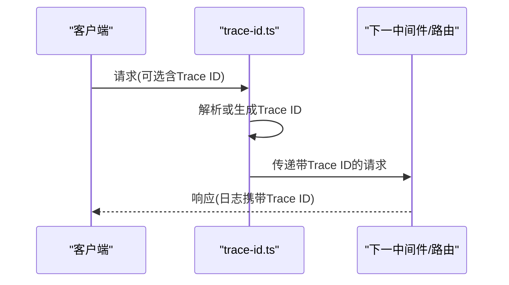
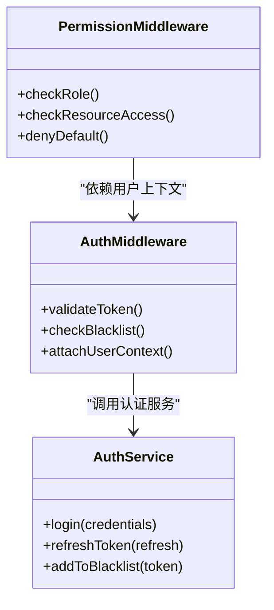
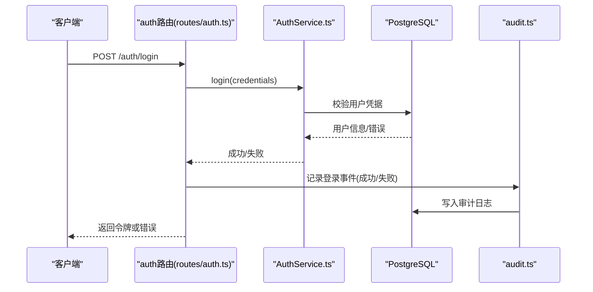
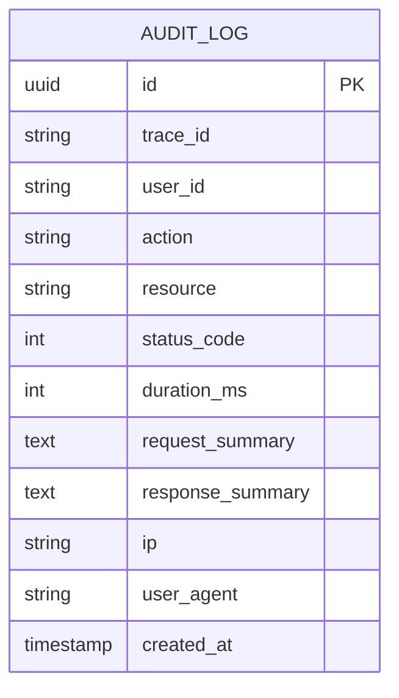
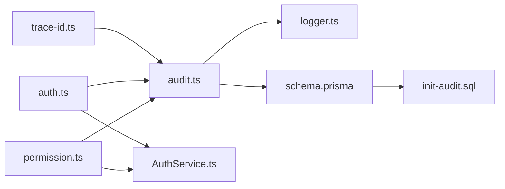

# 审计日志

<cite>
**本文引用的文件**   
- [server/src/middleware/audit.ts](file://server/src/middleware/audit.ts)
- [server/src/middleware/trace-id.ts](file://server/src/middleware/trace-id.ts)
- [server/src/middleware/auth.ts](file://server/src/middleware/auth.ts)
- [server/src/middleware/permission.ts](file://server/src/middleware/permission.ts)
- [server/src/lib/logger.ts](file://server/src/lib/logger.ts)
- [server/prisma/schema.prisma](file://server/prisma/schema.prisma)
- [server/prisma/init-audit.sql](file://server/prisma/init-audit.sql)
- [server/src/app.ts](file://server/src/app.ts)
- [server/src/server.ts](file://server/src/server.ts)
- [server/src/routes/auth.ts](file://server/src/routes/auth.ts)
- [server/src/services/AuthService.ts](file://server/src/services/AuthService.ts)
</cite>

## 目录
1. [简介](#简介)
2. [项目结构](#项目结构)
3. [核心组件](#核心组件)
4. [架构总览](#架构总览)
5. [详细组件分析](#详细组件分析)
6. [依赖关系分析](#依赖关系分析)
7. [性能考虑](#性能考虑)
8. [故障排查指南](#故障排查指南)
9. [结论](#结论)
10. [附录](#附录)

## 简介
本文件面向FY200财年经营数据分析平台的审计日志子系统，聚焦以下目标：
- 操作日志记录机制：用户行为追踪、API调用记录与关键业务操作审计。
- 安全事件追踪：登录失败、权限违规、异常访问等事件的捕获与记录。
- 审计数据存储结构：日志表设计、索引优化与查询性能考量。
- 合规性要求：数据保留策略、日志完整性保证与审计报表生成。
- Trace ID贯穿请求链路的技术实现、日志聚合分析与告警机制。
- 审计查询示例与自定义审计规则配置方法。

本项目后端技术栈为Express 4 + Prisma 5 + PostgreSQL 15 + JWT（access 15分钟 + refresh 7天轮转）+ DeepSeek API（SSE流式）。中间件执行链顺序为：helmet → cors → express.json → rate-limit → auth(JWT+黑名单) → permission(默认拒绝) → scope(Prisma extension) → softDelete → audit → Service → Prisma → PostgreSQL。

## 项目结构
审计相关代码主要分布在以下位置：
- 中间件层：审计记录、Trace ID注入、鉴权与权限校验。
- 服务层：认证流程中的安全事件触发点。
- 数据层：Prisma模型定义与审计库初始化脚本。
- 应用入口：中间件装配与路由挂载。

图表来源
- [server/src/app.ts](file://server/src/app.ts)
- [server/src/middleware/auth.ts](file://server/src/middleware/auth.ts)
- [server/src/middleware/permission.ts](file://server/src/middleware/permission.ts)
- [server/src/middleware/scope.ts](file://server/src/middleware/scope.ts)
- [server/src/middleware/soft-delete.ts](file://server/src/middleware/soft-delete.ts)
- [server/src/middleware/audit.ts](file://server/src/middleware/audit.ts)
- [server/src/middleware/trace-id.ts](file://server/src/middleware/trace-id.ts)
- [server/src/services/AuthService.ts](file://server/src/services/AuthService.ts)
- [server/prisma/schema.prisma](file://server/prisma/schema.prisma)
- [server/prisma/init-audit.sql](file://server/prisma/init-audit.sql)
- [server/src/server.ts](file://server/src/server.ts)

章节来源
- [server/src/app.ts](file://server/src/app.ts)
- [server/src/server.ts](file://server/src/server.ts)

## 核心组件
- 审计中间件（audit.ts）：在请求生命周期中统一采集上下文信息（用户、资源、动作、结果、耗时、Trace ID），并异步写入审计日志。
- Trace ID中间件（trace-id.ts）：为每个请求生成或透传唯一标识，贯穿整个调用链，便于跨服务关联。
- 鉴权与权限中间件（auth.ts、permission.ts）：提供身份认证与细粒度授权，同时作为安全事件触发点（如登录失败、权限不足）。
- 认证服务（AuthService.ts）：封装登录、令牌刷新、黑名单管理等逻辑，集中产生安全事件。
- 审计数据模型（schema.prisma、init-audit.sql）：定义审计日志的持久化结构与初始化脚本。
- 日志工具（logger.ts）：结构化日志输出与错误上报。

章节来源
- [server/src/middleware/audit.ts](file://server/src/middleware/audit.ts)
- [server/src/middleware/trace-id.ts](file://server/src/middleware/trace-id.ts)
- [server/src/middleware/auth.ts](file://server/src/middleware/auth.ts)
- [server/src/middleware/permission.ts](file://server/src/middleware/permission.ts)
- [server/src/services/AuthService.ts](file://server/src/services/AuthService.ts)
- [server/prisma/schema.prisma](file://server/prisma/schema.prisma)
- [server/prisma/init-audit.sql](file://server/prisma/init-audit.sql)
- [server/src/lib/logger.ts](file://server/src/lib/logger.ts)

## 架构总览
审计系统采用“中间件统一采集 + 服务侧安全事件触发 + 数据库持久化”的分层架构。请求进入后，由Trace ID中间件注入全局标识；鉴权与权限中间件负责安全事件判定；审计中间件在响应阶段汇总上下文并落库；认证服务在关键路径上主动记录安全事件。

图表来源
- [server/src/app.ts](file://server/src/app.ts)
- [server/src/middleware/auth.ts](file://server/src/middleware/auth.ts)
- [server/src/middleware/permission.ts](file://server/src/middleware/permission.ts)
- [server/src/middleware/scope.ts](file://server/src/middleware/scope.ts)
- [server/src/middleware/soft-delete.ts](file://server/src/middleware/soft-delete.ts)
- [server/src/middleware/audit.ts](file://server/src/middleware/audit.ts)
- [server/src/services/AuthService.ts](file://server/src/services/AuthService.ts)
- [server/prisma/schema.prisma](file://server/prisma/schema.prisma)

## 详细组件分析

### 审计中间件（audit.ts）
职责与实现要点：
- 请求进入时读取或生成Trace ID，附加到请求上下文。
- 记录请求元数据：方法、路径、参数摘要、用户标识、租户/组织范围。
- 响应完成后记录状态码、耗时、错误信息（脱敏后）。
- 异步写入审计表，避免阻塞主流程。
- 支持可插拔的审计规则：按路由或动作白名单/黑名单过滤。

图表来源
- [server/src/middleware/audit.ts](file://server/src/middleware/audit.ts)

章节来源
- [server/src/middleware/audit.ts](file://server/src/middleware/audit.ts)

### Trace ID贯穿链路（trace-id.ts）
职责与实现要点：
- 若请求头包含Trace ID则透传，否则生成唯一ID。
- 将Trace ID注入请求对象，供后续中间件与服务使用。
- 在日志输出中统一携带Trace ID，便于跨模块关联。

图表来源
- [server/src/middleware/trace-id.ts](file://server/src/middleware/trace-id.ts)

章节来源
- [server/src/middleware/trace-id.ts](file://server/src/middleware/trace-id.ts)

### 鉴权与权限（auth.ts、permission.ts）
职责与实现要点：
- auth.ts：校验JWT有效性、检查黑名单、提取用户上下文。
- permission.ts：基于角色/资源的细粒度授权，默认拒绝模式。
- 安全事件触发点：登录失败、令牌过期、权限不足、黑名单命中等。

图表来源
- [server/src/middleware/auth.ts](file://server/src/middleware/auth.ts)
- [server/src/middleware/permission.ts](file://server/src/middleware/permission.ts)
- [server/src/services/AuthService.ts](file://server/src/services/AuthService.ts)

章节来源
- [server/src/middleware/auth.ts](file://server/src/middleware/auth.ts)
- [server/src/middleware/permission.ts](file://server/src/middleware/permission.ts)
- [server/src/services/AuthService.ts](file://server/src/services/AuthService.ts)

### 认证服务（AuthService.ts）
职责与实现要点：
- 登录流程：校验凭据、签发JWT、记录登录成功/失败事件。
- 令牌刷新：校验refresh token、签发新access token。
- 黑名单管理：登出或强制下线时将token加入黑名单。
- 安全事件：登录失败原因分类（凭据错误、账户锁定、IP限制）、权限违规、异常访问。

图表来源
- [server/src/routes/auth.ts](file://server/src/routes/auth.ts)
- [server/src/services/AuthService.ts](file://server/src/services/AuthService.ts)
- [server/src/middleware/audit.ts](file://server/src/middleware/audit.ts)

章节来源
- [server/src/routes/auth.ts](file://server/src/routes/auth.ts)
- [server/src/services/AuthService.ts](file://server/src/services/AuthService.ts)
- [server/src/middleware/audit.ts](file://server/src/middleware/audit.ts)

### 审计数据模型（schema.prisma、init-audit.sql）
- schema.prisma：定义审计日志实体字段（如id、traceId、userId、action、resource、status、durationMs、requestSummary、responseSummary、ip、userAgent、createdAt等）。
- init-audit.sql：创建审计表、建立必要索引（如按traceId、userId、createdAt、action等），确保查询性能。

图表来源
- [server/prisma/schema.prisma](file://server/prisma/schema.prisma)
- [server/prisma/init-audit.sql](file://server/prisma/init-audit.sql)

章节来源
- [server/prisma/schema.prisma](file://server/prisma/schema.prisma)
- [server/prisma/init-audit.sql](file://server/prisma/init-audit.sql)

## 依赖关系分析
审计系统的依赖关系如下：
- 中间件层依赖Express上下文与请求/响应对象。
- 审计中间件依赖Trace ID中间件与日志工具。
- 鉴权与权限中间件依赖认证服务与用户上下文。
- 数据层依赖Prisma与PostgreSQL。

图表来源
- [server/src/middleware/trace-id.ts](file://server/src/middleware/trace-id.ts)
- [server/src/middleware/audit.ts](file://server/src/middleware/audit.ts)
- [server/src/middleware/auth.ts](file://server/src/middleware/auth.ts)
- [server/src/middleware/permission.ts](file://server/src/middleware/permission.ts)
- [server/src/lib/logger.ts](file://server/src/lib/logger.ts)
- [server/prisma/schema.prisma](file://server/prisma/schema.prisma)
- [server/prisma/init-audit.sql](file://server/prisma/init-audit.sql)
- [server/src/services/AuthService.ts](file://server/src/services/AuthService.ts)

章节来源
- [server/src/middleware/audit.ts](file://server/src/middleware/audit.ts)
- [server/src/middleware/trace-id.ts](file://server/src/middleware/trace-id.ts)
- [server/src/middleware/auth.ts](file://server/src/middleware/auth.ts)
- [server/src/middleware/permission.ts](file://server/src/middleware/permission.ts)
- [server/src/lib/logger.ts](file://server/src/lib/logger.ts)
- [server/prisma/schema.prisma](file://server/prisma/schema.prisma)
- [server/prisma/init-audit.sql](file://server/prisma/init-audit.sql)
- [server/src/services/AuthService.ts](file://server/src/services/AuthService.ts)

## 性能考虑
- 异步写入：审计记录采用异步写入，避免阻塞主请求链路。
- 索引优化：对高频查询字段（traceId、userId、createdAt、action）建立索引，提升检索效率。
- 脱敏策略：敏感信息在写入前进行脱敏，降低存储与传输风险。
- 采样与过滤：对非关键路由或低优先级动作进行采样记录，减少I/O压力。
- 批量写入：在高并发场景下，可考虑批量写入审计日志以降低数据库压力。

[本节为通用性能建议，不直接分析具体文件]

## 故障排查指南
常见问题与定位方法：
- 审计日志缺失：检查审计中间件是否装配、异步写入是否成功、数据库连接是否正常。
- Trace ID不一致：确认Trace ID中间件是否在链路前端执行，下游服务是否正确透传。
- 安全事件未记录：检查鉴权与权限中间件的触发条件、认证服务的异常分支。
- 查询性能差：核对索引是否生效、查询条件是否命中索引、是否存在全表扫描。
- 日志污染：确认脱敏规则是否覆盖所有敏感字段，避免泄露。

章节来源
- [server/src/middleware/audit.ts](file://server/src/middleware/audit.ts)
- [server/src/middleware/trace-id.ts](file://server/src/middleware/trace-id.ts)
- [server/src/middleware/auth.ts](file://server/src/middleware/auth.ts)
- [server/src/middleware/permission.ts](file://server/src/middleware/permission.ts)
- [server/src/lib/logger.ts](file://server/src/lib/logger.ts)

## 结论
FY200审计日志系统通过中间件统一采集、服务侧安全事件触发与数据库持久化，实现了完整的操作与安全事件审计能力。结合Trace ID贯穿链路、索引优化与脱敏策略，系统在性能与安全性之间取得平衡。未来可进一步引入日志聚合与分析平台，增强告警与报表能力。

[本节为总结性内容，不直接分析具体文件]

## 附录

### 审计查询示例
- 按Trace ID查询完整链路：SELECT * FROM audit_log WHERE trace_id = 'xxx';
- 按用户与时间范围查询操作历史：SELECT * FROM audit_log WHERE user_id = 'xxx' AND created_at BETWEEN 'start' AND 'end';
- 统计登录失败次数：SELECT COUNT(*) FROM audit_log WHERE action = 'login_failed' AND created_at >= 'today';
- 权限违规事件：SELECT * FROM audit_log WHERE action = 'permission_denied' ORDER BY created_at DESC LIMIT 100;

[本节为概念性查询示例，不直接分析具体文件]

### 自定义审计规则配置
- 路由白名单：仅记录指定路由的审计日志，减少无关数据。
- 动作黑名单：忽略特定动作（如健康检查）的审计记录。
- 用户维度过滤：对内部账号或测试账号禁用审计记录。
- 采样率配置：对高流量接口设置采样比例，降低存储压力。

[本节为概念性配置说明，不直接分析具体文件]