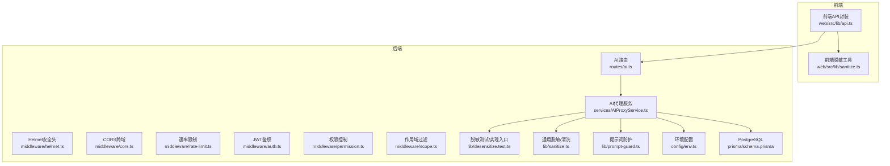
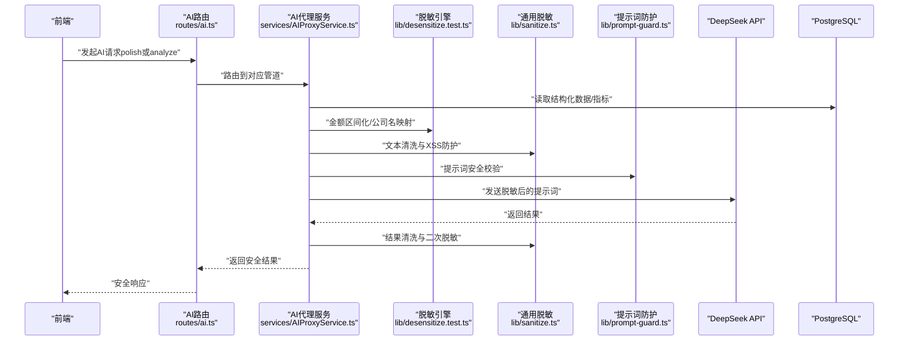
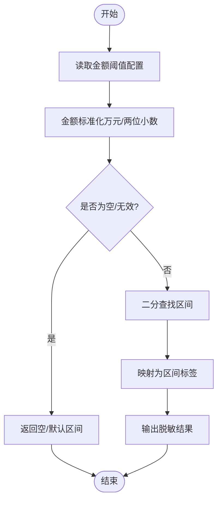
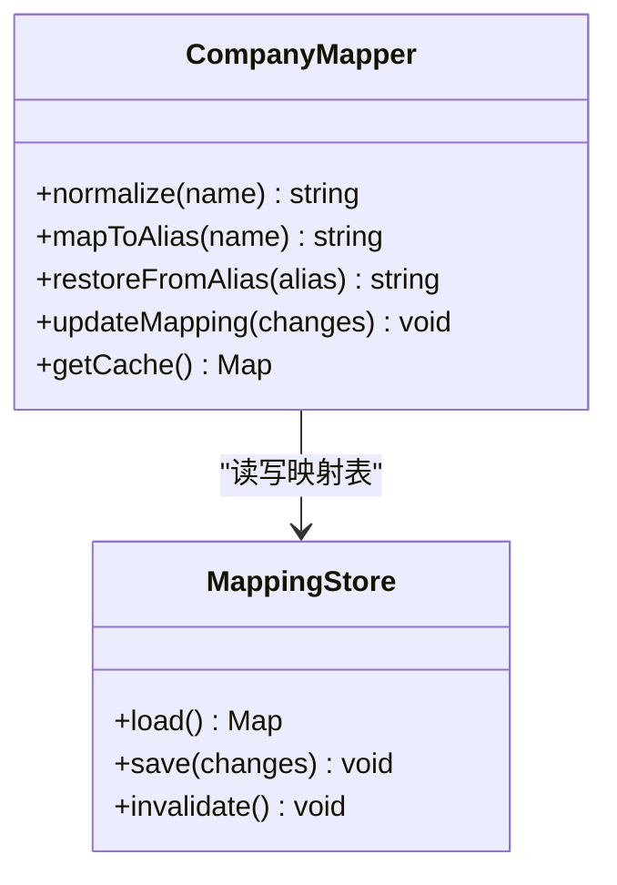
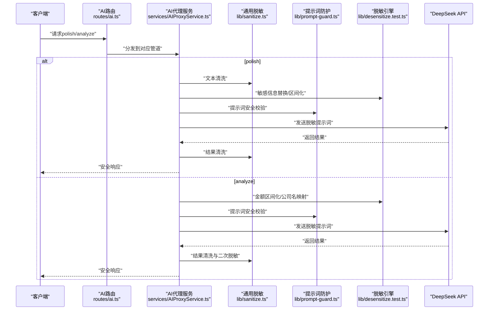

# 数据脱敏

<cite>
**本文引用的文件**   
- [server/src/lib/desensitize.test.ts](file://server/src/lib/desensitize.test.ts)
- [server/src/lib/sanitize.ts](file://server/src/lib/sanitize.ts)
- [server/src/lib/prompt-guard.ts](file://server/src/lib/prompt-guard.ts)
- [server/src/services/AIProxyService.ts](file://server/src/services/AIProxyService.ts)
- [server/src/routes/ai.ts](file://server/src/routes/ai.ts)
- [server/src/middleware/auth.ts](file://server/src/middleware/auth.ts)
- [server/src/middleware/permission.ts](file://server/src/middleware/permission.ts)
- [server/src/middleware/scope.ts](file://server/src/middleware/scope.ts)
- [server/src/middleware/rate-limit.ts](file://server/src/middleware/rate-limit.ts)
- [server/src/middleware/helmet.ts](file://server/src/middleware/helmet.ts)
- [server/src/config/env.ts](file://server/src/config/env.ts)
- [web/src/lib/sanitize.ts](file://web/src/lib/sanitize.ts)
- [web/src/lib/api.ts](file://web/src/lib/api.ts)
- [server/prisma/schema.prisma](file://server/prisma/schema.prisma)
- [server/scripts/ai-pipeline-smoke.ts](file://server/scripts/ai-pipeline-smoke.ts)
</cite>

## 目录
1. [简介](#简介)
2. [项目结构](#项目结构)
3. [核心组件](#核心组件)
4. [架构总览](#架构总览)
5. [详细组件分析](#详细组件分析)
6. [依赖关系分析](#依赖关系分析)
7. [性能考虑](#性能考虑)
8. [故障排查指南](#故障排查指南)
9. [结论](#结论)
10. [附录](#附录)

## 简介
本文件面向FY200财年经营数据分析平台的数据脱敏子系统，聚焦以下目标：
- 绝对金额区间化处理算法：分段规则、区间映射策略与精度控制。
- 公司名动态映射机制：替换规则、映射表管理与动态更新策略。
- AI管道中的脱敏流程：polish（文本→脱敏→LLM→还原）与analyze（结构化→计算→脱敏→LLM→生成）。
- 敏感信息识别规则、脱敏算法选择与性能优化策略。
- 前端展示时的脱敏处理与安全输出机制。
- 脱敏配置示例与自定义规则的扩展方法。

本项目为内部管理口径财务数据平台，单位统一为万元/人民币；AI双管道架构通过“先脱敏后推理”的方式保障隐私安全。

## 项目结构
围绕数据脱敏的关键代码主要分布在后端服务层、中间件链、AI代理与前端工具库中：
- 后端脱敏与提示词防护：lib/desensitize.test.ts、lib/sanitize.ts、lib/prompt-guard.ts
- AI代理与服务编排：services/AIProxyService.ts、routes/ai.ts
- 鉴权与权限、作用域、限流等中间件：middleware/*
- 环境变量与配置：config/env.ts
- 前端脱敏与API调用：web/src/lib/sanitize.ts、web/src/lib/api.ts
- 数据库模型与种子数据：prisma/schema.prisma、scripts/*

图表来源
- [server/src/routes/ai.ts](file://server/src/routes/ai.ts)
- [server/src/services/AIProxyService.ts](file://server/src/services/AIProxyService.ts)
- [server/src/lib/desensitize.test.ts](file://server/src/lib/desensitize.test.ts)
- [server/src/lib/sanitize.ts](file://server/src/lib/sanitize.ts)
- [server/src/lib/prompt-guard.ts](file://server/src/lib/prompt-guard.ts)
- [server/src/config/env.ts](file://server/src/config/env.ts)
- [server/prisma/schema.prisma](file://server/prisma/schema.prisma)
- [web/src/lib/api.ts](file://web/src/lib/api.ts)
- [web/src/lib/sanitize.ts](file://web/src/lib/sanitize.ts)

章节来源
- [server/src/routes/ai.ts](file://server/src/routes/ai.ts)
- [server/src/services/AIProxyService.ts](file://server/src/services/AIProxyService.ts)
- [server/src/lib/desensitize.test.ts](file://server/src/lib/desensitize.test.ts)
- [server/src/lib/sanitize.ts](file://server/src/lib/sanitize.ts)
- [server/src/lib/prompt-guard.ts](file://server/src/lib/prompt-guard.ts)
- [server/src/config/env.ts](file://server/src/config/env.ts)
- [server/prisma/schema.prisma](file://server/prisma/schema.prisma)
- [web/src/lib/api.ts](file://web/src/lib/api.ts)
- [web/src/lib/sanitize.ts](file://web/src/lib/sanitize.ts)

## 核心组件
- 脱敏引擎（金额区间化与公司名映射）
  - 负责将原始数值型指标转换为区间标签，并对公司名称进行动态替换与还原。
  - 关键实现参考：[server/src/lib/desensitize.test.ts](file://server/src/lib/desensitize.test.ts)
- 通用脱敏与清洗（sanitize）
  - 提供字符串清洗、XSS防护、输入规范化等能力，作为AI管道的前置/后置处理。
  - 关键实现参考：[server/src/lib/sanitize.ts](file://server/src/lib/sanitize.ts)、[web/src/lib/sanitize.ts](file://web/src/lib/sanitize.ts)
- 提示词防护（prompt-guard）
  - 对进入LLM的提示词进行安全校验与注入防护，确保不泄露敏感信息。
  - 关键实现参考：[server/src/lib/prompt-guard.ts](file://server/src/lib/prompt-guard.ts)
- AI代理服务（AIProxyService）
  - 编排polish与analyze两条管道，串联脱敏、计算、LLM调用与结果还原。
  - 关键实现参考：[server/src/services/AIProxyService.ts](file://server/src/services/AIProxyService.ts)
- 路由与中间件链
  - 路由层接收请求并委派至服务层；中间件链按顺序执行安全与权限控制。
  - 关键实现参考：[server/src/routes/ai.ts](file://server/src/routes/ai.ts)、[server/src/middleware/auth.ts](file://server/src/middleware/auth.ts)、[server/src/middleware/permission.ts](file://server/src/middleware/permission.ts)、[server/src/middleware/scope.ts](file://server/src/middleware/scope.ts)、[server/src/middleware/rate-limit.ts](file://server/src/middleware/rate-limit.ts)、[server/src/middleware/helmet.ts](file://server/src/middleware/helmet.ts)
- 配置与环境变量
  - 管理AI密钥、脱敏开关、阈值与映射表路径等。
  - 关键实现参考：[server/src/config/env.ts](file://server/src/config/env.ts)

章节来源
- [server/src/lib/desensitize.test.ts](file://server/src/lib/desensitize.test.ts)
- [server/src/lib/sanitize.ts](file://server/src/lib/sanitize.ts)
- [server/src/lib/prompt-guard.ts](file://server/src/lib/prompt-guard.ts)
- [server/src/services/AIProxyService.ts](file://server/src/services/AIProxyService.ts)
- [server/src/routes/ai.ts](file://server/src/routes/ai.ts)
- [server/src/middleware/auth.ts](file://server/src/middleware/auth.ts)
- [server/src/middleware/permission.ts](file://server/src/middleware/permission.ts)
- [server/src/middleware/scope.ts](file://server/src/middleware/scope.ts)
- [server/src/middleware/rate-limit.ts](file://server/src/middleware/rate-limit.ts)
- [server/src/middleware/helmet.ts](file://server/src/middleware/helmet.ts)
- [server/src/config/env.ts](file://server/src/config/env.ts)

## 架构总览
FY200数据脱敏系统采用“前后端协同+AI双管道”的架构：
- 前端在展示前进行基础脱敏与格式化，避免敏感值直接渲染。
- 后端在AI管道中对数据进行严格脱敏后再送入LLM，并在返回前做二次脱敏与格式校验。
- 中间件链保证请求从安全到权限再到作用域的层层过滤。

图表来源
- [server/src/routes/ai.ts](file://server/src/routes/ai.ts)
- [server/src/services/AIProxyService.ts](file://server/src/services/AIProxyService.ts)
- [server/src/lib/desensitize.test.ts](file://server/src/lib/desensitize.test.ts)
- [server/src/lib/sanitize.ts](file://server/src/lib/sanitize.ts)
- [server/src/lib/prompt-guard.ts](file://server/src/lib/prompt-guard.ts)
- [server/prisma/schema.prisma](file://server/prisma/schema.prisma)

## 详细组件分析

### 绝对金额区间化处理算法
- 分段规则
  - 将连续金额划分为若干区间段（如0~1万、1~5万、5~20万、20~100万、100万以上），具体阈值由配置驱动。
  - 支持不同业务维度（科目、期间、组织）的差异化阈值。
- 区间映射策略
  - 使用“左闭右开”或“闭区间”策略，确保边界值归属明确且可重复。
  - 映射结果为可读的区间标签，便于看板与报表展示。
- 精度控制
  - 所有金额以万元为单位，保留两位小数，避免浮点误差。
  - 区间划分时进行四舍五入或截断策略统一，确保一致性。
- 复杂度与性能
  - 区间查找采用有序数组+二分查找，时间复杂度O(log n)，适合大批量指标快速映射。
  - 批量处理时使用内存缓存阈值表，减少重复计算。

图表来源
- [server/src/lib/desensitize.test.ts](file://server/src/lib/desensitize.test.ts)

章节来源
- [server/src/lib/desensitize.test.ts](file://server/src/lib/desensitize.test.ts)

### 公司名动态映射机制
- 替换规则
  - 建立“真实名称→匿名标识”的映射表，支持别名归一化（大小写、空格、标点）。
  - 同一实体在不同上下文中保持相同匿名标识，保证一致性。
- 映射表管理
  - 映射表可来源于数据库或配置文件，支持热更新与版本控制。
  - 提供增删改查接口，管理员可维护映射关系。
- 动态更新策略
  - 变更生效采用增量更新与缓存失效策略，避免全量重建。
  - 支持回滚与审计日志，确保可追溯。

图表来源
- [server/src/lib/desensitize.test.ts](file://server/src/lib/desensitize.test.ts)

章节来源
- [server/src/lib/desensitize.test.ts](file://server/src/lib/desensitize.test.ts)

### AI管道中的脱敏流程
- polish管道（文本→脱敏→LLM→还原）
  - 输入为自然语言描述或报告草稿，先进行文本清洗与敏感信息识别，再替换为占位符或区间标签，随后送入LLM生成内容，最后还原为可读形式。
- analyze管道（结构化→计算→脱敏→LLM→生成）
  - 输入为结构化指标数据，先进行同比/环比等实时计算，再进行金额区间化与公司名映射，随后送入LLM生成分析结论，最后进行结果清洗与二次脱敏。

图表来源
- [server/src/routes/ai.ts](file://server/src/routes/ai.ts)
- [server/src/services/AIProxyService.ts](file://server/src/services/AIProxyService.ts)
- [server/src/lib/sanitize.ts](file://server/src/lib/sanitize.ts)
- [server/src/lib/prompt-guard.ts](file://server/src/lib/prompt-guard.ts)
- [server/src/lib/desensitize.test.ts](file://server/src/lib/desensitize.test.ts)

章节来源
- [server/src/routes/ai.ts](file://server/src/routes/ai.ts)
- [server/src/services/AIProxyService.ts](file://server/src/services/AIProxyService.ts)
- [server/src/lib/sanitize.ts](file://server/src/lib/sanitize.ts)
- [server/src/lib/prompt-guard.ts](file://server/src/lib/prompt-guard.ts)
- [server/src/lib/desensitize.test.ts](file://server/src/lib/desensitize.test.ts)

### 敏感信息识别规则与脱敏算法选择
- 敏感信息识别
  - 金额字段：基于字段名模式匹配与数据类型判断，自动识别为需区间化的数值。
  - 公司名：基于字典匹配与正则表达式，结合上下文语义进行消歧。
  - 其他PII：手机号、邮箱、身份证等通过正则与规则库识别。
- 脱敏算法选择
  - 金额：区间化（分段映射）为主，必要时叠加哈希或掩码。
  - 公司名：动态映射（别名化）为主，支持还原策略。
  - 文本：占位符替换与上下文保护，避免破坏语义。
- 精度与一致性
  - 统一单位与精度，确保跨模块一致性与可复现性。

章节来源
- [server/src/lib/desensitize.test.ts](file://server/src/lib/desensitize.test.ts)
- [server/src/lib/sanitize.ts](file://server/src/lib/sanitize.ts)
- [server/src/lib/prompt-guard.ts](file://server/src/lib/prompt-guard.ts)

### 前端数据展示时的脱敏处理与安全输出
- 前端脱敏
  - 在渲染表格与图表前，对金额字段进行区间化显示，对公司名进行匿名化展示。
  - 使用本地工具库进行基础清洗与格式化，避免XSS注入。
- 安全输出
  - 禁止直接输出原始敏感字段，统一通过API返回脱敏后的数据。
  - 对导出功能增加二次脱敏与水印，防止数据外泄。

章节来源
- [web/src/lib/sanitize.ts](file://web/src/lib/sanitize.ts)
- [web/src/lib/api.ts](file://web/src/lib/api.ts)

### 脱敏配置示例与自定义规则扩展
- 配置项建议
  - 金额阈值表：JSON或数据库表，支持多版本与灰度发布。
  - 公司名映射表：CSV或数据库表，支持别名与归一化规则。
  - 脱敏开关：全局开关与按字段开关，便于调试与A/B测试。
- 扩展方法
  - 新增脱敏类型：实现统一的脱敏接口，注册到调度器。
  - 自定义规则：通过插件机制加载外部规则库，支持热更新。
  - 审计与监控：记录脱敏操作日志与性能指标，便于问题定位。

章节来源
- [server/src/config/env.ts](file://server/src/config/env.ts)
- [server/src/lib/desensitize.test.ts](file://server/src/lib/desensitize.test.ts)

## 依赖关系分析
- 中间件链顺序
  - helmet → cors → express.json → rate-limit → auth(JWT+黑名单) → permission(默认拒绝) → scope(Prisma extension) → softDelete → audit → Service → Prisma → PostgreSQL
- 组件耦合
  - AI代理服务依赖脱敏引擎、通用脱敏与提示词防护，形成低耦合高内聚的服务层。
  - 前端通过API封装与后端交互，脱敏逻辑集中在后端，前端仅做展示层处理。

图表来源
- [server/src/middleware/helmet.ts](file://server/src/middleware/helmet.ts)
- [server/src/middleware/cors.ts](file://server/src/middleware/cors.ts)
- [server/src/middleware/rate-limit.ts](file://server/src/middleware/rate-limit.ts)
- [server/src/middleware/auth.ts](file://server/src/middleware/auth.ts)
- [server/src/middleware/permission.ts](file://server/src/middleware/permission.ts)
- [server/src/middleware/scope.ts](file://server/src/middleware/scope.ts)

章节来源
- [server/src/middleware/helmet.ts](file://server/src/middleware/helmet.ts)
- [server/src/middleware/cors.ts](file://server/src/middleware/cors.ts)
- [server/src/middleware/rate-limit.ts](file://server/src/middleware/rate-limit.ts)
- [server/src/middleware/auth.ts](file://server/src/middleware/auth.ts)
- [server/src/middleware/permission.ts](file://server/src/middleware/permission.ts)
- [server/src/middleware/scope.ts](file://server/src/middleware/scope.ts)

## 性能考虑
- 批量处理与缓存
  - 对金额阈值表与公司名映射表进行内存缓存，减少IO开销。
  - 批量脱敏时使用并行处理与批大小控制，提升吞吐。
- 计算优化
  - 同比/环比等实时计算避免落库，仅在内存中完成。
  - 区间查找采用二分搜索，降低时间复杂度。
- 资源限制
  - 通过rate-limit限制AI调用频率，防止滥用。
  - 使用helmet与CORS限制不安全头部与跨域访问。

[本节为通用指导，无需特定文件引用]

## 故障排查指南
- 常见问题
  - 金额区间化异常：检查阈值配置与单位换算是否正确。
  - 公司名映射不一致：核对别名归一化规则与映射表版本。
  - AI管道失败：查看提示词防护日志与LLM返回状态。
- 调试手段
  - 启用脱敏开关与详细日志，定位脱敏前后数据差异。
  - 使用烟雾测试脚本验证端到端流程。
- 恢复策略
  - 回滚映射表与阈值配置，确保系统可用性。
  - 切换备用AI密钥与降级策略。

章节来源
- [server/scripts/ai-pipeline-smoke.ts](file://server/scripts/ai-pipeline-smoke.ts)
- [server/src/lib/prompt-guard.ts](file://server/src/lib/prompt-guard.ts)
- [server/src/lib/sanitize.ts](file://server/src/lib/sanitize.ts)
- [server/src/lib/desensitize.test.ts](file://server/src/lib/desensitize.test.ts)

## 结论
FY200数据脱敏系统通过严格的中间件链、AI双管道与前后端协同，实现了金额区间化与公司名动态映射的安全脱敏。系统在性能、可扩展性与可维护性方面具备良好设计，建议持续完善配置管理与监控告警，进一步提升稳定性与安全性。

[本节为总结性内容，无需特定文件引用]

## 附录
- 术语表
  - 区间化：将连续数值映射为离散区间标签的过程。
  - 动态映射：根据运行时配置或数据源动态更新映射关系。
  - 提示词防护：对进入LLM的提示词进行安全校验与注入防护。
- 参考实现
  - 脱敏引擎：[server/src/lib/desensitize.test.ts](file://server/src/lib/desensitize.test.ts)
  - 通用脱敏：[server/src/lib/sanitize.ts](file://server/src/lib/sanitize.ts)、[web/src/lib/sanitize.ts](file://web/src/lib/sanitize.ts)
  - 提示词防护：[server/src/lib/prompt-guard.ts](file://server/src/lib/prompt-guard.ts)
  - AI代理：[server/src/services/AIProxyService.ts](file://server/src/services/AIProxyService.ts)
  - 路由与中间件：[server/src/routes/ai.ts](file://server/src/routes/ai.ts)、[server/src/middleware/*](file://server/src/middleware/)
  - 配置与环境：[server/src/config/env.ts](file://server/src/config/env.ts)
  - 数据库模型：[server/prisma/schema.prisma](file://server/prisma/schema.prisma)

[本节为附录内容，无需特定文件引用]