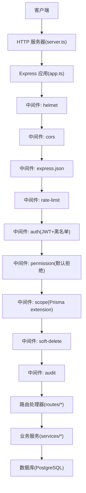
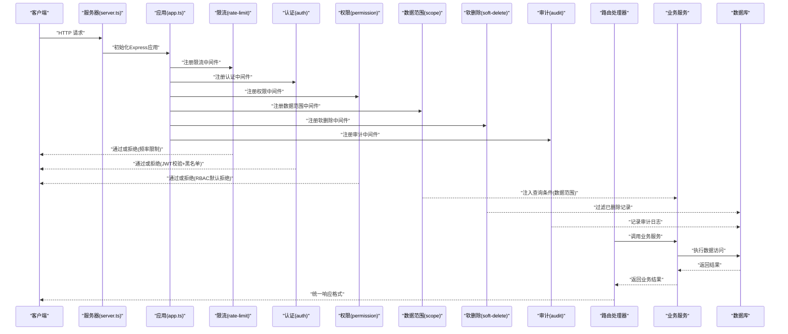
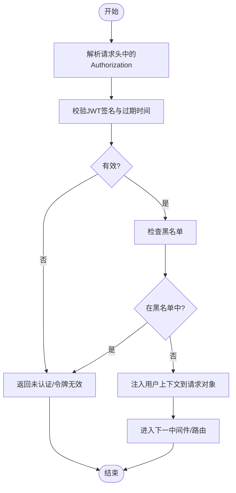
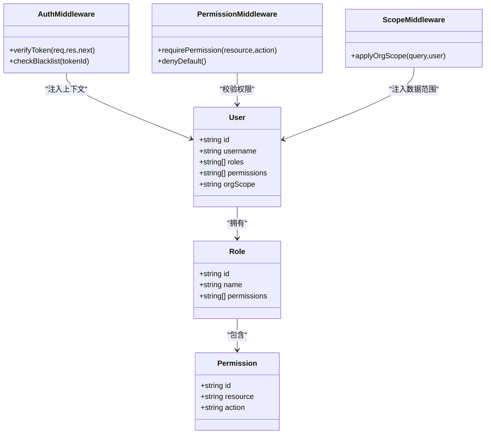
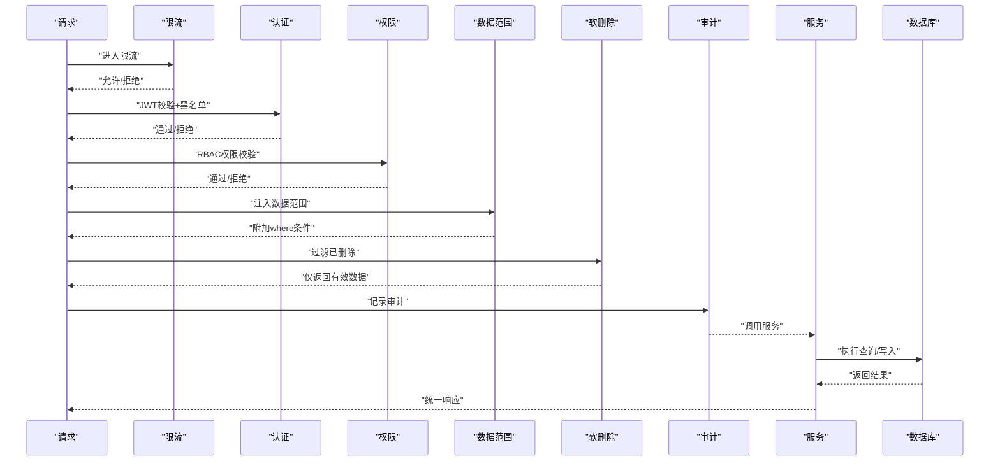
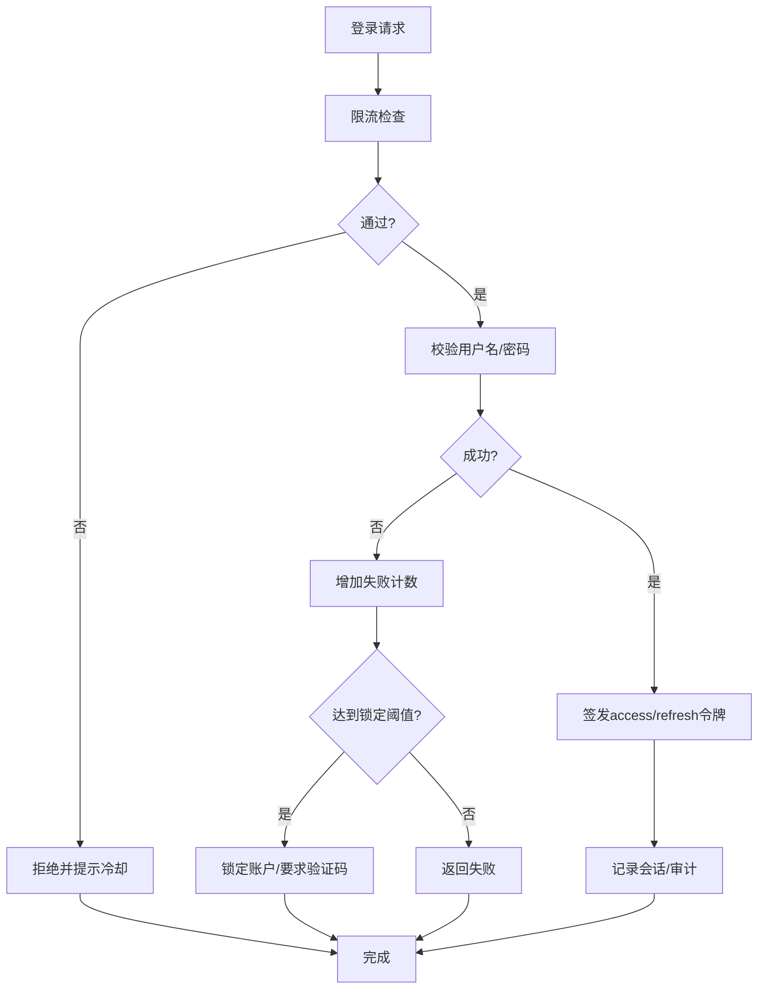
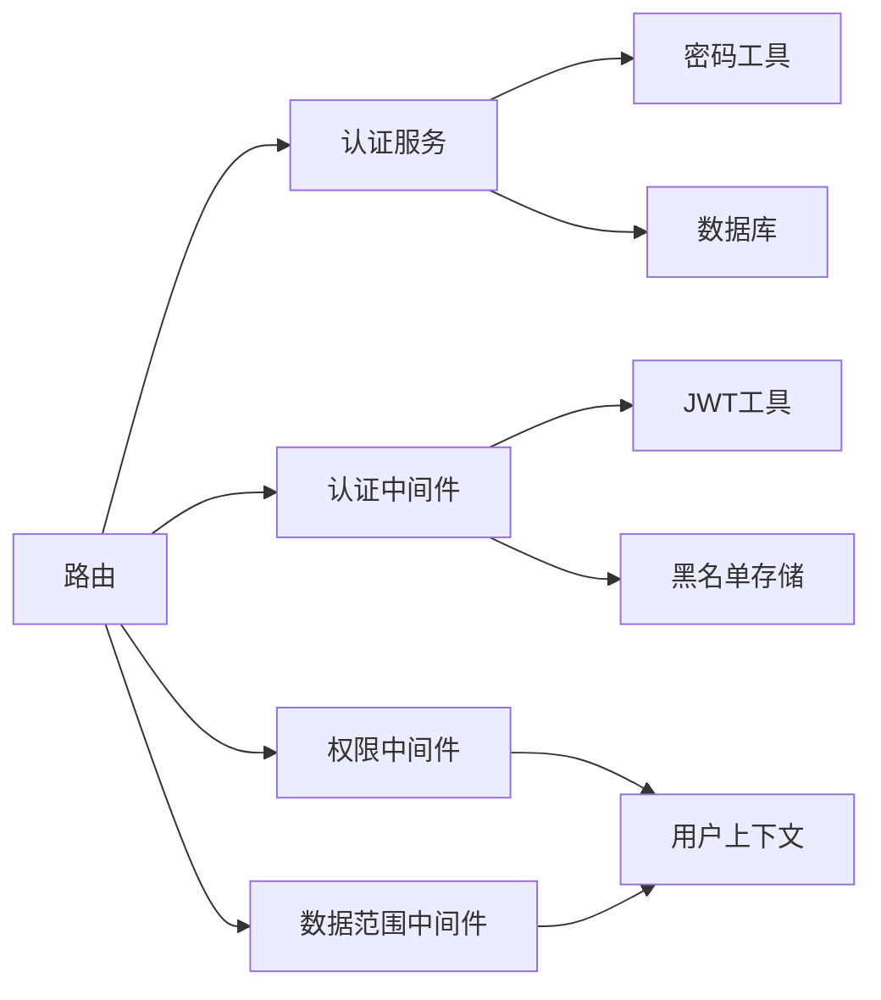

# 认证与授权

<cite>
**本文引用的文件**   
- [server/src/app.ts](file://server/src/app.ts)
- [server/src/server.ts](file://server/src/server.ts)
- [server/src/middleware/auth.ts](file://server/src/middleware/auth.ts)
- [server/src/middleware/permission.ts](file://server/src/middleware/permission.ts)
- [server/src/middleware/scope.ts](file://server/src/middleware/scope.ts)
- [server/src/lib/jwt.ts](file://server/src/lib/jwt.ts)
- [server/src/lib/password.ts](file://server/src/lib/password.ts)
- [server/src/routes/auth.ts](file://server/src/routes/auth.ts)
- [server/src/services/AuthService.ts](file://server/src/services/AuthService.ts)
- [server/src/config/env.ts](file://server/src/config/env.ts)
- [server/src/middleware/rate-limit.ts](file://server/src/middleware/rate-limit.ts)
- [server/src/middleware/helmet.ts](file://server/src/middleware/helmet.ts)
- [server/src/middleware/cors.ts](file://server/src/middleware/cors.ts)
- [server/src/middleware/error-handler.ts](file://server/src/middleware/error-handler.ts)
- [server/src/middleware/audit.ts](file://server/src/middleware/audit.ts)
- [server/src/middleware/soft-delete.ts](file://server/src/middleware/soft-delete.ts)
- [server/src/lib/errors.ts](file://server/src/lib/errors.ts)
- [server/src/lib/response.ts](file://server/src/lib/response.ts)
- [server/prisma/schema.prisma](file://server/prisma/schema.prisma)
</cite>

## 目录
1. [简介](#简介)
2. [项目结构](#项目结构)
3. [核心组件](#核心组件)
4. [架构总览](#架构总览)
5. [详细组件分析](#详细组件分析)
6. [依赖关系分析](#依赖关系分析)
7. [性能考量](#性能考量)
8. [故障排查指南](#故障排查指南)
9. [结论](#结论)
10. [附录](#附录)

## 简介
本文件面向FY200认证与授权系统，系统性阐述JWT双令牌机制（access token 15分钟、refresh token 7天）的生成、验证、刷新与黑名单管理；RBAC权限控制模型（角色定义、权限分配、默认拒绝原则、数据范围控制）；中间件执行链中的认证流程（从请求进入到底层服务调用）；以及用户会话管理、密码安全存储、登录失败锁定等安全机制。文档同时提供权限配置示例与常见权限场景的实现方案，帮助开发者快速理解并正确扩展系统的安全能力。

## 项目结构
后端采用Express 4 + Prisma 5 + PostgreSQL 15，认证与授权相关代码主要分布在以下模块：
- 应用启动与中间件装配：app.ts、server.ts
- 认证路由与服务：routes/auth.ts、services/AuthService.ts
- JWT工具与密码工具：lib/jwt.ts、lib/password.ts
- 中间件链：helmet、cors、rate-limit、auth、permission、scope、soft-delete、audit、error-handler
- 配置与环境变量：config/env.ts
- 错误与响应封装：lib/errors.ts、lib/response.ts
- 数据库模型：prisma/schema.prisma

**图示来源** 
- [server/src/server.ts](file://server/src/server.ts)
- [server/src/app.ts](file://server/src/app.ts)
- [server/src/middleware/helmet.ts](file://server/src/middleware/helmet.ts)
- [server/src/middleware/cors.ts](file://server/src/middleware/cors.ts)
- [server/src/middleware/rate-limit.ts](file://server/src/middleware/rate-limit.ts)
- [server/src/middleware/auth.ts](file://server/src/middleware/auth.ts)
- [server/src/middleware/permission.ts](file://server/src/middleware/permission.ts)
- [server/src/middleware/scope.ts](file://server/src/middleware/scope.ts)
- [server/src/middleware/soft-delete.ts](file://server/src/middleware/soft-delete.ts)
- [server/src/middleware/audit.ts](file://server/src/middleware/audit.ts)

**章节来源**
- [server/src/app.ts](file://server/src/app.ts)
- [server/src/server.ts](file://server/src/server.ts)

## 核心组件
- JWT工具库：负责access token与refresh token的签发、校验、过期处理与黑名单判断。
- 密码工具库：负责密码哈希与比对，确保存储安全。
- 认证中间件：解析请求头中的token，校验签名与有效期，检查黑名单，注入用户上下文。
- 权限中间件：基于RBAC进行“默认拒绝”的权限判定，支持资源级与操作级权限。
- 数据范围中间件：通过Prisma扩展注入数据范围过滤条件，实现租户/组织/部门级别的数据隔离。
- 认证服务：封装登录、登出、刷新令牌、失败计数与锁定策略等业务逻辑。
- 错误与响应：统一异常类型与HTTP响应格式。

**章节来源**
- [server/src/lib/jwt.ts](file://server/src/lib/jwt.ts)
- [server/src/lib/password.ts](file://server/src/lib/password.ts)
- [server/src/middleware/auth.ts](file://server/src/middleware/auth.ts)
- [server/src/middleware/permission.ts](file://server/src/middleware/permission.ts)
- [server/src/middleware/scope.ts](file://server/src/middleware/scope.ts)
- [server/src/services/AuthService.ts](file://server/src/services/AuthService.ts)
- [server/src/lib/errors.ts](file://server/src/lib/errors.ts)
- [server/src/lib/response.ts](file://server/src/lib/response.ts)

## 架构总览
下图展示了从HTTP请求进入，到鉴权、权限、数据范围、审计、再到服务与数据库的完整链路。

**图示来源** 
- [server/src/server.ts](file://server/src/server.ts)
- [server/src/app.ts](file://server/src/app.ts)
- [server/src/middleware/rate-limit.ts](file://server/src/middleware/rate-limit.ts)
- [server/src/middleware/auth.ts](file://server/src/middleware/auth.ts)
- [server/src/middleware/permission.ts](file://server/src/middleware/permission.ts)
- [server/src/middleware/scope.ts](file://server/src/middleware/scope.ts)
- [server/src/middleware/soft-delete.ts](file://server/src/middleware/soft-delete.ts)
- [server/src/middleware/audit.ts](file://server/src/middleware/audit.ts)

## 详细组件分析

### JWT双令牌机制（access 15分钟 + refresh 7天）
- 令牌生成
  - access token：短生命周期（约15分钟），用于接口鉴权，携带最小必要用户信息。
  - refresh token：长生命周期（约7天），用于无感刷新access token，建议独立存储与传输通道保护。
- 令牌校验
  - 校验签名有效性、过期时间、算法与密钥一致性。
  - 检查黑名单（如登出、强制下线、批量撤销）。
- 令牌刷新
  - 使用refresh token换取新的access token。
  - 支持轮换策略（可选）：每次刷新可回收旧refresh token或引入版本控制。
- 黑名单管理
  - 基于Redis或内存表维护黑名单键（如token ID或子声明）。
  - 支持按用户维度批量撤销与按会话粒度撤销。

**图示来源** 
- [server/src/lib/jwt.ts](file://server/src/lib/jwt.ts)
- [server/src/middleware/auth.ts](file://server/src/middleware/auth.ts)

**章节来源**
- [server/src/lib/jwt.ts](file://server/src/lib/jwt.ts)
- [server/src/middleware/auth.ts](file://server/src/middleware/auth.ts)

### RBAC权限控制模型（角色、权限、默认拒绝、数据范围）
- 角色与权限
  - 角色（Role）：如管理员、财务、运营等，具备一组权限集合。
  - 权限（Permission）：细粒度到资源与操作，如“报表:查看”、“指标:编辑”。
- 默认拒绝原则
  - 未显式授权的请求一律拒绝，降低越权风险。
- 数据范围控制
  - 通过scope中间件将当前用户的组织/部门/公司维度注入到查询条件。
  - 结合Prisma扩展自动附加where条件，避免业务层遗漏。

**图示来源** 
- [server/src/middleware/permission.ts](file://server/src/middleware/permission.ts)
- [server/src/middleware/scope.ts](file://server/src/middleware/scope.ts)
- [server/prisma/schema.prisma](file://server/prisma/schema.prisma)

**章节来源**
- [server/src/middleware/permission.ts](file://server/src/middleware/permission.ts)
- [server/src/middleware/scope.ts](file://server/src/middleware/scope.ts)
- [server/prisma/schema.prisma](file://server/prisma/schema.prisma)

### 中间件执行链中的认证流程（从请求进入到底层服务调用）
- 顺序：helmet → cors → express.json → rate-limit → auth → permission → scope → soft-delete → audit → Service → Prisma → PostgreSQL
- 关键点：
  - rate-limit：防止暴力破解与滥用。
  - auth：JWT校验与黑名单检查，失败立即拒绝。
  - permission：默认拒绝，需显式授权。
  - scope：自动注入数据范围，保证数据隔离。
  - soft-delete：过滤已删除记录。
  - audit：记录关键操作审计日志。

**图示来源** 
- [server/src/app.ts](file://server/src/app.ts)
- [server/src/middleware/rate-limit.ts](file://server/src/middleware/rate-limit.ts)
- [server/src/middleware/auth.ts](file://server/src/middleware/auth.ts)
- [server/src/middleware/permission.ts](file://server/src/middleware/permission.ts)
- [server/src/middleware/scope.ts](file://server/src/middleware/scope.ts)
- [server/src/middleware/soft-delete.ts](file://server/src/middleware/soft-delete.ts)
- [server/src/middleware/audit.ts](file://server/src/middleware/audit.ts)

**章节来源**
- [server/src/app.ts](file://server/src/app.ts)

### 用户会话管理与登录失败锁定
- 会话管理
  - 登录后颁发双令牌，前端保存refresh token（建议HttpOnly Cookie），access token可存内存或短期缓存。
  - 支持主动登出（加入黑名单）、强制下线（按用户维度撤销）。
- 登录失败锁定
  - 记录失败次数与锁定阈值，超过阈值后临时锁定账户或要求验证码。
  - 锁定状态可持久化至数据库或缓存，支持超时自动解锁。

**图示来源** 
- [server/src/routes/auth.ts](file://server/src/routes/auth.ts)
- [server/src/services/AuthService.ts](file://server/src/services/AuthService.ts)
- [server/src/middleware/rate-limit.ts](file://server/src/middleware/rate-limit.ts)

**章节来源**
- [server/src/routes/auth.ts](file://server/src/routes/auth.ts)
- [server/src/services/AuthService.ts](file://server/src/services/AuthService.ts)
- [server/src/middleware/rate-limit.ts](file://server/src/middleware/rate-limit.ts)

### 密码安全存储
- 使用强哈希算法（如bcrypt/argon2）对密码进行加盐哈希。
- 禁止明文存储与可逆加密。
- 定期升级哈希参数以应对算力提升。

**章节来源**
- [server/src/lib/password.ts](file://server/src/lib/password.ts)

### 权限配置示例与常见权限场景
- 角色与权限映射
  - 管理员：所有资源与操作。
  - 财务：报表查看/导出、指标编辑、数据导入。
  - 运营：看板查看、报告生成。
- 默认拒绝
  - 未配置的权限一律拒绝，新增功能需显式授权。
- 数据范围
  - 按组织/部门/公司维度过滤数据，避免跨域访问。
- 常见场景
  - 报表导出：需要“报表:导出”权限，且数据范围限定在当前组织。
  - 指标编辑：需要“指标:编辑”权限，且仅能编辑本人或本部门指标。
  - 数据导入：需要“数据:导入”权限，且导入模板受白名单算子约束。

**章节来源**
- [server/src/middleware/permission.ts](file://server/src/middleware/permission.ts)
- [server/src/middleware/scope.ts](file://server/src/middleware/scope.ts)

## 依赖关系分析
- 中间件依赖
  - auth依赖jwt工具与黑名单存储。
  - permission依赖用户上下文中的角色与权限集合。
  - scope依赖用户上下文中的数据范围属性。
- 服务依赖
  - AuthService依赖密码工具与数据库模型。
  - 路由依赖服务与中间件上下文。
- 外部依赖
  - PostgreSQL作为数据源。
  - Redis（可选）用于黑名单与限流计数。

**图示来源** 
- [server/src/middleware/auth.ts](file://server/src/middleware/auth.ts)
- [server/src/lib/jwt.ts](file://server/src/lib/jwt.ts)
- [server/src/middleware/permission.ts](file://server/src/middleware/permission.ts)
- [server/src/middleware/scope.ts](file://server/src/middleware/scope.ts)
- [server/src/services/AuthService.ts](file://server/src/services/AuthService.ts)
- [server/src/lib/password.ts](file://server/src/lib/password.ts)

**章节来源**
- [server/src/middleware/auth.ts](file://server/src/middleware/auth.ts)
- [server/src/lib/jwt.ts](file://server/src/lib/jwt.ts)
- [server/src/middleware/permission.ts](file://server/src/middleware/permission.ts)
- [server/src/middleware/scope.ts](file://server/src/middleware/scope.ts)
- [server/src/services/AuthService.ts](file://server/src/services/AuthService.ts)
- [server/src/lib/password.ts](file://server/src/lib/password.ts)

## 性能考量
- 令牌校验开销
  - JWT签名校验为CPU密集型，建议启用并发与缓存用户元数据（只读）。
- 黑名单查询
  - 使用Redis或内存表，避免频繁磁盘IO。
- 限流与锁
  - 合理设置阈值与窗口，避免误伤正常流量。
- 数据范围过滤
  - 通过Prisma扩展在数据库层过滤，减少数据传输量。

[本节为通用指导，不直接分析具体文件]

## 故障排查指南
- 常见问题
  - 401未认证：检查Authorization头、JWT签名与过期时间、黑名单状态。
  - 403禁止访问：检查RBAC权限配置与默认拒绝策略。
  - 数据越界：检查scope注入的数据范围是否正确。
  - 登录失败锁定：检查失败计数与锁定阈值。
- 调试建议
  - 开启审计日志，定位请求路径与操作主体。
  - 打印中间件执行顺序与上下文字段。
  - 校验环境变量配置（密钥、过期时间、限流参数）。

**章节来源**
- [server/src/lib/errors.ts](file://server/src/lib/errors.ts)
- [server/src/lib/response.ts](file://server/src/lib/response.ts)
- [server/src/middleware/audit.ts](file://server/src/middleware/audit.ts)

## 结论
FY200认证与授权系统通过JWT双令牌机制与RBAC默认拒绝原则，构建了高安全性的鉴权体系。中间件链清晰分层，职责单一，便于扩展与维护。配合数据范围控制与审计日志，实现了细粒度的权限与数据安全。建议在生产环境中强化黑名单与限流策略，持续优化令牌校验与查询性能。

[本节为总结性内容，不直接分析具体文件]

## 附录
- 环境变量参考
  - JWT密钥、access/refresh过期时间、限流阈值、黑名单存储地址等。
- 配置示例
  - 角色与权限映射表、数据范围规则、审计字段定义。

**章节来源**
- [server/src/config/env.ts](file://server/src/config/env.ts)
- [server/prisma/schema.prisma](file://server/prisma/schema.prisma)