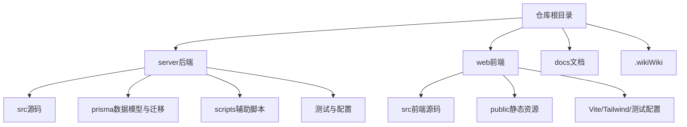
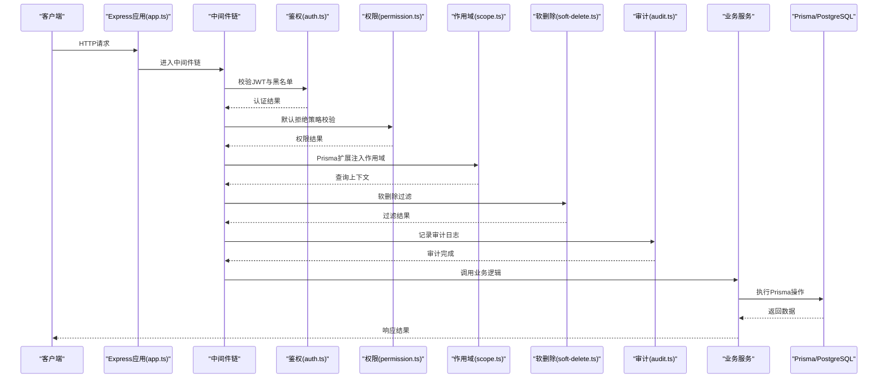
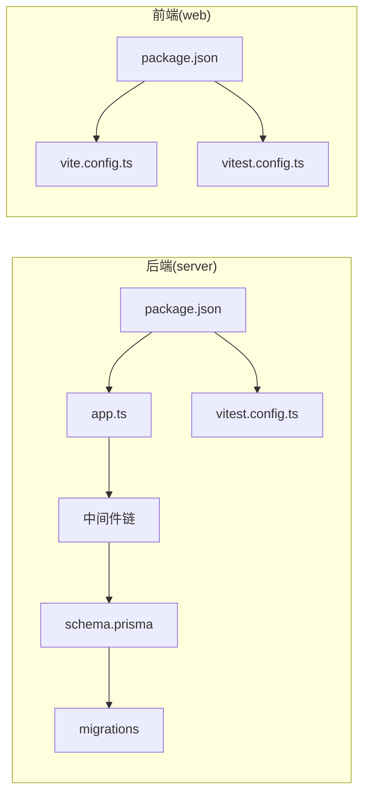

# Git工作流与协作规范

<cite>
**本文引用的文件**   
- [server/package.json](file://server/package.json)
- [web/package.json](file://web/package.json)
- [server/src/app.ts](file://server/src/app.ts)
- [server/src/server.ts](file://server/src/server.ts)
- [server/src/middleware/auth.ts](file://server/src/middleware/auth.ts)
- [server/src/middleware/permission.ts](file://server/src/middleware/permission.ts)
- [server/src/middleware/scope.ts](file://server/src/middleware/scope.ts)
- [server/src/middleware/soft-delete.ts](file://server/src/middleware/soft-delete.ts)
- [server/src/middleware/audit.ts](file://server/src/middleware/audit.ts)
- [server/src/lib/jwt.ts](file://server/src/lib/jwt.ts)
- [server/prisma/schema.prisma](file://server/prisma/schema.prisma)
- [server/prisma/migrations/20260722121714_init/migration.sql](file://server/prisma/migrations/20260722121714_init/migration.sql)
- [server/scripts/local-db.ts](file://server/scripts/local-db.ts)
- [web/vite.config.ts](file://web/vite.config.ts)
- [web/vitest.config.ts](file://web/vitest.config.ts)
- [server/vitest.config.ts](file://server/vitest.config.ts)
- [server/src/test/setup.ts](file://server/src/test/setup.ts)
- [web/src/test/setup.ts](file://web/src/test/setup.ts)
- [server/.gitignore](file://server/.gitignore)
- [web/.gitignore](file://web/.gitignore)
- [.gitignore](file://.gitignore)
</cite>

## 目录
1. [引言](#引言)
2. [项目结构](#项目结构)
3. [核心组件](#核心组件)
4. [架构总览](#架构总览)
5. [详细组件分析](#详细组件分析)
6. [依赖分析](#依赖分析)
7. [性能考虑](#性能考虑)
8. [故障排查指南](#故障排查指南)
9. [结论](#结论)
10. [附录](#附录)

## 引言
本规范面向FY200（浙江壹品慧财年经营数据分析平台）的Git工作流与团队协作，目标是统一分支策略、提交信息、代码审查、发布流程、冲突解决与CI/CD集成，确保“Excel进、看板/报表出”的数据平台在安全、稳定、可追溯的前提下高效迭代。

## 项目结构
仓库采用前后端分离的双包结构：
- server：Express + Prisma + PostgreSQL 后端服务，包含中间件链、路由、服务层、测试与数据库迁移脚本。
- web：React/Vite前端应用，包含组件、页面、状态与测试配置。
- docs/.wiki：文档与Wiki资料。
- 根级.gitignore与子模块.gitignore用于忽略敏感与构建产物。

**章节来源**
- [server/package.json](file://server/package.json)
- [web/package.json](file://web/package.json)
- [.gitignore](file://.gitignore)
- [server/.gitignore](file://server/.gitignore)
- [web/.gitignore](file://web/.gitignore)

## 核心组件
围绕Git工作流的关键工程要素如下：
- 版本管理与依赖：通过package.json定义脚本与依赖，便于本地与CI环境一致化。
- 中间件执行链：helmet → cors → express.json → rate-limit → auth(JWT+黑名单) → permission(默认拒绝) → scope(Prisma扩展) → softDelete → audit → Service → Prisma → PostgreSQL。该顺序决定权限与安全策略生效时机。
- 数据访问：Prisma schema与migrations管理数据库结构演进；local-db脚本辅助本地开发。
- 测试：Vitest统一前后端测试框架与配置，保障合并质量。

**章节来源**
- [server/src/app.ts](file://server/src/app.ts)
- [server/src/server.ts](file://server/src/server.ts)
- [server/src/middleware/auth.ts](file://server/src/middleware/auth.ts)
- [server/src/middleware/permission.ts](file://server/src/middleware/permission.ts)
- [server/src/middleware/scope.ts](file://server/src/middleware/scope.ts)
- [server/src/middleware/soft-delete.ts](file://server/src/middleware/soft-delete.ts)
- [server/src/middleware/audit.ts](file://server/src/middleware/audit.ts)
- [server/src/lib/jwt.ts](file://server/src/lib/jwt.ts)
- [server/prisma/schema.prisma](file://server/prisma/schema.prisma)
- [server/prisma/migrations/20260722121714_init/migration.sql](file://server/prisma/migrations/20260722121714_init/migration.sql)
- [server/scripts/local-db.ts](file://server/scripts/local-db.ts)
- [server/vitest.config.ts](file://server/vitest.config.ts)
- [web/vitest.config.ts](file://web/vitest.config.ts)

## 架构总览
下图展示从请求到数据落库的核心链路，体现中间件顺序与权限控制点，为代码审查与问题定位提供依据。

**图表来源**
- [server/src/app.ts](file://server/src/app.ts)
- [server/src/middleware/auth.ts](file://server/src/middleware/auth.ts)
- [server/src/middleware/permission.ts](file://server/src/middleware/permission.ts)
- [server/src/middleware/scope.ts](file://server/src/middleware/scope.ts)
- [server/src/middleware/soft-delete.ts](file://server/src/middleware/soft-delete.ts)
- [server/src/middleware/audit.ts](file://server/src/middleware/audit.ts)

**章节来源**
- [server/src/app.ts](file://server/src/app.ts)
- [server/src/server.ts](file://server/src/server.ts)

## 详细组件分析

### 分支管理策略
- 主分支保护
  - main：仅允许受保护的合并，禁止直接推送；必须通过PR并至少1名审查者批准。
  - release/*：预发布分支，用于冻结变更与回归验证；合并回main前需通过全部自动化检查。
- 功能分支命名
  - 格式：<类型>/<短描述>，例如 feature/add-formula-rule、fix/auth-blacklist、chore/update-deps。
  - 类型建议：feature、fix、chore、docs、refactor、test、ci、revert。
- 合并请求流程
  - 创建PR：目标分支为main或release/*；填写变更说明、影响范围、测试覆盖。
  - 自动检查：lint、类型检查、单元测试、集成测试、迁移校验。
  - 审查要求：至少1名审查者；涉及权限/鉴权/数据迁移需额外关注。
  - 合并策略：Squash合并至main，保持历史简洁；release分支使用Merge保留完整历史。

[本节为通用规范说明，不直接分析具体文件]

### 提交信息规范
- 格式约定
  - 标题行：<type>(scope): <subject>
  - 正文：动机、影响范围、破坏性变更说明。
  - 尾部：关联Issue、Breaking Change标记。
- 类型与示例
  - feat: 新增功能（如添加公式规则维护）
  - fix: 缺陷修复（如JWT黑名单校验）
  - chore: 工具/依赖更新（如升级Prisma）
  - docs: 文档更新
  - refactor: 重构（无行为变化）
  - test: 测试相关
  - ci: CI/CD流水线调整
- 约束
  - 单行不超过72字符；避免模糊描述；涉及数据迁移需注明回滚步骤。

[本节为通用规范说明，不直接分析具体文件]

### 代码审查流程
- PR模板要点
  - 变更概述、影响面、风险点、测试策略、回滚方案。
- 审查重点
  - 鉴权与权限：是否遵循默认拒绝策略；作用域是否正确注入。
  - 数据安全：脱敏规则、SQL注入防护、敏感字段处理。
  - 性能：计算类指标是否实时计算、避免N+1查询。
  - 可观测性：审计日志、错误码与追踪ID。
- 批准要求
  - 至少1名审查者；关键路径（auth、permission、migration）需双人复核。

[本节为通用规范说明，不直接分析具体文件]

### 发布流程
- 版本管理
  - 语义化版本：MAJOR.MINOR.PATCH；破坏性变更升MAJOR。
  - 标签策略：vX.Y.Z对应release分支快照；hotfix直接从main打补丁并同步release。
- 发布步骤
  - 冻结变更→运行全量测试→生成制品→打标签→部署→灰度观察。
- 回滚机制
  - 快速回滚：回退标签对应的commit；数据库回滚：按迁移编号反向执行。
  - 数据一致性：先回滚应用，再回滚数据；必要时启用只读模式。

[本节为通用规范说明，不直接分析具体文件]

### 冲突解决指南
- 常见冲突场景
  - 并行修改同一文件；迁移文件冲突；依赖版本不一致。
- 解决步骤
  - 频繁rebase保持线性历史；优先以main为准合并；冲突后重新运行测试。
  - 数据库迁移冲突：合并迁移文件并验证幂等性。
- 最佳实践
  - 小步提交、频繁同步；复杂变更拆分为多个PR。

[本节为通用规范说明，不直接分析具体文件]

### CI/CD流水线与自动化测试集成
- 触发条件
  - push至feature/fix分支：执行lint、类型检查、单元测试。
  - PR至main/release：执行全量测试、迁移校验、制品构建。
- 关键任务
  - 代码质量：ESLint/Oxlint、TypeScript编译。
  - 测试：Vitest前后端测试套件。
  - 数据库：Prisma迁移校验与种子数据初始化。
  - 构建：前端静态资源打包；后端打包镜像。
- 失败处理
  - 阻断合并；提供详细日志与失败用例；支持重试与缓存优化。

**章节来源**
- [server/vitest.config.ts](file://server/vitest.config.ts)
- [web/vitest.config.ts](file://web/vitest.config.ts)
- [server/src/test/setup.ts](file://server/src/test/setup.ts)
- [web/src/test/setup.ts](file://web/src/test/setup.ts)
- [server/package.json](file://server/package.json)
- [web/package.json](file://web/package.json)

## 依赖分析
前后端通过npm脚本与配置文件解耦，测试与构建职责清晰。

**图表来源**
- [server/package.json](file://server/package.json)
- [server/src/app.ts](file://server/src/app.ts)
- [server/prisma/schema.prisma](file://server/prisma/schema.prisma)
- [server/vitest.config.ts](file://server/vitest.config.ts)
- [web/package.json](file://web/package.json)
- [web/vite.config.ts](file://web/vite.config.ts)
- [web/vitest.config.ts](file://web/vitest.config.ts)

**章节来源**
- [server/package.json](file://server/package.json)
- [web/package.json](file://web/package.json)

## 性能考虑
- 中间件顺序优化：将耗时较少的校验前置，减少无效请求进入业务层。
- 数据库访问：合理使用Prisma扩展与作用域，避免全表扫描；对热点查询增加索引。
- 计算指标：同比/环比实时计算，避免冗余存储；限制公式复杂度与递归深度。
- 并发与限流：rate-limit与AI代理限流结合，防止滥用与雪崩。

[本节为通用指导，不直接分析具体文件]

## 故障排查指南
- 鉴权失败
  - 检查JWT有效期与黑名单；确认refresh轮转逻辑。
- 权限拒绝
  - 确认permission默认拒绝策略；核查角色与资源映射。
- 数据作用域异常
  - 检查scope扩展是否正确注入租户/组织维度。
- 软删除过滤
  - 确认查询是否被软删除中间件过滤；必要时显式包含已删除记录。
- 审计缺失
  - 核对audit中间件是否注册；关键字段是否记录。

**章节来源**
- [server/src/lib/jwt.ts](file://server/src/lib/jwt.ts)
- [server/src/middleware/auth.ts](file://server/src/middleware/auth.ts)
- [server/src/middleware/permission.ts](file://server/src/middleware/permission.ts)
- [server/src/middleware/scope.ts](file://server/src/middleware/scope.ts)
- [server/src/middleware/soft-delete.ts](file://server/src/middleware/soft-delete.ts)
- [server/src/middleware/audit.ts](file://server/src/middleware/audit.ts)

## 结论
通过统一的分支策略、提交规范、审查流程与发布机制，配合CI/CD与自动化测试，FY200可在保证数据安全与权限可控的前提下，实现高效稳定的迭代。建议持续完善监控与告警，强化数据迁移的可回滚性与可观测性。

## 附录
- 本地开发
  - 使用local-db脚本初始化数据库；确保环境变量与Prisma连接正确。
- 常用命令
  - 后端：安装依赖、启动服务、运行测试、执行迁移。
  - 前端：安装依赖、启动开发服务器、构建产物、运行测试。

**章节来源**
- [server/scripts/local-db.ts](file://server/scripts/local-db.ts)
- [server/package.json](file://server/package.json)
- [web/package.json](file://web/package.json)