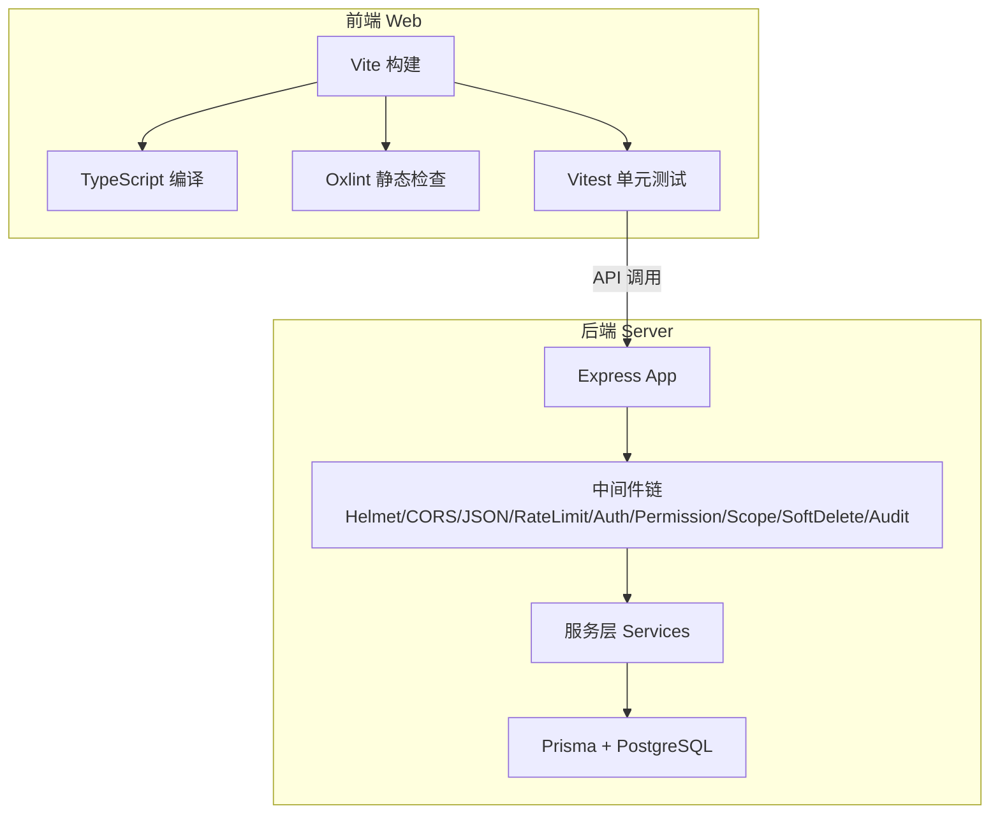
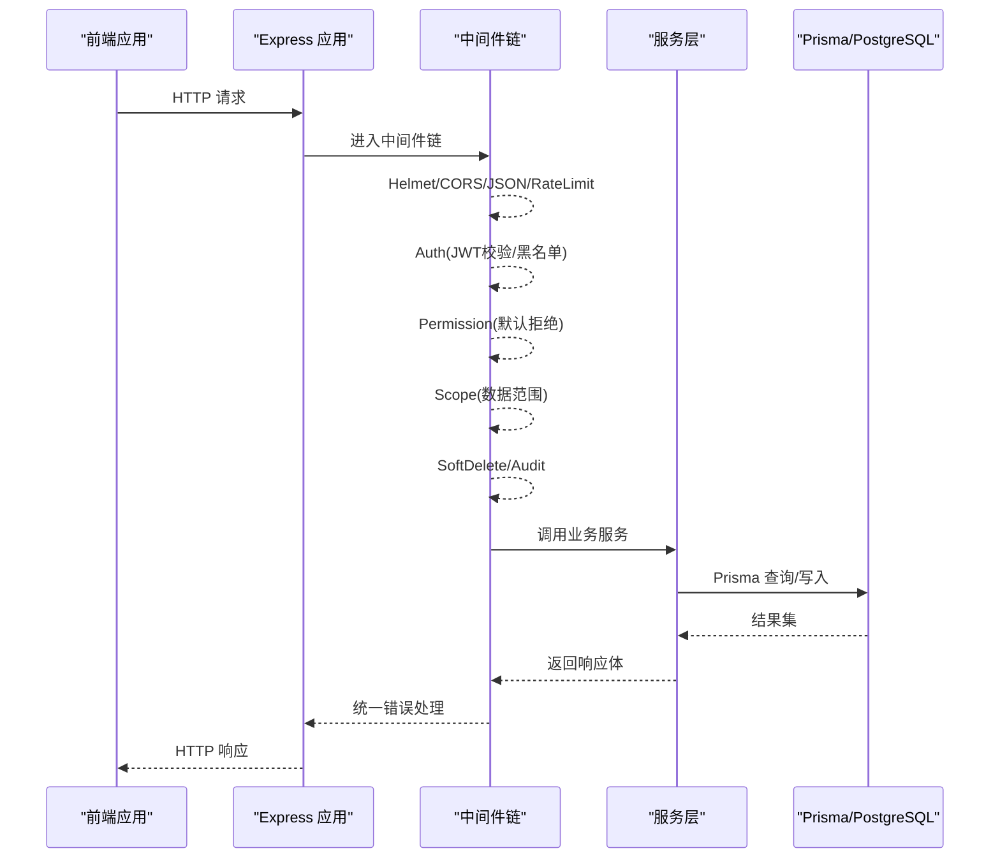
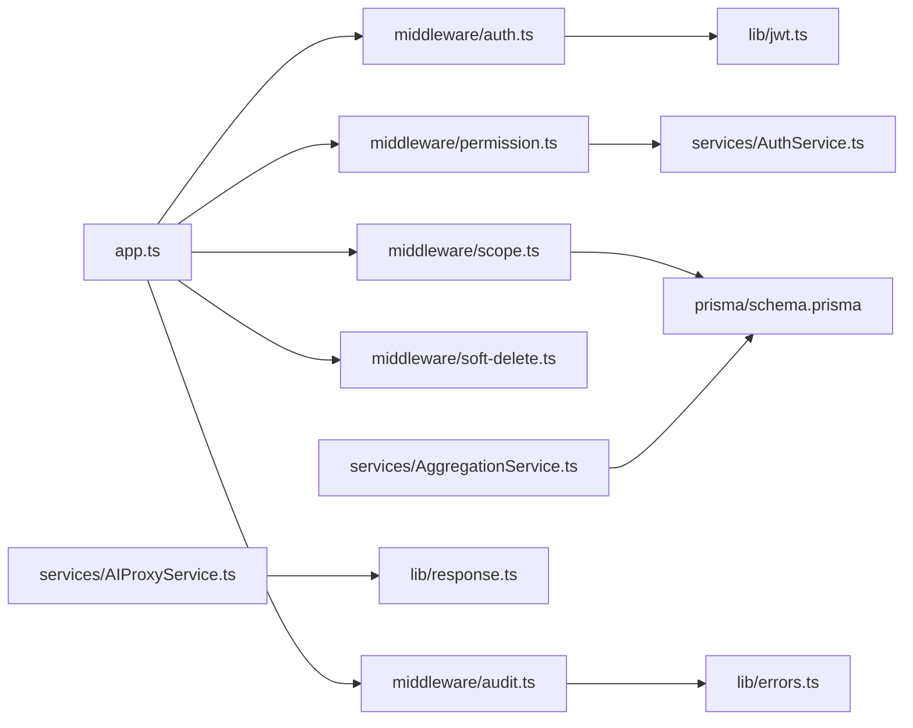

# 代码审查流程

<cite>
**本文引用的文件**   
- [package.json](file://server/package.json)
- [vitest.config.ts](file://server/vitest.config.ts)
- [tsconfig.json](file://server/tsconfig.json)
- [.oxlintrc.json](file://web/.oxlintrc.json)
- [vite.config.ts](file://web/vite.config.ts)
- [vitest.config.ts](file://web/vitest.config.ts)
- [tsconfig.app.json](file://web/tsconfig.app.json)
- [tsconfig.node.json](file://web/tsconfig.node.json)
- [app.ts](file://server/src/app.ts)
- [server.ts](file://server/src/server.ts)
- [auth.ts](file://server/src/middleware/auth.ts)
- [permission.ts](file://server/src/middleware/permission.ts)
- [scope.ts](file://server/src/middleware/scope.ts)
- [soft-delete.ts](file://server/src/middleware/soft-delete.ts)
- [audit.ts](file://server/src/middleware/audit.ts)
- [cors.ts](file://server/src/middleware/cors.ts)
- [helmet.ts](file://server/src/middleware/helmet.ts)
- [rate-limit.ts](file://server/src/middleware/rate-limit.ts)
- [error-handler.ts](file://server/src/middleware/error-handler.ts)
- [jwt.ts](file://server/src/lib/jwt.ts)
- [errors.ts](file://server/src/lib/errors.ts)
- [response.ts](file://server/src/lib/response.ts)
- [AuthService.ts](file://server/src/services/AuthService.ts)
- [AIProxyService.ts](file://server/src/services/AIProxyService.ts)
- [AggregationService.ts](file://server/src/services/AggregationService.ts)
- [schema.prisma](file://server/prisma/schema.prisma)
- [index.tsx](file://web/src/pages/login/index.tsx)
- [api.ts](file://web/src/lib/api.ts)
- [useAuth.ts](file://web/src/hooks/useAuth.ts)
- [require-permission.tsx](file://web/src/components/layout/require-permission.tsx)
- [data-table.tsx](file://web/src/components/data-table/data-table.tsx)
- [kpi-card.tsx](file://web/src/components/charts/kpi-card.tsx)
</cite>

## 目录
1. [简介](#简介)
2. [项目结构](#项目结构)
3. [核心组件](#核心组件)
4. [架构总览](#架构总览)
5. [详细组件分析](#详细组件分析)
6. [依赖关系分析](#依赖关系分析)
7. [性能考量](#性能考量)
8. [故障排查指南](#故障排查指南)
9. [结论](#结论)
10. [附录](#附录)

## 简介
本文件为FY200项目的代码审查流程规范，覆盖Pull Request的创建与提交流程、PR模板必填字段、代码审查要点（质量、安全、性能、可维护性）、审查角色分工、审查反馈处理与修改要求、自动化检查工具集成（ESLint/Oxlint、TypeScript编译器、单元测试覆盖率）以及审查通过标准与快速通道机制。文档同时结合后端Express中间件链与前端React工程配置，给出端到端的审查落地建议。

## 项目结构
FY200采用前后端分离：
- 后端：Express 4 + Prisma 5 + PostgreSQL 15，JWT鉴权与安全中间件链，SSE流式AI代理。
- 前端：React + Vite + TypeScript，Oxlint静态检查，Vitest测试框架。

图表来源
- [vite.config.ts](file://web/vite.config.ts)
- [tsconfig.app.json](file://web/tsconfig.app.json)
- [.oxlintrc.json](file://web/.oxlintrc.json)
- [vitest.config.ts](file://web/vitest.config.ts)
- [app.ts](file://server/src/app.ts)
- [server.ts](file://server/src/server.ts)
- [schema.prisma](file://server/prisma/schema.prisma)

章节来源
- [package.json](file://server/package.json)
- [vite.config.ts](file://web/vite.config.ts)
- [tsconfig.app.json](file://web/tsconfig.app.json)
- [.oxlintrc.json](file://web/.oxlintrc.json)
- [vitest.config.ts](file://web/vitest.config.ts)
- [app.ts](file://server/src/app.ts)
- [server.ts](file://server/src/server.ts)
- [schema.prisma](file://server/prisma/schema.prisma)

## 核心组件
- 中间件执行链（后端）：helmet → cors → express.json → rate-limit → auth(JWT+黑名单) → permission(默认拒绝) → scope(Prisma extension) → softDelete → audit → Service → Prisma → PostgreSQL。
- 鉴权与权限：JWT access(15min)/refresh(7day)轮转；权限模型默认拒绝，按路由/资源粒度授权。
- 数据访问：Prisma扩展实现租户/组织范围控制与软删除。
- AI双管道：polish（文本→脱敏→LLM→还原）/ analyze（结构化→计算→脱敏→LLM→生成）。

章节来源
- [app.ts](file://server/src/app.ts)
- [server.ts](file://server/src/server.ts)
- [auth.ts](file://server/src/middleware/auth.ts)
- [permission.ts](file://server/src/middleware/permission.ts)
- [scope.ts](file://server/src/middleware/scope.ts)
- [soft-delete.ts](file://server/src/middleware/soft-delete.ts)
- [audit.ts](file://server/src/middleware/audit.ts)
- [jwt.ts](file://server/src/lib/jwt.ts)
- [AIProxyService.ts](file://server/src/services/AIProxyService.ts)

## 架构总览
下图展示一次典型请求从前端到数据库的完整路径，并标注关键审查点。

图表来源
- [app.ts](file://server/src/app.ts)
- [server.ts](file://server/src/server.ts)
- [auth.ts](file://server/src/middleware/auth.ts)
- [permission.ts](file://server/src/middleware/permission.ts)
- [scope.ts](file://server/src/middleware/scope.ts)
- [soft-delete.ts](file://server/src/middleware/soft-delete.ts)
- [audit.ts](file://server/src/middleware/audit.ts)
- [error-handler.ts](file://server/src/middleware/error-handler.ts)

## 详细组件分析

### Pull Request 创建与提交流程
- 分支策略
  - 功能分支：feature/<模块>-<简述>
  - 修复分支：fix/<问题编号>-<简述>
  - 发布分支：release/<版本号>
  - 主干分支：main（受保护）
- PR 提交步骤
  - 在本地完成开发、自测与格式化
  - 推送分支至远端仓库
  - 在平台创建PR，选择目标分支（通常为main或develop）
  - 填写PR模板必填字段（见下节）
  - 触发CI流水线（静态检查、类型检查、单元测试）
  - 等待审查者评审与反馈
  - 根据反馈修改并提交补充提交（squash合并前清理历史）
  - 达到通过标准后合并

章节来源
- [package.json](file://server/package.json)
- [vite.config.ts](file://web/vite.config.ts)
- [vitest.config.ts](file://web/vitest.config.ts)

### PR 模板与必填字段
- 必填字段建议
  - 变更概述：本次改动目的与影响面
  - 关联需求/缺陷：链接到需求或Issue编号
  - 主要变更点：列出关键文件或逻辑变化
  - 测试说明：新增/修改的测试用例与覆盖范围
  - 风险与回滚方案：潜在风险与回滚步骤
  - 兼容性说明：接口/数据结构变更对上下游的影响
  - 截图/录屏（前端）：UI变更可视化证据
- 非必填但推荐
  - 性能影响评估
  - 安全自查项（如输入校验、权限边界）
  - 文档更新（README、API文档等）

章节来源
- [index.tsx](file://web/src/pages/login/index.tsx)
- [api.ts](file://web/src/lib/api.ts)
- [useAuth.ts](file://web/src/hooks/useAuth.ts)

### 代码审查要点
- 代码质量
  - 命名清晰、函数单一职责、避免深层嵌套
  - 常量/配置集中管理，避免魔法值
  - 日志输出包含必要上下文，不泄露敏感信息
- 安全性
  - 输入校验与白名单校验（公式解析禁止eval）
  - 权限最小化（默认拒绝），越权防护
  - 敏感数据脱敏（金额区间化、公司名动态映射）
  - JWT签发/校验与黑名单机制正确性
- 性能
  - 数据库查询N+1规避、索引合理使用
  - 大对象/流式传输（SSE）合理分页与限流
  - 前端渲染优化（列表虚拟化、按需加载）
- 可维护性
  - 模块化与分层清晰（路由→中间件→服务→数据层）
  - 错误处理统一，异常分类明确
  - 测试覆盖关键路径，含边界条件

章节来源
- [auth.ts](file://server/src/middleware/auth.ts)
- [permission.ts](file://server/src/middleware/permission.ts)
- [scope.ts](file://server/src/middleware/scope.ts)
- [jwt.ts](file://server/src/lib/jwt.ts)
- [AIProxyService.ts](file://server/src/services/AIProxyService.ts)
- [AggregationService.ts](file://server/src/services/AggregationService.ts)

### 审查人员角色分工
- 主要审查者（Primary Reviewer）
  - 负责技术可行性、架构一致性与关键逻辑正确性
  - 对安全、性能、可维护性负最终责任
  - 决定是否需要二次审查或专家意见
- 次要审查者（Secondary Reviewer）
  - 关注代码风格、可读性、测试覆盖与文档
  - 提供改进建议与最佳实践参考
- 作者（Author）
  - 确保PR描述完整、测试充分、符合规范
  - 及时响应反馈并完成修改

章节来源
- [error-handler.ts](file://server/src/middleware/error-handler.ts)
- [response.ts](file://server/src/lib/response.ts)

### 审查反馈处理与修改要求
- 反馈分类
  - 阻塞性问题（必须修改）：安全漏洞、逻辑错误、破坏性变更
  - 建议性问题（可选修改）：风格、命名、冗余代码
- 修改流程
  - 在PR中逐条回复反馈
  - 提交增量修改，保持提交语义清晰
  - 必要时追加测试用例以验证修复
- 合并前检查清单
  - CI全绿（静态检查、类型检查、单测通过）
  - 所有阻塞性问题已解决
  - 无未决评论或已达成共识

章节来源
- [errors.ts](file://server/src/lib/errors.ts)
- [response.ts](file://server/src/lib/response.ts)

### 自动化代码检查工具集成
- 后端
  - TypeScript编译器：tsconfig.json 启用严格模式，CI中执行编译检查
  - 单元测试：Vitest 运行测试套件，覆盖率阈值建议≥80%
  - 可选：ESLint（若引入）用于JS/TS代码风格检查
- 前端
  - Oxlint：.oxlintrc.json 配置规则，CI中执行静态检查
  - TypeScript编译器：tsconfig.app.json/tsconfig.node.json 严格模式
  - 单元测试：Vitest 运行组件与逻辑测试，覆盖率阈值建议≥80%
- CI流水线建议
  - 安装依赖 → 静态检查 → 类型检查 → 单元测试 → 构建产物

章节来源
- [tsconfig.json](file://server/tsconfig.json)
- [vitest.config.ts](file://server/vitest.config.ts)
- [.oxlintrc.json](file://web/.oxlintrc.json)
- [tsconfig.app.json](file://web/tsconfig.app.json)
- [tsconfig.node.json](file://web/tsconfig.node.json)
- [vitest.config.ts](file://web/vitest.config.ts)

### 审查通过标准与快速通道
- 通过标准
  - CI全部通过（静态检查、类型检查、单测）
  - 主要审查者与次要审查者均批准
  - 无阻塞性问题遗留
  - 相关文档已更新（API、用户手册等）
- 快速通道（Fast Track）
  - 适用场景：小修复、文档修正、样式调整
  - 条件：仅涉及低风险变更、无需额外测试、不影响接口契约
  - 流程：至少一名主要审查者批准即可合并

章节来源
- [package.json](file://server/package.json)
- [vite.config.ts](file://web/vite.config.ts)

## 依赖关系分析
下图展示关键模块间的依赖关系，便于识别耦合与潜在循环依赖。

图表来源
- [app.ts](file://server/src/app.ts)
- [auth.ts](file://server/src/middleware/auth.ts)
- [permission.ts](file://server/src/middleware/permission.ts)
- [scope.ts](file://server/src/middleware/scope.ts)
- [soft-delete.ts](file://server/src/middleware/soft-delete.ts)
- [audit.ts](file://server/src/middleware/audit.ts)
- [jwt.ts](file://server/src/lib/jwt.ts)
- [errors.ts](file://server/src/lib/errors.ts)
- [response.ts](file://server/src/lib/response.ts)
- [AuthService.ts](file://server/src/services/AuthService.ts)
- [AIProxyService.ts](file://server/src/services/AIProxyService.ts)
- [AggregationService.ts](file://server/src/services/AggregationService.ts)
- [schema.prisma](file://server/prisma/schema.prisma)

章节来源
- [app.ts](file://server/src/app.ts)
- [server.ts](file://server/src/server.ts)

## 性能考量
- 后端
  - 使用Prisma扩展进行数据范围过滤，减少不必要的数据传输
  - 对高频接口实施速率限制与缓存策略
  - SSE流式响应避免大对象一次性加载
- 前端
  - 组件懒加载与路由级代码分割
  - 表格与图表虚拟化渲染，避免DOM过大
  - 网络请求去重与失败重试

[本节为通用指导，不直接分析具体文件]

## 故障排查指南
- 常见问题定位
  - 鉴权失败：检查JWT签发/校验逻辑与黑名单状态
  - 权限不足：确认权限模型与资源绑定是否正确
  - 数据范围错误：核查Scope扩展与租户/组织参数传递
  - 软删除误删：确认软删除中间件与查询条件
  - 审计缺失：检查Audit中间件是否生效
- 调试建议
  - 开启详细日志，记录请求ID与关键上下文
  - 使用统一错误处理器捕获并分类异常
  - 前端网络面板与后端日志联动定位

章节来源
- [auth.ts](file://server/src/middleware/auth.ts)
- [permission.ts](file://server/src/middleware/permission.ts)
- [scope.ts](file://server/src/middleware/scope.ts)
- [soft-delete.ts](file://server/src/middleware/soft-delete.ts)
- [audit.ts](file://server/src/middleware/audit.ts)
- [error-handler.ts](file://server/src/middleware/error-handler.ts)
- [jwt.ts](file://server/src/lib/jwt.ts)
- [errors.ts](file://server/src/lib/errors.ts)

## 结论
本流程规范围绕FY200项目的技术栈与架构特点，明确了PR提交流程、审查要点、角色分工、自动化检查与通过标准。通过严格执行本规范，可有效提升代码质量、安全性与可维护性，保障项目稳定演进。

[本节为总结性内容，不直接分析具体文件]

## 附录
- 术语表
  - PR：Pull Request，拉取请求
  - CI：持续集成
  - SSE：Server-Sent Events，服务器发送事件
  - N+1：数据库查询反范式问题
- 参考配置
  - 后端：tsconfig.json、vitest.config.ts、package.json
  - 前端：.oxlintrc.json、tsconfig.app.json、tsconfig.node.json、vitest.config.ts、vite.config.ts

[本节为参考资料，不直接分析具体文件]