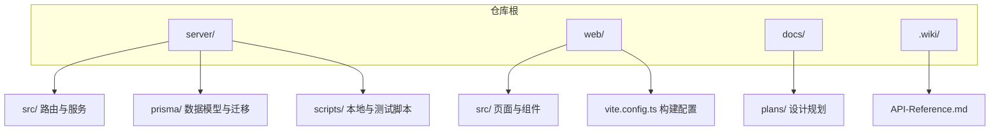
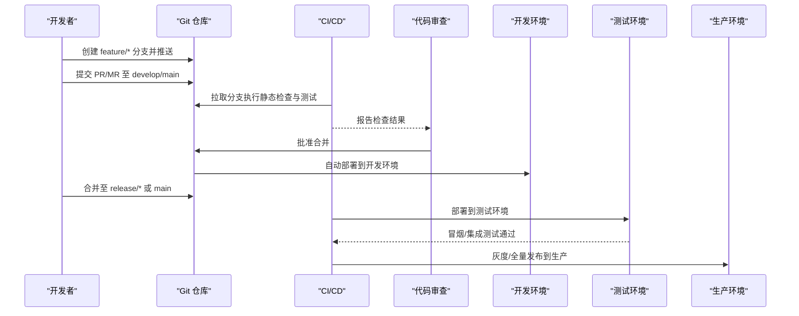
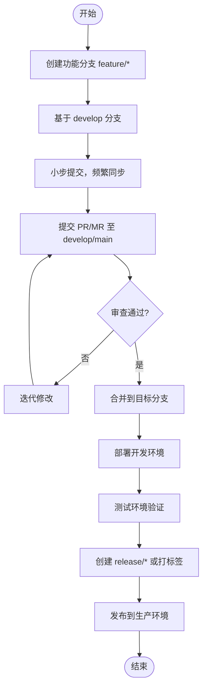
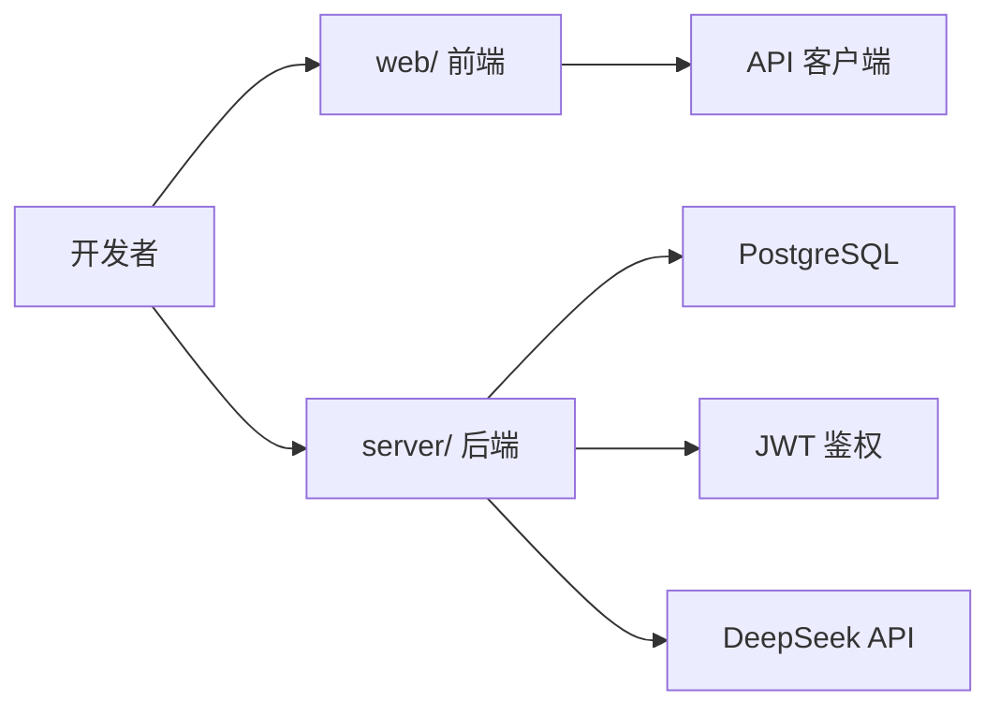

# 分支管理策略

<cite>
**本文引用的文件**   
- [server/package.json](file://server/package.json)
- [web/package.json](file://web/package.json)
- [server/prisma/schema.prisma](file://server/prisma/schema.prisma)
- [server/src/app.ts](file://server/src/app.ts)
- [server/src/server.ts](file://server/src/server.ts)
- [server/src/middleware/auth.ts](file://server/src/middleware/auth.ts)
- [server/src/middleware/permission.ts](file://server/src/middleware/permission.ts)
- [server/src/middleware/scope.ts](file://server/src/middleware/scope.ts)
- [server/src/middleware/rate-limit.ts](file://server/src/middleware/rate-limit.ts)
- [server/src/middleware/helmet.ts](file://server/src/middleware/helmet.ts)
- [server/src/config/env.ts](file://server/src/config/env.ts)
- [server/scripts/local-db.ts](file://server/scripts/local-db.ts)
- [web/vite.config.ts](file://web/vite.config.ts)
- [web/src/lib/api.ts](file://web/src/lib/api.ts)
</cite>

## 目录
1. [简介](#简介)
2. [项目结构](#项目结构)
3. [核心组件](#核心组件)
4. [架构总览](#架构总览)
5. [详细组件分析](#详细组件分析)
6. [依赖分析](#依赖分析)
7. [性能考虑](#性能考虑)
8. [故障排查指南](#故障排查指南)
9. [结论](#结论)
10. [附录](#附录)

## 简介
本文件为 FY200 项目的分支管理策略，面向后端（Express + Prisma + PostgreSQL）与前端（React/Vite）双端协作。目标是通过明确的分支模型、命名规范、保护规则与操作流程，保障代码质量、可追溯性与发布稳定性，降低合并冲突与回滚风险。

## 项目结构
FY200 采用前后端分离的仓库结构：
- server：后端服务、数据库迁移、脚本与中间件链
- web：前端应用、构建配置与 API 客户端封装
- docs：文档与计划
- .wiki：Wiki 参考

**图示来源** 
- [server/package.json](file://server/package.json)
- [web/package.json](file://web/package.json)

**章节来源**
- [server/package.json](file://server/package.json)
- [web/package.json](file://web/package.json)

## 核心组件
围绕分支策略，以下组件与流程需要严格遵循：
- 主分支保护：main/master 仅允许受控合并，禁止直接推送
- 功能分支命名：feature/*、bugfix/*、hotfix/*、release/*、support/*
- 环境分支模型：开发、测试、生产三阶段隔离
- 标准操作：创建、切换、提交、PR/MR、审查、合并、打标签
- 生命周期与清理：定期归档与删除过期分支
- 冲突预防与解决：小步提交、频繁同步、自动化检查

**章节来源**
- [server/src/app.ts](file://server/src/app.ts)
- [server/src/server.ts](file://server/src/server.ts)
- [server/src/middleware/auth.ts](file://server/src/middleware/auth.ts)
- [server/src/middleware/permission.ts](file://server/src/middleware/permission.ts)
- [server/src/middleware/scope.ts](file://server/src/middleware/scope.ts)
- [server/src/middleware/rate-limit.ts](file://server/src/middleware/rate-limit.ts)
- [server/src/middleware/helmet.ts](file://server/src/middleware/helmet.ts)
- [server/src/config/env.ts](file://server/src/config/env.ts)
- [server/scripts/local-db.ts](file://server/scripts/local-db.ts)
- [web/vite.config.ts](file://web/vite.config.ts)
- [web/src/lib/api.ts](file://web/src/lib/api.ts)

## 架构总览
下图展示从开发者到生产发布的端到端分支流转与关键门禁。

**图示来源** 
- [server/package.json](file://server/package.json)
- [web/package.json](file://web/package.json)
- [server/src/config/env.ts](file://server/src/config/env.ts)
- [web/vite.config.ts](file://web/vite.config.ts)

## 详细组件分析

### 主分支保护规则（main/master）
- 访问控制
  - 仅管理员或受保护角色可推送至 main/master
  - 禁止 force push 与历史重写
- 合并限制
  - 必须通过 Pull Request/Merge Request 合并
  - 至少一名审查者批准
  - 必须通过所有 CI 检查（Lint、单元测试、集成测试、构建）
  - 建议开启“要求无冲突”和“要求状态检查通过”
- 变更范围
  - 仅允许稳定特性、修复与发布相关变更
  - 禁止在 main/master 上直接修改配置或敏感信息

**章节来源**
- [server/src/config/env.ts](file://server/src/config/env.ts)
- [server/package.json](file://server/package.json)
- [web/package.json](file://web/package.json)

### 功能分支命名规范
- 前缀与场景
  - feature/*：新功能开发
  - bugfix/*：非紧急缺陷修复
  - hotfix/*：线上紧急修复
  - release/*：预发布版本准备
  - support/*：长期维护分支
- 命名约定
  - 使用小写与短横线分隔
  - 包含任务编号或简要描述，如 feature/FE-123-user-login
- 示例
  - feature/FE-123-add-dashboard
  - bugfix/BE-456-fix-jwt-expiry
  - hotfix/BE-789-cors-misconfig

**章节来源**
- [server/package.json](file://server/package.json)
- [web/package.json](file://web/package.json)

### 开发分支模型与环境策略
- 分支层级
  - main/master：生产基线，稳定可用
  - develop：集成开发主干，持续集成
  - feature/*：功能分支，基于 develop 或 main
  - release/*：发布候选，冻结变更，回归验证
  - hotfix/*：基于 main 快速修复，合并后同步回 develop
- 环境映射
  - 开发环境：develop 或 feature/* 自动部署
  - 测试环境：release/* 或 main 的预发快照
  - 生产环境：main/master 的受控发布

**图示来源** 
- [server/package.json](file://server/package.json)
- [web/package.json](file://web/package.json)

**章节来源**
- [server/package.json](file://server/package.json)
- [web/package.json](file://web/package.json)

### 标准操作流程（SOP）
- 分支创建与切换
  - 从 develop 或 main 拉取最新代码
  - 创建 feature/*、bugfix/*、hotfix/* 分支
  - 切换至新分支进行开发
- 提交与推送
  - 小步提交，清晰的提交信息
  - 推送至远程仓库
- 合并请求与审查
  - 发起 PR/MR，填写变更说明
  - 指定审查者，等待 CI 结果
- 合并与部署
  - 审查通过后合并到目标分支
  - 触发 CI/CD 自动部署到对应环境
- 标签与发布
  - 对 release/* 或 main 打语义化标签
  - 生成发布说明与变更记录

**章节来源**
- [server/package.json](file://server/package.json)
- [web/package.json](file://web/package.json)

### 分支生命周期管理与清理策略
- 生命周期
  - feature/*：功能完成即合并，保留不超过两周
  - bugfix/*：修复验证通过后合并，保留不超过一周
  - hotfix/*：紧急修复完成后合并，保留不超过三天
  - release/*：发布成功后归档，保留一个月
- 清理策略
  - 定期清理已合并且过期的远程分支
  - 本地分支定期 fetch --prune 保持同步
  - 归档旧 release/* 分支到只读仓库或标签

**章节来源**
- [server/package.json](file://server/package.json)
- [web/package.json](file://web/package.json)

### 冲突预防与解决最佳实践
- 预防措施
  - 频繁从目标分支 rebase 或 merge 更新
  - 拆分大任务为小提交，减少冲突面
  - 使用分支保护与强制检查，避免不稳定代码进入主干
- 解决步骤
  - 本地拉取目标分支最新代码
  - 使用 rebase 或 merge 解决冲突
  - 运行本地测试与构建，确保通过
  - 推送并重新触发 CI/CD

**章节来源**
- [server/package.json](file://server/package.json)
- [web/package.json](file://web/package.json)

## 依赖分析
FY200 的后端与前端各自维护依赖，分支策略需确保依赖变更的可追溯性：
- 后端依赖：Express、Prisma、PostgreSQL、JWT、DeepSeek API
- 前端依赖：React、Vite、Tailwind、API 客户端封装

**图示来源** 
- [server/package.json](file://server/package.json)
- [web/package.json](file://web/package.json)
- [web/src/lib/api.ts](file://web/src/lib/api.ts)
- [server/src/config/env.ts](file://server/src/config/env.ts)

**章节来源**
- [server/package.json](file://server/package.json)
- [web/package.json](file://web/package.json)
- [web/src/lib/api.ts](file://web/src/lib/api.ts)
- [server/src/config/env.ts](file://server/src/config/env.ts)

## 性能考虑
- 分支合并频率高但变更小，降低 CI 构建时间
- 并行执行 lint、测试与构建，缩短流水线时长
- 缓存依赖与构建产物，提升重复构建速度
- 针对大数据处理（如 Excel 导入）在 feature/* 分支内优化，避免影响主干

[本节为通用指导，不直接分析具体文件]

## 故障排查指南
- 常见问题
  - 合并冲突：检查本地与远程差异，手动解决冲突后重新提交
  - CI 失败：查看日志定位失败步骤，修复后重新触发
  - 权限错误：确认分支保护规则与角色权限
- 调试工具
  - 使用本地脚本启动数据库与依赖服务
  - 启用中间件日志与审计，追踪请求链路

**章节来源**
- [server/scripts/local-db.ts](file://server/scripts/local-db.ts)
- [server/src/middleware/auth.ts](file://server/src/middleware/auth.ts)
- [server/src/middleware/permission.ts](file://server/src/middleware/permission.ts)
- [server/src/middleware/scope.ts](file://server/src/middleware/scope.ts)
- [server/src/middleware/rate-limit.ts](file://server/src/middleware/rate-limit.ts)
- [server/src/middleware/helmet.ts](file://server/src/middleware/helmet.ts)

## 结论
通过严格的分支保护、清晰的命名规范、标准化的操作流程与生命周期管理，FY200 项目能够高效协作、稳定发布。建议结合 CI/CD 自动化与代码审查机制，持续提升交付质量与团队效率。

[本节为总结性内容，不直接分析具体文件]

## 附录
- 术语表
  - PR/MR：Pull Request / Merge Request
  - CI/CD：持续集成/持续部署
  - 语义化版本：Major.Minor.Patch
- 参考链接
  - 后端中间件链顺序与职责
  - 前端构建与 API 客户端配置

[本节为补充信息，不直接分析具体文件]