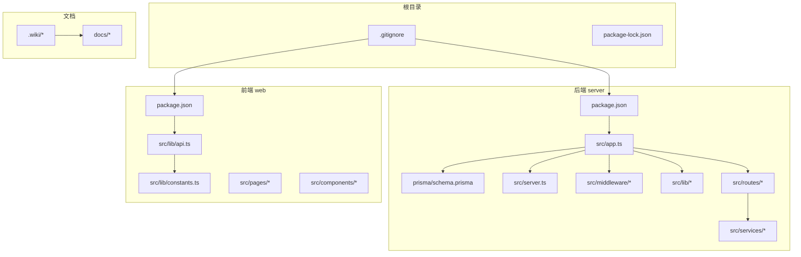
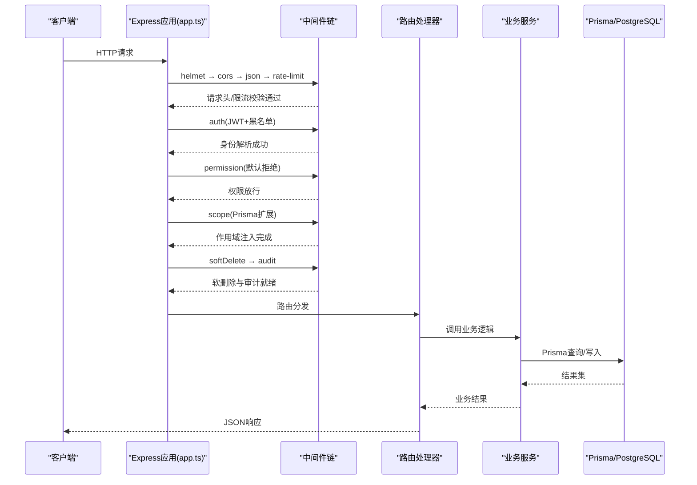
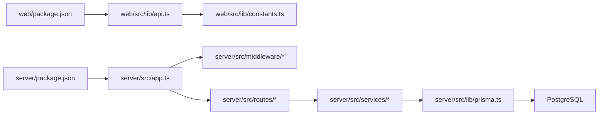

# 协作最佳实践

<cite>
**本文档引用的文件**   
- [package.json](file://server/package.json)
- [package.json](file://web/package.json)
- [.gitignore](file://.gitignore)
- [.gitignore](file://server/.gitignore)
- [.gitignore](file://web/.gitignore)
- [schema.prisma](file://server/prisma/schema.prisma)
- [env.ts](file://server/src/config/env.ts)
- [app.ts](file://server/src/app.ts)
- [server.ts](file://server/src/server.ts)
- [auth.ts](file://server/src/middleware/auth.ts)
- [permission.ts](file://server/src/middleware/permission.ts)
- [scope.ts](file://server/src/middleware/scope.ts)
- [soft-delete.ts](file://server/src/middleware/soft-delete.ts)
- [audit.ts](file://server/src/middleware/audit.ts)
- [cors.ts](file://server/src/middleware/cors.ts)
- [helmet.ts](file://server/src/middleware/helmet.ts)
- [rate-limit.ts](file://server/src/middleware/rate-limit.ts)
- [ai-rate-limit.ts](file://server/src/middleware/ai-rate-limit.ts)
- [jwt.ts](file://server/src/lib/jwt.ts)
- [errors.ts](file://server/src/lib/errors.ts)
- [logger.ts](file://server/src/lib/logger.ts)
- [prisma.ts](file://server/src/lib/prisma.ts)
- [api.ts](file://web/src/lib/api.ts)
- [constants.ts](file://web/src/lib/constants.ts)
- [Getting-Started.md](file://.wiki/Getting-Started.md)
- [API-Reference.md](file://.wiki/API-Reference.md)
- [Database-Schema.md](file://.wiki/Database-Schema.md)
- [frontend-design-proposal.md](file://docs/plans/frontend-design-proposal.md)
- [安全与权限规范.md](file://docs/plans/安全与权限规范.md)
- [数据模型规范.md](file://docs/plans/数据模型规范.md)
- [backend.md](file://docs/references/backend.md)
- [devops.md](file://docs/references/devops.md)
- [frontend.md](file://docs/references/frontend.md)
- [observability.md](file://docs/references/observability.md)
- [performance.md](file://docs/references/performance.md)
</cite>

## 目录
1. [简介](#简介)
2. [项目结构](#项目结构)
3. [核心组件](#核心组件)
4. [架构总览](#架构总览)
5. [详细组件分析](#详细组件分析)
6. [依赖分析](#依赖分析)
7. [性能考虑](#性能考虑)
8. [故障排除指南](#故障排除指南)
9. [结论](#结论)
10. [附录](#附录)

## 简介
本文件为FY200项目的团队协作最佳实践，聚焦Git使用规范、冲突解决策略、代码共享与依赖管理、文档协作规范、沟通与应急流程，以及常见问题排查。内容基于仓库现状与后端中间件链、Prisma迁移、前后端包管理等实际实现进行提炼，确保团队在本地同步、分支操作、推送发布、敏感信息管理等方面保持一致性与可追溯性。

## 项目结构
FY200采用前后端分离的Monorepo风格：
- server：Express + Prisma + PostgreSQL 后端服务，包含中间件链、路由、服务层、工具库与测试。
- web：React前端应用，包含页面、组件、hooks、类型定义与构建配置。
- docs：设计参考、计划与进度报告等文档。
- .wiki：面向新手的入门、API参考与数据库Schema说明。

图表来源
- [.gitignore](file://.gitignore)
- [package.json](file://server/package.json)
- [package.json](file://web/package.json)
- [schema.prisma](file://server/prisma/schema.prisma)
- [app.ts](file://server/src/app.ts)
- [server.ts](file://server/src/server.ts)
- [api.ts](file://web/src/lib/api.ts)
- [constants.ts](file://web/src/lib/constants.ts)

章节来源
- [package.json](file://server/package.json)
- [package.json](file://web/package.json)
- [.gitignore](file://.gitignore)
- [.gitignore](file://server/.gitignore)
- [.gitignore](file://web/.gitignore)

## 核心组件
- 后端中间件执行链（顺序固定）：helmet → cors → express.json → rate-limit → auth(JWT+黑名单) → permission(默认拒绝) → scope(Prisma扩展) → softDelete → audit → Service → Prisma → PostgreSQL。该顺序保障安全、鉴权、权限、作用域、软删除与审计的全链路一致性。
- 认证与授权：JWT access短期轮转配合refresh长期刷新；权限默认拒绝，需显式放行；作用域通过Prisma扩展注入。
- 数据访问：Prisma Schema集中管理，迁移脚本按时间戳命名，种子数据用于初始化。
- 环境变量：统一由服务端配置模块加载，避免硬编码敏感信息。
- 前端API与常量：封装HTTP请求与基础常量，便于跨模块复用。

章节来源
- [app.ts](file://server/src/app.ts)
- [server.ts](file://server/src/server.ts)
- [auth.ts](file://server/src/middleware/auth.ts)
- [permission.ts](file://server/src/middleware/permission.ts)
- [scope.ts](file://server/src/middleware/scope.ts)
- [soft-delete.ts](file://server/src/middleware/soft-delete.ts)
- [audit.ts](file://server/src/middleware/audit.ts)
- [cors.ts](file://server/src/middleware/cors.ts)
- [helmet.ts](file://server/src/middleware/helmet.ts)
- [rate-limit.ts](file://server/src/middleware/rate-limit.ts)
- [ai-rate-limit.ts](file://server/src/middleware/ai-rate-limit.ts)
- [jwt.ts](file://server/src/lib/jwt.ts)
- [schema.prisma](file://server/prisma/schema.prisma)
- [env.ts](file://server/src/config/env.ts)
- [api.ts](file://web/src/lib/api.ts)
- [constants.ts](file://web/src/lib/constants.ts)

## 架构总览
下图展示从客户端到数据库的关键调用路径与中间件处理顺序，体现安全、鉴权、权限、作用域、审计与数据访问的协作关系。

图表来源
- [app.ts](file://server/src/app.ts)
- [auth.ts](file://server/src/middleware/auth.ts)
- [permission.ts](file://server/src/middleware/permission.ts)
- [scope.ts](file://server/src/middleware/scope.ts)
- [soft-delete.ts](file://server/src/middleware/soft-delete.ts)
- [audit.ts](file://server/src/middleware/audit.ts)
- [cors.ts](file://server/src/middleware/cors.ts)
- [helmet.ts](file://server/src/middleware/helmet.ts)
- [rate-limit.ts](file://server/src/middleware/rate-limit.ts)
- [ai-rate-limit.ts](file://server/src/middleware/ai-rate-limit.ts)
- [prisma.ts](file://server/src/lib/prisma.ts)

## 详细组件分析

### Git与分支协作规范
- 本地仓库同步
  - 每次开发前拉取最新主分支，保持本地与远程一致。
  - 使用独立分支进行功能开发，分支命名遵循“feature/xxx”、“fix/xxx”、“chore/xxx”等约定。
- 远程分支操作
  - 提交后推送到同名远程分支，开启Pull Request进行评审。
  - PR合并前确保CI通过、无冲突、至少一名Reviewer批准。
- 推送最佳实践
  - 小步提交，提交信息清晰描述变更目的与影响范围。
  - 禁止直接推送至受保护分支（如main/master），必须走PR流程。
- 冲突解决策略
  - 优先使用自动合并工具（如GitHub/GitLab的自动合并）减少人工干预。
  - 当出现冲突时，先拉取目标分支并rebase或merge，手动解决冲突后再次提交。
  - 对于复杂冲突，建议拆分为更小的提交，降低冲突概率。

章节来源
- [.gitignore](file://.gitignore)
- [.gitignore](file://server/.gitignore)
- [.gitignore](file://web/.gitignore)

### 代码共享与依赖管理
- npm包管理
  - 前后端各自维护package.json与lock文件，锁定版本避免漂移。
  - 公共依赖尽量收敛，避免重复引入；私有包通过内部注册表或私有仓库管理。
- 环境变量配置
  - 所有敏感信息（数据库连接、JWT密钥、第三方API Key）通过环境变量注入，严禁硬编码。
  - 服务端统一由配置模块加载，提供类型化访问与默认值兜底。
- 敏感信息保护
  - .gitignore中明确忽略.env、*.pem、*.key等敏感文件。
  - 使用密钥管理服务或CI/CD平台的安全变量存储生产环境凭据。

章节来源
- [package.json](file://server/package.json)
- [package.json](file://web/package.json)
- [env.ts](file://server/src/config/env.ts)
- [.gitignore](file://.gitignore)
- [.gitignore](file://server/.gitignore)
- [.gitignore](file://web/.gitignore)

### 文档协作规范
- README更新
  - 新增功能或修改接口后，及时更新README与相关Wiki，确保新手上手顺畅。
- API文档维护
  - 以.wiki/API-Reference.md为主，结合后端路由与服务方法，保持参数、返回结构与示例一致。
- 设计文档版本控制
  - 设计提案存放于docs/plans，变更记录保留历史版本，重要决策需附评审意见。
- 数据库Schema与迁移
  - schema.prisma集中管理模型，迁移脚本按时间戳命名，变更需附带说明与回滚方案。

章节来源
- [API-Reference.md](file://.wiki/API-Reference.md)
- [Getting-Started.md](file://.wiki/Getting-Started.md)
- [Database-Schema.md](file://.wiki/Database-Schema.md)
- [frontend-design-proposal.md](file://docs/plans/frontend-design-proposal.md)
- [安全与权限规范.md](file://docs/plans/安全与权限规范.md)
- [数据模型规范.md](file://docs/plans/数据模型规范.md)
- [schema.prisma](file://server/prisma/schema.prisma)

### 中间件链与错误处理
- 中间件链顺序
  - 安全头、跨域、JSON解析、限流、鉴权、权限、作用域、软删除、审计依次执行，保证请求处理的确定性与可观测性。
- 错误处理
  - 统一错误类型与日志记录，便于定位问题与追踪链路。
  - 对异常场景提供降级与重试策略，提升系统韧性。

章节来源
- [app.ts](file://server/src/app.ts)
- [auth.ts](file://server/src/middleware/auth.ts)
- [permission.ts](file://server/src/middleware/permission.ts)
- [scope.ts](file://server/src/middleware/scope.ts)
- [soft-delete.ts](file://server/src/middleware/soft-delete.ts)
- [audit.ts](file://server/src/middleware/audit.ts)
- [errors.ts](file://server/src/lib/errors.ts)
- [logger.ts](file://server/src/lib/logger.ts)

### 认证与授权流程
- JWT令牌
  - access短期有效，refresh长期轮转，提升安全性与用户体验。
- 权限模型
  - 默认拒绝，需显式放行；结合角色与资源维度进行细粒度控制。
- 作用域控制
  - 通过Prisma扩展注入用户上下文，限制数据访问范围。

章节来源
- [jwt.ts](file://server/src/lib/jwt.ts)
- [auth.ts](file://server/src/middleware/auth.ts)
- [permission.ts](file://server/src/middleware/permission.ts)
- [scope.ts](file://server/src/middleware/scope.ts)

### 数据库与迁移管理
- Schema管理
  - 集中定义模型、关系与约束，确保前后端契约一致。
- 迁移策略
  - 增量迁移，避免破坏性变更；必要时提供回滚脚本。
- 种子数据
  - 使用seed脚本初始化测试与演示数据，便于联调与演示。

章节来源
- [schema.prisma](file://server/prisma/schema.prisma)
- [prisma.ts](file://server/src/lib/prisma.ts)

## 依赖分析
前后端依赖相互独立，通过API契约交互。关键依赖包括：
- 后端：Express、Prisma、PostgreSQL、JWT、SSE流式AI代理。
- 前端：React、Vite、TailwindCSS、HTTP客户端封装。
- 文档与参考：后端、前端、DevOps、可观测性与性能参考文档。

图表来源
- [package.json](file://web/package.json)
- [package.json](file://server/package.json)
- [api.ts](file://web/src/lib/api.ts)
- [constants.ts](file://web/src/lib/constants.ts)
- [app.ts](file://server/src/app.ts)
- [prisma.ts](file://server/src/lib/prisma.ts)

章节来源
- [backend.md](file://docs/references/backend.md)
- [frontend.md](file://docs/references/frontend.md)
- [devops.md](file://docs/references/devops.md)
- [observability.md](file://docs/references/observability.md)
- [performance.md](file://docs/references/performance.md)

## 性能考虑
- 中间件优化
  - 合理设置限流策略，避免恶意请求与突发流量冲击。
  - 启用压缩与缓存策略，减少网络开销。
- 数据库查询
  - 使用Prisma关联查询与索引优化，避免N+1问题。
  - 对热点数据进行缓存，降低数据库压力。
- AI管道
  - 双管道架构（polish/analyze）分离文本与结构化数据处理，提升吞吐与稳定性。
  - 脱敏规则前置，减少敏感数据传输与计算成本。

[本节为通用指导，不直接分析具体文件]

## 故障排除指南
- 常见Git问题
  - 分支冲突：拉取最新分支并rebase，手动解决冲突后提交。
  - 推送失败：检查权限与分支保护规则，确认CI通过。
- 环境问题
  - 环境变量缺失：检查.env与CI/CD安全变量，确保服务启动前加载。
  - 端口占用：更换端口或释放占用进程。
- 鉴权与权限
  - JWT过期：刷新令牌或重新登录。
  - 权限不足：检查角色与资源映射，确认权限放行。
- 数据库问题
  - 迁移失败：检查迁移脚本与Schema一致性，必要时回滚。
  - 连接失败：检查数据库地址、用户名、密码与网络连通性。
- 日志与监控
  - 查看统一日志输出，定位错误堆栈与请求链路。
  - 使用可观测性工具（指标、链路追踪）辅助诊断。

章节来源
- [errors.ts](file://server/src/lib/errors.ts)
- [logger.ts](file://server/src/lib/logger.ts)
- [jwt.ts](file://server/src/lib/jwt.ts)
- [auth.ts](file://server/src/middleware/auth.ts)
- [permission.ts](file://server/src/middleware/permission.ts)
- [scope.ts](file://server/src/middleware/scope.ts)
- [prisma.ts](file://server/src/lib/prisma.ts)

## 结论
本最佳实践围绕Git协作、依赖管理、文档规范、中间件链与错误处理等核心维度，为FY200项目提供一致的协作标准。通过明确的分支策略、冲突解决流程、环境变量管理与文档版本控制，团队可在高效协作的同时保障系统安全与可维护性。建议定期回顾与更新本规范，以适应项目演进与团队规模变化。

## 附录
- 快速上手
  - 参考.wiki/Getting-Started.md了解本地环境搭建与基本命令。
- API参考
  - 查阅.wiki/API-Reference.md获取接口定义与示例。
- 数据库Schema
  - 参考.wiki/Database-Schema.md理解数据模型与关系。
- 设计参考
  - 阅读docs/references下的后端、前端、DevOps、可观测性与性能文档，获取架构与实现细节。

章节来源
- [Getting-Started.md](file://.wiki/Getting-Started.md)
- [API-Reference.md](file://.wiki/API-Reference.md)
- [Database-Schema.md](file://.wiki/Database-Schema.md)
- [backend.md](file://docs/references/backend.md)
- [frontend.md](file://docs/references/frontend.md)
- [devops.md](file://docs/references/devops.md)
- [observability.md](file://docs/references/observability.md)
- [performance.md](file://docs/references/performance.md)