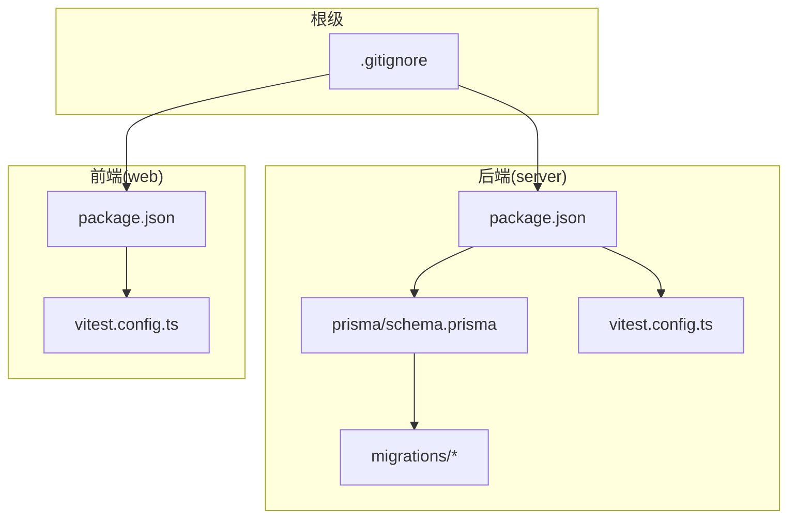
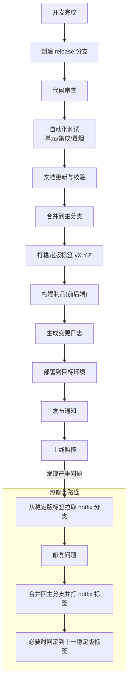
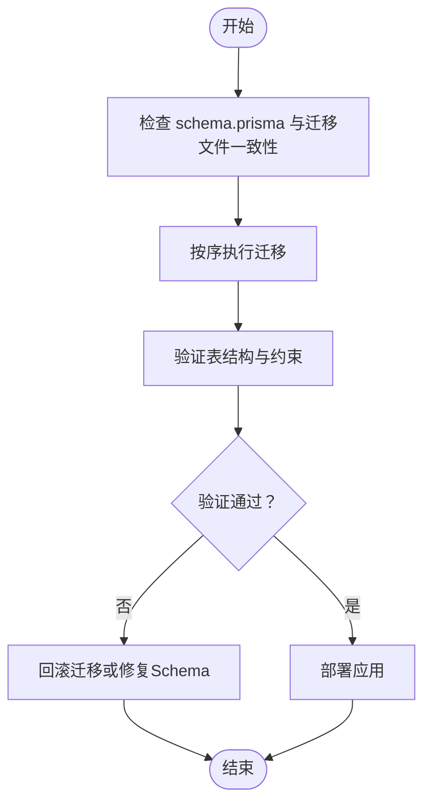
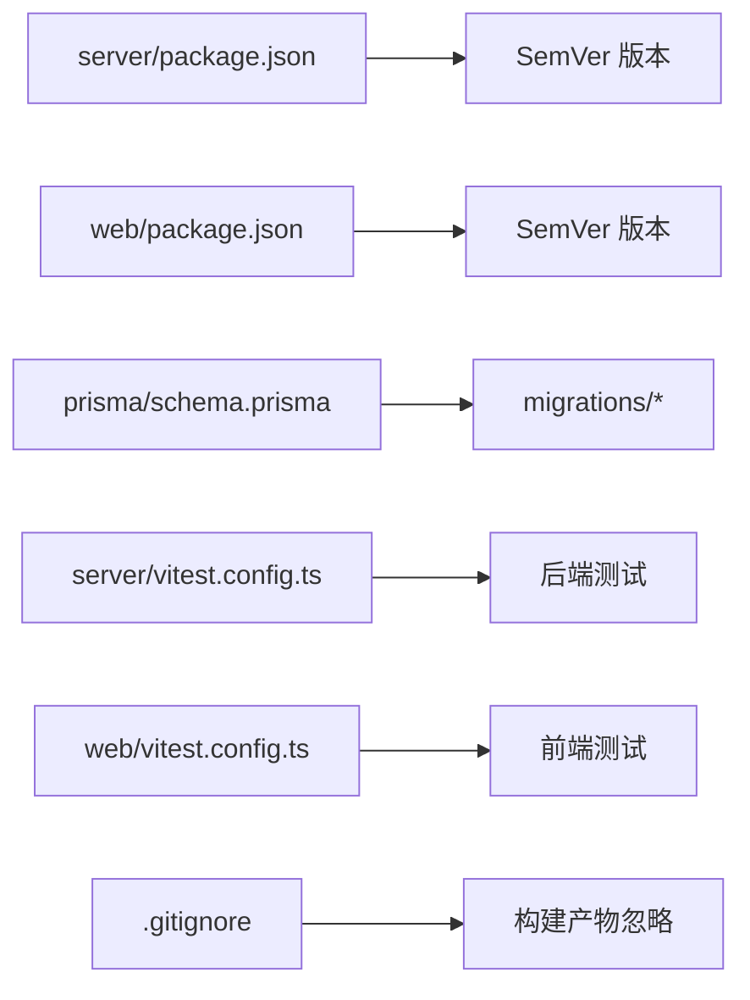

# 发布流程管理

<cite>
**本文引用的文件**   
- [package.json](file://server/package.json)
- [package.json](file://web/package.json)
- [schema.prisma](file://server/prisma/schema.prisma)
- [migration_lock.toml](file://server/prisma/migrations/migration_lock.toml)
- [20260722121714_init/migration.sql](file://server/prisma/migrations/20260722121714_init/migration.sql)
- [20260722142144_add_formula_rule/migration.sql](file://server/prisma/migrations/20260722142144_add_formula_rule/migration.sql)
- [20260723120000_add_subject_analysis/migration.sql](file://server/prisma/migrations/20260723120000_add_subject_analysis/migration.sql)
- [20260724120000_remove_business_unit_org_scope/migration.sql](file://server/prisma/migrations/20260724120000_remove_business_unit_org_scope/migration.sql)
- [vitest.config.ts](file://server/vitest.config.ts)
- [vitest.config.ts](file://web/vitest.config.ts)
- [.gitignore](file://.gitignore)
- [.gitignore](file://server/.gitignore)
- [.gitignore](file://web/.gitignore)
</cite>

## 目录
1. [简介](#简介)
2. [项目结构](#项目结构)
3. [核心组件](#核心组件)
4. [架构总览](#架构总览)
5. [详细组件分析](#详细组件分析)
6. [依赖分析](#依赖分析)
7. [性能考虑](#性能考虑)
8. [故障排查指南](#故障排查指南)
9. [结论](#结论)
10. [附录](#附录)

## 简介
本文件面向FY200项目的发布流程管理，目标是建立统一、可追溯、可回滚的发布体系。内容覆盖：
- 语义化版本控制（SemVer）策略与版本号命名规则
- 分支模型与分支管理（release/hotfix）
- 标签策略（稳定版与预发布）
- 发布前检查清单（代码审查、测试验证、文档更新等）
- 回滚机制设计与实施（支持快速恢复到历史版本）
- 发布通知与变更日志自动生成流程

本规范适用于前后端双仓库（server/web）及数据库迁移的统一治理。

## 项目结构
FY200采用前后端分离的双包结构：
- server：Express + Prisma + PostgreSQL，包含API路由、服务层、中间件链、Prisma迁移与脚本
- web：前端工程（Vite/Tailwind），包含页面、组件、状态管理与测试配置
- prisma：数据库Schema与迁移文件集中管理
- docs：项目文档与计划

图表来源
- [package.json](file://server/package.json)
- [package.json](file://web/package.json)
- [schema.prisma](file://server/prisma/schema.prisma)
- [vitest.config.ts](file://server/vitest.config.ts)
- [vitest.config.ts](file://web/vitest.config.ts)
- [.gitignore](file://.gitignore)

章节来源
- [package.json](file://server/package.json)
- [package.json](file://web/package.json)
- [schema.prisma](file://server/prisma/schema.prisma)
- [vitest.config.ts](file://server/vitest.config.ts)
- [vitest.config.ts](file://web/vitest.config.ts)
- [.gitignore](file://.gitignore)

## 核心组件
围绕发布流程的关键工件与职责：
- 版本元数据：server/package.json、web/package.json 中的版本号字段
- 数据库迁移：prisma/schema.prisma 与 migrations 目录下的SQL迁移
- 测试配置：server/vitest.config.ts、web/vitest.config.ts 定义测试运行环境
- 忽略规则：.gitignore 系列确保构建产物不入库

章节来源
- [package.json](file://server/package.json)
- [package.json](file://web/package.json)
- [schema.prisma](file://server/prisma/schema.prisma)
- [vitest.config.ts](file://server/vitest.config.ts)
- [vitest.config.ts](file://web/vitest.config.ts)
- [.gitignore](file://.gitignore)

## 架构总览
发布流水线概览（概念性）：
- 开发完成 → 创建release分支 → 合并至主分支 → 打稳定版标签 → 生成制品与变更日志 → 部署与通知
- 线上紧急修复 → 从稳定版标签拉取hotfix分支 → 修复后合并并打hotfix标签 → 快速部署与回滚预案

[本图为概念性流程图，无需源码映射]

## 详细组件分析

### 版本管理策略（SemVer）
- 版本号格式：主版本.次版本.修订号（如 1.2.3）
  - 主版本：不兼容的API或数据结构变更
  - 次版本：向后兼容的功能新增
  - 修订号：向后兼容的问题修复
- 预发布标识：在修订号后附加预发布标记（如 1.2.3-beta.1、1.2.3-rc.1）
- 前后端独立版本：server与web各自维护独立版本号，但对外发布需保持兼容性对齐
- 禁止行为：不要在版本号中混入时间戳或哈希；不要跳过主/次版本递增

章节来源
- [package.json](file://server/package.json)
- [package.json](file://web/package.json)

### 分支模型与分支管理
- main：受保护的主分支，仅允许通过PR合并，必须通过CI检查
- develop：日常集成分支（可选，若团队采用简化流可直接在main上迭代）
- release/X.Y.Z：用于准备发布的分支，冻结非关键改动，进行回归与文档更新
- hotfix/X.Y.Z：从稳定版标签拉出，修复线上问题，修复后合并回main并打新标签

分支命名建议：
- release/版本号：如 release/1.2.0
- hotfix/版本号：如 hotfix/1.2.1

章节来源
- [.gitignore](file://.gitignore)

### 标签策略
- 稳定版标签：vX.Y.Z（如 v1.2.3），对应生产可用版本
- 预发布标签：vX.Y.Z-预发布标识（如 v1.2.3-beta.1、v1.2.3-rc.1）
- 标签不可重写：一旦打标即视为不可变基线
- 标签与制品绑定：每个标签对应一次完整的构建与制品归档

章节来源
- [package.json](file://server/package.json)
- [package.json](file://web/package.json)

### 数据库迁移与版本一致性
- Schema与迁移：所有数据库变更通过Prisma迁移管理，迁移文件按时间戳命名
- 迁移顺序：严格遵循迁移文件顺序执行，禁止手动跳过或重排
- 版本对齐：应用版本与数据库Schema版本必须一致，避免部署时Schema不匹配
- 回滚策略：对可逆迁移保留反向SQL；对不可逆变更提供数据修复脚本

图表来源
- [schema.prisma](file://server/prisma/schema.prisma)
- [migration_lock.toml](file://server/prisma/migrations/migration_lock.toml)
- [20260722121714_init/migration.sql](file://server/prisma/migrations/20260722121714_init/migration.sql)
- [20260722142144_add_formula_rule/migration.sql](file://server/prisma/migrations/20260722142144_add_formula_rule/migration.sql)
- [20260723120000_add_subject_analysis/migration.sql](file://server/prisma/migrations/20260723120000_add_subject_analysis/migration.sql)
- [20260724120000_remove_business_unit_org_scope/migration.sql](file://server/prisma/migrations/20260724120000_remove_business_unit_org_scope/migration.sql)

章节来源
- [schema.prisma](file://server/prisma/schema.prisma)
- [migration_lock.toml](file://server/prisma/migrations/migration_lock.toml)
- [20260722121714_init/migration.sql](file://server/prisma/migrations/20260722121714_init/migration.sql)
- [20260722142144_add_formula_rule/migration.sql](file://server/prisma/migrations/20260722142144_add_formula_rule/migration.sql)
- [20260723120000_add_subject_analysis/migration.sql](file://server/prisma/migrations/20260723120000_add_subject_analysis/migration.sql)
- [20260724120000_remove_business_unit_org_scope/migration.sql](file://server/prisma/migrations/20260724120000_remove_business_unit_org_scope/migration.sql)

### 发布前检查清单
- 代码审查：至少一名Reviewer批准，关注接口契约、权限与安全
- 测试验证：
  - 单元测试：覆盖率阈值达标
  - 集成测试：关键业务流程通过
  - 冒烟测试：核心API与页面加载正常
- 文档更新：API参考、数据库Schema说明、用户手册同步更新
- 安全扫描：依赖漏洞扫描、敏感信息检测
- 构建产物：前后端构建成功且产物完整性校验通过

章节来源
- [vitest.config.ts](file://server/vitest.config.ts)
- [vitest.config.ts](file://web/vitest.config.ts)

### 回滚机制设计
- 快速回滚：基于稳定版标签重新部署对应制品
- 数据回滚：对可逆迁移执行反向SQL；对不可逆变更执行数据修复脚本
- 灰度回滚：先回滚部分实例，观察指标后再全量回滚
- 回滚演练：定期演练回滚流程，确保RTO/RPO满足要求

章节来源
- [schema.prisma](file://server/prisma/schema.prisma)
- [20260722121714_init/migration.sql](file://server/prisma/migrations/20260722121714_init/migration.sql)
- [20260722142144_add_formula_rule/migration.sql](file://server/prisma/migrations/20260722142144_add_formula_rule/migration.sql)
- [20260723120000_add_subject_analysis/migration.sql](file://server/prisma/migrations/20260723120000_add_subject_analysis/migration.sql)
- [20260724120000_remove_business_unit_org_scope/migration.sql](file://server/prisma/migrations/20260724120000_remove_business_unit_org_scope/migration.sql)

### 发布通知与变更日志自动生成
- 变更日志：基于Git提交信息与标签生成，包含功能、修复、破坏性变更分类
- 通知渠道：企业微信/邮件/内部公告，包含版本号、标签、制品链接与回滚指引
- 自动化触发：在打标签后自动触发变更日志生成与通知发送

章节来源
- [package.json](file://server/package.json)
- [package.json](file://web/package.json)

## 依赖分析
发布流程涉及的依赖关系如下：
- 版本元数据依赖：server与web的package.json版本号
- 数据库依赖：Prisma Schema与迁移文件的顺序一致性
- 测试依赖：vitest配置决定测试环境与范围
- 忽略规则：.gitignore确保构建产物不入库，避免污染版本库

图表来源
- [package.json](file://server/package.json)
- [package.json](file://web/package.json)
- [schema.prisma](file://server/prisma/schema.prisma)
- [vitest.config.ts](file://server/vitest.config.ts)
- [vitest.config.ts](file://web/vitest.config.ts)
- [.gitignore](file://.gitignore)

章节来源
- [package.json](file://server/package.json)
- [package.json](file://web/package.json)
- [schema.prisma](file://server/prisma/schema.prisma)
- [vitest.config.ts](file://server/vitest.config.ts)
- [vitest.config.ts](file://web/vitest.config.ts)
- [.gitignore](file://.gitignore)

## 性能考虑
- 构建优化：缓存依赖、并行构建、按需打包
- 测试优化：分模块并行执行、增量测试
- 部署优化：蓝绿/金丝雀发布，缩短停机窗口
- 监控告警：关键指标（错误率、延迟、资源使用）实时监控

[本节为通用指导，无需源码映射]

## 故障排查指南
- 版本不一致：核对server与web版本号与依赖契约
- 迁移失败：检查迁移文件顺序与锁文件，确认Schema一致性
- 测试失败：定位失败用例，复现环境问题
- 构建失败：清理缓存、检查依赖版本冲突
- 回滚失败：验证制品完整性与数据修复脚本可用性

章节来源
- [package.json](file://server/package.json)
- [package.json](file://web/package.json)
- [schema.prisma](file://server/prisma/schema.prisma)
- [migration_lock.toml](file://server/prisma/migrations/migration_lock.toml)

## 结论
通过统一的SemVer策略、严格的分支与标签管理、完善的检查清单与回滚机制，FY200项目可实现稳定、高效、可追溯的发布流程。建议持续完善自动化能力，减少人工干预，提升交付质量与效率。

[本节为总结性内容，无需源码映射]

## 附录
- 术语表：SemVer、CI/CD、RTO/RPO、灰度发布
- 参考模板：变更日志模板、发布检查清单模板、回滚操作手册

[本节为补充信息，无需源码映射]