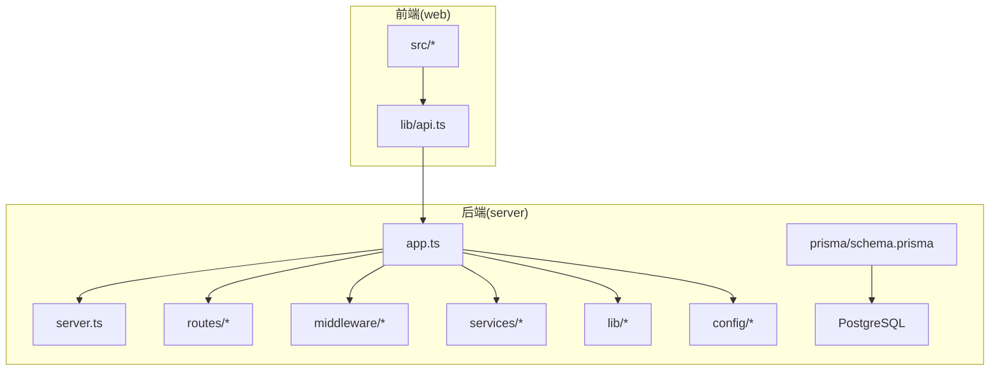
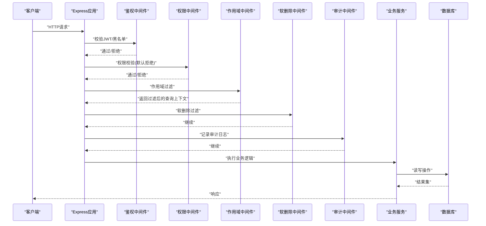
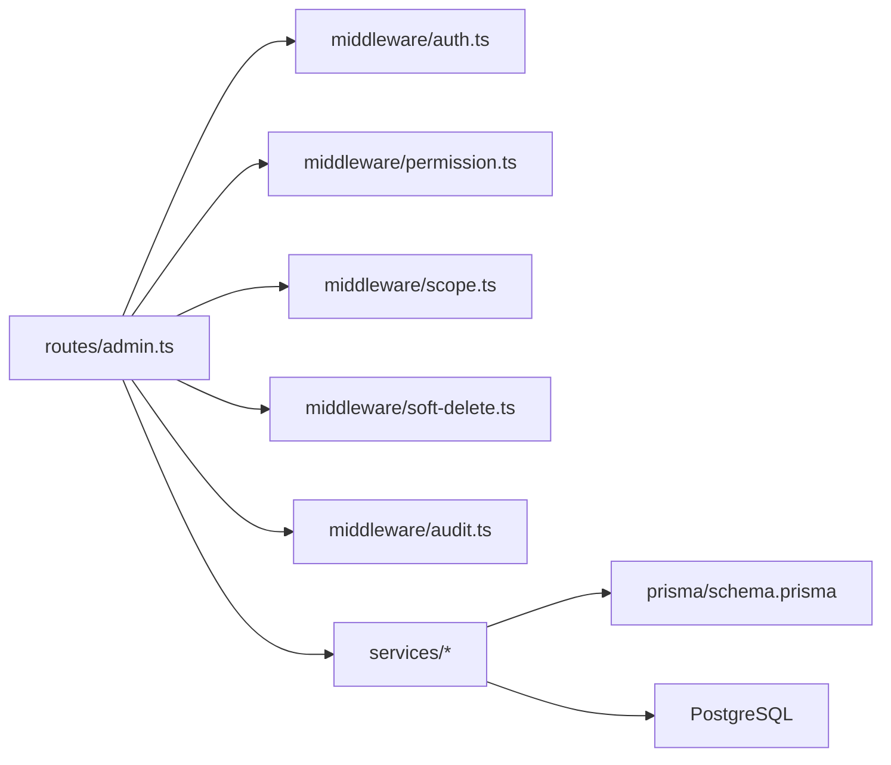

# 提交信息规范

<cite>
**本文引用的文件**   
- [server/package.json](file://server/package.json)
- [web/package.json](file://web/package.json)
- [server/prisma/schema.prisma](file://server/prisma/schema.prisma)
- [server/src/app.ts](file://server/src/app.ts)
- [server/src/server.ts](file://server/src/server.ts)
- [server/src/middleware/auth.ts](file://server/src/middleware/auth.ts)
- [server/src/middleware/permission.ts](file://server/src/middleware/permission.ts)
- [server/src/middleware/scope.ts](file://server/src/middleware/scope.ts)
- [server/src/middleware/soft-delete.ts](file://server/src/middleware/soft-delete.ts)
- [server/src/middleware/audit.ts](file://server/src/middleware/audit.ts)
- [server/src/lib/errors.ts](file://server/src/lib/errors.ts)
- [server/src/lib/logger.ts](file://server/src/lib/logger.ts)
- [server/src/services/AIProxyService.ts](file://server/src/services/AIProxyService.ts)
- [server/src/routes/admin.ts](file://server/src/routes/admin.ts)
- [server/src/routes/auth.ts](file://server/src/routes/auth.ts)
- [server/src/routes/dashboard.ts](file://server/src/routes/dashboard.ts)
- [server/src/routes/data.ts](file://server/src/routes/data.ts)
- [server/src/routes/indicators.ts](file://server/src/routes/indicators.ts)
- [server/src/routes/reports.ts](file://server/src/routes/reports.ts)
- [server/src/routes/ai.ts](file://server/src/routes/ai.ts)
- [server/src/config/env.ts](file://server/src/config/env.ts)
- [server/scripts/local-db.ts](file://server/scripts/local-db.ts)
- [server/.gitignore](file://server/.gitignore)
- [web/vitest.config.ts](file://web/vitest.config.ts)
- [server/vitest.config.ts](file://server/vitest.config.ts)
</cite>

## 目录
1. [简介](#简介)
2. [项目结构](#项目结构)
3. [核心组件](#核心组件)
4. [架构总览](#架构总览)
5. [详细组件分析](#详细组件分析)
6. [依赖分析](#依赖分析)
7. [性能考虑](#性能考虑)
8. [故障排查指南](#故障排查指南)
9. [结论](#结论)
10. [附录](#附录)

## 简介
本规范面向FY200项目的全体开发者，统一前后端与数据库变更的提交信息格式，确保版本历史清晰、可追溯、可自动化处理。文档涵盖：
- 类型前缀定义与使用场景
- 变更描述编写要求（标题与正文）
- 多文件提交与批量提交最佳实践
- 重构、数据库迁移、配置更新的特殊格式
- 提交信息验证规则与自动化检查工具配置
- 常见场景示例模板

## 项目结构
FY200为前后端分离工程：
- server：Express + Prisma + PostgreSQL 后端服务
- web：前端应用（Vite + React生态）
- prisma：数据模型与迁移管理
- scripts：辅助脚本（本地数据库、冒烟测试等）

图表来源
- [server/src/app.ts](file://server/src/app.ts)
- [server/src/server.ts](file://server/src/server.ts)
- [server/src/routes/admin.ts](file://server/src/routes/admin.ts)
- [server/src/routes/auth.ts](file://server/src/routes/auth.ts)
- [server/src/routes/dashboard.ts](file://server/src/routes/dashboard.ts)
- [server/src/routes/data.ts](file://server/src/routes/data.ts)
- [server/src/routes/indicators.ts](file://server/src/routes/indicators.ts)
- [server/src/routes/reports.ts](file://server/src/routes/reports.ts)
- [server/src/routes/ai.ts](file://server/src/routes/ai.ts)
- [server/src/middleware/auth.ts](file://server/src/middleware/auth.ts)
- [server/src/middleware/permission.ts](file://server/src/middleware/permission.ts)
- [server/src/middleware/scope.ts](file://server/src/middleware/scope.ts)
- [server/src/middleware/soft-delete.ts](file://server/src/middleware/soft-delete.ts)
- [server/src/middleware/audit.ts](file://server/src/middleware/audit.ts)
- [server/src/lib/errors.ts](file://server/src/lib/errors.ts)
- [server/src/lib/logger.ts](file://server/src/lib/logger.ts)
- [server/src/services/AIProxyService.ts](file://server/src/services/AIProxyService.ts)
- [server/src/config/env.ts](file://server/src/config/env.ts)
- [server/prisma/schema.prisma](file://server/prisma/schema.prisma)

章节来源
- [server/package.json](file://server/package.json)
- [web/package.json](file://web/package.json)

## 核心组件
- 中间件执行链（顺序固定）：helmet → cors → express.json → rate-limit → auth(JWT+黑名单) → permission(默认拒绝) → scope(Prisma扩展) → softDelete → audit → Service → Prisma → PostgreSQL
- AI双管道：polish（文本→脱敏→LLM→还原）与 analyze（结构化→计算→脱敏→LLM→生成）
- 指标计算：安全公式解析（白名单算子），同比/环比实时计算不入库

这些约束直接影响提交信息的范围与类型选择，例如涉及权限、鉴权、审计、软删除、AI流式输出、公式计算的变更需明确标注。

章节来源
- [server/src/middleware/auth.ts](file://server/src/middleware/auth.ts)
- [server/src/middleware/permission.ts](file://server/src/middleware/permission.ts)
- [server/src/middleware/scope.ts](file://server/src/middleware/scope.ts)
- [server/src/middleware/soft-delete.ts](file://server/src/middleware/soft-delete.ts)
- [server/src/middleware/audit.ts](file://server/src/middleware/audit.ts)
- [server/src/services/AIProxyService.ts](file://server/src/services/AIProxyService.ts)

## 架构总览
下图展示一次典型API请求在中间件链中的流转路径，便于理解提交影响面与分类依据。

图表来源
- [server/src/app.ts](file://server/src/app.ts)
- [server/src/middleware/auth.ts](file://server/src/middleware/auth.ts)
- [server/src/middleware/permission.ts](file://server/src/middleware/permission.ts)
- [server/src/middleware/scope.ts](file://server/src/middleware/scope.ts)
- [server/src/middleware/soft-delete.ts](file://server/src/middleware/soft-delete.ts)
- [server/src/middleware/audit.ts](file://server/src/middleware/audit.ts)
- [server/src/services/AIProxyService.ts](file://server/src/services/AIProxyService.ts)

## 详细组件分析

### 提交类型前缀与使用场景
- feat：新增功能（如新增报表维度、新增AI分析能力、新增导入导出功能）
- fix：缺陷修复（如鉴权失败、权限越权、软删除未生效、审计缺失）
- docs：文档更新（README、Wiki、接口说明、部署手册）
- style：代码风格调整（格式化、命名、注释，不影响行为）
- refactor：重构（不改变外部行为的内部结构调整，如中间件拆分、服务层重组）
- test：测试相关（新增/修改用例、测试配置、Mock数据）
- chore：日常维护（依赖升级、构建脚本、CI配置、环境变量整理）
- perf：性能优化（查询优化、缓存策略、SSE流式优化）
- ci/cd：流水线与发布流程（GitHub Actions、Docker、部署脚本）
- revert：回滚某次提交

使用建议：
- 单一提交尽量聚焦一个变更点；跨模块变更拆分为多个提交
- 对数据库、权限、鉴权、审计、软删除、AI流式等关键路径的变更，优先使用feat/fix/refactor并补充影响面说明

章节来源
- [server/src/middleware/auth.ts](file://server/src/middleware/auth.ts)
- [server/src/middleware/permission.ts](file://server/src/middleware/permission.ts)
- [server/src/middleware/scope.ts](file://server/src/middleware/scope.ts)
- [server/src/middleware/soft-delete.ts](file://server/src/middleware/soft-delete.ts)
- [server/src/middleware/audit.ts](file://server/src/middleware/audit.ts)
- [server/src/services/AIProxyService.ts](file://server/src/services/AIProxyService.ts)

### 变更描述规范
- 标题（一行）：以类型前缀开头，简明扼要说明“做了什么”，不超过50字
- 正文（可选但推荐）：分段落说明“为什么改”“如何改”“影响面”“注意事项”
- 语言：中文为主，术语保持一致
- 避免空泛描述（如“优化”“修复bug”），应具体到模块或问题编号
- 涉及敏感信息（密钥、Token、IP）不得出现在提交信息中

章节来源
- [server/src/lib/logger.ts](file://server/src/lib/logger.ts)
- [server/src/lib/errors.ts](file://server/src/lib/errors.ts)

### 多文件提交与批量提交最佳实践
- 单主题原则：一次提交只包含一个逻辑变更
- 多文件组织：按模块划分提交，必要时用“chore: 整理相关文件”作为收尾提交
- 批量提交：将无关改动拆分为独立提交，保持历史清晰
- 跨端协作：前后端接口契约变更需分别提交，并在标题中注明“接口”“契约”

章节来源
- [server/src/routes/admin.ts](file://server/src/routes/admin.ts)
- [server/src/routes/auth.ts](file://server/src/routes/auth.ts)
- [server/src/routes/dashboard.ts](file://server/src/routes/dashboard.ts)
- [server/src/routes/data.ts](file://server/src/routes/data.ts)
- [server/src/routes/indicators.ts](file://server/src/routes/indicators.ts)
- [server/src/routes/reports.ts](file://server/src/routes/reports.ts)
- [server/src/routes/ai.ts](file://server/src/routes/ai.ts)

### 代码重构的特殊格式
- 类型前缀：refactor
- 标题示例：refactor: 拆分鉴权与权限校验中间件
- 正文要点：重构动机、影响范围、兼容性说明、回归测试覆盖

章节来源
- [server/src/middleware/auth.ts](file://server/src/middleware/auth.ts)
- [server/src/middleware/permission.ts](file://server/src/middleware/permission.ts)

### 数据库迁移的特殊格式
- 类型前缀：feat/fix（根据性质选择）
- 标题示例：feat(db): 新增科目分析表及索引
- 正文要点：迁移目的、字段变更、索引策略、回滚方案、数据迁移脚本说明
- 必须关联Prisma迁移目录与schema变更

章节来源
- [server/prisma/schema.prisma](file://server/prisma/schema.prisma)
- [server/scripts/local-db.ts](file://server/scripts/local-db.ts)

### 配置文件更新的特殊格式
- 类型前缀：chore
- 标题示例：chore: 更新环境变量与敏感项加载
- 正文要点：变更原因、环境差异、安全注意事项、部署影响

章节来源
- [server/src/config/env.ts](file://server/src/config/env.ts)
- [server/.gitignore](file://server/.gitignore)

### 提交信息验证规则与自动化检查
- 正则校验：标题必须以已知类型前缀开头，长度限制，禁止空白行
- 正文校验：禁止出现敏感词（如token、secret、password）
- 钩子集成：在pre-commit或commit-msg阶段执行校验
- 工具建议：husky + commitlint（Node生态），或在CI中校验

章节来源
- [server/package.json](file://server/package.json)
- [web/package.json](file://web/package.json)
- [server/vitest.config.ts](file://server/vitest.config.ts)
- [web/vitest.config.ts](file://web/vitest.config.ts)

### 常见提交场景示例模板
- 新功能：feat: 新增报表导出为Excel功能
- 缺陷修复：fix: 修复软删除条件下列表查询遗漏
- 文档更新：docs: 补充AI分析接口调用说明
- 样式调整：style: 统一表格组件样式与间距
- 重构：refactor: 将AI代理逻辑抽离为独立服务
- 测试：test: 增加权限中间件边界用例
- 维护：chore: 升级依赖与清理无用包
- 性能：perf: 优化指标计算缓存命中率
- 流水线：ci: 添加前后端并行构建任务
- 回滚：revert: 回滚某次导致鉴权失败的提交

[本节为通用模板，不直接分析具体文件]

## 依赖分析
提交信息应与代码依赖关系一致，避免跨层耦合的模糊描述。以下图展示路由、中间件与服务之间的依赖方向，帮助定位提交影响面。

图表来源
- [server/src/routes/admin.ts](file://server/src/routes/admin.ts)
- [server/src/middleware/auth.ts](file://server/src/middleware/auth.ts)
- [server/src/middleware/permission.ts](file://server/src/middleware/permission.ts)
- [server/src/middleware/scope.ts](file://server/src/middleware/scope.ts)
- [server/src/middleware/soft-delete.ts](file://server/src/middleware/soft-delete.ts)
- [server/src/middleware/audit.ts](file://server/src/middleware/audit.ts)
- [server/prisma/schema.prisma](file://server/prisma/schema.prisma)

章节来源
- [server/src/app.ts](file://server/src/app.ts)
- [server/src/server.ts](file://server/src/server.ts)

## 性能考虑
- 提交信息应避免掩盖性能相关的重大变更，建议使用perf类型前缀并说明优化点与基准
- 对AI流式输出、指标计算、数据库查询的优化需在正文中给出对比数据或预期收益
- 谨慎合并大规模重构与性能优化，拆分为独立提交便于回溯

[本节为通用指导，不直接分析具体文件]

## 故障排查指南
- 鉴权失败：检查auth中间件与JWT配置，提交信息应标注fix并说明触发条件
- 权限越权：确认permission中间件默认拒绝策略是否生效
- 作用域异常：scope中间件与Prisma扩展是否正确注入
- 软删除失效：检查soft-delete中间件与查询构造
- 审计缺失：audit中间件是否记录必要上下文
- 错误与日志：errors与logger的使用是否规范，避免泄露敏感信息

章节来源
- [server/src/middleware/auth.ts](file://server/src/middleware/auth.ts)
- [server/src/middleware/permission.ts](file://server/src/middleware/permission.ts)
- [server/src/middleware/scope.ts](file://server/src/middleware/scope.ts)
- [server/src/middleware/soft-delete.ts](file://server/src/middleware/soft-delete.ts)
- [server/src/middleware/audit.ts](file://server/src/middleware/audit.ts)
- [server/src/lib/errors.ts](file://server/src/lib/errors.ts)
- [server/src/lib/logger.ts](file://server/src/lib/logger.ts)

## 结论
统一的提交信息规范能显著提升版本历史的可读性与可维护性。结合中间件链与AI双管道的关键路径，建议在团队内推广本规范并通过自动化检查保障落地。对于数据库迁移、配置更新与重构类变更，务必在提交信息中明确影响面与回滚策略，确保生产稳定。

[本节为总结，不直接分析具体文件]

## 附录
- 常用命令参考（示例）：
  - 安装并提交钩子：在server/web根目录安装依赖后，配置husky与commitlint
  - 运行校验：在CI中执行commitlint校验提交信息
- 环境变量与安全：
  - 严禁在提交信息中出现密钥、Token、密码等敏感内容
  - 使用.env与.gitignore管理敏感配置

[本节为补充信息，不直接分析具体文件]