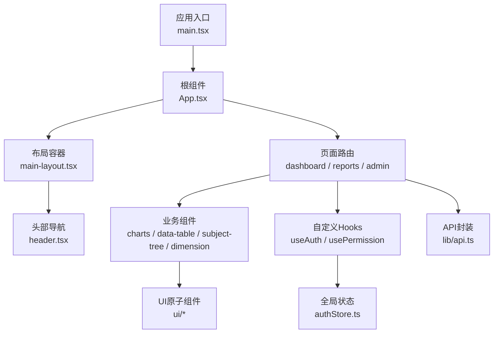
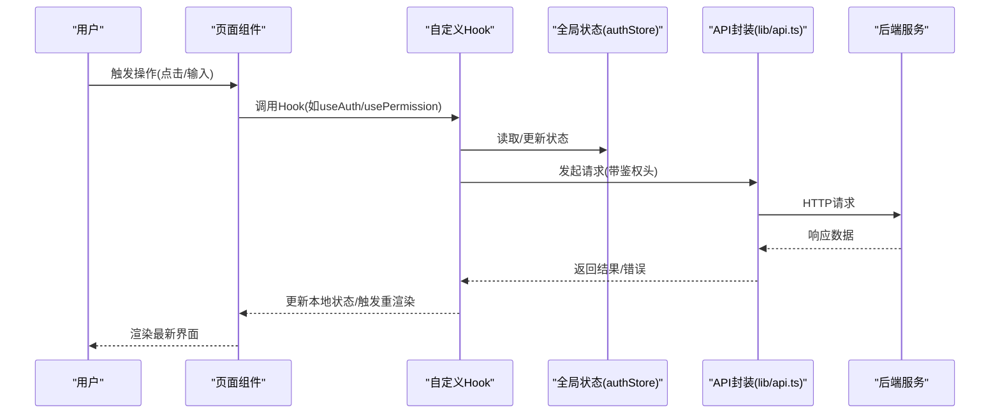
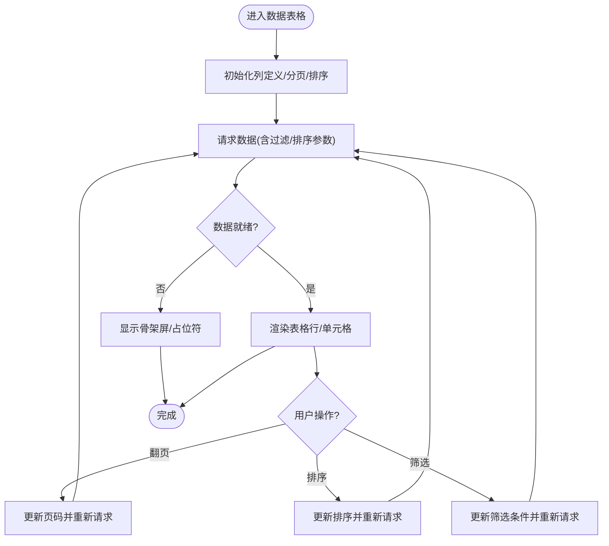
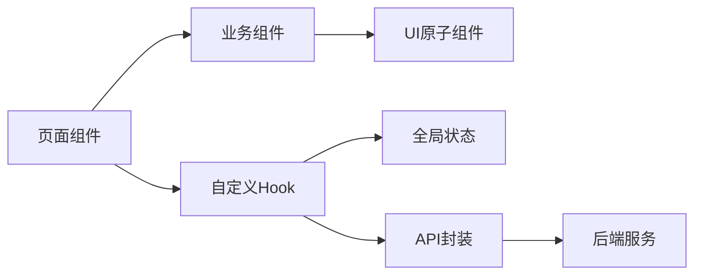

# React组件开发规范

<cite>
**本文引用的文件**   
- [web/src/main.tsx](file://web/src/main.tsx)
- [web/src/App.tsx](file://web/src/App.tsx)
- [web/src/components/ui/button.tsx](file://web/src/components/ui/button.tsx)
- [web/src/components/ui/card.tsx](file://web/src/components/ui/card.tsx)
- [web/src/components/ui/dialog.tsx](file://web/src/components/ui/dialog.tsx)
- [web/src/components/data-table/data-table.tsx](file://web/src/components/data-table/data-table.tsx)
- [web/src/components/data-table/pro-data-table.tsx](file://web/src/components/data-table/pro-data-table.tsx)
- [web/src/components/layout/header.tsx](file://web/src/components/layout/header.tsx)
- [web/src/components/layout/main-layout.tsx](file://web/src/components/layout/main-layout.tsx)
- [web/src/hooks/useAuth.ts](file://web/src/hooks/useAuth.ts)
- [web/src/hooks/usePermission.ts](file://web/src/hooks/usePermission.ts)
- [web/src/stores/authStore.ts](file://web/src/stores/authStore.ts)
- [web/src/lib/api.ts](file://web/src/lib/api.ts)
- [web/src/pages/dashboard/index.tsx](file://web/src/pages/dashboard/index.tsx)
- [web/src/pages/reports/index.tsx](file://web/src/pages/reports/index.tsx)
- [web/src/pages/admin/index.tsx](file://web/src/pages/admin/index.tsx)
- [web/src/components/charts/kpi-card.tsx](file://web/src/components/charts/kpi-card.tsx)
- [web/src/components/subject-tree/subject-tree-panel.tsx](file://web/src/components/subject-tree/subject-tree-panel.tsx)
- [web/src/components/dimension/company-panel.tsx](file://web/src/components/dimension/company-panel.tsx)
- [web/src/components/editor/rich-text-editor.tsx](file://web/src/components/editor/rich-text-editor.tsx)
- [web/src/test/setup.ts](file://web/src/test/setup.ts)
- [web/src/components/data-table/__tests__/data-table.test.tsx](file://web/src/components/data-table/__tests__/data-table.test.tsx)
- [web/src/hooks/__tests__/usePermission.test.tsx](file://web/src/hooks/__tests__/usePermission.test.tsx)
- [web/tailwind.config.js](file://web/tailwind.config.js)
- [web/postcss.config.js](file://web/postcss.config.js)
- [web/vitest.config.ts](file://web/vitest.config.ts)
</cite>

## 目录
1. [简介](#简介)
2. [项目结构](#项目结构)
3. [核心组件](#核心组件)
4. [架构总览](#架构总览)
5. [详细组件分析](#详细组件分析)
6. [依赖关系分析](#依赖关系分析)
7. [性能考量](#性能考量)
8. [故障排查指南](#故障排查指南)
9. [结论](#结论)
10. [附录](#附录)

## 简介
本规范面向FY200项目的React前端开发，目标是统一组件设计、状态管理、Hooks使用、测试策略与UI库集成方式，确保可维护性、可访问性与性能。项目定位为“Excel进、看板/报表出”的财年经营数据分析平台，单位统一为万元/人民币；前端采用函数组件优先、TypeScript类型约束、Tailwind CSS样式体系，并通过API层与后端Express服务交互。

## 项目结构
前端代码位于 web 目录，遵循按功能域与职责分层组织：
- components：UI原子组件、业务复合组件、图表与布局等
- hooks：自定义Hook（认证、权限、数据查询等）
- stores：全局状态（如认证状态）
- lib：工具与API封装
- pages：页面级路由入口
- test：测试配置与共享设置
- styles：全局样式与Tailwind配置

**图示来源** 
- [web/src/main.tsx](file://web/src/main.tsx)
- [web/src/App.tsx](file://web/src/App.tsx)
- [web/src/components/layout/main-layout.tsx](file://web/src/components/layout/main-layout.tsx)
- [web/src/components/layout/header.tsx](file://web/src/components/layout/header.tsx)
- [web/src/pages/dashboard/index.tsx](file://web/src/pages/dashboard/index.tsx)
- [web/src/pages/reports/index.tsx](file://web/src/pages/reports/index.tsx)
- [web/src/pages/admin/index.tsx](file://web/src/pages/admin/index.tsx)
- [web/src/components/charts/kpi-card.tsx](file://web/src/components/charts/kpi-card.tsx)
- [web/src/components/data-table/data-table.tsx](file://web/src/components/data-table/data-table.tsx)
- [web/src/components/subject-tree/subject-tree-panel.tsx](file://web/src/components/subject-tree/subject-tree-panel.tsx)
- [web/src/components/dimension/company-panel.tsx](file://web/src/components/dimension/company-panel.tsx)
- [web/src/hooks/useAuth.ts](file://web/src/hooks/useAuth.ts)
- [web/src/hooks/usePermission.ts](file://web/src/hooks/usePermission.ts)
- [web/src/stores/authStore.ts](file://web/src/stores/authStore.ts)
- [web/src/lib/api.ts](file://web/src/lib/api.ts)

**章节来源**
- [web/src/main.tsx](file://web/src/main.tsx)
- [web/src/App.tsx](file://web/src/App.tsx)
- [web/src/components/layout/main-layout.tsx](file://web/src/components/layout/main-layout.tsx)
- [web/src/components/layout/header.tsx](file://web/src/components/layout/header.tsx)
- [web/src/pages/dashboard/index.tsx](file://web/src/pages/dashboard/index.tsx)
- [web/src/pages/reports/index.tsx](file://web/src/pages/reports/index.tsx)
- [web/src/pages/admin/index.tsx](file://web/src/pages/admin/index.tsx)

## 核心组件
- UI原子组件（button、card、dialog等）：纯展示与基础交互，Props以TypeScript接口定义，默认值通过解构或组件内提供，避免在调用方重复设置。
- 数据表格（data-table、pro-data-table）：封装分页、排序、筛选与列定义，支持受控与非受控模式，内部状态最小化，外部通过回调同步。
- 布局组件（main-layout、header）：负责页面骨架与导航，权限控制通过require-permission逻辑注入。
- 图表与指标（kpi-card、sparkline、trend-chart等）：只读展示，props变更驱动重渲染，必要时使用React.memo优化。
- 编辑器与面板（rich-text-editor、subject-tree-panel、company-panel）：复杂交互组件，内部状态与副作用隔离，对外暴露稳定API。

**章节来源**
- [web/src/components/ui/button.tsx](file://web/src/components/ui/button.tsx)
- [web/src/components/ui/card.tsx](file://web/src/components/ui/card.tsx)
- [web/src/components/ui/dialog.tsx](file://web/src/components/ui/dialog.tsx)
- [web/src/components/data-table/data-table.tsx](file://web/src/components/data-table/data-table.tsx)
- [web/src/components/data-table/pro-data-table.tsx](file://web/src/components/data-table/pro-data-table.tsx)
- [web/src/components/layout/header.tsx](file://web/src/components/layout/header.tsx)
- [web/src/components/layout/main-layout.tsx](file://web/src/components/layout/main-layout.tsx)
- [web/src/components/charts/kpi-card.tsx](file://web/src/components/charts/kpi-card.tsx)
- [web/src/components/subject-tree/subject-tree-panel.tsx](file://web/src/components/subject-tree/subject-tree-panel.tsx)
- [web/src/components/dimension/company-panel.tsx](file://web/src/components/dimension/company-panel.tsx)
- [web/src/components/editor/rich-text-editor.tsx](file://web/src/components/editor/rich-text-editor.tsx)

## 架构总览
前端采用“页面-组件-Hook-Store-API”的分层架构：
- 页面层：组合业务组件，处理路由与页面级状态
- 组件层：UI原子与业务复合组件，职责单一
- Hook层：封装跨组件逻辑（认证、权限、数据请求）
- Store层：轻量全局状态（如认证信息）
- API层：统一网络请求与错误处理

**图示来源** 
- [web/src/pages/dashboard/index.tsx](file://web/src/pages/dashboard/index.tsx)
- [web/src/hooks/useAuth.ts](file://web/src/hooks/useAuth.ts)
- [web/src/hooks/usePermission.ts](file://web/src/hooks/usePermission.ts)
- [web/src/stores/authStore.ts](file://web/src/stores/authStore.ts)
- [web/src/lib/api.ts](file://web/src/lib/api.ts)

## 详细组件分析

### 函数组件与Props接口规范
- 函数组件优先：所有新组件使用函数组件，避免类组件带来的复杂度。
- Props接口：使用TypeScript interface明确每个字段类型、是否必填、默认值说明；对枚举值使用字面量联合类型。
- 默认值设置：通过解构默认参数或在组件内部提供默认值，保证组件可独立运行。
- 命名约定：组件名大驼峰，Props接口以ComponentNameProps命名。

示例参考路径：
- [web/src/components/ui/button.tsx](file://web/src/components/ui/button.tsx)
- [web/src/components/ui/card.tsx](file://web/src/components/ui/card.tsx)
- [web/src/components/data-table/data-table.tsx](file://web/src/components/data-table/data-table.tsx)

**章节来源**
- [web/src/components/ui/button.tsx](file://web/src/components/ui/button.tsx)
- [web/src/components/ui/card.tsx](file://web/src/components/ui/card.tsx)
- [web/src/components/data-table/data-table.tsx](file://web/src/components/data-table/data-table.tsx)

### 状态管理约定
- useState使用场景：组件内局部状态（表单输入、弹窗显隐、选中项）。
- useContext合理使用：跨层级共享不频繁变化的上下文（主题、语言），避免过度拆分导致性能问题。
- 状态提升原则：将多个子组件共享的状态提升到最近公共父组件，保持单向数据流。
- 全局状态：认证信息、用户权限等放入authStore，通过订阅机制通知更新。

示例参考路径：
- [web/src/stores/authStore.ts](file://web/src/stores/authStore.ts)
- [web/src/hooks/useAuth.ts](file://web/src/hooks/useAuth.ts)
- [web/src/hooks/usePermission.ts](file://web/src/hooks/usePermission.ts)

**章节来源**
- [web/src/stores/authStore.ts](file://web/src/stores/authStore.ts)
- [web/src/hooks/useAuth.ts](file://web/src/hooks/useAuth.ts)
- [web/src/hooks/usePermission.ts](file://web/src/hooks/usePermission.ts)

### Hooks使用规范
- 自定义Hook设计：单一职责，输入输出清晰，避免隐藏副作用；命名useXxx。
- 依赖数组管理：严格声明useEffect/useMemo/useCallback依赖，避免遗漏导致陈旧闭包。
- 副作用处理：清理定时器、事件监听、订阅；失败重试与超时控制。
- 数据获取：集中到api-queries或lib/api，结合Hook封装缓存与错误处理。

示例参考路径：
- [web/src/hooks/useAuth.ts](file://web/src/hooks/useAuth.ts)
- [web/src/hooks/usePermission.ts](file://web/src/hooks/usePermission.ts)
- [web/src/lib/api.ts](file://web/src/lib/api.ts)

**章节来源**
- [web/src/hooks/useAuth.ts](file://web/src/hooks/useAuth.ts)
- [web/src/hooks/usePermission.ts](file://web/src/hooks/usePermission.ts)
- [web/src/lib/api.ts](file://web/src/lib/api.ts)

### 组件测试策略
- 单元测试编写：使用Vitest + React Testing Library，聚焦行为断言而非实现细节。
- 模拟数据准备：mock API响应、用户状态、权限集合，确保测试环境稳定。
- 断言最佳实践：检查渲染结果、用户交互反馈、错误边界处理。
- 覆盖率要求：关键Hook与UI组件需达到合理覆盖率阈值。

示例参考路径：
- [web/src/components/data-table/__tests__/data-table.test.tsx](file://web/src/components/data-table/__tests__/data-table.test.tsx)
- [web/src/hooks/__tests__/usePermission.test.tsx](file://web/src/hooks/__tests__/usePermission.test.tsx)
- [web/src/test/setup.ts](file://web/src/test/setup.ts)
- [web/vitest.config.ts](file://web/vitest.config.ts)

**章节来源**
- [web/src/components/data-table/__tests__/data-table.test.tsx](file://web/src/components/data-table/__tests__/data-table.test.tsx)
- [web/src/hooks/__tests__/usePermission.test.tsx](file://web/src/hooks/__tests__/usePermission.test.tsx)
- [web/src/test/setup.ts](file://web/src/test/setup.ts)
- [web/vitest.config.ts](file://web/vitest.config.ts)

### UI组件库与Tailwind CSS集成
- Tailwind集成：通过tailwind.config.js与postcss.config.js启用，使用原子类构建响应式布局。
- 响应式设计：基于断点系统（sm/md/lg/xl）适配多端设备，避免硬编码像素。
- 可访问性：按钮、输入、对话框等需提供aria属性、键盘导航、焦点管理与语义化标签。
- 主题与扩展：通过配置文件统一管理颜色、字体、间距，保持视觉一致性。

示例参考路径：
- [web/tailwind.config.js](file://web/tailwind.config.js)
- [web/postcss.config.js](file://web/postcss.config.js)
- [web/src/components/ui/button.tsx](file://web/src/components/ui/button.tsx)
- [web/src/components/ui/dialog.tsx](file://web/src/components/ui/dialog.tsx)

**章节来源**
- [web/tailwind.config.js](file://web/tailwind.config.js)
- [web/postcss.config.js](file://web/postcss.config.js)
- [web/src/components/ui/button.tsx](file://web/src/components/ui/button.tsx)
- [web/src/components/ui/dialog.tsx](file://web/src/components/ui/dialog.tsx)

### 复杂组件流程示例：数据表格

**图示来源** 
- [web/src/components/data-table/data-table.tsx](file://web/src/components/data-table/data-table.tsx)
- [web/src/components/data-table/pro-data-table.tsx](file://web/src/components/data-table/pro-data-table.tsx)

**章节来源**
- [web/src/components/data-table/data-table.tsx](file://web/src/components/data-table/data-table.tsx)
- [web/src/components/data-table/pro-data-table.tsx](file://web/src/components/data-table/pro-data-table.tsx)

## 依赖关系分析
- 组件间依赖：页面组合业务组件，业务组件依赖UI原子组件；避免循环引用。
- Hook与Store：Hook读取/更新store，页面订阅Hook返回值；减少直接访问store。
- API层：统一封装请求拦截、错误处理、重试策略；页面与组件通过Hook间接调用。

**图示来源** 
- [web/src/pages/dashboard/index.tsx](file://web/src/pages/dashboard/index.tsx)
- [web/src/components/charts/kpi-card.tsx](file://web/src/components/charts/kpi-card.tsx)
- [web/src/components/data-table/data-table.tsx](file://web/src/components/data-table/data-table.tsx)
- [web/src/hooks/useAuth.ts](file://web/src/hooks/useAuth.ts)
- [web/src/stores/authStore.ts](file://web/src/stores/authStore.ts)
- [web/src/lib/api.ts](file://web/src/lib/api.ts)

**章节来源**
- [web/src/pages/dashboard/index.tsx](file://web/src/pages/dashboard/index.tsx)
- [web/src/components/charts/kpi-card.tsx](file://web/src/components/charts/kpi-card.tsx)
- [web/src/components/data-table/data-table.tsx](file://web/src/components/data-table/data-table.tsx)
- [web/src/hooks/useAuth.ts](file://web/src/hooks/useAuth.ts)
- [web/src/stores/authStore.ts](file://web/src/stores/authStore.ts)
- [web/src/lib/api.ts](file://web/src/lib/api.ts)

## 性能考量
- React.memo：对纯展示组件（如图表、卡片）包裹memo，避免不必要的重渲染。
- 懒加载：页面级与重型组件使用动态导入，按需加载减少首屏体积。
- 内存泄漏预防：在useEffect中清理定时器、事件监听、订阅；取消未完成的请求。
- 列表渲染：为列表项提供稳定key，避免索引作为key；虚拟化长列表。
- 计算优化：使用useMemo缓存昂贵计算，useCallback稳定回调引用。

[本节为通用指导，无需特定文件来源]

## 故障排查指南
- 常见问题定位：检查浏览器控制台错误、网络请求失败、权限不足导致的空白页。
- 调试技巧：使用React DevTools查看组件树与状态变化；添加日志输出关键Hook返回值。
- 错误边界：为页面或模块添加错误边界，捕获渲染异常并降级展示。
- 测试辅助：利用Vitest断言与模拟数据复现问题，逐步缩小范围。

示例参考路径：
- [web/src/test/setup.ts](file://web/src/test/setup.ts)
- [web/vitest.config.ts](file://web/vitest.config.ts)

**章节来源**
- [web/src/test/setup.ts](file://web/src/test/setup.ts)
- [web/vitest.config.ts](file://web/vitest.config.ts)

## 结论
本规范明确了FY200项目React组件开发的统一标准，涵盖组件结构、状态管理、Hooks使用、测试策略与UI集成，旨在提升代码质量、可维护性与用户体验。建议团队在迭代中持续完善与落地，结合自动化测试与代码审查保障执行效果。

## 附录
- 命名约定：组件、Hook、Store、API函数均遵循清晰一致的命名风格。
- 文档与注释：关键接口与复杂逻辑需补充JSDoc注释，便于协作与维护。
- 版本兼容：关注React与第三方库版本升级，提前评估影响与迁移成本。

[本节为通用指导，无需特定文件来源]