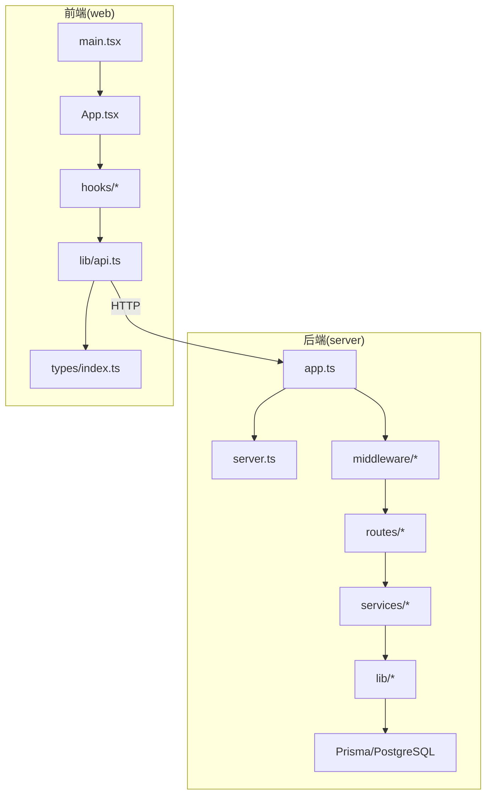
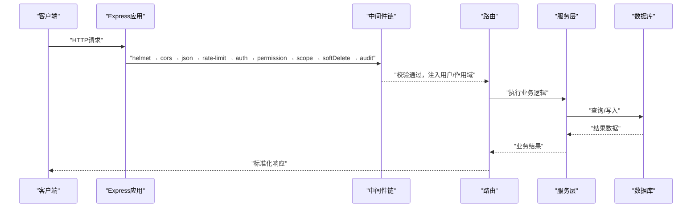
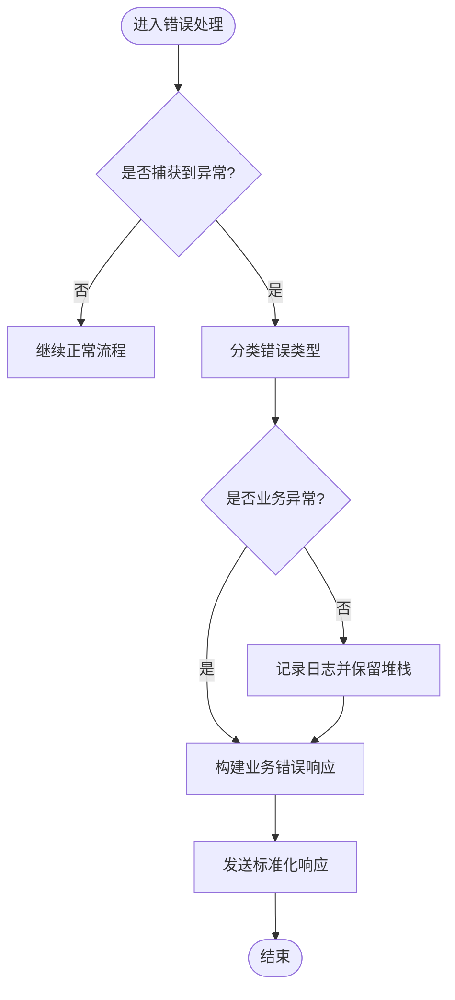
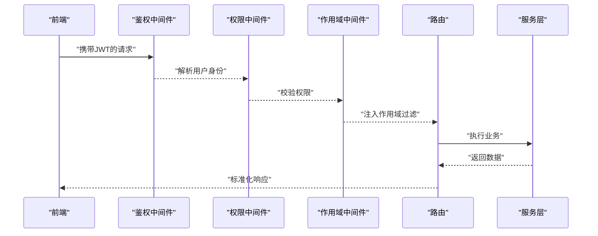
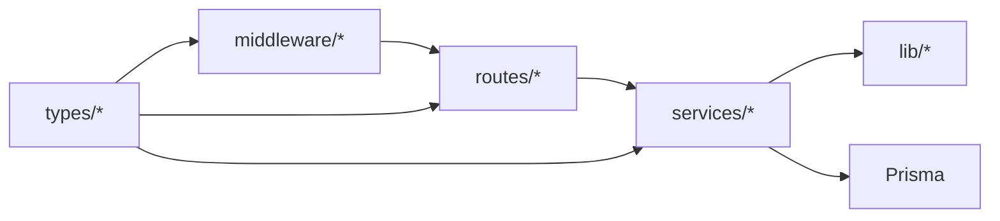

# TypeScript编码规范

<cite>
**本文引用的文件**   
- [server/tsconfig.json](file://server/tsconfig.json)
- [web/tsconfig.json](file://web/tsconfig.json)
- [web/tsconfig.app.json](file://web/tsconfig.app.json)
- [web/tsconfig.node.json](file://web/tsconfig.node.json)
- [server/src/lib/errors.ts](file://server/src/lib/errors.ts)
- [server/src/middleware/error-handler.ts](file://server/src/middleware/error-handler.ts)
- [server/src/lib/async-handler.ts](file://server/src/lib/async-handler.ts)
- [server/src/lib/response.ts](file://server/src/lib/response.ts)
- [server/src/lib/schema.ts](file://server/src/lib/schema.ts)
- [server/src/types/express.d.ts](file://server/src/types/express.d.ts)
- [server/src/app.ts](file://server/src/app.ts)
- [server/src/server.ts](file://server/src/server.ts)
- [server/src/config/env.ts](file://server/src/config/env.ts)
- [server/src/middleware/auth.ts](file://server/src/middleware/auth.ts)
- [server/src/middleware/permission.ts](file://server/src/middleware/permission.ts)
- [server/src/middleware/scope.ts](file://server/src/middleware/scope.ts)
- [server/src/middleware/soft-delete.ts](file://server/src/middleware/soft-delete.ts)
- [server/src/middleware/audit.ts](file://server/src/middleware/audit.ts)
- [server/src/routes/auth.ts](file://server/src/routes/auth.ts)
- [server/src/services/AuthService.ts](file://server/src/services/AuthService.ts)
- [web/src/types/index.ts](file://web/src/types/index.ts)
- [web/src/lib/api.ts](file://web/src/lib/api.ts)
- [web/src/hooks/api-queries.ts](file://web/src/hooks/api-queries.ts)
- [web/src/stores/authStore.ts](file://web/src/stores/authStore.ts)
</cite>

## 目录
1. [简介](#简介)
2. [项目结构](#项目结构)
3. [核心组件](#核心组件)
4. [架构总览](#架构总览)
5. [详细组件分析](#详细组件分析)
6. [依赖分析](#依赖分析)
7. [性能考虑](#性能考虑)
8. [故障排查指南](#故障排查指南)
9. [结论](#结论)
10. [附录](#附录)

## 简介
本规范面向FY200项目的TypeScript开发，聚焦类型定义最佳实践、错误处理模式、模块组织与配置选项。目标是在前后端统一类型契约、提升可维护性与健壮性，并给出可直接落地的示例路径与反模式规避建议。

## 项目结构
FY200采用前后端分离：
- 后端 server：Express + Prisma + PostgreSQL，中间件链严格顺序执行，服务层按领域划分。
- 前端 web：React + Vite，类型集中在 types 与 lib，API调用通过 hooks 封装。

图表来源
- [server/src/app.ts](file://server/src/app.ts)
- [server/src/server.ts](file://server/src/server.ts)
- [web/src/main.tsx](file://web/src/main.tsx)
- [web/src/App.tsx](file://web/src/App.tsx)
- [web/src/hooks/api-queries.ts](file://web/src/hooks/api-queries.ts)
- [web/src/lib/api.ts](file://web/src/lib/api.ts)

章节来源
- [server/src/app.ts](file://server/src/app.ts)
- [server/src/server.ts](file://server/src/server.ts)
- [web/src/main.tsx](file://web/src/main.tsx)
- [web/src/App.tsx](file://web/src/App.tsx)

## 核心组件
- 类型系统
  - 接口设计：以“最小必要字段”为原则，使用可选标记区分可选参数；对枚举值使用字面量联合类型或enum；对外暴露的DTO使用只读属性避免意外修改。
  - 泛型使用：在通用服务（如分页、响应包装）中引入泛型，保持调用方类型推导；避免滥用 any/unknown，优先 unknown 并在入口处收窄。
  - 联合类型与交叉类型：用联合类型表达“多形态”，用交叉类型组合“能力集”；避免过度嵌套导致类型爆炸。
- 错误处理
  - 自定义错误类：业务异常继承统一基类，携带code/message及上下文；非预期异常保留堆栈。
  - 错误边界：服务端统一错误处理器将异常转为标准响应；客户端使用请求拦截器与UI错误边界捕获渲染失败。
  - 异步错误：所有异步函数返回Promise并显式reject；路由层使用统一包装避免未捕获拒绝。
- 模块组织
  - 文件结构：按领域分层（routes/services/lib/middleware），公共类型放types，工具函数放lib。
  - 导入导出：默认导出单一主实体，命名导出辅助方法；避免循环依赖，必要时抽取共享契约。
  - 循环依赖避免：通过接口抽象、事件总线或延迟加载解耦。

章节来源
- [server/src/lib/errors.ts](file://server/src/lib/errors.ts)
- [server/src/middleware/error-handler.ts](file://server/src/middleware/error-handler.ts)
- [server/src/lib/async-handler.ts](file://server/src/lib/async-handler.ts)
- [server/src/lib/response.ts](file://server/src/lib/response.ts)
- [server/src/lib/schema.ts](file://server/src/lib/schema.ts)
- [server/src/types/express.d.ts](file://server/src/types/express.d.ts)
- [web/src/types/index.ts](file://web/src/types/index.ts)
- [web/src/lib/api.ts](file://web/src/lib/api.ts)
- [web/src/hooks/api-queries.ts](file://web/src/hooks/api-queries.ts)

## 架构总览
后端中间件链顺序固定，确保鉴权、权限、作用域、审计等横切关注点一致执行。

图表来源
- [server/src/app.ts](file://server/src/app.ts)
- [server/src/middleware/auth.ts](file://server/src/middleware/auth.ts)
- [server/src/middleware/permission.ts](file://server/src/middleware/permission.ts)
- [server/src/middleware/scope.ts](file://server/src/middleware/scope.ts)
- [server/src/middleware/soft-delete.ts](file://server/src/middleware/soft-delete.ts)
- [server/src/middleware/audit.ts](file://server/src/middleware/audit.ts)

## 详细组件分析

### 类型定义最佳实践
- 接口设计模式
  - DTO与实体分离：数据库模型与API传输对象解耦，避免泄露内部实现。
  - 不可变性：对外暴露的响应体使用只读类型，防止下游误改。
  - 判别联合：使用字面量字段作为discriminated union，提高分支推断精度。
- 泛型使用
  - 在分页、列表、表单提交等通用场景使用泛型，保证类型安全与IDE提示。
  - 限制泛型范围，避免过宽约束导致类型推导失败。
- 联合类型与交叉类型
  - 联合类型用于状态机或多态输入；交叉类型用于组合多个能力接口。
  - 谨慎使用never，仅在穷尽检查时出现。

章节来源
- [server/src/lib/schema.ts](file://server/src/lib/schema.ts)
- [server/src/lib/response.ts](file://server/src/lib/response.ts)
- [web/src/types/index.ts](file://web/src/types/index.ts)

### 错误处理模式
- 自定义错误类
  - 统一错误基类，包含错误码、消息、扩展字段；业务异常抛出具体子类。
- 错误边界处理
  - 服务端：全局错误处理器捕获未处理异常，输出结构化错误响应。
  - 客户端：请求拦截器统一处理网络错误与业务错误码；UI层提供错误边界组件。
- 异步错误捕获
  - 路由层使用统一包装，避免未捕获Promise拒绝；服务层集中抛出业务异常。

图表来源
- [server/src/lib/errors.ts](file://server/src/lib/errors.ts)
- [server/src/middleware/error-handler.ts](file://server/src/middleware/error-handler.ts)
- [server/src/lib/async-handler.ts](file://server/src/lib/async-handler.ts)

章节来源
- [server/src/lib/errors.ts](file://server/src/lib/errors.ts)
- [server/src/middleware/error-handler.ts](file://server/src/middleware/error-handler.ts)
- [server/src/lib/async-handler.ts](file://server/src/lib/async-handler.ts)

### 模块组织规范
- 文件结构
  - routes：仅负责参数解析与调度，不包含业务逻辑。
  - services：承载领域逻辑，依赖lib工具与Prisma。
  - lib：纯函数与工具，无副作用。
  - middleware：横切关注点，按职责拆分。
- 导入导出约定
  - 默认导出主类型/组件，命名导出工具函数；避免同名冲突。
- 循环依赖避免策略
  - 抽取共享契约到types或shared；使用延迟加载或事件机制解耦。

章节来源
- [server/src/app.ts](file://server/src/app.ts)
- [server/src/middleware/auth.ts](file://server/src/middleware/auth.ts)
- [server/src/middleware/permission.ts](file://server/src/middleware/permission.ts)
- [server/src/middleware/scope.ts](file://server/src/middleware/scope.ts)
- [server/src/middleware/soft-delete.ts](file://server/src/middleware/soft-delete.ts)
- [server/src/middleware/audit.ts](file://server/src/middleware/audit.ts)

### 配置选项与编译优化
- tsconfig.json设置
  - 严格模式开启：strict、noImplicitAny、strictNullChecks等。
  - 模块解析：moduleResolution、target、module、outDir、baseUrl、paths。
  - 类型声明：include/exclude控制编译范围，避免无关文件参与类型检查。
- 编译优化
  - 增量编译、sourceMap、declaration生成按需开启。
  - 生产环境关闭调试信息，启用tree-shaking。
- 类型检查严格模式
  - 推荐启用最严格模式，配合ESLint规则保障一致性。

章节来源
- [server/tsconfig.json](file://server/tsconfig.json)
- [web/tsconfig.json](file://web/tsconfig.json)
- [web/tsconfig.app.json](file://web/tsconfig.app.json)
- [web/tsconfig.node.json](file://web/tsconfig.node.json)

### API与类型契约（前后端对齐）
- 统一响应格式：成功/失败结构一致，便于前端类型推导。
- 请求参数校验：后端使用schema校验，前端复用类型定义。
- 错误码体系：统一错误码与消息，便于国际化与监控。

章节来源
- [server/src/lib/response.ts](file://server/src/lib/response.ts)
- [server/src/lib/schema.ts](file://server/src/lib/schema.ts)
- [web/src/lib/api.ts](file://web/src/lib/api.ts)
- [web/src/types/index.ts](file://web/src/types/index.ts)

### 认证与权限的类型化流程

图表来源
- [server/src/middleware/auth.ts](file://server/src/middleware/auth.ts)
- [server/src/middleware/permission.ts](file://server/src/middleware/permission.ts)
- [server/src/middleware/scope.ts](file://server/src/middleware/scope.ts)
- [server/src/routes/auth.ts](file://server/src/routes/auth.ts)
- [server/src/services/AuthService.ts](file://server/src/services/AuthService.ts)

章节来源
- [server/src/middleware/auth.ts](file://server/src/middleware/auth.ts)
- [server/src/middleware/permission.ts](file://server/src/middleware/permission.ts)
- [server/src/middleware/scope.ts](file://server/src/middleware/scope.ts)
- [server/src/routes/auth.ts](file://server/src/routes/auth.ts)
- [server/src/services/AuthService.ts](file://server/src/services/AuthService.ts)

### 前端状态与类型管理
- 使用集中式store管理认证状态，类型与后端保持一致。
- API查询通过hooks封装，自动处理加载、错误与缓存。
- 表单与表格组件使用强类型约束，减少运行时错误。

章节来源
- [web/src/stores/authStore.ts](file://web/src/stores/authStore.ts)
- [web/src/hooks/api-queries.ts](file://web/src/hooks/api-queries.ts)
- [web/src/lib/api.ts](file://web/src/lib/api.ts)
- [web/src/types/index.ts](file://web/src/types/index.ts)

## 依赖分析
- 耦合关系
  - 中间件之间低耦合，通过请求上下文传递用户与作用域信息。
  - 服务层依赖lib工具与Prisma，不直接操作HTTP。
- 外部依赖
  - Express、Prisma、PostgreSQL、JWT、DeepSeek API。
- 潜在循环依赖
  - 通过types与lib抽离避免；必要时使用延迟加载。

图表来源
- [server/src/routes/auth.ts](file://server/src/routes/auth.ts)
- [server/src/services/AuthService.ts](file://server/src/services/AuthService.ts)
- [server/src/lib/errors.ts](file://server/src/lib/errors.ts)
- [server/src/middleware/auth.ts](file://server/src/middleware/auth.ts)
- [server/src/types/express.d.ts](file://server/src/types/express.d.ts)

章节来源
- [server/src/app.ts](file://server/src/app.ts)
- [server/src/server.ts](file://server/src/server.ts)

## 性能考虑
- 类型层面
  - 避免深层联合类型导致的类型检查开销；合理使用条件类型与映射类型。
  - 减少any/unknown的使用，降低运行时转换成本。
- 运行层面
  - 中间件尽早失败，减少无效计算。
  - 数据库查询使用Prisma extension精准投影，避免N+1。
- 前端层面
  - 组件懒加载与代码分割；请求去抖与缓存策略。

[本节为通用指导，无需特定文件引用]

## 故障排查指南
- 常见问题
  - 类型不匹配：检查DTO与实体映射、泛型约束与判别联合。
  - 异步错误未捕获：确认路由层统一包装与服务层异常抛出。
  - 循环依赖：定位import环，抽取共享契约或延迟加载。
- 诊断步骤
  - 启用严格模式与sourceMap，定位类型与运行时错误。
  - 查看错误处理器输出的结构化错误信息。
  - 使用日志与追踪ID定位请求链路。

章节来源
- [server/src/middleware/error-handler.ts](file://server/src/middleware/error-handler.ts)
- [server/src/lib/async-handler.ts](file://server/src/lib/async-handler.ts)
- [server/src/config/env.ts](file://server/src/config/env.ts)

## 结论
本规范围绕类型定义、错误处理、模块组织与配置优化，提供了FY200项目的TypeScript实践指南。遵循这些原则可显著提升代码质量、可维护性与团队协作效率。建议在CI中集成类型检查与静态分析，持续保障规范落地。

[本节为总结性内容，无需特定文件引用]

## 附录
- 示例路径（正确用法与反模式规避）
  - 接口设计：参考响应与schema定义，避免泄露内部字段。
  - 泛型使用：在通用服务中引入泛型，保持类型推导。
  - 错误处理：统一错误类与处理器，避免分散处理。
  - 模块组织：按领域分层，避免跨层直连。
  - 配置优化：严格模式与编译选项按需开启。

章节来源
- [server/src/lib/response.ts](file://server/src/lib/response.ts)
- [server/src/lib/schema.ts](file://server/src/lib/schema.ts)
- [server/src/lib/errors.ts](file://server/src/lib/errors.ts)
- [server/src/middleware/error-handler.ts](file://server/src/middleware/error-handler.ts)
- [server/tsconfig.json](file://server/tsconfig.json)
- [web/tsconfig.json](file://web/tsconfig.json)
- [web/tsconfig.app.json](file://web/tsconfig.app.json)
- [web/tsconfig.node.json](file://web/tsconfig.node.json)