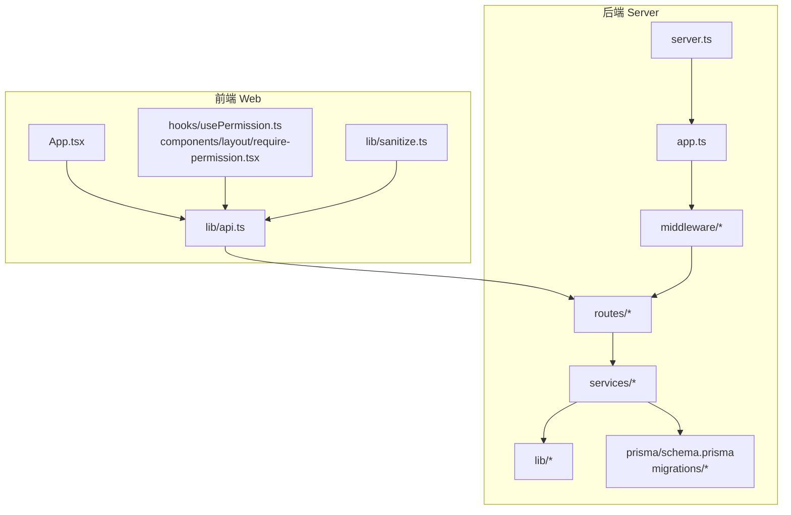
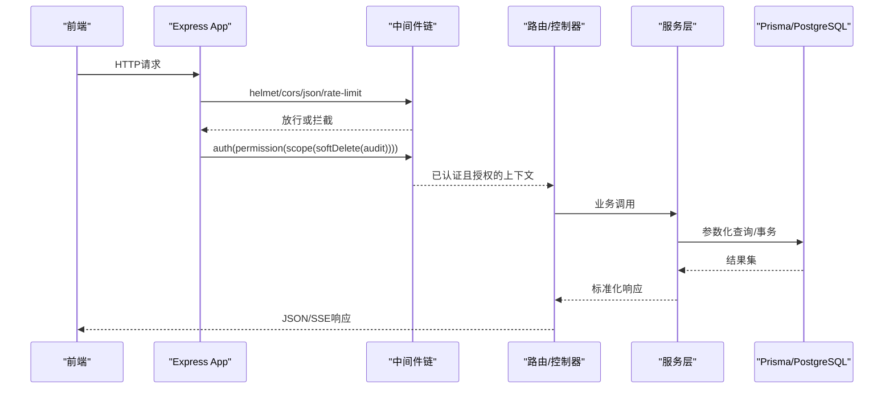
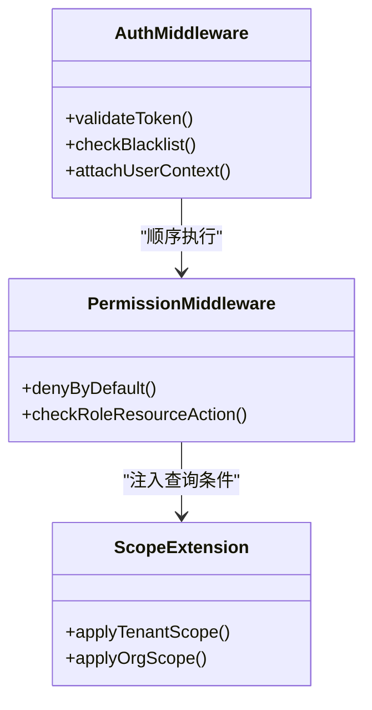
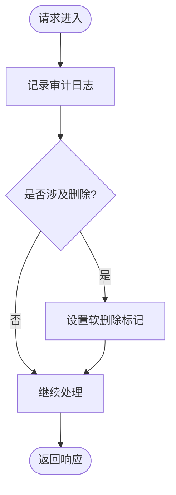
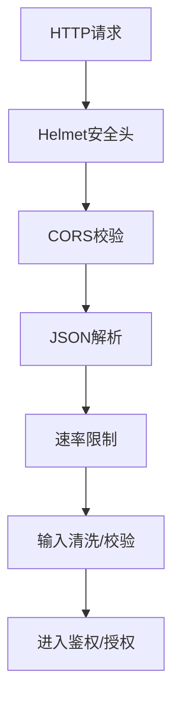
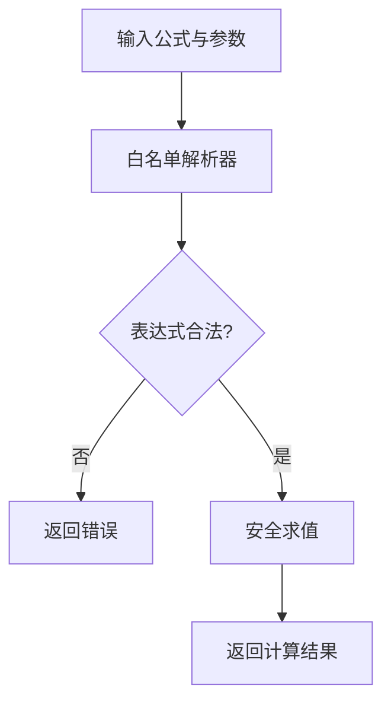
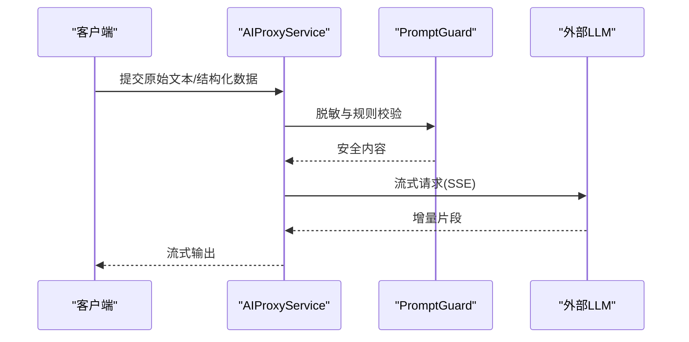
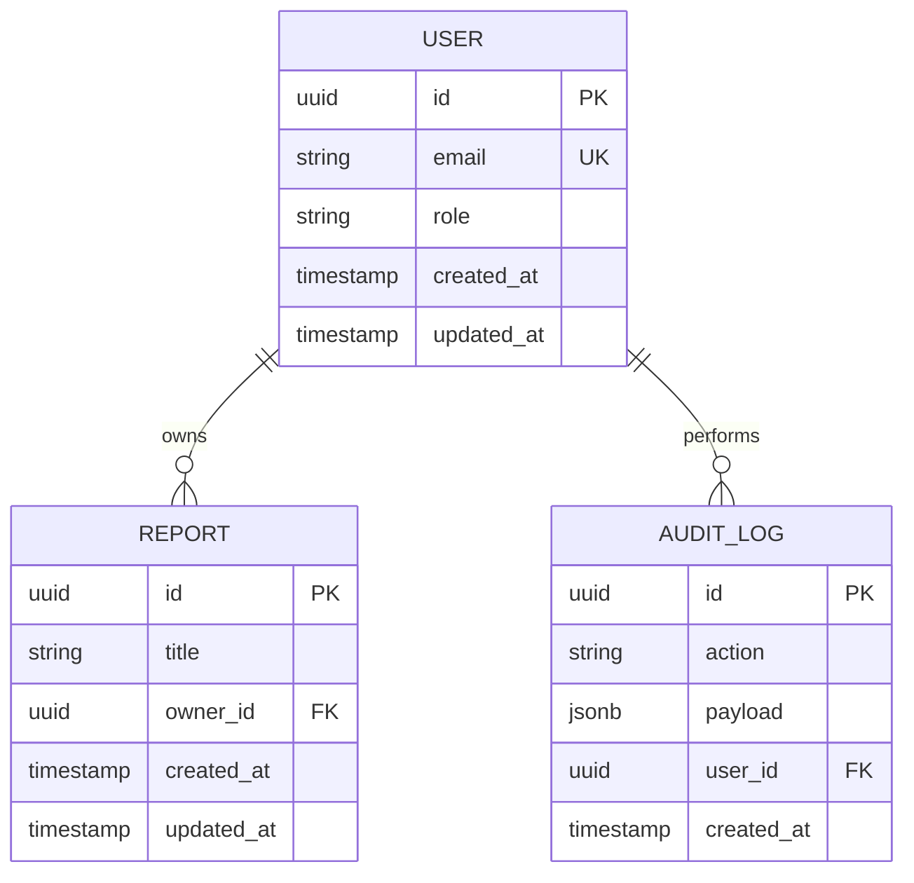
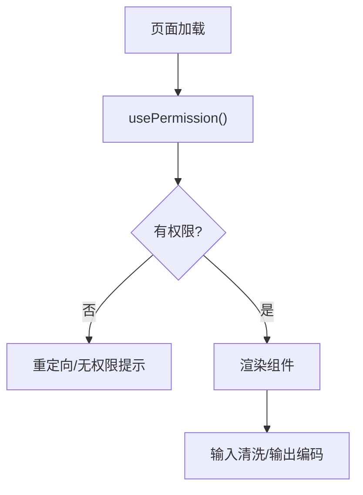
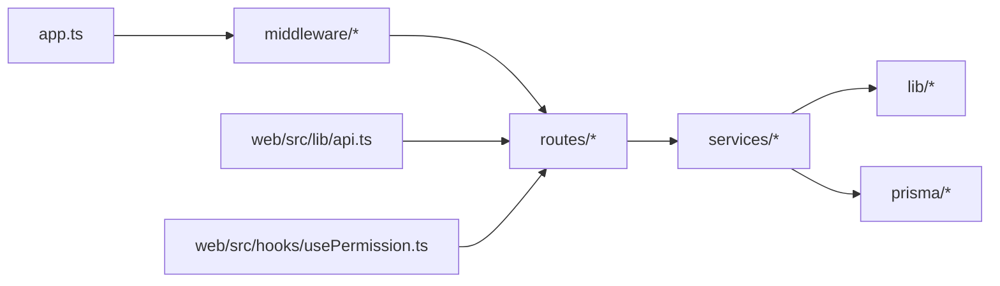

# 代码审查检查清单

<cite>
**本文引用的文件**   
- [server/src/app.ts](file://server/src/app.ts)
- [server/src/server.ts](file://server/src/server.ts)
- [server/src/middleware/auth.ts](file://server/src/middleware/auth.ts)
- [server/src/middleware/permission.ts](file://server/src/middleware/permission.ts)
- [server/src/middleware/scope.ts](file://server/src/middleware/scope.ts)
- [server/src/middleware/soft-delete.ts](file://server/src/middleware/soft-delete.ts)
- [server/src/middleware/audit.ts](file://server/src/middleware/audit.ts)
- [server/src/middleware/rate-limit.ts](file://server/src/middleware/rate-limit.ts)
- [server/src/middleware/cors.ts](file://server/src/middleware/cors.ts)
- [server/src/middleware/helmet.ts](file://server/src/middleware/helmet.ts)
- [server/src/lib/jwt.ts](file://server/src/lib/jwt.ts)
- [server/src/lib/errors.ts](file://server/src/lib/errors.ts)
- [server/src/lib/response.ts](file://server/src/lib/response.ts)
- [server/src/lib/prisma.ts](file://server/src/lib/prisma.ts)
- [server/src/lib/formula.ts](file://server/src/lib/formula.ts)
- [server/src/lib/prompt-guard.ts](file://server/src/lib/prompt-guard.ts)
- [server/src/lib/desensitize.test.ts](file://server/src/lib/desensitize.test.ts)
- [server/src/services/AIProxyService.ts](file://server/src/services/AIProxyService.ts)
- [server/src/routes/auth.ts](file://server/src/routes/auth.ts)
- [server/src/routes/admin.ts](file://server/src/routes/admin.ts)
- [server/src/routes/data.ts](file://server/src/routes/data.ts)
- [server/src/routes/reports.ts](file://server/src/routes/reports.ts)
- [server/src/routes/dashboard.ts](file://server/src/routes/dashboard.ts)
- [server/src/routes/indicators.ts](file://server/src/routes/indicators.ts)
- [server/src/routes/ai.ts](file://server/src/routes/ai.ts)
- [server/prisma/schema.prisma](file://server/prisma/schema.prisma)
- [server/prisma/migrations/20260722121714_init/migration.sql](file://server/prisma/migrations/20260722121714_init/migration.sql)
- [server/prisma/migrations/20260722142144_add_formula_rule/migration.sql](file://server/prisma/migrations/20260722142144_add_formula_rule/migration.sql)
- [server/prisma/migrations/20260723120000_add_subject_analysis/migration.sql](file://server/prisma/migrations/20260723120000_add_subject_analysis/migration.sql)
- [server/prisma/migrations/20260724120000_remove_business_unit_org_scope/migration.sql](file://server/prisma/migrations/20260724120000_remove_business_unit_org_scope/migration.sql)
- [web/src/components/layout/require-permission.tsx](file://web/src/components/layout/require-permission.tsx)
- [web/src/hooks/usePermission.ts](file://web/src/hooks/usePermission.ts)
- [web/src/lib/sanitize.ts](file://web/src/lib/sanitize.ts)
- [web/src/lib/api.ts](file://web/src/lib/api.ts)
</cite>

## 目录
1. [引言](#引言)
2. [项目结构](#项目结构)
3. [核心组件](#核心组件)
4. [架构总览](#架构总览)
5. [详细组件分析](#详细组件分析)
6. [依赖分析](#依赖分析)
7. [性能考量](#性能考量)
8. [故障排查指南](#故障排查指南)
9. [结论](#结论)
10. [附录：审查流程与评分标准](#附录审查流程与评分标准)

## 引言
本文件为FY200项目的代码审查检查清单，面向后端（Express + Prisma + PostgreSQL）与前端（React/Vite），覆盖功能正确性、安全性、性能、代码质量、可维护性与安全合规六大维度。结合项目“Excel进、看板/报表出”的定位与AI双管道架构，提供统一的审查标准与评分方法，帮助团队建立一致的质量基线。

## 项目结构
- 后端 server：Express应用、中间件链、服务层、路由、Prisma数据访问、工具库与测试。
- 前端 web：页面、组件、hooks、状态、API封装、工具与测试。
- 文档 docs 与 wiki：规范、参考、计划与进度报告。
- 数据库 prisma：schema、迁移、种子数据与审计脚本。

图表来源
- [server/src/server.ts](file://server/src/server.ts)
- [server/src/app.ts](file://server/src/app.ts)
- [web/src/App.tsx](file://web/src/App.tsx)
- [web/src/lib/api.ts](file://web/src/lib/api.ts)

章节来源
- [server/src/server.ts](file://server/src/server.ts)
- [server/src/app.ts](file://server/src/app.ts)
- [web/src/App.tsx](file://web/src/App.tsx)

## 核心组件
- 中间件链：helmet → cors → express.json → rate-limit → auth(JWT+黑名单) → permission(默认拒绝) → scope(Prisma扩展) → softDelete → audit → Service → Prisma → PostgreSQL。
- 鉴权与授权：JWT access/refresh轮转；权限模型默认拒绝，按角色/资源粒度控制；作用域通过Prisma扩展注入。
- 数据与安全：输入校验、SQL参数化、XSS防护、敏感信息脱敏（金额→区间、公司名→动态映射）。
- AI双管道：polish（文本→脱敏→LLM→还原）/ analyze（结构化→计算→脱敏→LLM→生成），SSE流式输出。
- 指标计算：安全公式解析（白名单算子 +-*/()，禁止eval），同比/环比实时计算不入库。

章节来源
- [server/src/middleware/auth.ts](file://server/src/middleware/auth.ts)
- [server/src/middleware/permission.ts](file://server/src/middleware/permission.ts)
- [server/src/middleware/scope.ts](file://server/src/middleware/scope.ts)
- [server/src/middleware/soft-delete.ts](file://server/src/middleware/soft-delete.ts)
- [server/src/middleware/audit.ts](file://server/src/middleware/audit.ts)
- [server/src/lib/jwt.ts](file://server/src/lib/jwt.ts)
- [server/src/lib/formula.ts](file://server/src/lib/formula.ts)
- [server/src/lib/prompt-guard.ts](file://server/src/lib/prompt-guard.ts)
- [server/src/services/AIProxyService.ts](file://server/src/services/AIProxyService.ts)

## 架构总览
请求从前端发起，经网关/代理进入后端，依次经过安全与限流中间件、鉴权与授权、作用域过滤、软删除处理、审计记录，最终由服务层调用Prisma访问数据库。AI请求走专用管道，确保内容安全与脱敏。

图表来源
- [server/src/app.ts](file://server/src/app.ts)
- [server/src/middleware/auth.ts](file://server/src/middleware/auth.ts)
- [server/src/middleware/permission.ts](file://server/src/middleware/permission.ts)
- [server/src/middleware/scope.ts](file://server/src/middleware/scope.ts)
- [server/src/middleware/soft-delete.ts](file://server/src/middleware/soft-delete.ts)
- [server/src/middleware/audit.ts](file://server/src/middleware/audit.ts)
- [server/src/lib/prisma.ts](file://server/src/lib/prisma.ts)

## 详细组件分析

### 鉴权与授权（auth / permission / scope）
- JWT签发与刷新：access短时效、refresh长时效，支持黑名单与轮转策略。
- 权限模型：默认拒绝，需显式授予；基于角色/资源/动作的细粒度控制。
- 作用域：通过Prisma扩展在查询层自动附加租户/组织范围，防止越权。

图表来源
- [server/src/middleware/auth.ts](file://server/src/middleware/auth.ts)
- [server/src/middleware/permission.ts](file://server/src/middleware/permission.ts)
- [server/src/middleware/scope.ts](file://server/src/middleware/scope.ts)

章节来源
- [server/src/middleware/auth.ts](file://server/src/middleware/auth.ts)
- [server/src/middleware/permission.ts](file://server/src/middleware/permission.ts)
- [server/src/middleware/scope.ts](file://server/src/middleware/scope.ts)
- [server/src/lib/jwt.ts](file://server/src/lib/jwt.ts)

### 审计与软删除（audit / soft-delete）
- 审计日志：记录关键操作的用户、时间、IP、变更摘要，便于追溯与合规。
- 软删除：逻辑删除标记，避免物理删除导致的数据丢失与关联不一致。

图表来源
- [server/src/middleware/audit.ts](file://server/src/middleware/audit.ts)
- [server/src/middleware/soft-delete.ts](file://server/src/middleware/soft-delete.ts)

章节来源
- [server/src/middleware/audit.ts](file://server/src/middleware/audit.ts)
- [server/src/middleware/soft-delete.ts](file://server/src/middleware/soft-delete.ts)

### 安全与输入校验（helmet / cors / rate-limit / sanitize）
- Helmet：设置安全响应头，降低常见Web攻击面。
- CORS：严格白名单域名与允许方法。
- Rate Limit：防刷与资源保护。
- 输入清洗：对富文本与用户输入进行清洗，防止XSS。

图表来源
- [server/src/middleware/helmet.ts](file://server/src/middleware/helmet.ts)
- [server/src/middleware/cors.ts](file://server/src/middleware/cors.ts)
- [server/src/middleware/rate-limit.ts](file://server/src/middleware/rate-limit.ts)
- [web/src/lib/sanitize.ts](file://web/src/lib/sanitize.ts)

章节来源
- [server/src/middleware/helmet.ts](file://server/src/middleware/helmet.ts)
- [server/src/middleware/cors.ts](file://server/src/middleware/cors.ts)
- [server/src/middleware/rate-limit.ts](file://server/src/middleware/rate-limit.ts)
- [web/src/lib/sanitize.ts](file://web/src/lib/sanitize.ts)

### 指标公式与计算（formula）
- 安全解析：仅允许白名单算子（+-*/()），禁止eval，防止任意代码执行。
- 实时计算：同比/环比在后端实时计算，不持久化，保证口径一致。

图表来源
- [server/src/lib/formula.ts](file://server/src/lib/formula.ts)

章节来源
- [server/src/lib/formula.ts](file://server/src/lib/formula.ts)

### AI双管道（AIProxyService / prompt-guard）
- polish管道：文本→脱敏→LLM→还原，保障隐私与可用性。
- analyze管道：结构化→计算→脱敏→LLM→生成，确保数据准确性与合规。
- SSE流式：提升交互体验，降低首屏延迟。

图表来源
- [server/src/services/AIProxyService.ts](file://server/src/services/AIProxyService.ts)
- [server/src/lib/prompt-guard.ts](file://server/src/lib/prompt-guard.ts)

章节来源
- [server/src/services/AIProxyService.ts](file://server/src/services/AIProxyService.ts)
- [server/src/lib/prompt-guard.ts](file://server/src/lib/prompt-guard.ts)

### 数据模型与迁移（schema / migrations）
- 统一单位：万元/人民币，避免换算歧义。
- 审计表与索引：关键实体具备审计字段与必要索引，支撑查询与追溯。
- 迁移管理：按版本演进，保持向后兼容。

图表来源
- [server/prisma/schema.prisma](file://server/prisma/schema.prisma)
- [server/prisma/migrations/20260722121714_init/migration.sql](file://server/prisma/migrations/20260722121714_init/migration.sql)
- [server/prisma/migrations/20260722142144_add_formula_rule/migration.sql](file://server/prisma/migrations/20260722142144_add_formula_rule/migration.sql)
- [server/prisma/migrations/20260723120000_add_subject_analysis/migration.sql](file://server/prisma/migrations/20260723120000_add_subject_analysis/migration.sql)
- [server/prisma/migrations/20260724120000_remove_business_unit_org_scope/migration.sql](file://server/prisma/migrations/20260724120000_remove_business_unit_org_scope/migration.sql)

章节来源
- [server/prisma/schema.prisma](file://server/prisma/schema.prisma)
- [server/prisma/migrations/20260722121714_init/migration.sql](file://server/prisma/migrations/20260722121714_init/migration.sql)
- [server/prisma/migrations/20260722142144_add_formula_rule/migration.sql](file://server/prisma/migrations/20260722142144_add_formula_rule/migration.sql)
- [server/prisma/migrations/20260723120000_add_subject_analysis/migration.sql](file://server/prisma/migrations/20260723120000_add_subject_analysis/migration.sql)
- [server/prisma/migrations/20260724120000_remove_business_unit_org_scope/migration.sql](file://server/prisma/migrations/20260724120000_remove_business_unit_org_scope/migration.sql)

### 前端权限与渲染（usePermission / require-permission / sanitize）
- 权限钩子：集中管理权限判断，减少重复逻辑。
- 路由级权限：基于角色的页面访问控制。
- 输入清洗：前端二次清洗，降低XSS风险。

图表来源
- [web/src/hooks/usePermission.ts](file://web/src/hooks/usePermission.ts)
- [web/src/components/layout/require-permission.tsx](file://web/src/components/layout/require-permission.tsx)
- [web/src/lib/sanitize.ts](file://web/src/lib/sanitize.ts)

章节来源
- [web/src/hooks/usePermission.ts](file://web/src/hooks/usePermission.ts)
- [web/src/components/layout/require-permission.tsx](file://web/src/components/layout/require-permission.tsx)
- [web/src/lib/sanitize.ts](file://web/src/lib/sanitize.ts)

## 依赖分析
- 中间件耦合：顺序强相关，新增中间件需评估对前后链路的影响。
- 服务层依赖：Prisma与外部AI接口，需关注超时、重试与降级。
- 前端依赖：API封装与权限钩子，需保持一致的错误与权限语义。

图表来源
- [server/src/app.ts](file://server/src/app.ts)
- [server/src/middleware/auth.ts](file://server/src/middleware/auth.ts)
- [server/src/routes/auth.ts](file://server/src/routes/auth.ts)
- [server/src/services/AIProxyService.ts](file://server/src/services/AIProxyService.ts)
- [server/src/lib/prisma.ts](file://server/src/lib/prisma.ts)
- [web/src/lib/api.ts](file://web/src/lib/api.ts)
- [web/src/hooks/usePermission.ts](file://web/src/hooks/usePermission.ts)

章节来源
- [server/src/app.ts](file://server/src/app.ts)
- [server/src/lib/prisma.ts](file://server/src/lib/prisma.ts)
- [web/src/lib/api.ts](file://web/src/lib/api.ts)

## 性能考量
- 查询优化：使用Prisma关联查询与必要索引，避免N+1；分页与过滤前置。
- 内存使用：大对象分批处理，避免一次性加载全量数据；AI流式输出降低峰值内存。
- 渲染性能：前端虚拟列表/分页，按需加载；图表懒渲染。
- 缓存策略：热点数据Redis缓存，失效策略明确；对比计算尽量复用中间结果。

[本节为通用指导，无需特定文件引用]

## 故障排查指南
- 错误处理：统一错误码与消息，记录堆栈与上下文，避免泄露敏感信息。
- 日志与追踪：开启trace-id贯穿请求链路，便于定位问题。
- 常见问题：
  - 鉴权失败：检查JWT有效期、黑名单与权限配置。
  - 作用域异常：确认scope扩展是否正确注入。
  - 公式报错：验证白名单算子与参数类型。
  - AI超时：检查SSE连接与外部服务健康。

章节来源
- [server/src/lib/errors.ts](file://server/src/lib/errors.ts)
- [server/src/lib/response.ts](file://server/src/lib/response.ts)
- [server/src/middleware/error-handler.ts](file://server/src/middleware/error-handler.ts)

## 结论
本检查清单围绕功能正确性、安全性、性能、代码质量、可维护性与合规性构建统一标准。建议将清单纳入CI与PR模板，配合自动化扫描与人工评审，持续提升代码质量与系统稳定性。

## 附录：审查流程与评分标准
- 审查流程
  - 自测：单元测试/集成测试覆盖率达标，边界与异常场景覆盖。
  - 静态检查：lint、类型检查、依赖漏洞扫描。
  - 代码评审：对照清单逐项打分，给出改进建议。
  - 发布前：回归测试、性能压测、安全扫描。
- 评分标准（每项1-5分）
  - 功能正确性：业务逻辑、边界条件、异常路径。
  - 安全性：输入校验、SQL注入/XSS防护、敏感信息脱敏、权限控制。
  - 性能：查询优化、内存占用、渲染与缓存策略。
  - 代码质量：重复度、复杂度、错误处理、依赖管理。
  - 可维护性：可读性、注释、文档、测试覆盖率。
  - 合规性：审计日志、数据隐私、最小权限原则。
- 红线项（一票否决）
  - 未做输入校验或存在SQL注入风险。
  - 明文存储敏感信息或未脱敏输出。
  - 权限绕过或越权访问。
  - 未记录关键审计日志。
- 交付物
  - PR描述包含变更影响、测试用例与风险评估。
  - 更新相关文档与Schema迁移说明。
  - 性能与安全扫描报告。

[本节为通用指导，无需特定文件引用]