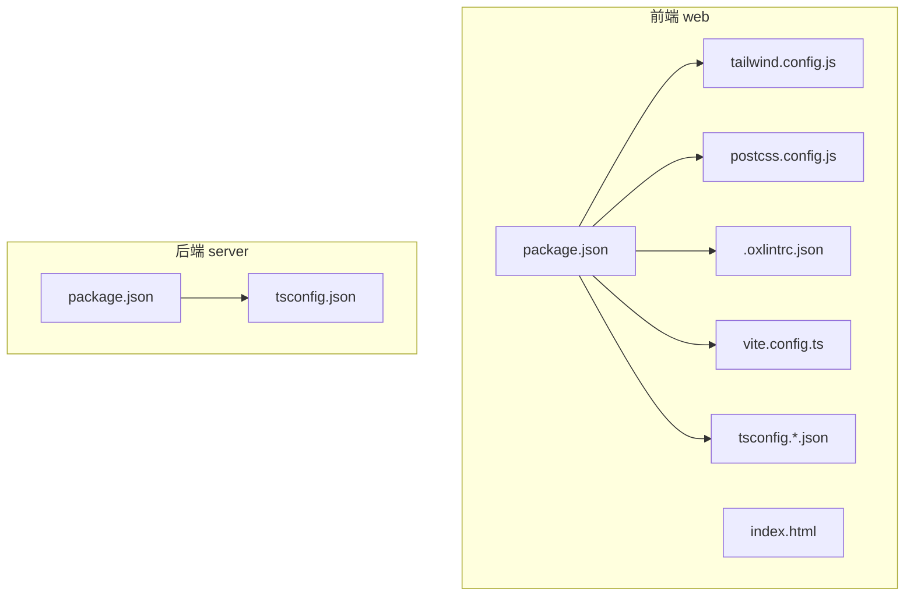
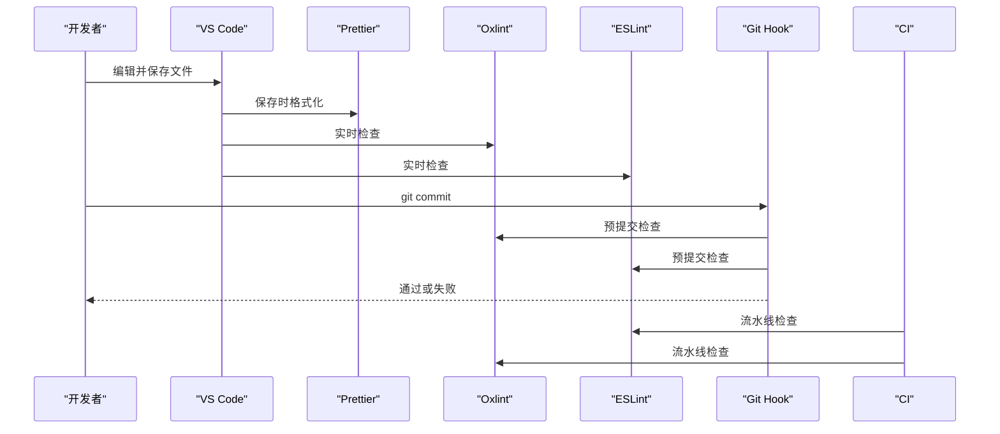
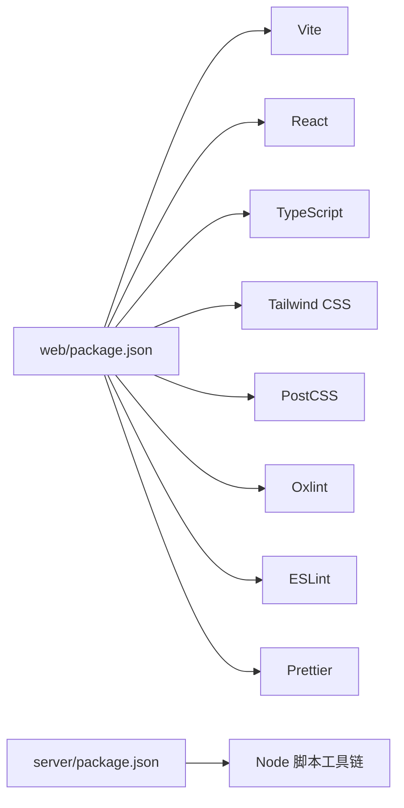

# 代码格式化工具配置

<cite>
**本文引用的文件**
- [web/package.json](file://web/package.json)
- [web/tailwind.config.js](file://web/tailwind.config.js)
- [web/postcss.config.js](file://web/postcss.config.js)
- [web/.oxlintrc.json](file://web/.oxlintrc.json)
- [server/package.json](file://server/package.json)
- [server/tsconfig.json](file://server/tsconfig.json)
- [web/vite.config.ts](file://web/vite.config.ts)
- [web/tsconfig.app.json](file://web/tsconfig.app.json)
- [web/tsconfig.node.json](file://web/tsconfig.node.json)
- [web/index.html](file://web/index.html)
</cite>

## 目录
1. [简介](#简介)
2. [项目结构](#项目结构)
3. [核心组件](#核心组件)
4. [架构总览](#架构总览)
5. [详细组件分析](#详细组件分析)
6. [依赖关系分析](#依赖关系分析)
7. [性能考虑](#性能考虑)
8. [故障排查指南](#故障排查指南)
9. [结论](#结论)
10. [附录](#附录)

## 简介
本指南面向FY200项目的团队协作，聚焦前端与后端的代码质量与一致性工具链：ESLint、Prettier、Oxlint、Tailwind CSS、IDE集成与Git钩子。目标是统一团队开发体验，降低风格分歧带来的审查成本，提升构建与提交效率。

## 项目结构
FY200为前后端分离仓库：
- web：前端（Vite + React + TypeScript + Tailwind CSS）
- server：后端（Express + Prisma + TypeScript）

图表来源
- [web/package.json](file://web/package.json)
- [web/tailwind.config.js](file://web/tailwind.config.js)
- [web/postcss.config.js](file://web/postcss.config.js)
- [web/.oxlintrc.json](file://web/.oxlintrc.json)
- [web/vite.config.ts](file://web/vite.config.ts)
- [web/tsconfig.app.json](file://web/tsconfig.app.json)
- [web/tsconfig.node.json](file://web/tsconfig.node.json)
- [web/index.html](file://web/index.html)
- [server/package.json](file://server/package.json)
- [server/tsconfig.json](file://server/tsconfig.json)

章节来源
- [web/package.json](file://web/package.json)
- [server/package.json](file://server/package.json)

## 核心组件
- ESLint：用于JavaScript/TypeScript静态检查与规则约束（前端通过Vite生态集成，后端在Node脚本中启用）。
- Prettier：统一代码风格（缩进、引号、分号、换行等），建议与ESLint冲突规则解耦。
- Oxlint：高性能JS/TS/React语法与问题检测，适合快速反馈。
- Tailwind CSS：原子化样式框架，配合PostCSS与Vite进行主题定制与响应式断点管理。
- IDE集成：VS Code扩展与保存时自动格式化、实时错误提示。
- Git钩子：提交前执行检查与格式化，保证仓库一致性。

章节来源
- [web/package.json](file://web/package.json)
- [server/package.json](file://server/package.json)

## 架构总览
下图展示从开发者编辑到提交的全链路：IDE触发保存→Prettier/Oxlint/ESLint运行→Git钩子拦截→CI阶段二次校验。

图表来源
- [web/package.json](file://web/package.json)
- [server/package.json](file://server/package.json)

## 详细组件分析

### ESLint 配置指南
- 规则集选择
  - 推荐基于官方推荐的TypeScript/React规则集，结合团队规范裁剪。
  - 前端可复用Vite模板默认配置；后端在Node脚本中按需开启。
- 自定义规则设置
  - 针对财务数据平台特性，建议开启严格类型与不可变数据相关规则，避免运行时错误。
  - 对AI生成或第三方库引入的临时文件，使用忽略策略。
- 忽略文件配置
  - 使用.gitignore与ESLint ignore机制排除构建产物、日志、测试快照等。
  - 建议在web与server分别维护各自的忽略清单，避免误报。

章节来源
- [web/package.json](file://web/package.json)
- [server/package.json](file://server/package.json)

### Prettier 配置指南
- 代码格式化规则
  - 统一缩进（推荐空格）、行宽、换行策略，确保跨编辑器一致。
- 缩进设置
  - 建议4空格缩进，保持可读性与兼容性。
- 引号使用
  - 统一单引号或双引号，避免混用导致diff噪音。
- 分号处理
  - 建议强制分号，减少隐式分号插入带来的歧义。

章节来源
- [web/package.json](file://web/package.json)
- [server/package.json](file://server/package.json)

### Oxlint 配置指南
- TypeScript支持
  - 启用TS解析与类型感知检查，结合tsconfig路径映射。
- React规则
  - 启用React最佳实践规则，如组件命名、Hooks使用规范。
- 性能优化选项
  - 利用Oxlint的高性能特性，在IDE与Git钩子中优先使用，减少阻塞。

章节来源
- [web/.oxlintrc.json](file://web/.oxlintrc.json)
- [web/package.json](file://web/package.json)

### Tailwind CSS 配置指南
- 主题定制
  - 在配置文件中定义颜色、字体、间距等设计令牌，统一视觉语言。
- 插件使用
  - 按需启用官方或社区插件，扩展功能（如动画、表单样式）。
- 响应式断点设置
  - 根据业务设备覆盖范围定义断点，确保多端一致性。

章节来源
- [web/tailwind.config.js](file://web/tailwind.config.js)
- [web/postcss.config.js](file://web/postcss.config.js)
- [web/index.html](file://web/index.html)

### IDE 集成配置
- VS Code 扩展推荐
  - Prettier、ESLint、Oxlint、Tailwind CSS IntelliSense、TypeScript/React相关扩展。
- 保存时自动格式化
  - 配置编辑器保存时调用Prettier，避免手动格式化。
- 实时错误提示
  - 启用ESLint与Oxlint的实时诊断，提高问题发现效率。

章节来源
- [web/package.json](file://web/package.json)
- [server/package.json](file://server/package.json)

### Git 钩子配置
- 提交前代码检查
  - 使用husky+lint-staged或类似方案，在commit前运行Oxlint与ESLint。
- 格式化自动执行
  - 在pre-commit阶段运行Prettier，确保提交内容风格一致。
- 分支保护与CI
  - 在CI中重复检查，防止绕过本地钩子的提交。

章节来源
- [web/package.json](file://web/package.json)
- [server/package.json](file://server/package.json)

## 依赖关系分析
前端与后端各自维护依赖，避免耦合。关键依赖包括：
- 前端：Vite、React、TypeScript、Tailwind CSS、PostCSS、Oxlint、ESLint、Prettier
- 后端：TypeScript、Node脚本工具链（可选ESLint/Oxlint/Prettier）

图表来源
- [web/package.json](file://web/package.json)
- [server/package.json](file://server/package.json)

章节来源
- [web/package.json](file://web/package.json)
- [server/package.json](file://server/package.json)

## 性能考虑
- 优先使用Oxlint进行快速检查，ESLint用于深度规则校验。
- 在IDE中仅启用必要的实时检查，避免大文件卡顿。
- 将格式化与检查任务拆分，减少提交阻塞时间。
- 合理使用忽略文件，避免扫描无关目录。

## 故障排查指南
- 常见冲突
  - Prettier与ESLint规则冲突：通过专用插件对齐规则，避免互相覆盖。
  - Oxlint与ESLint误报：调整忽略配置或关闭不相关规则。
- 定位步骤
  - 在命令行单独运行各工具，观察输出定位问题源。
  - 检查配置文件是否被其他工具覆盖或合并。
- 回滚策略
  - 保留稳定版本的配置文件与依赖锁定文件，便于回滚。

章节来源
- [web/package.json](file://web/package.json)
- [server/package.json](file://server/package.json)

## 结论
通过统一的ESLint、Prettier、Oxlint与Tailwind CSS配置，结合IDE与Git钩子，FY200项目可在团队协作中实现一致的代码风格与高质量交付。建议定期回顾规则集，随业务发展演进配置。

## 附录
- 建议的VS Code设置项（示例字段名）
  - editor.formatOnSave: true
  - editor.defaultFormatter: "Prettier"
  - eslint.enable: true
  - oxlint.enable: true
  - tailwindCSS.enable: true

章节来源
- [web/package.json](file://web/package.json)
- [server/package.json](file://server/package.json)