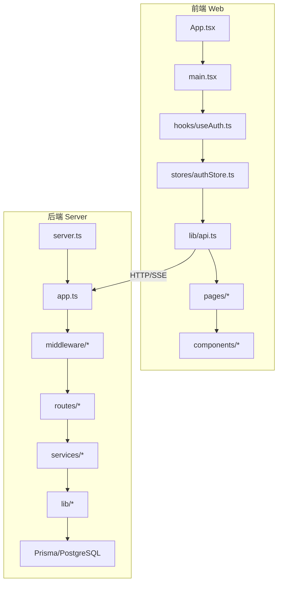
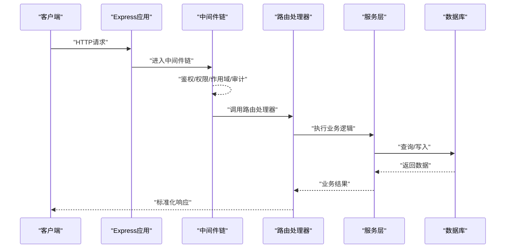
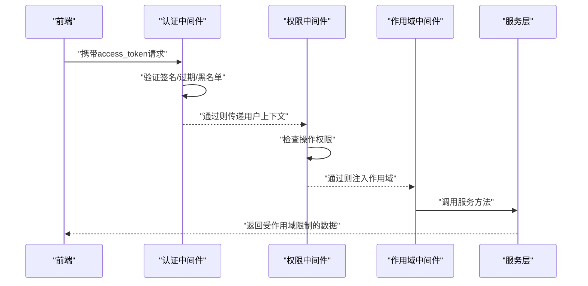
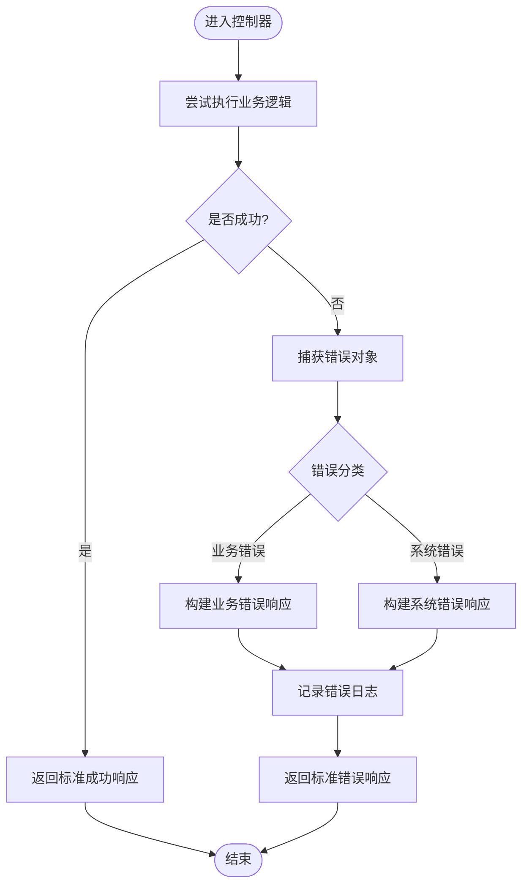
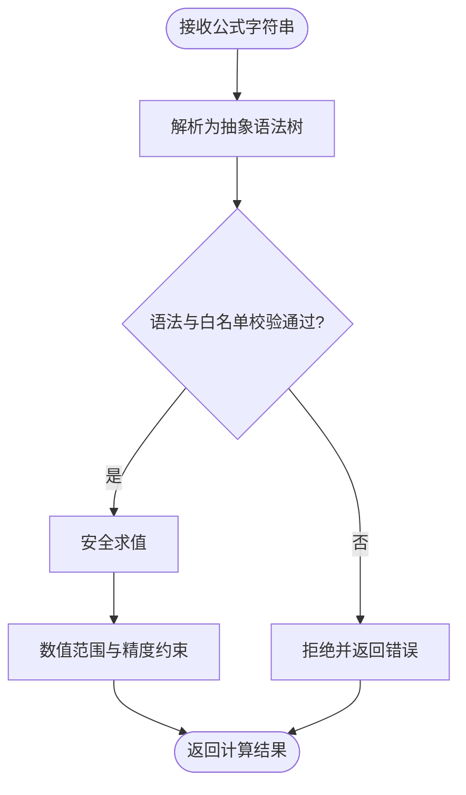
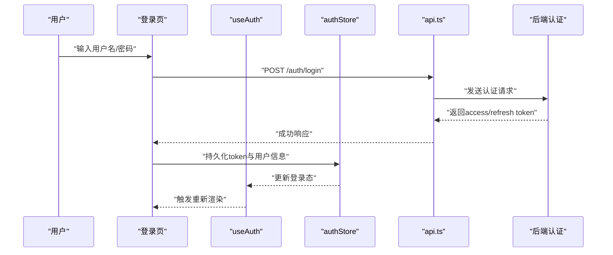
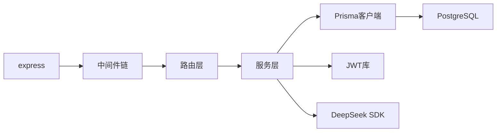

# 代码规范与最佳实践

<cite>
**本文引用的文件**   
- [server/src/app.ts](file://server/src/app.ts)
- [server/src/server.ts](file://server/src/server.ts)
- [server/src/middleware/auth.ts](file://server/src/middleware/auth.ts)
- [server/src/middleware/permission.ts](file://server/src/middleware/permission.ts)
- [server/src/middleware/scope.ts](file://server/src/middleware/scope.ts)
- [server/src/middleware/error-handler.ts](file://server/src/middleware/error-handler.ts)
- [server/src/lib/errors.ts](file://server/src/lib/errors.ts)
- [server/src/lib/response.ts](file://server/src/lib/response.ts)
- [server/src/lib/jwt.ts](file://server/src/lib/jwt.ts)
- [server/src/lib/formula.ts](file://server/src/lib/formula.ts)
- [server/src/services/AuthService.ts](file://server/src/services/AuthService.ts)
- [server/src/routes/auth.ts](file://server/src/routes/auth.ts)
- [web/src/App.tsx](file://web/src/App.tsx)
- [web/src/main.tsx](file://web/src/main.tsx)
- [web/src/hooks/useAuth.ts](file://web/src/hooks/useAuth.ts)
- [web/src/stores/authStore.ts](file://web/src/stores/authStore.ts)
- [web/src/lib/api.ts](file://web/src/lib/api.ts)
- [web/src/components/ui/button.tsx](file://web/src/components/ui/button.tsx)
- [web/src/pages/login/index.tsx](file://web/src/pages/login/index.tsx)
- [web/tailwind.config.js](file://web/tailwind.config.js)
- [web/tsconfig.json](file://web/tsconfig.json)
- [web/package.json](file://web/package.json)
- [server/package.json](file://server/package.json)
</cite>

## 目录
1. [引言](#引言)
2. [项目结构](#项目结构)
3. [核心组件](#核心组件)
4. [架构总览](#架构总览)
5. [详细组件分析](#详细组件分析)
6. [依赖分析](#依赖分析)
7. [性能考虑](#性能考虑)
8. [故障排查指南](#故障排查指南)
9. [结论](#结论)
10. [附录](#附录)

## 引言
本指南面向FY200项目的开发与维护团队，目标是统一TypeScript编码规范、React组件开发规范、命名约定、代码格式化规则以及质量保障流程。结合项目“Excel进、看板/报表出”的定位，强调类型安全、可观测性、安全性（JWT轮转、权限与范围控制）、公式计算安全与AI双管道脱敏策略。

## 项目结构
- 后端 server：Express + Prisma + PostgreSQL，中间件链严格顺序执行，服务层按领域拆分，工具库集中在 lib。
- 前端 web：React + Vite + Tailwind CSS，状态管理采用轻量 store，API 封装在 lib/api.ts，页面按功能域划分。

图表来源
- [web/src/App.tsx](file://web/src/App.tsx)
- [web/src/main.tsx](file://web/src/main.tsx)
- [web/src/hooks/useAuth.ts](file://web/src/hooks/useAuth.ts)
- [web/src/stores/authStore.ts](file://web/src/stores/authStore.ts)
- [web/src/lib/api.ts](file://web/src/lib/api.ts)
- [server/src/server.ts](file://server/src/server.ts)
- [server/src/app.ts](file://server/src/app.ts)

章节来源
- [server/src/server.ts](file://server/src/server.ts)
- [server/src/app.ts](file://server/src/app.ts)
- [web/src/main.tsx](file://web/src/main.tsx)
- [web/src/App.tsx](file://web/src/App.tsx)

## 核心组件
- 认证与授权：JWT access/refresh 轮转、黑名单校验、权限默认拒绝、作用域扩展。
- 错误处理：统一错误类型、响应包装、中间件兜底。
- 业务服务：认证、数据、指标、报表、AI代理等。
- 前端状态与API：登录态、权限、API请求封装、SSE流式响应。

章节来源
- [server/src/middleware/auth.ts](file://server/src/middleware/auth.ts)
- [server/src/middleware/permission.ts](file://server/src/middleware/permission.ts)
- [server/src/middleware/scope.ts](file://server/src/middleware/scope.ts)
- [server/src/middleware/error-handler.ts](file://server/src/middleware/error-handler.ts)
- [server/src/lib/errors.ts](file://server/src/lib/errors.ts)
- [server/src/lib/response.ts](file://server/src/lib/response.ts)
- [server/src/lib/jwt.ts](file://server/src/lib/jwt.ts)
- [server/src/services/AuthService.ts](file://server/src/services/AuthService.ts)
- [web/src/hooks/useAuth.ts](file://web/src/hooks/useAuth.ts)
- [web/src/stores/authStore.ts](file://web/src/stores/authStore.ts)
- [web/src/lib/api.ts](file://web/src/lib/api.ts)

## 架构总览
中间件执行链顺序：helmet → cors → express.json → rate-limit → auth(JWT+黑名单) → permission(默认拒绝) → scope(Prisma extension) → softDelete → audit → Service → Prisma → PostgreSQL。

图表来源
- [server/src/app.ts](file://server/src/app.ts)
- [server/src/middleware/auth.ts](file://server/src/middleware/auth.ts)
- [server/src/middleware/permission.ts](file://server/src/middleware/permission.ts)
- [server/src/middleware/scope.ts](file://server/src/middleware/scope.ts)
- [server/src/middleware/error-handler.ts](file://server/src/middleware/error-handler.ts)

## 详细组件分析

### TypeScript 编码规范
- 类型定义
  - 使用接口描述对象契约，优先使用字面量联合类型表达有限集合。
  - 对可选字段明确标注 undefined，避免隐式 any。
  - 在服务与路由之间通过共享类型保证前后端一致性。
- 接口设计
  - API 响应统一包装，包含状态码、消息与数据体。
  - 错误类型分层：业务错误、系统错误、第三方调用错误。
- 错误处理模式
  - 抛出结构化错误对象，由全局错误中间件捕获并转换为标准响应。
  - 对外暴露最小必要信息，内部记录完整上下文。

章节来源
- [server/src/lib/errors.ts](file://server/src/lib/errors.ts)
- [server/src/lib/response.ts](file://server/src/lib/response.ts)
- [server/src/middleware/error-handler.ts](file://server/src/middleware/error-handler.ts)

### React 组件开发规范
- 组件结构设计
  - 展示型组件与容器型组件分离；UI 原子组件集中在 components/ui。
  - 页面级组件按功能域组织在 pages 下，保持单一职责。
- 状态管理
  - 局部状态使用 useState/useReducer；跨组件状态使用轻量 store。
  - 异步状态通过自定义 Hook 或查询库封装，避免重复请求。
- Hooks 使用约定
  - 副作用集中到 useEffect/useEffectCleanup；避免在渲染中执行副作用。
  - 事件处理函数稳定化，必要时使用 useCallback 优化重渲染。

章节来源
- [web/src/components/ui/button.tsx](file://web/src/components/ui/button.tsx)
- [web/src/pages/login/index.tsx](file://web/src/pages/login/index.tsx)
- [web/src/hooks/useAuth.ts](file://web/src/hooks/useAuth.ts)
- [web/src/stores/authStore.ts](file://web/src/stores/authStore.ts)

### 命名约定
- 文件命名
  - 组件文件使用小写连字符命名（如 data-table.tsx），模块文件使用小写驼峰。
  - 测试文件与源文件同名并以 .test.ts/.test.tsx 结尾。
- 变量与函数命名
  - 常量全大写加下划线；布尔变量以 is/has/can 前缀；动词开头表示动作。
  - 私有成员以下划线前缀，公共 API 保持稳定语义。
- 类型与接口
  - 接口名以 I 或大写字母开头，类型别名使用 PascalCase。
  - 枚举值使用大写下划线分隔。

章节来源
- [web/src/components/data-table/data-table.tsx](file://web/src/components/data-table/data-table.tsx)
- [web/src/lib/utils.ts](file://web/src/lib/utils.ts)
- [server/src/lib/formula.ts](file://server/src/lib/formula.ts)

### 代码格式化与静态检查
- ESLint/OxLint
  - 启用严格模式，禁止隐式 any，强制类型断言显式化。
  - 统一导入排序、禁用未使用变量、强制错误处理。
- Prettier
  - 统一缩进、引号、分号、尾逗号；提交前自动格式化。
- Tailwind CSS
  - 样式类集中管理，避免内联样式；复杂布局使用组合类。
  - 主题色与间距通过配置统一管理。

章节来源
- [web/package.json](file://web/package.json)
- [web/tailwind.config.js](file://web/tailwind.config.js)
- [web/tsconfig.json](file://web/tsconfig.json)
- [server/package.json](file://server/package.json)

### 认证与授权流程
- JWT 轮转
  - access token 短期有效，refresh token 长期有效；刷新时轮换旧 refresh token。
  - 黑名单机制支持主动失效。
- 权限与作用域
  - 权限默认拒绝，白名单放行；作用域通过 Prisma extension 注入。
- 安全策略
  - 敏感信息脱敏；外部调用限流与超时控制。

图表来源
- [server/src/middleware/auth.ts](file://server/src/middleware/auth.ts)
- [server/src/middleware/permission.ts](file://server/src/middleware/permission.ts)
- [server/src/middleware/scope.ts](file://server/src/middleware/scope.ts)
- [server/src/lib/jwt.ts](file://server/src/lib/jwt.ts)
- [server/src/services/AuthService.ts](file://server/src/services/AuthService.ts)

章节来源
- [server/src/middleware/auth.ts](file://server/src/middleware/auth.ts)
- [server/src/middleware/permission.ts](file://server/src/middleware/permission.ts)
- [server/src/middleware/scope.ts](file://server/src/middleware/scope.ts)
- [server/src/lib/jwt.ts](file://server/src/lib/jwt.ts)
- [server/src/services/AuthService.ts](file://server/src/services/AuthService.ts)

### 错误处理与响应规范
- 统一错误类型
  - 业务错误包含错误码、消息与上下文；系统错误记录堆栈。
- 响应包装
  - 成功响应包含数据体；失败响应包含错误码与消息。
- 中间件兜底
  - 捕获未处理异常，返回标准错误格式并记录日志。

图表来源
- [server/src/lib/errors.ts](file://server/src/lib/errors.ts)
- [server/src/lib/response.ts](file://server/src/lib/response.ts)
- [server/src/middleware/error-handler.ts](file://server/src/middleware/error-handler.ts)

章节来源
- [server/src/lib/errors.ts](file://server/src/lib/errors.ts)
- [server/src/lib/response.ts](file://server/src/lib/response.ts)
- [server/src/middleware/error-handler.ts](file://server/src/middleware/error-handler.ts)

### 公式解析与安全计算
- 白名单算子
  - 仅允许 +-*/()，禁止 eval 与动态代码执行。
- 输入校验
  - 表达式语法树校验，防止注入与越界计算。
- 输出保护
  - 数值范围与精度控制，避免溢出与浮点误差。

图表来源
- [server/src/lib/formula.ts](file://server/src/lib/formula.ts)

章节来源
- [server/src/lib/formula.ts](file://server/src/lib/formula.ts)

### AI 双管道与脱敏
- 管道架构
  - polish：文本→脱敏→LLM→还原
  - analyze：结构化→计算→脱敏→LLM→生成
- 脱敏规则
  - 绝对金额映射为区间；公司名动态映射为占位符。
- 流式传输
  - SSE 流式返回，提升交互体验。

章节来源
- [server/src/lib/deepseek.ts](file://server/src/lib/deepseek.ts)
- [web/src/lib/ai-stream.ts](file://web/src/lib/ai-stream.ts)

### 前端登录与状态管理
- 登录流程
  - 提交凭证→后端认证→返回access/refresh token→本地持久化。
- 状态同步
  - useAuth Hook 提供登录态与权限；authStore 管理全局状态。
- API 封装
  - 统一拦截器处理token刷新与错误提示。

图表来源
- [web/src/pages/login/index.tsx](file://web/src/pages/login/index.tsx)
- [web/src/hooks/useAuth.ts](file://web/src/hooks/useAuth.ts)
- [web/src/stores/authStore.ts](file://web/src/stores/authStore.ts)
- [web/src/lib/api.ts](file://web/src/lib/api.ts)
- [server/src/routes/auth.ts](file://server/src/routes/auth.ts)

章节来源
- [web/src/pages/login/index.tsx](file://web/src/pages/login/index.tsx)
- [web/src/hooks/useAuth.ts](file://web/src/hooks/useAuth.ts)
- [web/src/stores/authStore.ts](file://web/src/stores/authStore.ts)
- [web/src/lib/api.ts](file://web/src/lib/api.ts)
- [server/src/routes/auth.ts](file://server/src/routes/auth.ts)

## 依赖分析
- 后端依赖
  - Express 中间件链强耦合于执行顺序；服务层依赖 Prisma 客户端。
  - JWT 库用于令牌签发与校验；DeepSeek SDK 用于AI调用。
- 前端依赖
  - React 生态（Vite、Tailwind）；状态管理轻量实现。
  - 网络请求封装统一处理错误与重试。

图表来源
- [server/package.json](file://server/package.json)
- [server/src/app.ts](file://server/src/app.ts)

章节来源
- [server/package.json](file://server/package.json)
- [server/src/app.ts](file://server/src/app.ts)

## 性能考虑
- 后端
  - 数据库查询索引优化；分页与投影减少数据传输。
  - 缓存热点数据；避免N+1查询。
  - 流式响应（SSE）降低首屏延迟。
- 前端
  - 组件懒加载与代码分割；图片与资源压缩。
  - 列表虚拟化；防抖与节流优化高频操作。
  - 避免不必要的重渲染；合理使用 useMemo/useCallback。
- 内存泄漏预防
  - 清理定时器与事件监听器；取消未完成的请求。
  - 避免闭包持有大对象引用；及时释放临时资源。

[本节为通用指导，不直接分析具体文件]

## 故障排查指南
- 常见问题
  - 认证失败：检查JWT签名、过期时间、黑名单。
  - 权限不足：确认权限白名单与作用域配置。
  - 公式解析错误：验证表达式语法与白名单算子。
  - 前端状态不同步：检查store更新与Hook订阅。
- 调试建议
  - 开启详细日志；追踪请求ID贯穿链路。
  - 使用浏览器开发者工具与后端日志关联定位。

章节来源
- [server/src/middleware/error-handler.ts](file://server/src/middleware/error-handler.ts)
- [server/src/lib/logger.ts](file://server/src/lib/logger.ts)
- [web/src/lib/api.ts](file://web/src/lib/api.ts)

## 结论
本指南基于FY200项目实际代码结构与实现，提供了从类型定义、组件设计、命名约定到格式化与质量保障的完整规范。遵循这些规范将显著提升代码可读性、可维护性与安全性，确保项目在快速发展中保持一致的质量基线。

## 附录
- 代码审查检查清单
  - 类型安全：无隐式 any，接口定义清晰。
  - 错误处理：所有可能失败路径均有处理。
  - 安全策略：JWT轮转、权限默认拒绝、脱敏规则生效。
  - 性能考量：无内存泄漏，查询与渲染优化到位。
  - 文档与注释：关键逻辑有注释，变更有说明。
- 质量保证流程
  - 提交前：ESLint/Prettier 检查，单元测试通过。
  - 合并前：代码审查，集成测试通过。
  - 发布前：性能基准测试，安全扫描通过。

[本节为通用指导，不直接分析具体文件]