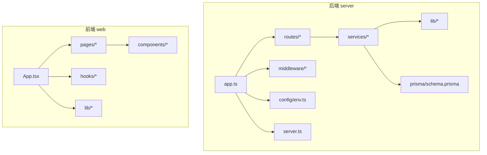
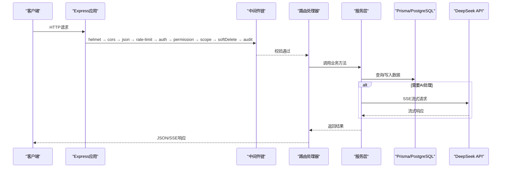
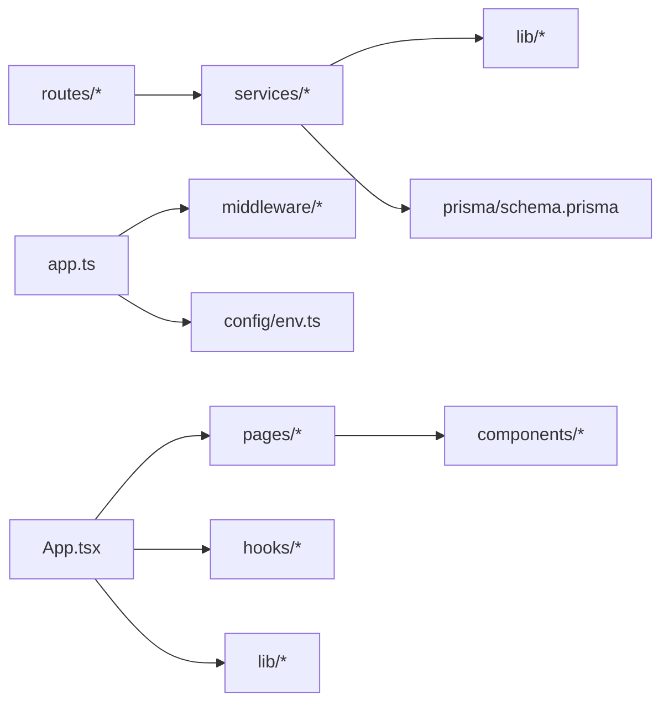

# 命名约定

<cite>
**本文引用的文件**   
- [server/src/app.ts](file://server/src/app.ts)
- [server/src/server.ts](file://server/src/server.ts)
- [server/src/config/env.ts](file://server/src/config/env.ts)
- [server/src/lib/errors.ts](file://server/src/lib/errors.ts)
- [server/src/lib/logger.ts](file://server/src/lib/logger.ts)
- [server/src/middleware/auth.ts](file://server/src/middleware/auth.ts)
- [server/src/middleware/cors.ts](file://server/src/middleware/cors.ts)
- [server/src/middleware/error-handler.ts](file://server/src/middleware/error-handler.ts)
- [server/src/routes/admin.ts](file://server/src/routes/admin.ts)
- [server/src/routes/ai.ts](file://server/src/routes/ai.ts)
- [server/src/routes/auth.ts](file://server/src/routes/auth.ts)
- [server/src/routes/dashboard.ts](file://server/src/routes/dashboard.ts)
- [server/src/routes/data.ts](file://server/src/routes/data.ts)
- [server/src/routes/indicators.ts](file://server/src/routes/indicators.ts)
- [server/src/routes/reports.ts](file://server/src/routes/reports.ts)
- [server/src/services/AdminService.ts](file://server/src/services/AdminService.ts)
- [server/src/services/AIProxyService.ts](file://server/src/services/AIProxyService.ts)
- [server/src/services/AuthService.ts](file://server/src/services/AuthService.ts)
- [server/src/services/DashboardService.ts](file://server/src/services/DashboardService.ts)
- [server/src/services/DataService.ts](file://server/src/services/DataService.ts)
- [server/src/services/FormulaRuleService.ts](file://server/src/services/FormulaRuleService.ts)
- [server/src/services/ImportService.ts](file://server/src/services/ImportService.ts)
- [server/src/services/IndicatorsService.ts](file://server/src/services/IndicatorsService.ts)
- [server/src/services/ReportService.ts](file://server/src/services/ReportService.ts)
- [server/src/services/SubjectAnalysisService.ts](file://server/src/services/SubjectAnalysisService.ts)
- [server/prisma/schema.prisma](file://server/prisma/schema.prisma)
- [web/src/App.tsx](file://web/src/App.tsx)
- [web/src/main.tsx](file://web/src/main.tsx)
- [web/src/pages/admin/index.tsx](file://web/src/pages/admin/index.tsx)
- [web/src/pages/dashboard/index.tsx](file://web/src/pages/dashboard/index.tsx)
- [web/src/pages/login/index.tsx](file://web/src/pages/login/index.tsx)
- [web/src/components/ui/button.tsx](file://web/src/components/ui/button.tsx)
- [web/src/components/layout/header.tsx](file://web/src/components/layout/header.tsx)
- [web/src/hooks/useAuth.ts](file://web/src/hooks/useAuth.ts)
- [web/src/lib/constants.ts](file://web/src/lib/constants.ts)
</cite>

## 目录
1. [引言](#引言)
2. [项目结构](#项目结构)
3. [核心组件](#核心组件)
4. [架构总览](#架构总览)
5. [详细组件分析](#详细组件分析)
6. [依赖关系分析](#依赖关系分析)
7. [性能考量](#性能考量)
8. [故障排查指南](#故障排查指南)
9. [结论](#结论)
10. [附录](#附录)

## 引言
本规范面向FY200项目的后端与前端代码，统一文件、变量、函数、类与方法、数据库与环境配置等命名约定，确保团队一致性、可读性与可维护性。项目定位为“Excel进、看板/报表出”的财年经营数据分析平台，后端采用Express + Prisma + PostgreSQL，前端采用React生态。

## 项目结构
- 后端 server：Express应用入口、路由、中间件、服务层、工具库、Prisma数据模型与迁移。
- 前端 web：页面、组件、Hooks、工具库、样式与构建配置。
- 文档 docs 与 wiki：设计规划、参考与进度报告。

**图示来源** 
- [server/src/app.ts](file://server/src/app.ts)
- [server/src/server.ts](file://server/src/server.ts)
- [server/src/config/env.ts](file://server/src/config/env.ts)
- [server/src/routes/auth.ts](file://server/src/routes/auth.ts)
- [server/src/services/AuthService.ts](file://server/src/services/AuthService.ts)
- [server/prisma/schema.prisma](file://server/prisma/schema.prisma)
- [web/src/App.tsx](file://web/src/App.tsx)
- [web/src/main.tsx](file://web/src/main.tsx)

**章节来源**
- [server/src/app.ts](file://server/src/app.ts)
- [server/src/server.ts](file://server/src/server.ts)
- [web/src/App.tsx](file://web/src/App.tsx)
- [web/src/main.tsx](file://web/src/main.tsx)

## 核心组件
- 后端路由：按领域划分（auth、admin、dashboard、data、indicators、reports、ai），文件名使用小写复数或单数名词，路径与路由名一致。
- 服务层：以业务域命名，后缀 Service，方法动词开头，参数与返回值语义清晰。
- 中间件：功能单一，命名体现职责（auth、cors、error-handler）。
- 前端页面：pages下按模块组织，index.tsx作为页面入口；组件按功能分组在components下。
- 工具与常量：lib下存放通用逻辑与常量，constants.ts集中管理常量。

**章节来源**
- [server/src/routes/auth.ts](file://server/src/routes/auth.ts)
- [server/src/services/AuthService.ts](file://server/src/services/AuthService.ts)
- [server/src/middleware/auth.ts](file://server/src/middleware/auth.ts)
- [web/src/pages/admin/index.tsx](file://web/src/pages/admin/index.tsx)
- [web/src/components/ui/button.tsx](file://web/src/components/ui/button.tsx)
- [web/src/lib/constants.ts](file://web/src/lib/constants.ts)

## 架构总览
请求从Express入口进入，依次经过安全、跨域、限流、鉴权、权限、作用域、软删除、审计等中间件，再进入路由与服务层，最终通过Prisma访问PostgreSQL。AI管道支持SSE流式响应。

**图示来源** 
- [server/src/app.ts](file://server/src/app.ts)
- [server/src/middleware/auth.ts](file://server/src/middleware/auth.ts)
- [server/src/middleware/cors.ts](file://server/src/middleware/cors.ts)
- [server/src/routes/auth.ts](file://server/src/routes/auth.ts)
- [server/src/services/AIProxyService.ts](file://server/src/services/AIProxyService.ts)
- [server/prisma/schema.prisma](file://server/prisma/schema.prisma)

## 详细组件分析

### 后端路由文件命名规则
- 文件命名：全小写，使用名词或名词短语，如 auth.ts、admin.ts、dashboard.ts、data.ts、indicators.ts、reports.ts、ai.ts。
- 路由路径：与文件名保持一致，避免冗余前缀，例如 /api/auth、/api/admin。
- 控制器风格：路由文件中直接定义HTTP处理方法，保持短小精悍，复杂逻辑下沉至服务层。

示例路径参考：
- [server/src/routes/auth.ts](file://server/src/routes/auth.ts)
- [server/src/routes/admin.ts](file://server/src/routes/admin.ts)
- [server/src/routes/dashboard.ts](file://server/src/routes/dashboard.ts)
- [server/src/routes/data.ts](file://server/src/routes/data.ts)
- [server/src/routes/indicators.ts](file://server/src/routes/indicators.ts)
- [server/src/routes/reports.ts](file://server/src/routes/reports.ts)
- [server/src/routes/ai.ts](file://server/src/routes/ai.ts)

**章节来源**
- [server/src/routes/auth.ts](file://server/src/routes/auth.ts)
- [server/src/routes/admin.ts](file://server/src/routes/admin.ts)
- [server/src/routes/dashboard.ts](file://server/src/routes/dashboard.ts)
- [server/src/routes/data.ts](file://server/src/routes/data.ts)
- [server/src/routes/indicators.ts](file://server/src/routes/indicators.ts)
- [server/src/routes/reports.ts](file://server/src/routes/reports.ts)
- [server/src/routes/ai.ts](file://server/src/routes/ai.ts)

### 服务层文件命名规则
- 文件命名：以业务域命名，后缀 Service，如 AuthService.ts、AdminService.ts、DashboardService.ts、DataService.ts、IndicatorsService.ts、ReportService.ts、AIProxyService.ts、FormulaRuleService.ts、ImportService.ts、SubjectAnalysisService.ts。
- 方法命名：动词开头，描述行为，如 create、update、delete、list、get、validate、calculate。
- 参数与返回值：参数使用具名对象或明确类型，返回值包含状态码与数据体，错误通过异常或统一响应格式返回。

示例参考：
- [server/src/services/AuthService.ts](file://server/src/services/AuthService.ts)
- [server/src/services/AdminService.ts](file://server/src/services/AdminService.ts)
- [server/src/services/DashboardService.ts](file://server/src/services/DashboardService.ts)
- [server/src/services/DataService.ts](file://server/src/services/DataService.ts)
- [server/src/services/IndicatorsService.ts](file://server/src/services/IndicatorsService.ts)
- [server/src/services/ReportService.ts](file://server/src/services/ReportService.ts)
- [server/src/services/AIProxyService.ts](file://server/src/services/AIProxyService.ts)
- [server/src/services/FormulaRuleService.ts](file://server/src/services/FormulaRuleService.ts)
- [server/src/services/ImportService.ts](file://server/src/services/ImportService.ts)
- [server/src/services/SubjectAnalysisService.ts](file://server/src/services/SubjectAnalysisService.ts)

**章节来源**
- [server/src/services/AuthService.ts](file://server/src/services/AuthService.ts)
- [server/src/services/AdminService.ts](file://server/src/services/AdminService.ts)
- [server/src/services/DashboardService.ts](file://server/src/services/DashboardService.ts)
- [server/src/services/DataService.ts](file://server/src/services/DataService.ts)
- [server/src/services/IndicatorsService.ts](file://server/src/services/IndicatorsService.ts)
- [server/src/services/ReportService.ts](file://server/src/services/ReportService.ts)
- [server/src/services/AIProxyService.ts](file://server/src/services/AIProxyService.ts)
- [server/src/services/FormulaRuleService.ts](file://server/src/services/FormulaRuleService.ts)
- [server/src/services/ImportService.ts](file://server/src/services/ImportService.ts)
- [server/src/services/SubjectAnalysisService.ts](file://server/src/services/SubjectAnalysisService.ts)

### 前端页面组件命名规则
- 页面文件：位于 pages 下，按模块组织，每个模块一个 index.tsx 作为入口，如 admin/index.tsx、dashboard/index.tsx、login/index.tsx。
- 组件文件：位于 components 下，按功能分组，组件名使用大驼峰，如 Button、Header、DataTable。
- Hooks：位于 hooks 下，命名 useXxx，如 useAuth、usePermission。
- 工具与常量：位于 lib 下，常量集中在 constants.ts，工具函数按功能命名。

示例参考：
- [web/src/pages/admin/index.tsx](file://web/src/pages/admin/index.tsx)
- [web/src/pages/dashboard/index.tsx](file://web/src/pages/dashboard/index.tsx)
- [web/src/pages/login/index.tsx](file://web/src/pages/login/index.tsx)
- [web/src/components/ui/button.tsx](file://web/src/components/ui/button.tsx)
- [web/src/components/layout/header.tsx](file://web/src/components/layout/header.tsx)
- [web/src/hooks/useAuth.ts](file://web/src/hooks/useAuth.ts)
- [web/src/lib/constants.ts](file://web/src/lib/constants.ts)

**章节来源**
- [web/src/pages/admin/index.tsx](file://web/src/pages/admin/index.tsx)
- [web/src/pages/dashboard/index.tsx](file://web/src/pages/dashboard/index.tsx)
- [web/src/pages/login/index.tsx](file://web/src/pages/login/index.tsx)
- [web/src/components/ui/button.tsx](file://web/src/components/ui/button.tsx)
- [web/src/components/layout/header.tsx](file://web/src/components/layout/header.tsx)
- [web/src/hooks/useAuth.ts](file://web/src/hooks/useAuth.ts)
- [web/src/lib/constants.ts](file://web/src/lib/constants.ts)

### 变量命名约定
- 常量：全大写加下划线分隔，如 MAX_RETRY_COUNT、DEFAULT_PAGE_SIZE。
- 变量：小驼峰，语义清晰，避免缩写，如 userName、requestTimeout。
- 布尔值：使用 is、has、can、should 等前缀，如 isAuthenticated、hasPermission、canEdit。
- 集合：复数形式，如 users、roles、permissions。

示例参考：
- [web/src/lib/constants.ts](file://web/src/lib/constants.ts)
- [server/src/config/env.ts](file://server/src/config/env.ts)

**章节来源**
- [web/src/lib/constants.ts](file://web/src/lib/constants.ts)
- [server/src/config/env.ts](file://server/src/config/env.ts)

### 函数命名规范
- 动词开头：createUser、updateRole、deleteRecord、fetchData。
- 参数描述：参数名体现用途，如 userId、roleName、pageSize。
- 返回值：明确类型，成功返回数据体，失败抛出错误或返回错误对象。
- 异步函数：使用 async/await，命名体现异步语义，如 fetchUserData、loadReports。

示例参考：
- [server/src/services/AuthService.ts](file://server/src/services/AuthService.ts)
- [server/src/services/DataService.ts](file://server/src/services/DataService.ts)
- [web/src/hooks/useAuth.ts](file://web/src/hooks/useAuth.ts)

**章节来源**
- [server/src/services/AuthService.ts](file://server/src/services/AuthService.ts)
- [server/src/services/DataService.ts](file://server/src/services/DataService.ts)
- [web/src/hooks/useAuth.ts](file://web/src/hooks/useAuth.ts)

### 类和方法命名
- 类名：大驼峰，名词或名词短语，如 AuthService、AdminService、DashboardService。
- 方法名：动词开头，描述行为，如 login、logout、getDashboard、exportReport。
- 缩写词：常用缩写可保留但需统一，如 API、URL、ID，避免自造缩写。
- 特殊字符：禁止使用，仅允许字母、数字、下划线。

示例参考：
- [server/src/services/AdminService.ts](file://server/src/services/AdminService.ts)
- [server/src/services/DashboardService.ts](file://server/src/services/DashboardService.ts)
- [server/src/services/ReportService.ts](file://server/src/services/ReportService.ts)

**章节来源**
- [server/src/services/AdminService.ts](file://server/src/services/AdminService.ts)
- [server/src/services/DashboardService.ts](file://server/src/services/DashboardService.ts)
- [server/src/services/ReportService.ts](file://server/src/services/ReportService.ts)

### 数据库相关命名
- 表名：小写复数名词，如 users、roles、reports、indicators。
- 字段名：小写下划线分隔，语义清晰，如 user_name、created_at、updated_at。
- 索引名：idx_表名_字段名，复合索引用下划线连接多个字段，如 idx_users_email_created_at。
- 外键约束：fk_引用表_字段，遵循数据库命名规范。

示例参考：
- [server/prisma/schema.prisma](file://server/prisma/schema.prisma)

**章节来源**
- [server/prisma/schema.prisma](file://server/prisma/schema.prisma)

### 环境变量与配置文件命名
- 环境变量：全大写加下划线，如 DATABASE_URL、JWT_SECRET、DEEPSEEK_API_KEY。
- 配置文件：使用 .env、.env.local、package.json、tsconfig.json 等标准命名。
- 敏感信息：不提交到版本控制，使用 .gitignore 排除。

示例参考：
- [server/src/config/env.ts](file://server/src/config/env.ts)
- [server/package.json](file://server/package.json)
- [server/tsconfig.json](file://server/tsconfig.json)

**章节来源**
- [server/src/config/env.ts](file://server/src/config/env.ts)
- [server/package.json](file://server/package.json)
- [server/tsconfig.json](file://server/tsconfig.json)

### 测试文件命名
- 测试文件：与源文件同名，后缀 .test.ts 或 .test.tsx，放在同目录或 __tests__ 子目录。
- 测试套件：describe 块按模块划分，it 块描述具体行为。
- 断言：使用 expect 进行断言，覆盖正常与异常路径。

示例参考：
- [server/src/lib/desensitize.test.ts](file://server/src/lib/desensitize.test.ts)
- [server/src/lib/excel-import.test.ts](file://server/src/lib/excel-import.test.ts)
- [server/src/lib/formula.test.ts](file://server/src/lib/formula.test.ts)
- [server/src/lib/jwt.test.ts](file://server/src/lib/jwt.test.ts)
- [server/src/lib/password.test.ts](file://server/src/lib/password.test.ts)
- [server/src/lib/period.test.ts](file://server/src/lib/period.test.ts)
- [server/src/lib/prompt-guard.test.ts](file://server/src/lib/prompt-guard.test.ts)
- [server/src/lib/sanitize.test.ts](file://server/src/lib/sanitize.test.ts)
- [server/src/middleware/auth.test.ts](file://server/src/middleware/auth.test.ts)
- [server/src/middleware/permission.test.ts](file://server/src/middleware/permission.test.ts)
- [server/src/middleware/scope.test.ts](file://server/src/middleware/scope.test.ts)
- [server/src/middleware/soft-delete.test.ts](file://server/src/middleware/soft-delete.test.ts)
- [server/src/services/AIProxyService.test.ts](file://server/src/services/AIProxyService.test.ts)
- [server/src/services/AuthService.test.ts](file://server/src/services/AuthService.test.ts)
- [server/src/services/DataService.test.ts](file://server/src/services/DataService.test.ts)
- [server/src/services/FormulaRuleService.test.ts](file://server/src/services/FormulaRuleService.test.ts)
- [server/src/services/ImportService.test.ts](file://server/src/services/ImportService.test.ts)
- [server/src/services/ReportService.test.ts](file://server/src/services/ReportService.test.ts)
- [server/src/services/SubjectAnalysisService.test.ts](file://server/src/services/SubjectAnalysisService.test.ts)
- [server/src/test/integration.test.ts](file://server/src/test/integration.test.ts)
- [web/src/components/data-table/__tests__/data-table.test.tsx](file://web/src/components/data-table/__tests__/data-table.test.tsx)
- [web/src/components/layout/__tests__/require-permission.test.tsx](file://web/src/components/layout/__tests__/require-permission.test.tsx)
- [web/src/hooks/__tests__/usePermission.test.tsx](file://web/src/hooks/__tests__/usePermission.test.tsx)

**章节来源**
- [server/src/lib/desensitize.test.ts](file://server/src/lib/desensitize.test.ts)
- [server/src/lib/excel-import.test.ts](file://server/src/lib/excel-import.test.ts)
- [server/src/lib/formula.test.ts](file://server/src/lib/formula.test.ts)
- [server/src/lib/jwt.test.ts](file://server/src/lib/jwt.test.ts)
- [server/src/lib/password.test.ts](file://server/src/lib/password.test.ts)
- [server/src/lib/period.test.ts](file://server/src/lib/period.test.ts)
- [server/src/lib/prompt-guard.test.ts](file://server/src/lib/prompt-guard.test.ts)
- [server/src/lib/sanitize.test.ts](file://server/src/lib/sanitize.test.ts)
- [server/src/middleware/auth.test.ts](file://server/src/middleware/auth.test.ts)
- [server/src/middleware/permission.test.ts](file://server/src/middleware/permission.test.ts)
- [server/src/middleware/scope.test.ts](file://server/src/middleware/scope.test.ts)
- [server/src/middleware/soft-delete.test.ts](file://server/src/middleware/soft-delete.test.ts)
- [server/src/services/AIProxyService.test.ts](file://server/src/services/AIProxyService.test.ts)
- [server/src/services/AuthService.test.ts](file://server/src/services/AuthService.test.ts)
- [server/src/services/DataService.test.ts](file://server/src/services/DataService.test.ts)
- [server/src/services/FormulaRuleService.test.ts](file://server/src/services/FormulaRuleService.test.ts)
- [server/src/services/ImportService.test.ts](file://server/src/services/ImportService.test.ts)
- [server/src/services/ReportService.test.ts](file://server/src/services/ReportService.test.ts)
- [server/src/services/SubjectAnalysisService.test.ts](file://server/src/services/SubjectAnalysisService.test.ts)
- [server/src/test/integration.test.ts](file://server/src/test/integration.test.ts)
- [web/src/components/data-table/__tests__/data-table.test.tsx](file://web/src/components/data-table/__tests__/data-table.test.tsx)
- [web/src/components/layout/__tests__/require-permission.test.tsx](file://web/src/components/layout/__tests__/require-permission.test.tsx)
- [web/src/hooks/__tests__/usePermission.test.tsx](file://web/src/hooks/__tests__/usePermission.test.tsx)

### 常见错误与避免
- 路由文件混用大小写：统一使用小写，避免混淆。
- 服务层方法名无动词：如 getUserData 而非 userData。
- 布尔变量无前缀：如 status 改为 isActive。
- 数据库字段名使用驼峰：统一改为小写下划线。
- 环境变量硬编码：移至 .env 并读取。

[本节为概念性内容，不直接分析具体文件]

## 依赖关系分析
后端模块间依赖清晰：路由依赖服务，服务依赖工具库与Prisma，中间件独立且可组合。前端模块按功能分层，页面依赖组件与Hooks，工具库被多处复用。

**图示来源** 
- [server/src/app.ts](file://server/src/app.ts)
- [server/src/routes/auth.ts](file://server/src/routes/auth.ts)
- [server/src/services/AuthService.ts](file://server/src/services/AuthService.ts)
- [server/src/lib/logger.ts](file://server/src/lib/logger.ts)
- [server/prisma/schema.prisma](file://server/prisma/schema.prisma)
- [web/src/App.tsx](file://web/src/App.tsx)
- [web/src/pages/admin/index.tsx](file://web/src/pages/admin/index.tsx)
- [web/src/components/ui/button.tsx](file://web/src/components/ui/button.tsx)
- [web/src/hooks/useAuth.ts](file://web/src/hooks/useAuth.ts)
- [web/src/lib/constants.ts](file://web/src/lib/constants.ts)

**章节来源**
- [server/src/app.ts](file://server/src/app.ts)
- [server/src/routes/auth.ts](file://server/src/routes/auth.ts)
- [server/src/services/AuthService.ts](file://server/src/services/AuthService.ts)
- [server/src/lib/logger.ts](file://server/src/lib/logger.ts)
- [server/prisma/schema.prisma](file://server/prisma/schema.prisma)
- [web/src/App.tsx](file://web/src/App.tsx)
- [web/src/pages/admin/index.tsx](file://web/src/pages/admin/index.tsx)
- [web/src/components/ui/button.tsx](file://web/src/components/ui/button.tsx)
- [web/src/hooks/useAuth.ts](file://web/src/hooks/useAuth.ts)
- [web/src/lib/constants.ts](file://web/src/lib/constants.ts)

## 性能考量
- 计算类指标实时计算，避免存储冗余数据。
- AI管道使用SSE流式响应，减少延迟。
- 中间件顺序优化，尽早拒绝非法请求。
- 数据库查询使用Prisma扩展与作用域限制，提升安全性与性能。

[本节为概念性内容，不直接分析具体文件]

## 故障排查指南
- 错误处理：统一中间件捕获异常，返回标准错误格式。
- 日志记录：使用logger记录关键操作与错误信息。
- 鉴权问题：检查JWT令牌有效期与黑名单。
- 权限问题：确认角色与权限配置是否正确。

示例参考：
- [server/src/middleware/error-handler.ts](file://server/src/middleware/error-handler.ts)
- [server/src/lib/errors.ts](file://server/src/lib/errors.ts)
- [server/src/lib/logger.ts](file://server/src/lib/logger.ts)
- [server/src/middleware/auth.ts](file://server/src/middleware/auth.ts)

**章节来源**
- [server/src/middleware/error-handler.ts](file://server/src/middleware/error-handler.ts)
- [server/src/lib/errors.ts](file://server/src/lib/errors.ts)
- [server/src/lib/logger.ts](file://server/src/lib/logger.ts)
- [server/src/middleware/auth.ts](file://server/src/middleware/auth.ts)

## 结论
本规范统一了FY200项目的命名约定，涵盖后端路由、服务层、前端页面组件、变量、函数、类与方法、数据库、环境变量与配置文件、测试文件等。遵循这些约定有助于提升代码可读性、可维护性与团队协作效率。

[本节为总结性内容，不直接分析具体文件]

## 附录
- 最佳实践：保持命名简洁明了，避免歧义。
- 工具推荐：使用ESLint与Prettier自动格式化与检查。
- 持续改进：定期回顾与更新命名规范，适应项目演进。

[本节为概念性内容，不直接分析具体文件]