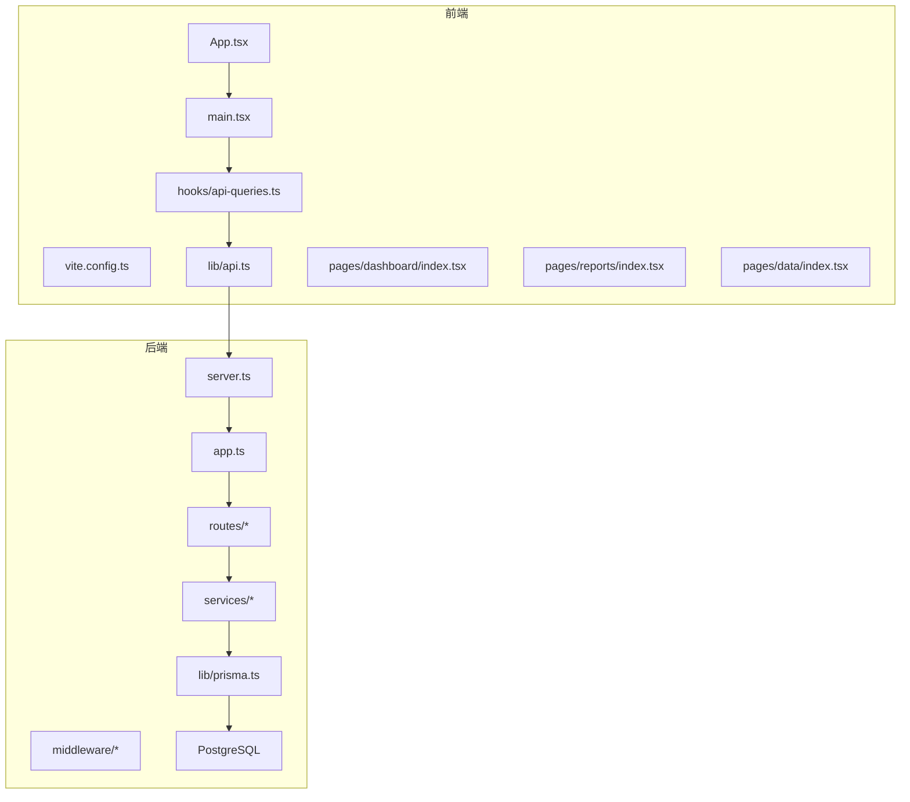
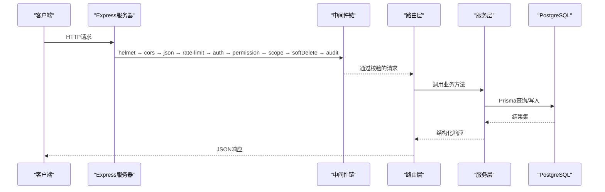
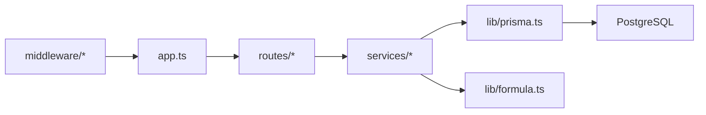

# 性能优化最佳实践

<cite>
**本文引用的文件**   
- [server/src/app.ts](file://server/src/app.ts)
- [server/src/server.ts](file://server/src/server.ts)
- [server/src/config/env.ts](file://server/src/config/env.ts)
- [server/src/lib/prisma.ts](file://server/src/lib/prisma.ts)
- [server/src/middleware/auth.ts](file://server/src/middleware/auth.ts)
- [server/src/middleware/permission.ts](file://server/src/middleware/permission.ts)
- [server/src/middleware/scope.ts](file://server/src/middleware/scope.ts)
- [server/src/middleware/rate-limit.ts](file://server/src/middleware/rate-limit.ts)
- [server/src/middleware/ai-rate-limit.ts](file://server/src/middleware/ai-rate-limit.ts)
- [server/src/middleware/error-handler.ts](file://server/src/middleware/error-handler.ts)
- [server/src/middleware/audit.ts](file://server/src/middleware/audit.ts)
- [server/src/middleware/trace-id.ts](file://server/src/middleware/trace-id.ts)
- [server/src/services/AggregationService.ts](file://server/src/services/AggregationService.ts)
- [server/src/services/DashboardService.ts](file://server/src/services/DashboardService.ts)
- [server/src/services/DataService.ts](file://server/src/services/DataService.ts)
- [server/src/services/FormulaRuleService.ts](file://server/src/services/FormulaRuleService.ts)
- [server/src/lib/formula.ts](file://server/src/lib/formula.ts)
- [server/src/lib/response.ts](file://server/src/lib/response.ts)
- [server/src/routes/dashboard.ts](file://server/src/routes/dashboard.ts)
- [server/src/routes/data.ts](file://server/src/routes/data.ts)
- [server/src/routes/reports.ts](file://server/src/routes/reports.ts)
- [server/src/routes/admin.ts](file://server/src/routes/admin.ts)
- [server/src/routes/indicators.ts](file://server/src/routes/indicators.ts)
- [server/src/routes/auth.ts](file://server/src/routes/auth.ts)
- [server/src/routes/ai.ts](file://server/src/routes/ai.ts)
- [server/prisma/schema.prisma](file://server/prisma/schema.prisma)
- [web/src/App.tsx](file://web/src/App.tsx)
- [web/src/main.tsx](file://web/src/main.tsx)
- [web/vite.config.ts](file://web/vite.config.ts)
- [web/src/hooks/api-queries.ts](file://web/src/hooks/api-queries.ts)
- [web/src/lib/api.ts](file://web/src/lib/api.ts)
- [web/src/components/data-table/pro-data-table.tsx](file://web/src/components/data-table/pro-data-table.tsx)
- [web/src/components/data-table/pagination.tsx](file://web/src/components/data-table/pagination.tsx)
- [web/src/pages/dashboard/index.tsx](file://web/src/pages/dashboard/index.tsx)
- [web/src/pages/reports/index.tsx](file://web/src/pages/reports/index.tsx)
- [web/src/pages/data/index.tsx](file://web/src/pages/data/index.tsx)
- [web/src/stores/authStore.ts](file://web/src/stores/authStore.ts)
- [web/src/lib/constants.ts](file://web/src/lib/constants.ts)
</cite>

## 目录
1. [引言](#引言)
2. [项目结构](#项目结构)
3. [核心组件](#核心组件)
4. [架构总览](#架构总览)
5. [详细组件分析](#详细组件分析)
6. [依赖关系分析](#依赖关系分析)
7. [性能考量](#性能考量)
8. [故障排查指南](#故障排查指南)
9. [结论](#结论)
10. [附录](#附录)

## 引言
本文件面向FY200项目的后端、前端与计算链路，提供系统化的性能优化最佳实践。内容覆盖数据库查询优化、索引设计、缓存策略、连接池配置；前端懒加载、图片优化、Bundle分割、内存管理；公式解析与批量/增量计算、结果缓存；API请求合并、响应压缩、分页策略、CDN使用；以及监控与分析工具（指标收集、瓶颈识别、A/B测试、用户行为分析）。文档同时给出可落地的优化案例与效果对比方法，并包含基准测试与持续监控建议。

## 项目结构
FY200采用前后端分离架构：
- 后端：Express + Prisma + PostgreSQL，中间件链严格顺序执行，服务层封装业务逻辑，路由层暴露REST API。
- 前端：React + Vite，按页面与功能模块组织组件，通过hooks与API客户端访问后端。

图表来源
- [server/src/server.ts](file://server/src/server.ts)
- [server/src/app.ts](file://server/src/app.ts)
- [web/src/App.tsx](file://web/src/App.tsx)
- [web/src/main.tsx](file://web/src/main.tsx)
- [web/vite.config.ts](file://web/vite.config.ts)

章节来源
- [server/src/server.ts](file://server/src/server.ts)
- [server/src/app.ts](file://server/src/app.ts)
- [web/src/App.tsx](file://web/src/App.tsx)
- [web/src/main.tsx](file://web/src/main.tsx)
- [web/vite.config.ts](file://web/vite.config.ts)

## 核心组件
- 中间件链：安全与限流、鉴权、权限、数据范围、软删除、审计、错误处理、追踪ID。
- 服务层：聚合计算、看板数据、数据导入导出、公式规则、报表生成等。
- 数据层：Prisma ORM与PostgreSQL，迁移与种子数据。
- 前端：页面级路由与组件、API查询Hook、状态存储、表格与分页。

章节来源
- [server/src/middleware/auth.ts](file://server/src/middleware/auth.ts)
- [server/src/middleware/permission.ts](file://server/src/middleware/permission.ts)
- [server/src/middleware/scope.ts](file://server/src/middleware/scope.ts)
- [server/src/middleware/rate-limit.ts](file://server/src/middleware/rate-limit.ts)
- [server/src/middleware/ai-rate-limit.ts](file://server/src/middleware/ai-rate-limit.ts)
- [server/src/middleware/error-handler.ts](file://server/src/middleware/error-handler.ts)
- [server/src/middleware/audit.ts](file://server/src/middleware/audit.ts)
- [server/src/middleware/trace-id.ts](file://server/src/middleware/trace-id.ts)
- [server/src/services/AggregationService.ts](file://server/src/services/AggregationService.ts)
- [server/src/services/DashboardService.ts](file://server/src/services/DashboardService.ts)
- [server/src/services/DataService.ts](file://server/src/services/DataService.ts)
- [server/src/services/FormulaRuleService.ts](file://server/src/services/FormulaRuleService.ts)
- [server/src/lib/prisma.ts](file://server/src/lib/prisma.ts)
- [server/prisma/schema.prisma](file://server/prisma/schema.prisma)
- [web/src/hooks/api-queries.ts](file://web/src/hooks/api-queries.ts)
- [web/src/lib/api.ts](file://web/src/lib/api.ts)
- [web/src/components/data-table/pro-data-table.tsx](file://web/src/components/data-table/pro-data-table.tsx)
- [web/src/components/data-table/pagination.tsx](file://web/src/components/data-table/pagination.tsx)

## 架构总览
后端请求处理遵循固定中间件顺序，确保安全性与可观测性优先，随后进入权限与数据范围控制，最终由服务层调用Prisma访问数据库。

图表来源
- [server/src/app.ts](file://server/src/app.ts)
- [server/src/middleware/auth.ts](file://server/src/middleware/auth.ts)
- [server/src/middleware/permission.ts](file://server/src/middleware/permission.ts)
- [server/src/middleware/scope.ts](file://server/src/middleware/scope.ts)
- [server/src/middleware/rate-limit.ts](file://server/src/middleware/rate-limit.ts)
- [server/src/middleware/ai-rate-limit.ts](file://server/src/middleware/ai-rate-limit.ts)
- [server/src/middleware/audit.ts](file://server/src/middleware/audit.ts)
- [server/src/lib/prisma.ts](file://server/src/lib/prisma.ts)

章节来源
- [server/src/app.ts](file://server/src/app.ts)
- [server/src/middleware/auth.ts](file://server/src/middleware/auth.ts)
- [server/src/middleware/permission.ts](file://server/src/middleware/permission.ts)
- [server/src/middleware/scope.ts](file://server/src/middleware/scope.ts)
- [server/src/middleware/rate-limit.ts](file://server/src/middleware/rate-limit.ts)
- [server/src/middleware/ai-rate-limit.ts](file://server/src/middleware/ai-rate-limit.ts)
- [server/src/middleware/audit.ts](file://server/src/middleware/audit.ts)
- [server/src/lib/prisma.ts](file://server/src/lib/prisma.ts)

## 详细组件分析

### 后端性能优化：数据库查询与索引
- 查询优化要点
  - 避免N+1：在服务层使用Prisma的include/select或批量查询，减少往返次数。
  - 选择性投影：仅返回必要字段，降低网络与序列化开销。
  - 条件过滤前置：在SQL层完成过滤与排序，避免全表扫描。
- 索引设计建议
  - 高频过滤列建立单列索引；复合查询建立复合索引，注意列顺序与选择性。
  - 对时间范围、租户/公司维度、状态枚举等常用条件建立索引。
  - 定期分析慢查询，结合EXPLAIN/AutoExplain定位缺失索引。
- 连接池配置
  - 根据CPU核数与并发峰值设置最小/最大连接数，避免过多连接导致上下文切换。
  - 合理设置超时与重试策略，防止雪崩；长事务拆分为短事务。
- 读写分离与只读副本
  - 将报表与看板类读多写少场景分流至只读副本，减轻主库压力。

章节来源
- [server/src/lib/prisma.ts](file://server/src/lib/prisma.ts)
- [server/prisma/schema.prisma](file://server/prisma/schema.prisma)

### 后端性能优化：缓存策略
- 多级缓存
  - 应用内内存缓存用于热点小数据集（如字典、配置），设置TTL与淘汰策略。
  - 分布式缓存（Redis）用于跨实例共享的热点数据（如看板汇总、指标快照）。
- 缓存键设计
  - 基于查询参数、维度、时间窗口生成稳定键，避免键爆炸。
- 失效与更新
  - 写后失效或延迟双删；对于增量计算，采用增量更新而非全量重建。
- 冷热点分层
  - 热数据常驻内存，温数据入Redis，冷数据落库归档。

章节来源
- [server/src/services/AggregationService.ts](file://server/src/services/AggregationService.ts)
- [server/src/services/DashboardService.ts](file://server/src/services/DashboardService.ts)

### 后端性能优化：连接池与限流
- 连接池
  - 依据压测结果调整min/max连接数，监控连接等待时间与活跃连接占比。
- 限流
  - 全局与AI专用限流，区分普通API与SSE流式接口，避免LLM调用打满资源。
  - 令牌桶/漏桶算法，支持IP/用户维度限流。

章节来源
- [server/src/middleware/rate-limit.ts](file://server/src/middleware/rate-limit.ts)
- [server/src/middleware/ai-rate-limit.ts](file://server/src/middleware/ai-rate-limit.ts)
- [server/src/lib/prisma.ts](file://server/src/lib/prisma.ts)

### 前端性能优化：组件懒加载与Bundle分割
- 路由级懒加载
  - 使用动态import按需加载页面组件，减少首屏体积。
- 组件级拆分
  - 大组件（如图表、表格）按需加载，避免阻塞渲染。
- Bundle分割
  - 第三方库与公共模块独立chunk，利用浏览器缓存提升重复访问速度。
- 预取与预加载
  - 对关键路径资源进行prefetch/preload，缩短交互时延。

章节来源
- [web/src/App.tsx](file://web/src/App.tsx)
- [web/src/main.tsx](file://web/src/main.tsx)
- [web/vite.config.ts](file://web/vite/config.ts)

### 前端性能优化：图片与媒体优化
- 格式与尺寸
  - 使用WebP/AVIF，按设备分辨率提供多尺寸图，启用懒加载。
- 缓存策略
  - 静态资源开启强缓存与版本化文件名，配合CDN缓存。
- 视频与动画
  - 控制帧率与码率，必要时使用Sprite或Canvas替代DOM动画。

章节来源
- [web/vite.config.ts](file://web/vite/config.ts)

### 前端性能优化：内存管理与渲染优化
- 列表与大数据
  - 虚拟滚动、分页加载、去抖/节流，避免一次性渲染大量节点。
- 状态管理
  - 合理使用持久化与惰性初始化，及时释放不再使用的订阅与定时器。
- 图表与Canvas
  - 复用上下文，按需重绘，避免频繁创建销毁对象。

章节来源
- [web/src/components/data-table/pro-data-table.tsx](file://web/src/components/data-table/pro-data-table.tsx)
- [web/src/components/data-table/pagination.tsx](file://web/src/components/data-table/pagination.tsx)
- [web/src/stores/authStore.ts](file://web/src/stores/authStore.ts)

### 计算性能优化：公式解析与批量/增量计算
- 公式解析
  - 白名单算子与AST解析，禁止eval；对复杂表达式进行缓存与编译。
- 批量计算
  - 合并多次计算为批处理，减少函数调用与锁竞争。
- 增量更新
  - 基于变更集更新结果，避免全量重算；维护物化视图或中间结果。
- 结果缓存
  - 以查询指纹为键缓存结果，设置TTL与一致性策略。

章节来源
- [server/src/lib/formula.ts](file://server/src/lib/formula.ts)
- [server/src/services/FormulaRuleService.ts](file://server/src/services/FormulaRuleService.ts)
- [server/src/services/AggregationService.ts](file://server/src/services/AggregationService.ts)

### API性能优化：请求合并、响应压缩、分页与CDN
- 请求合并
  - 同批次请求合并为一次调用，减少握手与序列化开销。
- 响应压缩
  - 启用Gzip/Brotli，针对JSON与静态资源；控制压缩阈值与线程占用。
- 分页策略
  - 游标/偏移分页，服务端限定每页大小，避免超大响应。
- CDN使用
  - 静态资源与只读数据走CDN，边缘缓存命中优先。

章节来源
- [web/src/hooks/api-queries.ts](file://web/src/hooks/api-queries.ts)
- [web/src/lib/api.ts](file://web/src/lib/api.ts)
- [web/src/components/data-table/pagination.tsx](file://web/src/components/data-table/pagination.tsx)

### 监控与分析：指标收集、瓶颈识别、A/B测试与用户行为分析
- 指标收集
  - 采集QPS、延迟分位、错误率、CPU/内存、DB连接池、缓存命中率。
- 瓶颈识别
  - 端到端追踪（Trace ID）、火焰图、慢查询日志、GC停顿分析。
- A/B测试
  - 灰度发布与实验分流，对比关键指标差异。
- 用户行为分析
  - 埋点事件、会话回放、转化漏斗，定位体验问题。

章节来源
- [server/src/middleware/trace-id.ts](file://server/src/middleware/trace-id.ts)
- [server/src/middleware/error-handler.ts](file://server/src/middleware/error-handler.ts)
- [server/src/middleware/audit.ts](file://server/src/middleware/audit.ts)

## 依赖关系分析
后端各层职责清晰，依赖方向单向向下，便于隔离与替换。

图表来源
- [server/src/app.ts](file://server/src/app.ts)
- [server/src/routes/dashboard.ts](file://server/src/routes/dashboard.ts)
- [server/src/routes/data.ts](file://server/src/routes/data.ts)
- [server/src/routes/reports.ts](file://server/src/routes/reports.ts)
- [server/src/routes/admin.ts](file://server/src/routes/admin.ts)
- [server/src/routes/indicators.ts](file://server/src/routes/indicators.ts)
- [server/src/routes/auth.ts](file://server/src/routes/auth.ts)
- [server/src/routes/ai.ts](file://server/src/routes/ai.ts)
- [server/src/services/AggregationService.ts](file://server/src/services/AggregationService.ts)
- [server/src/services/DashboardService.ts](file://server/src/services/DashboardService.ts)
- [server/src/services/DataService.ts](file://server/src/services/DataService.ts)
- [server/src/services/FormulaRuleService.ts](file://server/src/services/FormulaRuleService.ts)
- [server/src/lib/formula.ts](file://server/src/lib/formula.ts)
- [server/src/lib/prisma.ts](file://server/src/lib/prisma.ts)

章节来源
- [server/src/app.ts](file://server/src/app.ts)
- [server/src/routes/dashboard.ts](file://server/src/routes/dashboard.ts)
- [server/src/routes/data.ts](file://server/src/routes/data.ts)
- [server/src/routes/reports.ts](file://server/src/routes/reports.ts)
- [server/src/routes/admin.ts](file://server/src/routes/admin.ts)
- [server/src/routes/indicators.ts](file://server/src/routes/indicators.ts)
- [server/src/routes/auth.ts](file://server/src/routes/auth.ts)
- [server/src/routes/ai.ts](file://server/src/routes/ai.ts)
- [server/src/services/AggregationService.ts](file://server/src/services/AggregationService.ts)
- [server/src/services/DashboardService.ts](file://server/src/services/DashboardService.ts)
- [server/src/services/DataService.ts](file://server/src/services/DataService.ts)
- [server/src/services/FormulaRuleService.ts](file://server/src/services/FormulaRuleService.ts)
- [server/src/lib/formula.ts](file://server/src/lib/formula.ts)
- [server/src/lib/prisma.ts](file://server/src/lib/prisma.ts)

## 性能考量

### 数据库查询优化与索引设计
- 常见模式
  - 聚合查询：GROUP BY + HAVING，尽量在索引上完成过滤与排序。
  - 关联查询：避免深层JOIN，必要时物化中间结果。
  - 时间序列：按时间分区或归档历史数据，提升查询效率。
- 索引策略
  - 复合索引顺序遵循“等值在前、范围在后”的原则。
  - 对高基数列建立唯一索引，避免重复扫描。
- 连接池调优
  - 根据并发与RT目标设定max连接数，监控连接等待队列长度。
  - 长事务拆分，避免持有连接过久。

章节来源
- [server/src/lib/prisma.ts](file://server/src/lib/prisma.ts)
- [server/prisma/schema.prisma](file://server/prisma/schema.prisma)

### 缓存策略与结果缓存
- 热点数据
  - 看板KPI、指标快照、字典表缓存到内存/Redis，TTL按业务周期设置。
- 一致性
  - 写后失效、版本号或布隆过滤器防穿透。
- 容量规划
  - 预估热点规模，设置LRU/LFU淘汰策略，避免OOM。

章节来源
- [server/src/services/AggregationService.ts](file://server/src/services/AggregationService.ts)
- [server/src/services/DashboardService.ts](file://server/src/services/DashboardService.ts)

### 前端懒加载、图片优化与Bundle分割
- 路由级懒加载
  - 将非首屏页面按需加载，显著降低初始包体。
- 图片优化
  - WebP/AVIF、懒加载、CDN缓存，减少带宽与首屏时间。
- Bundle分割
  - 第三方库独立chunk，利用HTTP/2多路复用提升加载效率。

章节来源
- [web/src/App.tsx](file://web/src/App.tsx)
- [web/vite.config.ts](file://web/vite/config.ts)

### 计算性能优化：公式解析、批量与增量
- 公式解析
  - AST解析与白名单算子，避免危险函数调用；对常用表达式进行编译缓存。
- 批量计算
  - 合并多次计算任务，减少锁与调度开销。
- 增量更新
  - 基于变更集更新结果，避免全量重算；维护中间态。

章节来源
- [server/src/lib/formula.ts](file://server/src/lib/formula.ts)
- [server/src/services/FormulaRuleService.ts](file://server/src/services/FormulaRuleService.ts)
- [server/src/services/AggregationService.ts](file://server/src/services/AggregationService.ts)

### API性能优化：合并、压缩、分页与CDN
- 请求合并
  - 同一生命周期内的多个请求合并为一次调用，降低握手成本。
- 响应压缩
  - Gzip/Brotli压缩，阈值与线程池需权衡CPU与带宽。
- 分页策略
  - 游标分页优于偏移分页，避免深翻页性能退化。
- CDN使用
  - 静态资源与只读数据走CDN，提高命中率与就近分发。

章节来源
- [web/src/hooks/api-queries.ts](file://web/src/hooks/api-queries.ts)
- [web/src/lib/api.ts](file://web/src/lib/api.ts)
- [web/src/components/data-table/pagination.tsx](file://web/src/components/data-table/pagination.tsx)

### 监控与分析：指标、瓶颈、A/B与行为分析
- 指标体系
  - 服务端：QPS、P95/P99延迟、错误率、CPU/内存、DB连接池、缓存命中率。
  - 前端：FCP/LCP、TTI、JS堆大小、网络瀑布图。
- 瓶颈识别
  - Trace ID串联全链路；火焰图定位热点函数；慢查询日志与EXPLAIN分析。
- A/B测试
  - 灰度发布与实验分流，对比转化率与稳定性。
- 用户行为分析
  - 埋点事件、会话回放、漏斗分析，定位体验断点。

章节来源
- [server/src/middleware/trace-id.ts](file://server/src/middleware/trace-id.ts)
- [server/src/middleware/error-handler.ts](file://server/src/middleware/error-handler.ts)
- [server/src/middleware/audit.ts](file://server/src/middleware/audit.ts)

## 故障排查指南
- 常见问题定位
  - 慢查询：查看慢日志与EXPLAIN，补充索引或改写SQL。
  - 连接池耗尽：检查长事务与未释放连接，调整max连接数。
  - 缓存击穿：增加互斥锁与预热，设置合理TTL。
  - 前端内存泄漏：检查未清理的订阅、定时器、事件监听。
- 诊断工具
  - 服务端：APM、火焰图、GC日志、DB慢查询。
  - 前端：Performance面板、Memory快照、Network瀑布图。
- 恢复策略
  - 快速降级：关闭非核心功能，回滚变更，扩容实例。

章节来源
- [server/src/middleware/error-handler.ts](file://server/src/middleware/error-handler.ts)
- [server/src/middleware/trace-id.ts](file://server/src/middleware/trace-id.ts)
- [server/src/middleware/audit.ts](file://server/src/middleware/audit.ts)

## 结论
通过系统化的数据库与索引优化、合理的缓存与连接池配置、前端懒加载与Bundle分割、公式解析与增量计算、API合并与压缩、以及完善的监控与分析体系，FY200可在高并发与大数据量场景下保持稳定与高性能。建议持续进行压测与回归，形成闭环的性能治理机制。

## 附录

### 性能基准测试方法
- 后端压测
  - 工具：wrk/k6/JMeter，模拟真实负载曲线，关注P95/P99与错误率。
  - 指标：吞吐、延迟、CPU/内存、DB连接池、缓存命中率。
- 前端基准
  - Lighthouse/WebPageTest，评估FCP/LCP/TTI与包体大小。
  - 内存快照与堆比较，定位泄漏。
- 持续监控
  - 接入APM与日志平台，设置告警阈值与自动扩缩容。

[本节为通用指导，不直接分析具体文件]

### 优化案例与效果对比
- 内存泄漏检测
  - 现象：长时间运行后RSS持续增长。
  - 措施：定位未释放订阅与定时器，重构事件生命周期。
  - 效果：RSS稳定，GC频率下降。
- CPU使用率优化
  - 现象：高峰期CPU飙升。
  - 措施：热点函数优化、批量计算、缓存命中提升。
  - 效果：CPU峰值下降，延迟改善。
- 网络请求优化
  - 现象：首屏加载慢。
  - 措施：路由懒加载、图片优化、请求合并、CDN缓存。
  - 效果：LCP显著降低，带宽节省。

[本节为通用指导，不直接分析具体文件]